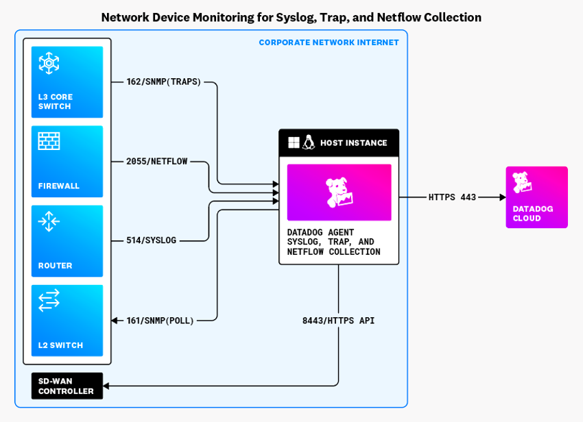
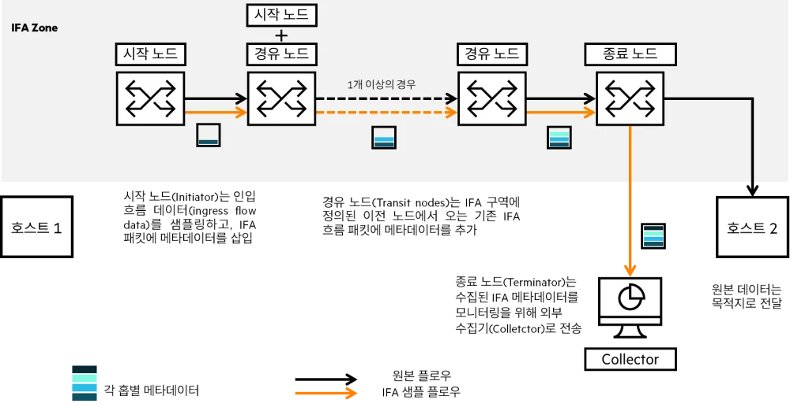
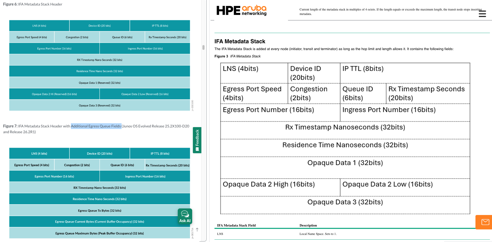
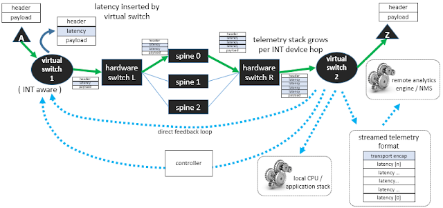
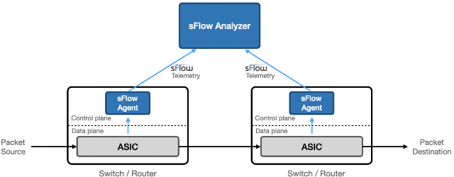

[CloudNet@](https://gasidaseo.notion.site/CloudNet-Blog-c9dfa44a27ff431dafdd2edacc8a1863)에서 AI Datacenter Network Study(이하, AIDN) 마지막에는 AI 데이터센터 네트워크와 스토리지, 그리고 이에 대한 모니터링을 다뤄주셨습니다.  

네트워크 모니터링만 짧게 요약하면, 탐지하기 어려운 마이크로버스트(Microburst) 문제를 해결하기 위해,  
Streaming Telemetry, IFA(In-band Flow Analyzer) 등 다양하게 수집하여 네트워크 상태를 실시간으로 감시하고 분석하는 것이 중요하다는 내용이었고,  
이 많은 실시간 메트릭을 분석하는데 AI Agent를 활용할 시 유용할 수 있다는 내용이었습니다.  

## 1. 기존의 네트워크 장비 모니터링  

글로서 주저리 쓰기 전에 Datadog에서 한 눈에 보기 쉽게 정리한 그림이 있어 가져왔습니다.  

  
> Image Referenced from [Datadog](https://docs.datadoghq.com/network_monitoring/devices/setup#how-it-works/)  

SD-WAN 콘트롤러 조회는 제외하고 간단히 짚고 넘어가면,  
3가지 방식 있고, SNMP에는 폴링(Polling) 방식과 푸시(Push 혹은 Trap) 방식이 있습니다.  
제 경험을 바탕으로 하면요.  

그림의 화살표가 다른 방향으로 되어있는 것과 같이  

- Polling: SNMP
- Push: SNMP Trap, Syslog, NetFlow/sFlow

| 구분 | 핵심 의미 | 활용 |  
| --- | --- | --- |  
| SNMP Polling | 주기적으로 장비 상태 조회 | 몇 초/몇 분마다 카운터 확인 |
| SNMP Trap | 임계치 초과 시 이벤트 알림 | CPU 높음, PFC 과다 같은 알람 |
| Syslog | 장비 로그 수집 | critical/fatal/interface error 확인 |  
| NetFlow/sFlow | 장비를 통과하는 트래픽의 흐름·통계 수집 | 출발지·목적지, 포트, 프로토콜, 트래픽량 및 상위 통신 주체 분석 |  

이렇게 요약됩니다.  

### SNMP(Simple Network Management Protocol)  

사실... 모니터링 주제란 걸 보고 이 부분은 좀 이해가 되겠지! 싶었는데 음 역시.  

SNMP는 라우터, 스위치, 프린터, CCTV, UPS 등 IP 네트워크에 연결된 다양한 장비들의 상태를 중앙에서 원격으로 모니터링하고 관리하기 위한 인터넷 표준 프로토콜입니다.  

OID(Object Identifier)랑 MIB(Management Information Base)를 기반으로 장비의 상태를 확인하도록 설정하고요.  

그 중 Trap은 주로 아래의 목적으로 장비에 임계치를 지정하여 외부의 모니터링 에이전트(Collector)가 받도록 장비가 전송합니다.  

- 인터페이스 Link Down/Up
- 장비 재부팅
- 전원공급장치 장애
- 팬 고장
- 온도 임계치 초과
- 인증 실패
- 라우팅 프로토콜 인접 관계 변경

### NetFlow/sFlow

NetFlow 도 조금만 파보면, 아래와 같이 역사와 함께 표준화가 이뤄졌습니다.  

| 구분 | NetFlow v5 | NetFlow v9 | IPFIX |
| --- | --- | --- | --- |
| 개발·표준화 | Cisco | Cisco | IETF 국제표준 |
| 데이터 구조 | 고정 형식 | 템플릿 기반 | 템플릿 기반 |
| 확장성 | 낮음 | 높음 | 매우 높음 |
| IPv6 | 지원하지 않음 | 지원 | 지원 |
| 벤더 범위 | 주로 Cisco 계열 | 여러 벤더에서 지원 | 벤더 중립적 |
| 일반적인 전송 | UDP | 주로 UDP | UDP·TCP·SCTP |
| 관계 | 초기 고정형 규격 | IPFIX의 기반 | NetFlow v9을 바탕으로 표준화 |

Datadog에서는 NetFlow/sFlow 모니터링에 대해 NetFlow Monitoring이라고 묶어 부르긴 하는데,  
sFlow v5는 패킷 일부의 **헤더**를 샘플링하고 인터페이스 카운터를 주기적으로 전송하여 전체 트래픽을 추정하는 프로토콜이라고 합니다.  

장비가 전송하는 데이터가 서로 다른 느낌  

|구분|sFlow|NetFlow/IPFIX|
|---|---|---|
|패킷 샘플링|일반적으로 사용|선택적으로 사용 가능|
|장비가 내보내는 핵심 데이터|선택된 패킷의 헤더|집계된 Flow 레코드|
|Flow 상태 유지|일반적으로 하지 않음|Flow 캐시·카운터 유지|
|인터페이스 카운터|프로토콜 구성에 포함|보통 SNMP 등으로 별도 수집|
|Collector의 역할|샘플을 분류·집계하여 트래픽 추정|장비가 만든 Flow 레코드를 수집·분석|
|작은 통신|샘플에 없으면 관찰 불가|비샘플링이면 기록 가능하고, 샘플링하면 누락 가능|
|통신 시작·종료 시간|패킷 샘플만으로는 정확히 알기 어려움|Flow 레코드에 포함 가능|

## 2. 마이크로버스트 측정 문제  

앞서 말한 기존의 네트워크 장비 모니터링에서 눈치를 챘을 수도 있는데  
샘플링, 주기적 폴링 등으로 인해 AI 혹은 ML Fabric에서 발생하는 밀리초, 마이크로초 (혹은 나노초) 사이에 이뤄지는 장애를 놓칠 수 있다고 합니다.  

제가 이해한 거로는 초단위 간격 사이의 Window를 놓치기 때문에 마이크로버스트 문제와 같이 유의미한 이벤트를 놓칠 수 있다는 것 같습니다.  

### 마이크로버스트 문제  

마이크로버스트(Microburst)는 아주 짧은 시간 동안 여러 패킷이 특정 출력 포트로 한꺼번에 몰리는 현상을 의미한다고 합니다.  

```text
일반적인 마이크로버스트 발생
→ 출력 속도보다 패킷 유입 속도가 빨라짐
→ 출력 큐에 패킷 적재
→ 큐 사용량과 대기시간 증가
→ 설정에 따라 ECN Mark(마킹) 또는 PFC Pause(손실방지)로 완화 시도
→ 버퍼가 끝까지 차면 Tail Drop 
```

- ECN(Explicit Congestion Notification) Mark: 혼잡 상태를 나타내는 신호를 패킷 헤더에 표시하는 방식.
- PFC(Priority Flow Control) Pause: 특정 우선순위의 트래픽을 일시적으로 중단시키는 혼잡 제어 방식.
- Tail Drop: 큐가 가득 찬 상태에서 새로 도착한 패킷을 큐의 끝에서 폐기하는 혼잡 제어 방식.  

```text
입력 1 (100Gbps) ─┐
입력 2 (100Gbps) ─┼─→ 출력 포트 하나 (100Gbps)
입력 3 (100Gbps) ─┘
```

찰나의 순간에 처리되지 않는 패킷이 버퍼에 쌓이며, 초단위 평균 통계에서는 사용률이 낮아지지만  
실제 마이크로초·밀리초 단위로는 혼잡(Congestion) 상태가 발생할 수 있습니다.  

### PFC Pause 부작용  

- 혼잡이 이전 홉으로 전파
- Head-of-Line Blocking: 큐 맨 앞의 패킷이 막히면서, 그 뒤에 있는 정상적으로 전송 가능한 패킷도 막힘  
- Pause Storm: 지나치게 많이 또는 지속적으로 발생해 네트워크 여러 구간의 송신이 반복적으로 중단  
- PFC Deadlock: 서로에게 Pause를 보내면서, 어느 쪽도 패킷을 전송하지 못해 영구적 또는 장시간 정지  
- 한 Flow의 혼잡이 다른 Flow에 영향 (802.1p Priority/Traffic Class 단위)  
  : 이건 찾아보니, 하나의 Priority 그룹이 Pause 되면, 혼잡 원인의 Flow와 상관없는 다른 Flow도 Pause 되는 것을 말함  

~~음... 역시 네트워크, 어렵네요.~~  

## 3. AI Datacenter Network 에서의 모니터링  

관련해서 스터디 내에서 Telemetry란 용어 빼고 모르는 단어들이 슈슈슉 많이 나왔었는데요.  
결론은 인터페이스 사용량 지표 뿐만이 아니라 더 봐야한다는 것 같습니다.  

- 고주기 Streaming Telemetry
- 큐 깊이·버퍼 사용량 텔레메트리
- In-band Network Telemetry
- 하드웨어 타임스탬프
- 패킷 캡처 및 TAP(Test Access Point)
- 스위치 ASIC의 마이크로버스트 감지 기능  

위 내용은 생성형 AI가 짚어준 거고요...  

스터디에서 나왔던 내용은 버퍼 큐와 그와 관련된 지표들을 더 수집해야하는 것 같습니다.  

| 지표 | 의미 | 용도 |
| --- | --- | --- |
| Egress buffer utilization | egress queue/buffer 사용률 | congestion의 직접 신호 |
| Shared vs dedicated buffer | 공유/전용 버퍼 사용 추세 | 특정 queue가 buffer를 잠식하는지 확인 |
| Latency changes | leaf 간 latency 변화 | fabric 전체 지연 일관성 확인 |
| Bandwidth utilization | leaf-spine, spine-leaf 사용률 | 특정 spine 과부하 확인 |
| Application flows | sFlow/IPFIX 기반 flow 분석 | elephant flow, low entropy flow 확인 |
| PFC stats | PFC XOFF/pushback | lossless fabric 위험 신호 |
| ECN stats | ECN marking 증가 | DCQCN rate control 유발 |
| Frame loss | queue별 frame loss | packet drop 원인 분석 |
| Mirroring on drop | drop packet 복제 | 어떤 packet이 왜 drop됐는지 확인 |

스터디에서는 3개로 분류  

| 구분 | 설명 | 활용 |
| --- | --- | --- |
| Streaming Telemetry | gRPC/gNMI 기반 장비 push | 촘촘한 주기로 메트릭* 수집 |  
| Real-time Monitoring | 실시간 메트릭* 분석 | 트래픽 엔지니어링, 소스 차단, job 재시작 검토 |
| IFA* | telemetry 정보 삽입 | AI Fabric의 병목 위치 식별을 위한 enrichment |

- Streaming Telemetry 메트릭: queue, buffer, interface, FIB/RIB, TCAM, CPU/memory  
- Real-time Monitoring 메트릭: PFC, ECN, queue drop, tail latency, fat flow, entropy 분석
- IFA(In-band Flow Analyzer) 패킷 또는 cloned probe에 metadata 삽입  
  (hop별 latency, queue ID, congestion, port 정보를 수집)  

### IFA(In-band Flow Analyzer)  

IFA는 패킷에 metadata를 삽입하여, 패킷이 지나가는 경로에서 hop별 latency, queue ID, congestion, port 정보 등을 수집하는 기술로 이를 통해 AI Fabric의 병목 위치를 식별하고, 트래픽 엔지니어링 및 문제 해결에 활용할 수 있다고 합니다.  

홉이 늘어나면 패킷에 삽입되는 metadata도 늘어나지 않을까 싶긴한데, 그보다 플로우의 경로를 추적하는데 초점을 둔 듯합니다.  


> Image Referenced from [루바루바의 엣지있는 네트워크 이야기](https://egstory.net/%eb%84%a4%ed%8a%b8%ec%9b%8c%ed%81%ac-%ec%b5%9c%ec%a0%81%ed%99%94-%ec%a7%84%eb%8b%a8%ec%9d%84-%ec%9c%84%ed%95%9c-%ed%98%81%ec%8b%a0%ec%a0%81%ec%9d%b8-%ec%84%a0%eb%8f%84-%ea%b8%b0%ec%88%a0-ifa-in-ba/)

IFA2.0 Metadata Stack 기준  
왼쪽은 Juniper, 오른쪽은 HPE의 자료인데 메타데이터가 얼추 같아보이면서도  
Additional Egress Queue Fields 가 Juniper에는 있고, HPE에는 없는 걸 보면  
벤더별로 차이가 있는 것 같아서 장비간 호환이 타지 않을까란 생각을 해봤습니다.  

  
> Image Referenced from [Juniper](https://www.juniper.net/documentation/us/en/software/junos/flow-monitoring/topics/topic-map/ifa2.0-probe-for-real-time-performance-monitoring.html) and [HPE](https://arubanetworking.hpe.com/techdocs/AOS-CX/10.15/HTML/monitoring_8100-83xx-9300-10000/Content/Chp_IFA/ifa-process.htm)

## 8. INT(In-band Network Telemetry)  

sFlow 홉 측정 관련해서 찾다가 나온 개념이라 메모만  

### 전통적인 INT(In-band Network Telemetry)

2021년 포스팅 기준, 전통적인 INT는 스위치를 통과할 때마다 패킷 헤더에 정보를 계속 추가


> Image Referenced from [sFlow](https://blog.sflow.com/2021/03/in-band-network-telemetry-int.html)

```text
송신지
  → Ingress 스위치: INT 헤더 삽입
  → 중간 스위치: 자신의 측정값 추가
  → Egress 스위치: INT 헤더 제거·수집
  → Analyzer로 전달
```  

헤더 증가로 MTU에 영향을 줄 가능성이 있음  

### out-of-band alternative (sFlow)

sFlow는 패킷 내에 INT 헤더를 삽입하지 않고, 스위치에서 샘플링된 패킷의 일부와 인터페이스 카운터를 sFlow Collector로 전송


> Image Referenced from [sFlow](https://blog.sflow.com/2021/03/in-band-network-telemetry-int.html)  

샘플 패킷에 ASIC 측정 메타데이터를 결합해 별도의 sFlow 스트림으로 분석기에 보내는 방식  

| 구분 | 전통적인 INT | 링크의 sFlow 확장 방식 |
| --- | --- | --- |
| 측정 정보 위치 | 실제 전달 패킷 내부 | 샘플 복사본의 메타데이터 |
| 경로별 측정 | 각 홉이 INT 헤더에 추가 | 스위치가 자신의 측정값을 sFlow로 내보냄 |
| 실제 패킷 변경 | 변경함 | 변경하지 않음 |
| MTU 영향 | 헤더 증가로 발생 가능 | 실제 패킷에는 없음 |
| 분석 주체 | INT Collector/Analyzer | sFlow Analyzer |
| 데이터 특성 | 패킷별 또는 선택된 패킷별 INT | 샘플링된 패킷 기반 |  

- ASIC: Application-Specific Integrated Circuit, 특정 용도에 맞게 설계된 집적회로  

## 9. References

- [Datadog - Network Device Monitoring](https://docs.datadoghq.com/network_monitoring/devices/setup#how-it-works/)  
- [루바루바의 엣지있는 네트워크 이야기 - 네트워크 최적화, 진단을 위한 혁신적인 선도 기술 – IFA (In-band Flow Analyzer)](https://egstory.net/%eb%84%a4%ed%8a%b8%ec%9b%8c%ed%81%ac-%ec%b5%9c%ec%a0%81%ed%99%94-%ec%a7%84%eb%8b%a8%ec%9d%84-%ec%9c%84%ed%95%9c-%ed%98%81%ec%8b%a0%ec%a0%81%ec%9d%b8-%ec%84%a0%eb%8f%84-%ea%b8%b0%ec%88%a0-ifa-in-ba/)
- [Juniper - Inband Flow Analyzer 2.0](https://www.juniper.net/documentation/us/en/software/junos/flow-monitoring/topics/topic-map/ifa2.0-probe-for-real-time-performance-monitoring.html)
- [HPE - Inband Flow Analyzer Packet Headers](https://arubanetworking.hpe.com/techdocs/AOS-CX/10.15/HTML/monitoring_8100-83xx-9300-10000/Content/Chp_IFA/ifa-process.htm)
- [sFlow - In-band Network Telemetry (INT)](https://blog.sflow.com/2021/03/in-band-network-telemetry-int.html)
