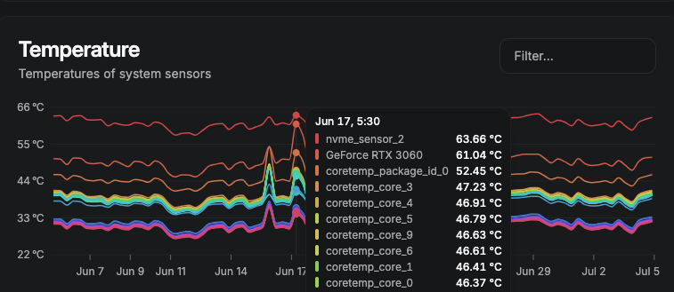
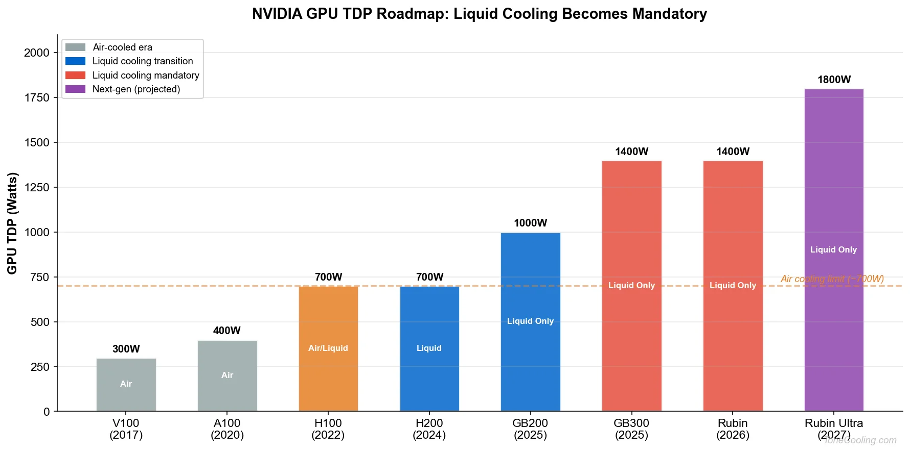
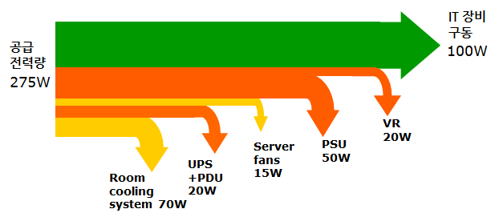
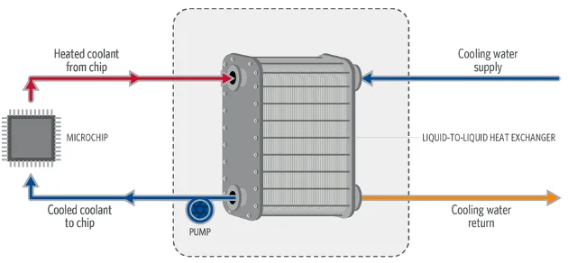
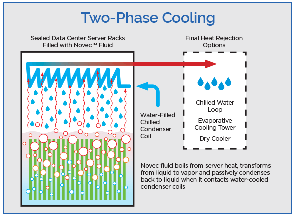
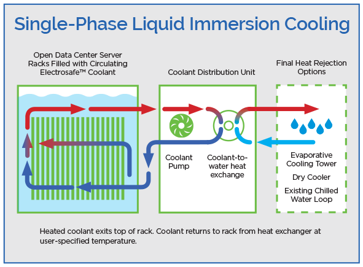
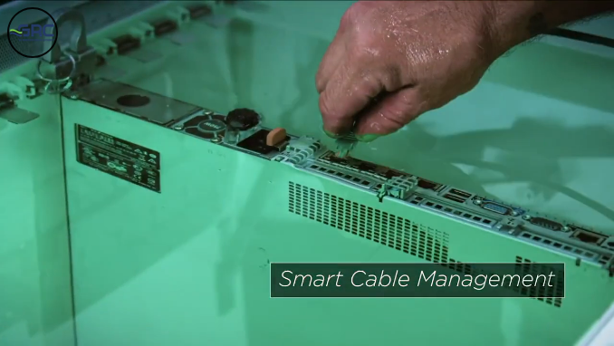

[CloudNet@](https://gasidaseo.notion.site/CloudNet-Blog-c9dfa44a27ff431dafdd2edacc8a1863)에서 진행하고 있는 AI Datacenter Network Study(이하, AIDN)에서 데이터센터 전원(전력)과 냉각에 대한 부분을 다뤄주셨습니다.  

게임용으로 하던, `웹`개발을 하던, 영화를 보던, 컴퓨터를 쓰게 되면 전력 소모와 발열은 별개가 아닌 함께 발생하는 이슈라는 것은... 누구든 직관적으로 체득하는 부분이지요.  

~~저 또한 밀실에서 불타고 있는 서버 현황을 보며, 저 아이는 대체 어떻게 도와줘야할까 고민만 깊어집니다~~  

  
> 적당히 차 우려먹기 좋아보이는 온도  

일반 그래픽카드를 쓰고 있긴 하지만, 저도 체감되는 부분이 있는지라  
적당히 트렌드를 찾아보고 앞으로의 GPU TDP(Thermal Design Power)와 냉각에 대한 부분을 끄적여봅니다.  

---  

## 1. NVIDIA GPU 전원  

- GPU 패키지 기준, Blackwell은 1000~1400W, Rubin은 1400~1600W (최대치는 Rubin Ultra 추정치)  
- 참고로 일반 그래픽카드 RTX3090은 350W, RTX4090은 450W, RTX5090은 600W TDP

> Image Referenced from [ToneCooling](https://tonecooling.com/nvidia-rubin-gpu-cooling-challenges/)  

- 물론 컴퓨팅 자원을 위한 냉각팬, UPS, PSU에 필요한 전원도 반영하게되면, 설계되어야할 공급 전력은 더 커지게 될 것입니다.  

  
> Image Referenced from [NAVER D2](https://d2.naver.com/helloworld/176039)  

## 2. Rubin NVL72는 얼마나 많은 전력을 소모할까?  

참고했던 게시물에서 아래와 같은 표를 발견하였습니다.  

| Parameter | Current NVL72 | Projected(RUMORED) NVL144 |  
| --- | --- | --- |  
| GPUs per rack | 72 | 144 |  
| Rack GPU power (Rubin) | ~100-200 kW | ~200-260 kW |  
| Total rack power | ~150-250 kW | ~280-350 kW |  
| Coolant flow rate | 54-108 LPM | 108-216+ LPM |  
| CDU capacity needed | 160+ kW | 300+ kW |  

- NVL72는 당연히 하나의 랙에 72개의 GPU가 들어간다는 의미입니다.  
  (실물이 궁금하면, ~~500원...~~ [NVIDIA GPU Interconnect 계층 훑어보기](https://blog.minseong.xyz/2026/06/28/aidn-nvidia-gpu-interconnect/)을 참고)  
- Coolant flow rate는 냉각수의 유량을 의미하며, LPM은 분당 리터(Liter Per Minute) 단위입니다.  
- CDU(Cooling Distribution Unit) capacity는 냉각수의 흐름을 제어하고 분배하는 장치의 용량을 의미합니다.  

그러면, Rubin NVL72를 운용하기 위해서는 CDU 까지만 합쳐도, 피크 기준 400kW 로도 안심을 할 수 없다는 것으로 보입니다.  

## 3. 액체 냉각

위의 그래프에서 봤듯이, GB200부터는 무조건 액체 냉각인 것으로 보입니다.  
일반적인 데스크탑에 다는 수랭쿨러와 비슷한 걸꺼라는 생각은 No, No...  

크게 2가지, 총 4가지의 방법을 구분지어 설명된 사항을 찾았습니다.  

| Type | Name | Description |  
| --- | --- | --- |  
| DLC | L2L | 서버의 발열체에서 데워진 액체를 외부에서 공급되는 차가운 액체로 냉각하는 방식 |  
| DLC | L2A | 발열체에서 데워진 냉각수를 공기로 냉각하는 방식 |
| Immersive Cooling | Two-Phase | 냉각수는 끓어오르며 열을 전달 |
| Immersive Cooling | Single-Phase | 냉각수는 끓지 않고 열을 전달 |  

(DLC: Direct-to-chip Liquid Cooling, Immersive Cooling: GPU 패키지를 냉각수에 직접 담그는 방식)  

DLC는 데스크탑에 다는 수랭쿨러 쪽이 맞는거 같은데, 액침방식은 절연성(비전도성) 액체에 담구는 방식.  
DLC의 L2L(Liquid to Liquid)방식은 아래의 사진과 같은데, DLC가 궁금한 경우 이미지의 레퍼런스를 참고.  

  
> Image Referenced from [HDR](https://www.hdrinc.com/insights/direct-chip-liquid-cooling)  

## 4. 액침 냉각  

> 처음, 2상(Two-Phase)과 단상(혹은 1상, Single-Phase)의 도식이 예상과는 달리 정반대였던 것이 인상적  
> 간단히 말하면, 액체의 기화 여부에 따라 구분  

1. 2상(Two-Phase) 액침 냉각  
    - GPU 패키지를 절연성 액체에 담그고, GPU 패키지에서 발생한 열로 인해 액체가 끓어오르며 열을 전달하는 방식  
    - 끓어오른 증기는 외부의 냉각장치에서 다시 액체로 응축되어 순환

      
    > Image Referenced from [Green Revolution Cooling](https://www.gr-cooling.com/blog/two-phase-versus-single-phase-immersion-cooling/)

    - 2상용 냉각수는 불화탄소계열의 냉각수(Fluorocarbon-based Coolant).  
      PFAS(per- and polyfluoroalkyl substances)가 이쪽인 듯합니다.  

2. 단상(혹은 1상, Single-Phase) 액침 냉각
    - GPU 패키지를 절연성 액체에 담그고, GPU 패키지에서 발생한 열을 액체가 흡수하여 외부의 냉각장치로 전달하는 방식  
    - 액체는 끓지 않고, GPU 패키지에서 발생한 열을 흡수하여 외부의 냉각장치로 전달

      
    > Image Referenced from [Green Revolution Cooling](https://www.gr-cooling.com/blog/two-phase-versus-single-phase-immersion-cooling/)  

    - 단상용 냉각수는 주로 합성 오일(Synthetic Oil) 계열의 냉각수.  
      합성 탄화수소계 유체(synthetic hydrocarbon-based fluids)라고 하는 듯.  

3. 차이 - 단상이 2상보다 효율적일 수 있다  

도식 상으로는 단상이 펌프가 있는 CDU랑 열교환기(Heat Exchanger)의 구성이 나뉘어져있어서, 관리 포인트가 더 늘어서 더 관리가 복잡하지 않을까 싶었는데, 반대라고 합니다.  

2상의 경우에는 기화된 증기를 다시 응축시킬 응축기가 밀폐랙에 들어있는데, 이 밀폐랙이 모든 것을 관리해야하기 때문에, 오히려 장애 요인이 될 수 있는 것으로 보입니다.  

(솔직히, 한여름철 전체 빌딩의 냉각탑이 고장나서, 긴급 출동이 와도 4시간 동안 에어컨 없이 고통받았던 기억을 생각하면 으음...)  

더해서, IT 장비를 교체하는 과정에서 기화된 냉각수가 소실되는데, 이를 보충하는 비용이 상당하다는 것 같습니다.  

## 5. 액침 냉각용 냉각수?  

오늘도 그림책을 위한 원본 이미지를 찾던 중,  
3M이 많이 표시 되길래 ~~여기서 멈췄어야 했는데~~ 좀더 구글링을 해보니,  

1. PFAS?  
    > 기화 유독성을 생각하다보니, 체르노빌이 문득 스쳤습니다.  

    3M™ Novec™ Engineered Fluids랑 3M™ Fluorinert™ Electronic Liquid라는 제품군 중에서  
    **PFAS**는 2025년 말에 생산을 중단했다고 합니다.  

    이 PFAS는,  

    - 높은 온난화지수(GWP, Global Warming Potential)
    - 자연상태에서 분해가 잘되지 않음 (탄소와 불소의 강결합)  
    - 이중 PFOA(과불화옥탄산)은 1급, PFOS (과불화옥탄술폰산) 2B급 인체 발암물질

    이라고 하는데, HFO(수소불화올레핀) 계열의 냉각수는 PFAS 중에서는  
    위 둘과 비교할 때, 비교적 덜 위험하다고 하나 단가가 높다고 합니다.  
    그래서 단상 액침냉각으로 전환하는 사례도 있는 것 같습니다.  

    분자 중심에 탄소 간 이중결합으로 분해가 잘 된다고 하는데,  
    자세한 건 화공 전문가나 위키피디아에서 보셔야 할 듯합니다.  

    반도체 노광/식각/세정/냉각에 이 계통이 쓰인다고 하는데, 이 또한 전문가에게...  

2. 합성 오일(Synthetic Oil) 계열의 냉각수  

기화 단계가 없는 걸 단상의 그림에서 알 수는 있었는데,  
이를 홍보하는 제조사에서는 장기간 성능 유지가 가능하고 증발하지 않는다고 합니다.  

개방형 랙이 가능해서 SF에서나 나올 법한 챔버를 열었다 닫았다하고,  
아래 사진처럼 손으로 랜선을 꼽는 걸 보니 상대적으로 신기했습니다.  

  
> Image Referenced from [Green Revolution Cooling](https://www.grcooling.com/iceraq/)  

## References

- [ToneCooling - NVIDIA Rubin GPU Cooling Challenges](https://tonecooling.com/nvidia-rubin-gpu-cooling-challenges/)  
- [NAVER D2 - 데이터 센터에 대한 일반 상식](https://d2.naver.com/helloworld/176039)  
- [HDR - Direct-to-Chip Liquid Cooling](https://www.hdrinc.com/insights/direct-chip-liquid-cooling)
- [Green Revolution Cooling - Two-Phase Versus Single-Phase Immersion Cooling](https://www.gr-cooling.com/blog/two-phase-versus-single-phase-immersion-cooling/)  
- [3M - 3M to Exit PFAS Manufacturing by the End of 2025](https://news.3m.com/2022-12-20-3M-to-Exit-PFAS-Manufacturing-by-the-End-of-2025)
- [Green Revolution Cooling - PRODUCTS/ICEraQ](https://www.grcooling.com/iceraq/)  

## ps  

Tom's Hardware에서 KAIST의 액침 냉각 관련 연구를 소개한 기사를 발견했습니다.  
관심있는 분은 해당 기사에 쓰인 KAIST 자료를 비롯해서, 이후 자료를 참고해볼 수 있을 듯합니다.  

[Future AI processors said to consume up to 15,360 watts of power — massive power draw will demand exotic immersion and embedded cooling tech](https://www.tomshardware.com/pc-components/cooling/future-ai-processors-said-to-consume-up-to-15-360w-massive-power-draw-will-demand-exotic-immersion-and-embedded-cooling-tech/)
~~미래의 AI 프로세서는 최대 15,360와트의 전력을 소비할 것으로 예상되며, 이러한 막대한 전력 소모를 감당하기 위해서는 특수한 침수 및 내장형 냉각 기술이 필요할 것입니다.~~  
