[CloudNet@](https://gasidaseo.notion.site/CloudNet-Blog-c9dfa44a27ff431dafdd2edacc8a1863)에서 진행하고 있는 AI Datacenter Network Study(이하, AIDN)에서 매주 생전 처음 접하는 단어들의 홍수에 허우적(?)하는 중입니다.  

RTX3090의 같은 경우에는 개인용 GPU 중 NV Link 브리지를 지원하는 가장 상위 모델로 알고있지만,  
가정용 메인보드의 PCIe 슬롯 간 속도가 다른건 차치하더라도, NV Link가 주는 효용을 다 쓸 수 있을지 애매해서 좀 고민을 하고 있었습니다.  

이번 주차에서 들은 생각은 NVIDIA 생태계에서 매우 비용효율적인 소모품이라는 것을 알게 되었습니다.  

대역폭에 있어서, 가까우면 가까울 수록 크다는 것은 일반적인 저장장치 (ROM -> RAM -> L1/L2 Cache) 계층 구조와 비슷한 느낌이었습니다.

<!-- ```mermaid  
flowchart TB
  subgraph C["카드 <-> 카드(PCIe)"]
    c["NVLink 브리지"]
      subgraph B["CPU <-> GPU(패키지)"]
        b["NVLink-C2C"]       
        subgraph A["다이 <-> 다이"]
          a["NV-HBI"]
        end
      end
  end
```   -->

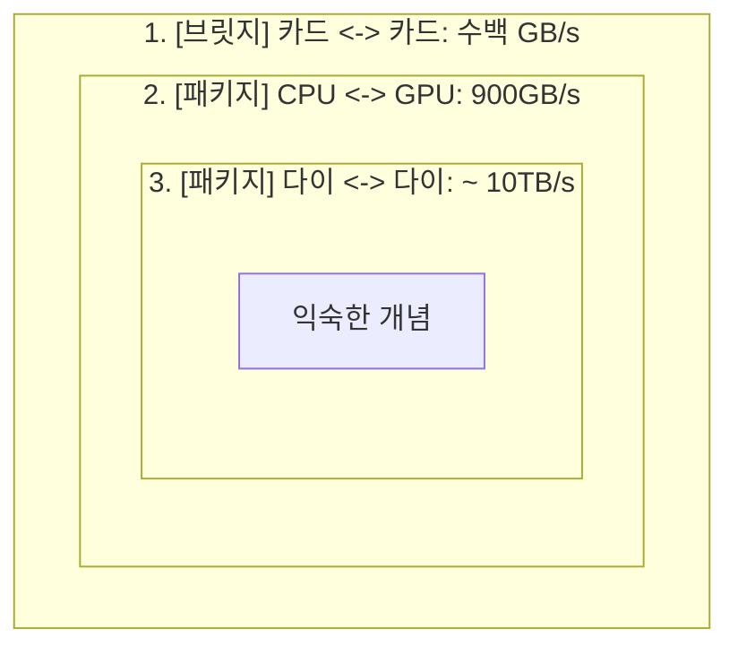

1. NV-HBI Link  
    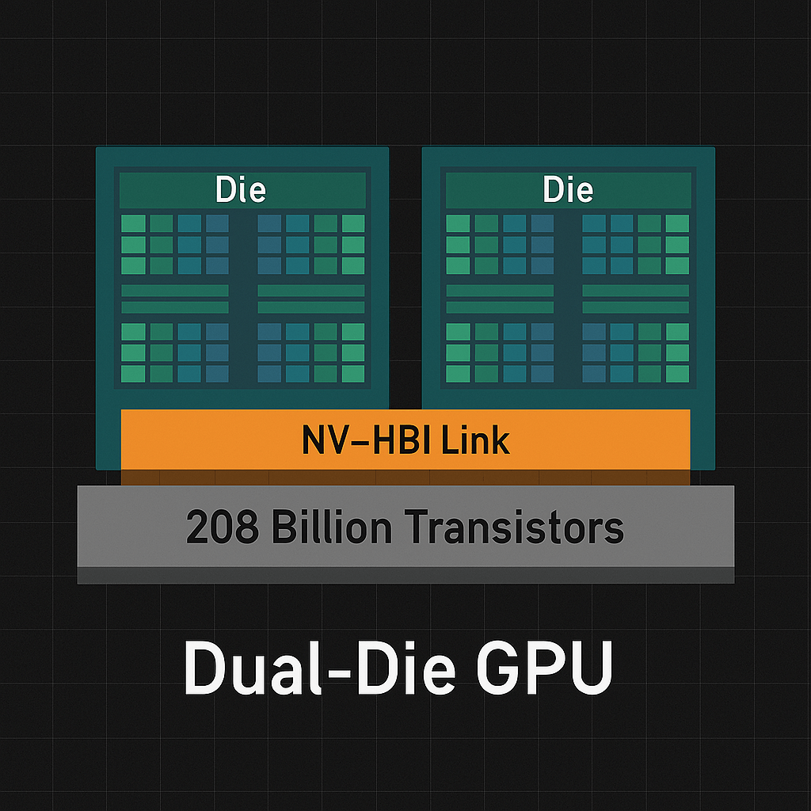  
    > Image Referenced from [Uvation](https://uvation.com/articles/blackwell-architecture-and-the-future-of-ai-inferencing)
    - GPU 패키지 내부에 2개의 다이 간의 통신을 위한 링크  
2. NVLink-C2C  
    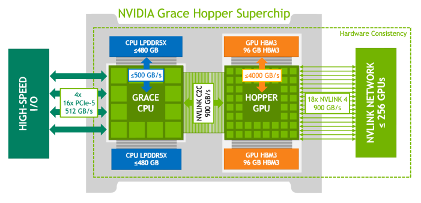
    > Image Referenced from [iThome](https://www.ithome.com.tw/review/158165)
    - Grace Hopper 칩에 적용된 CPU와 GPU 간의 통신을 위한 링크
    - ARM 기반 CPU를 통해, PCIe를 거치지 않고 GPU와 CPU 간의 통신을 가능하게 함
    - 기존의 PCIe가 병목이기 때문에, 칩 패키지 내에서 처리될 수 있도록 함
3. NVLink 브리지
    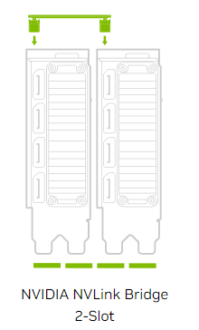
    > Image Referenced from [MAXON](https://support.maxon.net/hc/en-us/articles/22085399180060-Managing-VRAM-issues-with-Redshift)  
    - 앞서 말했던, NVLink 입니다. 데이터센터 [SXM(Server PCI Express Module)](https://ko.wikipedia.org/wiki/SXM_%28%EC%86%8C%EC%BC%93%29)에는 필요없다고 하는데, SXM? 모르기 때문에 한번 찾아봤습니다.  
      - 2016년도부터 NVIDIA가 써왔던 소켓이라고 하는데, 꽂혀있는 사진이 일본 TSUBAME 3.0 슈퍼컴퓨터 사진이고, 그 다음 사진의 오른쪽의 비어있는 소켓이 SXM 소켓이라고 합니다.(이해하는데 시간이 좀 걸림;)  
        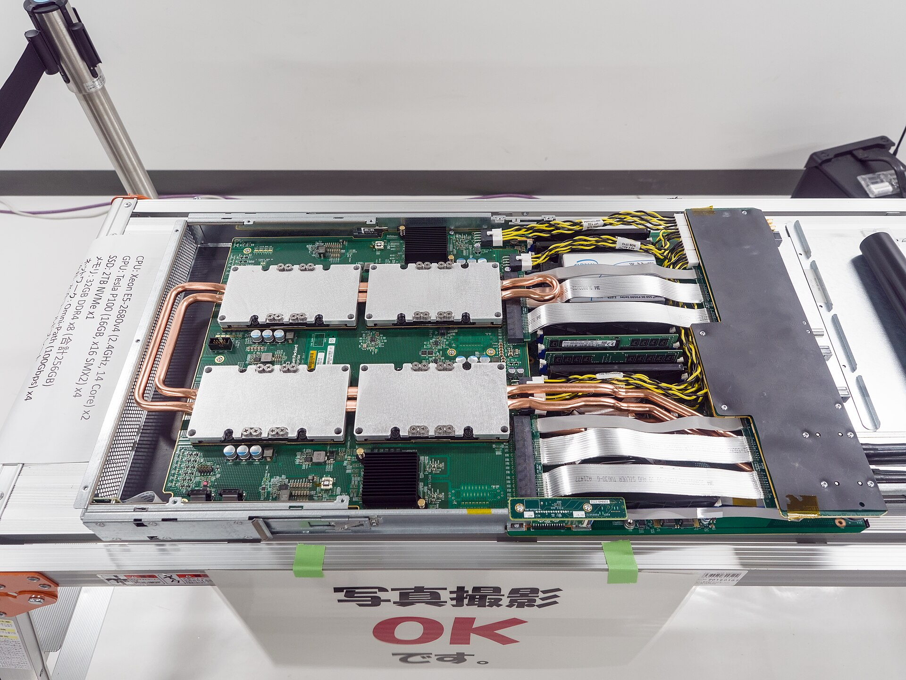  
        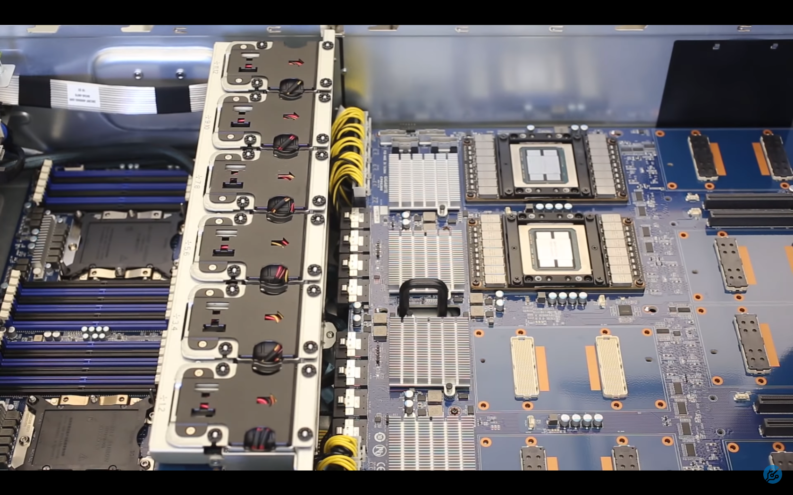)  
        > Image Referenced from [Wikipedia](https://ko.wikipedia.org/wiki/SXM_%28%EC%86%8C%EC%BC%93%29)  
      - PCIe 슬롯과는 달라서, [바꿔주는 어댑터](https://gigglehd.com/gg/hard/15728880)도 있는 모양  
      - SLI 브릿지랑 똑같은거 아닌가 싶은 생각이 문득 들었지만, 나중에 생각 더 해보는 걸로...  

위까지는 그래도 기존 지식 속에서 그렇-구나하고 슥슥 넘어갈 수 있는데, 이제부터는 신기(?)한 것들.  

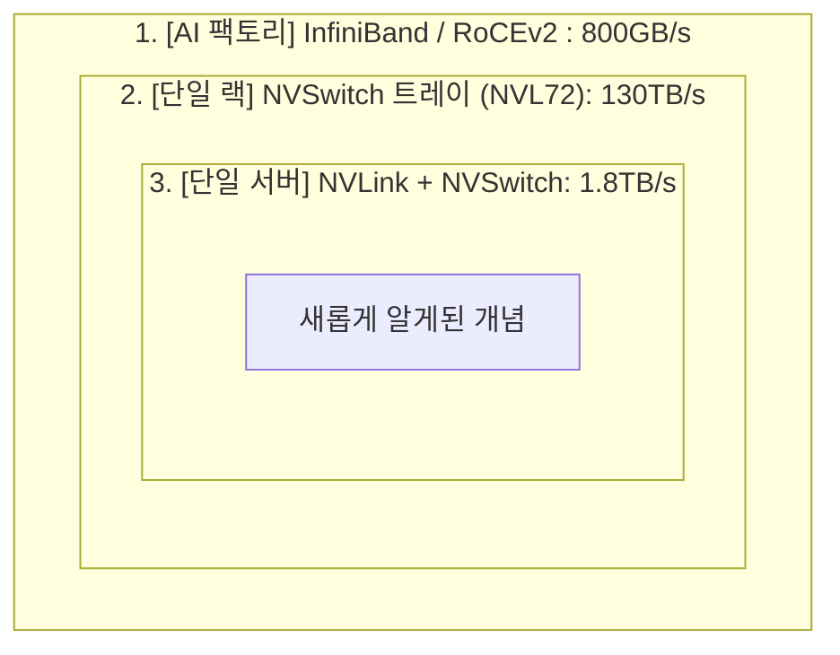

... 여기서는 단어들만 조금씩 정리해보고 덮어보려고 합니다.  

1. NVSwitch와 NVSwitch 트레이?  
    일단 아래 3줄은, GitHub Copilot이 써줬습니다.  

    ```text
    - NVSwitch는 NVIDIA에서 개발한 고속 스위칭 기술로, 여러 GPU 간의 데이터 전송을 효율적으로 관리합니다.  
    - NVSwitch 트레이는 이러한 스위치를 여러 개 포함하여, 단일 서버 내에서 GPU 간의 통신을 극대화합니다.  
    - 이를 통해 단일 서버 내에서 최대 1.8TB/s의 데이터 전송 속도를 달성할 수 있습니다.  
    ```  

    - NVSwitch 는 NVLink를 네트워크 패브릭으로 확장하기 위한 스위칭 칩이라고 합니다.  
      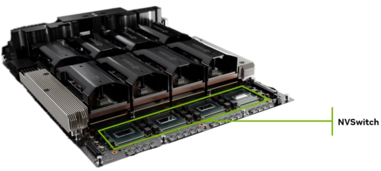  
      > Image Referenced from [AICPLIGHT](https://dev.to/aicplight/nvlink-vs-nvswitch-the-backbone-of-scalable-ai-gpu-interconnect-1n48)  
    - NVSwitch의 내부에 대한 다른 도표는 [ServerTheHome](https://www.servethehome.com/nvidia-nvswitch-details-at-hot-chips-30/)에도 다양하게 있었습니다.  
    - 아래 사진이 GB200 NVL72 스위치 트레이 내부라고 하네요.  
      
      > Image Referenced from [ServerTheHome](https://www.servethehome.com/this-is-the-nvidia-dgx-gb200-nvl72/)  
2. InfiniBand / RoCEv2
    아래 3줄도, GitHub Copilot이 써줬습니다.

    ```text
    - InfiniBand는 고속 데이터 전송을 위한 네트워크 기술로, 주로 HPC(High-Performance Computing) 환경에서 사용됩니다.  
    - RoCEv2(RDMA over Converged Ethernet version 2)는 InfiniBand의 기능을 이더넷 네트워크에서 구현한 기술로, 낮은 지연 시간과 높은 대역폭을 제공합니다.  
    - 이를 통해 AI 팩토리 환경에서 GPU 간의 데이터 전송 속도를 800GB/s까지 달성할 수 있습니다.  
    ```  

    - 인피니밴드는 스토리지 분야에서 쓰인다고 먼저 들었었는데, GPU 서버 간 통신에도 쓰이는구나를 알게되었습니다.  
    - 인피니밴드는 자체 계층을 갖는데 반해, RoCEv2는 Ethernet/IP/UDP 위에 (주로 ETH를 대상으로) InfiniBand transport를 올린다고 합니다.  
    - 인피니밴드 전송 계층
      `LRH │ GRH optional │ BTH │ Extended Transport │ Payload │ CRCs`
    - RoCEv2 전송 계층
      `Ethernet │ IP │ UDP │ **BTH** │ Extended Transport │ Payload │ ICRC`  
    - 그림을 더 찾아보니 아래와 같은 것을 발견.  
      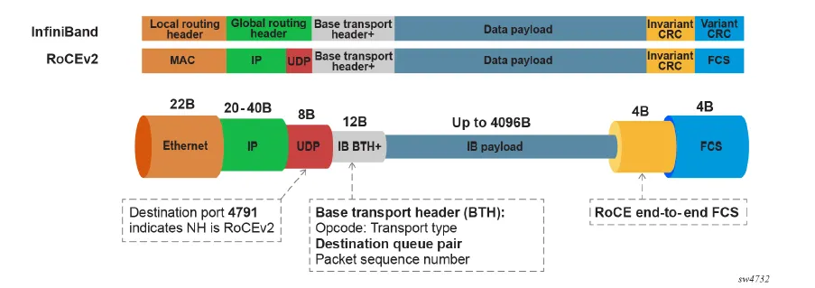  
      > Image Referenced from [Menuka Wijayarathna](https://medium.com/@menu.sri13/from-infiniband-to-ultra-ethernet-why-ai-networks-had-to-rethink-rdma-on-ethernet-b8fc6599c5bc)
    - 2020년에 NVIDIA가 멜라녹스를 인수한 이유가 인피니밴드라는 것을 검색하다보니 발견.  
    - 그 외에도 `RDMA로 CPU를 거치지 않는다`라는 것이 납득이 안되었는데, [クラウドデータセンターネットワークの “いま”と “これから”](https://speakerdeck.com/markunet/kurautotetasentanetutowakuno-ima-to-korekara)에 좋은 그림이 있어서 첨부.  
      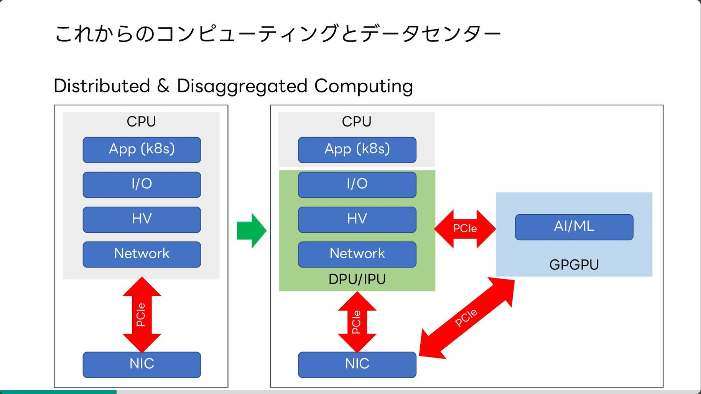  
      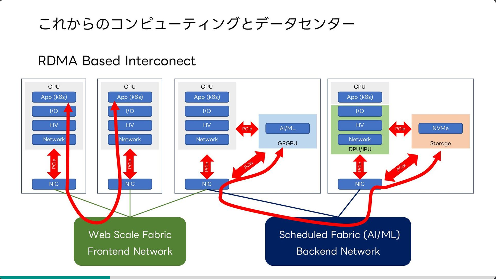  

## References  

- [UVATION - Blackwell Architecture and the Future of AI Inferencing](https://uvation.com/articles/blackwell-architecture-and-the-future-of-ai-inferencing)
- [iThome - 用256顆自研異質融合晶片，輝達推144TB共享記憶體的AI系統](https://www.ithome.com.tw/review/158165)  
- [MAXON - Managing VRAM issues with Redshift](https://support.maxon.net/hc/en-us/articles/22085399180060-Managing-VRAM-issues-with-Redshift)  
- [Wikipedia - SXM (소켓)](https://ko.wikipedia.org/wiki/SXM_%28%EC%86%8C%EC%BC%93%29)
- [기글하드웨어 - SXM-to-PCIe 어댑터. 데이터센터용 GPU를 PCIe 슬롯에 연결](https://gigglehd.com/gg/hard/15728880)  
- [DEV Community - NVLink vs. NVSwitch: The Backbone of Scalable AI GPU Interconnect](https://dev.to/aicplight/nvlink-vs-nvswitch-the-backbone-of-scalable-ai-gpu-interconnect-1n48)  
- [ServeTheHome - NVIDIA NVSwitch Details at Hot Chips 30](https://www.servethehome.com/nvidia-nvswitch-details-at-hot-chips-30/)  
- [ServeTheHome - This is the NVIDIA DGX GB200 NVL72](https://www.servethehome.com/this-is-the-nvidia-dgx-gb200-nvl72/)  
- [Medium - From InfiniBand to Ultra Ethernet: Why AI Networks Had to Rethink RDMA on Ethernet](https://medium.com/@menu.sri13/from-infiniband-to-ultra-ethernet-why-ai-networks-had-to-rethink-rdma-on-ethernet-b8fc6599c5bc)  
- [Speaker Deck - Masayuki Kobayashi](https://speakerdeck.com/markunet/kurautotetasentanetutowakuno-ima-to-korekara)  
