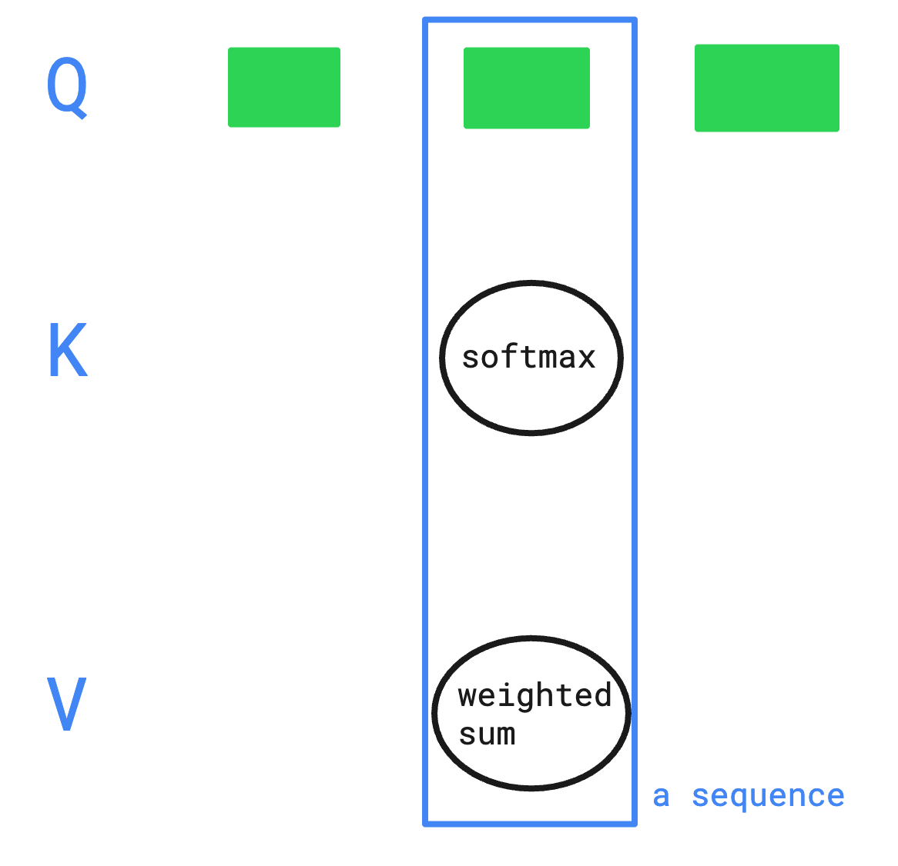
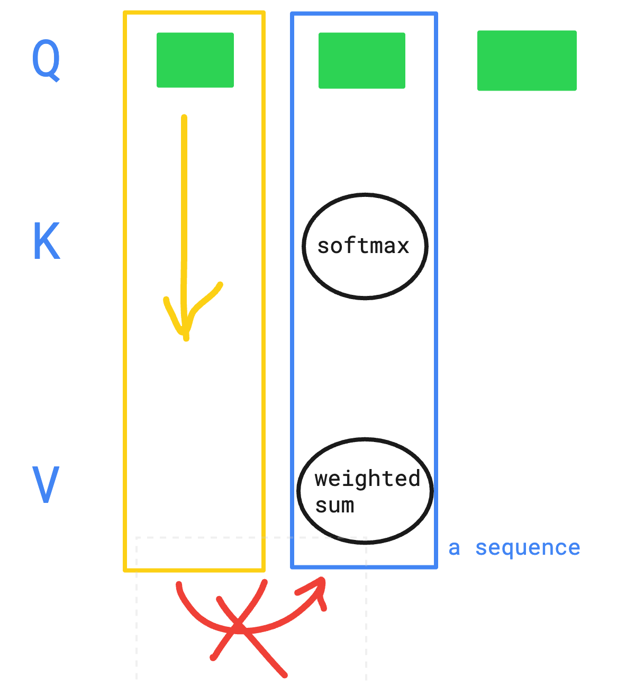

지난 주 일요일부터 [CloudNet@](https://gasidaseo.notion.site/CloudNet-Blog-c9dfa44a27ff431dafdd2edacc8a1863)에서 진행하고 있는 AI Datacenter Network Study(이하, AIDN)에 참여하게 되었습니다.  

요새는 PC에 달린 그래픽카드 활용을 위해, 이것저것(RAG, ASR 및 일반적인 추론모델) 돌려보는 중인데 그 중에서 막히던게 KV cache에 대한 이해 부족으로 Hermes Agent용 모델 선정에 애를 먹고 있었습니다. 그래서 이왕 하는 김에 큰 욕심을 버리고 KV cache에 대한 이해를 해보고자 합니다.  

영상은 스터디에서 참고용으로 추천해주신 수 많은 영상들 중에서 [[KV cache 시각화로 설명]](https://www.youtube.com/watch?v=sq3XGM1qdQY) 영상을 참고 하였습니다.  

## 1. KV cache 란?

이해하고 있는 내용으로는 역시 말 그대로 Key-Value 형태의 캐싱입니다.  

그럼 이번에 찾아본 내용은 무엇을 캐싱하고, 이걸 어떻게 활용하는 가에 대한 부분입니다.  

물론 Gemma4 같은 모델을 사용해보면서 기존 프롬프트를 반복 호출하면 추론된 결과를 더 빨리 응답하기에, 이걸 캐싱하나보다 하고 이후는 눈 감고 있었지만요.  
(이 또한 다 정리하고보니 결이 다른 이야기임을 깨달았습니다)

영상을 보니 어텐션과 시퀀스가 많이 언급되길래, 이 부분부터 저만의 용어로 습득해보고자 했습니다.  

1. 어텐션이란?  
    - 입력 시퀀스의 각 요소가 어디에 집중해야하는 지를 결정하는 매커니즘.  

    - 구성 3요소: 쿼리(Q), 키(K), 밸류(V)  
      - Q: 현재 처리 중인 단어
      - K: 입력 시퀀스의 각 요소에 대한 가중치 계산 재료
      - V: 각 키에 대응되는 어텐션 출력의 재료입니다.  

    - 어텐션의 출력은 가중치와 밸류의 Weighted Sum 으로 계산된다고 합니다.  
2. 셀프 어텐션이란?  
    - 입력 시퀀스의 각 요소가 시퀀스 내 다른 요소들과 상호작용하여 어텐션을 계산하는 방식.  
    - 즉, 입력 시퀀스의 각 단어가 다른 단어들과의 관계를 고려하여 가중치(Q/K/V)를 계산하고, 이를 통해 출력값을 생성하는 과정입니다.
3. 시퀀스란?
    - 그래서 입력 시퀀스가 뭔지? 이쪽 용어가 낯설어서 따로 찾아서 끄적여봅니다.  
    - 시퀀스는 일련의 요소들이 순서대로 배열된 것을 의미한다고 합니다.  
    - 입력 시퀀스는 모델에 입력되는 단어들의 순서 있는 집합입니다.  
    - 예를 들어, "Hello world"라는 문장이 입력 시퀀스라면, "Hello"와 "world"가 각각 시퀀스의 요소가 됩니다.  
      ... 아, 이거 딥러닝 쪽에서 순서 있는 집합을 시퀀스라고 이미 예전부터 쓰고 있었네요.  

~~그만 알아보자~~  

일단 KV cache 의 구성요소에서 쿼리가 있었다는 걸 처음 알았고, 그간 키의 값이라고 생각했던 것이 Q라는 것을 알아버렸습니다.  

## 2. 어텐션 계산에 대해  

1. Key 와 Value 는 각 토큰에 가중치 행렬(W_K, W_V)을 곱하여 생성.  

    

    - 각 Q는 독립적으로 softmax → weighted sum 계산을 수행함
    - 시퀀스 전체가 세로 방향으로 쌓입니다.  

2. 쿼리는 서로 독립적으로 병렬 처리됩니다.  
    - 세로 열 하나 = 하나의 Q 토큰이 전체 K/V 시퀀스에 대해  
      어텐션(softmax → weighted sum)을 계산하는 단위  
    - 다른 Q의 계산 결과에 의존하지 않으므로 병렬 처리 가능  

3. 쿼리는 시퀀스 내에서 서로 의존성 없이 병렬적으로 처리된다고 합니다.  
    - ~~덕택에 유행이 살짝 지난 것 같은 RAG를 쌓아두고, 암만 RAG 기반 조회를 돌려봐도~~  
      ~~전체적인 맥락을 별도로 조회하지 않으면 의도했던 결과가 나오지 않았던 이유가 이 부분이었구나 하는 생각이 스쳤습니다~~  
      라고 썼는데, 그림을 그리고보니 뭔가 다른 결인 것 같아서 삭제.  

## 3. KV cache 없이 계산한다면?  

> 입력된 텍스트의 토큰 길이를 L이라고 지칭.  

### (1) 토큰 길이가 L인 입력 시퀀스가 셀프 어텐션을 통과하는 과정

1. 셀프 어텐션에 의해 L끼리 Q/K/V 시퀀스가 생성됨.  
  이 상태에서, Q/K 내적을 통해 **L^2** 개의 가중치가 생성됨.  
2. 이 가중치와 V를 통해 Weighted Sum으로 어텐션 출력이 생성됨.
3. 이후 FFN을 거쳐 LLM의 출력이 생성됨.

또, 용어가 낯설어서 FFN이 뭔지 찾아보니, **Feed Forward Network**의 약자라고 합니다.

- 입력 → 은닉층 → 출력층으로 흐름  
- 순환이나 루프가 없는 구조로 RNN과 대비되는 구조  

작년에 학교 과정에서는 순방향 신경망이라고 외웠는데, 그게 FFN이었네요.  

그렇게 되면, 계산 복잡도는 O(L^2 * D)가 됩니다. (D는 시퀀스의 차원 수)  

### (2) 계산 부담이 큰 이유

앞에서 셀프 어텐션을 통과하면 출력값은 다음 토큰 하나뿐인데 아래와 같이 비용이 크다고 합니다.  

- 계산은 L^2 * D만큼 수행
- 출력값 외에는 모두 버려짐

이거 완전 GitHub Actions 돌릴 때랑 똑같잖아? 란 생각을 했습니다.  
Dependency 다 깔고 빌드해봐야, 남는 건 HTML 파일들이고 다 필요가 없는 것 처럼.  

## 4. KV cache 에서 저장하고 쓰는 것

1. 저장 단계
    - 셀프 어텐션에 의해 Q/K/V Weight를 통과 후, 이때 K, V시퀀스를 저장한다고 합니다.  
2. 활용 단계  
    - 이후 어텐션 계산 시, 입력 시퀀스의 마지막 샘플만을 Q/K/V Weight에 통과시킵니다.  
      기존에 매번, 시퀀스 길이 L만큼 Q/K/V Weight를 통과시키던 것과 달리, 마지막 샘플만 통과시킵니다.
    - 이때, K/V는 직전 LM 생성에서 저장한 K/V를 활용합니다.  
      통과한 마지막 샘플의 K/V의 앞에 직전 LM 생성에서 저장한 K/V를 붙입니다.  
    - 이 붙인 값을 KV cache에 다시 저장.  
3. 단일 Q(마지막 샘플만 통과했기 때문에)로 K(가중치) -> V(Weighted Sum) 계산을 수행합니다.  
    - 시퀀스는 병렬적으로 처리되기 때문에, 마지막 샘플만 있어도 어텐션 계산 결과는 동일합니다.  

이렇게 되면 계산 복잡도가 O(L * D)로 줄어들게 됩니다.

## 5. 원래 목적  

사실은 RTX 3060 12GB에 알맞는 모델을 찾는데 KV 캐시도 계산을 했어야 했는데,  
KV cache를 어떻게 가져가느냐에 따라 어떤 효과가 있는지 이해해보고자 찾아본 내용이었습니다.  

복잡도를 개선함으로서 응답속도에 개선되리라는 점은 알았으니, KV Cache가 얼마나 필요할지 어림잡아 보려고 합니다.  

> 기존 VRAM: 20MB 미만으로 gnome-shell 프로세스만 차지하는 중.  

[unsloth/Qwen3.5-9B-GGUF](https://huggingface.co/unsloth/Qwen3.5-9B-GGUF) 모델을 차주에 테스트 해보려고 합니다.  

- 32레이어: 8 x (3: Gated DeltaNet + 1: Gated Attention)
  - Gated Attention: 일반 Softmax Attention
  - Gated DeltaNet: 선형 어텐션. 토큰별 K/V 미보관  

### (1) 가중치 — UD-Q4_K_XL (5.97GB)

- VISION 추가 시, mmproj-BF16 0.92GB [Hugging Face](https://huggingface.co/unsloth/Qwen3.5-9B-GGUF/tree/main) 추가 계획.  
  다만 OOM 이슈 날꺼 같아서, 이번에는 계획에서 제외.  

### (2) KV 캐시 - q8_0 (2.0GB)

`2 × 8 × 4 × 256 × T × P`

- 어텐션 레이어 8개만 적용. 토큰당 = 16,384 × P 바이트 → q8_0 16KiB
- T = 토큰 수, P = 양자화 정밀도

| 컨텍스트 | q4 KV | q8_0 KV | f16 KV |  
| --- | --- | --- | --- |  
| 32K | 0.28 | 0.50 | 1.0 |
| 64K | 0.56 | 1.0 | 2.0 |
| 128K | 1.13 | **2.0** | 4.0 |
| 256K | 2.25 | 4.0 | 8.0 |

(단위 GB)

### (3) 고정 런타임 오버헤드 (1.1GB)  

- DeltaNet 순환 상태(24레이어, 컨텍스트 무관): ~0.05GB
- 컴퓨트 버퍼 + CUDA 컨텍스트(flash-attn on): ~1.0GB (긴 컨텍스트에서 약간 증가)
  
### (4) 합산 시나리오 (텍스트 전용, q8_0 KV)

| 가중치 | 컨텍스트 | 합계 | 판정 |
| --- | --- | --- | --- |
| UD-Q4_K_XL 5.97 | 64K | 7.97 | ✅ 여유 3.8GB |
| UD-Q4_K_XL 5.97 | 128K | 8.97 | ✅ 여유 2.8GB |
| UD-Q4_K_XL 5.97 | 256K | 10.97 | ✅ |
| Q5_K_M 6.58 | 128K | 9.58 | ✅ |
| Q5_K_M 6.58 | 256K | 11.58 | ⚠️ |
| Q6_K 7.46 | 128K | 10.46 | ✅ |
| Q6_K 7.46 | 256K | 12.46 | ❌ |
| Q8_0 9.53 | 32K | 11.03 | ⚠️ |
| Q8_0 9.53 | 64K | 11.53 | ❌ |

cf. 비전 추가 시 (mmproj 0.92 + 이미지 인코딩 시 일시 ~1.0)  

원격 컴퓨터를 끄고와서 예상으로 계산해두고, 다시 테스트 해보려고 합니다.  

## References

- [Youtube - KV cache 시각화로 설명](https://www.youtube.com/watch?v=sq3XGM1qdQY)
- [Hugging Face - unsloth/Qwen3.5-9B-GGUF](https://huggingface.co/unsloth/Qwen3.5-9B-GGUF)
- [김두기 교수 - FFN (Feed Forward Network) - 순방향 신경망](https://www.kim2kie.com/res/html/0_formula/00%20AI/FFN.html)  
