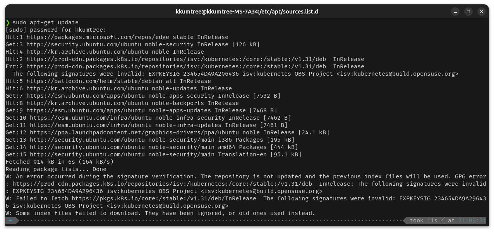
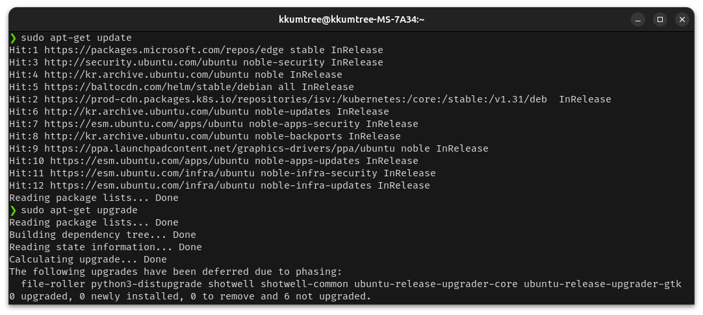
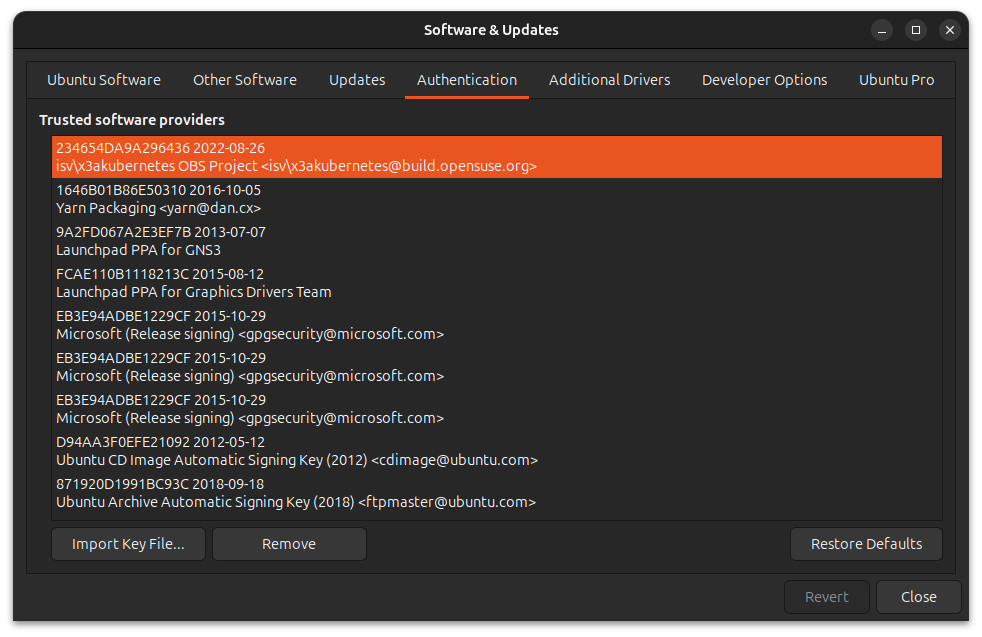

> 매번 수정하기 귀찮아서, 나중에 찾아서 쓰려고 끄적이는 메모  
> 보통 GPG키 지우고 다시 받으면 된다.  

그런 날이 있다. 무심결에 `sudo apt-get update`를 실행하는 순간, 에러가 뜨는 날.  

  

```bash  
W: An error occurred during the signature verification. The repository is not updated and the previous index files will be used. GPG error: https://prod-cdn.packages.k8s.io/repositories/isv:/kubernetes:/core:/stable:/v1.31/deb  InRelease: The following signatures were invalid: EXPKEYSIG 234654DA9A296436 isv:kubernetes OBS Project <isv:kubernetes@build.opensuse.org>
W: Failed to fetch https://pkgs.k8s.io/core:/stable:/v1.31/deb/InRelease  The following signatures were invalid: EXPKEYSIG 234654DA9A296436 isv:kubernetes OBS Project <isv:kubernetes@build.opensuse.org>
W: Some index files failed to download. They have been ignored, or old ones used instead.
```  

Zorin OS로 처음 입문할 때는 이거 마주치면 버티다 버티다 포맷했는데, 이제는 뭐... 어디서 키 만료됐나보다 하고 그려려니 한다. =ㅅ=);  

아래 명령어를 치면, 이번 케이스는 `keyrings` 디렉토리와 `sources.list.d` 디렉토리만 살펴보면 끝난다.  

```bash
tree /etc/apt/ -L 1
# /etc/apt/
# ├── apt.conf.d
# ├── auth.conf.d
# ├── keyrings
# ├── preferences.d
# ├── sources.list
# ├── sources.list.d
# ├── sources.list.distUpgrade
# ├── trusted.gpg.d
# └── trusted.gpg~

# 7 directories, 3 files
```

그저 오류가 난 파일을 열어, GPG Key의 위치를 확인하고 해당 패키지를 설치한 기억을 되새기면 된다.  

```bash
ls /etc/apt/sources.list.d
# docker.list.distUpgrade                               kubernetes.list                  ubuntu-esm-infra.sources
# gns3-ubuntu-ppa-lunar.list.distUpgrade                microsoft-edge.list              ubuntu.sources
# gns3-ubuntu-ppa-lunar.sources                         microsoft-prod.list.distUpgrade  vscode.list.distUpgrade
# graphics-drivers-ubuntu-ppa-kinetic.list.distUpgrade  microsoft-prod.sources           vscode.sources
# graphics-drivers-ubuntu-ppa-kinetic.sources           tailscale.list.distUpgrade       yarn.list.distUpgrade
# graphics-drivers-ubuntu-ppa-noble.sources             third-party.sources              yarn.sources
# helm-stable-debian.list                               ubuntu-esm-apps.sources
cat /etc/apt/sources.list.d/kubernetes.list
# deb [signed-by=/etc/apt/keyrings/kubernetes-apt-keyring.gpg] https://pkgs.k8s.io/core:/stable:/v1.31/deb/ /
```

그랬지. `kubectl` 쓰겠다고 설치했었구나.  

- [Install using native package management/kubenetes](https://kubernetes.io/docs/tasks/tools/install-kubectl-linux/#install-using-native-package-management)  

슥삭 지운다.

```bash
sudo rm /etc/apt/keyrings/kubernetes-apt-keyring.gpg
```  

설치 가이드대로 얌전히 다시 키 받아서 dearmor하고, 경로에 두자.  


```bash
curl -fsSL https://pkgs.k8s.io/core:/stable:/v1.31/deb/Release.key | sudo gpg --dearmor -o /etc/apt/keyrings/kubernetes-apt-keyring.gpg
sudo chmod 644 /etc/apt/keyrings/kubernetes-apt-keyring.gpg # allow unprivileged APT programs to read this keyring
```

그저 잘된다.  



```bash
sudo apt-get update
# Hit:1 https://packages.microsoft.com/repos/edge stable InRelease
# Hit:3 http://security.ubuntu.com/ubuntu noble-security InRelease
# Hit:4 http://kr.archive.ubuntu.com/ubuntu noble InRelease
# Hit:5 https://baltocdn.com/helm/stable/debian all InRelease
# Hit:2 https://prod-cdn.packages.k8s.io/repositories/isv:/kubernetes:/core:/stable:/v1.31/deb  InRelease
# Hit:6 http://kr.archive.ubuntu.com/ubuntu noble-updates InRelease
# Hit:7 https://esm.ubuntu.com/apps/ubuntu noble-apps-security InRelease
# Hit:8 http://kr.archive.ubuntu.com/ubuntu noble-backports InRelease
# Hit:9 https://ppa.launchpadcontent.net/graphics-drivers/ppa/ubuntu noble InRelease
# Hit:10 https://esm.ubuntu.com/apps/ubuntu noble-apps-updates InRelease
# Hit:11 https://esm.ubuntu.com/infra/ubuntu noble-infra-security InRelease
# Hit:12 https://esm.ubuntu.com/infra/ubuntu noble-infra-updates InRelease
# Reading package lists... Done
sudo apt-get upgrade
# Reading package lists... Done
# Building dependency tree... Done
# Reading state information... Done
# Calculating upgrade... Done
# The following upgrades have been deferred due to phasing:
#   file-roller python3-distupgrade shotwell shotwell-common ubuntu-release-upgrader-core ubuntu-release-upgrader-gtk
# 0 upgraded, 0 newly installed, 0 to remove and 6 not upgraded.
```

그리고 딱히 업그레이드해야할 것도 없었다.  

...

아마, 예전 글에 `sudo apt-key adv --keyserver keyserver.ubuntu.com --recv-keys 234654DA9A296436` 써도 된다고 있는데,  
이건 `deprecated` 방식이라 좀 꺼려진다.  
물론 설치 안내문에 있는 내용도 아니고, 키가 또 따로 놀게된다.  

```bash
sudo apt-key list
# Warning: apt-key is deprecated. Manage keyring files in trusted.gpg.d instead (see apt-key(8)).
# /etc/apt/trusted.gpg
# --------------------
# pub   rsa2048 2022-08-25 [SC] [expires: 2026-12-29]
#       DE15 B144 86CD 377B 9E87  6E1A 2346 54DA 9A29 6436
# uid           [ unknown] isv:kubernetes OBS Project <isv:kubernetes@build.opensuse.org>
```

안그래도 지금 Authentication 정리를 미뤄서 잔뜩 쌓였는데, 아래 메뉴로 진입해서 지웠다.  
내 GUI기준으로는 `Software & Updates` 이다.  



어차피 해당 파일이 날아갔어도, 직전의 이력은 `/etc/apt/trusted.gpg\~` 에 남아있다.  
