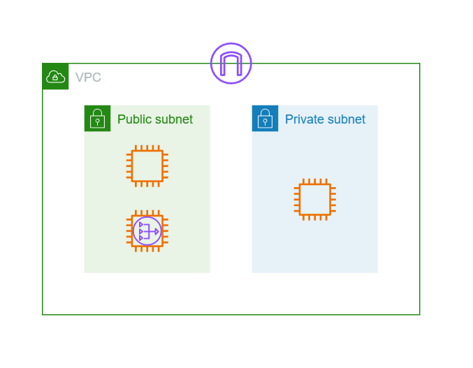

This week is last week of [CloudNet@](https://gasidaseo.notion.site/3-8b2603d882734df0b96f8670bb4e15d4) group study about terraform.  

In this study, my personal goal is `making AWS architecture only with terraform and one tfstate file`.  

- Basic knowledge about AWS resources is required.

## 1. Terraform without Module

Before, I already met terraform for maintaining AWS in production level.  
But at that time, our team maintain them as folder structure which is used by [terraformer](https://github.com/GoogleCloudPlatform/terraformer)  

```bash
# example structure

$ tree
.
├── alb
│   ├── lb.tf
│   ├── lb_listener.tf
│   ├── lb_target_group.tf
│   ├── lb_target_group_attachment.tf
│   ├── outputs.tf
│   ├── provider.tf
│   └── variables.tf
├── auto_scaling
│   ├── autoscaling_group.tf
│   ├── launch_template.tf
│   ├── outputs.tf
│   ├── provider.tf
│   └── variables.tf
├── ec2_instance
│   ├── instance.tf
│   ├── outputs.tf
│   ├── provider.tf
│   └── variables.tf
├── eni
│   ├── network_interface.tf
│   ├── outputs.tf
│   └── provider.tf
├── igw
│   ├── internet_gateway.tf
│   ├── outputs.tf
│   ├── provider.tf
│   └── variables.tf
├── nacl
│   ├── default_network_acl.tf
│   ├── outputs.tf
│   ├── provider.tf
│   └── variables.tf
├── route_table
│   ├── main_route_table_association.tf
│   ├── outputs.tf
│   ├── provider.tf
│   ├── route_table.tf
│   ├── route_table_association.tf
│   └── variables.tf
├── s3
│   ├── outputs.tf
│   ├── provider.tf
│   └── s3_bucket.tf
├── sg
│   ├── outputs.tf
│   ├── provider.tf
│   ├── security_group.tf
│   └── variables.tf
├── subnet
│   ├── outputs.tf
│   ├── provider.tf
│   ├── subnet.tf
│   └── variables.tf
└── vpc
    ├── outputs.tf
    ├── provider.tf
    └── vpc.tf
```

At glance, this solution looks like cool.  
But, problems were enough critical to think 'why we have to use terraform?'.  

1. terraform state file(.tfstate) are spread at each folder.  
  It means, checkpoint we have to manage will be increased as much as we add new resources.  
2. Cause by 1, each resource is dependent on other resources.  
  It means, we have to manage resources in order.  
  For example, we have to create VPC first, and then we can create subnet.  
  And if we don't need specific resource, we have to check other resources whether they refer to the resource.  
  These actions could cause human error and affect to production services.  

## 2. Terraform with Module

I had been failed to understand and transform legacy terraform structure to module structure, before the group study started.  

So, in this post, I use basic AWS 2-tier architecture as example.  



### (1) Create legacy(folder) structure by terraformer

To make ease transformation, make architecture in AWS Web console.  
And then, I use terraformer to make terraform files.  

How to use terraformer? See official Docs, OR [my post](https://blog.minseong.xyz/post/troubleshoot-terraformer-with-tfenv/). :)  

### (2) Create folder tree for module structure

- There are too much best practices to read all of them about terraform module. (By coincidence, all of them are written in medium)  
  - ref_1) [Terraform Modules](https://blog.devops.dev/terraform-modules-46ef5e0963c3)  
  - ref_2) [How Terraform Works : Modules Illustrated](https://awstip.com/terraform-modules-illustrate-26cbc48be83a)
  - ref_3) [Terraform: Creating Reusable Modules-Part 1](https://medium.com/@stisdol/terraform-creating-reusable-modules-part-1-cf850e890f88)

- Depth of folder is your choice, I make it below.  
  (It is suggested in the study and [Book](https://kbookstore.com/catalog/product/view/_ignore_category/1/id/693159/s/iac-9791169211123/))

```bash
$ tree
.
├── modules
│   ├── terraform-aws-alb
│   │   ├── listener.tf
│   │   ├── main.tf
│   │   ├── output.tf
│   │   ├── tg.tf
│   │   ├── tg_attachment.tf
│   │   └── variable.tf
│   ├── terraform-aws-ec2
│   │   ├── data.tf
│   │   ├── main.tf
│   │   ├── output.tf
│   │   └── variable.tf
│   ├── terraform-aws-igw
│   │   ├── main.tf
│   │   ├── outputs.tf
│   │   └── variable.tf
│   ├── terraform-aws-route_table
│   │   ├── association.tf
│   │   ├── main.tf
│   │   ├── main_association.tf
│   │   ├── output.tf
│   │   └── variable.tf
│   ├── terraform-aws-sg
│   │   ├── data.tf
│   │   ├── main.tf
│   │   ├── output.tf
│   │   └── variable.tf
│   ├── terraform-aws-subnet
│   │   ├── main.tf
│   │   ├── output.tf
│   │   └── variable.tf
│   └── terraform-aws-vpc
│       ├── main.tf
│       ├── output.tf
│       └── variable.tf
└── provider_for_module
    ├── main.tf
    ├── modules.tf
    └── output.tf
```

- Child modules have prefix `terraform-aws-`  
- I named root(parent) module as `provider_for_module` to distinguish.  

### (3) Transform legacy structure to module structure

In this section, only handle ec2 module as practice

```bash
$ tree
.
└── terraform-aws-ec2
    ├── data.tf
    ├── main.tf
    ├── output.tf
    └── variable.tf
```

- I divide terraform files for concentrating on actions
  `(Optional)` and filename is just my policy.  
  - `main.tf` : Only IaC for ec2 module.  
    Guide is well-described in [Docs](https://registry.terraform.io/providers/hashicorp/aws/latest/docs/resources/instance).  
  - `variable.tf` : variables for customizing ec2 resources at local.  
    ex. `name`, `tags`
  - `data.tf` : (Optional) data on AWS, they have to exist before managing resources.  
    Also guide exists in [Docs](https://registry.terraform.io/providers/hashicorp/aws/latest/docs/data-sources/ami).  
    ex. `ami`
  - `output.tf` : (Optional) output for other modules.
    ex. `ec2_id`, `ec2_ip`, `ec2_primary_network_interface_id`  

- Examples are below.  

```hcl
# main.tf

resource "aws_instance" "ssh" {
  ami = data.aws_ami.al2023-arm64.id
  associate_public_ip_address = "true"

  instance_type = var.instance_type_arm64
  key_name = var.key_name

  metadata_options {
    http_put_response_hop_limit = "2"
    http_tokens                 = "required"
  }

  tags = { 
    Name = var.instance_tag_name_ssh
  }

  tags_all = { 
    Name = var.instance_tag_name_ssh
  }
  
  source_dest_check = "true"
  subnet_id = var.subnet_pub-a_id
  vpc_security_group_ids = [ var.sg_sg-ssh_id ]
}
```

```hcl
# output.tf

output "aws_instance_ssh_id" {
  value = aws_instance.ssh.id
}

output "aws_instance_nat-a_eni_id" {
  value = aws_instance.nat-a.primary_network_interface_id
}

locals {
  aws_instance_web-a_id = aws_instance.web-a.id
  aws_instance_web-c_id = aws_instance.web-c.id
  aws_instance_nat-a_id = aws_instance.nat-a.id
  aws_instance_nat-c_id = aws_instance.nat-c.id
  aws_instance_ssh_id = aws_instance.ssh.id
  /* aws_instance_ssh-c_id = aws_instance.ssh-c.id */
}

output "generated_ec2_via_module" {
  value = {
    web-a = aws_instance.web-a.id
    web-c = aws_instance.web-c.id
    nat-a = aws_instance.nat-a.id
    nat-c = aws_instance.nat-c.id
    ssh = aws_instance.ssh.id
    /* ssh-c = aws_instance.ssh-c.id */
  }
}
```

```hcl
# data.tf

data "aws_ami" "al2023-arm64" {
  most_recent = true
  owners      = ["amazon"]

  filter {
    name   = "name"
    values = ["al2023-ami-*-arm64"]
  }
}

data "aws_launch_template" "ssh-tpl-al2023-arm64" {
  name = "LAB-SSH-TPL"
}
```

```hcl
# variable.tf

variable "instance_type_arm64" {
  description = "Instance type for ARM64 instances"
  default = "t4g.small"
}

variable "vpc_id" {
  description = "Security group IDs for web instances"
  default = null
}

variable "instance_tag_name_ssh" {
  description = "Instance tag name"
  default = "LAB-SSH"
}
```

Oh, Wait... Why `vpc_id` variable is `null`?  

### (4) Create root module

At first, I set variables in each module...  
Because, It was traditional way.  
But, I realized that checkpoint to be maintained would be tremendously increased;  

So, I changed plan by setting variables partially in root module.  

- root module structure

```bash
└── provider_for_module
    ├── main.tf
    ├── modules.tf
    └── output.tf
```

- `main.tf` : I specify only `terraform` and `provider` blocks.  
  - `terraform` : Set providers version.  
    (Also we can set backend strategy here.)  
  - `provider` : Set AWS provider for sharing with all modules.  
    Also we can default values like tags for monitoring all.  
    Before making module, provider should be set in a `.tf` file of each folder.  
    By module, we can set provider in root module **once**.  
- `modules.tf` : Connect with child modules.  
  - `source` : path of child module.  
  - `depend_on` : (Optional) Set dependency between modules.  
    Most AWS resources have dependency with each other. Just for safe launch.  
  - `variable` : Set variables for child module.  
    At here, we use other resources made in other modules, as variables.  
  - `providers` : Set provider for child module.  
    We set AWS provider as `aws` in `main.tf`. So, we can reuse it here.  
- `output.tf` : (Optional) output for the machine that handles terraform.  

```hcl
# main.tf

terraform {
  required_providers {
    aws = {
      source = "hashicorp/aws"
      version = "~> 5.17.0"
    }
    external = {
      source = "hashicorp/external"
      version = "~> 2.3.1"
    }
  }
}

provider "aws" {
  region = "ap-northeast-2"

  default_tags {
    tags = {
      "Project" = "LAB_AWS_TF00"
      "Environment" = "Learning"
      "Terraform" = "true"
    }
  }
}
```

```hcl
# modules.tf

module "local_module_ec2" {
  source = "../modules/terraform-aws-ec2"
  depends_on = [ 
    module.local_module_vpc, 
    module.local_module_subnet,
    module.local_module_sg,
    module.local_module_igw
  ]

  vpc_id = module.local_module_vpc.aws_vpc_vpc_id
  subnet_pri-a_id = module.local_module_subnet.aws_subnet_pri-a_id
  subnet_pri-c_id = module.local_module_subnet.aws_subnet_pri-c_id
  subnet_pub-a_id = module.local_module_subnet.aws_subnet_pub-a_id
  subnet_pub-c_id = module.local_module_subnet.aws_subnet_pub-c_id
  sg_sg-web_id = module.local_module_sg.aws_security_group_sg-web_id
  sg_sg-nat_id = module.local_module_sg.aws_security_group_sg-nat_id
  sg_sg-ssh_id = module.local_module_sg.aws_security_group_sg-ssh_id

  providers = {
    aws = aws
  }
}

module "local_module_vpc" {
  source = "../modules/terraform-aws-vpc"

  providers = {
    aws = aws
  }
}
```

```hcl
# output.tf

output "local_module_output_ec2" {
  value =  module.local_module_ec2.aws_instance_web-a_id
}

output "local_module_output_vpc" {
  value =  module.local_module_vpc.aws_vpc_vpc_id
}
```

## 3. 