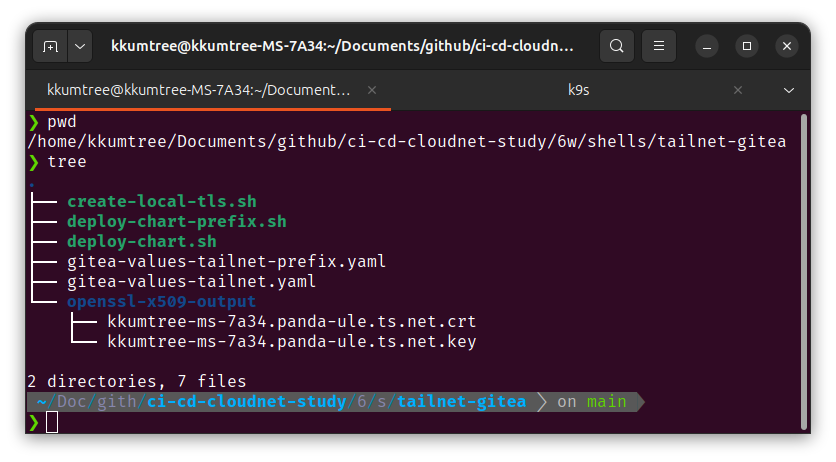
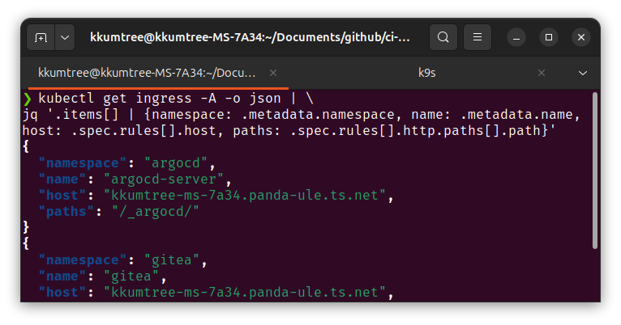
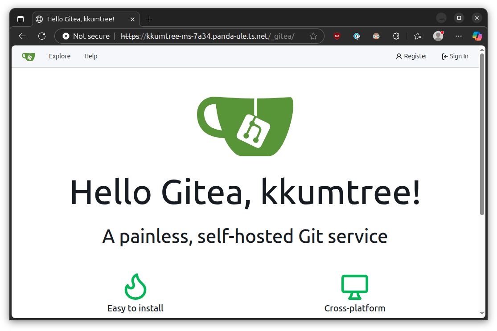
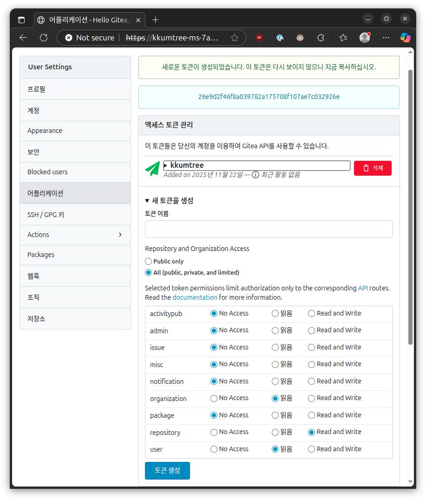
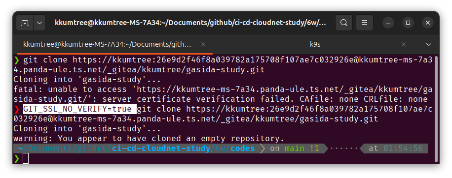
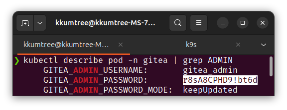

지난 포스팅 [ArgoCD Cluster 및 Prefix 관리](../argocd-cluster-management-and-prefix/)에 이어서,  
Gitea를 띄워보고, 사용을 해보겠습니다.  

ingress-nginx 컨트롤러가 인증서를 관리하게 했어야했는데,  
이번 스터디는 CI/CD에 초점이 맞춰져있었어서 좀더 손이 많이 가지만, gitea 네임스페이스에도 TLS 인증서를 연결하는 방법을 취하겠습니다.  

> 해당 구성들은 아래 GitHub에 탑재되어 있습니다.  
> <https://github.com/kkumtree/ci-cd-cloudnet-study> 의 6w 폴더  

## 1. Gitea Helm Chart 설정  

> `6w/shells/tailnet-gitea/` 폴더 참고  



### (1) 공통 설정

처음 구성 시에, Control Plane 하나만 띄웠기도 하고,  
기본값이 프로덕션 환경에 맞춰져있어서 조정 후 띄우겠습니다.  

- PostgreSQL HA 및 Valkey Cluster 해제  
  : 각각 Pod 3개씩 뜨는 것이 기본이기에 하나만 띄우도록 하겠습니다.  

```yaml  
postgresql-ha.enabled: false
postgresql.enabled: true

valkey-cluster.enabled: false
valkey.enabled: true
```

- Gitea는 HTTP 3000 포트가 기본이지만, 443 접속하도록 할 것이기 때문에 ClusterIP로 포트 포워딩 할 것입니다.  

```yaml
service.http.type: ClusterIP
service.http.port: 443
service.http.targetPort: 3000
```

- 더불어, Gitea 백엔드가 http라서, https 포로토콜로 잡으면 아래처럼 프로토콜 불일치 에러가 납니다.  

```bash
curl -k https://kkumtree-ms-7a34.panda-ule.ts.net/
# Client sent an HTTP request to an HTTPS server
```

그렇다고, HTTPS로 통일해버리면 Pod내에서 에러 로그를 관찰할 수 있습니다.

```log
2025/11/22 15:35:12 modules/graceful/server.go:50:NewServer() [I] Starting new Web server: tcp:0.0.0.0:443 on PID: 14                                 │
│ 2025/11/22 15:35:14 modules/log/misc.go:71:(*loggerToWriter).Write() [I] http: TLS handshake error from 10.244.0.1:40040: EOF                         │
│ 2025/11/22 15:35:24 modules/log/misc.go:71:(*loggerToWriter).Write() [I] http: TLS handshake error from 10.244.0.1:50890: EOF 
```

이 부분은 아래와 같이 http 프로토콜로 통일합니다.  

```yaml
gitea.config.server.PROTOCOL: http  
ingress.annotations[].nginx.ingress.kubernetes.io/backend-protocol: "HTTP"
```

- TLS인증서 쪽은, Volume 마운트로 잡았습니다.  
  재미삼아서 잡아본거지, Ingress 단에서 잡는게 여러모로 맞습니다.  

```yaml
gitea.config.server.CERT_FILE: /certs/tls.crt
gitea.config.server.KEY_FILE: /certs/tls.key
...
extraVolumes[0].name: gitea-tls
extraVolumes[0].secret.secretName: gitea-selfsigned-tls
extraVolumeMounts[0].name: gitea-tls
extraVolumeMounts[0].readOnly: true
extraVolumeMounts[0].mountPath: /certs
```  

### (2) Sub-Domain / Sub-Path 별 Ingress 설정  

Usually it's **not recommended** to put Gitea in a sub-path, it's not widely used and may have some issues in rare cases.

Gitea에서도 Sub-Path를 지양하도록 [안내](https://docs.gitea.com/administration/reverse-proxies#use-a-sub-path)하고 있으나, 최종적으로는 비권장사항으로 맞췄습니다.  

- Sub-Domain의 경우

> [지난 게시물]((../argocd-cluster-management-and-prefix/))에서, Ingress rootpath 충돌로 ArgoCD의 Path를 이미 정리한 상태입니다.  

(deploy-chart.sh 및 gitea-values-tailnet.yaml)  

```bash
kubectl get ingress -A -o json | \
jq '.items[] | {namespace: .metadata.namespace, name: .metadata.name, host: .spec.rules[].host, paths: .spec.rules[].http.paths[].path}'
```



tailnet에서 제공하는 MagicDNS는 이미 Hostname이 Sub-Domain으로 붙여있기 때문에,  
rootpath를 기준으로 셋업했습니다. 간결하며, 직관적입니다.  

```yaml
ingress.hosts[0].host: kkumtree-ms-7a34.panda-ule.ts.net
ingress.hosts[0].paths[0].path: /
ingress.hosts[0].paths[0].pathType: Prefix
```

- Sub-Path의 경우

(deploy-chart.sh 및 gitea-values-tailnet.yaml)  

결국 Pod에는 Sub-Path가 없는 상태로 요청이 되어야해서,  
우회(workaround)방식으로 접근하였습니다.  

```yaml
gitea.config.server.ROOT_URL: http://<DOMAIN>/<Prefix>/  
ingress.annotations[].nginx.ingress.kubernetes.io/rewrite-target: /$2  
ingress.hosts[0].paths[0].path: /_gitea(/|$)(.*)            # Regex(정적 파일 깨짐 대응)  
ingress.hosts[0].paths[0].pathType: ImplementationSpecific  # Prefix는 Regex 미지원  
ingress.hosts[0].paths[1].path: /_gitea(/|$)(.*)            # (선택)Container Registry로 활용 시 
ingress.hosts[0].paths[1].pathType: ImplementationSpecific  
```

  

Ingress의 Path 목록도 확인해봅니다.  


### (2) HTTPS용 액세스 토큰 생성  

Gitea를 Git으로 사용 가능한 지, 테스트를 합니다.  

> 이전 포스팅, [Jenkins, git and kubernetes](../jenkins-ci-cd-kubernetes/)의 Token 재생성 참고

- read:organization # 조직 권한을 읽습니다.  
- write:repository  # repository 편집 권한.  
- read:user         # user의 정보를 읽습니다.



이제 기존처럼 사용하려고하면, 에러가 납니다. ~~그것이 Self-Signed TLS 인증서니까.~~  

환경변수 `GIT_SSL_NO_VERIFY=true`를 잡고 실행합니다.  

```bash
GIT_SSL_NO_VERIFY=true git clone https://{TOKEN_NAME}:{TOKEN_VALUE}@{DOMAIN}/{PREFIX}/{REPO_OWNER}/{REPO}.git
# 
```



이후에 게시할 때도 아래처럼 해당 환경변수가 지정되어야합니다.  

```bash
GIT_SSL_NO_VERIFY=true git push  
```

### (3) Admin Password 설정  

어차피 Admin Password는 바꾼다지만, 난수생성이 아니라 Helm Chart([values.yaml](https://gitea.com/gitea/helm-gitea/src/commit/1189521a7da5e5ef0787a8f1f4e07bc3ebda66ec/values.yaml#L369))에 고정된 값이었습니다.  

  

환경변수로 고정되어있어서, 웹 콘솔에서 암호를 변경한 이후에도 같은 값으로 남아있습니다.  
(변경한 비밀번호로 노출되지 않는 것을 확인)  

다만, helm chart를 지웠다가 다시 올리면 해당 환경변수로 초기화 됩니다.  

## 2. Cluster용 Helm-Chart 생성 및 Git 게시  

### (1) ArgoCD에 인증정보 게시  

```bash
argocd repo add https://kkumtree-ms-7a34.panda-ule.ts.net/_gitea/kkumtree/gasida-study.git \
  --username kkumtree \
  --password 26e9d2f46f8a039782a175708f107ae7c032926e \
  --insecure-skip-server-verification
```
