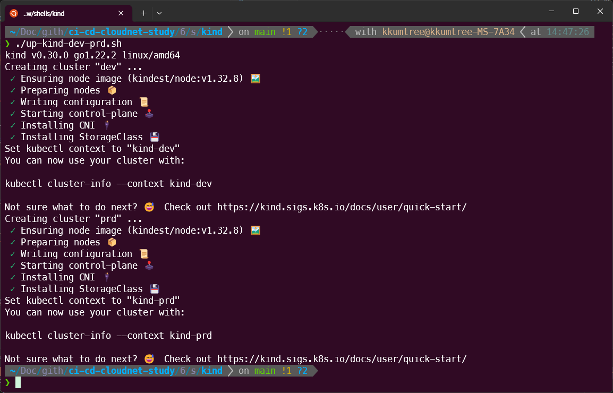
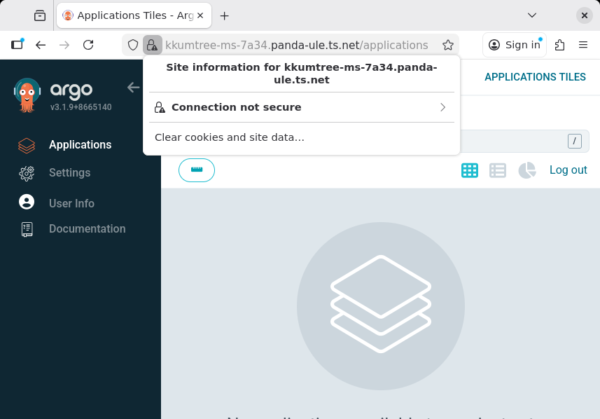
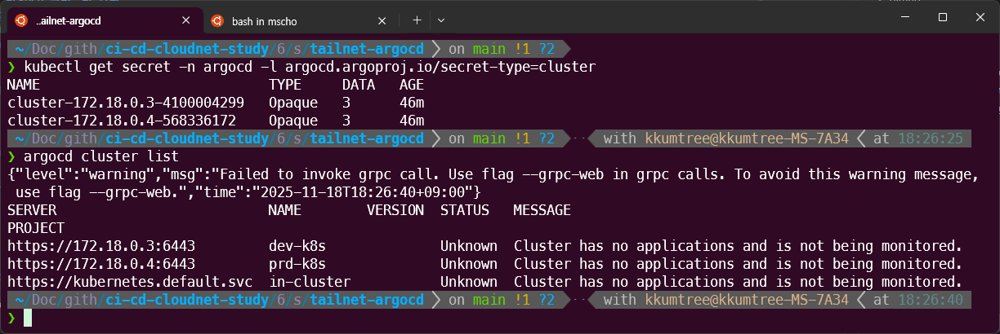
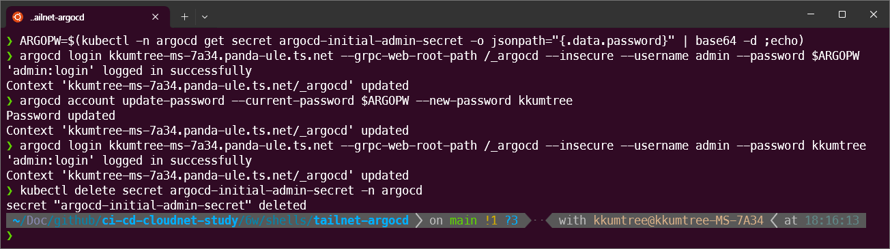
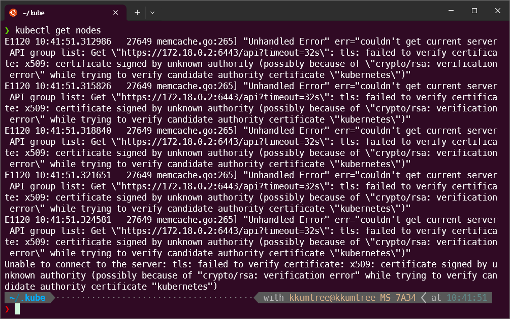

## 0. 실습 준비  

> 해당 구성들은 아래 GitHub에 탑재되어 있습니다.  
> <https://github.com/kkumtree/ci-cd-cloudnet-study> 의 6w 폴더  

이전 포스팅 [Tailscale을 타고, ArgoCD에 접근해보기](../playing-argocd-with-tailscale/)을 하였다면, 리소스 정리를 합니다.  

> kind 배포 시, 포트 점유로 오류가 발생합니다.  

```bash
sudo tailscale serve --tcp 443 off
```

  

이후 실습을 위한 배포를 합니다.  

### (1) kind 클러스터 배포  

이번 실습에서는 k8s 다중 클러스터 환경에서의 ArgoCD를 다루기에,  
총 3개의 클러스터를 배포합니다.  

(6w/shells/kind/)  
1. up-kind-mgmt.sh 실행  
  - kind 클러스터, mgmt 생성  
  - ingress-nginx 배포  
  - ingress-nginx에 SSL passthrough 활성화  
2. up-kind-dev-prd.sh 실행
  - kind 클러스터, dev 생성  
  - kind 클러스터, prd 생성  

  
  

이후 아래 3개의 context를 확인할 수 있습니다.  
(`kubectl config get-context`, k9s의 경우 `:ctx`)  
- kind-mgmt / kind-prd / kind-dev  


### (2) ArgoCD 배포(mgmt)  

Tailscale 연동이 재밌었기 때문에, 이번엔 이쪽[sol.2]으로 합니다.     

**[sol.1] `/etc/hosts` 파일을 변경하여 접근하도록 하는 방법**  

(6w/shells/argocd/)  
1. `9-create-local-tls.sh` 실행  
2. `deploy-chart.sh` 실행  
  - `kind-mgmt`로 context 전환
  - ArgoCD 배포

> 아래처럼 `/etc/hosts` 파일도 수정하여, 임의의 도메인을 추가합니다.  

```bash
# (Mac/Linux)  
echo "127.0.0.1 argocd.example.com" | sudo tee -a /etc/hosts
cat /etc/hosts
# (Windows)  
# C:\Windows\System32\drivers\etc\hosts 관리자모드에서 메모장에 내용 추가
# 127.0.0.1 argocd.example.com
```

  

**[sol.2] Tailscale 로 접근하도록 하는 방법**  

> 이전 포스팅 [Tailscale을 타고, ArgoCD에 접근해보기](../playing-argocd-with-tailscale/)을 참고하여 각자의 DNS로 변경 후 실행합니다.  

(6w/shells/tailnet-argocd)  
- tailnet에 등록된 해당 hostname 확인: 두 번째 값  
  `tailscale status | head -n 1`  
- tailnet DNS 확인: `Search Domains:`의 항목 확인  
  `sudo tailscale dns status`  
- `create-local-tls.sh` 파일을 확인된 값으로 변경 후, 실행  
- `deploy-chart.sh` 파일을 확인된 값으로 변경 후, 실행  
  - `kind-mgmt`로 context 전환
  - ArgoCD 배포


이후에 아래 커맨드로 Tailscale serve를 활성화 합니다.  

```bash
sudo tailscale serve --bg --tcp 443 tcp://localhost:443
```

### (3) ArgoCD 초기 패스워드 변경  

ArgoCD 권장 사항으로 패스워드 변경 후, 초기 패스워드는 제거합니다.  

```bash
ARGOPW=$(kubectl -n argocd get secret argocd-initial-admin-secret -o jsonpath="{.data.password}" | base64 -d ;echo)  
# argocd login argocd.example.com --insecure --username admin --password $ARGOPW
argocd login kkumtree-ms-7a34.panda-ule.ts.net --insecure --username admin --password $ARGOPW  
# 사용자 지정 패스워드로 변경  
argocd account update-password --current-password $ARGOPW --new-password kkumtree  
# (권장) 초기 비밀번호 제거  
kubectl delete secret argocd-initial-admin-secret -n argocd  
```  

  

이후, 변경된 패스워드로 로그인을 확인합니다.  



## 1. ArgoCD 클러스터 관리   

ArgoCD가 배포된 클러스터 외의 클러스터들은 별도로 ArgoCD에 등록하여야합니다.  

이에 앞서, kind를 위한 설정과 Alias 등록을 해두겠습니다.  

### (1) kind를 위한 설정 및 Alias 등록

kind는 Docker위에서 구동되는 것이기에, 
kind가 사용중인 Docker 네트워크와 Docker 포트포워딩 정보를 확인해야합니다.  

> 실습 환경 별로, 사용 중인 네트워크 정보는 달라질 수 있습니다.  
> 또한 호스트 재부팅 시 각 Docker Network내 IP가 변경될 수 있으니, 확인하여 변경하여야 합니다.  

6443 포트를 사용하고 있고 네트워크는 172.16.0.0/16 대역을 사용 중인 것을 확인하였습니다.  

```bash
docker ps
docker network inspect kind | grep -E 'Name|IPv4Address'
```  

  

이후, 각 cluster별로 확인된 IP주소로 변경합니다. (`vi ~/.kube/config`)  


```bash
alias kctx-mgmt='kubectl --context kind-mgmt'
alias kctx-dev='kubectl --context kind-dev'
alias kctx-prd='kubectl --context kind-prd'
```

### (2) 클러스터 등록  

아래 커맨드를 입력한 다음, y로 승인하여 등록 절차를 밟습니다.  

```bash
argocd cluster add kind-dev --name dev-k8s
argocd cluster add kind-prd --name prd-k8s
```

  

등록이 되었는지 확인해봅니다. 
클러스터의 자격증명은 `argocd.argoproj.io/secret-type=cluster`과 함께 시크릿으로 저장됩니다.  

```bash
kubectl get secret -n argocd -l argocd.argoproj.io/secret-type=cluster
argocd cluster list
```



## 2. ArgoCD Prefix 재적용과 Gitea 배포  

Gitea도 같이 띄우기 위해서, ArgoCD 진입점을 Prefix `/_argocd` 로 변경을 해보겠습니다.  

추가로 설정한 값은 아래와 같습니다.  

```yaml
configs.params.server.basehref: "<Prefix>"  # Reverse Proxy 사용 시, 하위 경로가 다를 때 사용. 웹콘솔의 index.html 경로 정의
configs.params.server.rootpath: "<Prefix>"  # Reverse Proxy 사용 시, 하위 경로가 다를 때 사용. 
server.ingress.pathType: ImplementationSpecific  
```

`configs` 네임스페이스에 정의된 사항은 ConfigMap `argocd-cmd-parmas-cm` 에서 확인할 수 있습니다.  

```bash
kubectl get cm -n argocd  
kubectl describe cm/argocd-cmd-params-cm -n argocd | grep -E 'server.basehref|server.rootpath' -A 2  
```  


### (1) 재배포  

1. 네임스페이스 argocd 제거  
2. `deploy-chart-prefix.sh` 실행 (로컬 TLS 인증서 없는 경우, 생성 후 진행)  
3. 명령어로 지정한 Prefix로 정상 접근되는 지 점검: Prefix 마지막에 `/` 추가    
4. 이후, 로그인 재설정 및 클러스터 재등록을 진행했습니다.  

```bash  
# curl -k https://<DOMAIN>/<Prefix>/  
curl -k https://kkumtree-MS-7A34.panda-ule.ts.net/_argocd/
```  


로그인 시에는 다음과 같이 `--grpc-web-root-path /<Prefix>` 파라미터를 추가하여 접속합니다.  

```bash  
#  ARGOPW=$(kubectl -n argocd get secret argocd-initial-admin-secret -o jsonpath="{.data.password}" | base64 -d ;echo)
 argocd login kkumtree-ms-7a34.panda-ule.ts.net --grpc-web-root-path /_argocd --insecure --username admin --password $ARGOPW
#  argocd account update-password --current-password $ARGOPW --new-password kkumtree
 argocd login kkumtree-ms-7a34.panda-ule.ts.net --grpc-web-root-path /_argocd --insecure --username admin --password kkumtree
#  kubectl delete secret argocd-initial-admin-secret -n argocd
```

  

### (2) Gitea 배포  

Gitea도 Helm Chart로 배포할 수 있대서, 해보았습니다.  


## 9. Host 재부팅 시, Unhandled Error  



재부팅 후 kubectl 명령어 입력 시 kind 클러스터, 즉 Docker pod의 Docker network 상의 IP주소가 변경되므로 `1-(1) kind를 위한 설정 및 Alias 등록`을 참조하여 `~/.kube/config` 설정을 업데이트 합니다.  

더불어 ArgoCD 클러스터도 재등록 해야합니다. 

- 기존 클러스터 제거: `argocd cluster rm <CLUSTER NAME>`  

  

## Reference  

- [argocd-cmd-params-cm.yaml/GitHub](https://github.com/argoproj/argo-cd/blob/master/docs/operator-manual/argocd-cmd-params-cm.yaml)