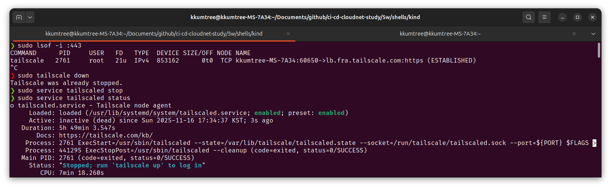
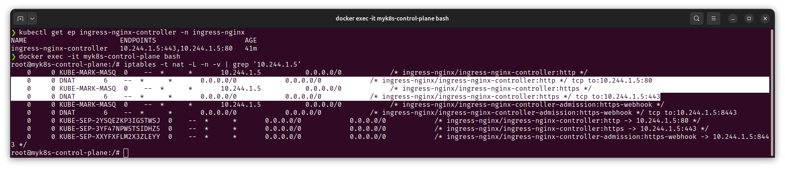
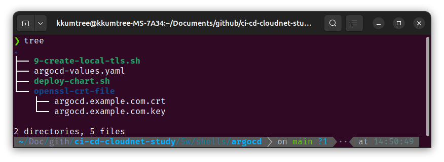
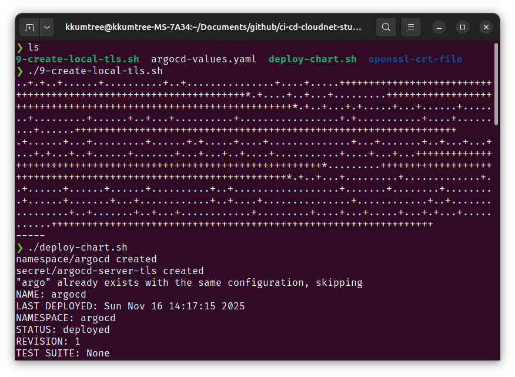

[CloudNet@](https://gasidaseo.notion.site/CloudNet-Blog-c9dfa44a27ff431dafdd2edacc8a1863)에서 진행하고 있는 CI/CD Study 5주차에는 ArgoCD를 좀더 다루었습니다.  

## 0. 실습 준비  

우선 80/443 포트를 사용할 수 있는지 확인하여야합니다. 아닌 경우, 다른 포트를 사용해야합니다.  

실제로 해보았을 경우 tailscale이 포트를 사용하는 것으로 보여 해당 서비스를 중지했습니다만,  
kind yaml을 잘못 작성한 것으로 보입니다.  



### (1) kind 및 kube-ops-view

이번에는 Ingress의 배포를 하기 위한 밑작업으로  
Control Node에 라벨링을 진행합니다.  
이는 다음에 이어질 `ingress-nginx` 배포 시, nodeSeletor 조건으로 사용합니다.  

```bash
# 5w/shells/kind/up-kind.sh
kind: Cluster
apiVersion: kind.x-k8s.io/v1alpha4
# networking:
#   apiServerAddress: "0.0.0.0"
nodes:
- role: control-plane
  labels:
    ingress-ready: true
  extraPortMappings:
  - containerPort: 80
    hostPort: 80
    protocol: TCP
  - containerPort: 443
    hostPort: 443
    protocol: TCP
  - containerPort: 30000
    hostPort: 30000
  - containerPort: 30001
    hostPort: 30001
  - containerPort: 30002
    hostPort: 30002
  - containerPort: 30003
    hostPort: 30003
- role: worker
```

kube-ops-view의 경우에는, 기존과 같습니다.  

```bash
# kube-ops-view
helm repo add geek-cookbook https://geek-cookbook.github.io/charts/
helm install kube-ops-view geek-cookbook/kube-ops-view --version 1.2.2 --set service.main.type=NodePort,service.main.ports.http.nodePort=30001 --set env.TZ="Asia/Seoul" --namespace kube-system

# kube-ops-view 접속 URL 확인  
open "http://127.0.0.1:30001/#scale=2" # 배율 2x
```

사용자 라벨링 관련하여 문서가 갱신되어 지금은 확인하기가 어렵지만, 기존 문서([issues#2889/kind](https://github.com/kubernetes-sigs/kind/issues/2889#issuecomment-1321001072))에는 아래와 같이 Taint toleration(예외 처리, 허용)을 해주고, 노드에 사용자 라벨링하도록 안내되어 있었다고 합니다.  

> The manifests contains kind specific patches to forward the hostPorts to the ingress controller, set taint tolerations and schedule it to the custom labelled node.

### (2) Ingress Nginx 배포

먼저 Control Node의 라벨을 확인하여, 지정한 사용자 라벨이 정상적으로 있는지 확인합니다.  

```bash
kubectl get nodes myk8s-control-plane -o jsonpath={.metadata.labels} | jq
# {
#   "beta.kubernetes.io/arch": "amd64",
#   "beta.kubernetes.io/os": "linux",
#   "ingress-ready": "true",        # 이 값이 확인되어야 합니다. 
#   "kubernetes.io/arch": "amd64",
#   "kubernetes.io/hostname": "myk8s-control-plane",
#   "kubernetes.io/os": "linux",
#   "node-role.kubernetes.io/control-plane": "",
#   "node.kubernetes.io/exclude-from-external-load-balancers": ""
# }
```  

이후, 배포를 진행합니다.  

해당 YAML에는 kind 배포 시 열어두었던 80/443 포트를 활용하는 것을 확인하였고,  
master 및 control-plane에 대한 taint toleration도 확인하였습니다.  
> (Deployment 항목) tolerations.[node-role.kubernetes.io/control-plane].effect=NoSchedule  

```bash
kubectl apply -f https://raw.githubusercontent.com/kubernetes/ingress-nginx/main/deploy/static/provider/kind/deploy.yaml
```  

ingress 컨트롤러에서 `--publish-status-address=localhost` 환경변수를 확인할 수 있습니다.  

  

더불어, Control plane 내에서 IPTABLES도 확인해봅니다.  
ingress-nginx 파드에 대한 엔드포인트 IP로 검색했을 때 전달되는 것을 확인하였습니다.  

  

### (3) SSL Passthrough flag 활성화  

Argo CD의 경우 OpenSSL의 self-signed 인증서와 Secrets를 생성, 즉 자체 TLS 인증서를 쓰기 때문에  
Nginx가 중간에서 TCP 프록시 처리를 하고 HTTPS 트래픽을 종료(TLS Termination)하여 `too many redirects` 오류가 발생합니다.  

그래서 이 부분도 수정해두도록 하겠습니다.  

```bash
# nginx-ingress-controller의 환경변수 체크
kubectl exec -it -n ingress-nginx deployments/ingress-nginx-controller -- /nginx-ingress-controller --help | grep ssl  
```

  

```bash  
# 에디터를 지정하여 수정 (vi, nano 등)
KUBE_EDITOR="vi" kubectl edit -n ingress-nginx deployments/ingress-nginx-controller
```  

`spec.template.spec.containers[controller].args`에 추가  

  

이후 Controller 파드의 환경변수 반영을 체크합니다.  

  

## 1. TLS 활성화 ArgoCD 배포  

방금까지 `Client(Browser) -> Ingress -> ArgoCD 서버`간 E2E HTTPS가 유지될 수 있는 상황을 만들었으니,  자체 TLS 인증서를 사용하는 ArgoCD를 배포해보겠습니다.  

가상의 도메인으로 `argocd.example.com`로 정하고,  
ArgoCD 서버 annotations에 `force-ssl-redirect`와 `ssl-passthrough`를 활성화하였습니다.  

### (1) 인증서 생성  

> `5w/shells/argocd` 폴더 참조  
> `9-create-local-crt.sh`로 생성한, 인증서는 `openssl-crt-file` 폴더에 저장.  
> 설치는 `deploy-chart.sh`로 진행합니다.  



```bash
# 5w/shells/argocd/argocd-values.yaml
global:
  domain: argocd.example.com

# # TLS certificate configuration via cert-manager
# # cert-manager가 있을 때, 활용.  
# certificate: 
#   enabled: true

server:
  ingress:
    enabled: true
    ingressClassName: nginx
    annotations:
      nginx.ingress.kubernetes.io/force-ssl-redirect: "true"
      nginx.ingress.kubernetes.io/ssl-passthrough: "true"
    tls: true
```  



더불어, `/etc/hosts` 파일도 수정하여, 임의의 도메인을 수정합니다.  


## 9. kind의 Ingress Controller(NGINX) 구성  

이번 실습에서는 kind의 Control plane에 별도의 사용자 지정 라벨링을 하였으나,  
kind 문서([Ingress/kind](https://kind.sigs.k8s.io/docs/user/ingress))에서는  
k8s 공식 라벨 소개하는 2가지 방법이 있습니다.  

특히, 라벨은 kubernetest의 알려진(Well-Known)라벨인 [`app.kubernetes.io/component`](https://kubernetes.io/docs/reference/labels-annotations-taints/#app-kubernetes-io-component)을 활용하는 것을 확인하였습니다.  

```bash
# Selector로 아래 라벨 활용 확인  
# app.kubernetes.io/component=controller 
kubectl wait --namespace ingress-nginx \
  --for=condition=ready pod \
  --selector=app.kubernetes.io/component=controller \
  --timeout=90s
```

이후 사용방법 요약.  

(1) `ingress-nginx-controller`에 등록된 External IP의 이용  
  (관련 YAML파일 다운로드:<https://kind.sigs.k8s.io/examples/ingress/deploy-ingress-nginx.yaml>)  
(2) kind 배포 시 Control plane에 80/443 포트(`extraPortMappings`)를 열고, localhost로 이용.  

## Reference

- [Ingress/kind](https://kind.sigs.k8s.io/docs/user/ingress)  

