최근 [CloudNet@](https://www.notion.so/gasidaseo/CloudNet-Blog-c9dfa44a27ff431dafdd2edacc8a1863)에서 진행하고 있는  
AWS EKS Workshop Study(이하, AEWS)에 참여하게 되었습니다.  

k8s가 워낙 인기가 많기도 하지만, 지난 kOps 스터디를 통해 관리요소가 참 많은 것을 느꼈었고,  
좀더 수월하게 이해를 해보고자 AWS 서비스인  
EKS(Elastic Kubernetes Service)를 이번 기회에 살펴보기로 했습니다.  

## EKS 사용에 있어 고려사항

EKS는 관리형 서비스(managed service)이기에 아래와 같은 장점이 있습니다.  

- 클러스터링을 위한 Control Plane(일명, 마스터 노드)을 AWS에서 관리해줍니다.  
  - 워커노드는  
    1. 사용자가 AMI를 구성하여 이를 사용
    2. AWS에서 제공하는 Fargate로 **VM**을 할당하여 사용
- kOps와도 유사하지만, 다른 AWS 서비스와의 연동이 용이합니다.  
  개인적으로는 ACM의 인증서 사용에 있어 더 편할 것이라 생각을 했습니다.  
  1. ECR에 저장한 컨테이너 이미지를 활용가능
  2. IAM을 통한 권한 관리
  3. ELB를 통한 로드밸런싱
  4. VPC를 통한 네트워크 관리
- 오픈소스 k8s 기반이기에 EKS로의 용이한 마이그레이션

## API 서버 Cluster Endpoint 구성

- EKS는 Control Plane을 관리해주나, 마스터 노드에 접근이 필요한 경우가 있습니다.  
  이를 위해, Cluster Endpoint를 구성하여 마스터 노드에 접근할 수 있습니다.  
- [EKS Cluster Endpoint Access Control](https://docs.aws.amazon.com/eks/latest/userguide/cluster-endpoint.html)

- 아래와 같이 구분할 수 있습니다.  

| Endpoint Public 액세스 | Endpoint Private 액세스 | Description |
| --- | --- | --- |
| Enabled | Disabled | 최초 기본 값, 퍼블릭 IP로 접속 |
| Enabled | Enabled | k8s API 요청은 AWS VPC 엔드포인트 사용 |
| Disabled | Enabled | 모든 트래픽이 AWS VPC 엔드포인트 사용 |  

- 3번째 구성이 권장. kubectl 명령이 모든 트래픽이 EKS에서 관리되는 ENI을 타게 됨.  

## EKS 배포해보기

- 스터디에서는 kOps 때와 같이 cloudformation 기반으로 배포.
- [소스코드 예제](https://github.com/awslabs/ec2-spot-labs/blob/master/ec2-spot-eks-solution/provision-worker-nodes/amazon-eks-nodegroup-with-spot.yaml)를 참조하여, spot instance를 사용하도록 템플릿 재구성을 하고 싶었으나,  
아직 적용할 시점은 아니라고 생각되어 skip

- cloudformation 적용

```bash
aws cloudformation deploy --template-file ~/Documents/aews/myeks-1week.yaml \
     --stack-name myeks --parameter-overrides KeyName=aews SgIngressSshCidr=$(curl -s ipinfo.io/ip)/32 --region ap-northeast-2

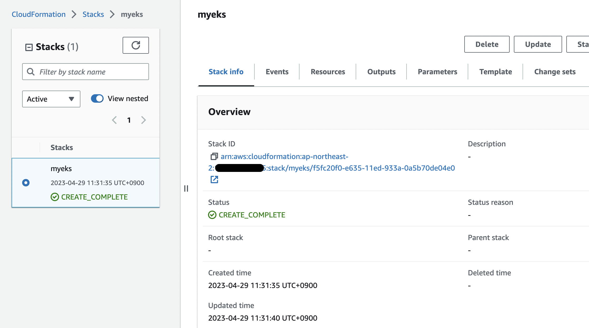

- 웹 콘솔에서도 확인 가능

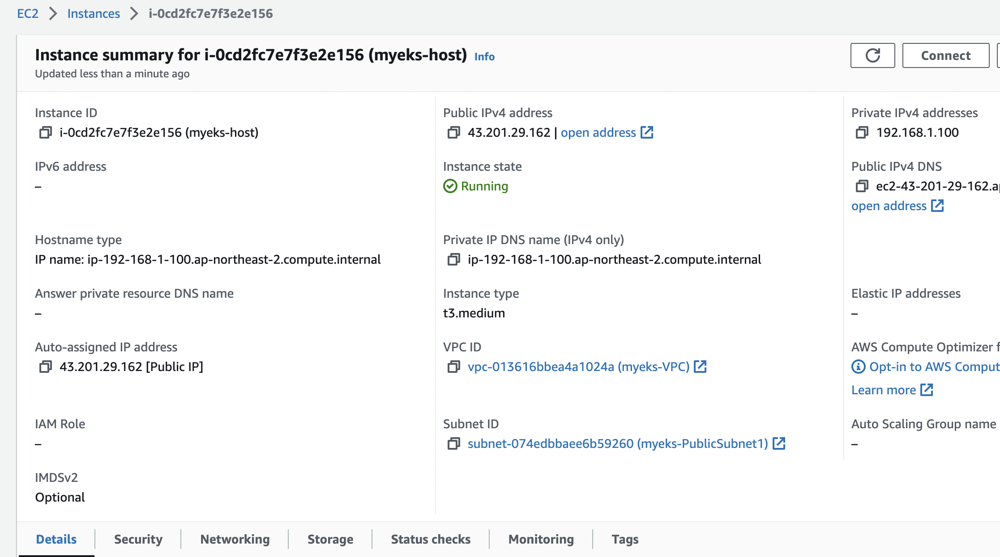

# EC2 IP 출력
echo $(aws cloudformation describe-stacks --stack-name myeks --query 'Stacks[*].Outputs[*].OutputValue' --output text)

# EC2 SSH 접속
ssh -i ~/.ssh/aews.pem ec2-user@$(aws cloudformation describe-stacks --stack-name myeks --query 'Stacks[*].Outputs[*].OutputValue' --output text)
```

- 아래와 같이 정상적으로 접속된다.

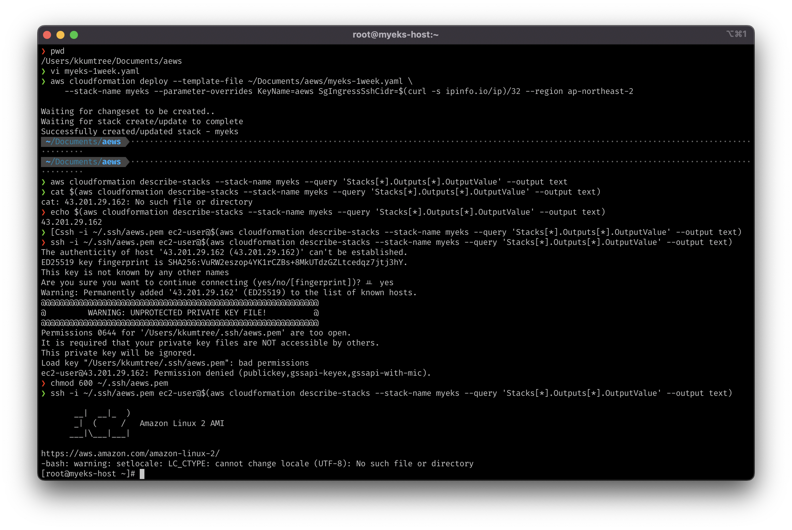

## EKS 호스트 확인

- cloudformation 템플릿에 적어둔 각 버전을 정상적으로 확인

```bash
kubectl version --client=true -o yaml | yh
eksctl version
aws --version
ls /root/.ssh/id_rsa*
docker info
```

- 아래와 같이 eks v1.25.7이 적용되었음을 알 수 있음

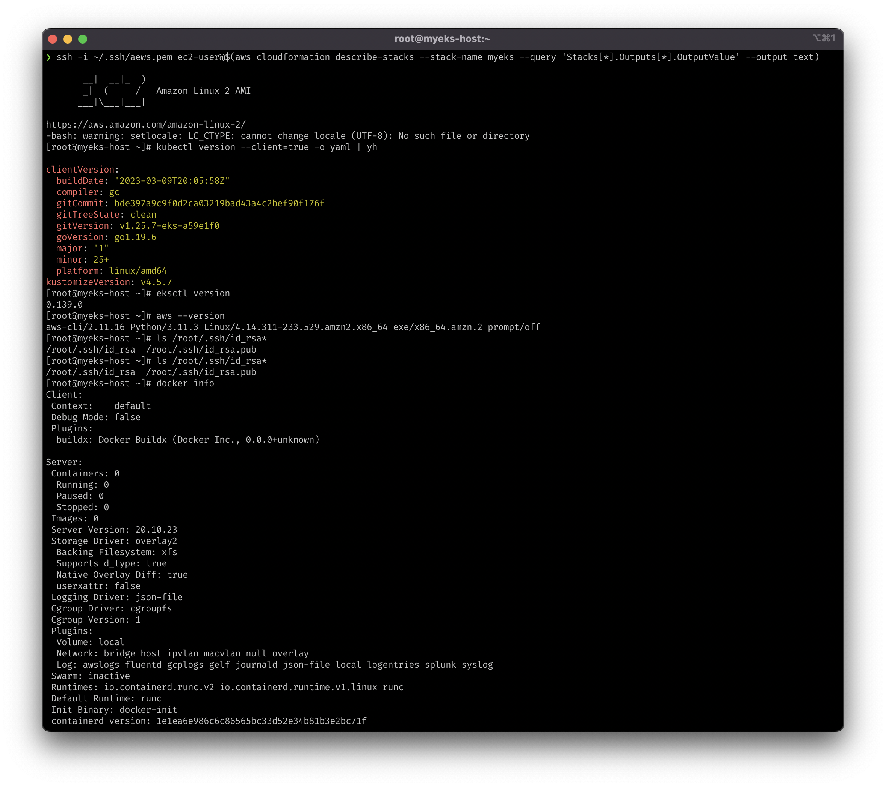

## EKS 클러스터 생성

- 아래와 같이 입력하여 클러스터 생성하였음
- 다만, ssh 접속 상태에서 aws configure로 access key, secret key를 입력해야하는데  
  다행인지 불행인지 로컬에서 해당 키값을 암호화하지 않았기 때문에 입력에 큰 어려움이 없었다.  

```bash
# 환경 값 설정
export VPCID=$(aws ec2 describe-vpcs --filters "Name=tag:Name,Values=$CLUSTER_NAME-VPC" | jq -r .Vpcs[].VpcId)
export PubSubnet1=$(aws ec2 describe-subnets --filters Name=tag:Name,Values="$CLUSTER_NAME-PublicSubnet1" --query "Subnets[0].[SubnetId]" --output text)
export PubSubnet2=$(aws ec2 describe-subnets --filters Name=tag:Name,Values="$CLUSTER_NAME-PublicSubnet2" --query "Subnets[0].[SubnetId]" --output text)

# eksctl 통해 생성을 하면, cloudformation에서 생성현황을 확인할 수 있음
eksctl create cluster --name $CLUSTER_NAME --region=$AWS_DEFAULT_REGION --nodegroup-name=$CLUSTER_NAME-nodegroup --node-type=t3.medium \
--node-volume-size=30 --vpc-public-subnets "$PubSubnet1,$PubSubnet2" --version 1.24 --ssh-access --external-dns-access --verbose 4
```

- 생성 전

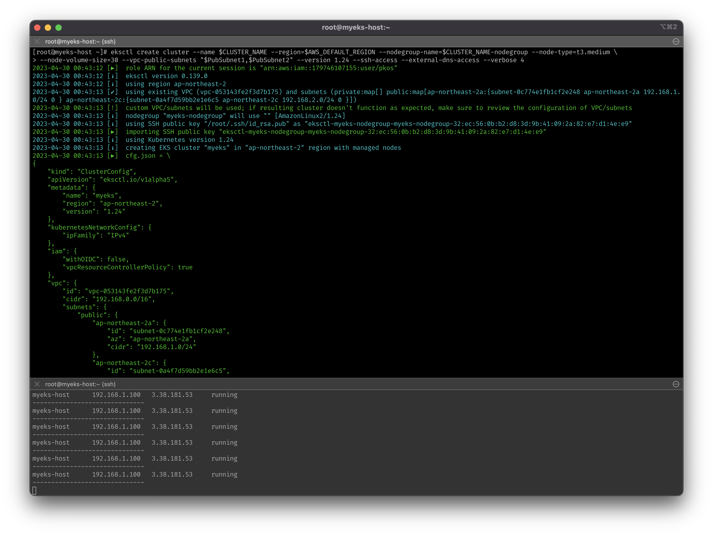

- 아래와 같이 정상적으로 생성되었음을 확인

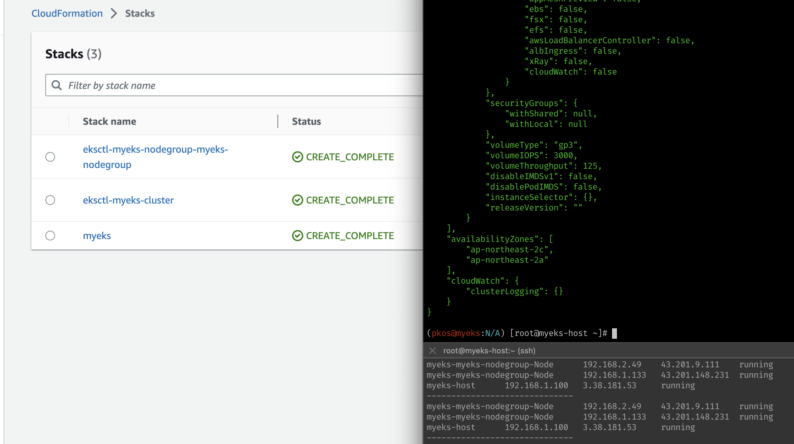

- 한국 리전의 A, C AZ를 대상으로, 1.24 버전의 k8s 클러스터가 생성되었음을 확인

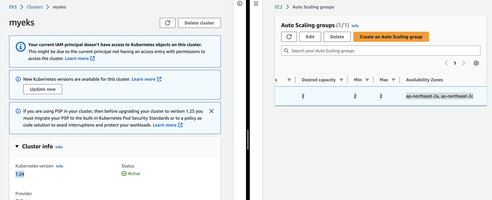

## 클러스터 엔드포인트 및 eks API 접속 시도

- 아래와 같이 클러스터 엔드포인트를 확인하고, 접속 시도  
  - API server endpoint access가 현재 Public으로 활성화되어 있기 때문에 접속은 가능.
  - AWS에서 관리하는 API 서버의 IP도 조회(=노출)된다.

```bash
# 클러스터 엔드포인트 확인
aws eks describe-cluster --name $CLUSTER_NAME | jq -r .cluster.endpoint

# API서버 IP 확인
APIDNS=$(aws eks describe-cluster --name $CLUSTER_NAME | jq -r .cluster.endpoint | cut -d '/' -f 3)
dig +short $APIDNS
```

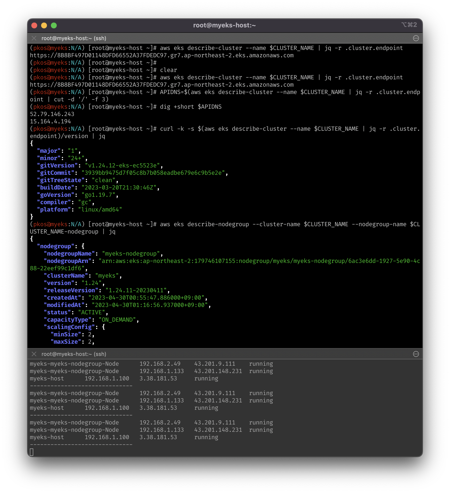

## kubectl로 생성된 클러스터 및 파드 확인

- 클러스터는 현재 온디맨드 t3.medium을 사용하고 있기 때문에, 빠르게 학습 확인하고 삭제하야여함
- 파드의 경우, 컨트롤 플레인이 AWS에서 관리하기 때문에, 해당 파드는 명령어로 확인할 수 없음. [온프레미스와 다른 점]
- 확인되는 ECR 이미지(~eksbuild~)를 pull하려고 하면 권한이 없다고 나옴.

```bash
kubectl get node --label-columns=node.kubernetes.io/instance-type,eks.amazonaws.com/capacityType,topology.kubernetes.io/zone
kubectl get node -v=6
kubectl get node --label-columns=eks.amazonaws.com/capacityType
kubectl get pod -n kube-system -o wide
```

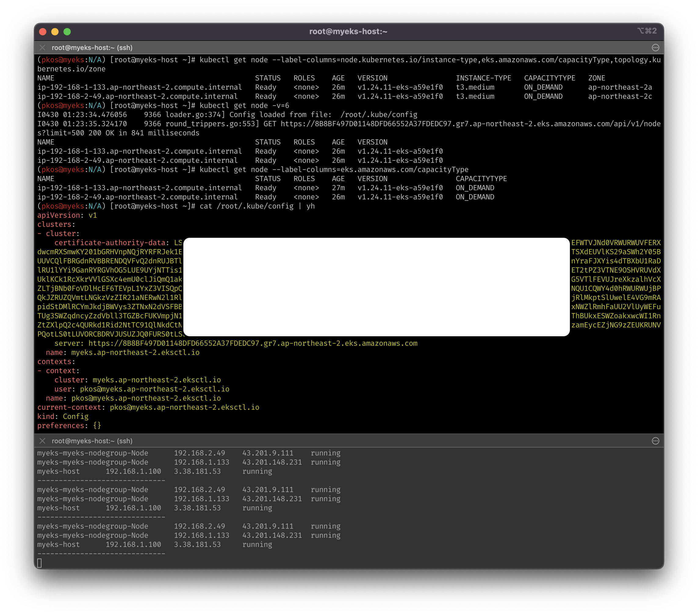

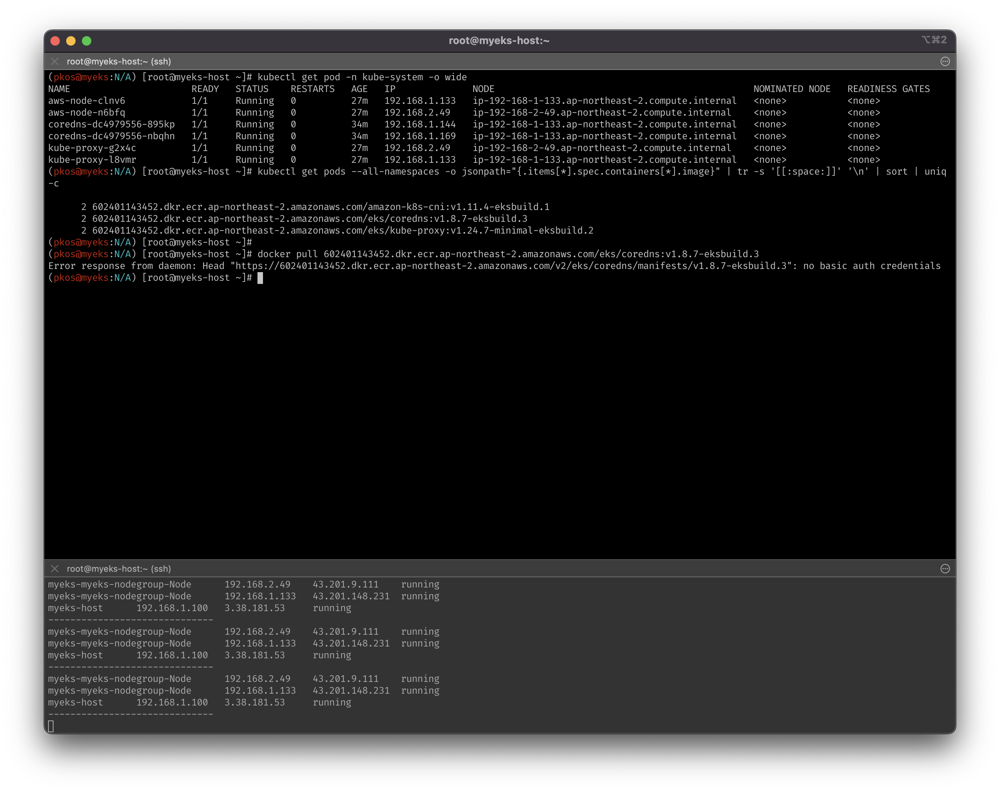

## 노드 ping 테스트 및 ssh 접속

- 노드는 Public Subnet에 생성되었기 때문에, ping 테스트가 당연히 될 줄 알았는데, 안됨
- ssh는 정상적으로 접속  
  - 이유는 해당 sg에서 ssh에 대해서만 허용이 걸려있어서, ping(ICMP)은 허용이 안되어있음
- myeks-host에서 워커노드(파드)에 ping을 날릴 수 있도록 정책을 풀어줘야함
- 참조  
  - [ICMP @cloudflare](https://www.cloudflare.com/ko-kr/learning/ddos/glossary/internet-control-message-protocol-icmp/)
  - [ICMP @NetApp](https://docs.netapp.com/ko-kr/e-series-santricity/sm-hardware/what-are-icmp-ping-responses.html)
  - [sg 프로토콜 '-1'의 의미](https://stackoverflow.com/questions/45519815/what-does-protocol-1-on-aws-security-group-egress-mean)

```bash
# EC2 인스턴스의 현재 IP확인 및 각 노드에 대한 IP값 저장 
aws ec2 describe-instances --query "Reservations[*].Instances[*].{PublicIPAdd:PublicIpAddress,PrivateIPAdd:PrivateIpAddress,InstanceName:Tags[?Key=='Name']|[0].Value,Status:State.Name}" --filters Name=instance-state-name,Values=running --output table
N1=$(kubectl get node --label-columns=topology.kubernetes.io/zone --selector=topology.kubernetes.io/zone=ap-northeast-2a -o jsonpath={.items[0].status.addresses[0].address})
N2=$(kubectl get node --label-columns=topology.kubernetes.io/zone --selector=topology.kubernetes.io/zone=ap-northeast-2c -o jsonpath={.items[0].status.addresses[0].address})
echo $N1, $N2

# ping 테스트
ping -c 2 $N1
ping -c 2 $N2

# 해당 sg 확인 
NGSGID=$(aws ec2 describe-security-groups --filters Name=group-name,Values=*nodegroup* --query "SecurityGroups[*].[GroupId]" --output text)
echo $NGSGID

# ssh는 정상 작동 확인
ssh -i ~/.ssh/id_rsa ec2-user@$N1 hostname

# 인바운드룰을 완화시켜서 ping이 가능하도록 변경 (오직 myeks-host에서만)
aws ec2 authorize-security-group-ingress --group-id $NGSGID --protocol '-1' --cidr 192.168.1.100/32
# {
#     "Return": true,
#     "SecurityGroupRules": [
#         {
#             "SecurityGroupRuleId": "sgr-0304dbf69b2b131b8",
#             "GroupId": "sg-0e863cf3d7a36790e",
#             "GroupOwnerId": "179746107155",
#             "IsEgress": false,
#             "IpProtocol": "-1",
#             "FromPort": -1,
#             "ToPort": -1,
#             "CidrIpv4": "192.168.1.100/32"
#         }
#     ]
# }
```

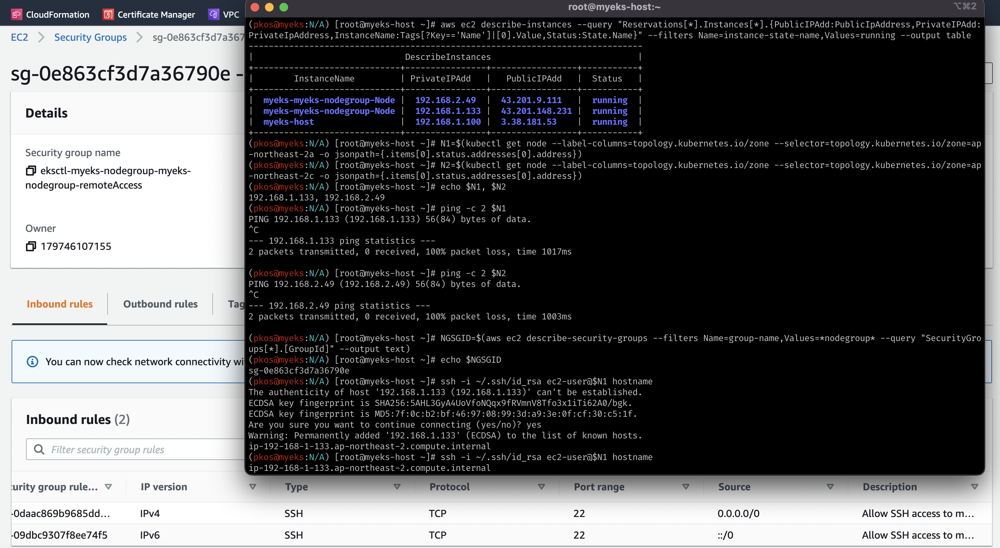

- 실제로, myeks-host로부터의 '모든' 트래픽이 허용되었음을 확인할 수 있다.
  - 캡처는 생략하였으나, ping이 정상적으로 되었음을 확인하였음.

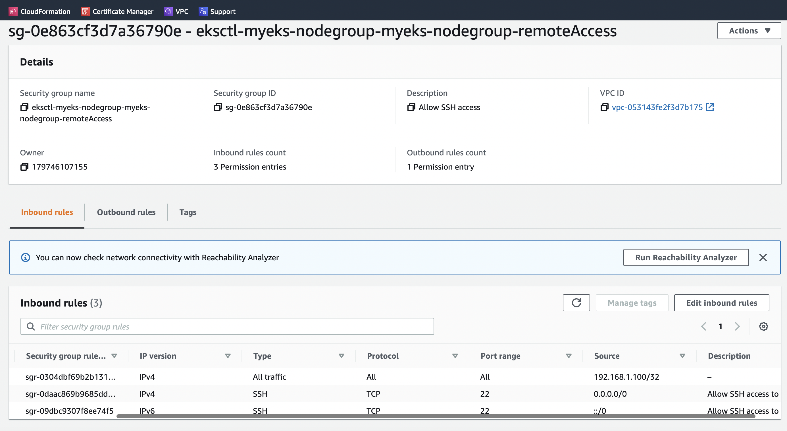

## EKS 테스트 서비스 배포 (mario)

- CLB...로 배포 테스트를 시행
- 정상적으로 구동되는 것을 확인할 수 있다.

```bash
curl -s -O https://raw.githubusercontent.com/gasida/PKOS/main/1/mario.yaml
kubectl apply -f mario.yaml

# 배포 확인 : CLB 배포 확인
kubectl get deploy,svc,ep mario

# 마리오 게임 접속 : CLB 주소로 웹 접속
kubectl get svc mario -o jsonpath={.status.loadBalancer.ingress[0].hostname} | awk '{ print "Maria URL = http://"$1 }'
```

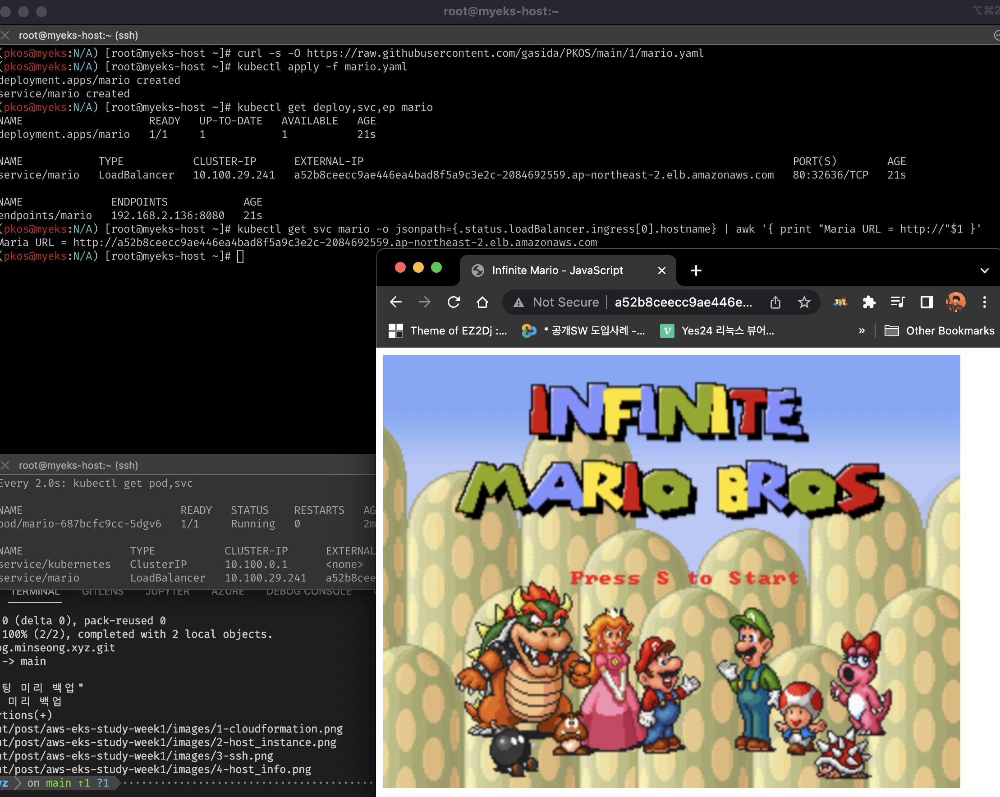

## reference

- [CloudNet@](https://www.notion.so/gasidaseo/CloudNet-Blog-c9dfa44a27ff431dafdd2edacc8a1863) Notion 및 Slack 채널
- [EKS userguide @AWS](https://docs.aws.amazon.com/eks/latest/userguide/cluster-endpoint.html)
- [ICMP def. @cloudflare](https://www.cloudflare.com/ko-kr/learning/ddos/glossary/internet-control-message-protocol-icmp/)
- [ICMP def. @NetApp](https://docs.netapp.com/ko-kr/e-series-santricity/sm-hardware/what-are-icmp-ping-responses.html)
- [What does protocol -1 on AWS security group egress mean? @stackoverflow](https://stackoverflow.com/questions/45519815/what-does-protocol-1-on-aws-security-group-egress-mean)
