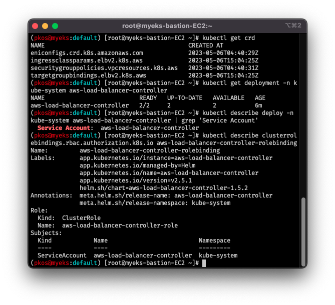

```note
# 아쉽게도 신규 항목인 istio, kube-ops-view는 실습 실패
- istio: `myhome.yaml` 을 어떻게 생성할지 몰라서 중단
- kube-ops-view: A레코드에 제대로 잡히지 않음
```

지난 1주차에 이어, 이번 주에는 EKS의 네트워크 구성에 대해 알아보는 시간이었습니다.  

직전 스터디에서도 바로 광탈당하나?하며 밤과 주말을 하얗게 불태웠을 정도로  
가장 고난도라고 생각했던 네트워크를 다시 만나니 이제 1% 친근감이 느껴지고 있네요.  


자 그럼 해보도록 합시다.

## 1. cloudformation을 활용한 EKS 원클릭 구성

- 학습을 위해, 이번에도 [가시다](https://www.notion.so/gasidaseo/CloudNet-Blog-c9dfa44a27ff431dafdd2edacc8a1863)님이 준비해주신 원클릭 배포 yaml을 활용하여 배포.
- **완전 배포까지 대략 20분 가량 소요**
- IAM에서 미리 발급해둔 액세스키/시크릿키를 알아두어야합니다.  

```bash
# 원클릭 셋업
aws cloudformation deploy --template-file ~/Documents/aews/eks-oneclick.yaml --stack-name myeks --parameter-overrides KeyName=aews SgIngressSshCidr=$(curl -s ipinfo.io/ip)/32 MyIamUserAccessKeyID={ACSSKEY|AKIA..}  MyIamUserSecretAccessKey={SECUKEY|7ob..} ClusterBaseName=myeks --region ap-northeast-2

# 컨트롤 플레인(마스터노드) 접속 확인
ssh -i ~/.ssh/aews.pem ec2-user@$(aws cloudformation describe-stacks --stack-name myeks --query 'Stacks[*].Outputs[0].OutputValue' --output text)
```


## 2. AWS VPC CNI w/기본 셋업 (in Control Plane)

- 네임스페이스는 미리 default로 설정.  
  이걸 깜박해서, 지난 스터디 때 헛된 시행착오를 반복했던 이력이 있음.  
- (워커)노드 IP 확인 및 변수 지정  
  워커노드는 EKS에서 `데이터플레인`이라고도 함.  
- eksctl addon으로 설치된 아래 3가지 항목의 정상 설치 확인  
  - codedns
  - kube-proxy
  - **vpc-cni**
- 스터디에서는 경이로운(?) AWS VPC CNI를 사용.  
  Calico CNI와 달리 데이터플레인(노드)의 AWS ENI(Elastic Network Interface)와 Pod가 같은 네트워크 대역(CIDR)을 사용한다!
- 예시:  
  - eth0(ENI): 10.10.1.1/24
  - Pod1: 10.10.1.**10**
  - Pod2: 10.10.1.**20**
- 실제로도 데이터플레인과 Pod가 같은 네트워크 대역을 사용한다.  
  (실습해보니 왜 IP까지 동일하지...? CIDR /32가 걸린건가? 혼란에 빠졌다!) **(To-Do)**

```bash
# default 네임스페이스 설정

kubectl ns default

# 데이터플레인 IP 확인 및 변수 지정

N1=$(kubectl get node --label-columns=topology.kubernetes.io/zone --selector=topology.kubernetes.io/zone=ap-northeast-2a -o jsonpath={.items[0].status.addresses[0].address}) 
N2=$(kubectl get node --label-columns=topology.kubernetes.io/zone --selector=topology.kubernetes.io/zone=ap-northeast-2b -o jsonpath={.items[0].status.addresses[0].address}) 
N3=$(kubectl get node --label-columns=topology.kubernetes.io/zone --selector=topology.kubernetes.io/zone=ap-northeast-2c -o jsonpath={.items[0].status.addresses[0].address}) 
echo "export N1=$N1" >> /etc/profile 
echo "export N2=$N2" >> /etc/profile 
echo "export N3=$N3" >> /etc/profile 
echo $N1, $N2, $N3

# 데이터플레인 <-> 컨트롤플레인 ssh 접속을 위해 모든 프로토콜 허용

NGSGID=$(aws ec2 describe-security-groups --filters Name=group-name,Values=*ng1* --query "SecurityGroups[*].[GroupId]" --output text) 
aws ec2 authorize-security-group-ingress --group-id $NGSGID --protocol '-1' --cidr 192.168.1.100/32

# 노드 ssh 접속 확인

ssh ec2-user@$N1 hostname 
ssh ec2-user@$N2 hostname 
ssh ec2-user@$N3 hostname

# eksctl addon 확인

eksctl get addon --cluster $CLUSTER_NAME

# 2023-05-04 19:04:32 [ℹ]  Kubernetes version "1.24" in use by cluster "myeks"
# 2023-05-04 19:04:32 [ℹ]  getting all addons
# 2023-05-04 19:04:33 [ℹ]  to see issues for an addon run `eksctl get addon --name <addon-name> --cluster <cluster-name>`
# NAME  VERSION   STATUS 
# coredns  v1.9.3-eksbuild.3 ACTIVE 
# kube-proxy v1.24.10-eksbuild.2 ACTIVE 
# vpc-cni  v1.12.6-eksbuild.1 ACTIVE 

# AWS VPC CNI 관련
# 각각 노드(데이터플레인)IP 와 Pod IP 확인하는 명령어

aws ec2 describe-instances --query "Reservations[*].Instances[*].{PublicIPAdd:PublicIpAddress,PrivateIPAdd:PrivateIpAddress,InstanceName:Tags[?Key=='Name']|[0].Value,Status:State.Name}" --filters Name=instance-state-name,Values=running --output table
kubectl get pod -n kube-system -o=custom-columns=NAME:.metadata.name,IP:.status.podIP,STATUS:.status.phase

# kube-proxy config 확인 (mode: “iptables” 사용)

kubectl describe cm -n kube-system kube-proxy-config | grep mode
```


### 2-1. kube-proxy에서 ipvs 대신 iptables를 사용하는 이유?  

- 가시다님이 설명하시길 ARP고정이나 가상 인터페이스 이슈 등으로 iptables를 쓰는 것으로 보인다고 하였음.  
- 더 찾아보니, 해당 이슈는 `19년 1월`부터 제기되어 왔음.  
  참조: [AWS-github](https://github.com/aws/containers-roadmap/issues/142#issuecomment-1367437044)
- `22년 12월`에 ipvs에 대한 지원이 GA되었음.  
  참조: [AWS-blog](https://aws.amazon.com/blogs/containers/amazon-eks-add-ons-advanced-configuration/)

- ipvs가 iptables보다 나은가?  
  해당 내용은 [KubeCon Europe 2019에서 발표된 내용](https://github.com/sbueringer/kubecon-slides/blob/master/slides/2017-kubecon-eu/Scale%20Kubernetes%20to%20Support%2050%2C000%20Services%20%5BI%5D%20-%20Haibin%20Xie%20%26%20Quinton%20Hoole%2C%20Huawei%20Technologies%20-%20Scale%20Kubernetes%20to%20Support%2050000%20Services.pdf)에서 언급된다.  
  - 아래와 같이 서비스의 수에 따라 [시간복잡도](https://blog.naver.com/alice_k106/221606077410)에 의해 발생하는 지연을 줄일 수 있다고 한다. (iptables: O(N), ipvs: O(1))


## 3. 데이터플레인(노드)의 네트워크 기본 정보 확인

- 노드에 tcpdump 등 네트워크 관련 도구를 설치를 하여 확인해본다.  
- [k8s CNI](https://kubernetes.io/docs/concepts/cluster-administration/networking/) : 쿠버네티스의 네트워크 환경을 구성해주는 플러그인 (Container Network Interface)  

```bash
# 각 데이터플레인에 도구 설치

ssh ec2-user@$N1 sudo yum install links tree jq tcpdump -y 
ssh ec2-user@$N2 sudo yum install links tree jq tcpdump -y 
ssh ec2-user@$N3 sudo yum install links tree jq tcpdump -y

# CNI 정보 확인(비슷비슷하므로 N2만 진행)

ssh ec2-user@$N2 tree /var/log/aws-routed-eni 
ssh ec2-user@$N2 cat /var/log/aws-routed-eni/plugin.log | jq # IP 할당시 CIDR 32 확인
ssh ec2-user@$N2 cat /var/log/aws-routed-eni/ipamd.log | jq  # maxENI 5개, 할당된 IP 1개 확인
ssh ec2-user@$N2 cat /var/log/aws-routed-eni/egress-v4-plugin.log | jq # 

# 네트워크 정보 확인 : eniY는 pod network 네임스페이스와 veth pair 

ssh ec2-user@$N2 sudo ip -br -c addr 
ssh ec2-user@$N1 sudo ip -c addr 
ssh ec2-user@$N2 sudo ip -c route 
ssh ec2-user@$N1 sudo iptables -t nat -S # iptables 룰 확인
ssh ec2-user@$N2 sudo iptables -t nat -L -n -v 
```


### 3-1. 데이터플레인의 기본 네트워크 정보 확인: 보조 IPv4 주소 확인

- 가시다님이 제공해주신 장표와 함께 확인.  


- (coredns Pod 기준)AWS 웹콘솔에서 확인해보면, 2가지 IP가 있음.
  - 프라이빗 주소 IP: ~~컨트롤~~데이터플레인의 IP주소
  - 보조 프라이빗 주소 IP:  
    - 데이터플레인에 Pod가 생성되면 바로 IP를 붙이기 위해 예약된 IP
    - L(ocal)-IPAM Warm **IP Pool**
    - 새로운 Pod에 할당할 Pool이 없으면, 새로 ENI(eth1 등)을 만들어서 할당함 (3-3 참조)
- 스크린샷에서는 veth 페어의 IP 주소는 `192.168.2.86`임을 확인.


```bash
# coredns 파드 IP 정보 확인
# 아래 스크린샷을 보면 알듯이 한국 리전 B존의 노드에 생성된 coredns 파드의 IP임을 알 수 있었다.

kubectl get pod -n kube-system -l k8s-app=kube-dns -owide

# 노드의 라우팅 정보 확인 >> EC2 네트워크 정보의 '보조 프라이빗 IPv4 주소'와 비교
# 웹 콘솔에서 한국 리전 B로 확인했으므로, N2의 정보를 확인.
# veth 페어의 IP 주소는 Pod의 IP 주소와 동일함.

ssh ec2-user@$N2 sudo ip -c route
```


### 3-2. veth(v-eth, virtual ethernet interface)

- 단어를 보고 단박에 가상eth 인건 알았지만, 자세한 건 아래의 글을 통해서 알 수 있음.  
  - [44bits-veth](https://www.44bits.io/ko/keyword/veth)
- 아래까지 참고한다면, veth의 실제를 알 수 있을 것으로 판단.
  - [44bit-컨테이너 네트워크 기초 2편](https://www.44bits.io/ko/post/container-network-2-ip-command-and-network-namespace)

### 3-3. 테스트용 파드 생성 w/netshoot

- [nicolaka/netshoot](https://github.com/nicolaka/netshoot) a.k.a. 네트워크 장애해결용 맥가이버칼
- 다른 터미널로 데이터플레인 모니터링을 병행
- 스크린샷을 참조하면 N1에서 처음에 네트워크 인터페이스가 하나 밖에 없다는 것을 알았으므로,  
  이번 실습을 통해 네트워크 어댑터가 하나 더 생기는 것을 관찰하기 위해서임  
  - `2.`에서 생겼던 궁금증이 약간? 해소된 것 같다.

```bash
# (다른 터미널을 띄워서) 아래와 같이 3개를 모니터링

ssh ec2-user@$N1
watch -d "ip link | egrep 'eth|eni' ;echo;echo "[ROUTE TABLE]"; route -n | grep eni"

ssh ec2-user@$N2
watch -d "ip link | egrep 'eth|eni' ;echo;echo "[ROUTE TABLE]"; route -n | grep eni"

ssh ec2-user@$N3
watch -d "ip link | egrep 'eth|eni' ;echo;echo "[ROUTE TABLE]"; route -n | grep eni"

# 컨트롤플레인에서 netshoot 파드 생성 명령
# 그러면 각 데이터플레인에서 변화가 생기는데 
# 이번 경우에는 $N3에서 eth1이 생성됨을 확인할 수 있음

cat <<EOF | kubectl create -f -
apiVersion: apps/v1
kind: Deployment
metadata:
  name: netshoot-pod
spec:
  replicas: 3
  selector:
    matchLabels:
      app: netshoot-pod
  template:
    metadata:
      labels:
        app: netshoot-pod
    spec:
      containers:
      - name: netshoot-pod
        image: nicolaka/netshoot
        command: ["tail"]
        args: ["-f", "/dev/null"]
      terminationGracePeriodSeconds: 0
EOF
```


## 4. 데이터플레인(노드)간 통신 확인

- AWS VPC CNI를 쓰는 경우, NAT 동작(Overlay) 없이, VPC 내부에서 통신이 가능하다.
  - 데이터플레인에 있는 ENI(eth0 등)을 타고 노드 간 통신을 한다.

```bash
# 파드 이름 변수 지정

PODNAME1=$(kubectl get pod -l app=netshoot-pod -o jsonpath={.items[0].metadata.name})
PODNAME2=$(kubectl get pod -l app=netshoot-pod -o jsonpath={.items[1].metadata.name})
PODNAME3=$(kubectl get pod -l app=netshoot-pod -o jsonpath={.items[2].metadata.name})

# 파드 IP 변수 지정

PODIP1=$(kubectl get pod -l app=netshoot-pod -o jsonpath={.items[0].status.podIP})
PODIP2=$(kubectl get pod -l app=netshoot-pod -o jsonpath={.items[1].status.podIP})
PODIP3=$(kubectl get pod -l app=netshoot-pod -o jsonpath={.items[2].status.podIP})

# 각 파드(데이터플레인)에서 tcpdump로 ping 패킷 미리 대기
# [$N1, $N2, $N3]
sudo tcpdump -i any -nn icmp
```


### 번외: eth0 나 eth1 만 패킷 모니터링해보기

- 이론 상으로는 eth0의 인터페이스를 쓰고 있어서 eth1에서는 안 떠야(?)하는데,  
  실제 `$N2`에서는 eth0은 안쓰고, eth1을 쓰는 것으로 확인됨. 무슨 일인가.. **To-Do**

```bash
sudo tcpdump -i eth0 -nn icmp
sudo tcpdump -i eth1 -nn icmp
```


## 5. 데이터플레인(노드)에서 외부 통신

- EXTERNAL SNAT(Source Network Address Translation) 설정에 따라,  
  외부 통신 시 SNAT 사용 여부를 결정할 수 있음  
- 아래 실습을 통해 확인  
  - 외부 ping 테스트  
  - 데이터플레인에서 정보(tcpdump, iptables) 확인

```bash
# 데이터플레인의 파드에서 외부 ping 테스트

kubectl exec -it $PODNAME1 -- ping -c 1 www.google.com

# 데이터플레인: TCPDUMP 확인 ($N3) 및 iptables 규칙 확인

sudo tcpdump -i any -nn icmp
sudo tcpdump -i eth0 -nn icmp

ip rule
ip route show table main
sudo iptables -L -n -v -t nat
sudo iptables -t nat -S

# AWS-SNAT-CHAIN-0, AWS-SNAT-CHAIN-1에 대한 정보 확인

sudo iptables -t nat -S | grep 'A AWS-SNAT-CHAIN'

# conntrack 확인
# 169.254.169.x : 인스턴스 메타데이터 서비스의 IPv4 주소
# 출처: https://zetawiki.com/wiki/IP%EC%A3%BC%EC%86%8C_169.254.169.254

sudo conntrack -L -n |grep -v '169.254.169'

# 데이터플레인에서 SNAT체인 모니터링 준비

watch -d 'sudo iptables -v --numeric --table nat --list AWS-SNAT-CHAIN-0; echo ; sudo iptables -v --numeric --table nat --list AWS-SNAT-CHAIN-1; echo ; sudo iptables -v --numeric --table nat --list KUBE-POSTROUTING'

# 데이터플레인의 파드에서 외부 ping 테스트 

kubectl exec -it $PODNAME1 -- ping -i 0.1 www.google.com
```


- 여태껏 $N1에 $PODNAME1이 있는 줄 알았는데, 예상값이 이상해서 찍어보니 $N3였음;


- 위에서 보다시피, AWS-SNAT-CHAIN-0에 의해 데이터플레인 CIDR대역이 아니면,  
  AWS-SNAT-CHAIN-1로 점프시켜서, 데이터플레인의 Private IP로 입혀서 외부로 내보낸다.  
  - 그래서, 데이터플레인(노드)의 Public IP로 나가는 것을 볼 수 있다.

- [**매스커레이딩**](https://www.joongang.co.kr/article/1051848#home)

## 6. 데이터플레인(노드)에 파드 생성 갯수 제한

- 요약: **((MaxENI * (IPv4addr-1)) + 2)**  
  - MaxENI:  
    Number of network interfaces for the instance type
  - IPv4addr:  
    the number of IP address per network interface

- t3.medium 경우 :
  - (3 * (6 - 1)) + 2 = 17개
  - 그러나, aws-node 와 kube-proxy 2개 제외하면 15개
- Secondary IPv4 address로는 각 인스턴스마다 제한이 있음.  
  - IPv4 접두사 위임(Prefix Delegation)으로 해결 가능하지만,  
    이번에는 다루지 않음(기본 내용으로도 살짝 부하)  
- 실습에서는 t3 타입의 정보 및 데이터플레인 내에서 할당 갯수를 확인한 다음,  
  실제로 파드를 생성해보면서 확인해본다.

```bash
# t3 타입의 정보(필터) 확인

aws ec2 describe-instance-types --filters Name=instance-type,Values=t3.* \
 --query "InstanceTypes[].{Type: InstanceType, MaxENI: NetworkInfo.MaximumNetworkInterfaces, IPv4addr: NetworkInfo.Ipv4AddressesPerInterface}" \
 --output table

# 데이터플레인 상세 정보 확인 : 노드 상세 정보의 Allocatable 에 pods 에 17개 정보 확인

kubectl describe node | grep Allocatable: -A7

# 데이터플레인에서 모니터링 대기

while true; do ip -br -c addr show && echo "--------------" ; date "+%Y-%m-%d %H:%M:%S" ; sleep 1; done

# 컨트롤플레인에서 모니터링 대기

watch -d 'kubectl get pods -o wide'

# 컨트롤플레인에서 파드 생성 명령

curl -s -O https://raw.githubusercontent.com/gasida/PKOS/main/2/nginx-dp.yaml
kubectl apply -f nginx-dp.yaml

# 컨트롤플레인에서 파드 증가 테스트(50개) 및 실패 확인: Too many pods

kubectl scale deployment nginx-deployment --replicas=50
kubectl get pods | grep Pending
kubectl describe pod ${Pending된 파드} | grep Events: -A5

# 디플로이먼트 삭제
kubectl delete deploy nginx-deployment
```


## 7. Service & AWS LoadBalancer Controller

- 서비스 방법에는 아래와 같은 종류가 있음
  1. ClusterIP:  
     - 컨트롤플레인의 iptables룰에 의해 데이터플레인 내의 `Pod IP`로 접근
     - 클러스터 내에서만 접근 가능
  2. NodePort:  
     - 고정 포트(NodePort)로 각 데이터플레인의 IP에 접근
     - 각 데이터플레인(노드)에 있는 iptables룰에 의해 `Pod IP`로 접근
  3. LoadBalancer: **기본값**
     - 클라우드 공급자(CSP)의 로드밸런서를 활용, 데이터플레인 앞에 로드밸런서가 있음.
     - (NLB 인스턴스 유형 기준) 이걸 거친 다음 각 데이터플레인의 iptables를 타고, 파드로 접근
  4. Service (LoadBalancer Controller + NLB IP모드)
     - w/**AWS VPC CNI**: 이번 실습에서 AWS VPC CNI를 쓰는 이유
     - iptables를 타지 않고, **Bypass**로 바로 `Pod IP`로 접근
     - 이게 가능한 이유는 별도의 LB 컨트롤러 파드가 있고,  
       여기에 Pod IP 정보를 지속적으로 제공

- 그래서 마지막의 방법을 쓰려면 OIDC를 활용해서, LB컨트롤러 IAM 정책을 적용해야함.  
  - OIDC: OpenID Connect(IdP)  
    - OAuth2.0와 거의 유사하다고 김세웅님께서 설명해주심.  
  - 이전 스터디에서 IAM 정책이 적용되어서 중복 에러가 뜨지만, 확인에는 문제 없음.
  - 이렇게 권한을 주는 것을 **IRSA(IAM Roles Service Account)** 라고 함.
    - 출처: [IRSA@채널톡](https://channel.io/ko/blog/tech-aws-cross-accounts-irsa)

```bash
# OIDC 확인

aws eks describe-cluster --name $CLUSTER_NAME --query "cluster.identity.oidc.issuer" --output text

aws iam list-open-id-connect-providers | jq

# IAM Policy (AWSLoadBalancerControllerIAMPolicy) 생성

curl -o iam_policy.json https://raw.githubusercontent.com/kubernetes-sigs/aws-load-balancer-controller/v2.4.7/docs/install/iam_policy.json

# 이미 있다면, 아래의 명령어는 에러를 발생시키지만 무시해도 됨.

aws iam create-policy --policy-name AWSLoadBalancerControllerIAMPolicy --policy-document file://iam_policy.json

# 생성된 IAM Policy Arn 확인

aws iam list-policies --scope Local
aws iam get-policy --policy-arn arn:aws:iam::$ACCOUNT_ID:policy/AWSLoadBalancerControllerIAMPolicy
aws iam get-policy --policy-arn arn:aws:iam::$ACCOUNT_ID:policy/AWSLoadBalancerControllerIAMPolicy --query 'Policy.Arn'

# IRSA 생성 w/cloudformation

eksctl create iamserviceaccount --cluster=$CLUSTER_NAME --namespace=kube-system --name=aws-load-balancer-controller \
--attach-policy-arn=arn:aws:iam::$ACCOUNT_ID:policy/AWSLoadBalancerControllerIAMPolicy --override-existing-serviceaccounts --approve

# IRSA 및 서비스 어카운트 확인

eksctl get iamserviceaccount --cluster $CLUSTER_NAME
kubectl get serviceaccounts -n kube-system aws-load-balancer-controller -o yaml | yh

# Helm Chart 설치 for AWS LoadBalancer Controller

helm repo add eks https://aws.github.io/eks-charts
helm repo update
helm install aws-load-balancer-controller eks/aws-load-balancer-controller -n kube-system --set clusterName=$CLUSTER_NAME \
  --set serviceAccount.create=false --set serviceAccount.name=aws-load-balancer-controller

kubectl get crd
kubectl get deployment -n kube-system aws-load-balancer-controller
kubectl describe deploy -n kube-system aws-load-balancer-controller | grep 'Service Account'

# 클러스터롤 확인

kubectl describe clusterrolebindings.rbac.authorization.k8s.io aws-load-balancer-controller-rolebinding
```




- 웹 콘솔에서 IAM 신뢰관계(Trust Relationships)를 확인
  - 평소에는 `sts:AssumeRole`을 많이 봐왔는데, 이번에는 `sts:AssumeRoleWithWebIdentity`를 볼 수 있음.
  - [IAM신뢰관계@AWS](https://aws.amazon.com/ko/blogs/korea/how-to-use-trust-policies-with-iam-roles-html/)


### 7-1. NLB를 활용한 서비스/파드 생성

```bash
# 모니터링

watch -d kubectl get pod,svc,ep

# 디플로이먼트 & 서비스 생성

curl -s -O https://raw.githubusercontent.com/gasida/PKOS/main/2/echo-service-nlb.yaml
cat echo-service-nlb.yaml | yh
kubectl apply -f echo-service-nlb.yaml

# 확인

kubectl get deploy,pod
kubectl get svc,ep,ingressclassparams,targetgroupbindings
kubectl get targetgroupbindings -o json | jq

# AWS ELB(NLB) 정보 확인

aws elbv2 describe-load-balancers | jq
aws elbv2 describe-load-balancers --query 'LoadBalancers[*].State.Code' --output text

# 웹 접속 주소 확인
kubectl get svc svc-nlb-ip-type -o jsonpath={.status.loadBalancer.ingress[0].hostname} | awk '{ print "Pod Web URL = http://"$1 }'

# 파드 로깅 모니터링
kubectl logs -l app=deploy-websrv -f

# 분산 접속 확인
NLB=$(kubectl get svc svc-nlb-ip-type -o jsonpath={.status.loadBalancer.ingress[0].hostname})
curl -s $NLB
for i in {1..100}; do curl -s $NLB | grep Hostname ; done | sort | uniq -c | sort -nr
```


### 7-2. Scaling down/up

- 파드 2개 -> 1개 -> 3개로 스케일링
  - 특히, draining 중인 파드는 무시하고 스케일링을 진행함.
- 당연한 말이겠지만, LB Controller 파드가 따로 있기 때문에 가능한 일

```bash
# 컨트롤플레인에서 레플리카 수 변경 (2 -> 1 -> 3)
# 웹 콘솔에서 NLB 상태 확인

kubectl scale deployment deploy-echo --replicas=1
kubectl scale deployment deploy-echo --replicas=3

# AWS LB Controller

kubectl describe deploy -n kube-system aws-load-balancer-controller | grep 'Service count'

# [AWS LB Ctrl] 클러스터 롤 바인딩 정보 확인

kubectl describe clusterrolebindings.rbac.authorization.k8s.io aws-load-balancer-controller-rolebinding

# [AWS LB Ctrl] 클러스터롤 확인 

kubectl describe clusterroles.rbac.authorization.k8s.io aws-load-balancer-controller-role

# 실습 리소스 삭제

kubectl delete deploy deploy-echo; kubectl delete svc svc-nlb-ip-type
```


### 7-3. NLB 대상 타겟을 Instance mode로 설정해보기

- NLB IP Target & Proxy Protocol v2 활성화 : NLB에서 바로 파드로 인입 및 ClientIP 확인 설정  

```bash
# 생성

cat <<EOF | kubectl create -f -
apiVersion: apps/v1
kind: Deployment
metadata:
  name: gasida-web
spec:
  replicas: 1
  selector:
    matchLabels:
      app: gasida-web
  template:
    metadata:
      labels:
        app: gasida-web
    spec:
      terminationGracePeriodSeconds: 0
      containers:
      - name: gasida-web
        image: gasida/httpd:pp
        ports:
        - containerPort: 80
---
apiVersion: v1
kind: Service
metadata:
  name: svc-nlb-ip-type-pp
  annotations:
    service.beta.kubernetes.io/aws-load-balancer-nlb-target-type: ip
    service.beta.kubernetes.io/aws-load-balancer-scheme: internet-facing
    service.beta.kubernetes.io/aws-load-balancer-cross-zone-load-balancing-enabled: "true"
    service.beta.kubernetes.io/aws-load-balancer-proxy-protocol: "*"
spec:
  ports:
    - port: 80
      targetPort: 80
      protocol: TCP
  type: LoadBalancer
  loadBalancerClass: service.k8s.aws/nlb
  selector:
    app: gasida-web
EOF

# 확인

kubectl get svc,ep
kubectl describe svc svc-nlb-ip-type-pp
kubectl describe svc svc-nlb-ip-type-pp | grep Annotations: -A5

# apache에 proxy protocol 활성화 확인

kubectl exec deploy/gasida-web -- apachectl -t -D DUMP_MODULES
kubectl exec deploy/gasida-web -- cat /usr/local/apache2/conf/httpd.conf

# 접속 확인

NLB=$(kubectl get svc svc-nlb-ip-type-pp -o jsonpath={.status.loadBalancer.ingress[0].hostname})
curl -s $NLB

# 지속적인 접속 시도 : 아래 상세 동작 확인 시 유용(패킷 덤프 등)

while true; do curl -s --connect-timeout 1 $NLB; echo "----------" ; date "+%Y-%m-%d %H:%M:%S" ; sleep 1; done

# 로그 확인

kubectl logs -l app=gasida-web -f

# 삭제

kubectl delete deploy gasida-web; kubectl delete svc svc-nlb-ip-type-pp
```


## 8. Ingress

- 클러스터 내부의 서비스(ClusterIP, NodePort, Loadbalancer)를 외부로 노출(HTTP/HTTPS)
- Web Proxy 역할: 어라 그러면, ClusterIP를 써도....(?)

- `AWS VPC CNI` 에서 AWS LB 컨트롤러 + Ingress (ALB) IP 모드 동작  
  - 바로 파드의 IP로 통신이 가능

```bash
# 게임 파드와 Service, Ingress 배포

curl -s -O https://raw.githubusercontent.com/gasida/PKOS/main/3/ingress1.yaml
kubectl apply -f ingress1.yaml

# 모니터링

watch -d kubectl get pod,ingress,svc,ep -n game-2048

# 생성 확인

kubectl get-all -n game-2048
kubectl get ingress,svc,ep,pod -n game-2048
kubectl get targetgroupbindings -n game-2048

# Ingress 확인

kubectl describe ingress -n game-2048 ingress-2048

# 게임 접속 : ALB 주소로 웹 접속

kubectl get ingress -n game-2048 ingress-2048 -o jsonpath={.status.loadBalancer.ingress[0].hostname} | awk '{ print "Game URL = http://"$1 }'

# 파드 IP 확인

kubectl get pod -n game-2048 -owide

# 파드 스케일 모니터링

watch kubectl get pod -n game-2048

# 파드 3개로 증가

kubectl scale deployment -n game-2048 deployment-2048 --replicas 3

# 파드 1개로 감소

kubectl scale deployment -n game-2048 deployment-2048 --replicas 1

# 삭제

kubectl delete ingress ingress-2048 -n game-2048
kubectl delete svc service-2048 -n game-2048 && kubectl delete deploy deployment-2048 -n game-2048 && kubectl delete ns game-2048
```


## 9. External DNS

- 외부 DNS 서비스를 통해 도메인을 통해 접속 가능하도록 설정
- AWS Route53에 Public 도메인을 등록시켜놓았음
- ExternalDNS CTRL 권한 주는 방법 3가지:  
  1. **Node IAM Role**: EKS 원클릭 배포 시 설정되어 있음
     - eksctl create cluster ... **--external-dns-access** ...
  2. Static credentials
  3. IRSA

### 9-1. Route53 정보 확인 및 변수 지정

- 중간에 명령어가 잘못되었는지, 제대로 값이 뜨지 않는 것이 있었음

```bash
# 도메인 변수 지정

# MyDomain=<소유한 도메인>
MyDomain=awskops.click

# Route 53 도메인 ID 조회 및 변수 지정 

aws route53 list-hosted-zones-by-name --dns-name "${MyDomain}." | jq
MyDnzHostedZoneId=`aws route53 list-hosted-zones-by-name --dns-name "${MyDomain}." --query "HostedZones[0].Id" --output text`
echo $MyDnzHostedZoneId

# A 레코드 타입 조회: 정상적으로 조회되지 않음

aws route53 list-resource-record-sets --hosted-zone-id "${MyDnzHostedZoneId}" --query "ResourceRecordSets[?Type == 'A'].Name" --output text
```

### 9-2. ExternalDNS 설치

```bash
# Route53 변수 확인

echo $MyDomain, $MyDnzHostedZoneId

# ExternalDNS 배포

curl -s -O https://raw.githubusercontent.com/gasida/PKOS/main/aews/externaldns.yaml
MyDomain=$MyDomain MyDnzHostedZoneId=$MyDnzHostedZoneId envsubst < externaldns.yaml | kubectl apply -f -

# 확인 및 로그 모니터링

kubectl get pod -l app.kubernetes.io/name=external-dns -n kube-system
kubectl logs deploy/external-dns -n kube-system -f
```


### 9-3. Service(NLB) + 도메인 연동(ExternalDNS)

- 리소스 삭제 시, ExternalDNS에 의해 A레코드도 함께 제거됨을 확인

```bash
# 모니터링 준비 및 로그 조회

watch -d 'kubectl get pod,svc'
kubectl logs deploy/external-dns -n kube-system -f

# 테트리스 디플로이먼트 배포

cat <<EOF | kubectl create -f -
apiVersion: apps/v1
kind: Deployment
metadata:
  name: tetris
  labels:
    app: tetris
spec:
  replicas: 1
  selector:
    matchLabels:
      app: tetris
  template:
    metadata:
      labels:
        app: tetris
    spec:
      containers:
      - name: tetris
        image: bsord/tetris
---
apiVersion: v1
kind: Service
metadata:
  name: tetris
  annotations:
    service.beta.kubernetes.io/aws-load-balancer-nlb-target-type: ip
    service.beta.kubernetes.io/aws-load-balancer-scheme: internet-facing
    service.beta.kubernetes.io/aws-load-balancer-cross-zone-load-balancing-enabled: "true"
    service.beta.kubernetes.io/aws-load-balancer-backend-protocol: "http"
    #service.beta.kubernetes.io/aws-load-balancer-healthcheck-port: "80"
spec:
  selector:
    app: tetris
  ports:
  - port: 80
    protocol: TCP
    targetPort: 80
  type: LoadBalancer
  loadBalancerClass: service.k8s.aws/nlb
EOF

# 배포 확인 : CLB 배포 확인

kubectl get deploy,svc,ep tetris

# NLB에 ExternanDNS 로 도메인 연결

kubectl annotate service tetris "external-dns.alpha.kubernetes.io/hostname=tetris.$MyDomain"

# Route53에 A레코드 확인
# jq 까지 하는 경우 정상적으로 조회되지 않음;;

aws route53 list-resource-record-sets --hosted-zone-id "${MyDnzHostedZoneId}" --query "ResourceRecordSets[?Type == 'A']" | jq
aws route53 list-resource-record-sets --hosted-zone-id "${MyDnzHostedZoneId}" --query "ResourceRecordSets[?Type == 'A'].Name" | jq .[]

# Public IP(도메인 DNS) 확인

dig +short tetris.$MyDomain @8.8.8.8
dig +short tetris.$MyDomain

# 도메인 체크

echo -e "My Domain Checker = https://www.whatsmydns.net/#A/tetris.$MyDomain"

# 웹 접속 주소 확인 및 접속

echo -e "Tetris Game URL = http://tetris.$MyDomain"

# 리소스 삭제

kubectl delete deploy,svc tetris
```


-with-domain.png)


## 10. Envoy (반쪽 실습)

- istio를 위해 설치는 했으나, istio가 제대로 안되서 Envoy만 기재
- Envoy: L7 Proxy, istio의 Sidecar proxy
  - istiod: 컨트롤플레인
  - Envoy: 데이터플레인 (istio-proxy > envoy)
    - istio-proxy 안에 Envoy가 들어있다는 것

```bash
# 컨트롤플레인에 Envoy 설치

sudo rpm --import 'https://rpm.dl.getenvoy.io/public/gpg.CF716AF503183491.key'
curl -sL 'https://rpm.dl.getenvoy.io/public/config.rpm.txt?distro=el&codename=7' > /tmp/tetrate-getenvoy-rpm-stable.repo
sudo yum-config-manager --add-repo '/tmp/tetrate-getenvoy-rpm-stable.repo'
sudo yum makecache --disablerepo='*' --enablerepo='tetrate-getenvoy-rpm-stable' -y
sudo yum install getenvoy-envoy -y

envoy --version
```


### 10-1. Envoy proxy 실습 w.Envoy-demo

- Envoy 상에서 웹서버 구동을 위한 `myhome.yaml` 생성 방법을 이해하지 못함
  - 직전까지 하여, 데모 페이지 및 어드민 페이지 확인

```bash
# 데모 config 적용하여 실행
# `connect_timeout` missing 에러 출력되면서 실행 실패

curl -O https://www.envoyproxy.io/docs/envoy/latest/_downloads/92dcb9714fb6bc288d042029b34c0de4/envoy-demo.yaml
envoy -c envoy-demo.yaml

# connect_timeout 추가 후 다시 실행

sed -i'' -r -e "/dns_lookup_family/a\    connect_timeout: 5s" envoy-demo.yaml
envoy -c envoy-demo.yaml

# 정보 확인
# ... 0.0.0.0:10000  0.0.0.0:*  users:(("envoy" ...

ss -tnlp

# 접속 테스트

curl -s http://127.0.0.1:10000 | grep -o "<title>.*</title>"
<title>Envoy Proxy - Home</title>

# envoy 데모 페이지 확인

echo -e "Envoy Proxy Demo = http://$(curl -s ipinfo.io/ip):10000"

# 연결 정보 확인

ss -tnp

# 기존 envoy 실행 취소 후 (관리자페이지) 설정 덮어쓰기

cat <<EOT> envoy-override.yaml
admin:
  address:
    socket_address:
      address: 0.0.0.0
      port_value: 9902
EOT
envoy -c envoy-demo.yaml --config-yaml "$(cat envoy-override.yaml)"

# 웹브라우저에서 http://192.168.10.254:9902 접속 확인
# 어드민 페이지 접속 확인

echo -e "Envoy Proxy Demo = http://$(curl -s ipinfo.io/ip):9902"
```


## 11. 파드간 속도 측정

- iperf3:
  - 서버 모드로 동작하는 단말과 클라이언트 모드로 동작하는 단말로 구성해서 최대 네트워크 대역폭 측정  
  - TCP, UDP, SCTP 지원

### 11-1. iperf3 배포

- 서버 모드와 클라이언트 모드가 각각 다른 데이터플레인에 배포되어야 함
  - 실제 실습의 경우에는 $N1에 서버 모드, $N3에 클라이언트 모드 배포 확인

```bash
# 배포

curl -s -O https://raw.githubusercontent.com/gasida/PKOS/main/aews/k8s-iperf3.yaml
kubectl apply -f k8s-iperf3.yaml

# 확인 : 서버와 클라이언트가 다른 데이터플레인에 배포되었는지 확인

kubectl get deploy,svc,pod -owide

# 서버 파드 로그 확인 : 기본 5201 포트 Listen

kubectl logs -l app=iperf3-server -f
```

### 11-2. iperf3 테스트

1. TCP 5201, 측정시간 5초
2. UDP 사용, 역방향 모드(-R)
3. TCP, 쌍방향 모드(-R)  
   - 해당사항 실습 누락함
4. TCP 다중 스트림(30개), -P(number of parallel client streams to run)

```bash
# 공통 모니터링
# 서버 파드 로그 확인 : 기본 5201 포트 Listen

kubectl logs -l app=iperf3-server -f

# 1. TCP 5201, 측정시간 5초 

kubectl exec -it deploy/iperf3-client -- iperf3 -c iperf3-server -t 5

# 2. UDP 사용, 역방향 모드(-R)

kubectl exec -it deploy/iperf3-client -- iperf3 -c iperf3-server -u -b 20G

# 3. TCP, 쌍방향 모드(-R)

kubectl exec -it deploy/iperf3-client -- iperf3 -c iperf3-server -t 5 --bidir

# 4. TCP 다중 스트림(30개), -P(number of parallel client streams to run)

kubectl exec -it deploy/iperf3-client -- iperf3 -c iperf3-server -t 10 -P 2

# 실습 리소스 삭제

kubectl delete -f k8s-iperf3.yaml
```


## reference

- [CloudNet@](https://gasidaseo.notion.site/CloudNet-Blog-c9dfa44a27ff431dafdd2edacc8a1863) Notion 및 Slack 채널
- [kube-proxy ipvs issue @AWS Github](https://github.com/aws/containers-roadmap/issues/142#issuecomment-1367437044)
- [EKS addons advanced configuration @AWS blog](https://aws.amazon.com/blogs/containers/amazon-eks-add-ons-advanced-configuration/)
- [ipvs vs iptables](https://blog.naver.com/alice_k106/221606077410)
- [veth @44bits](https://www.44bits.io/ko/keyword/veth)
- [169.254.169.254 @zetawiki](https://zetawiki.com/wiki/IP%EC%A3%BC%EC%86%8C_169.254.169.254)
- [masquerading @joongang](https://www.joongang.co.kr/article/1051848#home)
- [IRSA @channel.io](https://channel.io/ko/blog/tech-aws-cross-accounts-irsa)
- [Trust Policies with IAM roles @AWS blog](https://aws.amazon.com/ko/blogs/korea/how-to-use-trust-policies-with-iam-roles-html/)
