이번 주차에는 스토리지에 대해 실습을 진행해보았습니다.
지난번 kOps 스터디에서 다루었던 내용이지만, 부족했던 내용을 보충하면서 작성을 해보았습니다.

주요한 내용은...

- NodeAffinity를 이용한 라벨링
- AWS EBS controller의 경우, AWS managed policy를 활용
- AWS Volume SnapShots Controller를 통한 볼륨 백업
- AWS EFS controller에서의 동적 프로비저닝
- AWS EKS 신규 노드그룹 생성

별도로 `kube-ops-view`의 경우, 웹으로 확인할 수 있을 때까지 시간이 소요된다는 점이 있습니다.

## 1. 실습 환경 배포

- 2주차에 실습했던 내용들을 미리 배포  
   1. AWS LB
   2. ExternalDNS
   3. kube-ops-view
- context 이름 변경  
  - 지난 번까지 pkos가 뜨는 현상이 있었는데, 닉네임을 별도 지정할 수 있음
- EFS 생성 관련 cloudformation이 추가되었음
  - EFS FS ID 조회를 하기 위해 aws-cli 필터 활용 [(출처: AWS Docs)](https://docs.aws.amazon.com/ko_kr/cli/latest/userguide/cli-usage-filter.html)

```bash
# 실습 YAML 파일
curl -O https://s3.ap-northeast-2.amazonaws.com/cloudformation.cloudneta.net/K8S/eks-oneclick2.yaml

# cloudformation 스택 생성
aws cloudformation deploy --template-file eks-oneclick2.yaml --stack-name myeks --parameter-overrides KeyName=aews SgIngressSshCidr=$(curl -s ipinfo.io/ip)/32  MyIamUserAccessKeyID=AKIA5... MyIamUserSecretAccessKey=CVNa2... ClusterBaseName=myeks --region ap-northeast-2

ssh -i ~/.ssh/aews.pem ec2-user@$(aws cloudformation describe-stacks --stack-name myeks --query 'Stacks[*].Outputs[0].OutputValue' --output text)

# default 네임스페이스 적용
kubectl ns default

# (옵션) context 이름 변경
NICK=kkumtree
kubectl ctx
kubectl config rename-context admin@myeks.ap-northeast-2.eksctl.io $NICK@myeks

# EFS 확인 : AWS 관리콘솔 EFS 확인
EfsFsId=$(aws efs describe-file-systems --query 'FileSystems[*].FileSystemId' --output text)
echo $EfsFsId
mount -t nfs4 -o nfsvers=4.1,rsize=1048576,wsize=1048576,hard,timeo=600,retrans=2,noresvport $EfsFsId.efs.ap-northeast-2.amazonaws.com:/ /mnt/myefs
df -hT --type nfs4
mount | grep nfs4
echo "Test efs exist with file " > /mnt/myefs/memo.txt
cat /mnt/myefs/memo.txt
rm -f /mnt/myefs/memo.txt

# 스토리지클래스 및 CSI 노드 확인
kubectl get sc
kubectl get sc gp2 -o yaml | yh
kubectl get csinodes

# 노드 정보 확인
kubectl get node --label-columns=node.kubernetes.io/instance-type,eks.amazonaws.com/capacityType,topology.kubernetes.io/zone
eksctl get iamidentitymapping --cluster myeks

# 노드 IP 확인 및 PrivateIP 변수 지정
N1=$(kubectl get node --label-columns=topology.kubernetes.io/zone --selector=topology.kubernetes.io/zone=ap-northeast-2a -o jsonpath={.items[0].status.addresses[0].address})
N2=$(kubectl get node --label-columns=topology.kubernetes.io/zone --selector=topology.kubernetes.io/zone=ap-northeast-2b -o jsonpath={.items[0].status.addresses[0].address})
N3=$(kubectl get node --label-columns=topology.kubernetes.io/zone --selector=topology.kubernetes.io/zone=ap-northeast-2c -o jsonpath={.items[0].status.addresses[0].address})
echo "export N1=$N1" >> /etc/profile
echo "export N2=$N2" >> /etc/profile
echo "export N3=$N3" >> /etc/profile
echo $N1, $N2, $N3

# 노드 보안그룹 ID 확인
NGSGID=$(aws ec2 describe-security-groups --filters Name=group-name,Values=*ng1* --query "SecurityGroups[*].[GroupId]" --output text)
aws ec2 authorize-security-group-ingress --group-id $NGSGID --protocol '-1' --cidr 192.168.1.100/32

# 워커 노드 SSH 접속
ssh ec2-user@$N1 hostname
ssh ec2-user@$N2 hostname
ssh ec2-user@$N3 hostname

# 노드에 툴 설치
ssh ec2-user@$N1 sudo yum install links tree jq tcpdump sysstat -y
ssh ec2-user@$N2 sudo yum install links tree jq tcpdump sysstat -y
ssh ec2-user@$N3 sudo yum install links tree jq tcpdump sysstat -y

# AWS LB, ExternalDNS 설치
helm repo add eks https://aws.github.io/eks-charts
helm repo update
helm install aws-load-balancer-controller eks/aws-load-balancer-controller -n kube-system --set clusterName=$CLUSTER_NAME \
  --set serviceAccount.create=false --set serviceAccount.name=aws-load-balancer-controller

# ExternalDNS
MyDomain=awskops.click
MyDnzHostedZoneId=$(aws route53 list-hosted-zones-by-name --dns-name "${MyDomain}." --query "HostedZones[0].Id" --output text)
echo $MyDomain, $MyDnzHostedZoneId
curl -s -O https://raw.githubusercontent.com/gasida/PKOS/main/aews/externaldns.yaml
MyDomain=$MyDomain MyDnzHostedZoneId=$MyDnzHostedZoneId envsubst < externaldns.yaml | kubectl apply -f -
```

### 1-1. kube-ops-view

- 시각적으로 현재 k8s의 상태를 볼 수 있는 툴
- 안되는 줄 알았는데, 뷰어가 뜰 때까지 시간이 걸리는 것이었음.  

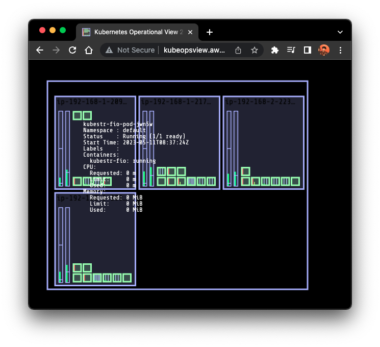

```bash
# kube-ops-view
helm repo add geek-cookbook https://geek-cookbook.github.io/charts/
helm install kube-ops-view geek-cookbook/kube-ops-view --version 1.2.2 --set env.TZ="Asia/Seoul" --namespace kube-system
kubectl patch svc -n kube-system kube-ops-view -p '{"spec":{"type":"LoadBalancer"}}'
kubectl annotate service kube-ops-view -n kube-system "external-dns.alpha.kubernetes.io/hostname=kubeopsview.$MyDomain"
echo -e "Kube Ops View URL = http://kubeopsview.$MyDomain:8080/#scale=1.5"

# 이미지 정보 확인 > eksctl 설치/업데이트 addon 확인 > IRSA 확인
kubectl get pods --all-namespaces -o jsonpath="{.items[*].spec.containers[*].image}" | tr -s '[[:space:]]' '\n' | sort | uniq -c
eksctl get addon --cluster $CLUSTER_NAME
eksctl get iamserviceaccount --cluster $CLUSTER_NAME
```

## 2. 스토리지의 이해

- git 저장소를 마운트하여 사용하는 gitRepo도 있음 [(출처: 조대협님의 블로그)](https://bcho.tistory.com/1259)

1. EmptyDir(Pod 임시 Volume)의 Lifecycle
   - Pod 생성 시, Volume이 함께 생성되고 Pod 삭제 시, Volume이 **삭제** 됨  
   - 이때, Pod는 Stateless(상태가 없는) 애플리케이션  
   - 영구적으로 데이터를 보존하려면 별도의 DB처럼 별도의 저장소를 사용할 필요성이 있음  
2. PV(Persistent Volume): Pod와는 별개인 API 객체
   1. hostPath(로컬 볼륨)
      - PV: 네트워크 스토리지를 모방하기 위해, 워커노드의 파일이나 디렉터리를 마운트하여 사용  
        - 워커노드의 파일 시스템에 접근하는데 유용 (예: 워커노드의 로그 파일 접근)
        - 같은 hostPath에 있는 볼륨은 여러 Pod 사이에서 공유되어 사용된다.
      - Stateful(상태가 있는) 애플리케이션
      - RO(ReadOnly)를 강하게 권장하고 있음: 많은 보안 위험
      - Pod가 재시작 되어 **다른** 노드에서 기동될 경우, 해당 노드의 hostPath를 사용  
      - 이전의 다른 노드에서 사용한 hostPath의 파일 내용은 액세스 불가
   2. CSI(Container Storage Interface)
      - 과거엔, AWS EBS provisioner를 사용  
        신규기능을 사용하려면 k8s 버전 업그레이드 필요
      - 지금은 CSI 드라이버라는 별도의 Controller Pod를  
        만들어 동적 provisioning을 지원
3. PV 로직 이해(Static Provisioning 기준)
   1. AWS EBS FS Volume 생성 후 FS ID 확인
   2. PV YAML정의 파일에 FS ID를 기입 후 PV 생성
   3. PVC를 생성하여 PV 요청
   4. Pod YAML정의 파일에서 Pod 객체에 PVC를 기입(마운트)
4. Dynamic Provisioning
   - 장점: PV객체를 별도로 생성할 필요가 없음
   - PVC 생성시 PV가 자동으로 생성됨
   - 요구사항: AWS EBS의 스토리지 클래스를 정의하는 Storage Class (추상화)객체가 필요
     - Name: 고유한 스토리지 클래스 객체를 식별
     - Provisioner: CSI 드라이버. 연결되는 스토리지 기술 정의
       - AWS EFS: efs.csi.aws.com (변경될 수 있음)
       - AWS EBS: ebs.csi.aws.com (상동)

### 2-1. 기본 컨테이너 환경에서의 임시 fs(EmptyDir) 사용

```bash
# 파드 배포
# date 명령어로 현재 시간을 10초 간격으로 /home/pod-out.txt 파일에 저장
curl -s -O https://raw.githubusercontent.com/gasida/PKOS/main/3/date-busybox-pod.yaml
cat date-busybox-pod.yaml | yh
kubectl apply -f date-busybox-pod.yaml

# 파일 확인
kubectl get pod
kubectl exec busybox -- tail -f /home/pod-out.txt
Sat Jan 28 15:33:11 UTC 2023
Sat Jan 28 15:33:21 UTC 2023
...

# 파드 삭제 후 다시 생성 후 파일 정보 확인 > 이전 기록이 보존되어 있는지?
kubectl delete pod busybox
kubectl apply -f date-busybox-pod.yaml
kubectl exec busybox -- tail -f /home/pod-out.txt

# 실습 완료 후 삭제
kubectl delete pod busybox
```

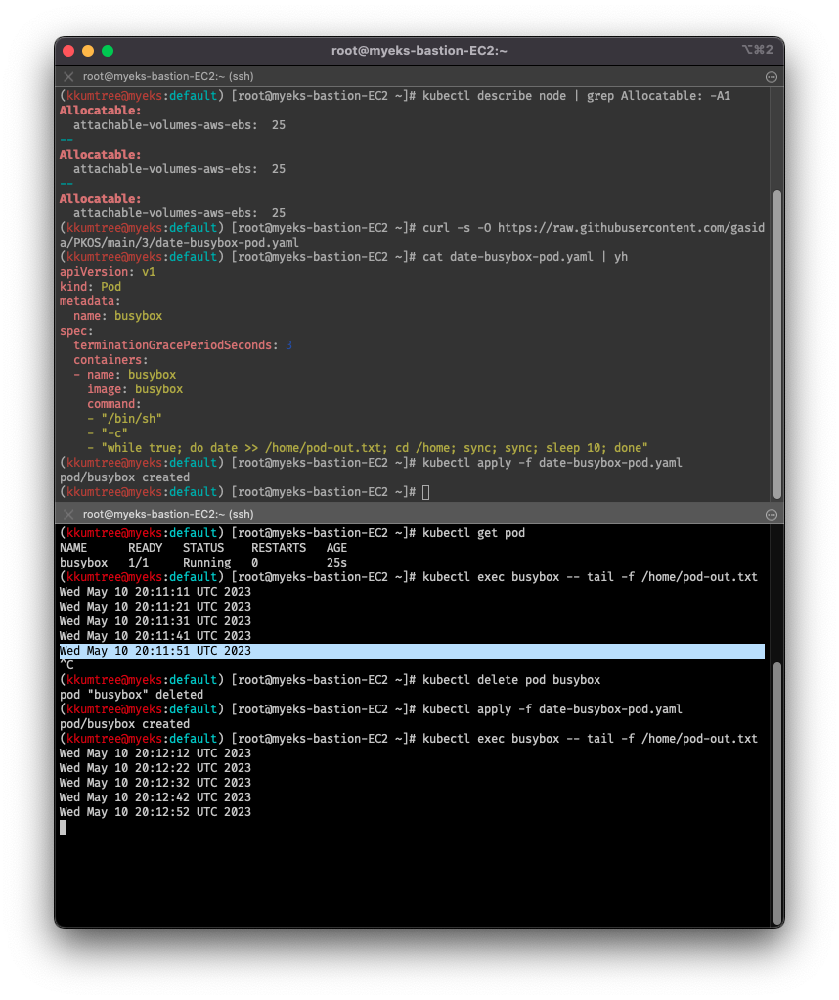

### 2-2. local-path-provisioner 스토리지 클래스 배포 (PV/PVC)

- hostPath 사용
- nodeAffinity: Pod를 배치할 위치 지정하는 힌트를 제공하는 스케쥴러에 제공
  - 수동으로 정의를 하지 않았으나, 해당 워커노드의 주소를 확인할 수 있음  
    예) kubernetes.io/hostname in [ip-192-168-2-xxx.ap-northeast-2.compute.internal]

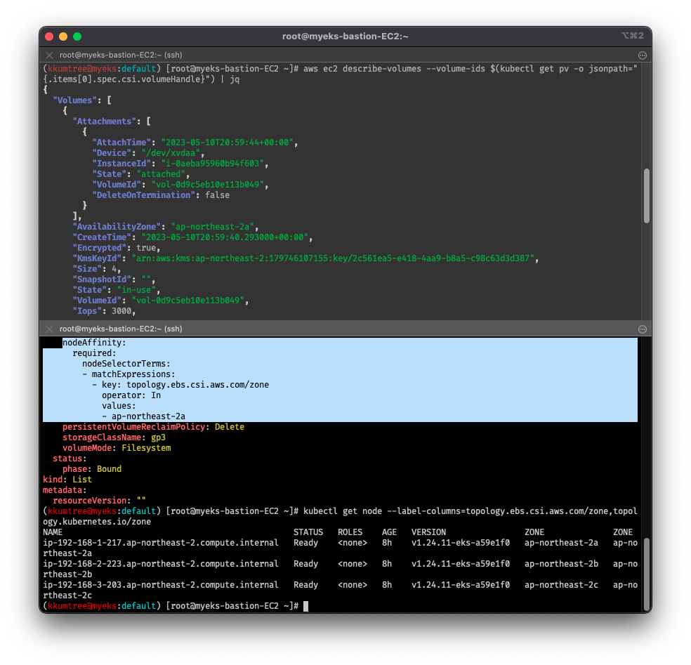

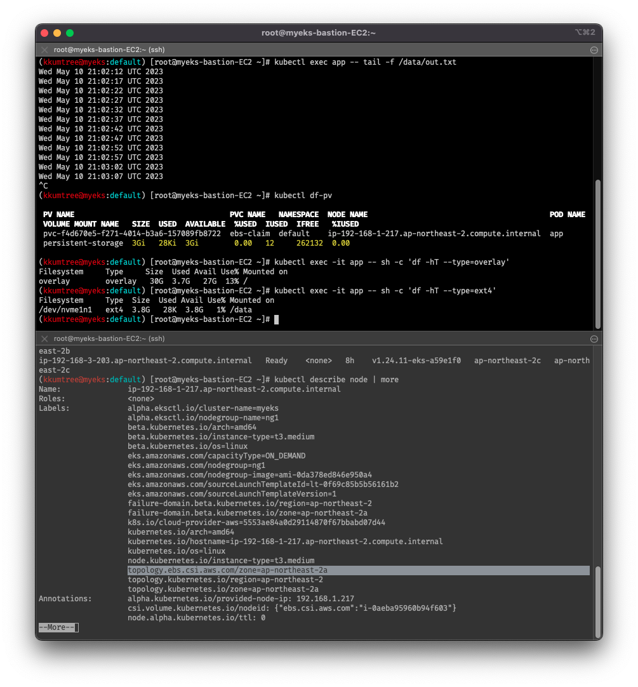

```bash
# 배포
curl -s -O https://raw.githubusercontent.com/rancher/local-path-provisioner/master/deploy/local-path-storage.yaml
kubectl apply -f local-path-storage.yaml

# 확인
kubectl get-all -n local-path-storage
kubectl get pod -n local-path-storage -owide
kubectl describe cm -n local-path-storage local-path-config
kubectl get sc
kubectl get sc local-path

# PVC 생성
curl -s -O https://raw.githubusercontent.com/gasida/PKOS/main/3/localpath1.yaml
cat localpath1.yaml | yh
kubectl apply -f localpath1.yaml

# PVC 확인
kubectl get pvc
kubectl describe pvc

# 파드 생성
curl -s -O https://raw.githubusercontent.com/gasida/PKOS/main/3/localpath2.yaml
cat localpath2.yaml | yh
kubectl apply -f localpath2.yaml

# 파드 확인
kubectl get pod,pv,pvc
kubectl describe pv    # Node Affinity 확인
kubectl exec -it app -- tail -f /data/out.txt

# 워커노드 중 어디에 파드가 배포되어 있는지, 아래 경로에 out.txt 파일 존재 확인
# N1에 없는 경우 N1 -> N2 -> N3 순으로 확인
## /opt/local-path-provisioner
## └── pvc-pvc-898b3f68-aec0-478f-aa55-184a107780cd_default_localpath-claim
##    └── out.txt
ssh ec2-user@$N1 tree /opt/local-path-provisioner

# 해당 워커노드 자체에서 out.txt 파일 확인 : pvc 경로는 각자 실습 환경에 따라 다름
ssh ec2-user@$N1 tail -f /opt/local-path-provisioner/pvc-898b3f68-aec0-478f-aa55-184a107780cd_default_localpath-claim/out.txt

# 파드 삭제 후 PV/PVC 확인
kubectl delete pod app
kubectl get pod,pv,pvc
ssh ec2-user@$N1 tree /opt/local-path-provisioner

# 파드 다시 실행
kubectl apply -f localpath2.yaml
 
# 확인
kubectl exec -it app -- head /data/out.txt
kubectl exec -it app -- tail -f /data/out.txt

# 파드와 PVC 삭제 
kubectl delete pod app
kubectl get pv,pvc
kubectl delete pvc localpath-claim

# 확인
kubectl get pv
ssh ec2-user@$N1 tree /opt/local-path-provisioner
```

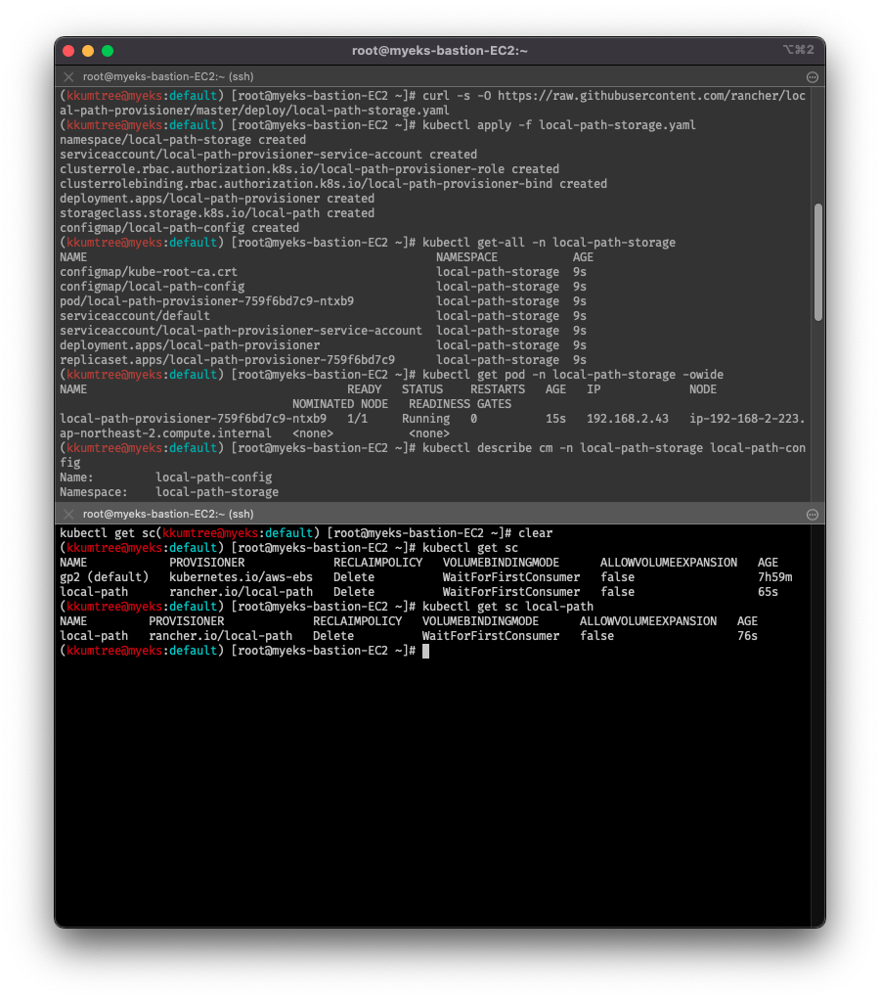

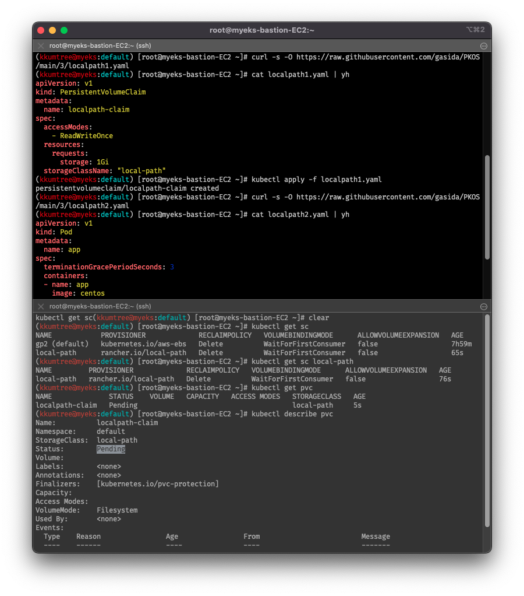

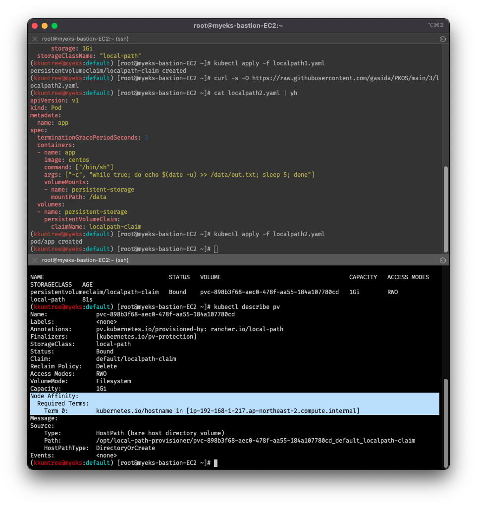

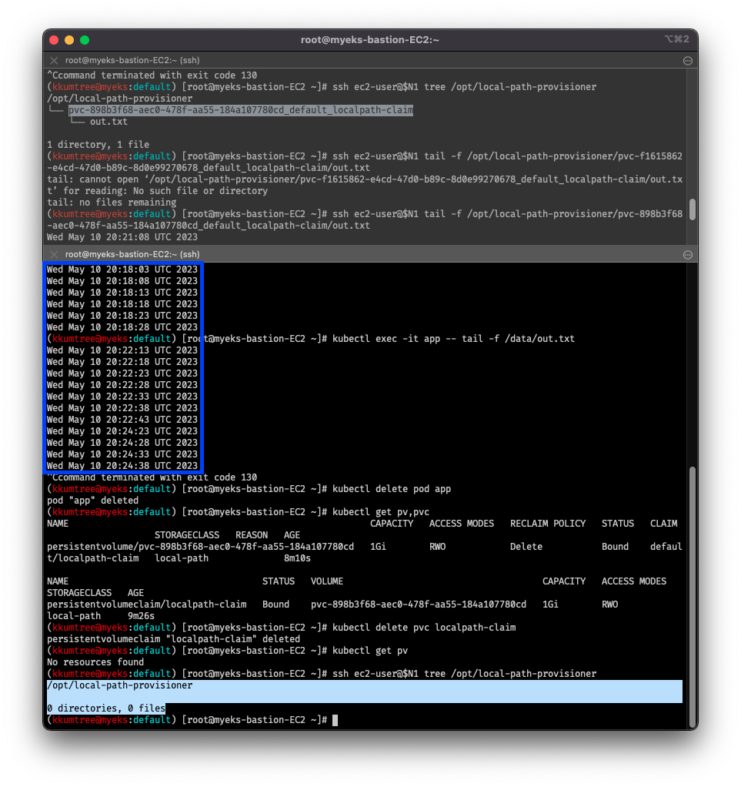

### 2-3. (참고) kubestr 모니터링 및 성능 측정 (NVMe SSD)

- 디스크 I/O 성능을 측정

```bash
# kubestr 툴 다운로드
wget https://github.com/kastenhq/kubestr/releases/download/v0.4.37/kubestr_0.4.37_Linux_amd64.tar.gz
tar xvfz kubestr_0.4.37_Linux_amd64.tar.gz && mv kubestr /usr/local/bin/ && chmod +x /usr/local/bin/kubestr

# 워커노드별 iostat 확인
ssh ec2-user@$N1 iostat -xmdz 1 -p nvme0n1
ssh ec2-user@$N2 iostat -xmdz 1 -p nvme0n1
ssh ec2-user@$N3 iostat -xmdz 1 -p nvme0n1

# 모니터링 준비 
watch 'kubectl get pod -owide;echo;kubectl get pv,pvc'

# 측정 : Read
# [NVMe] 4k 디스크 블록 기준 Read 평균 IOPS는 20309 >> 4분 정도 소요
curl -s -O https://raw.githubusercontent.com/wikibook/kubepractice/main/ch10/fio-read.fio
kubestr fio -f fio-read.fio -s local-path --size 10G

# 측정 : Write
# [NVMe] 4k 디스크 블록 기준 Write 평균 IOPS는 9082 >> 9분 정도 소요
curl -s -O https://raw.githubusercontent.com/wikibook/kubepractice/main/ch10/fio-write.fio
sed -i '/directory/d' fio-write.fio
kubestr fio -f fio-write.fio -s local-path --size 10G
```

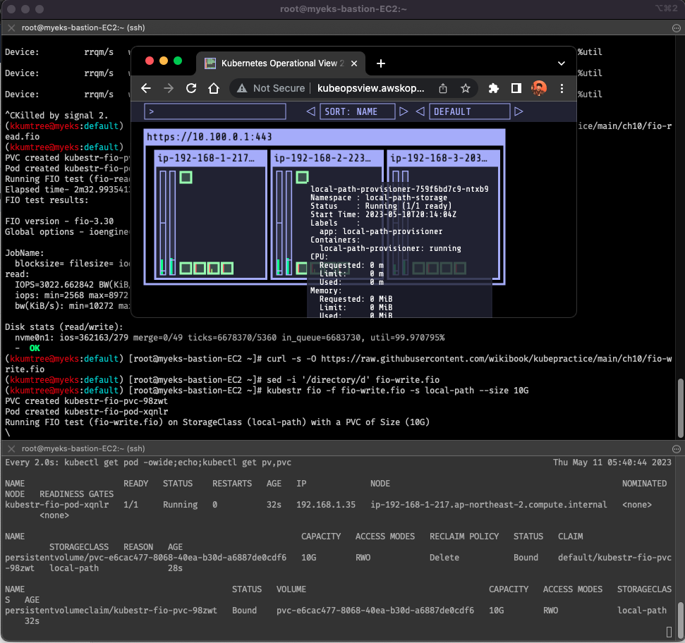

## 3. AWS EBS Controller

- EBS CSI driver: EBS 볼륨을 생성하고 Pod에 이를 연결
- PV/PVC는 ReadWriteOnce로 설정해야 함: EBS 기본 설정이 동일 AZ의 EC2인스턴스만 연결 할 수 있음 [(출처: 악분일상님)](https://malwareanalysis.tistory.com/598)
- 특징: ISRA 정책 설정시 **AWS Managed Policy**(AWS 관리형 정책)인 AmazonEBSCSIDriverPolicy 사용
  - AWS LB, ExternalDNS의 경우, Customer Policy(고객 관리형 정책)
- (참고) k8s v1.22+ 에서는 ReadWriteOncePod를 지원하므로, 민감한 데이터를 다룰때 활용할 수 있음. [(출처: k8s blog)](https://kubernetes.io/blog/2021/09/13/read-write-once-pod-access-mode-alpha/)

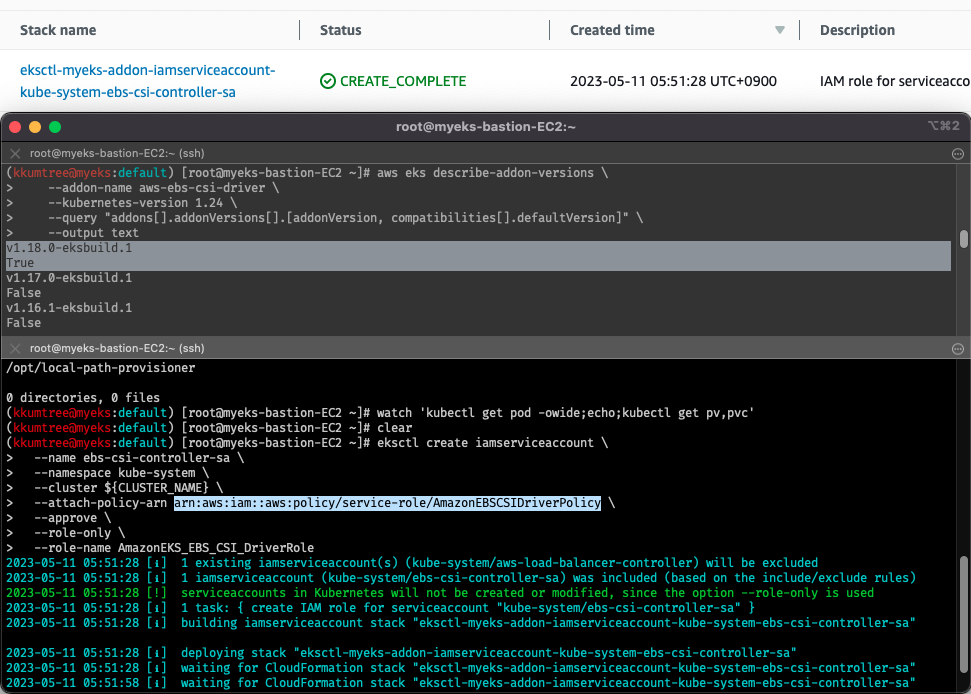

### 3-1. (설치) Amazon EBS CSI driver as an Amazon EKS add-on

```bash
# aws-ebs-csi-driver 전체 버전 정보와 기본 설치 버전(True) 정보 확인
# v1.18.0-eksbuild.1
aws eks describe-addon-versions \
    --addon-name aws-ebs-csi-driver \
    --kubernetes-version 1.24 \
    --query "addons[].addonVersions[].[addonVersion, compatibilities[].defaultVersion]" \
    --output text

# ISRA 설정 : AWS관리형 정책 AmazonEBSCSIDriverPolicy 사용
eksctl create iamserviceaccount \
  --name ebs-csi-controller-sa \
  --namespace kube-system \
  --cluster ${CLUSTER_NAME} \
  --attach-policy-arn arn:aws:iam::aws:policy/service-role/AmazonEBSCSIDriverPolicy \
  --approve \
  --role-only \
  --role-name AmazonEKS_EBS_CSI_DriverRole

# ISRA 확인
kubectl get sa -n kube-system ebs-csi-controller-sa -o yaml | head -5
eksctl get iamserviceaccount --cluster myeks

# 확인
eksctl get addon --cluster ${CLUSTER_NAME}
kubectl get deploy,ds -l=app.kubernetes.io/name=aws-ebs-csi-driver -n kube-system
kubectl get pod -n kube-system -l 'app in (ebs-csi-controller,ebs-csi-node)'
kubectl get pod -n kube-system -l app.kubernetes.io/component=csi-driver

# ebs-csi-controller 파드에 6개 컨테이너 확인
kubectl get pod -n kube-system -l app=ebs-csi-controller -o jsonpath='{.items[0].spec.containers[*].name}' ; echo
ebs-plugin csi-provisioner csi-attacher csi-snapshotter csi-resizer liveness-probe

# gp3 스토리지 클래스 생성
kubectl get sc
cat <<EOT > gp3-sc.yaml
kind: StorageClass
apiVersion: storage.k8s.io/v1
metadata:
  name: gp3
allowVolumeExpansion: true
provisioner: ebs.csi.aws.com
volumeBindingMode: WaitForFirstConsumer
parameters:
  type: gp3
  allowAutoIOPSPerGBIncrease: 'true'
  encrypted: 'true'
  #fsType: ext4 # 기본값이 ext4 이며 xfs 등 변경 가능 >> 단 스냅샷 경우 ext4를 기본으로하여 동작하여 xfs 사용 시 문제가 될 수 있음 - 테스트해보자
EOT
kubectl apply -f gp3-sc.yaml
kubectl get sc
kubectl describe sc gp3 | grep Parameters
```

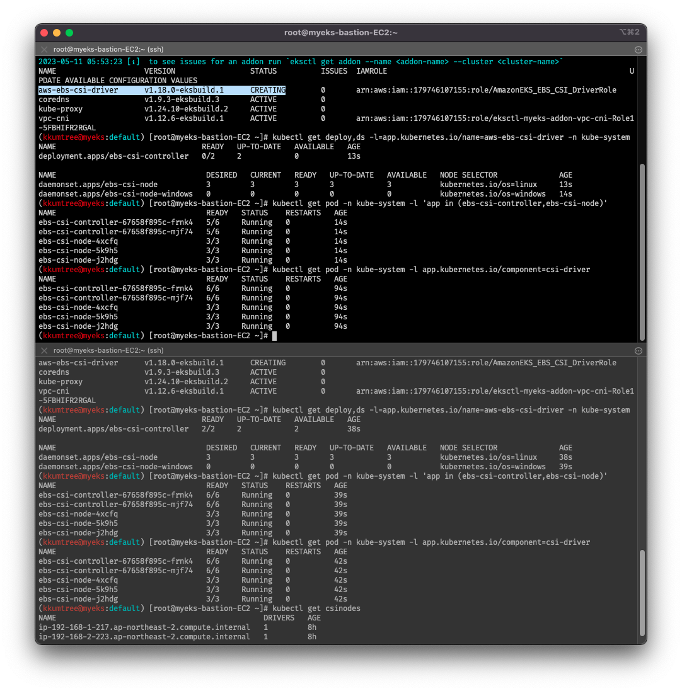

### 3-2. PVC/PV 파드 테스트

- PV YAML을 따로 준비하지 않아도 PVC에 의해 PV가 생성을 확인
  - nodeAffinity: {matchExpressions: {key: topology.ebs.csi.aws.com/zone}} 구조  
    - topology.ebs.csi.aws.com/zone 라벨이 있는 워커노드에 연결

```bash
# 워커노드의 EBS 볼륨 확인 : tag(키/값) 필터링
aws ec2 describe-volumes --filters Name=tag:Name,Values=$CLUSTER_NAME-ng1-Node --output table
aws ec2 describe-volumes --filters Name=tag:Name,Values=$CLUSTER_NAME-ng1-Node --query "Volumes[].{VolumeId: VolumeId, VolumeType: VolumeType, InstanceId: Attachments[0].InstanceId, State: Attachments[0].State}" | jq

# 워커노드에서 파드에 추가한 EBS 볼륨 확인
aws ec2 describe-volumes --filters Name=tag:ebs.csi.aws.com/cluster,Values=true --output table
aws ec2 describe-volumes --filters Name=tag:ebs.csi.aws.com/cluster,Values=true --query "Volumes[].{VolumeId: VolumeId, VolumeType: VolumeType, InstanceId: Attachments[0].InstanceId, State: Attachments[0].State}" | jq

# 워커노드에서 파드에 추가한 EBS 볼륨 모니터링 준비
while true; do aws ec2 describe-volumes --filters Name=tag:ebs.csi.aws.com/cluster,Values=true --query "Volumes[].{VolumeId: VolumeId, VolumeType: VolumeType, InstanceId: Attachments[0].InstanceId, State: Attachments[0].State}" --output text; date; sleep 1; done

# PVC 생성
cat <<EOT > awsebs-pvc.yaml
apiVersion: v1
kind: PersistentVolumeClaim
metadata:
  name: ebs-claim
spec:
  accessModes:
    - ReadWriteOnce
  resources:
    requests:
      storage: 4Gi
  storageClassName: gp3
EOT
kubectl apply -f awsebs-pvc.yaml
kubectl get pvc,pv

# 파드 생성
cat <<EOT > awsebs-pod.yaml
apiVersion: v1
kind: Pod
metadata:
  name: app
spec:
  terminationGracePeriodSeconds: 3
  containers:
  - name: app
    image: centos
    command: ["/bin/sh"]
    args: ["-c", "while true; do echo \$(date -u) >> /data/out.txt; sleep 5; done"]
    volumeMounts:
    - name: persistent-storage
      mountPath: /data
  volumes:
  - name: persistent-storage
    persistentVolumeClaim:
      claimName: ebs-claim
EOT
kubectl apply -f awsebs-pod.yaml

kubectl get VolumeAttachment

# 추가된 EBS 볼륨 상세 정보 확인 
aws ec2 describe-volumes --volume-ids $(kubectl get pv -o jsonpath="{.items[0].spec.csi.volumeHandle}") | jq

# PV 상세 확인 : nodeAffinity
kubectl get pv -o yaml | yh
kubectl get node --label-columns=topology.ebs.csi.aws.com/zone,topology.kubernetes.io/zone
kubectl describe node | more

# 파일 내용 추가 저장 확인
kubectl exec app -- tail -f /data/out.txt

# 아래 명령어는 확인까지 다소 시간이 소요됨
kubectl df-pv

## 파드 내에서 볼륨 정보 확인
kubectl exec -it app -- sh -c 'df -hT --type=overlay'
kubectl exec -it app -- sh -c 'df -hT --type=ext4'
```

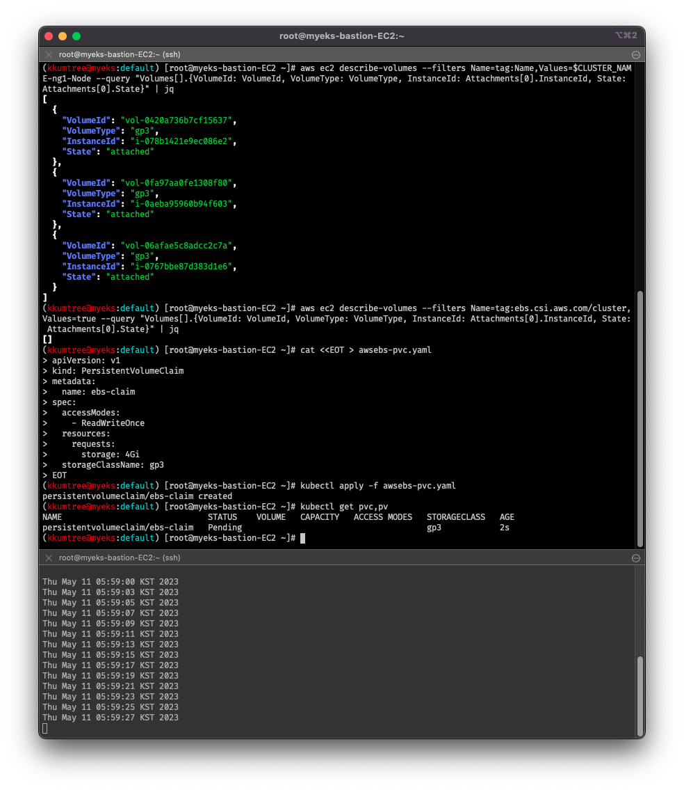

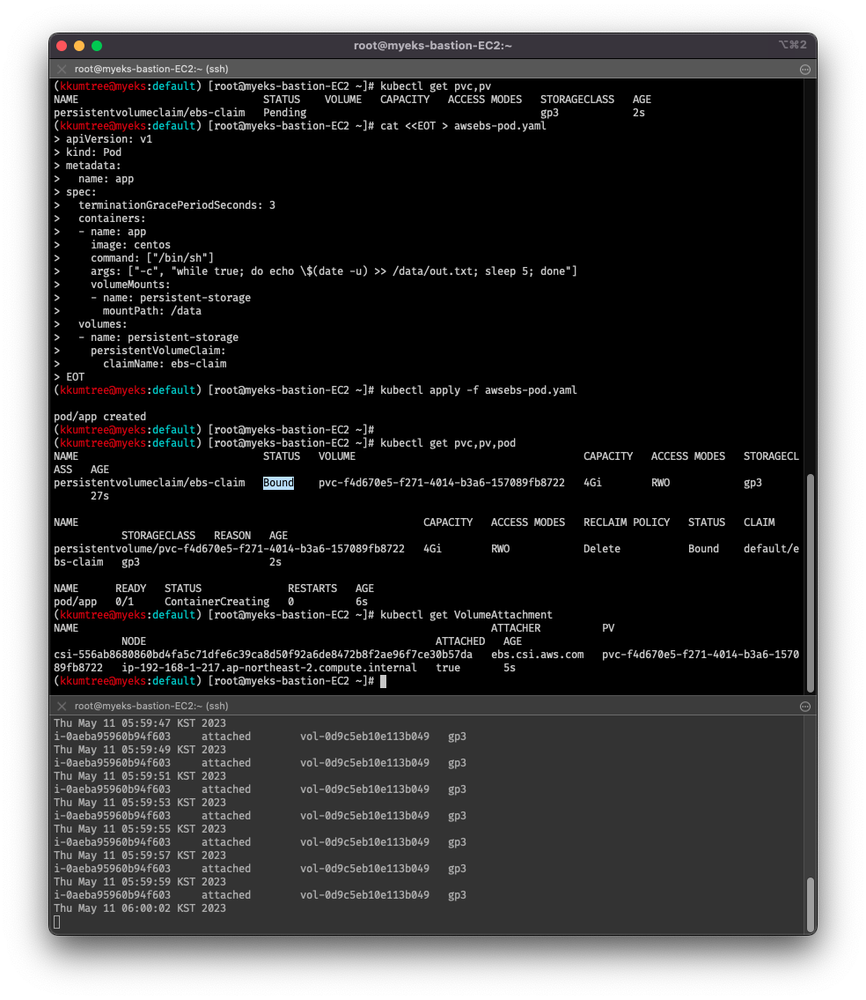

### 3-3. 볼륨 증가 테스트

- 당연한 이야기지만, 줄이는 건 안됨: 새로 작은거 만들어서 옮기면 된다.
  - 하드디스크 조각 모음을 생각해보자

```bash
# 현재 pv 의 이름을 기준하여 4G > 10G 로 증가 : .spec.resources.requests.storage의 4Gi 를 10Gi로 변경
kubectl get pvc ebs-claim -o jsonpath={.spec.resources.requests.storage} ; echo
kubectl get pvc ebs-claim -o jsonpath={.status.capacity.storage} ; echo
kubectl patch pvc ebs-claim -p '{"spec":{"resources":{"requests":{"storage":"10Gi"}}}}'

# 확인 : 볼륨 용량 수정 반영이 되어야 되니, 수치 반영이 조금 느릴수 있다
kubectl exec -it app -- sh -c 'df -hT --type=ext4'
kubectl df-pv
aws ec2 describe-volumes --volume-ids $(kubectl get pv -o jsonpath="{.items[0].spec.csi.volumeHandle}") | jq

# 자원 삭제
kubectl delete pod app & kubectl delete pvc ebs-claim
```

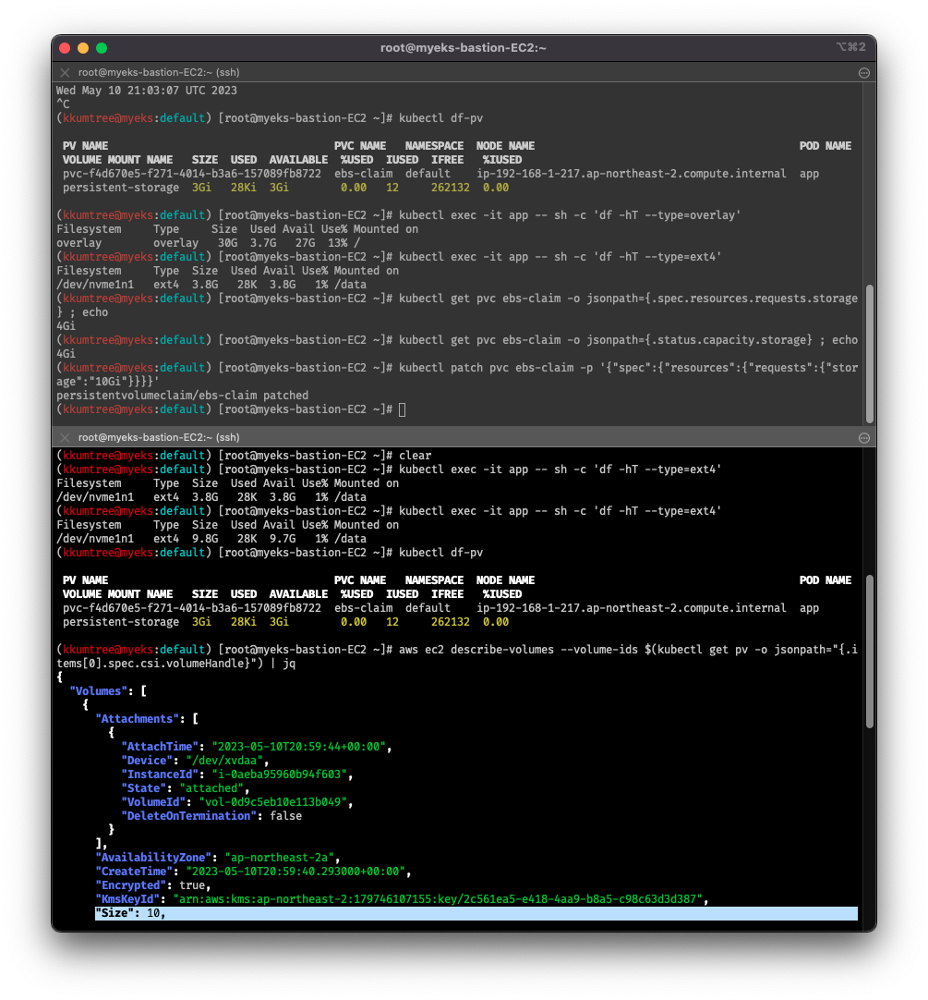

## 4. AWS Volume SnapShots Controller

- 개인적으로는 신선하게 다가왔다. 평소에는 EC2를 통으로 AMI 백업하는 식으로 진행했었음

### 4-1. Volumesnapshots Controller 설치

```bash
# Install Snapshot CRDs
curl -s -O https://raw.githubusercontent.com/kubernetes-csi/external-snapshotter/master/client/config/crd/snapshot.storage.k8s.io_volumesnapshots.yaml
curl -s -O https://raw.githubusercontent.com/kubernetes-csi/external-snapshotter/master/client/config/crd/snapshot.storage.k8s.io_volumesnapshotclasses.yaml
curl -s -O https://raw.githubusercontent.com/kubernetes-csi/external-snapshotter/master/client/config/crd/snapshot.storage.k8s.io_volumesnapshotcontents.yaml
kubectl apply -f snapshot.storage.k8s.io_volumesnapshots.yaml,snapshot.storage.k8s.io_volumesnapshotclasses.yaml,snapshot.storage.k8s.io_volumesnapshotcontents.yaml
kubectl get crd | grep snapshot
kubectl api-resources  | grep snapshot

# Install Common Snapshot Controller
curl -s -O https://raw.githubusercontent.com/kubernetes-csi/external-snapshotter/master/deploy/kubernetes/snapshot-controller/rbac-snapshot-controller.yaml
curl -s -O https://raw.githubusercontent.com/kubernetes-csi/external-snapshotter/master/deploy/kubernetes/snapshot-controller/setup-snapshot-controller.yaml
kubectl apply -f rbac-snapshot-controller.yaml,setup-snapshot-controller.yaml
kubectl get deploy -n kube-system snapshot-controller
kubectl get pod -n kube-system -l app=snapshot-controller

# Install Snapshotclass
curl -s -O https://raw.githubusercontent.com/kubernetes-sigs/aws-ebs-csi-driver/master/examples/kubernetes/snapshot/manifests/classes/snapshotclass.yaml
kubectl apply -f snapshotclass.yaml
kubectl get vsclass # volumesnapshotclasses
```

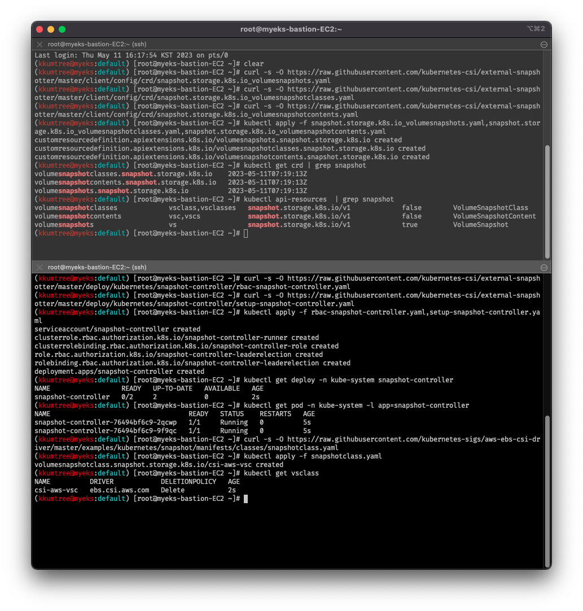

### 4-2. Volumesnapshots Controller 테스트

- 테스트 PVC/파드 생성 및 장애 재현
- 실습 YAML파일에서 ebs-claim이란 이름을 가진 PVC를 대상으로 하였음

```bash
# PVC 생성
kubectl apply -f awsebs-pvc.yaml

# 파드 생성
kubectl apply -f awsebs-pod.yaml

# 파일 내용 추가 저장 확인
kubectl exec app -- tail -f /data/out.txt

# VolumeSnapshot 생성
curl -s -O https://raw.githubusercontent.com/gasida/PKOS/main/3/ebs-volume-snapshot.yaml
cat ebs-volume-snapshot.yaml | yh
kubectl apply -f ebs-volume-snapshot.yaml

# VolumeSnapshot 확인
kubectl get volumesnapshot
kubectl get volumesnapshot ebs-volume-snapshot -o jsonpath={.status.boundVolumeSnapshotContentName} ; echo
kubectl describe volumesnapshot.snapshot.storage.k8s.io ebs-volume-snapshot
kubectl get volumesnapshotcontents

# VolumeSnapshot ID 확인 
kubectl get volumesnapshotcontents -o jsonpath='{.items[*].status.snapshotHandle}' ; echo

# AWS EBS 스냅샷 확인
aws ec2 describe-snapshots --owner-ids self | jq
aws ec2 describe-snapshots --owner-ids self --query 'Snapshots[]' --output table

# app & pvc 제거 : 강제로 장애 재현
kubectl delete pod app && kubectl delete pvc ebs-claim
```

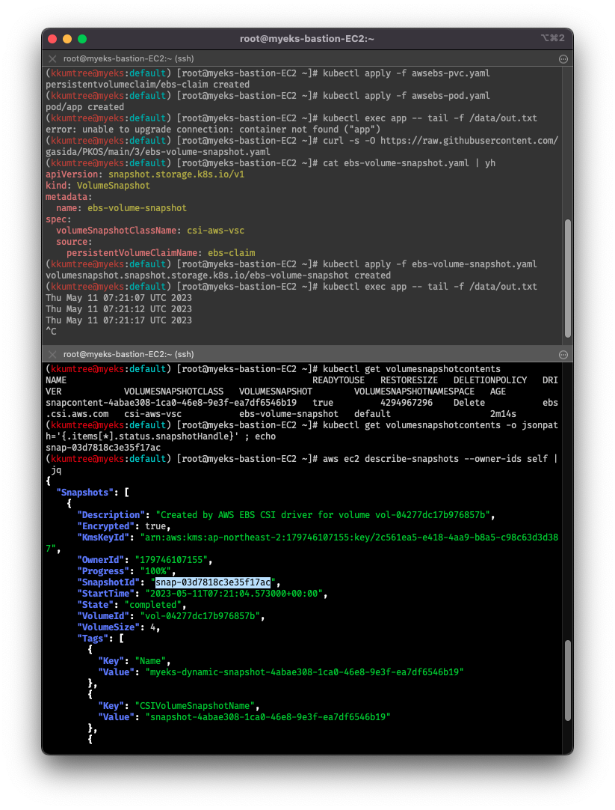

- 스냅샷 복원 테스트

```bash
# 스냅샷에서 PVC 로 복원
kubectl get pvc,pv
cat <<EOT > ebs-snapshot-restored-claim.yaml
apiVersion: v1
kind: PersistentVolumeClaim
metadata:
  name: ebs-snapshot-restored-claim
spec:
  storageClassName: gp3
  accessModes:
    - ReadWriteOnce
  resources:
    requests:
      storage: 4Gi
  dataSource:
    name: ebs-volume-snapshot
    kind: VolumeSnapshot
    apiGroup: snapshot.storage.k8s.io
EOT
cat ebs-snapshot-restored-claim.yaml | yh
kubectl apply -f ebs-snapshot-restored-claim.yaml

# 확인
kubectl get pvc,pv

# 파드 생성
curl -s -O https://raw.githubusercontent.com/gasida/PKOS/main/3/ebs-snapshot-restored-pod.yaml
cat ebs-snapshot-restored-pod.yaml | yh
kubectl apply -f ebs-snapshot-restored-pod.yaml

# 파일 내용 저장 확인 : 파드 삭제 전까지의 저장 기록도 남아있고, 파드 재생성 후 기록도 잘 저장되어있음
kubectl exec app -- cat /data/out.txt

# 삭제
kubectl delete pod app && kubectl delete pvc ebs-snapshot-restored-claim && kubectl delete volumesnapshots ebs-volume-snapshot
```

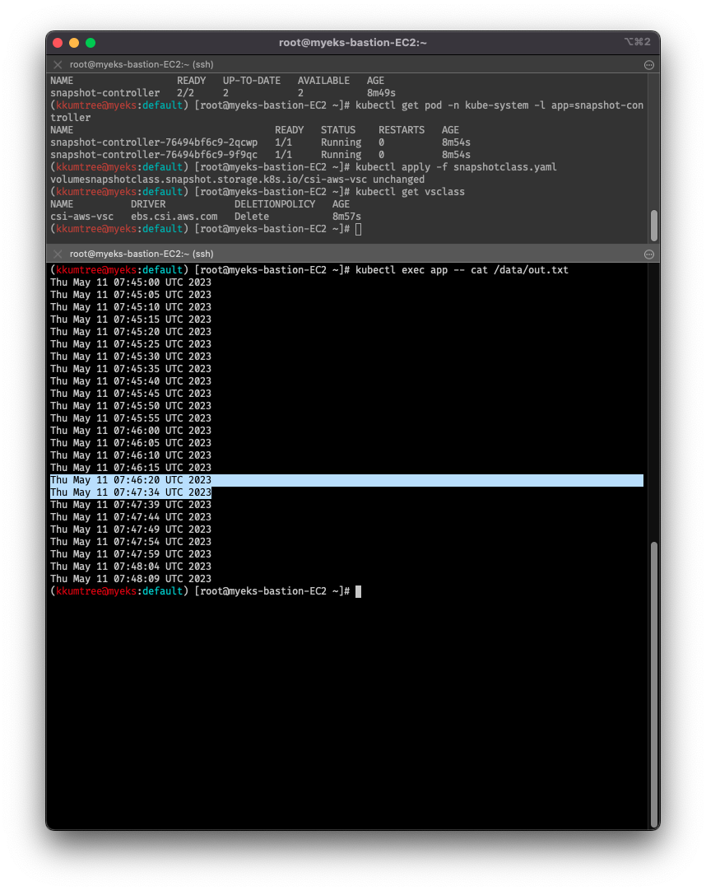

## 5. AWS EFS Controller

- GiB(기비바이트) 단위 기준으로 볼륨을 입력했는데 단위 8.0E(엑사바이트)가 뜨는 이유?
  - AWS EFS는 전체 용량 제한이 없음(볼륨 크기 프로비저닝 불필요) [(출처: GS Neotek blog)](https://www.wisen.co.kr/pages/blog/blog-detail.html?idx=6883)
  - 자동으로 확장되는 '페타바이트급' 데이터를 저장할 수 있다고 하기 때문에 자신감으로 표현한 것으로 보임
    - 탄력적으로 자동으로 증가하고 줄어들 수 있다고 함 [(출처: AWS EFS FAQ)](https://aws.amazon.com/ko/efs/faq/)

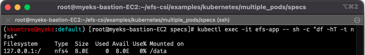

### 5-1. AWS EFS Controller 설치

```bash
# EFS 정보 확인 
aws efs describe-file-systems --query "FileSystems[*].FileSystemId" --output text

# IAM 정책 생성
curl -s -O https://raw.githubusercontent.com/kubernetes-sigs/aws-efs-csi-driver/master/docs/iam-policy-example.json
aws iam create-policy --policy-name AmazonEKS_EFS_CSI_Driver_Policy --policy-document file://iam-policy-example.json

# ISRA 설정 : 고객관리형 정책 AmazonEKS_EFS_CSI_Driver_Policy 사용
eksctl create iamserviceaccount \
  --name efs-csi-controller-sa \
  --namespace kube-system \
  --cluster ${CLUSTER_NAME} \
  --attach-policy-arn arn:aws:iam::${ACCOUNT_ID}:policy/AmazonEKS_EFS_CSI_Driver_Policy \
  --approve

# ISRA 확인
kubectl get sa -n kube-system efs-csi-controller-sa -o yaml | head -5
eksctl get iamserviceaccount --cluster myeks

# EFS Controller 설치
helm repo add aws-efs-csi-driver https://kubernetes-sigs.github.io/aws-efs-csi-driver/
helm repo update
helm upgrade -i aws-efs-csi-driver aws-efs-csi-driver/aws-efs-csi-driver \
    --namespace kube-system \
    --set image.repository=602401143452.dkr.ecr.${AWS_DEFAULT_REGION}.amazonaws.com/eks/aws-efs-csi-driver \
    --set controller.serviceAccount.create=false \
    --set controller.serviceAccount.name=efs-csi-controller-sa

# 확인
helm list -n kube-system
kubectl get pod -n kube-system -l "app.kubernetes.io/name=aws-efs-csi-driver,app.kubernetes.io/instance=aws-efs-csi-driver"
```

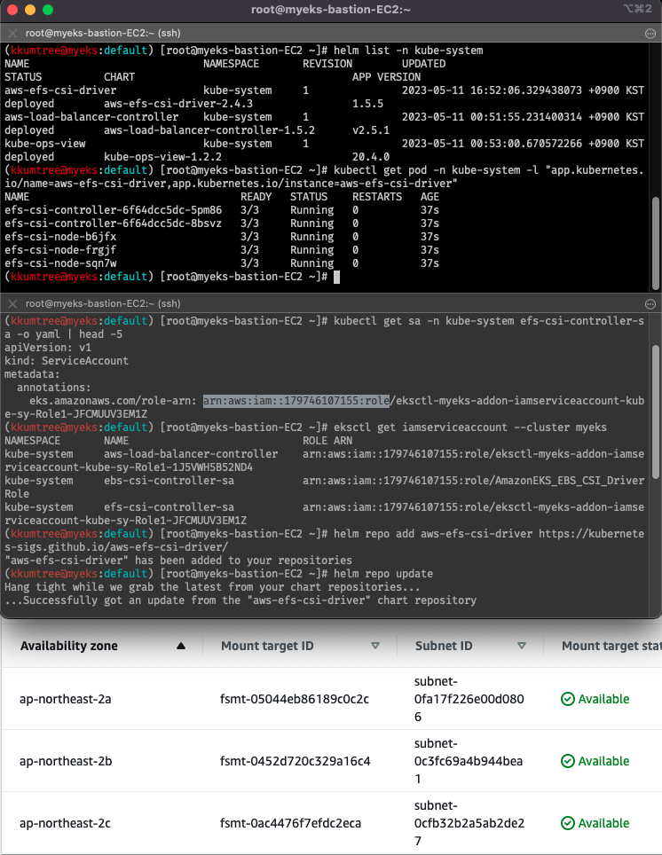

### 5-2. (Static provisioning) EFS 파일시스템을 다수의 파드가 사용하게 설정

```bash
# 모니터링
watch 'kubectl get sc efs-sc; echo; kubectl get pv,pvc,pod'

# 실습 코드 clone
git clone https://github.com/kubernetes-sigs/aws-efs-csi-driver.git /root/efs-csi
cd /root/efs-csi/examples/kubernetes/multiple_pods/specs && tree

# EFS 스토리지클래스 생성 및 확인
cat storageclass.yaml | yh
kubectl apply -f storageclass.yaml
kubectl get sc efs-sc

# PV 생성 및 확인 : volumeHandle을 자신의 EFS 파일시스템ID로 변경
EfsFsId=$(aws efs describe-file-systems --query "FileSystems[*].FileSystemId" --output text)
sed -i "s/fs-4af69aab/$EfsFsId/g" pv.yaml

cat pv.yaml | yh
apiVersion: v1
kind: PersistentVolume
metadata:
  name: efs-pv
spec:
  capacity:
    storage: 5Gi
  volumeMode: Filesystem
  accessModes:
    - ReadWriteMany
  persistentVolumeReclaimPolicy: Retain
  storageClassName: efs-sc
  csi:
    driver: efs.csi.aws.com
    volumeHandle: fs-05699d3c12ef609e2

kubectl apply -f pv.yaml
kubectl get pv; kubectl describe pv

# PVC 생성 및 확인
cat claim.yaml | yh
kubectl apply -f claim.yaml
kubectl get pvc

# 파드 생성 및 연동 : 파드 내에 /data 데이터는 EFS를 사용
cat pod1.yaml pod2.yaml | yh
kubectl apply -f pod1.yaml,pod2.yaml
kubectl df-pv

# 파드 정보 확인 : PV에 5Gi 와 파드 내에서 확인한 NFS4 볼륨 크기 8.0E의 차이는 무엇? 파드에 6Gi 이상 저장 가능한가?
kubectl get pods
kubectl exec -ti app1 -- sh -c "df -hT -t nfs4"
kubectl exec -ti app2 -- sh -c "df -hT -t nfs4"
Filesystem           Type            Size      Used Available Use% Mounted on
127.0.0.1:/          nfs4            8.0E         0      8.0E   0% /data

# 공유 저장소 저장 동작 확인
tree /mnt/myefs              # 작업용EC2에서 확인
tail -f /mnt/myefs/out1.txt  # 작업용EC2에서 확인
kubectl exec -ti app1 -- tail -f /data/out1.txt
kubectl exec -ti app2 -- tail -f /data/out2.txt

# 쿠버네티스 리소스 삭제
kubectl delete pod app1 app2 
kubectl delete pvc efs-claim && kubectl delete pv efs-pv && kubectl delete sc efs-sc
```

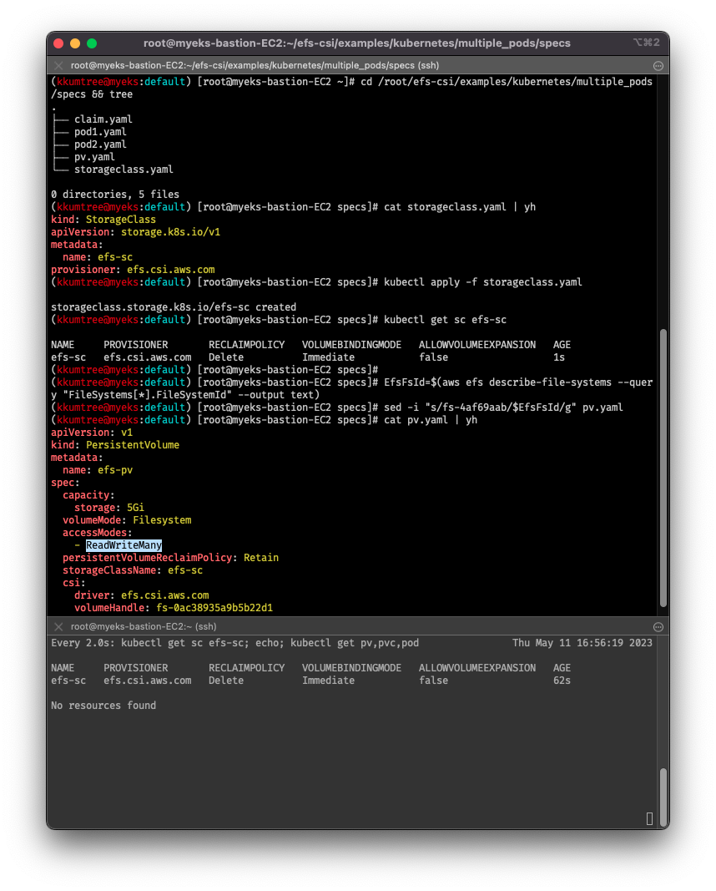

### 5-3. (Dynamic provisioning) EFS 파일시스템을 다수의 파드가 사용하게 설정

- 5-2처럼 하면, 매 순간 사람의 손이 더 많이 가므로 동적 프로비저닝을 실습
- PVC 생성시 {provisioningMode: efs-ap}를 비롯한 파라미터를 추가
  - AccessPoints를 통해 구현되며, 아직 Fargate 노드는 미지원

```bash
# 모니터링
watch 'kubectl get sc efs-sc; echo; kubectl get pv,pvc,pod'

# EFS 스토리지클래스 생성 및 확인
curl -s -O https://raw.githubusercontent.com/kubernetes-sigs/aws-efs-csi-driver/master/examples/kubernetes/dynamic_provisioning/specs/storageclass.yaml
cat storageclass.yaml | yh
sed -i "s/fs-92107410/$EfsFsId/g" storageclass.yaml
kubectl apply -f storageclass.yaml
kubectl get sc efs-sc

# PVC/파드 생성 및 확인
curl -s -O https://raw.githubusercontent.com/kubernetes-sigs/aws-efs-csi-driver/master/examples/kubernetes/dynamic_provisioning/specs/pod.yaml
cat pod.yaml | yh
kubectl apply -f pod.yaml
kubectl get pvc,pv,pod

# PVC/PV 생성 로그 확인
kubectl logs -n kube-system -l app=efs-csi-controller -c csi-provisioner -f

# 파드 정보 확인
kubectl exec -it efs-app -- sh -c "df -hT -t nfs4"
Filesystem           Type            Size      Used Available Use% Mounted on
127.0.0.1:/          nfs4            8.0E         0      8.0E   0% /data

# 공유 저장소 저장 동작 확인
tree /mnt/myefs              # 작업용EC2에서 확인
kubectl exec efs-app -- bash -c "cat data/out"

# 쿠버네티스 리소스 삭제
kubectl delete -f pod.yaml
kubectl delete -f storageclass.yaml
```

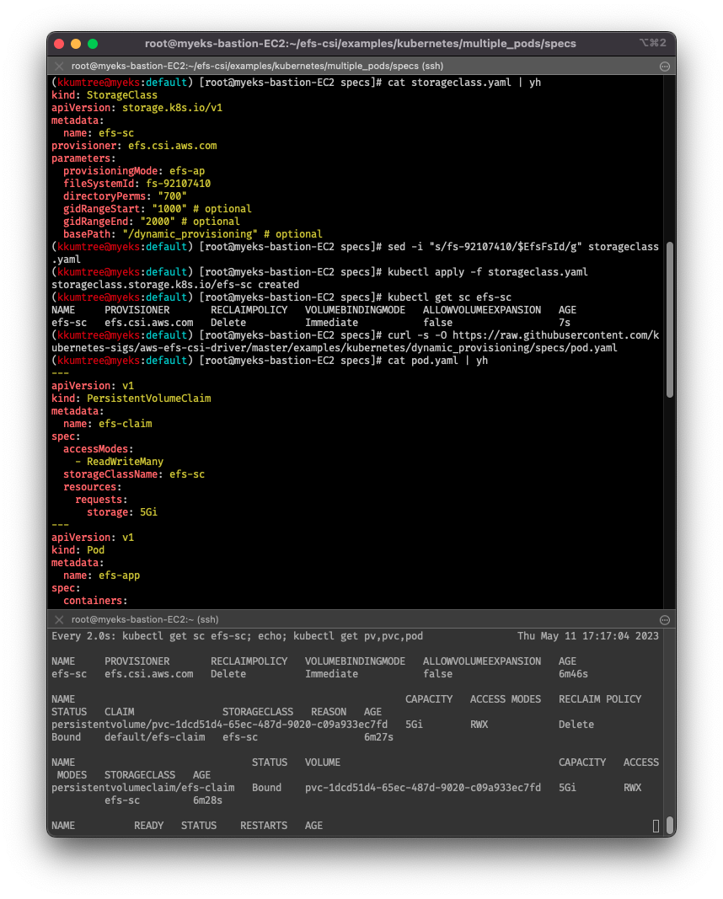

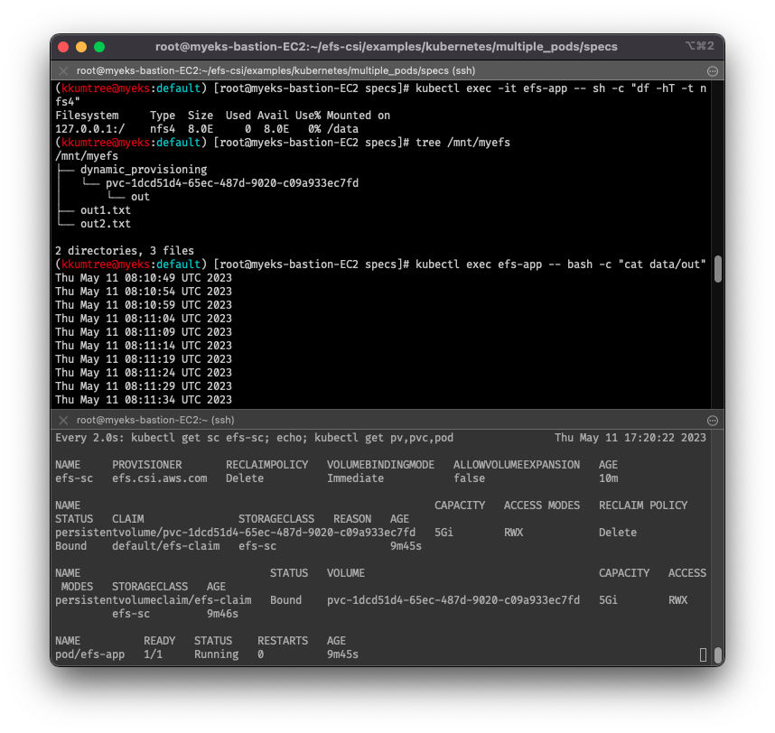

## 6. EKS PVs for Instance Store & Add NodeGroup

- EC2의 인스턴스 스토어는...
  - [ephemeral-storage(임시 볼륨)](https://kubernetes.io/ko/docs/concepts/storage/ephemeral-volumes/)
  - 웹 콘솔의 EC2 스토리(EBS)정보에 출력되지 않음. 터미널에서 확인.
- 인스턴스 스토리지의 데이터 손실의 주요한 유형은 아래와 같음.
  1. 기본 디스크 드라이브 오류
  2. 인스턴스 **중지**
  3. 인스턴스 **최대 절전 모드** 전환
  4. 인스턴스 **종료**
- [(출처: AWS Docs)](https://docs.aws.amazon.com/ko_kr/AWSEC2/latest/UserGuide/InstanceStorage.html)

### 6-1. 신규 노드 그룹 생성

- 신규 노드 그룹 ng2를 생성하여 실습 진행
  - c5d.large의 EC2 인스턴스 스토어(임시 블록 스토리지)를 대상으로 설정

```bash
# 인스턴스 스토어 볼륨이 있는 c5 모든 타입의 스토리지 크기 확인
aws ec2 describe-instance-types \
 --filters "Name=instance-type,Values=c5*" "Name=instance-storage-supported,Values=true" \
 --query "InstanceTypes[].[InstanceType, InstanceStorageInfo.TotalSizeInGB]" \
 --output table

# 신규 노드 그룹 생성
eksctl create nodegroup --help
eksctl create nodegroup -c $CLUSTER_NAME -r $AWS_DEFAULT_REGION --subnet-ids "$PubSubnet1","$PubSubnet2","$PubSubnet3" --ssh-access \
  -n ng2 -t c5d.large -N 1 -m 1 -M 1 --node-volume-size=30 --node-labels disk=nvme --max-pods-per-node 100 --dry-run > myng2.yaml

cat <<EOT > nvme.yaml
  preBootstrapCommands:
    - |
      # Install Tools
      yum install nvme-cli links tree jq tcpdump sysstat -y

      # Filesystem & Mount
      mkfs -t xfs /dev/nvme1n1
      mkdir /data
      mount /dev/nvme1n1 /data

      # Get disk UUID
      uuid=\$(blkid -o value -s UUID mount /dev/nvme1n1 /data) 

      # Mount the disk during a reboot
      echo /dev/nvme1n1 /data xfs defaults,noatime 0 2 >> /etc/fstab
EOT
sed -i -n -e '/volumeType/r nvme.yaml' -e '1,$p' myng2.yaml
eksctl create nodegroup -f myng2.yaml

# 노드 보안그룹 ID 확인
NG2SGID=$(aws ec2 describe-security-groups --filters Name=group-name,Values=*ng2* --query "SecurityGroups[*].[GroupId]" --output text)
aws ec2 authorize-security-group-ingress --group-id $NG2SGID --protocol '-1' --cidr 192.168.1.100/32

# 워커 노드 SSH 접속
# 노드 그룹 생성시 나오는 프롬프트에서 노드 ip를 확인할 수 있음
N4=192.168.1.209
ssh ec2-user@$N4 hostname

# 확인
ssh ec2-user@$N4 sudo nvme list
ssh ec2-user@$N4 sudo lsblk -e 7 -d
ssh ec2-user@$N4 sudo df -hT -t xfs
ssh ec2-user@$N4 sudo tree /data
ssh ec2-user@$N4 sudo cat /etc/fstab

# (옵션) max-pod 확인: 100개
kubectl describe node -l disk=nvme | grep Allocatable: -A7

# (옵션) kubelet 데몬 파라미터 확인 : --max-pods=29 --max-pods=100
# 동일 파라미터가 2개 뜨는데, 29는 기본값이고, 100은 노드그룹 생성시 지정한 값임.
# 마지막 파라미터에 덧씌워져서 적용되는 것으로 판단. 
ssh ec2-user@$N4 sudo ps -ef | grep kubelet
```


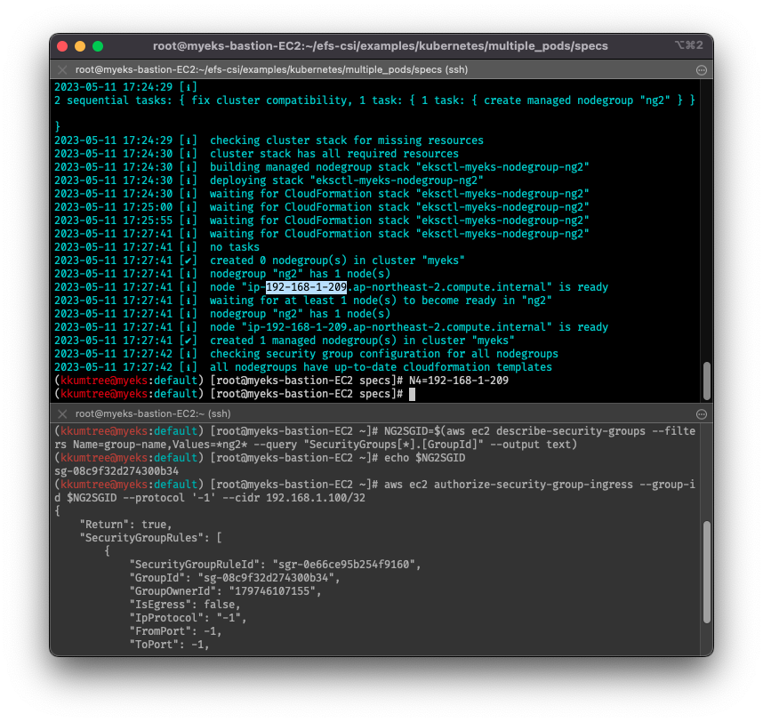

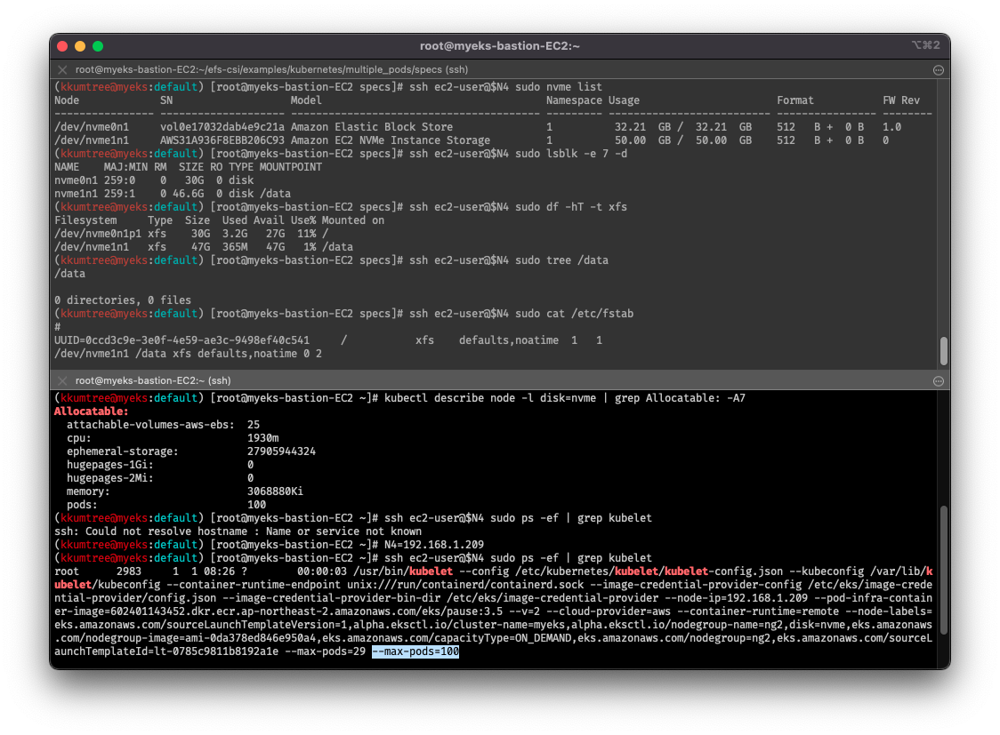

### 6-2. 스토리지 클래스 재생성 및 I/O 테스트

```bash
# 기존 삭제 (2-2에서 실습한 내용 초기화)
kubectl delete -f local-path-storage.yaml

# 경로 변경 opt -> data 후 재생성
sed -i 's/opt/data/g' local-path-storage.yaml
kubectl apply -f local-path-storage.yaml

# 모니터링
watch 'kubectl get pod -owide;echo;kubectl get pv,pvc'
ssh ec2-user@$N4 iostat -xmdz 1 -p nvme1n1

# 측정 : Read
#curl -s -O https://raw.githubusercontent.com/wikibook/kubepractice/main/ch10/fio-read.fio
kubestr fio -f fio-read.fio -s local-path --size 10G --nodeselector disk=nvme

# 삭제
kubectl delete -f local-path-storage.yaml
eksctl delete nodegroup -c $CLUSTER_NAME -n ng2
```

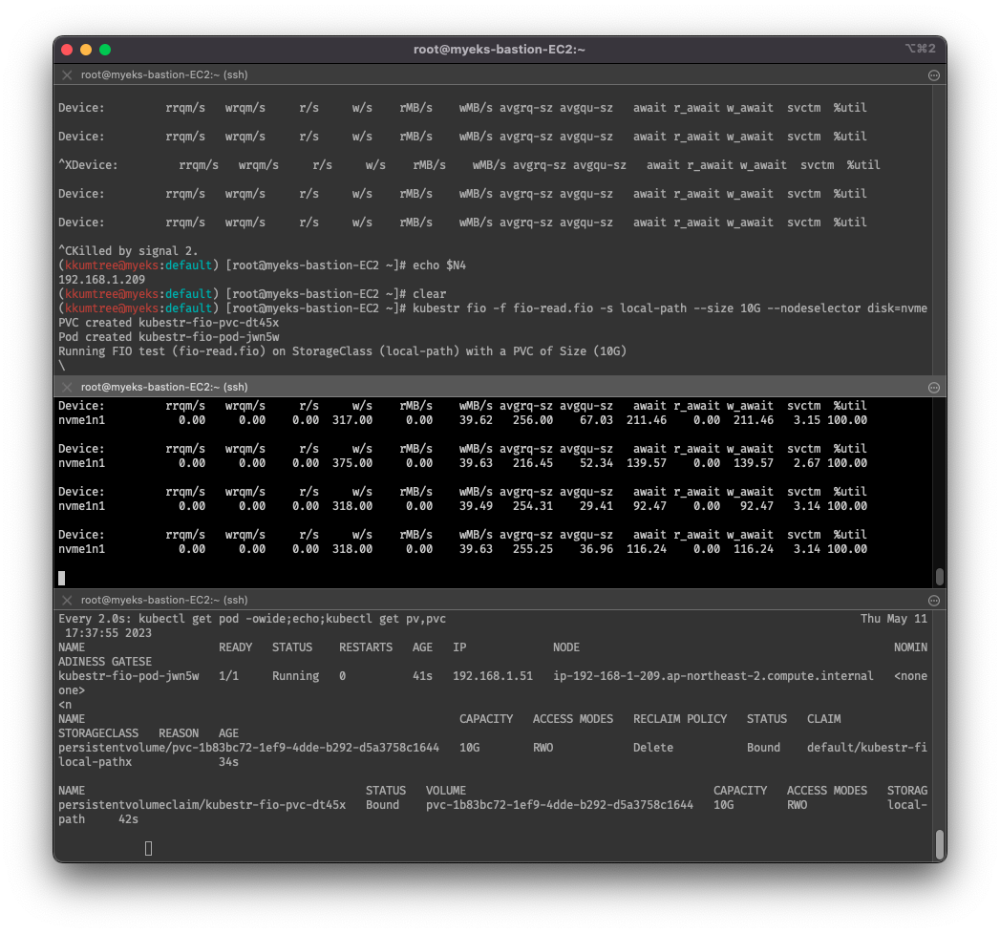
