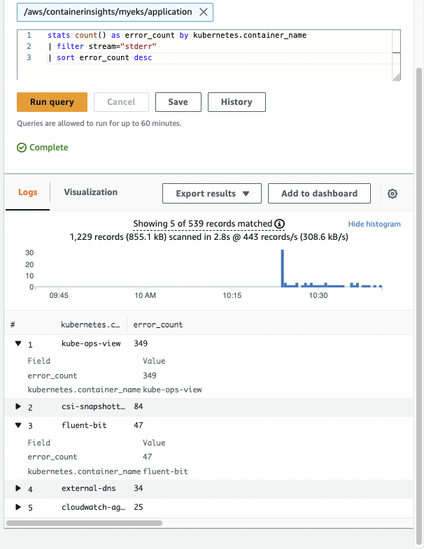

이번 주차에는 Observability에 대해 스터디가 진행되었습니다.  
자원 모니터링 툴들의 적용 및 사용이 중심입니다.  

그나저나 k8s 1.26에서 metrics의 일부 명칭이 바뀌는 걸 보고 식겁했습니다.  
(`etcd_db_total_size_bytes` 대신, `apiserver_storage_db_total_size_in_bytes` 으로 변경)  
또한 kubecost의 경우, cloudformation 스택 제거 후에도 볼륨 데이터가 남아있어서 별도로 삭제해야 했습니다.

## 1. 실습환경 배포

- NAT게이트웨이, EBS addon, IAM role, ISRA for LB/EFS, PreCommand 포함
- 노드: t3.xlarge  
  - t3**a**.xlarge(AMD)는 서울 리전 b AZ(ap-northeast-2b)에서 미지원
- 더 많은 값들이 입력되어서, 생성 완료까지 더 많은 시간이 소요 (약 20여분 이내)

```bash
curl -O https://s3.ap-northeast-2.amazonaws.com/cloudformation.cloudneta.net/K8S/eks-oneclick3.yaml

# 이하 생략, 3주차 참고
```


## 2. EKS Console

- 쿠버네티스 API를 통해서 리소스 및 정보 확인

```bash
kubectl get ClusterRole | grep eks
```

- EKS Cluster에 대한 IAM Role 정보 확인: 연결 정책

- 웹 콘솔에서 다음과 같은 정보 확인 가능 [(출처: EKS Workshop)](https://www.eksworkshop.com/docs/observability/resource-view/)  
  - Workloads, Cluster, Service&Networking, Config&Secret, Storage, Authentication, Authoriztion, Policy, Extensions

## 3. Logging in EKS

- 로깅 대상 구분
  1. Control Plane
  2. Node
  3. Application

### 3-1. Control Plane Logging

- 출처: [EKS Docs](https://docs.aws.amazon.com/ko_kr/eks/latest/userguide/control-plane-logs.html)
- 로그 그룹 이름: `/aws/eks/<cluster-name>/cluster`
- 로깅은 5가지가 지원
  - `api` : k8s API server component logs
  - `audit`
  - `authenticator`
  - `controllerManager`
  - `scheduler`
- 로깅을 활성화 한 후에 확인
  - 아래에서는 kube-controller-manager를 대상으로 coredns 레플리카 수를 조정하면서 로그를 확인

```bash
# 모든 로깅 활성화
aws eks update-cluster-config --region $AWS_DEFAULT_REGION --name $CLUSTER_NAME \
    --logging '{"clusterLogging":[{"types":["api","audit","authenticator","controllerManager","scheduler"],"enabled":true}]}'

# 로그 그룹 확인
aws logs describe-log-groups | jq

# 로그 tail 확인
aws logs tail /aws/eks/$CLUSTER_NAME/cluster | more
# 시간 지정: 1초(s) 1분(m) 1시간(h) 하루(d) 한주(w) / 짧게 출력
aws logs tail /aws/eks/$CLUSTER_NAME/cluster --since 1h30m --format short


# 로그 스트림
kubectl scale deployment -n kube-system coredns --replicas=1
kubectl scale deployment -n kube-system coredns --replicas=2
```


### 3-2. CloudWatch(이하, CW) Log Insights

- 웹 콘솔에서 로그 그룹을 대상으로 쿼리를 수행

```query
# EC2 Instance가 NodeNotReady 상태인 로그 검색, 정상적인 경우 뜨지 않음
fields @timestamp, @message
| filter @message like /NodeNotReady/
| sort @timestamp desc

# kube-apiserver-audit 로그에서 userAgent 정렬하여 확인
# 앞서 활성화한 다른 로그(kube-scheduler, authenticator, kube-controller-Manager)도 확인 가능
fields userAgent, requestURI, @timestamp, @message
| filter @logStream ~= "kube-apiserver-audit"
| stats count(userAgent) as count by userAgent
| sort count desc
```


### 3-3. CW Log Insights Query with aws-cli

- 아래와 같이 cli로도 쿼리 가능

```bash
# CloudWatch Log Insight Query
aws logs get-query-results --query-id $(aws logs start-query \
--log-group-name '/aws/eks/myeks/cluster' \
--start-time `date -d "-1 hours" +%s` \
--end-time `date +%s` \
--query-string 'fields @timestamp, @message | filter @logStream ~= "kube-scheduler" | sort @timestamp desc' \
| jq --raw-output '.queryId')
```


### 3-4. Control Plane raw metrics with CW Logs Insight

- 출처: [EKS Docs](https://docs.aws.amazon.com/eks/latest/userguide/prometheus.html)
- 아래의 쿼리는 Prometheus 포맷으로 raw metrics 출력  
  : `metric_name{"tag"="value"[,...]} value`

```bash
kubectl get --raw /metrics | more
```

### 3-5. Managing etcd database size on EKS clusters

- 출처: [AWS Blog](https://aws.amazon.com/ko/blogs/containers/managing-etcd-database-size-on-amazon-eks-clusters/)
- 아래와 같이 입력하면 etcd의 데이터베이스 사이즈를 확인 가능
- 이때 옆에 뜨는 엔드포인트는 etcd 서버의 엔드포인트. (참조: [Github](https://github.com/kubernetes/apiserver/blob/master/pkg/storage/storagebackend/factory/etcd3.go#L404))
  참고로, EKS에서는 etcd가 AWS-managed
- k8s v1.26 부터는 `etcd_db_total_size_bytes` 대신,  
  `apiserver_storage_db_total_size_in_bytes` 으로 변경 (참조: [sysdig](https://sysdig.com/blog/kubernetes-1-26-whats-new/))

```bash
kubectl get --raw /metrics | grep "etcd_db_total_size_in_bytes"
# etcd_db_total_size_in_bytes{endpoint="http://10.0.160.16:2379"} 4.665344e+06
# etcd_db_total_size_in_bytes{endpoint="http://10.0.32.16:2379"} 4.636672e+06
# etcd_db_total_size_in_bytes{endpoint="http://10.0.96.16:2379"} 4.640768e+06
```

- CW Logs Insights Query for exceeded etcd database space

```query
fields @timestamp, @message, @logStream
| filter @logStream like /kube-apiserver-audit/
| filter @message like /mvcc: database space exceeded/
| limit 10
```

- Identify what is consuming etcd database space

```bash
kubectl get --raw=/metrics | grep apiserver_storage_objects |awk '$2>50' |sort -g -k 2
# apiserver_storage_objects{resource="clusterrolebindings.rbac.authorization.k8s.io"} 78
# apiserver_storage_objects{resource="clusterroles.rbac.authorization.k8s.io"} 92
```

- CW Logs Insights Query for Request volume

```query
# By userAgents
fields userAgent, requestURI, @timestamp, @message
| filter @logStream like /kube-apiserver-audit/
| stats count(*) as count by userAgent
| sort count desc

# By Requests by Universal Resource Identifier (URI)/Verb:
filter @logStream like /kube-apiserver-audit/
| stats count(*) as count by requestURI, verb, user.username
| sort count desc

# Object revision updates
fields requestURI
| filter @logStream like /kube-apiserver-audit/
| filter requestURI like /pods/
| filter verb like /patch/
| filter count > 8
| stats count(*) as count by requestURI, responseStatus.code
| filter responseStatus.code not like /500/
| sort count desc
```


- 정확한 내용은 도입부의 AWS Blog 참고

### 3-6. 컨테이너(Pod) 로깅 with Nginx

- 아래와 같이 nginx를 배포하고, 반복 접속. 이어질 Prometheus와 Grafana 실습에서도 metric 자료로 활용

```bash
# NGINX 웹서버 배포
helm repo add bitnami https://charts.bitnami.com/bitnami

# 사용 리전의 인증서 ARN 확인
CERT_ARN=$(aws acm list-certificates --query 'CertificateSummaryList[].CertificateArn[]' --output text)
echo $CERT_ARN

# 도메인 확인
echo $MyDomain

# 파라미터 파일 생성
cat <<EOT > nginx-values.yaml
service:
    type: NodePort

ingress:
  enabled: true
  ingressClassName: alb
  hostname: nginx.$MyDomain
  path: /*
  annotations: 
    alb.ingress.kubernetes.io/scheme: internet-facing
    alb.ingress.kubernetes.io/target-type: ip
    alb.ingress.kubernetes.io/listen-ports: '[{"HTTPS":443}, {"HTTP":80}]'
    alb.ingress.kubernetes.io/certificate-arn: $CERT_ARN
    alb.ingress.kubernetes.io/success-codes: 200-399
    alb.ingress.kubernetes.io/load-balancer-name: $CLUSTER_NAME-ingress-alb
    alb.ingress.kubernetes.io/group.name: study
    alb.ingress.kubernetes.io/ssl-redirect: '443'
EOT
cat nginx-values.yaml | yh

# 배포
helm install nginx bitnami/nginx --version 14.1.0 -f nginx-values.yaml

# 확인
kubectl get ingress,deploy,svc,ep nginx
kubectl get targetgroupbindings

# 접속 주소 확인 및 접속
echo -e "Nginx WebServer URL = https://nginx.$MyDomain"
curl -s https://nginx.$MyDomain
kubectl logs deploy/nginx -f

# 반복 접속
while true; do curl -s https://nginx.$MyDomain -I | head -n 1; date; sleep 1; done

# (참고) 삭제 시
helm uninstall nginx
```


- 로그 모니터링 및 컨테이너 로그 파일 위치 확인
  - 컨테이너의 로그는 표준 출력(stdout)과 표준 에러(stderr)로 나뉘어서 보내는 것이 권고사항 (참조: [k8s Docs](https://kubernetes.io/ko/docs/concepts/cluster-administration/logging/))

```bash
# 로그 모니터링
kubectl logs deploy/nginx -f

# nginx 웹 접속 시도 시 위의 모니터링에 실시간으로 확인 가능

# 컨테이너 로그 파일 위치 확인
kubectl exec -it deploy/nginx -- ls -l /opt/bitnami/nginx/logs/
# total 0
# lrwxrwxrwx 1 root root 11 Feb 18 13:35 access.log -> /dev/stdout
# lrwxrwxrwx 1 root root 11 Feb 18 13:35 error.log -> /dev/stderr
```


## 4. Fluent Bit integration in CCI(CW Container Insights) for EKS

- 출처: [AWS Docs](https://aws.amazon.com/ko/blogs/containers/fluent-bit-integration-in-cloudwatch-container-insights-for-eks/)
- 노드에 CW Agent(Pod)는 Metrics 수집, Fluent Bit Pod는 Logs 수집을 위하여 데몬 셋으로 동작
- Fluent Bit은 Fluentd의 경량화 버전. config 설정에 차이가 있음 (참조: [AWS Docs](https://docs.aws.amazon.com/ko_kr/AmazonCloudWatch/latest/monitoring/Container-Insights-setup-logs-FluentBit.html))

### 4-1. application 및 host 로그 소스 확인

- application 로그 소스: 각 컨테이너/파드 로그
  - `/var/log/containers` → 심볼릭 링크 `/var/log/pods/<컨테이너>`
- host 로그 소스: 노드(호스트) 로그
  - `/var/log/dmesg`, `/var/log/secure`, `/var/log/messages`
- dataplane 로그 소스: 쿠버네티스 데이터플레인 로그
  - `/var/log/journal` for kubelet.service/kubeproxy.service/docker.service

```bash
# application 로그 위치 확인
for node in $N1 $N2 $N3; do echo ">>>>> $node <<<<<"; ssh ec2-user@$node sudo tree /var/log/containers; echo; done
for node in $N1 $N2 $N3; do echo ">>>>> $node <<<<<"; ssh ec2-user@$node sudo ls -al /var/log/containers; echo; done

# 개별 파드 로그 확인
ssh ec2-user@$N1 sudo tail -f /var/log/pods/default_nginx-<파드 고유 이름>/nginx/0.log

# host 로그 위치 확인
for node in $N1 $N2 $N3; do echo ">>>>> $node <<<<<"; ssh ec2-user@$node sudo tree /var/log/ -L 1; echo; done
for node in $N1 $N2 $N3; do echo ">>>>> $node <<<<<"; ssh ec2-user@$node sudo ls -la /var/log/; echo; done

# host 로그 확인
for log in dmesg secure messages; do echo ">>>>> Node1: /var/log/$log <<<<<"; ssh ec2-user@$N1 sudo tail /var/log/$log; echo; done
for log in dmesg secure messages; do echo ">>>>> Node2: /var/log/$log <<<<<"; ssh ec2-user@$N2 sudo tail /var/log/$log; echo; done
for log in dmesg secure messages; do echo ">>>>> Node3: /var/log/$log <<<<<"; ssh ec2-user@$N3 sudo tail /var/log/$log; echo; done

# dataplane 로그 위치 확인
for node in $N1 $N2 $N3; do echo ">>>>> $node <<<<<"; ssh ec2-user@$node sudo tree /var/log/journal -L 1; echo; done

# 저널 로그 확인 - 링크
ssh ec2-user@$N3 sudo journalctl -x -n 200
ssh ec2-user@$N3 sudo journalctl -f
```


### 4-2. CCI(CW-agent 및 fluent-bit) 설치 및 Fluent Bit 설정

- 출처: [AWS Docs](https://docs.aws.amazon.com/ko_kr/AmazonCloudWatch/latest/monitoring/Container-Insights-setup-logs-FluentBit.html#Container-Insights-FluentBit-setup)
- CW-agent나 fluent-bit이나 `HostPath`에 수집된 정보를 저장하고 있음을 확인

```bash
# 설치
FluentBitHttpServer='On'
FluentBitHttpPort='2020'
FluentBitReadFromHead='Off'
FluentBitReadFromTail='On'
curl -s https://raw.githubusercontent.com/aws-samples/amazon-cloudwatch-container-insights/latest/k8s-deployment-manifest-templates/deployment-mode/daemonset/container-insights-monitoring/quickstart/cwagent-fluent-bit-quickstart.yaml | sed 's/{{cluster_name}}/'${CLUSTER_NAME}'/;s/{{region_name}}/'${AWS_DEFAULT_REGION}'/;s/{{http_server_toggle}}/"'${FluentBitHttpServer}'"/;s/{{http_server_port}}/"'${FluentBitHttpPort}'"/;s/{{read_from_head}}/"'${FluentBitReadFromHead}'"/;s/{{read_from_tail}}/"'${FluentBitReadFromTail}'"/' | kubectl apply -f -

# 설치 확인
kubectl get-all -n amazon-cloudwatch
kubectl get ds,pod,cm,sa -n amazon-cloudwatch
kubectl describe clusterrole cloudwatch-agent-role fluent-bit-role                          # 클러스터롤 확인
kubectl describe clusterrolebindings cloudwatch-agent-role-binding fluent-bit-role-binding  # 클러스터롤 바인딩 확인
kubectl -n amazon-cloudwatch logs -l name=cloudwatch-agent -f # 파드 로그 확인
kubectl -n amazon-cloudwatch logs -l k8s-app=fluent-bit -f    # 파드 로그 확인
for node in $N1 $N2 $N3; do echo ">>>>> $node <<<<<"; ssh ec2-user@$node sudo ss -tnlp | grep fluent-bit; echo; done

# cloudwatch-agent 설정 확인
kubectl describe cm cwagentconfig -n amazon-cloudwatch
{
  "agent": {
    "region": "ap-northeast-2"
  },
  "logs": {
    "metrics_collected": {
      "kubernetes": {
        "cluster_name": "myeks",
        "metrics_collection_interval": 60
      }
    },
    "force_flush_interval": 5
  }
}

# CW 파드가 수집하는 방법 : Volumes -> HostPath
# ssh ec2-user@$N1 sudo tree /dev/disk
kubectl describe -n amazon-cloudwatch ds cloudwatch-agent

# Fluent Bit Cluster Info 확인
kubectl get cm -n amazon-cloudwatch fluent-bit-cluster-info -o yaml | yh
apiVersion: v1
data:
  cluster.name: myeks
  http.port: "2020"
  http.server: "On"
  logs.region: ap-northeast-2
  read.head: "Off"
  read.tail: "On"
kind: ConfigMap
...

# Fluent Bit 로그 INPUT/FILTER/OUTPUT 설정 확인 - 링크
## 설정 부분 구성 : application-log.conf , dataplane-log.conf , fluent-bit.conf , host-log.conf , parsers.conf
kubectl describe cm fluent-bit-config -n amazon-cloudwatch
...
application-log.conf:
----
[INPUT]
    Name                tail
    Tag                 application.*
    Exclude_Path        /var/log/containers/cloudwatch-agent*, /var/log/containers/fluent-bit*, /var/log/containers/aws-node*, /var/log/containers/kube-proxy*
    Path                /var/log/containers/*.log
    multiline.parser    docker, cri
    DB                  /var/fluent-bit/state/flb_container.db
    Mem_Buf_Limit       50MB
    Skip_Long_Lines     On
    Refresh_Interval    10
    Rotate_Wait         30
    storage.type        filesystem
    Read_from_Head      ${READ_FROM_HEAD}

[FILTER]
    Name                kubernetes
    Match               application.*
    Kube_URL            https://kubernetes.default.svc:443
    Kube_Tag_Prefix     application.var.log.containers.
    Merge_Log           On
    Merge_Log_Key       log_processed
    K8S-Logging.Parser  On
    K8S-Logging.Exclude Off
    Labels              Off
    Annotations         Off
    Use_Kubelet         On
    Kubelet_Port        10250
    Buffer_Size         0

[OUTPUT]
    Name                cloudwatch_logs
    Match               application.*
    region              ${AWS_REGION}
    log_group_name      /aws/containerinsights/${CLUSTER_NAME}/application
    log_stream_prefix   ${HOST_NAME}-
    auto_create_group   true
    extra_user_agent    container-insights
...

# Fluent Bit 파드가 수집하는 방법 : Volumes -> HostPath
# ssh ec2-user@$N1 sudo tree /var/log
kubectl describe -n amazon-cloudwatch ds fluent-bit
```


- 웹 콘솔에서도 Logs/Metrics 확인 가능
  - Logs : CW -> Logs -> Log groups -> /aws/containerinsights/myeks/application
    - NGINX 웹서버 부하 발생을 통한 로그 확인: Logs를 대상으로 `nginx` 검색

```bash
# 부하 발생
curl -s https://nginx.$MyDomain
yum install -y httpd
ab -c 500 -n 30000 https://nginx.$MyDomain/

# 파드 직접 로그 모니터링
kubectl logs deploy/nginx -f
```


- Metrics : CloudWatch -> Insights -> ContainerInsights -> myeks
  - Container map을 통한 시각화가 가능한데, 간격이 너무 벌어져서 있어 한번에 보기 불편
  - 이외에도, 리소스 및 성능 모니터링을 지원




## 5. Metric-server / kwatch / botkube (addon tools)

- Metric-server: kubelet으로부터 수집한 리소스 metrics를 수집-집계하는 cluster addon
- kwatch: k8s 클러스터의 변화를 모니터링하여, Slack/Discord 등으로 알림을 보내주는 도구
  - Slack 등에서 사용을 위해 Webhook 토큰 필요
- botkube: Slack/Discord 환경에서 Bot을 통해, 간단하게 k8s 명령어를 사용할 수 있는 도구
  - 실습에서는 Slack API Bot/App 토큰 사용

```bash
################
## Metric-server
################

# 배포
kubectl apply -f https://github.com/kubernetes-sigs/metrics-server/releases/latest/download/components.yaml

# 메트릭 서버 확인 : 메트릭은 15초 간격으로 cAdvisor를 통하여 가져옴
kubectl get pod -n kube-system -l k8s-app=metrics-server
kubectl api-resources | grep metrics
kubectl get apiservices |egrep '(AVAILABLE|metrics)'

# 노드 메트릭 확인
kubectl top node

# 파드 메트릭 확인
kubectl top pod -A
kubectl top pod -n kube-system --sort-by='cpu'
kubectl top pod -n kube-system --sort-by='memory'

#########
## kwatch
#########

# configmap 생성
cat <<EOT > ~/kwatch-config.yaml
apiVersion: v1
kind: Namespace
metadata:
  name: kwatch
---
apiVersion: v1
kind: ConfigMap
metadata:
  name: kwatch
  namespace: kwatch
data:
  config.yaml: |
    alert:
      slack:
        webhook: 'https://hooks.slack.com/services/<Webhook 토큰>'
        title: $NICK-EKS
        #text:
    pvcMonitor:
      enabled: true
      interval: 5
      threshold: 70
EOT
kubectl apply -f kwatch-config.yaml

# 배포
kubectl apply -f https://raw.githubusercontent.com/abahmed/kwatch/v0.8.3/deploy/deploy.yaml

## (장애 재현)잘못된 이미지를 배포하여, kwatch가 알림을 보내는지 확인

# 모니터링 준비
watch kubectl get pod

# 잘못된 이미지 정보의 파드 배포
kubectl apply -f https://raw.githubusercontent.com/junghoon2/kube-books/main/ch05/nginx-error-pod.yml
kubectl get events -w

# 이미지 업데이트 방안 : set 사용 - image 등 일부 리소스 값을 변경 가능!
# 업데이트 하였을 시, 에러 알림이 오지 않음
kubectl set 
kubectl set image pod nginx-19 nginx-pod=nginx:1.19

# 삭제
kubectl delete pod nginx-19

##########
## botkube
##########

# repo 추가
helm repo add botkube https://charts.botkube.io
helm repo update

# 변수 지정
export SLACK_API_BOT_TOKEN=<Bot 토큰>
export SLACK_API_APP_TOKEN=<App 토큰>
export ALLOW_KUBECTL=true
export ALLOW_HELM=true
export SLACK_CHANNEL_NAME=webhook3

#
cat <<EOT > botkube-values.yaml
actions:
  'describe-created-resource': # kubectl describe
    enabled: true
  'show-logs-on-error': # kubectl logs
    enabled: true

executors:
  k8s-default-tools:
    botkube/helm:
      enabled: true
    botkube/kubectl:
      enabled: true
EOT

# 설치
helm install --version v1.0.0 botkube --namespace botkube --create-namespace \
--set communications.default-group.socketSlack.enabled=true \
--set communications.default-group.socketSlack.channels.default.name=${SLACK_CHANNEL_NAME} \
--set communications.default-group.socketSlack.appToken=${SLACK_API_APP_TOKEN} \
--set communications.default-group.socketSlack.botToken=${SLACK_API_BOT_TOKEN} \
--set settings.clusterName=${CLUSTER_NAME} \
--set 'executors.k8s-default-tools.botkube/kubectl.enabled'=${ALLOW_KUBECTL} \
--set 'executors.k8s-default-tools.botkube/helm.enabled'=${ALLOW_HELM} \
-f botkube-values.yaml botkube/botkube
```


```slack
# Slack에서 botkube 앱을 추가하고, 채널에 초대

# 연결 상태, notifications 상태 확인
@Botkube ping
@Botkube status notifications

# 잘못된 이미지 정보의 파드 배포 후 파드 정보 조회
# kubectl apply -f https://raw.githubusercontent.com/junghoon2/kube-books/main/ch05/nginx-error-pod.yml
# kubectl get events -w
@Botkube k get pod
@Botkube kc get pod --namespace kube-system
@Botkube kubectl get pod --namespace kube-system -o wide

# Actionable notifications: 드롭다운을 통해 명령어 선택 가능
@Botkube kubectl
```


## 6. Prometheus 스택

- Prometheus 및 Grafana를 단일 스택으로 설치
- 실습에서는 ACM, Route53, ALB를 연동하여 HTTPS 리디렉션을 적용


### 6-1. Prometheus 스택 설치

- ~~alertmanager-0~~:
  - 고질적인 firing 에러(?)로 이번 실습에서는 skip  
  - 사전에 정의한 정책 기반(예: 노드 다운, 파드 Pending 등)으로 시스템 경고 메시지를 생성 후 경보 채널(슬랙 등)로 전송
- grafana:  
  프로메테우스는 메트릭 정보를 저장하는 용도로 사용하며, 그라파나로 시각화 처리
- prometheus-0:  
  모니터링 대상이 되는 파드는 ‘exporter’라는 별도의 사이드카 형식의 파드에서 모니터링 메트릭을 노출, pull 방식으로 가져와 내부의 시계열 데이터베이스에 저장
- node-exporter:  
  노드익스포터는 물리 노드에 대한 자원 사용량(네트워크, 스토리지 등 전체) 정보를 메트릭 형태로 변경하여 노출
- operator:  
  시스템 경고 메시지 정책(prometheus rule), 애플리케이션 모니터링 대상 추가 등의 작업을 편리하게 할수 있게 CRD 지원
- kube-state-metrics:  
  쿠버네티스의 클러스터의 상태(kube-state)를 메트릭으로 변환하는 파드

```bash
# 모니터링
kubectl create ns monitoring
watch kubectl get pod,pvc,svc,ingress -n monitoring

# 사용 리전의 인증서 ARN 확인
CERT_ARN=`aws acm list-certificates --query 'CertificateSummaryList[].CertificateArn[]' --output text`
echo $CERT_ARN

# repo 추가
helm repo add prometheus-community https://prometheus-community.github.io/helm-charts

# 파라미터 파일 생성
cat <<EOT > monitor-values.yaml
prometheus:
  prometheusSpec:
    podMonitorSelectorNilUsesHelmValues: false
    serviceMonitorSelectorNilUsesHelmValues: false
    retention: 5d
    retentionSize: "10GiB"

  ingress:
    enabled: true
    ingressClassName: alb
    hosts: 
      - prometheus.$MyDomain
    paths: 
      - /*
    annotations:
      alb.ingress.kubernetes.io/scheme: internet-facing
      alb.ingress.kubernetes.io/target-type: ip
      alb.ingress.kubernetes.io/listen-ports: '[{"HTTPS":443}, {"HTTP":80}]'
      alb.ingress.kubernetes.io/certificate-arn: $CERT_ARN
      alb.ingress.kubernetes.io/success-codes: 200-399
      alb.ingress.kubernetes.io/load-balancer-name: myeks-ingress-alb
      alb.ingress.kubernetes.io/group.name: study
      alb.ingress.kubernetes.io/ssl-redirect: '443'

grafana:
  defaultDashboardsTimezone: Asia/Seoul
  adminPassword: prom-operator

  ingress:
    enabled: true
    ingressClassName: alb
    hosts: 
      - grafana.$MyDomain
    paths: 
      - /*
    annotations:
      alb.ingress.kubernetes.io/scheme: internet-facing
      alb.ingress.kubernetes.io/target-type: ip
      alb.ingress.kubernetes.io/listen-ports: '[{"HTTPS":443}, {"HTTP":80}]'
      alb.ingress.kubernetes.io/certificate-arn: $CERT_ARN
      alb.ingress.kubernetes.io/success-codes: 200-399
      alb.ingress.kubernetes.io/load-balancer-name: myeks-ingress-alb
      alb.ingress.kubernetes.io/group.name: study
      alb.ingress.kubernetes.io/ssl-redirect: '443'

defaultRules:
  create: false
kubeControllerManager:
  enabled: false
kubeEtcd:
  enabled: false
kubeScheduler:
  enabled: false
alertmanager:
  enabled: false

# alertmanager:
#   ingress:
#     enabled: true
#     ingressClassName: alb
#     hosts: 
#       - alertmanager.$MyDomain
#     paths: 
#       - /*
#     annotations:
#       alb.ingress.kubernetes.io/scheme: internet-facing
#       alb.ingress.kubernetes.io/target-type: ip
#       alb.ingress.kubernetes.io/listen-ports: '[{"HTTPS":443}, {"HTTP":80}]'
#       alb.ingress.kubernetes.io/certificate-arn: $CERT_ARN
#       alb.ingress.kubernetes.io/success-codes: 200-399
#       alb.ingress.kubernetes.io/load-balancer-name: myeks-ingress-alb
#       alb.ingress.kubernetes.io/group.name: study
#       alb.ingress.kubernetes.io/ssl-redirect: '443'
EOT
cat monitor-values.yaml | yh

# 배포
helm install kube-prometheus-stack prometheus-community/kube-prometheus-stack --version 45.27.2 \
--set prometheus.prometheusSpec.scrapeInterval='15s' --set prometheus.prometheusSpec.evaluationInterval='15s' \
-f monitor-values.yaml --namespace monitoring

# 확인
helm list -n monitoring
kubectl get pod,svc,ingress -n monitoring
kubectl get-all -n monitoring
kubectl get prometheus,servicemonitors -n monitoring
kubectl get crd | grep monitoring
```


### 6-2. Prometheus 기본적 사용

- 모니터링 대상인 서비스는 3에서 다루었듯이 /metrics 엔드포인트가 노출되어있음
  - p8s는 http get 방식으로 metrics를 가져와 TSDB 형식으로 저장

```bash
# 아래 처럼 프로메테우스가 각 서비스의 9100 접속하여 메트릭 정보를 수집
kubectl get node -owide
kubectl get svc,ep -n monitoring kube-prometheus-stack-prometheus-node-exporter

# 노드의 9100번의 /metrics 접속 시 다양한 메트릭 정보를 확인할수 있음 : 마스터 이외에 워커노드도 확인 가능
ssh ec2-user@$N1 curl -s localhost:9100/metrics

# ingress 확인
kubectl get ingress -n monitoring kube-prometheus-stack-prometheus
kubectl describe ingress -n monitoring kube-prometheus-stack-prometheus

# 프로메테우스 ingress 도메인으로 웹 접속
echo -e "Prometheus Web URL = https://prometheus.$MyDomain"
```


- 프로메테우스 ingress 도메인으로 웹 접속
  1. 경고(Alert) : 사전에 정의한 시스템 경고 정책(Prometheus Rules)에 대한 상황
  2. 그래프(Graph) : 프로메테우스 자체 검색 언어 PromQL을 이용하여 메트릭 정보를 조회 -> 단순한 그래프 형태 조회
  3. 상태(Status) : 경고 메시지 정책(Rules), 모니터링 대상(Targets) 등 다양한 프로메테우스 설정 내역을 확인 > 버전(2.42.0)
  4. 도움말(Help)
- 프로메테우스 설정(Configuration) 확인:  
  1. Status → Runtime & Build Information ⇒ Storage retention
     - 5d or 10GiB: 메트릭 저장 기간이 5일 경과 혹은 10GiB 이상 시 삭제
     - helm 파라미터에서 수정 후 적용 가능
     - Status → Command-Line Flags 에서도 확인 가능
       - --storage.tsdb.retention.time=5d
       - --storage.tsdb.retention.size=10GB
  2. Status → Configuration ⇒ “node-exporter” 검색
     - `metrics_path: /metrics, scheme: http`, `role: endpoints` 를 확인
- 전체 metrics targets(대상) 확인:  
  - Status → Targets
  - 각 엔드포인트 확인 가능
- 메트릭을 그래프(Graph)로 조회:
  - Graph
  - 아래 PromQL 쿼리(전체 클러스터 노드의 CPU 사용량 합계)입력 후 조회 → Graph 확인
  - `1- avg(rate(node_cpu_seconds_total{mode="idle"}[1m]))` 입력


### 6-3. Grafana

- TSDB 데이터를 시각화하는 대시보드 제공
- 접속 정보 확인 및 로그인: 초기 계정 - admin / prom-operator
- 설치한 스택에서는 자동으로 프로메테우스를 데이터 소스로 추가해둠
  - `http://kube-prometheus-stack-prometheus.monitoring:9090/`


```bash
# 그라파나 버전 확인
kubectl exec -it -n monitoring deploy/kube-prometheus-stack-grafana -- grafana-cli --version

# ingress 확인
kubectl get ingress -n monitoring kube-prometheus-stack-grafana
kubectl describe ingress -n monitoring kube-prometheus-stack-grafana

# ingress 도메인으로 웹 접속 : 기본 계정 - admin / prom-operator
echo -e "Grafana Web URL = https://grafana.$MyDomain"

## 데이터 소스 접속 확인
# 테스트용 파드 배포
cat <<EOF | kubectl create -f -
apiVersion: v1
kind: Pod
metadata:
  name: netshoot-pod
spec:
  containers:
  - name: netshoot-pod
    image: nicolaka/netshoot
    command: ["tail"]
    args: ["-f", "/dev/null"]
  terminationGracePeriodSeconds: 0
EOF
kubectl get pod netshoot-pod

# 접속 확인
kubectl exec -it netshoot-pod -- nslookup kube-prometheus-stack-prometheus.monitoring
kubectl exec -it netshoot-pod -- curl -s kube-prometheus-stack-prometheus.monitoring:9090/graph -v ; echo
```


### 6-4. Grafana 대시보드 import

- Kubernetes All-in-one Cluster Monitoring KR( 13770 )


- AWS EKS CNI Metrics( 16032 ): 이 대시보드를 쓰려면 아래의 작업이 선행조건

```bash
# PodMonitor 배포
cat <<EOF | kubectl create -f -
apiVersion: monitoring.coreos.com/v1
kind: PodMonitor
metadata:
  name: aws-cni-metrics
  namespace: kube-system
spec:
  jobLabel: k8s-app
  namespaceSelector:
    matchNames:
    - kube-system
  podMetricsEndpoints:
  - interval: 30s
    path: /metrics
    port: metrics
  selector:
    matchLabels:
      k8s-app: aws-node
EOF

# PodMonitor 확인
kubectl get podmonitor -n kube-system
```


- NGINX application 모니터링( 12708 ):  
  - 6-5에서 부하 진행
  - 반복 접속(부하)하여 metrics 변화 확인
  - **helm으로 설치시, `nginx-exporter` 옵션을 걸면, p8s 모니터링에 자동 등록**
  - 서비스 모니터 방식으로 nginx 모니터링 대상 등록을 위한 실습 파라미터
    - export 는 9113 포트 사용
    - nginx 웹서버 노출은 AWS CLB 기본 사용

```bash
# 모니터링
watch -d kubectl get pod

# 파라미터 파일 생성 : 
cat <<EOT > ~/nginx_metric-values.yaml
metrics:
  enabled: true

  service:
    port: 9113

  serviceMonitor:
    enabled: true
    namespace: monitoring
    interval: 10s
EOT

# 배포
helm upgrade nginx bitnami/nginx --reuse-values -f nginx_metric-values.yaml

# 확인
kubectl get pod,svc,ep
kubectl get servicemonitor -n monitoring nginx
kubectl get servicemonitor -n monitoring nginx -o json | jq

# 메트릭 확인 >> 프로메테우스에서 Target 확인
NGINXIP=$(kubectl get pod -l app.kubernetes.io/instance=nginx -o jsonpath={.items[0].status.podIP})
curl -s http://$NGINXIP:9113/metrics # nginx_connections_active Y 값 확인해보기
curl -s http://$NGINXIP:9113/metrics | grep ^nginx_connections_active

# nginx 파드내에 컨테이너 갯수 확인
kubectl get pod -l app.kubernetes.io/instance=nginx
kubectl describe pod -l app.kubernetes.io/instance=nginx

# 접속 주소 확인 및 접속
echo -e "Nginx WebServer URL = https://nginx.$MyDomain"
curl -s https://nginx.$MyDomain
kubectl logs deploy/nginx -f

# 반복 접속
while true; do curl -s https://nginx.$MyDomain -I | head -n 1; date; sleep 1; done
```


### 6-5. Grafana Alert

- Alert rules 및 Contact point 설정하여 테스트
  - Alert rules : Alert 발생 조건 설정
  - Contact point : Alert 발생시 알림을 받을 대상 설정 (Slack 웹훅 활용)
- Slack용으로 Notification policies의 기본 정책도 Slack으로 변경
- 이후에 NGINX 반복 접속으로 슬랙 채널 알람 확인
  - `while true; do curl -s https://nginx.$MyDomain -I | head -n 1; date; sleep 1; done`
- Contact point 설정 시, 지정 대상에게 제대로 멘션이 걸리지 않음을 확인.


## 7. kubecost

- k8s 리소스별 비용 분류 대시보드, 처음 띄운 후 15분 정도 기다려야 데이터 표출
- kubecost의 경우, cloudformation 제거 후에도 데이터(dynamic-pvc)가 남아있어서 완전히 없애고자 웹 콘솔에서 볼륨 삭제를 진행

```bash
cat <<EOT > cost-values.yaml
global:
  grafana:
    enabled: true
    proxy: false

priority:
  enabled: false
networkPolicy:
  enabled: false
podSecurityPolicy:
  enabled: false

persistentVolume:
    storageClass: "gp3"

prometheus:
  kube-state-metrics:
    disabled: false
  nodeExporter:
    enabled: true

reporting:
  productAnalytics: true
EOT

# kubecost chart 에 프로메테우스가 포함되어 있으니, 기존 프로메테우스-스택은 삭제
# node-export 포트 충돌 발생
helm uninstall -n monitoring kube-prometheus-stack

# 배포
kubectl create ns kubecost
helm install kubecost oci://public.ecr.aws/kubecost/cost-analyzer --version 1.103.2 --namespace kubecost -f cost-values.yaml

# 배포 확인
kubectl get-all -n kubecost
kubectl get all -n kubecost

# kubecost-cost-analyzer 파드 IP변수 지정 및 접속 확인
CAIP=$(kubectl get pod -n kubecost -l app=cost-analyzer -o jsonpath={.items[0].status.podIP})
curl -s $CAIP:9090

# 외부에서 bastion EC2 접속하여 특정 파드 접속 방법 : socat(SOcket CAT) 활용
# 웹 브라우저에서 bastion EC2 IP로 접속
yum -y install socat
socat TCP-LISTEN:80,fork TCP:$CAIP:9090
```


