이번 주차는 오토스케일링을 메인으로 하여, 수평/수직 프로비저닝을 학습해보았습니다.  
마지막에는 고성능 오토스케일러인 Karpenter를 별도로 실습해보았습니다.
특히..

- HPA custom metrics(사용자 정의 메트릭) 적용
- YAML 설정값을 CPU로 맞춘 것을 잊고, 프로비저닝을 잘못 예측한 것도 함께 공유합니다.

- AutoScaling
  - HPA: Horizontal Pod Autoscaler
  - VPA: Vertical Pod Autoscaler
  - CA: Cluster Autoscaler
    - 각 CSP 의존적, 워커 노드 레벨에서의 오토스케일링

## 1. 실습 환경 배포

- 4주차의 초기 배포 내용에 p8s 및 Grafana를 추가하여 배포
  - **verticalPodAutoscaler 활성화**
  - 추천 대시보드: 15757, 17900, 15172

```bash
curl -O https://s3.ap-northeast-2.amazonaws.com/cloudformation.cloudneta.net/K8S/eks-oneclick4.yaml

# 이하 중략

## Prometheus & Grafana 설치

# 인증서 ARN
CERT_ARN=`aws acm list-certificates --query 'CertificateSummaryList[].CertificateArn[]' --output text`
echo $CERT_ARN

# 파라미터 파일 생성 및 배포
cat <<EOT > monitor-values.yaml
prometheus:
  prometheusSpec:
    podMonitorSelectorNilUsesHelmValues: false
    serviceMonitorSelectorNilUsesHelmValues: false
    retention: 5d
    retentionSize: "10GiB"

  verticalPodAutoscaler:
    enabled: true

  ingress:
    enabled: true
    ingressClassName: alb
    hosts: 
      - prometheus.$MyDomain
    paths: 
      - /*
    annotations:
      alb.ingress.kubernetes.io/scheme: internet-facing
      alb.ingress.kubernetes.io/target-type: ip
      alb.ingress.kubernetes.io/listen-ports: '[{"HTTPS":443}, {"HTTP":80}]'
      alb.ingress.kubernetes.io/certificate-arn: $CERT_ARN
      alb.ingress.kubernetes.io/success-codes: 200-399
      alb.ingress.kubernetes.io/load-balancer-name: myeks-ingress-alb
      alb.ingress.kubernetes.io/group.name: study
      alb.ingress.kubernetes.io/ssl-redirect: '443'

grafana:
  defaultDashboardsTimezone: Asia/Seoul
  adminPassword: prom-operator

  ingress:
    enabled: true
    ingressClassName: alb
    hosts: 
      - grafana.$MyDomain
    paths: 
      - /*
    annotations:
      alb.ingress.kubernetes.io/scheme: internet-facing
      alb.ingress.kubernetes.io/target-type: ip
      alb.ingress.kubernetes.io/listen-ports: '[{"HTTPS":443}, {"HTTP":80}]'
      alb.ingress.kubernetes.io/certificate-arn: $CERT_ARN
      alb.ingress.kubernetes.io/success-codes: 200-399
      alb.ingress.kubernetes.io/load-balancer-name: myeks-ingress-alb
      alb.ingress.kubernetes.io/group.name: study
      alb.ingress.kubernetes.io/ssl-redirect: '443'

defaultRules:
  create: false
kubeControllerManager:
  enabled: false
kubeEtcd:
  enabled: false
kubeScheduler:
  enabled: false
alertmanager:
  enabled: false
EOT

kubectl create ns monitoring
helm install kube-prometheus-stack prometheus-community/kube-prometheus-stack --version 45.27.2 \
--set prometheus.prometheusSpec.scrapeInterval='15s' --set prometheus.prometheusSpec.evaluationInterval='15s' \
-f monitor-values.yaml --namespace monitoring

# metrics-server 배포
kubectl apply -f https://github.com/kubernetes-sigs/metrics-server/releases/latest/download/components.yaml
```

### 1-1. EKS Node Viewer 설치

- 파드 리소스에 대한 요청 정보를 확인할 수 있는 대시보드
  - 해당 노드에 할당 가능한 용량을 시각적으로 표시
- 실제 사용량이 아니라, 요청된 리소스(CPU, Memory)에 대한 표시
- 실습 스책 상에서 go 설치 및 뷰어 설치시 다소 시간이 소요 (약 5분)
- Karpenter 실습 시에도 언급되겠지만, EKS가 구축된 뒤에 사용이 가능하다.

```bash
# go 및 EKS Node Viewer 설치
yum install -y go
go install github.com/awslabs/eks-node-viewer/cmd/eks-node-viewer@latest

# EKS Node Viewer 실행
tree ~/go/bin
cd ~/go/bin && ./eks-node-viewer

## EKS Node Viewer 명령 샘플
# Display both CPU and Memory Usage
./eks-node-viewer --resources cpu,memory

# Karenter nodes only
./eks-node-viewer --node-selector "karpenter.sh/provisioner-name"

# Display extra labels, i.e. AZ
./eks-node-viewer --extra-labels topology.kubernetes.io/zone

# Specify a particular AWS profile and region
AWS_PROFILE=myprofile AWS_REGION=ap-northeast-2

## 기본 옵션 환경 변수
# select only Karpenter managed nodes
node-selector=karpenter.sh/provisioner-name

# display both CPU and memory
resources=cpu,memory
```

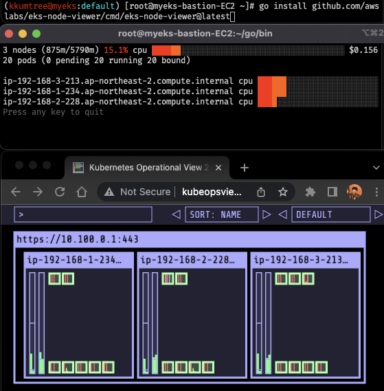

## 2. Horizontal Pod Autoscaler - HPA

- kube-ops-view 및 Grafana(17125)에서 모니터링 병행
- php-apache 데모를 배포하여 진행
  - 마지막 부하 방법으로 해도, 워커노드가 10개까지 늘어나지 않음  
    HPA 조건이 CPU 50% 이기 때문에, 6~7개에서 유지됨

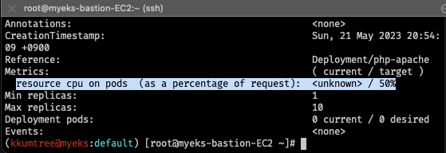

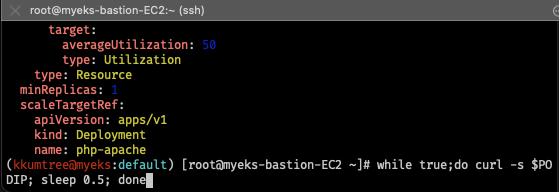

```bash
# CPU: 0.2코어 ~ 0.5코어(50%, 500m) 하한/상한 조건 설정
curl -s -O https://raw.githubusercontent.com/kubernetes/website/main/content/en/examples/application/php-apache.yaml
kubectl apply -f php-apache.yaml

# Pod 배포 후에 확인
kubectl exec -it deploy/php-apache -- cat /var/www/html/index.php

# 모니터링 준비
watch -d 'kubectl get hpa,pod;echo;kubectl top pod;echo;kubectl top node'
kubectl exec -it deploy/php-apache -- top

# 파드 특정 후 접속 테스트
PODIP=$(kubectl get pod -l run=php-apache -o jsonpath={.items[0].status.podIP}) && curl -s $PODIP; echo

## 셋업 설정 후 부하 발생
# HPA: requests.cpu=200m
kubectl autoscale deployment php-apache --cpu-percent=50 --min=1 --max=10
kubectl describe hpa

# 셋업 설정 확인: CPU 사용률 50%, Replicas 범위 1~10개
kubectl krew install neat
kubectl get hpa php-apache -o yaml | kubectl neat | yh

# 부하 발생, 두번째 방법이 더 부하가 많이 걸림
while true;do curl -s $PODIP; sleep 0.5; done
kubectl run -i --tty load-generator --rm --image=busybox:1.28 --restart=Never -- /bin/sh -c "while sleep 0.01; do wget -q -O- http://php-apache; done"

# 바로 밑의 실습 이후에 관련 오브젝트 삭제
kubectl delete deploy,svc,hpa,pod --all
```

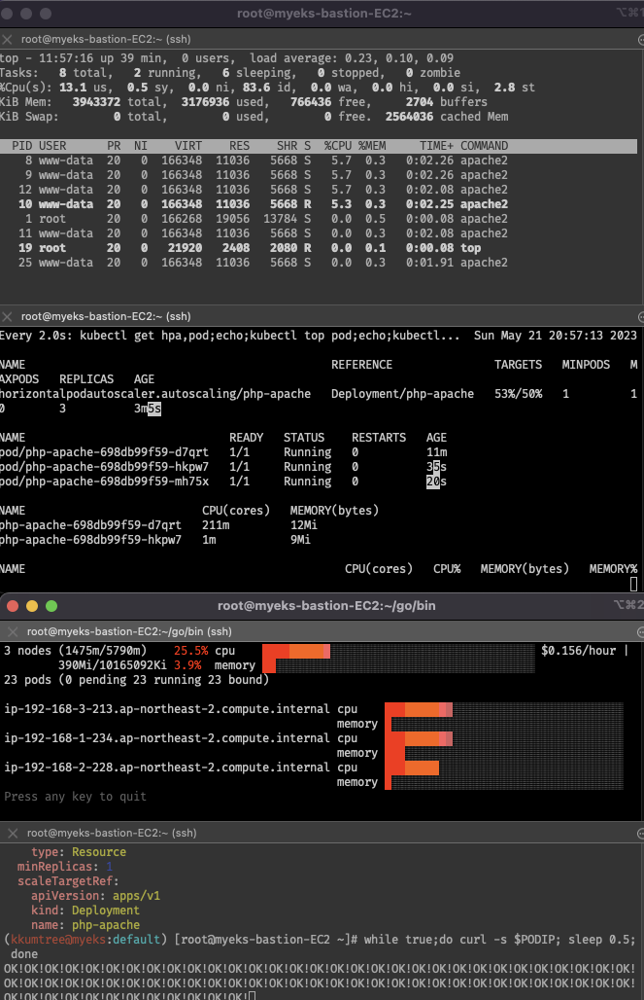

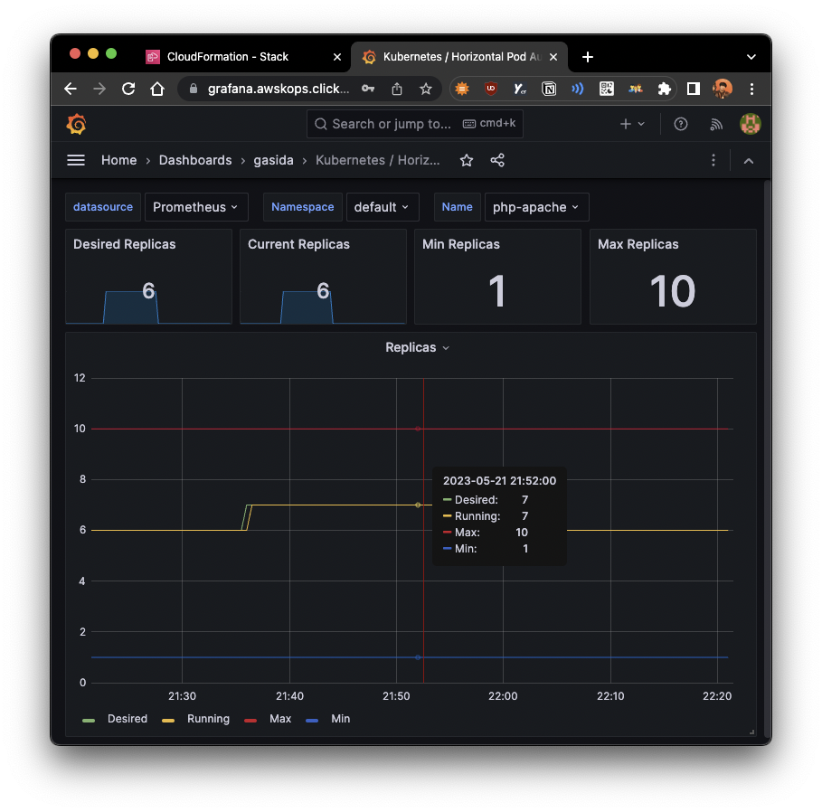

### 2-1. HPA w/ multiple & custom metrics

- 위에서 워커노드 10개까지 scale-up 되지 않았기 때문에,
  추가로 메트릭을 넣고, 사용자 정의된 메트릭으로 부하 조건 충족을 목표
- 바로 위의 실습에서 이어서, 진행

```bash
# 위에서 정의된 HPA 오토스케일링 수정 작업을 진행
kubectl edit horizontalpodautoscaler.autoscaling
```

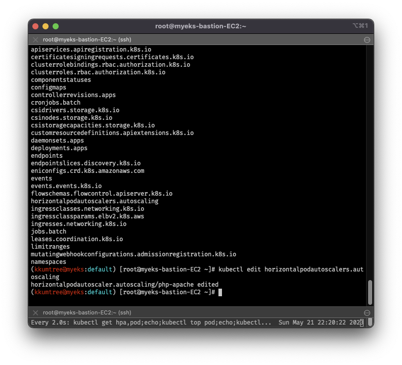

- 편집기에서 아래와 같이 `metrics:` 하위를 수정 후,  
  부하를 계속 발생하면, CPU 50% 이상을 충족하지 않았어도, 워커노드가 10개까지 늘어남
- describedObject: apiVersion, kind, name 을 지정하여,  
  해당 오브젝트의 메트릭을 **사용자 정의**로 지정할 수 있음
- 다만, 사용자 정의 메트릭이기 때문에, eks-node-viewer에서 제대로 조건을 확인할 수 없음

```yaml
# 전략
  metrics:
  - type: Resource
    resource:
      name: cpu
      target:
        type: Utilization
        averageUtilization: 50
  - type: Pods
    pods:
      metric:
        name: packets-per-second
      target:
        type: AverageValue
        averageValue: 1k
  - type: Object
    object:
      metric:
        name: requests-per-second
      describedObject:
        apiVersion: networking.k8s.io/v1
        kind: Ingress
        name: main-route
      target:
        type: Value
        value: 10k
# 후략
```

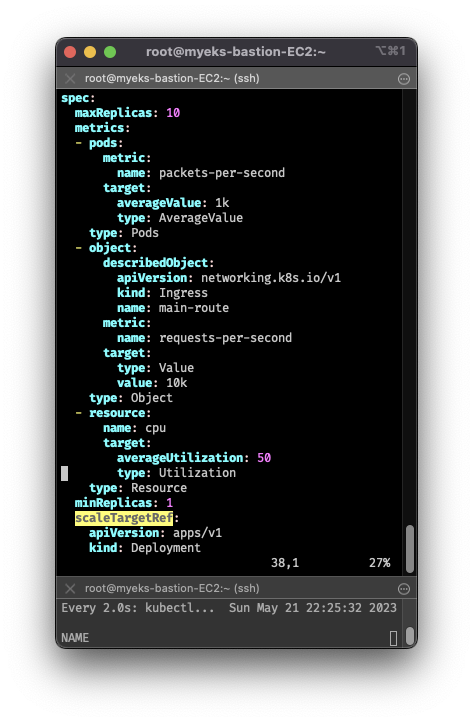

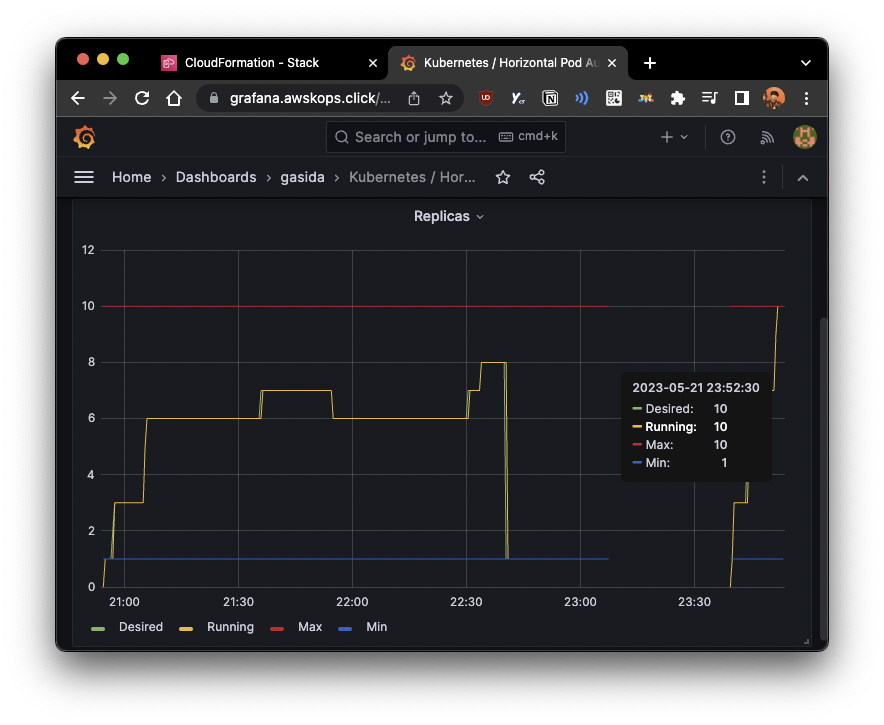

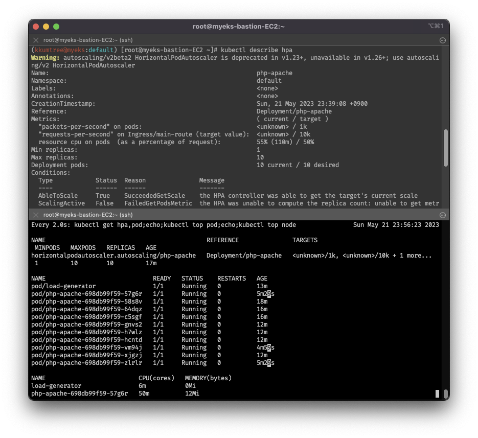

## 3. k8s based Event Driven Autoscaling - KEDA

- HPA, KEDA 비교
  | 구분 | HPA | KEDA |
  | --- | --- | --- |
  | resource metrics | O | X |
  | event driven | X | O |
  | metrics reference | metrics-server | keda-metrics-api-server |
  | scaling job | O | **X** |

- KEDA는 HPA 대체가 아닌, 확장 보조 도구.
- 실습에서는 helm 차트를 통해 설치하고, Grafana 대시보드를 통해서 확인
  - 그라파나 대시보드의 경우, 템플릿으로 검색되는 것은 에러가 나서, [JSON](https://raw.githubusercontent.com/kedacore/keda/main/config/grafana/keda-dashboard.json)을 사용

```bash
# KEDA 설치
cat <<EOT > keda-values.yaml
metricsServer:
  useHostNetwork: true

prometheus:
  metricServer:
    enabled: true
    port: 9022
    portName: metrics
    path: /metrics
    serviceMonitor:
      # Enables ServiceMonitor creation for the Prometheus Operator
      enabled: true
    podMonitor:
      # Enables PodMonitor creation for the Prometheus Operator
      enabled: true
  operator:
    enabled: true
    port: 8080
    serviceMonitor:
      # Enables ServiceMonitor creation for the Prometheus Operator
      enabled: true
    podMonitor:
      # Enables PodMonitor creation for the Prometheus Operator
      enabled: true

  webhooks:
    enabled: true
    port: 8080
    serviceMonitor:
      # Enables ServiceMonitor creation for the Prometheus webhooks
      enabled: true
EOT

kubectl create namespace keda
helm repo add kedacore https://kedacore.github.io/charts
helm install keda kedacore/keda --version 2.10.2 --namespace keda -f keda-values.yaml

# KEDA 설치 확인
kubectl get-all -n keda
kubectl get all -n keda
kubectl get crd | grep keda

# keda 네임스페이스에 디플로이먼트 생성
kubectl apply -f php-apache.yaml -n keda
kubectl get pod -n keda

# ScaledObject 정책 생성 : cron
cat <<EOT > keda-cron.yaml
apiVersion: keda.sh/v1alpha1
kind: ScaledObject
metadata:
  name: php-apache-cron-scaled
spec:
  minReplicaCount: 0
  maxReplicaCount: 2
  pollingInterval: 30
  cooldownPeriod: 300
  scaleTargetRef:
    apiVersion: apps/v1
    kind: Deployment
    name: php-apache
  triggers:
  - type: cron
    metadata:
      timezone: Asia/Seoul
      start: 00,15,30,45 * * * *
      end: 05,20,35,50 * * * *
      desiredReplicas: "1"
EOT
kubectl apply -f keda-cron.yaml -n keda

# 그라파나 대시보드 추가 후 아래 진행
# 그라파나 템플릿으로는 에러가 나서, JSON을 사용

# 모니터링 준비
watch -d 'kubectl get ScaledObject,hpa,pod -n keda'
kubectl get ScaledObject -w

# 확인
# "scaledobject.keda.sh/name": "php-apache-cron-scaled" 라벨 대상 이벤트 수집
kubectl get ScaledObject,hpa,pod -n keda
kubectl get hpa -o jsonpath={.items[0].spec} -n keda | jq

# KEDA 및 deployment 등 삭제
kubectl delete -f keda-cron.yaml -n keda && kubectl delete deploy php-apache -n keda && helm uninstall keda -n keda
kubectl delete namespace keda
```

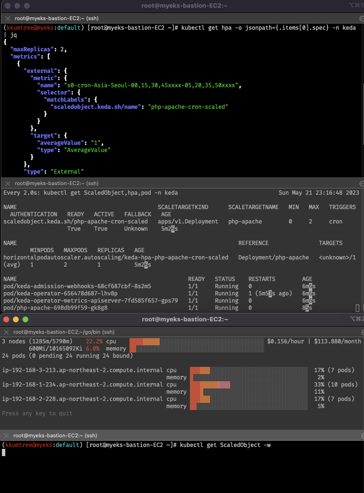

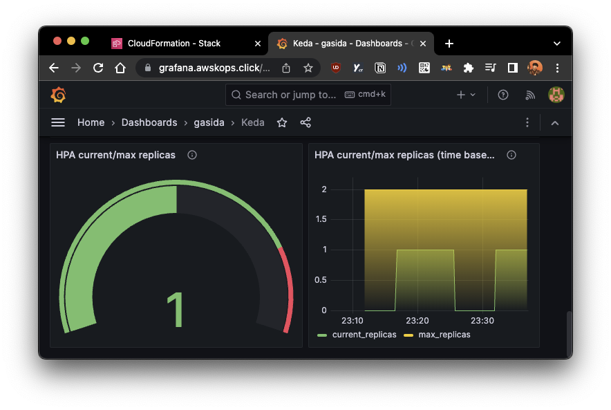

## 4. Vertical Pod Autoscaler - VPA

- 수직 스케일링: 파드의 CPU, 메모리 최적화를 통한 노드 자원 효율화
- 그대로 배포하면 OpenSSL CA 에러가 발생.  
  OpenSSL을 1.1.1 이상으로 버전 업데이트 진행
- Grafana 대시보드의 경우, 템플릿(~~14588, 16294~~)에서 에러 발생
- 단점: AWS 기준, 하나의 자원에 대해 ASG와 EKS에서 각각의 방식으로 관리
  -> 관리정보가 동기화되지 않고, 스케일링 속도가 느림

```bash
# 코드 다운로드
git clone https://github.com/kubernetes/autoscaler.git
cd ~/autoscaler/vertical-pod-autoscaler/
tree hack

# openssl 버전 확인
openssl version

# openssl 1.1.1 이상 버전 확인
yum install openssl11 -y
openssl11 version

# 스크립트파일내에 openssl11 수정
sed -i 's/openssl/openssl11/g' ~/autoscaler/vertical-pod-autoscaler/pkg/admission-controller/gencerts.sh

# VPA 배포
watch -d kubectl get pod -n kube-system
cat hack/vpa-up.sh
./hack/vpa-up.sh
kubectl get crd | grep autoscaling

## 예제 
## pod 실행 수 분 뒤에 pod resource.request가 VPA에 의해 수정

# 모니터링 준비
# 모니터링
watch -d kubectl top pod

# 공식 예제 배포
cd ~/autoscaler/vertical-pod-autoscaler/
cat examples/hamster.yaml | yh
kubectl apply -f examples/hamster.yaml && kubectl get vpa -w

# 파드 리소스 Requests 확인
kubectl describe pod | grep Requests: -A2

# VPA에 의해 기존 파드 삭제되고 신규 파드가 생성됨
kubectl get events --sort-by=".metadata.creationTimestamp" | grep VPA
```

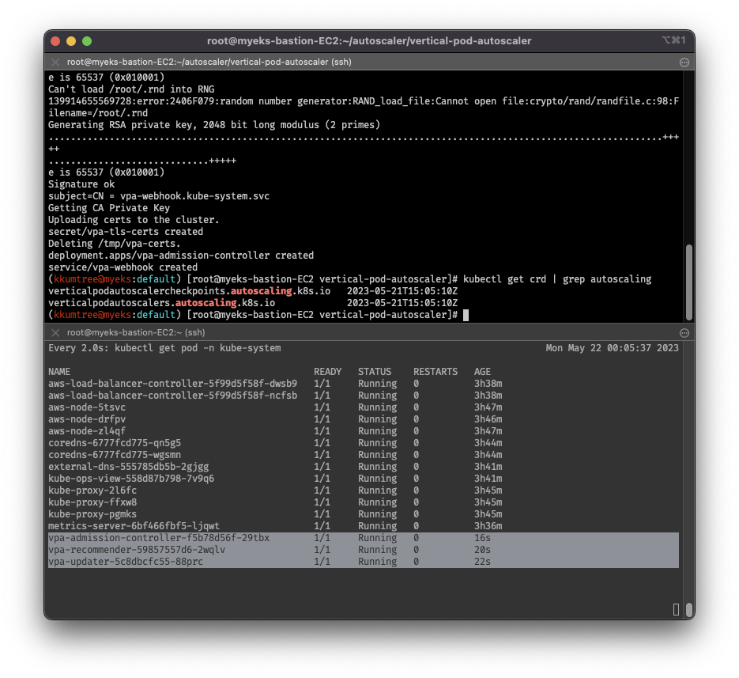

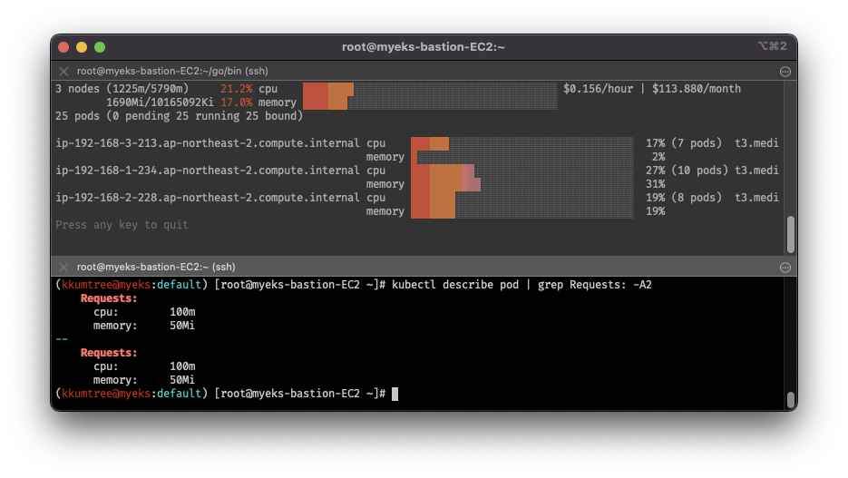

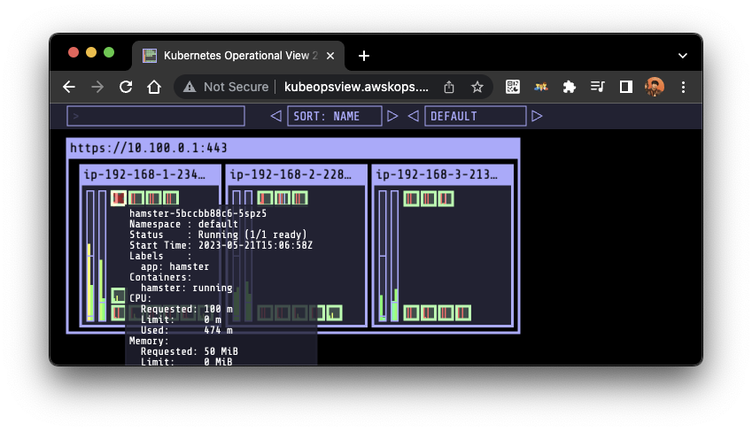

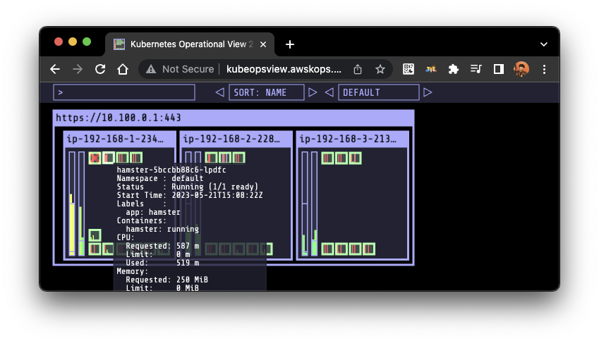

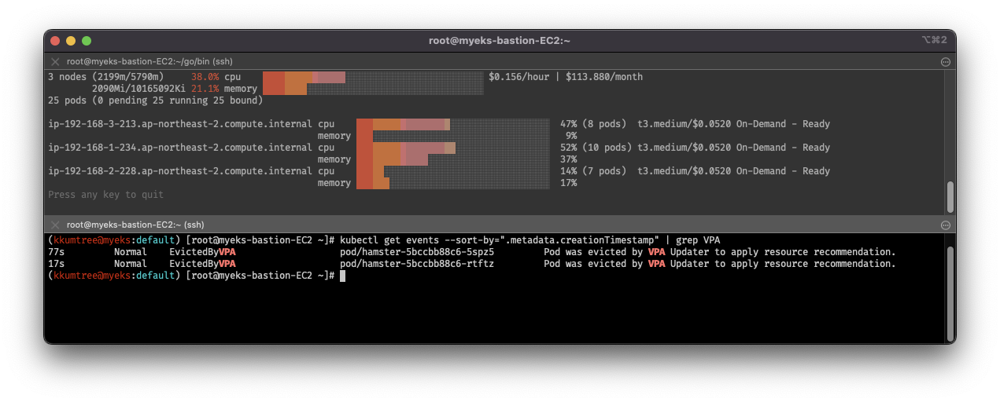

## 5. Cluster Autoscaler - CA

- AWS CSP로 실습을 진행하므로, CA도 적용해볼 수 있음
  - cluster-autoscaler 파드를 배포하여 CA 동작 가능
  - AWS의 경우 ASG를 사용하여 CA 적용
- EKS에서 기 적용된 태그 확인
  - k8s.io/cluster-autoscaler/enabled : 'true'
  - k8s.io/cluster-autoscaler/myeks : owned
- CA 동작: 주기적으로 사용률을 확인하여, 스케일 인/아웃을 수행

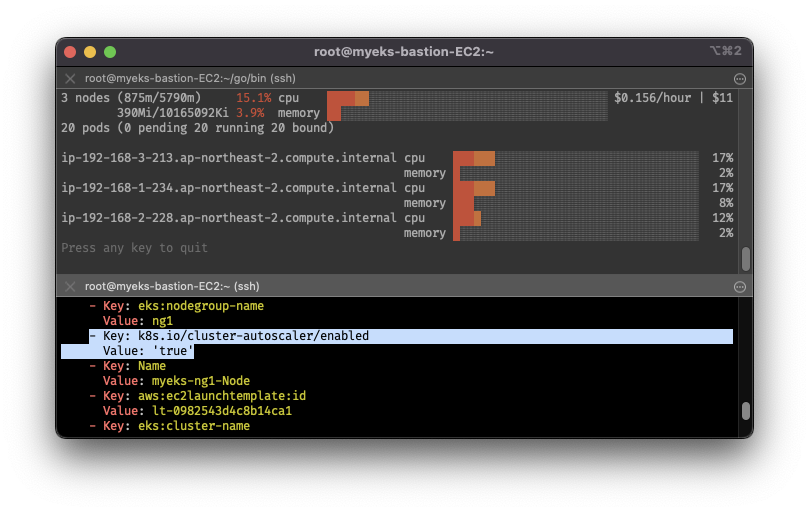

```bash
# EKS 노드에서 태그 확인
aws ec2 describe-instances  --filters Name=tag:Name,Values=$CLUSTER_NAME-ng1-Node --query "Reservations[*].Instances[*].Tags[*]" --output yaml | yh

# 현재 ASG 확인: 3 / 3 / 3
aws autoscaling describe-auto-scaling-groups \
    --query "AutoScalingGroups[? Tags[? (Key=='eks:cluster-name') && Value=='myeks']].[AutoScalingGroupName, MinSize, MaxSize,DesiredCapacity]" \
    --output table

# Maxsize 수정: 3 -> 6
export ASG_NAME=$(aws autoscaling describe-auto-scaling-groups --query "AutoScalingGroups[? Tags[? (Key=='eks:cluster-name') && Value=='myeks']].AutoScalingGroupName" --output text)
aws autoscaling update-auto-scaling-group --auto-scaling-group-name ${ASG_NAME} --min-size 3 --desired-capacity 3 --max-size 6

# 변경된 ASG 확인: 3 / 6 / 3
aws autoscaling describe-auto-scaling-groups --query "AutoScalingGroups[? Tags[? (Key=='eks:cluster-name') && Value=='myeks']].[AutoScalingGroupName, MinSize, MaxSize,DesiredCapacity]" --output table

# CA 배포
curl -s -O https://raw.githubusercontent.com/kubernetes/autoscaler/master/cluster-autoscaler/cloudprovider/aws/examples/cluster-autoscaler-autodiscover.yaml
sed -i "s/<YOUR CLUSTER NAME>/$CLUSTER_NAME/g" cluster-autoscaler-autodiscover.yaml
kubectl apply -f cluster-autoscaler-autodiscover.yaml

# 확인
kubectl get pod -n kube-system | grep cluster-autoscaler
kubectl describe deployments.apps -n kube-system cluster-autoscaler

# (옵션) cluster-autoscaler 파드가 동작하는 워커 노드가 퇴출(evict) 되지 않게 설정
# 이번 실습에 적용하지 않음 
kubectl -n kube-system annotate deployment.apps/cluster-autoscaler cluster-autoscaler.kubernetes.io/safe-to-evict="false"
```

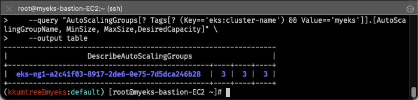

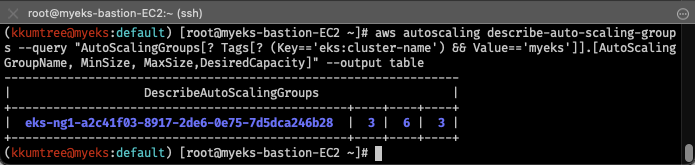

### 5-1. CA 테스트

- nginx 파드 배포 후 레플리카셋 scale out 하여 확인: 1 -> 15
  - 이후 노드도 자동 증가함을 확인
- 다시, 해당 파드를 삭제하면, scale down 됨을 확인할 수 있음

```bash
# 모니터링 준비
kubectl get nodes -w
while true; do kubectl get node; echo "------------------------------" ; date ; sleep 1; done
while true; do aws ec2 describe-instances --query "Reservations[*].Instances[*].{PrivateIPAdd:PrivateIpAddress,InstanceName:Tags[?Key=='Name']|[0].Value,Status:State.Name}" --filters Name=instance-state-name,Values=running --output text ; echo "------------------------------"; date; sleep 1; done

# nginx 파드 배포: 레플리카셋 1
cat <<EoF> nginx.yaml
apiVersion: apps/v1
kind: Deployment
metadata:
  name: nginx-to-scaleout
spec:
  replicas: 1
  selector:
    matchLabels:
      app: nginx
  template:
    metadata:
      labels:
        service: nginx
        app: nginx
    spec:
      containers:
      - image: nginx
        name: nginx-to-scaleout
        resources:
          limits:
            cpu: 500m
            memory: 512Mi
          requests:
            cpu: 500m
            memory: 512Mi
EoF

kubectl apply -f nginx.yaml
kubectl get deployment/nginx-to-scaleout

# 레플리카셋 15로 scale out
kubectl scale --replicas=15 deployment/nginx-to-scaleout && date

# 확인
kubectl get pods -l app=nginx -o wide --watch
kubectl -n kube-system logs -f deployment/cluster-autoscaler

# 노드 자동 증가 확인
# 앞서 설치했던 eks-node-viewer로도 확인
kubectl get nodes
aws autoscaling describe-auto-scaling-groups \
    --query "AutoScalingGroups[? Tags[? (Key=='eks:cluster-name') && Value=='myeks']].[AutoScalingGroupName, MinSize, MaxSize,DesiredCapacity]" \
    --output table

./eks-node-viewer

# 배포 삭제 및 (10여분 이후) 노드 갯수 축소 확인
kubectl delete -f nginx.yaml && date
watch -d kubectl get node

# (옵션) 아래 flag를 통해, scale down 시간을 조정 가능
# 예시: --scale-down-delay-after-add=5m
```

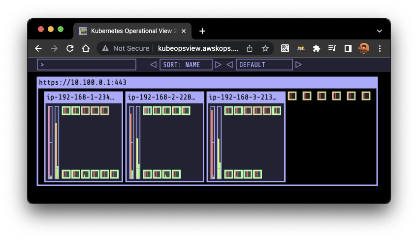

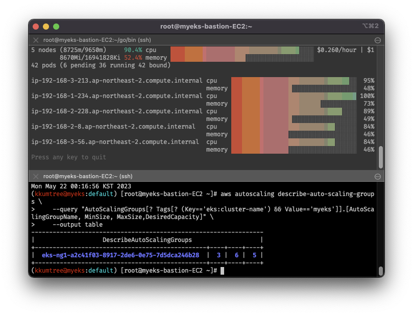

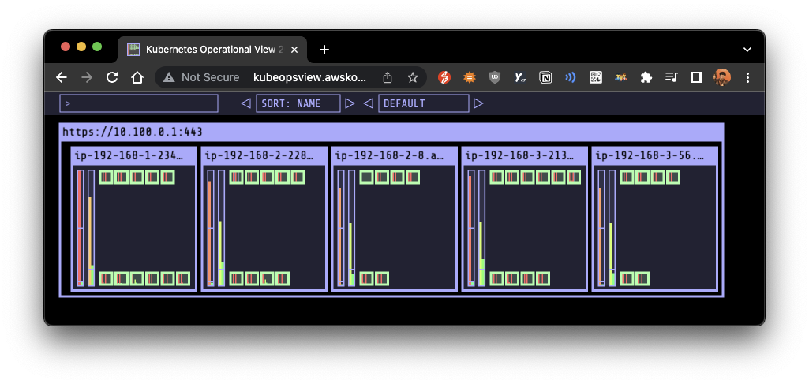

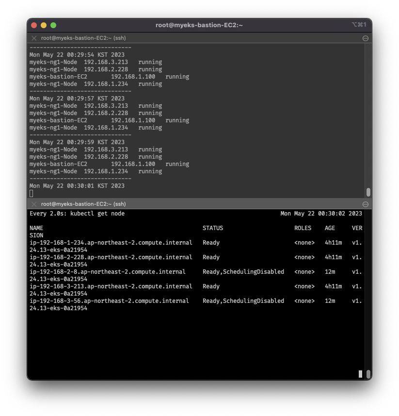

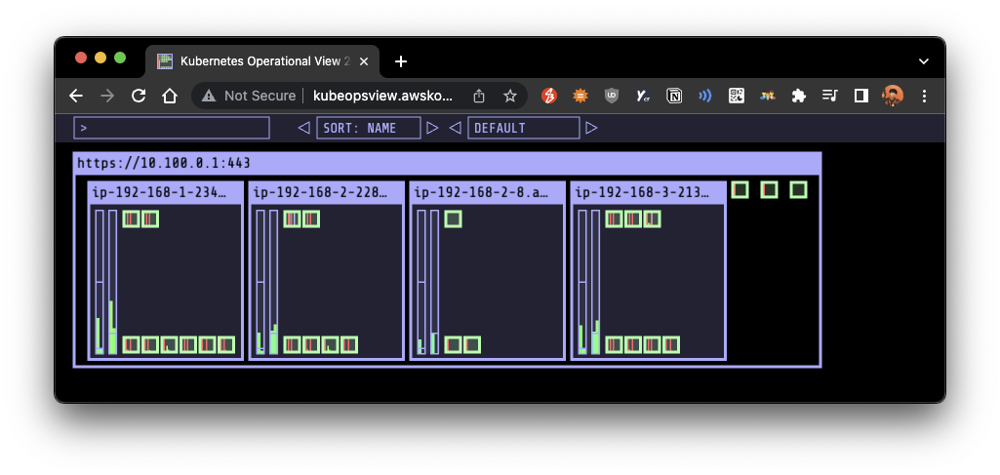

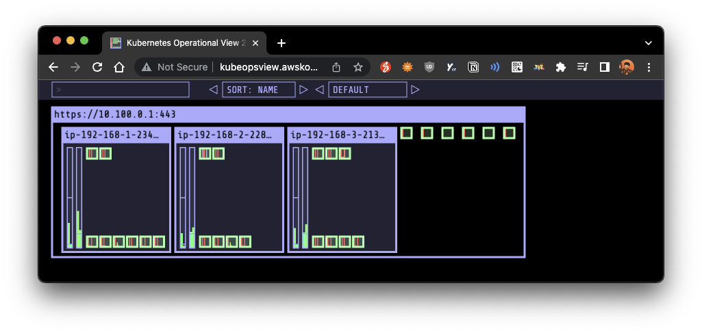

- 리소스 삭제

```bash
kubectl delete -f nginx.yaml

# ASG 설정 원복: 3 / 3 / 3
aws autoscaling update-auto-scaling-group --auto-scaling-group-name ${ASG_NAME} --min-size 3 --desired-capacity 3 --max-size 3
aws autoscaling describe-auto-scaling-groups --query "AutoScalingGroups[? Tags[? (Key=='eks:cluster-name') && Value=='myeks']].[AutoScalingGroupName, MinSize, MaxSize,DesiredCapacity]" --output table

# Cluster Autoscaler 삭제
kubectl delete -f cluster-autoscaler-autodiscover.yaml
```

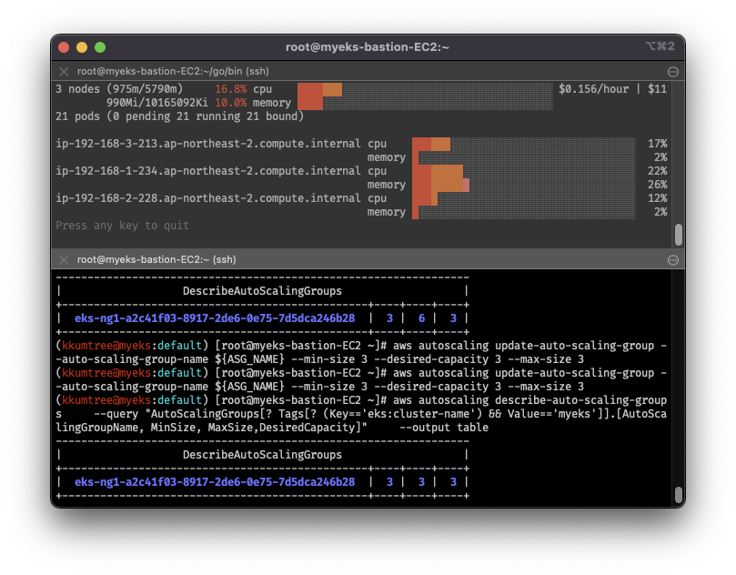

## 6. Cluster Propotional Autoscaler - CPA

- 5와 같이 노드 수 증가에 비례하여 성능 처리가 필요한 app(컨테이너/파드)를 수평으로 자동확장
  - 실습의 경우, nginx 사용
- CPA는 CPA rule을 먼저 설정해야 함

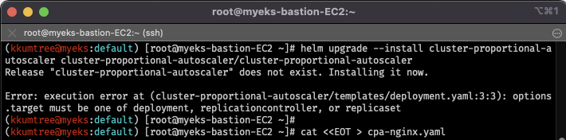

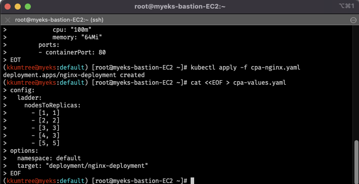


```bash
# helm 차트를 통한 릴리즈 시도 -> 실패해야 정상
# (이유) CPA rule을 설정하고 helm차트를 릴리즈 필요
helm repo add cluster-proportional-autoscaler https://kubernetes-sigs.github.io/cluster-proportional-autoscaler
helm upgrade --install cluster-proportional-autoscaler cluster-proportional-autoscaler/cluster-proportional-autoscaler

# 먼저 nginx 배포
cat <<EOT > cpa-nginx.yaml
apiVersion: apps/v1
kind: Deployment
metadata:
  name: nginx-deployment
spec:
  replicas: 1
  selector:
    matchLabels:
      app: nginx
  template:
    metadata:
      labels:
        app: nginx
    spec:
      containers:
      - name: nginx
        image: nginx:latest
        resources:
          limits:
            cpu: "100m"
            memory: "64Mi"
          requests:
            cpu: "100m"
            memory: "64Mi"
        ports:
        - containerPort: 80
EOT
kubectl apply -f cpa-nginx.yaml

# CPA rule 설정
# config.ladder.nodesToReplicas: [노드수, 레플리카수] 에서 규칙 확인
cat <<EOF > cpa-values.yaml
config:
  ladder:
    nodesToReplicas:
      - [1, 1]
      - [2, 2]
      - [3, 3]
      - [4, 3]
      - [5, 5]
options:
  namespace: default
  target: "deployment/nginx-deployment"
EOF

# 모니터링 준비
watch -d kubectl get pod

# helm 업그레이드 -> 성공
helm upgrade --install cluster-proportional-autoscaler -f cpa-values.yaml cluster-proportional-autoscaler/cluster-proportional-autoscaler

# 노드 5개로 증가: rule에 따라 nginx 레플리카셋 5개 배포
export ASG_NAME=$(aws autoscaling describe-auto-scaling-groups --query "AutoScalingGroups[? Tags[? (Key=='eks:cluster-name') && Value=='myeks']].AutoScalingGroupName" --output text)
aws autoscaling update-auto-scaling-group --auto-scaling-group-name ${ASG_NAME} --min-size 5 --desired-capacity 5 --max-size 5
aws autoscaling describe-auto-scaling-groups --query "AutoScalingGroups[? Tags[? (Key=='eks:cluster-name') && Value=='myeks']].[AutoScalingGroupName, MinSize, MaxSize,DesiredCapacity]" --output table

# 노드 4개로 축소: rule에 따라 nginx 레플리카셋 3개 배포
aws autoscaling update-auto-scaling-group --auto-scaling-group-name ${ASG_NAME} --min-size 4 --desired-capacity 4 --max-size 4
aws autoscaling describe-auto-scaling-groups --query "AutoScalingGroups[? Tags[? (Key=='eks:cluster-name') && Value=='myeks']].[AutoScalingGroupName, MinSize, MaxSize,DesiredCapacity]" --output table

# 삭제
helm uninstall cluster-proportional-autoscaler && kubectl delete -f cpa-nginx.yaml
```

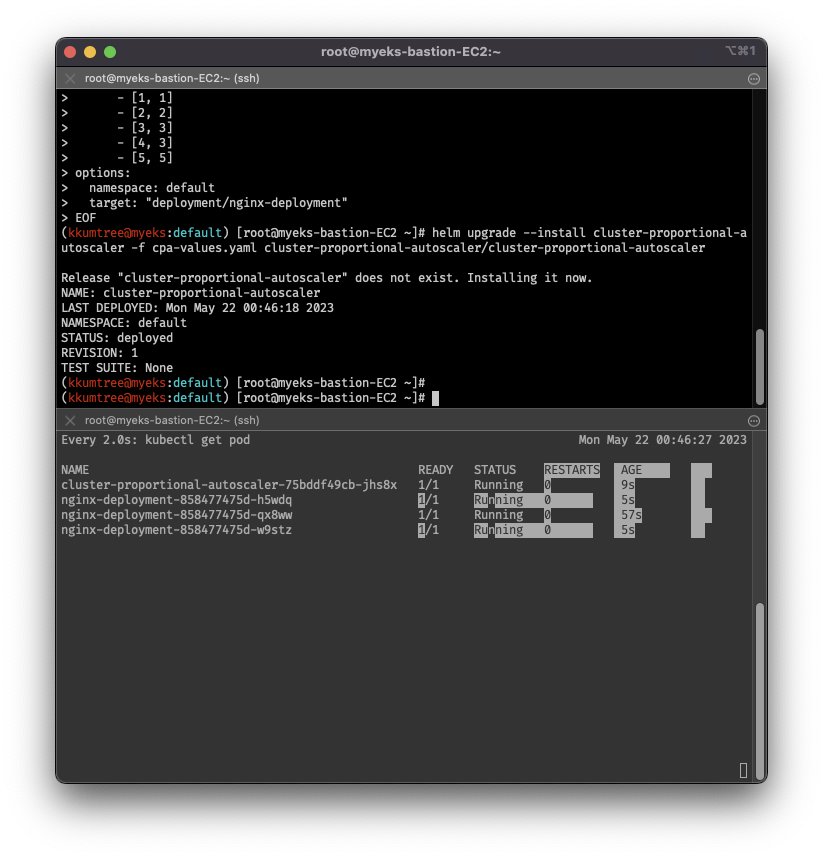

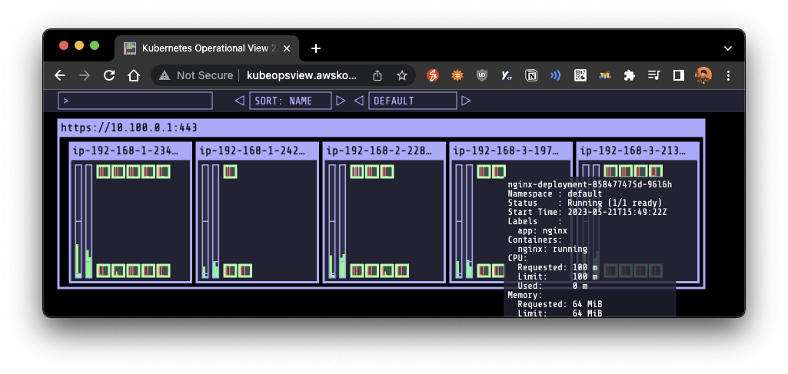

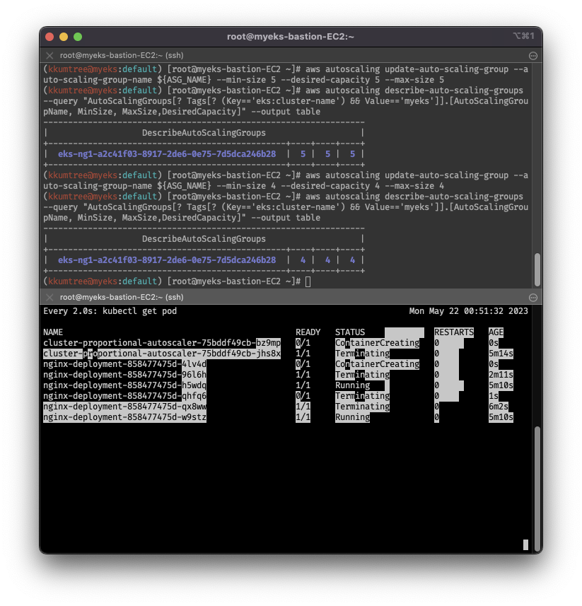

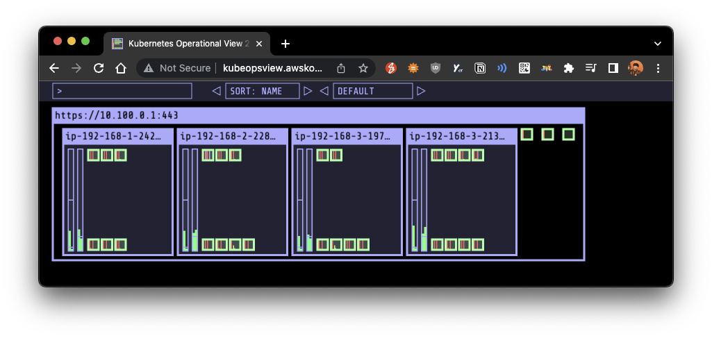

## 7. Karpenter: k8s Native AutoScaler

- 단시간(n초)만에 컴퓨팅 리소스를 제공하는 노드 수명 주기 관리 솔루션
  - 스케줄러가 unschedulable로 태깅한 pods를 포착하여 JIT(Just-In-Time)으로 노드를 생성
  - 반대로 노드가 필요없어지면, 삭제
  - CA와 ASG를 둘다 거쳐야하는 방식에 비해, 더 빠르고 효율적인 리소스 제공 가능
- 다른 노드 그룹에서 진행하므로 앞서 진행했던 모든 EKS 실습환경을 삭제

```bash
helm uninstall -n kube-system kube-ops-view
helm uninstall -n monitoring kube-prometheus-stack
eksctl delete cluster --name $CLUSTER_NAME && aws cloudformation delete-stack --stack-name $CLUSTER_NAME
```

- 새로운 환경으로 재배포: 맨 처음에 했던 실습환경 배포와 동일(cloudformation)

```bash
curl -O https://s3.ap-northeast-2.amazonaws.com/cloudformation.cloudneta.net/K8S/karpenter-preconfig.yaml

# 이하 생략
```

- 배포 완료 후 접속한 뒤, 확인 요소
  - IP 주소 확인: 172.30.0.0/16 VPC 대역에서 172.30.1.0/24 대역을 사용
  - eks-node-viewer 재설치

```bash
# IP 주소 확인
ip -br -c addr

# eks-node-viewer 재설치 
# EKS 배포 후에 실행하여 모니터링
go install github.com/awslabs/eks-node-viewer/cmd/eks-node-viewer@latest
```

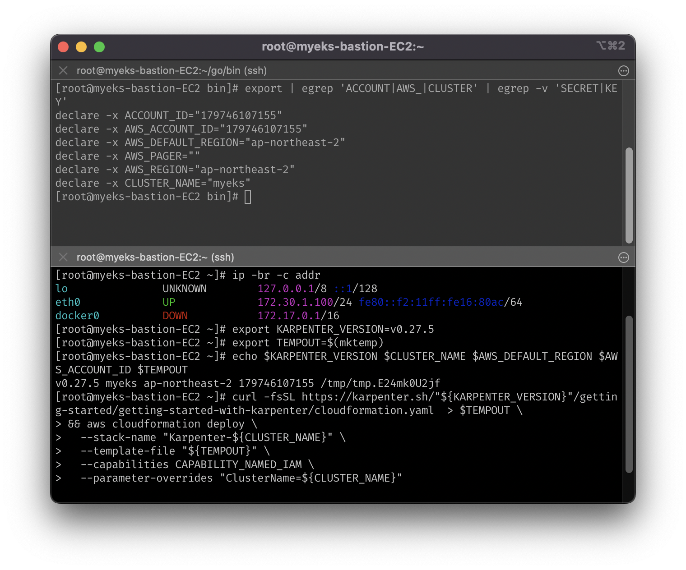

- EKS 배포 및 Karpenter 프로비저너 설치
  - 클러스터 생성 시, 20여분 소요 (차 한잔 혹은 책을 읽도록 하자)
  - helm을 통한 Karpenter 설치 시, 환경변수 중 하나라도 확인 안되면 설치 오류가 발생
  - 타겟 지정을 위한, Provisioner 생성
    - 관리 대상 지정: securityGroupSelector, subnetSelector를 사용, $CLUSTER_NAME 대상
    - 30초 이후 미사용 노드 삭제: 데몬셋 제외, 이 값을 없애면, 사용률이 낮아도 노드가 축소되지 않음!
      - `ttlSecondsAfterEmpty: 30` (참조: [AWS Blog](https://aws.amazon.com/ko/blogs/korea/introducing-karpenter-an-open-source-high-performance-kubernetes-cluster-autoscaler/))

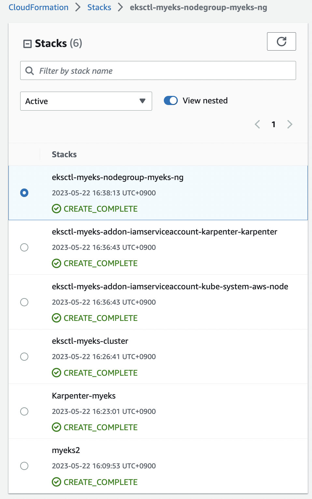

```bash
# 환경변수 정보 확인
export | egrep 'ACCOUNT|AWS_|CLUSTER' | egrep -v 'SECRET|KEY'

# 환경변수 설정
export KARPENTER_VERSION=v0.27.5
export TEMPOUT=$(mktemp)
echo $KARPENTER_VERSION $CLUSTER_NAME $AWS_DEFAULT_REGION $AWS_ACCOUNT_ID $TEMPOUT

# CloudFormation으로 IAM Policy, Role, EC2 Instance Profile 생성
curl -fsSL https://karpenter.sh/"${KARPENTER_VERSION}"/getting-started/getting-started-with-karpenter/cloudformation.yaml  > $TEMPOUT \
&& aws cloudformation deploy \
  --stack-name "Karpenter-${CLUSTER_NAME}" \
  --template-file "${TEMPOUT}" \
  --capabilities CAPABILITY_NAMED_IAM \
  --parameter-overrides "ClusterName=${CLUSTER_NAME}"

# 클러스터 생성 : myeks2 EKS 클러스터 생성
eksctl create cluster -f - <<EOF
---
apiVersion: eksctl.io/v1alpha5
kind: ClusterConfig
metadata:
  name: ${CLUSTER_NAME}
  region: ${AWS_DEFAULT_REGION}
  version: "1.24"
  tags:
    karpenter.sh/discovery: ${CLUSTER_NAME}

iam:
  withOIDC: true
  serviceAccounts:
  - metadata:
      name: karpenter
      namespace: karpenter
    roleName: ${CLUSTER_NAME}-karpenter
    attachPolicyARNs:
    - arn:aws:iam::${AWS_ACCOUNT_ID}:policy/KarpenterControllerPolicy-${CLUSTER_NAME}
    roleOnly: true

iamIdentityMappings:
- arn: "arn:aws:iam::${AWS_ACCOUNT_ID}:role/KarpenterNodeRole-${CLUSTER_NAME}"
  username: system:node:{{EC2PrivateDNSName}}
  groups:
  - system:bootstrappers
  - system:nodes

managedNodeGroups:
- instanceType: m5.large
  amiFamily: AmazonLinux2
  name: ${CLUSTER_NAME}-ng
  desiredCapacity: 2
  minSize: 1
  maxSize: 10
  iam:
    withAddonPolicies:
      externalDNS: true

## Optionally run on fargate
# fargateProfiles:
# - name: karpenter
#  selectors:
#  - namespace: karpenter
EOF

# EKS 배포 확인
eksctl get cluster
eksctl get nodegroup --cluster $CLUSTER_NAME
eksctl get iamidentitymapping --cluster $CLUSTER_NAME
eksctl get iamserviceaccount --cluster $CLUSTER_NAME
eksctl get addon --cluster $CLUSTER_NAME

# 모니터링 준비: eks-node-viewer
cd ~/go/bin && ./eks-node-viewer

# k8s 확인
# aws-auth에서 권한 매핑을 확인
kubectl cluster-info
kubectl get node --label-columns=node.kubernetes.io/instance-type,eks.amazonaws.com/capacityType,topology.kubernetes.io/zone
kubectl get pod -n kube-system -owide
kubectl describe cm -n kube-system aws-auth

# 카펜터 설치를 위한 환경 변수 설정 및 확인
export CLUSTER_ENDPOINT="$(aws eks describe-cluster --name ${CLUSTER_NAME} --query "cluster.endpoint" --output text)"
export KARPENTER_IAM_ROLE_ARN="arn:aws:iam::${AWS_ACCOUNT_ID}:role/${CLUSTER_NAME}-karpenter"

# EC2 Spot Fleet 사용을 위한 service-linked-role 생성 확인
# 제대로 생성된 것을 확인하는 거라 아래 에러 출력이 정상!
# An error occurred (InvalidInput) when calling the CreateServiceLinkedRole operation: Service role name AWSServiceRoleForEC2Spot has been taken in this account, please try a different suffix.
aws iam create-service-linked-role --aws-service-name spot.amazonaws.com || true

# public ECR에서 인증되지 않은 pull 수행을 위해, 미리 로그아웃
# 실제 프로젝트에 적용할 때는, 로그아웃 안한 상태에서 시행해보고 어떤 현상이 일어나는지 볼 예정 (To-Do)
docker logout public.ecr.aws

# 원활한 설치를 위한 인자값 확인
echo $KARPENTER_VERSION $KARPENTER_IAM_ROLE_ARN $CLUSTER_NAME $CLUSTER_ENDPOINT 

# karpenter 설치
helm upgrade --install karpenter oci://public.ecr.aws/karpenter/karpenter --version ${KARPENTER_VERSION} --namespace karpenter --create-namespace \
  --set serviceAccount.annotations."eks\.amazonaws\.com/role-arn"=${KARPENTER_IAM_ROLE_ARN} \
  --set settings.aws.clusterName=${CLUSTER_NAME} \
  --set settings.aws.defaultInstanceProfile=KarpenterNodeInstanceProfile-${CLUSTER_NAME} \
  --set settings.aws.interruptionQueueName=${CLUSTER_NAME} \
  --set controller.resources.requests.cpu=1 \
  --set controller.resources.requests.memory=1Gi \
  --set controller.resources.limits.cpu=1 \
  --set controller.resources.limits.memory=1Gi \
  --wait

# 확인
kubectl get-all -n karpenter
kubectl get all -n karpenter
kubectl get cm -n karpenter karpenter-global-settings -o jsonpath={.data} | jq
kubectl get crd | grep karpenter

# 프로비저너 설치
cat <<EOF | kubectl apply -f -
apiVersion: karpenter.sh/v1alpha5
kind: Provisioner
metadata:
  name: default
spec:
  requirements:
    - key: karpenter.sh/capacity-type
      operator: In
      values: ["spot"]
  limits:
    resources:
      cpu: 1000
  providerRef:
    name: default
  ttlSecondsAfterEmpty: 30
---
apiVersion: karpenter.k8s.aws/v1alpha1
kind: AWSNodeTemplate
metadata:
  name: default
spec:
  subnetSelector:
    karpenter.sh/discovery: ${CLUSTER_NAME}
  securityGroupSelector:
    karpenter.sh/discovery: ${CLUSTER_NAME}
EOF

# 확인
kubectl get awsnodetemplates,provisioners
```

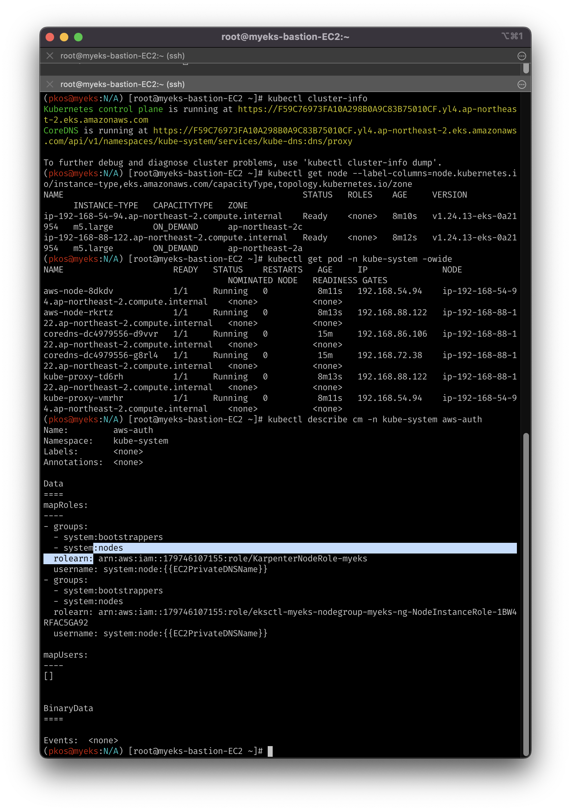

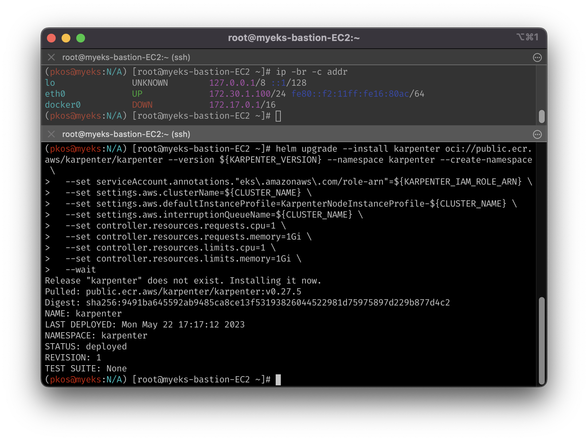

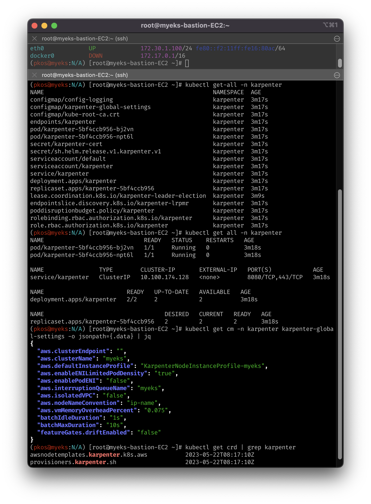

- (옵션)ExternalDNS, kube-ops-view, grafana
  - 실습 시, Grafana만 제대로 구동이 되지 않음 (To-Do)

```bash
MyDomain=awskops.click
echo "export MyDomain=awskops.click" >> /etc/profile
MyDnzHostedZoneId=$(aws route53 list-hosted-zones-by-name --dns-name "${MyDomain}." --query "HostedZones[0].Id" --output text)
echo $MyDomain, $MyDnzHostedZoneId
curl -s -O https://raw.githubusercontent.com/gasida/PKOS/main/aews/externaldns.yaml
MyDomain=$MyDomain MyDnzHostedZoneId=$MyDnzHostedZoneId envsubst < externaldns.yaml | kubectl apply -f -

# kube-ops-view
helm repo add geek-cookbook https://geek-cookbook.github.io/charts/
helm install kube-ops-view geek-cookbook/kube-ops-view --version 1.2.2 --set env.TZ="Asia/Seoul" --namespace kube-system
kubectl patch svc -n kube-system kube-ops-view -p '{"spec":{"type":"LoadBalancer"}}'
kubectl annotate service kube-ops-view -n kube-system "external-dns.alpha.kubernetes.io/hostname=kubeopsview.$MyDomain"
echo -e "Kube Ops View URL = http://kubeopsview.$MyDomain:8080/#scale=1.5"

helm repo add grafana-charts https://grafana.github.io/helm-charts
helm repo add prometheus-community https://prometheus-community.github.io/helm-charts
helm repo update

kubectl create namespace monitoring

# 프로메테우스 설치
curl -fsSL https://karpenter.sh/"${KARPENTER_VERSION}"/getting-started/getting-started-with-karpenter/prometheus-values.yaml | tee prometheus-values.yaml
helm install --namespace monitoring prometheus prometheus-community/prometheus --values prometheus-values.yaml --set alertmanager.enabled=false

# 그라파나 설치
curl -fsSL https://karpenter.sh/"${KARPENTER_VERSION}"/getting-started/getting-started-with-karpenter/grafana-values.yaml | tee grafana-values.yaml
helm install --namespace monitoring grafana grafana-charts/grafana --values grafana-values.yaml --set service.type=LoadBalancer

# admin 암호
kubectl get secret --namespace monitoring grafana -o jsonpath="{.data.admin-password}" | base64 --decode ; echo

# 그라파나 접속
kubectl annotate service grafana -n monitoring "external-dns.alpha.kubernetes.io/hostname=grafana.$MyDomain"
echo -e "grafana URL = http://grafana.$MyDomain"
```

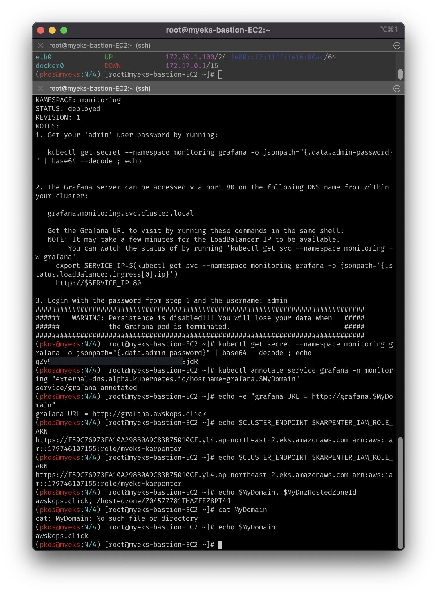

### 7-1. Karpenter 테스트 셋업

- `terminationGracePeriodSeconds: 0`
  - 정상 종료 동작이 수행되는 시간(Grace Period) 설정, 0으로 설정 시 바로 강제 종료
  - Docs에서는 **강력하게 권장하지 않지만** 실습의 빠른 진행을 위해 설정 (참조: [k8s Docs](https://kubernetes.io/ko/docs/tasks/run-application/force-delete-stateful-set-pod/))
- 초기 셋업의 레플리카셋 요청 수는 5개

```bash
# pause 파드 1개에 CPU 1개 최소 보장 할당
cat <<EOF | kubectl apply -f -
apiVersion: apps/v1
kind: Deployment
metadata:
  name: inflate
spec:
  replicas: 0
  selector:
    matchLabels:
      app: inflate
  template:
    metadata:
      labels:
        app: inflate
    spec:
      terminationGracePeriodSeconds: 0
      containers:
        - name: inflate
          image: public.ecr.aws/eks-distro/kubernetes/pause:3.7
          resources:
            requests:
              cpu: 1
EOF
kubectl scale deployment inflate --replicas 5
kubectl logs -f -n karpenter -l app.kubernetes.io/name=karpenter -c controller

# 스팟 인스턴스 1개 생성이 확인 되어야 함.
aws ec2 describe-spot-instance-requests --filters "Name=state,Values=active" --output table
kubectl get node -l karpenter.sh/capacity-type=spot -o jsonpath='{.items[0].metadata.labels}' | jq
kubectl get node --label-columns=eks.amazonaws.com/capacityType,karpenter.sh/capacity-type,node.kubernetes.io/instance-type
```

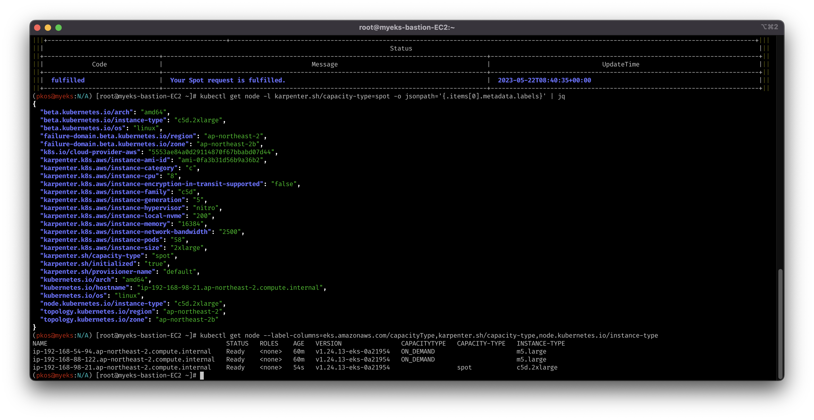

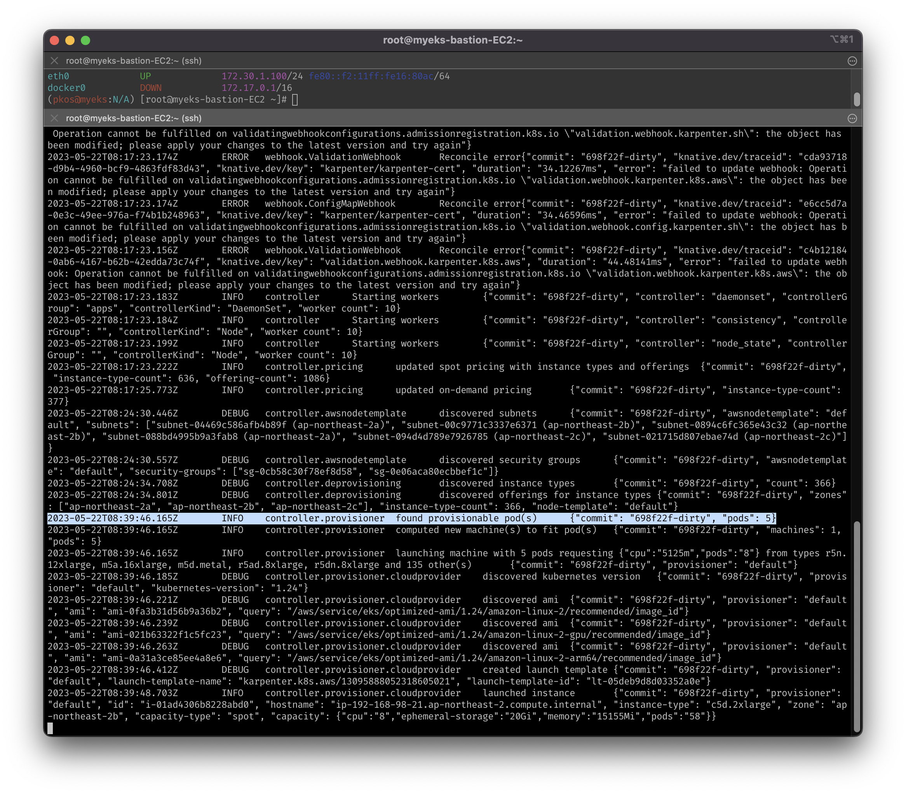

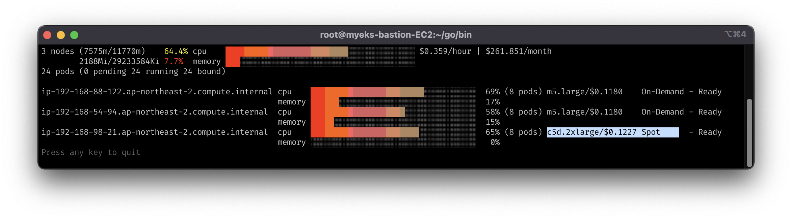

### 7-2. Scale down 테스트

- Deployment를 지우면, 30초 이후 '비어있는' 노드(스팟 인스턴스)를 삭제
  - `ttlSecondsAfterEmpty: 30` 지정하였기 때문

```bash
# Now, delete the deployment. After 30 seconds (ttlSecondsAfterEmpty), Karpenter should terminate the now empty nodes.
kubectl delete deployment inflate
kubectl logs -f -n karpenter -l app.kubernetes.io/name=karpenter -c controller
```

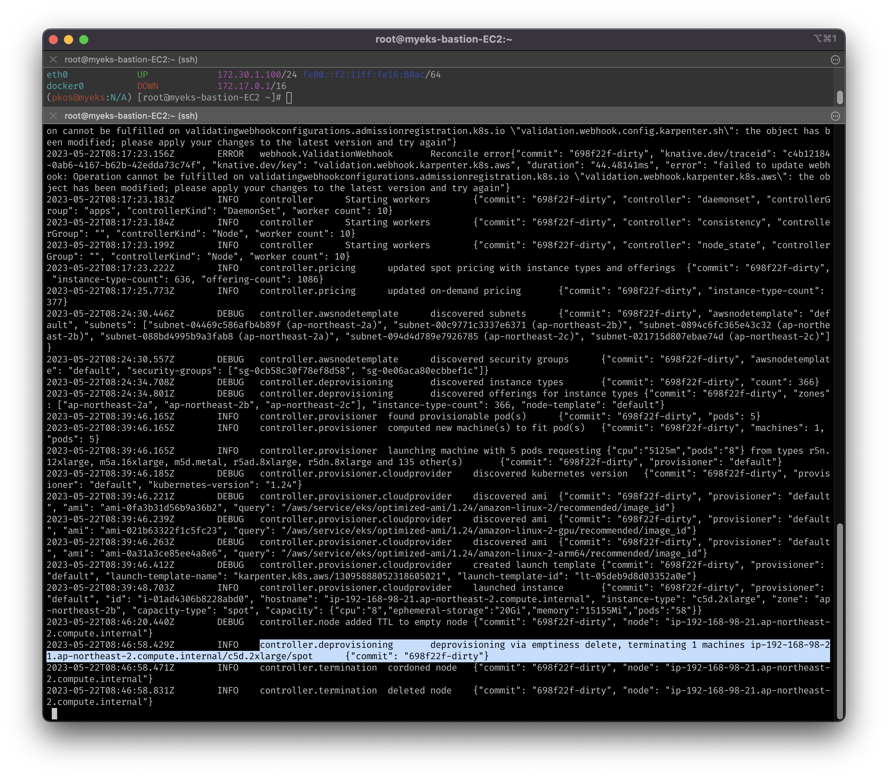

### 7-3. Consolidation 테스트

- Consolidation이 생소한 단어라 따로 검색
  - 노드의 리소스 활용도를 높이고 비용을 절감하기 위해 작업 부하를 다른 노드로 이동시키는 기능
  - 위에서 지정했던 ttlSecondsAfterEmpty과 동시 사용 불가 (참조: [아이엠 !나이롱맨 Blog](https://kingofbackend.tistory.com/252))
- 실습에서는 12개의 레플리카셋을 생성하여 12Gi의 메모리 요청을 발생
- **원래 예상한 것**
  - Karpenter가 m5.large 인스턴스 2개에 분산 배치 (m5.large: 8Gi)
    - (8Gi - 약 600Mi) * 2 = 14.8Gi: kubelet에서 예약한 600Mi 제외
  - 5개로 줄이면 인스턴스 하나를 삭제, 레플리카셋을 위한 m5.large 인스턴스 1개만 남음
  - 다시 1개로 줄이면 인스턴스를 c5.large로 변경하여 최적화를 진행
- **실제**
  - CPU 하나당 Pod 하나, 즉 1:1 리소스 매칭
    - `resources.requests.cpu: 1`
  - Karpenter가 m5.xlarge 인스턴스 3개에 배치 (m5.xlarge.vCPU: 4)
    - 4 * 3 = 12: 각 노드 당, Pod 4개 씩 배치
    - 기존 spot 인스턴스는 제거됨
  - 레플리카셋을 5개로 줄이면 필요없어진 2개의 m5.xlarge 노드만 삭제
    - log 확인 시, 한 번에 노드 2개 삭제가 아닌 **1개 삭제 후 재확인다음, 추가 삭제 진행**
    - 레플리카셋을 위한 m5.large 인스턴스는 2개 남음
  - **(예상과 동일)** 다시 1개로 줄이면 c5.large로 변경하여 최적화 진행

- (참고) condon: 통제, 차단 (출처: [Cambrige Dictionary](https://dictionary.cambridge.org/ko/%EC%82%AC%EC%A0%84/%EC%98%81%EC%96%B4/cordon))

```bash
# 기존의 프로비저너 삭제(ttySecondsAfterEmpty 충돌) 후 새 프로비저너 적용
kubectl delete provisioners default
cat <<EOF | kubectl apply -f -
apiVersion: karpenter.sh/v1alpha5
kind: Provisioner
metadata:
  name: default
spec:
  consolidation:
    enabled: true
  labels:
    type: karpenter
  limits:
    resources:
      cpu: 1000
      memory: 1000Gi
  providerRef:
    name: default
  requirements:
    - key: karpenter.sh/capacity-type
      operator: In
      values:
        - on-demand
    - key: node.kubernetes.io/instance-type
      operator: In
      values:
        - c5.large
        - m5.large
        - m5.xlarge
EOF

# 앞에서 했던 테스트와 동일한 deployment 적용
cat <<EOF | kubectl apply -f -
apiVersion: apps/v1
kind: Deployment
metadata:
  name: inflate
spec:
  replicas: 0
  selector:
    matchLabels:
      app: inflate
  template:
    metadata:
      labels:
        app: inflate
    spec:
      terminationGracePeriodSeconds: 0
      containers:
        - name: inflate
          image: public.ecr.aws/eks-distro/kubernetes/pause:3.7
          resources:
            requests:
              cpu: 1
EOF

# 레플리카셋 12개 생성
kubectl scale deployment inflate --replicas 12
kubectl logs -f -n karpenter -l app.kubernetes.io/name=karpenter -c controller

# 인스턴스 확인
# m5.xlarge 노드 4개 생성 확인
kubectl get node -l type=karpenter
kubectl get node --label-columns=eks.amazonaws.com/capacityType,karpenter.sh/capacity-type
kubectl get node --label-columns=node.kubernetes.io/instance-type,topology.kubernetes.io/zone

# 레플리카셋 5개로 축소
kubectl scale deployment inflate --replicas 5

# 로그를 통해 확인하면, 필요없는 노드를 차단(통제)하고 drain을 수행을 확인
# INFO controller.deprovisioning deprovisioning via consolidation delete, terminating 1 machines ...
# INFO controller.termination cordoned node ...
# INFO controller.termination deleted node ...
# DEBUG controller deleted launch template ...
kubectl logs -f -n karpenter -l app.kubernetes.io/name=karpenter -c controller

# 레플리카셋 1개로 축소 후 로그 확인
# INFO controller.consolidation Launching node with 1 pods requesting ... from types c5.large
kubectl scale deployment inflate --replicas 1
kubectl logs -f -n karpenter -l app.kubernetes.io/name=karpenter -c controller

# 인스턴스 확인 후 삭제
kubectl get node -l type=karpenter
kubectl get node --label-columns=eks.amazonaws.com/capacityType,karpenter.sh/capacity-type
kubectl get node --label-columns=node.kubernetes.io/instance-type,topology.kubernetes.io/zone
kubectl delete deployment inflate
```

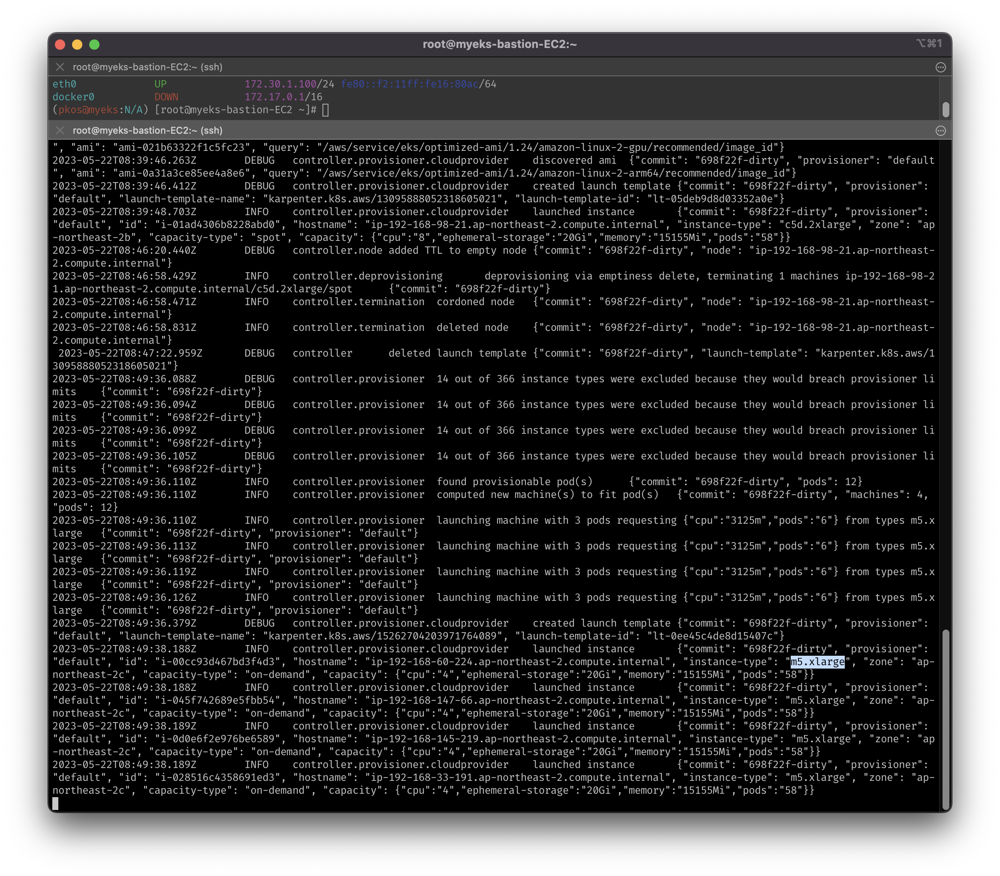

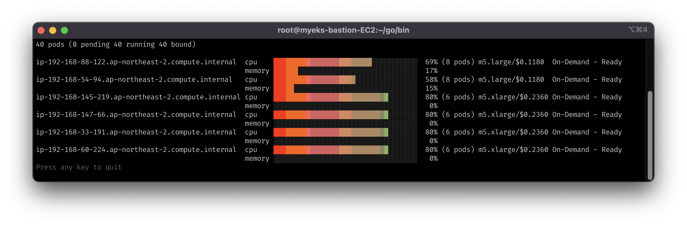

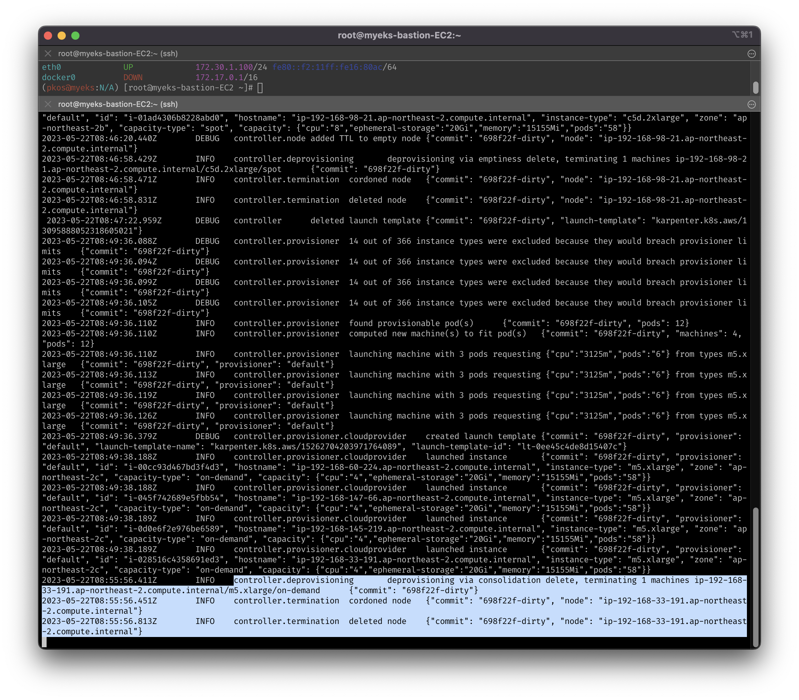

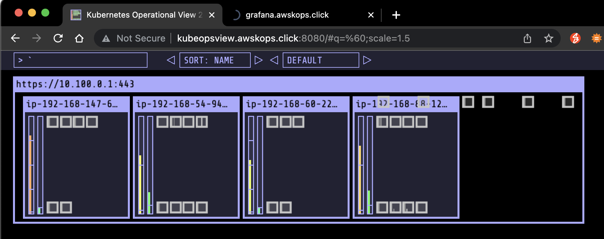

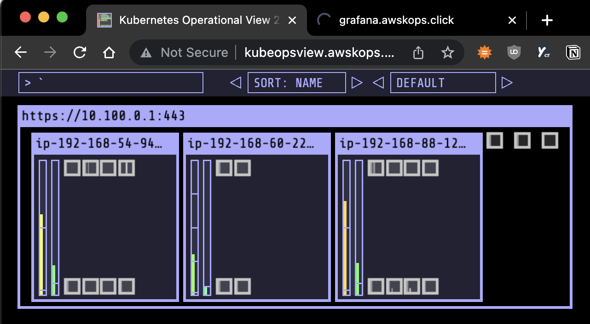

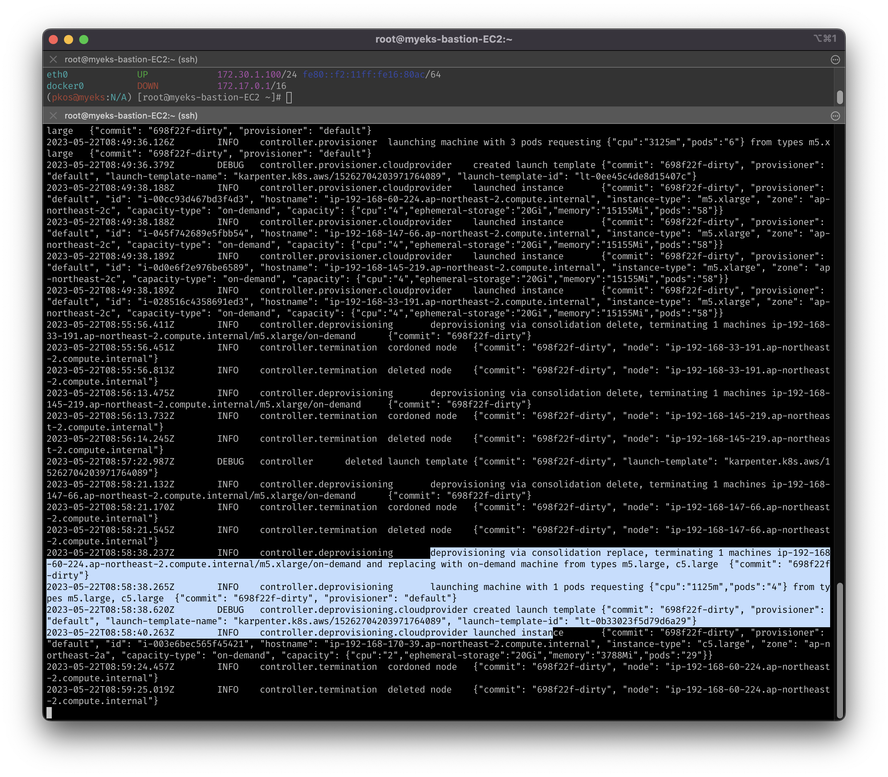
