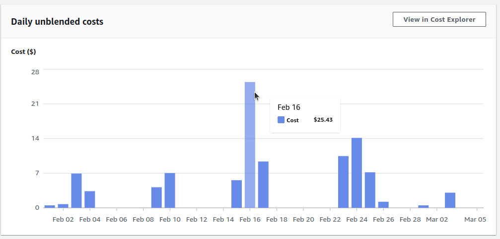
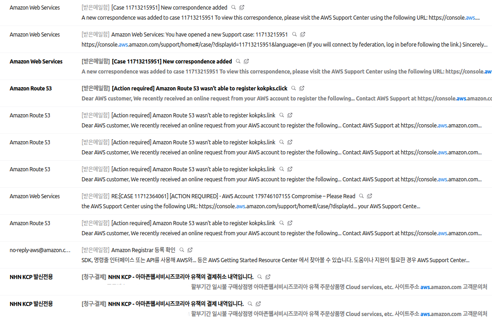
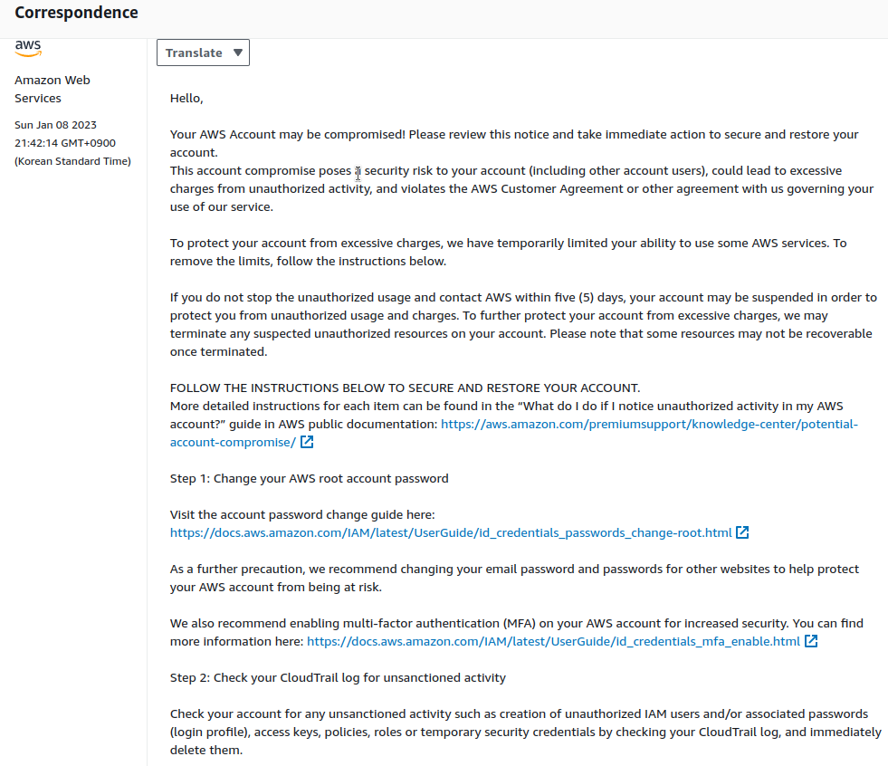
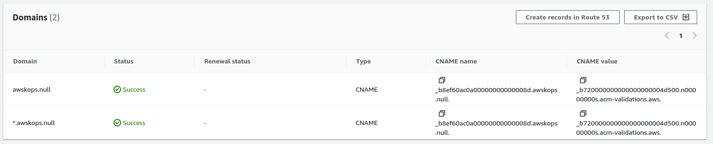
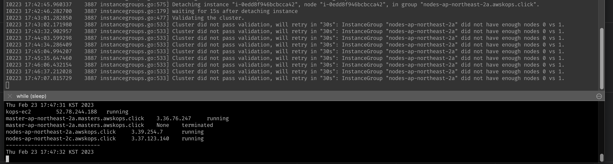
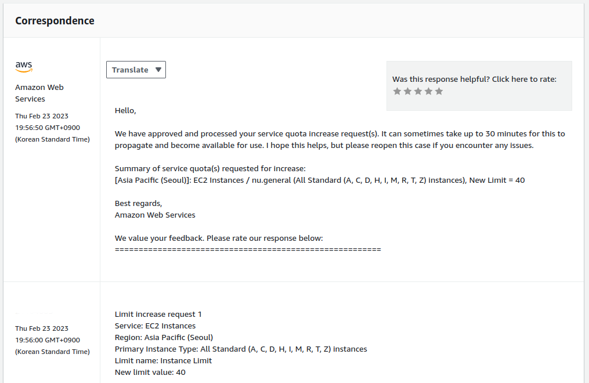

최근 [CloudNet@](https://www.notion.so/gasidaseo/CloudNet-Blog-c9dfa44a27ff431dafdd2edacc8a1863)에서 진행하고 있는 Production Kubernetes Online Study(이하, PKOS)도 마지막 주차가 끝났습니다.  
남은 계획은 4월부터 시작되는 휴식기간(a.k.a. 계약만료 후)중 복습 겸, 포스팅을 해보는 것입니다.  

오늘은 아래와 같이 실패를 거듭하여 추가로 알게된 소소한 트러블슈팅을 정리해보려고 합니다.  


(물론, 새벽에 겨우겨우 주차별 과제 제출하고 기절하는 바람에, 맛점하다 깨닫고 소스라치게 휴대폰으로 수동 삭제한게 비용의 주 요인이긴 하네요;)

불필요한 Try & Fail을 줄이고, 즐거운 k8s 학습되시기 바랍니다.

## 0. AWS 계정 잠금 해제

### 상황

- 처음 1주차 안내가 끝나고 Route53 Hostname을 구매하려고 하니, 자꾸 결제가 실패하는 문제가 발생했습니다.  
- kops 및 실습에서 주로 사용한 DNS가 CoreDNS였기 때문에, 이쪽에서 공수를 줄이기 위해 추가로 도메인을 구매하려 했으나 여러번 실패하였습니다.  
- 다만, 기존에 타 DNS 서비스를 사용하고 있다면, 해당 제공사에서 제공하는 Domain transfer registrar를 통해 Route53으로 이전할 수 있습니다.  
  저는 icann 90일 제한이 풀리자마자, 구입했던 제공사에서 타 제공사로 옮긴지 얼마 안된 도메인이라서, 새로 구매해야 했습니다.  

  

### 원인

- AWS는 친절하게도 [compromised](https://www.merriam-webster.com/dictionary/compromised) account에 대한 알림을 보내줍니다.
- 작년에 개설한 free-tier 계정의 암호도 잊어서 재설정하고, 도메인 결제를 위해 카드 변경까지 하였는데, 이로 인해 AWS 측에서 이상탐지를 하여 계정 잠금을 걸었던 것입니다.
- 개인적으로는 이미 Virtual MFA도 걸어놓았었기 때문에, 많이 민감하다고 생각은 하지만 IAM User 접속도 아니고 Root 접속이라 민감하게 반응한 것처럼 보입니다.

  

### 해결

- 자동 생성된 케이스를 끝까지 제대로 읽어보니, 마지막에 이 부분이 있습니다.

  ```msg
  Step 4: [IMPORTANT] You must respond to the existing Support Case or create a new one to confirm completion of the steps above in order to restore access to your account, prevent suspension, and apply for a billing adjustment, if applicable. 

  While logged in to your account, access the Support Center and reply to the existing Support Case to confirm completion of steps 1-3. If you cannot find an existing Support Case, please create a new one by going here: https://console.aws.amazon.com/support/home?#/  
  ```

- 즉, AWS 측에서 자동으로 생성한 케이스에 대한 답변을 해주어야 계정 잠금이 해제되는 것입니다.
- 저는 해당 부분을 바로 인지를 못했기 때문에, 새로운 케이스를 열어서 계정 해제를 요청하는 방법을 택했습니다.
  - 아마존 직구하면서, 파손품에 대한 문의를 할 때처럼 채팅을 통해 문의를 해도 해결이 가능했습니다.
  - 본인을 확인하는 기본적인 스핑크스-like 질문들에 대해 답변을 하면, 진행이 가능합니다.
    - 주어진 질문은 간단하니 직접... 해보시면 압니다(?)
  - 다만, 처음 해본것이라서 새벽 02시와 오전 11시에 두 번 채팅하여 해결했습니다.  
    서비스팀이 검토하는 시간이 있었던 것 같네요.

  ```msg
  05:10:03 PM Unknown0: Hello, my name is Unknown0 and I am here to assist you today. While I review your case details, would you please share your name with me?
  05:10:17 PM Customer: Hi, my name is Lorem Ipsum
  05:11:21 PM Unknown0: I see that your account is compromised
  05:11:43 PM Unknown0: A case 11712364061 was sent to you but you did not respond
  05:11:51 PM Unknown0: Your account needs to be secured
  05:12:11 PM Customer: Oh, I see. How can I respond about it?
  05:12:17 PM Unknown0: I will transfer your case to the team that will beable to assist you to get the account secured
  05:13:34 PM Customer: Okay... How much time I have to take?
  05:15:08 PM Unknown0: You can initiate another chat after 10 minutes
  05:15:19 PM Customer: A case 11712364061... I just forgot my password so... I close the case as solved. // Aha.
  05:15:38 PM Unknown0: Just need to put in some notes before i can transfer the case to the team
  ```

  ```msg
  02:18:52 AM Unknown1: The service team had placed restrictions on your account as the system detected unauthorized activity, and after a discussion with we requested for additional information, the service team reviewed your account and the information you had provided, and confirmed that your account has not been compromised and does not indicate a risk of compromise.
  ```

- 이후에, 정상적으로 도메인 구매가 가능했습니다.

## 2. Route53 도메인과 ACM

### 상황

- 다른 DNS 제공회사에서도 물론 고유의 편의기능을 제공하겠지만, AWS도 ACM을 통해 SSL 인증서를 발급받을 수 있습니다.  
  다만, AWS에서 ACM을 처음 다뤄봐서 마리오/테트리스 등 테스트 게임 어플리케이션을 위한 서브도메인에는 정상적으로 적용되지 않았습니다.
- (예시)  
  - <https://awskops.null/> 에 접속할 경우, 정상적으로 SSL 적용 확인
  - <https://subdomain.awskops.null/> 에 접속할 경우, SSL 적용이 **안됨**

### 원인

- ACM을 통해 발급받은 인증서를 Route53에 등록할 때 서브도메인에 대한 값도 설정해야 하는데,  
  이를 설정하지 않아 발생한 문제였습니다.

### 해결

- 아래와 같이, 서브도메인도 허용을 하면 됩니다. 스터디용이었기 때문에 모든 서브도메인에 대해 허용하였습니다.

  

- 다만, 처음에 적용한 인증서는 서브도메인 추가가 어렵습니다. 저는 아래와 같은 스텝으로 진행하였습니다.
  1. ACM에서 서브도메인도 포함하는 인증서를 새로 발급.
  2. Route53 CNAME에서 기존 인증서 정보를 지우고, 새로 발급받은 인증서 정보를 등록.
  3. ACM에서 기존 인증서를 삭제.

## 3. kops cluster 생성 실패 후 수동 삭제

### 상황

- cloudformation stack을 생성하여 kops cluster 구성 시, 흔한 유저에러로 이를 삭제를 해야하는 상황이 생깁니다. 예를 들면....
  - key pairs에는 등록을 하였으나, 현재 사용 중인 단말기에는 해당 키가 없는 경우 (ssh 접속 실패)
  - ssh 접속에 실패하면, 아래와 같은 클러스터 삭제 스크립트를 실행하지 못하기 때문에 웹 콘솔에서 작업을 해야합니다.

  ```script
  kops delete cluster --yes && aws cloudformation delete-stack --stack-name mykops
  ```

- 웹 콘솔로 하다보면, 분명 cloudfomation stack을 삭제하였는데, EC2 인스턴스를 아무리 지워도 지워지지 않는 그런 기현상이 일어납니다.

### 원인

- (추정) 스터디를 하면서 활용했던 cloudformation stack 구성 파일에서 생성을 하는 것으로 보입니다.
  - 복습하면서 한번 더 살펴보겠지만... kops 파라미터에서  
  `--master-size`, `--node-size`, `--node-count` 등을 지정하기 때문에  
  이를 ASG에 반영하는 것으로 보입니다.
- [Docs](https://kops.sigs.k8s.io/getting_started/aws/#create-cluster-configuration)에서도 그렇다고 하네요.

### 해결

- 관성에 따라, 웹 콘솔 하나씩 클릭해보면서 아래 4가지 먼저 해보았습니다.
  - 자동 생성되면, 당연히 ASG에 의해 관리되는 것이니, 이를 지우면 되겠거니 하고 삭제
  - 이후에 EC2 인스턴스를 지우면, 재생성되지 않음을 확인
  - S3에 파일이 남아있을테니 삭제
  - DNS를 통해 대시보드나 어플리케이션 Route53에 남아있는 kops 관련 A레코드 삭제

- 각잡고 k8s를 건들어본 적이 없었던지라 첫 주차부터 허둥지둥 헤메었는데,  
  이미 가시다님이 가이드에 써두셨었던 걸 제가 못찾았었습니다. 아래와 같이 진행하면 됩니다.

  ```guide
  1. EC2 Auto Scaling 그룹 : 3개 삭제
  2. EC2 시작 템플릿 Launch Templates : 3개 삭제
  3. S3 버킷 비우기
  4. Route53 에 추가된 A 레코드 3개 삭제
  5. CloudFormation 삭제
  ```

## 4. kops 롤링 업데이트가 무한정 진행되는 현상

### 상황

- 알려주신 방법대로 `kops edit $(TARGET)` 이후, 롤링 업데이트를 했는데 예상 시간보다 2~3배 지나도 완료가 되지 않았습니다.
- `kops update cluster --yes && echo && sleep 3 && kops rolling-update cluster --yes`
- 제 경우에는 설정 값에서 정의된 노드 수 만큼 생성이 되지 않는 현상이었습니다.  

  

### 원인

- 이는 김예준(a.k.a. 동막골)님께서 해결방법을 공유해주셨는데, 기본 인스턴스 쿼타에 도달해서 일어난 것이라고 합니다.
- 쿼타 문제라는 사실 자체를 몰랐으면, 아마 중간에 탈락했었을 것 같았는데, 이어질 `해결`방법을 공유받아서, 해당 주차 과제를 할 수 있었습니다. 감사합니다.

### 해결

- [AWS support](https://support.console.aws.amazon.com/support/home#/case/create?issueType=service-limit-increase&limitType=service-code-ec2-instances&serviceLimitIncreaseType=ec2-instances&type=service_limit_increase)에서 증설을 요청하면 됩니다.
- 서울 리전 / All Standard Instance Types / 40개로 증설을 요청하였습니다.

  

- 공유해주신 내용대로, 자동으로 응답 및 적용이 이루어지고 아무리 늦어도 30분 내로 완료되는 것 같습니다.
  - 실제로는 메일 받자마자, 롤링 업데이트 끄고 켰더니 정상적으로 잘 적용되었습니다.
- 아쉽게도 요청했던 해당 쿼타는 웹 콘솔에서 따로 확인하는 방법은 찾지 못했습니다.

## reference

- [CloudNet@](https://www.notion.so/gasidaseo/CloudNet-Blog-c9dfa44a27ff431dafdd2edacc8a1863) Notion 및 Slack 채널
- [kops Docs](https://kops.sigs.k8s.io/getting_started/aws/#create-cluster-configuration)
