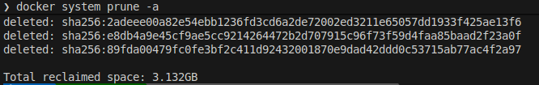
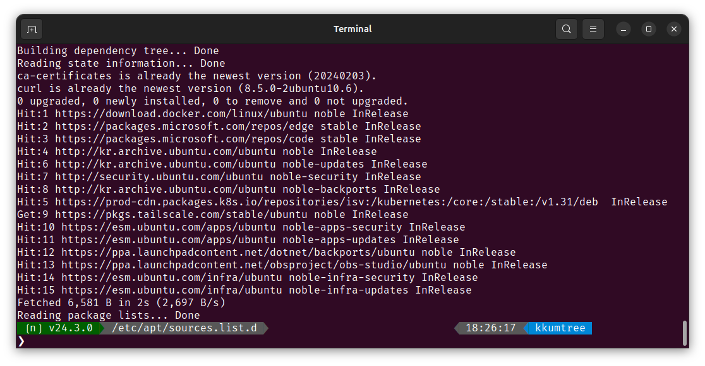

> Docker 사용을 위한 기본적인 설치 방법 메모

- [Install Docker Engine on Ubuntu | Docker Documentation](https://docs.docker.com/engine/install/ubuntu/)

## 0. 이전 버전 제거 (선택)

- 진행 중인 Docker 관련 작업이 없어, prune 명령어를 통해 기존 Docker의 리소스들을 삭제 진행하였습니다. 

```bash
docker system prune -a
```



- 공식 문서에 따라, 아래 커맨드로 삭제를 진행합니다.
  (겸사겸사 `autoremove`도 진행합니다.)

```bash
for pkg in docker.io docker-doc docker-compose docker-compose-v2 podman-docker containerd runc; do sudo apt-get remove $pkg; done
sudo apt-get autoremove
```

```bash
# ❯ for pkg in docker.io docker-doc docker-compose docker-compose-v2 podman-docker containerd runc; do sudo apt-get remove $pkg; done
# [sudo] password for kkumtree: 
# Reading package lists... Done
# Building dependency tree... Done
# Reading state information... Done
# The following packages were automatically installed and are no longer required:
#   bridge-utils containerd pigz runc ubuntu-fan
# Use 'sudo apt autoremove' to remove them.
# The following packages will be REMOVED:
#   docker.io
# 0 upgraded, 0 newly installed, 1 to remove and 0 not upgraded.
# After this operation, 126 MB disk space will be freed.
# Do you want to continue? [Y/n] Y
# (Reading database ... 465886 files and directories currently installed.)
# Removing docker.io (27.5.1-0ubuntu3~24.04.2) ...
# '/usr/share/docker.io/contrib/nuke-graph-directory.sh' -> '/var/lib/docker/nuke-graph-directory.sh'
# Stopping 'docker.service', but its triggering units are still active:
# docker.socket
# Processing triggers for man-db (2.12.0-4build2) ...
# (...)
# Removing containerd (1.7.28-0ubuntu1~24.04.1) ...
# Processing triggers for man-db (2.12.0-4build2) ...
# Reading package lists... Done
# Building dependency tree... Done
# Reading state information... Done
# The following packages were automatically installed and are no longer required:
#   bridge-utils pigz ubuntu-fan
# Use 'sudo apt autoremove' to remove them.
# The following packages will be REMOVED:
#   runc
# 0 upgraded, 0 newly installed, 1 to remove and 0 not upgraded.
# After this operation, 34.3 MB disk space will be freed.
# Do you want to continue? [Y/n] Y
# (Reading database ... 465640 files and directories currently installed.)
# Removing runc (1.3.0-0ubuntu2~24.04.1) ...
# Processing triggers for man-db (2.12.0-4build2) ...
```

```bash
# ❯ sudo apt-get autoremove
# Reading package lists... Done
# Building dependency tree... Done
# Reading state information... Done
# The following packages will be REMOVED:
#   bridge-utils pigz ubuntu-fan
# 0 upgraded, 0 newly installed, 3 to remove and 0 not upgraded.
# After this operation, 421 kB disk space will be freed.
# Do you want to continue? [Y/n] Y
# (Reading database ... 465612 files and directories currently installed.)
# Removing ubuntu-fan (0.12.16+24.04.1) ...
# ubuntu-fan: removing default /etc/network/fan configuration
# Removing bridge-utils (1.7.1-1ubuntu2) ...
# Removing pigz (2.8-1) ...
# Processing triggers for man-db (2.12.0-4build2) ...
```

## 1. Docker 공식 GPG key와 APT 레포지토리 추가  

```bash
# Add Docker's official GPG key:
sudo apt-get update
sudo apt-get install ca-certificates curl
sudo install -m 0755 -d /etc/apt/keyrings
sudo curl -fsSL https://download.docker.com/linux/ubuntu/gpg -o /etc/apt/keyrings/docker.asc
sudo chmod a+r /etc/apt/keyrings/docker.asc

# Add the repository to Apt sources:
echo \
  "deb [arch=$(dpkg --print-architecture) signed-by=/etc/apt/keyrings/docker.asc] https://download.docker.com/linux/ubuntu \
  $(. /etc/os-release && echo "${UBUNTU_CODENAME:-$VERSION_CODENAME}") stable" | \
  sudo tee /etc/apt/sources.list.d/docker.list > /dev/null
sudo apt-get update
```



## 2. Docker 패키지를 설치합니다  

### (1) 최신 버전

```bash
sudo apt-get install docker-ce docker-ce-cli containerd.io docker-buildx-plugin docker-compose-plugin
```

### (2) 특정 버전

- APT repository에서 받을 수 있는 버전을 조회합니다. 

```bash
# List the available versions:
apt-cache madison docker-ce | awk '{ print $3 }'
```

```bash
# ❯ apt-cache madison docker-ce | awk '{ print $3 }'
# 5:28.5.1-1~ubuntu.24.04~noble
# 5:28.5.0-1~ubuntu.24.04~noble
# 5:28.4.0-1~ubuntu.24.04~noble
# 5:28.3.3-1~ubuntu.24.04~noble
# 5:28.3.2-1~ubuntu.24.04~noble
# 5:28.3.1-1~ubuntu.24.04~noble
# 5:28.3.0-1~ubuntu.24.04~noble
# (...)
```

- 이후, 원하는 버전을 환경변수로 설정하여 설치합니다. 

```bash
VERSION_STRING=5:28.5.1-1~ubuntu.24.04~noble
sudo apt-get install docker-ce=$VERSION_STRING docker-ce-cli=$VERSION_STRING containerd.io docker-buildx-plugin docker-compose-plugin
```

## 3. 권한 상승 설정 (선택) 

> docker 그룹은 사용자에게 루트 수준의 권한을 부여합니다.
> <https://docs.docker.com/engine/security/#docker-daemon-attack-surface>

```bash
sudo groupadd docker
sudo usermod -aG docker $USER
```

- 로그아웃, 혹은 새로운 터미널에서 접속합니다. 
  혹은 아래 커맨드로 그룹을 활성화할 수 있습니다.

```bash
newgrp docker
```

## 9. WARNING: Error loading config file (Troubleshooting)

```bash
# WARNING: Error loading config file: /home/user/.docker/config.json -
# stat /home/user/.docker/config.json: permission denied
```

- 이 오류는 `sudo` 명령을 이전에 사용했기 때문에 `~/.docker/` 디렉터리에 대한 권한 설정이 잘못되었음을 나타냅니다. 

1. `~/.docker/` 디렉터리를 제거하거나(자동 생성되지만, 사용자 지정 설정은 삭제됩니다.) 
2. 아래와 같이, 소유권 및 권한을 변경합니다.

```bash
sudo chown "$USER":"$USER" /home/"$USER"/.docker -R
sudo chmod g+rwx "$HOME/.docker" -R
```

## Reference

- [Ubuntu | Docker Docs](https://docs.docker.com/engine/install/ubuntu/)
- [Manage Docker as a non-root user | Docker Docs](https://docs.docker.com/engine/install/linux-postinstall/#manage-docker-as-a-non-root-user)