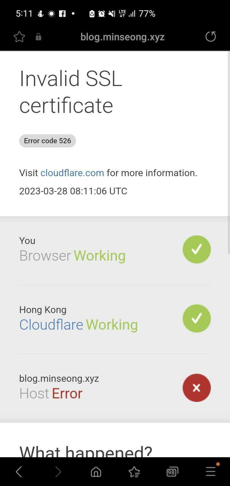
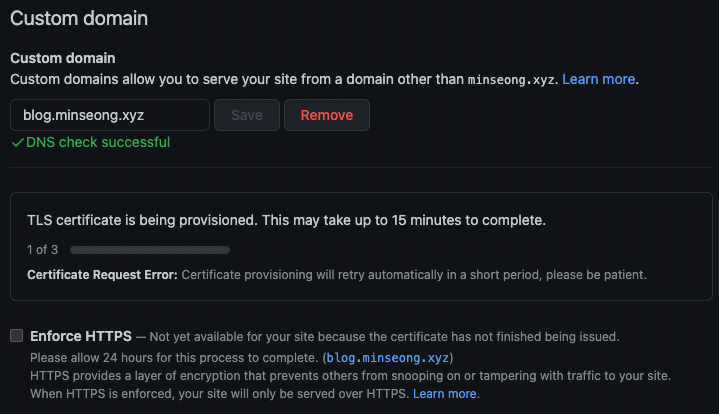
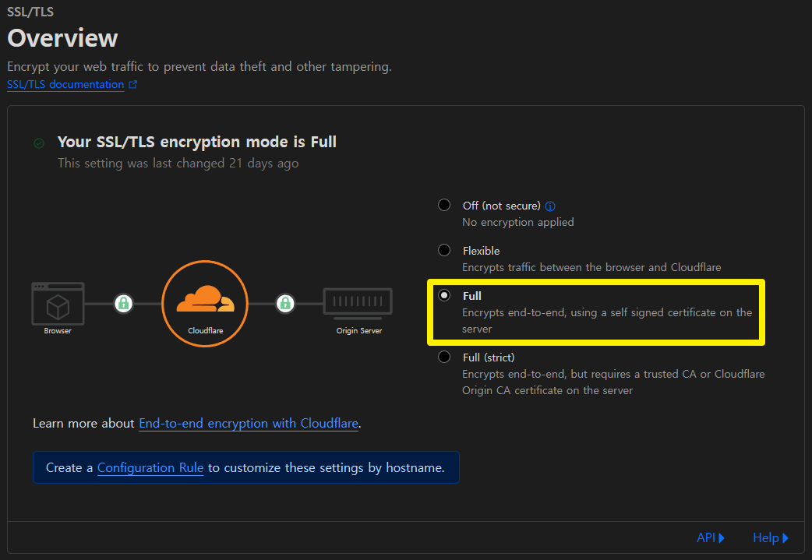
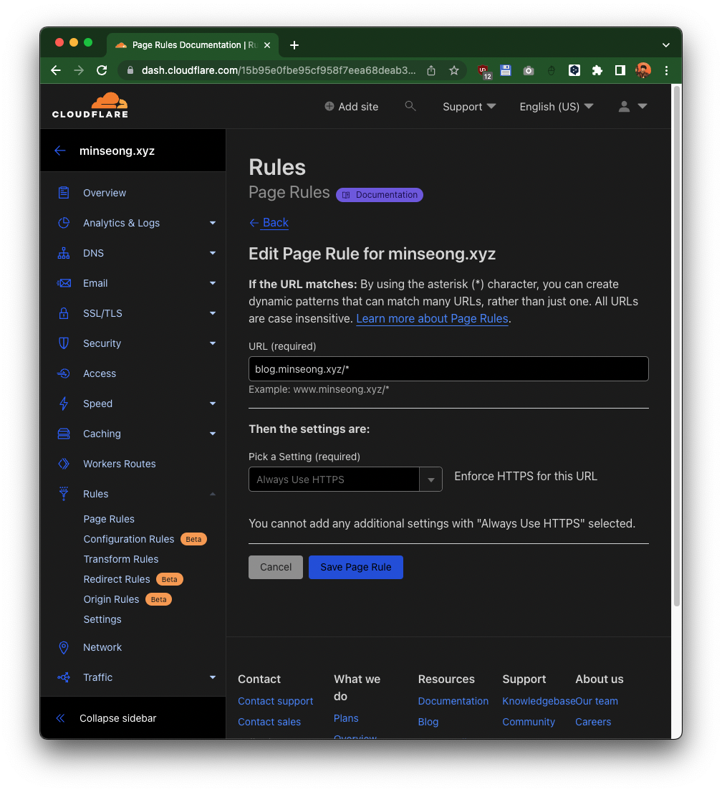

```brief
`gh-pages & Cloudflare DNS` 를 쓰고자 한다면, 
Cloudflare에서 SSL/TLS 정책을 `Full (Strict)` 대신 
`Full`로 하는 쪽이 관리 요소를 줄일 수 있다. 
```

## Invalid SSL certificate

  

그간 업무 인계도 있었고, 개인 일정을 소화하면서 블로그 들어갈 일이 없었다.  
그러다 지난 주말에 있었던 [정기총회](https://discourse.ubuntu-kr.org/t/topic/48634)에서 만난 분으로부터  
블로그에 안 들어가진다는 말을 듣고, 그제서야 인지하게 되었다.  
대체 언제부터 이랬던걸까?  

GitHub Pages에서 블로그 관리를 하고있었고,  
Cloudflare로 Domain Registrar를 이전한 후에  
블로그를 올렸기 때문에 한동안 신경을 안 써도 잘 썼는데.  

## 원인 파악

크게 두 가지였다. 하나는 기존 인증서의 만료, 또 하나는 Cloudflare의 TLS/SSL 설정이다.

### 인증서 만료

지금은 확인하기 좀 번거로운데, 기존에 사용한 인증서가 만료된 것으로 추정된다.  
세어보니 6개월이 살짝 지났기에 최소 2주 가량 사이트가 작동을 안한 것 같다.  
GitHub pages에서 기본적으로 Let's Encrypt를 통해서 TLS를 제공하는데 종종 생성이 안되었고,  
실제로도 설정 페이지에서 발급에 에러가 발생하고 있었다.  



### Cloudflare의 SSL/TLS 설정

Cloudflare에서 SSL/TLS 설정을 해놓고, Github Pages에서도 SSL을 켜놓았었다.  
기존에는 인증서가 있었으니 Cloudflare 정책보다는 다른 정책이 우선시 되었었는데,  
인증서가 만료되면서 Cloudflare의 정책이 적용되었다.  
Cloudflare에서의 SSL/TLS의 설정 중 제일 높은 `Full(Strict)`를 사용하고 있었는데,  
내 서버에 trusted CA 인증서 혹은 Cloudflare에서 발행한 CA 인증서를 발급해놓던지 CA 인증서를 발급해두면 좋은 설정이다.  
물론 GitHub Pages에서는 앞서 말했듯이 자체서명 인증서 발급 이슈가 생기기도 하고,  
Cloudflare issued CA 인증서를 탑재하는 건 말이 안된다고 생각했다.  
GitHub의 TLS 지원만 생각하고 만들어놔서 오류가 발생하였다.  

## 에러 수정

에러 해결이라고 하긴 뭐하고, 수정이라고 하자.  
그냥 `Full(Strict)`를 `Full`로 바꿔주면 된다.  
이래도 아예 TLS를 쓰지 않는 것보다는 나을 것이다.  



아, 아래의 cloudflare blog를 참고하여 trouble shooting 하고자 한다면 Page Rules까지 관리하지 않아도 TLS가 제대로 적용된다.  
굳이 적용하고자 한다면, 아래와 유사하게 적용하면 된다.  



## reference

- [GitHub Community](https://github.com/orgs/community/discussions/22052)
- [Cloudflare Community](https://community.cloudflare.com/t/community-tip-fixing-error-526-invalid-ssl-certificates/44273)
- [Cloudflare Blog](https://blog.cloudflare.com/secure-and-fast-github-pages-with-cloudflare)
- [GitHub Docs](https://docs.github.com/en/pages/getting-started-with-github-pages/securing-your-github-pages-site-with-https#troubleshooting-certificate-provisioning-certificate-not-yet-created-error)
