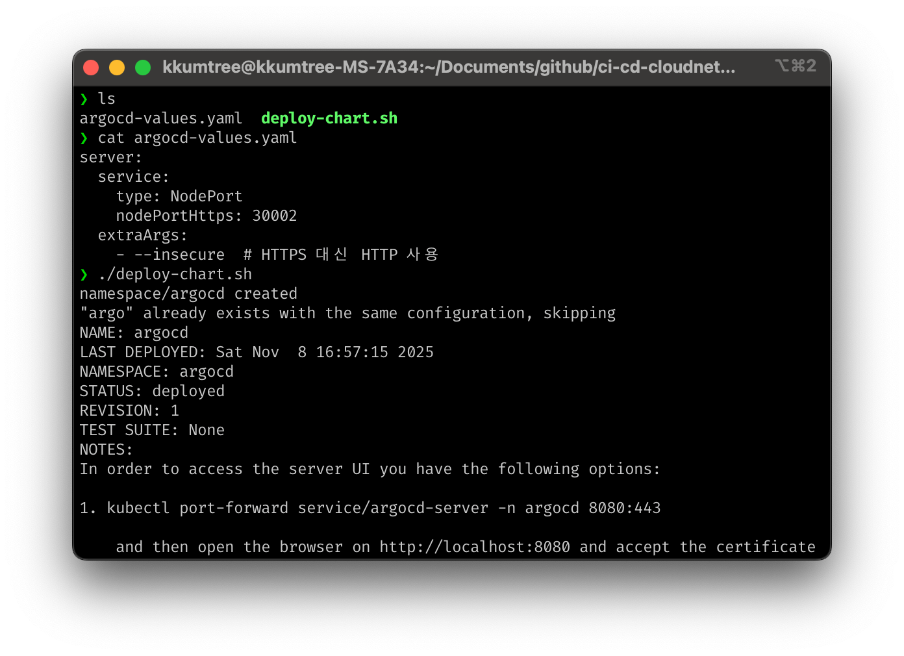
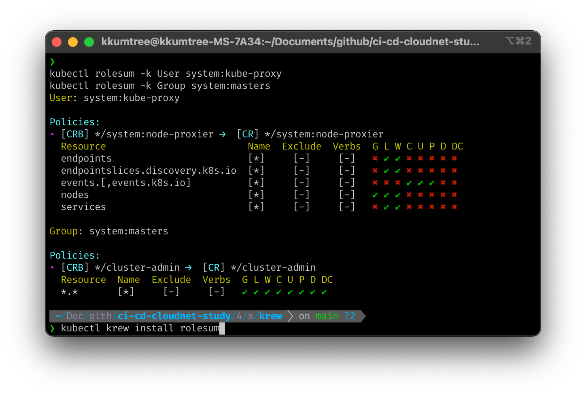

[CloudNet@](https://gasidaseo.notion.site/CloudNet-Blog-c9dfa44a27ff431dafdd2edacc8a1863)에서 진행하고 있는 CI/CD Study 4주차에는 ArgoCD를 다루기 시작했습니다.  

Kubernetes(이하, k8s) 상에서 ArgoCD는 Controller보다는 Operator에 가까운 포지션을 갖는다고 하여,  
이번 기회에 실습을 하면서 체감을 하는 것에 목적을 두었습니다.  

- Controller: live state(실제 상태)와 desired state(원하는 상태)가 일치하는지 관찰 및 지속적 조정  
- Operator: Controller가 k8s 내부 object에서 동작한다면, Operator는 k8s 외의 것들도 다룰 수 있음  

> 해당 구성들은 아래 GitHub에 탑재되어 있습니다.  
> <https://github.com/kkumtree/ci-cd-cloudnet-study> 의 4w 폴더  

## 0. 실습 준비  

이전 게시물, [Jenkins, git and kubernetes](../jenkins-ci-cd-kubernetes/)의 kind 및 kube-ops-view 설정과 동일하여 생략합니다.  

- 실습 코드: [PacktPublishing/ArgoCD-in-Practice](https://github.com/PacktPublishing/ArgoCD-in-Practice)  

## 1. 명령형/선언형 방식  

- 명령형(imperative): 절차적 방식, 명령어를 순서대로 적용.  
  k8s에서는 kubectl `create`/`replace`  
- 선언형(declarative): 파일을 통해 생성하고, 수정 후 업데이트/동기화.  
  k8s에서는 kubectl `apply` (신규/수정 동일)  

Packt 출판사의 실습코드를 통해 기본적인 동작을 살펴봅니다.  

```bash  
# ArgoCD-in-Practice/ch01/basic-gitops-operator  
cd ch01  
tree basic-gitops-operator-config # 배포할 manifest 파일  
tree basic-gitops-operator # tmp 폴더를 생성하고, 클러스터에 적용할 manifest을 관리  
basic-gitops-operator  
go run main.go  
```

main.go 파일은 tmp 폴더를 생성하고, 5초 주기로 해당 매니페스트를 동기화하는 소스코드임을 확인했습니다.  

- 첫번째 루프에서는 nginx 배포를 위한 namespace(이하, NS)랑 deployment를 동시에 생성 시도하였으나, 해당 ns가 생성완료 되기도 전에 선언된 deployment를 생성하려다 실패.  
- 5초 후 두번째 루프에서는 이전 루프에서 실패한 deployment를 마저 배포 성송.  
- 이후에도 연속적으로 5초 마다 상태를 동기화를 시도하는 것을 볼 수 있었습니다.  

  

아래 커맨드로 nginx deployment를 삭제하였어도,  
오퍼레이터는 5초 후에 매니페스트와 비교하여 재배포하는 것을 확인할 수 있었습니다. `deployment.apps/nginx created`  


```bash
# 새로운 터미널에서  
kubectl get deployment,pod -n nginx
kubectl delete deployment nginx -n nginx
kubectl get deployment,pod -n nginx # 재배포된 것을 확인 
```  


이후 환경 정리를 위해, 오퍼레이터 코드를 중단하고 해당 NS를 삭제합니다.  

```bash
kubectl delete ns nginx
# namespace "nginx" deleted
```

## 2. ArgoCD

ArgoCD는 k8s 환경에서 GitOps 방식의 배포를 위한 도구들 중 하나입니다.  

Git repository 내에, 앞서 알아보았던 [Helm 101](../helm-hello-world/) 게시물에서 다뤘던 Helm 차트 등의 템플릿을  
k8s yaml 매니페스트로 변환하여 배포하는 도구로 정리될 수 있습니다.  

더불어, 앞서 명령형/선언형 방식에서 살펴본 오퍼레이터와 같이, `kubectl apply` 즉, 선언전 도구라는 점도 참고하면 좋습니다.  

### (1) Multi-Cluster 사용 시  

kind를 배포하면, ~/.kube/config 파일에 단일 클러스터 정보를 얻고 관리할 수 있듯이  
각 k8s 클러스터는 고유한 토큰을 통해 접근, 관리할 수 있기 때문에, ArgoCD 가 설치된 Cluster 외의 다른 Cluster에 접근할 권한을 얻어야합니다.  

```bash
# e.g. 
apiVersion: v1
kind: Secret
metadata:
  name: cluster-credentials-dev
  namespace: argocd
  labels:
    argocd.argoproj.io/secret-type: cluster             # Label 설정에 유의  
stringData:
  name: dev-cluster                                     # Argo CD 내에서 표시될 클러스터 이름
  server: https://123.45.67.89:6443                     # 대상 클러스터의 API 서버 주소         
  config: |                                             # JSON 형태의 kubeconfig 일부. Argo CD가 인증에 사용
    {
      "bearerToken": "eyJhbGciOiJSUzI1NiIsImtpZCI6...", # 대상 클러스터의 ServiceAccount로부터 추출한 토큰
      "tlsClientConfig": {
        "insecure": false,                              # true일 경우 TLS 검증 비활성화 (개발용)
        "caData": "LS0tLS1CRUdJTiBDRVJUSUZJQ0FURS0t..." # 클러스터 CA 인증서 (Base64 인코딩된 값)
      }
    }
```  

이는 위의 YAML 형태외에도 CLI 명령어로도 가능합니다.  

```bash
argocd cluster add <CONTEXT_NAME> --name <CLUSTER_ALIAS>
```

### (2) ArgoCD Helm Chart 설치  

Helm Chart의 일반적인 배포방식이며, 아래와 같습니다.  

1. ArgoCD를 배포할 네임스페이스 생성  
2. 각 Kubernetes 환경에 맞는 values.yaml 파일 작성  
3. 배포 후 확인  

> 파일은 아래 경로에 있습니다.  
> 해당 구성들은 `4w/shells/argocd` 폴더에 탑재되어 있습니다.  

```bash
# pwd
# # /home/kkumtree/Documents/github/ci-cd-cloudnet-study/4w/shells/argocd
# ls
# # argocd-values.yaml  deploy-chart.sh
./deploy-chart.sh  
```



각 구성요소를 확인해보겠습니다.  

```bash
kubectl get pod,svc,ep,secret,cm -n argocd  
kubectl get crd | grep argo
kubectl get appproject -n argocd -o yaml
kubectl get sa -n argocd
```  


권한도 보겠습니다.  

> 아래 커맨드를 위해서 krew 플러그인 매니저가 설치되어 있어야 합니다.  
> `4w/shells/krew/install-krew-bash-zsh.sh` 스크립트로 설치할 수 있습니다.  

```bash
# kubectl krew install rolesum  
kubectl rolesum -k User system:kube-proxy  
kubectl rolesum -k Group system:masters    
```  

  

