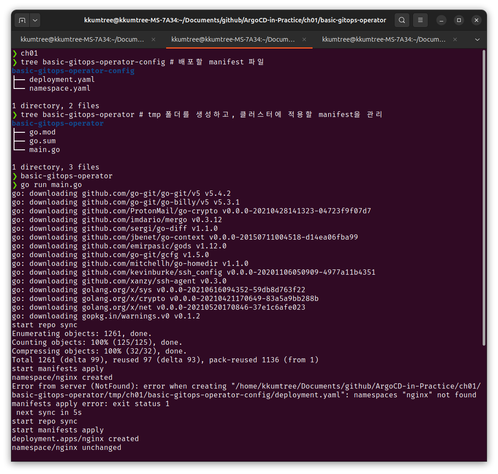

[CloudNet@](https://gasidaseo.notion.site/CloudNet-Blog-c9dfa44a27ff431dafdd2edacc8a1863)에서 진행하고 있는 CI/CD Study 4주차에는 ArgoCD를 다루기 시작했습니다.  

Kubernetes(이하, k8s) 상에서 ArgoCD는 Controller보다는 Operator에 가까운 포지션을 갖는다고 하여,  
이번 기회에 실습을 하면서 체감을 하는 것에 목적을 두었습니다.  

- Controller: live state(실제 상태)와 desired state(원하는 상태)가 일치하는지 관찰 및 지속적 조정  
- Operator: Controller가 k8s 내부 object에서 동작한다면, Operator는 k8s 외의 것들도 다룰 수 있음  

## 0. 실습 준비  

이전 게시물, [Jenkins, git and kubernetes](../jenkins-ci-cd-kubernetes/)의 kind 및 kube-ops-view 설정과 동일하여 생략합니다.  

- 실습 코드: [PacktPublishing/ArgoCD-in-Practice](https://github.com/PacktPublishing/ArgoCD-in-Practice)  

## 1. 명령형/선언형 방식  

- 명령형(imperative): 절차적 방식, 명령어를 순서대로 적용.  
  k8s에서는 kubectl `create`/`replace`  
- 선언형(declarative): 파일을 통해 생성하고, 수정 후 업데이트/동기화.  
  k8s에서는 kubectl `apply` (신규/수정 동일)  

Packt 출판사의 실습코드를 통해 기본적인 동작을 살펴봅니다.  

```bash  
# ArgoCD-in-Practice/ch01/basic-gitops-operator  
cd ch01  
tree basic-gitops-operator-config # 배포할 manifest 파일  
tree basic-gitops-operator # tmp 폴더를 생성하고, 클러스터에 적용할 manifest을 관리  
basic-gitops-operator  
go run main.go  
```

main.go 파일은 tmp 폴더를 생성하고, 5초 주기로 해당 매니페스트를 동기화하는 소스코드임을 확인했습니다.  

- 첫번째 루프에서는 

  