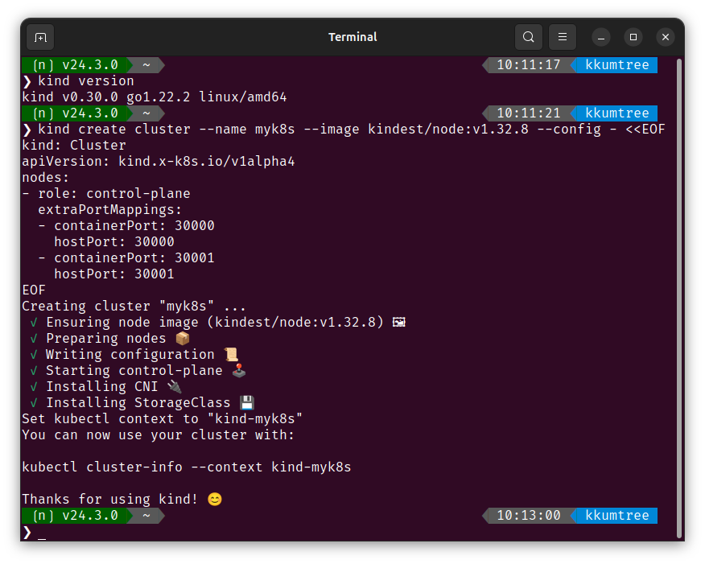
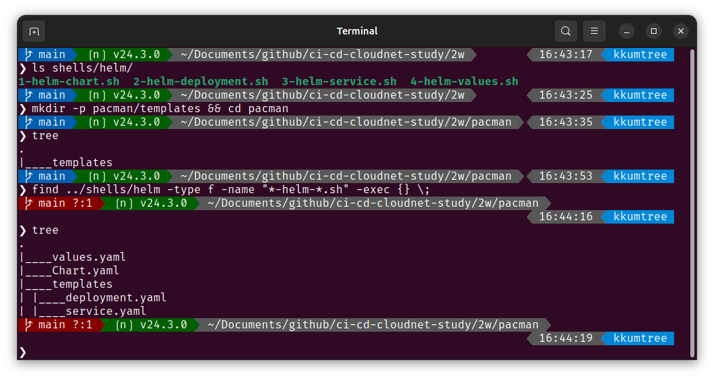

[CloudNet@](https://gasidaseo.notion.site/CloudNet-Blog-c9dfa44a27ff431dafdd2edacc8a1863)에서 진행하고 있는 CI/CD Study 2주차에는 Helm과 Tekton을 다뤘습니다.  

이번에는 Helm을 다루도록 하겠습니다.  

## 1. Helm의 역할과 실습 준비사항  

### Helm?  

템플릿 기반 솔루션. 즉, 버전 관리 및 공유, 배포가 가능한 아티팩트를 생성하도록 돕습니다.  

- Helm chart(차트)
  - 공유 가능한 Kubernetes(쿠버네티스, 이하 k8s) 패키지며, 차트 간 의존성 등 다양한 요소를 포함합니다.  
  - k8s를 다루면 Helm을 많이 사용하게 되는데, 그 이유 중 하나가 chart 개념입니다.  

- Rolling Update for ConfigMap
  - 애플리케이션의 설정값은 일반적으로 k8s의 ConfigMap에 대응되는 속성입니다.  
  - ConfigMap: 수정되어도 애플리케이션의 롤링 없데이트 전, 즉 애플리케이션을 수동 재시작 하기 전까지는 값이 적용되지 않습니다.  
    - Helm은 ConfigMap이 변경되면, 자동으로 Rolling Update가 이루어지는 기능들을 제공합니다.  

### 실습 준비  

> kind 설치의 경우 다음 포스트를 참고할 수 있습니다.  
> [리눅스에 KIND 설치하기 w/golang](../kans-2w-kind-installation-on-linux/)  
> Docs: <https://kind.sigs.k8s.io/>  

kind를 통해, 로컬 환경에 k8s를 배포해보겠습니다.  

```bash
kind create cluster --name myk8s --image kindest/node:v1.32.8 --config - <<EOF
kind: Cluster
apiVersion: kind.x-k8s.io/v1alpha4
nodes:
- role: control-plane
  extraPortMappings:
  - containerPort: 30000
    hostPort: 30000
  - containerPort: 30001
    hostPort: 30001
EOF
```  

  

## 2. Helm Project 101

아래의 구조를 갖습니다.  

- Chart.yaml: metadata
- templates: 설치와 관련된 모든 템플릿 파일
  - deployment.yaml
  - service.yaml
  - (..)
- values.yaml: chart default value  

아래와 같이 4개의 YAML파일을 생성해보겠습니다.  

> 해당 구성들은 아래 GitHub에 탑재되어 있습니다.  
> <https://github.com/kkumtree/ci-cd-cloudnet-study>  
> helm의 구성파일들은 `2w/pacman` 폴더에 있습니다.  



### (1) Chart.yaml  

> Helm chart의 메타데이터 정의
> <https://helm.sh/docs/topics/charts/#the-chartyaml-file>

```bash
# 2w/shells/helm/1-helm-chart.yaml
cat << EOF > Chart.yaml
apiVersion: v2
name: pacman
description: A Helm chart for Pacman
type: application
version: 0.1.0        
appVersion: "1.0.0"   
EOF
```  

- apiVersion: chart API 버전  
  - helm 2는 `V1`, helm 3는 `V2` 값을 갖습니다.  
- name: 차트에 대한 이름  
- version: 차트 에 대한 버전 (SemVer, 시맨틱 버전 규칙)  
  - <https://semver.org/lang/ko/>
- description: 차트에 대한 설명  
- type: 차트의 타입 (optional)  
  - `application`(기본값) 혹은 `library` 택 1.
  - `library`: 재사용 가능한 차트. 배포 되지 않는 일종의 템플릿.  
- appVersion: 
  - `version`과 독립적.  
  - 권장표기: "<APPLICATION_VERSION>"  
<!-- https://helm.sh/docs/topics/charts/#chart-types -->

### (2) templates/deployments.yaml  

> 

```bash
# 2w/shells/helm/2-helm-deployment.yaml
cat << EOF > templates/deployment.yaml
apiVersion: apps/v1
kind: Deployment
metadata:
  name: {{ .Chart.Name}}            
  labels:
    app.kubernetes.io/name: {{ .Chart.Name}}
    {{- if .Chart.AppVersion }}     
    app.kubernetes.io/version: {{ .Chart.AppVersion | quote }}
    {{- end }}
spec:
  replicas: {{ .Values.replicaCount }}     
  selector:
    matchLabels:
      app.kubernetes.io/name: {{ .Chart.Name}}
  template:
    metadata:
      labels:
        app.kubernetes.io/name: {{ .Chart.Name}}
    spec:
      containers:
        - image: "{{ .Values.image.repository }}:{{ .Values.image.tag | default .Chart.AppVersion}}"   
          imagePullPolicy: {{ .Values.image.pullPolicy }}
          securityContext:
            {{- toYaml .Values.securityContext | nindent 14 }} 
          name: {{ .Chart.Name}}
          ports:
            - containerPort: {{ .Values.image.containerPort }}
              name: http
              protocol: TCP
EOF
```


```bash
# 2w/shells/helm/3-helm-service.yaml
cat << EOF > templates/service.yaml
apiVersion: v1
kind: Service
metadata:
  labels:
    app.kubernetes.io/name: {{ .Chart.Name }}
  name: {{ .Chart.Name }}
spec:
  ports:
    - name: http
      port: {{ .Values.image.containerPort }}
      targetPort: {{ .Values.image.containerPort }}
  selector:
    app.kubernetes.io/name: {{ .Chart.Name }}
EOF
```

```bash
# 2w/shells/helm/4-values.yaml
cat << EOF > values.yaml
image:     
  repository: quay.io/gitops-cookbook/pacman-kikd
  tag: "1.0.0"
  pullPolicy: Always
  containerPort: 8080

replicaCount: 1
securityContext: {}     
EOF
```  

## 9. Chart API v1 -> v2 변화점 (Helm v2 to v3)

- A `dependencies` field defining chart dependencies, which were located in a separate `requirements.yaml` file for v1 charts.  
- The type field, discriminating application and library charts.  
