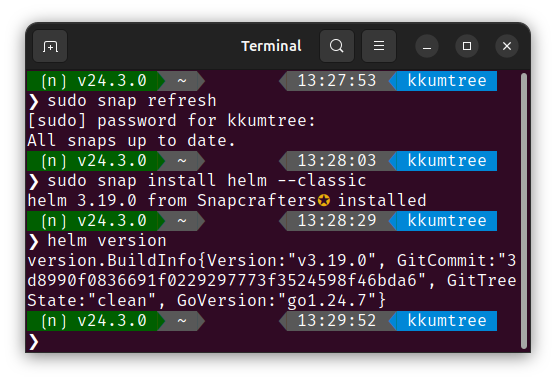
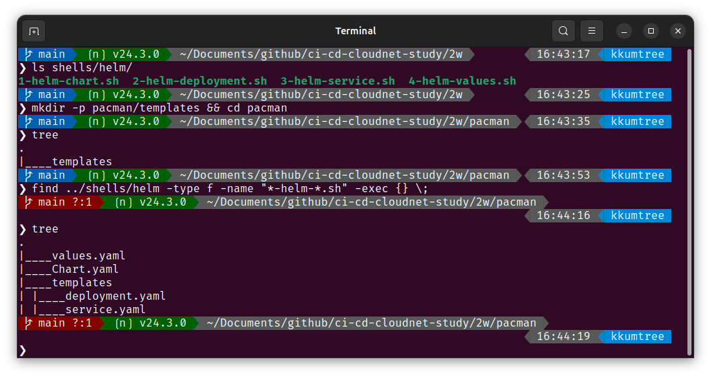

[CloudNet@](https://gasidaseo.notion.site/CloudNet-Blog-c9dfa44a27ff431dafdd2edacc8a1863)에서 진행하고 있는 CI/CD Study 2주차에는 Helm과 Tekton을 다뤘습니다.  

이번에는 Helm의 기본적인 부분을 다루도록 하겠습니다.  

## 1. Helm의 역할과 실습 준비사항  

### Helm?  

템플릿 기반 솔루션. 즉, 버전 관리 및 공유, 배포가 가능한 아티팩트를 생성하도록 돕습니다.  

- Helm chart(차트)
  - 공유 가능한 Kubernetes(쿠버네티스, 이하 k8s) 패키지며, 차트 간 의존성 등 다양한 요소를 포함합니다.  
  - k8s를 다루면 Helm을 많이 사용하게 되는데, 그 이유 중 하나가 chart 개념입니다.  

- Rolling Update for ConfigMap
  - 애플리케이션의 설정값은 일반적으로 k8s의 ConfigMap에 대응되는 속성입니다.  
  - ConfigMap: 수정되어도 애플리케이션의 롤링 업데이트 전, 즉 애플리케이션을 수동 재시작 하기 전까지는 값이 적용되지 않습니다.  
    - Helm은 ConfigMap이 변경되면, 자동으로 Rolling Update가 이루어지는 기능들을 제공합니다.  

### 실습 준비  

1. kind  

    > kind 설치의 경우 다음 포스트를 참고할 수 있습니다.  
    > [리눅스에 KIND 설치하기 w/golang](../kans-2w-kind-installation-on-linux/)  
    > Docs: <https://kind.sigs.k8s.io/>  

  kind를 통해, 로컬 환경에 k8s를 배포해보겠습니다.  

  ```bash
  # 2w/shells/kind/up-kind.sh
  kind create cluster --name myk8s --image kindest/node:v1.32.8 --config - <<EOF
  kind: Cluster
  apiVersion: kind.x-k8s.io/v1alpha4
  nodes:
  - role: control-plane
    extraPortMappings:
    - containerPort: 30000
      hostPort: 30000
    - containerPort: 30001
      hostPort: 30001
  EOF
  ```  

    
2. Helm 설치  

  > Snap패키지(snapcraft)로도 설치가 가능하니,  
  > 이 방법으로 설치해보겠습니다.  

  ```bash
  sudo snap install helm --classic
  ```

  

## 2. Helm Project 101

아래의 구조를 갖습니다.  

- Chart.yaml: metadata
- templates: 설치와 관련된 모든 템플릿 파일
  - deployment.yaml
  - service.yaml
  - (..)
- values.yaml: chart default value  

아래와 같이 4개의 YAML파일을 생성해보겠습니다.  

> 해당 구성들은 아래 GitHub에 탑재되어 있습니다.  
> <https://github.com/kkumtree/ci-cd-cloudnet-study>  
> Helm의 구성파일들은 `2w/pacman` 폴더에 있습니다.  



### (1) Chart.yaml  

> Helm chart의 메타데이터 정의
> <https://helm.sh/docs/topics/charts/#the-chartyaml-file>

```bash
# 2w/shells/helm/1-helm-chart.yaml
cat << EOF > Chart.yaml
apiVersion: v2
name: pacman
description: A Helm chart for Pacman
type: application
version: 0.1.0        
appVersion: "1.0.0"   
EOF
```  

- apiVersion: chart API 버전  
  - Helm 2는 `V1`, Helm 3는 `V2` 값을 갖습니다.  
- name: 차트에 대한 이름  
- version: 차트 에 대한 버전 ([SemVer](https://semver.org), 시맨틱 버전 규칙)  
  - 차트 정의가 바뀌면 업데이트  
- description: 차트에 대한 설명  
- type: 차트의 타입 (optional)  
  - `application`(기본값) 혹은 `library` 택 1.
  - `library`: 재사용 가능한 차트. 배포 되지 않는 일종의 템플릿.  
- appVersion: 어플리케이션 버전  
  - `version`과 독립적.  
  - 권장표기: 쌍따옴표(`"`) 사용. `"<APPLICATION_VERSION>"`  
<!-- https://helm.sh/docs/topics/charts/#chart-types -->

### (2) templates/deployments.yaml  

> 일반적인 deployment에 템플릿 언어 및 함수를 사용하여 배포 정의  
> 템플릿에 쓰이는 언어는 Go  

```bash
# 2w/shells/helm/2-helm-deployment.yaml
cat << EOF > templates/deployment.yaml
apiVersion: apps/v1
kind: Deployment
metadata:
  name: {{ .Chart.Name}}            
  labels:
    app.kubernetes.io/name: {{ .Chart.Name}}
    {{- if .Chart.AppVersion }}     
    app.kubernetes.io/version: {{ .Chart.AppVersion | quote }}
    {{- end }}
spec:
  replicas: {{ .Values.replicaCount }}     
  selector:
    matchLabels:
      app.kubernetes.io/name: {{ .Chart.Name}}
  template:
    metadata:
      labels:
        app.kubernetes.io/name: {{ .Chart.Name}}
    spec:
      containers:
        - image: "{{ .Values.image.repository }}:{{ .Values.image.tag | default .Chart.AppVersion}}"   
          imagePullPolicy: {{ .Values.image.pullPolicy }}
          securityContext:
            {{- toYaml .Values.securityContext | nindent 14 }} 
          name: {{ .Chart.Name}}
          ports:
            - containerPort: {{ .Values.image.containerPort }}
              name: http
              protocol: TCP
EOF
```

- metadata: Chart.yaml 파일에 설정된 값으로 설정  
  - `{{ .Chart.AppVersion}}`: 필수요소가 아니므로, 조건문으로 구성  
  - `{{ .Chart.Name}}`: name 및 labels.app.kubernetes.io/name
- spec: Chart.yaml 파일 및 후술할 values.yaml에 설정된 값으로 설정  
  - `"{{ .Values.image.repository }}:{{ .Values.image.tag | default .Chart.AppVersion}}"`  
    - image 및 image tag 지정 방법  
    - values.yaml에 tag 지정이 없을시, Chart.yaml에 있는 AppVersion을 기본값으로 설정  
  - `toYaml`: [Helm Docs/](https://helm.sh/docs/howto/charts_tips_and_tricks/#using-the-include-function)  
    - `{{- toYaml .Values.securityContext | nindent 14 }}`
      - 앞의 공백 제거 후, 해당 부분을 YAML 객체화. 이후 14칸의 들여쓰기  
  - `{{ .Values.replicaCount}}`  
  - `{{ .Values.image.pullPolicy}}`  

### (3) templates/service.yaml  

> 서비스 이름 및 컨테이너 포트 지정  

```bash
# 2w/shells/helm/3-helm-service.yaml
cat << EOF > templates/service.yaml
apiVersion: v1
kind: Service
metadata:
  labels:
    app.kubernetes.io/name: {{ .Chart.Name }}
  name: {{ .Chart.Name }}
spec:
  ports:
    - name: http
      port: {{ .Values.image.containerPort }}
      targetPort: {{ .Values.image.containerPort }}
  selector:
    app.kubernetes.io/name: {{ .Chart.Name }}
EOF
```

### (4) values.yaml  

> default values, 기본 설정 정의  

```bash
# 2w/shells/helm/4-values.yaml
cat << EOF > values.yaml
image:     
  repository: quay.io/gitops-cookbook/pacman-kikd
  tag: "1.0.0"
  pullPolicy: Always
  containerPort: 8080

replicaCount: 1
securityContext: {}     
EOF
```  

- 템플릿 정의 부분 확인  
  - image.*  
  - replicaCount  
  - securityContext: `{}` (속성 비움)  

## 3. Local rendering to YAML

- 로컬에서 렌더링을 해봅니다.  

```bash
helm template .  
```

- Chart.yaml과 values.yaml을 제외한, YAML 파일들의 렌더링 확인  

  

### 기본값 재정의 후, 렌더링 (--set)  

> 기본값을 변경(override)하여 정상 적용되는지 확인해봅니다.  
> `values.yaml`의 `replicaCount`를 변경해보겠습니다.  

```bash
# # 기존(deployment.yaml)  
# # spec.replicas: 1  
# helm template . | grep "replicas:" -B9
helm template --set replicaCount=3 . | grep "replicas:" -B9
```


## 4. kind(k8s)에 chart 배포 및 helm 확인  

> 실제로 k8s에 배포 후, 확인을 합니다.  

```bash
helm install pacman .
helm list
kubectl get deploy,pod,service,ep
helm history pacman
kubectl get pod -o yaml | grep securityContext -A1
# secret도 보겠습니다.  
kubectl get secret
```

- Secret 생성 이유? `sh.helm.release.v1.pacman.v1`
  Helm은 배포 릴리스에 대한 metadata를 저장하기 위해, 자동으로 Secret 리소스를 생성합니다.  
  Helm이 차트의 상태를 복구하거나 rollback 할 때 이 데이터를 이용

  

- 이번엔 replicaCount 값을 재설정하여, 배포를 합니다.  
  - `--reuse-values`: 업그레이드 진행시, 최신 릴리스의 값에 CLI Override(`--set 및 -f)값과 합쳐 적용.  

```bash  
helm upgrade pacman --reuse-values --set replicaCount=2 .  
kubectl get pod
```


- 히스토리와 시크릿은 upgrade 할 때마다 누적되는 것을 확인할 수 있습니다.  

```bash
kubectl get secret
helm history pacman
```


- 이외에도 chart의 배포 정보, 즉 metadata를 살펴보겠습니다.  

```bash
helm get all pacman  
helm get values pacman  
helm get manifest pacman
helm get notes pacman
```

- all: 아래 내용에 대한 전체 사항  
  - values: `USER-SUPPLIED VALUES`(사용자 지정 값)  
  - manifest: chart에 의해 생성된 k8s 리소스의 표현 (YAML 형식)  
  - notes: 해당 릴리스에 대한 노트(메모)  

  

- chart의 `secret`의 경우, 아래 사진과 같은 base64로 인코딩된 값을 가집니다.  

  

- 이 값을 `2번` 디코딩했을때는 아래와 같이 출력됩니다.  

```bash
kubectl get secrets sh.helm.release.v1.pacman.v1 -o jsonpath='{.data.release}' | base64 -d | base64 -d | gzip -d | jq  
```

  

- `secret`이 갖고있던 메타데이터 키값들을 확인해봅니다.  

```bash
kubectl get secret sh.helm.release.v1.pacman.v3 -o jsonpath='{.data.release}' | base64 -d | base64 -d | gzip -d | jq -r 'paths(scalars) | join(".")'
```


## 5. chart 삭제 후 확인  

```bash
helm uninstall pacman
kubectl get secret
```

- chart를 삭제하면, 변화를 기록하던 시크릿도 다 함께 사라진 것을 확인할 수 있습니다.  


## 8. Chart API v1 -> v2 변화점 (Helm v2 to v3)

> A `dependencies` field defining chart dependencies, which were located in a separate `requirements.yaml` file for v1 charts. The type field, discriminating application and library charts.  

- 기존 `requirements.yaml`에 분리되어 있던 `dependencies` 필드는, `Chart.yaml`에서 정의됩니다.  
- `type` 필드 도입을 통해서 일반적인 애플리케이션용인지, 직접 배포되지 않아야하는 라이브러리인지 식별하는데 도움을 줍니다.  

## 9. Template 관련  

| No. | 기능 | 표현 | 설명 | 참고 |  
| :--- | :---: | :---: | :---: | :---: |  
| 1 | Whitespace Control | `{{-` | 앞의 공백문자(`\n`포함) 제거 | `{{` |  
| 2 | newline indent | `nindent` | 앞에 개행 추가 | `indent` |  
| 3 | 함수 호출(권장) | {{ `toYaml` ... }} | 템플릿 함수 | [sprig](https://masterminds.github.io/sprig/) |  
| 9 | template 호출 | {{ `include "toYaml"` ... }} | toYaml이라는 템플릿 호출 `{{ define "toYaml" }}` | `_helpers.tpl`등에 정의 (과거) |  

- 조건문 및 쌍따옴표 처리

  ```yaml
  {{- if <VAR> }}           # 변수가 있을 때에만     
  KEY: {{ <VAR> | quote }}  # 해당 변수에 쌍따옴표를 붙여서 구성
  {{- end }}
  ```  

- `securityContext`: 컨테이너 보안
  - 공백 처리 방법:`{}`
    - `nil` 방지  
    - 기본값으로 비어있는 객체로 설정한다는 의미  
  - (예시)

    ```bash
    securityContext:
      capabilities:
        drop:
        - ALL
      readOnlyRootFilesystem: true
      runAsNonRoot: true
      runAsUser: 1000
    ```

  - `runAsUser` / `runAsGroup`:  
    - 컨테이너를 특정 유저 ID나 그룹 ID로 실행  
  - `runAsNonRoot`:  
    - root 권한 방지  
  - `readOnlyRootFilesystem`:  
    - 컨테이너의 루트 파일 시스템을 읽기 전용으로 설정  
  - `allowPrivilegeEscalation`:  
    - 부모 프로세스보다 더 많은 권한을 컨테이너 내부 프로세스가 획득하는 것을 설정  

## Reference

- [Install helm on Linux | Snap Store](https://snapcraft.io/helm)  
- [Helm | Charts](https://helm.sh/docs/topics/charts/)  
- [Semantic Versioning](https://semver.org)  
- [Sprig Function Documentation](https://masterminds.github.io/sprig/)  
- [Decoding Helm3 resources in secrets](https://gist.github.com/DzeryCZ/c4adf39d4a1a99ae6e594a183628eaee)  
- [리눅스에 KIND 설치하기 w/golang](../kans-2w-kind-installation-on-linux/)  
