이번에는 재사용성을 위해서 `_helpers.tpl` 파일을 활용해보겠습니다.  

> 기존의 [Helm 101 - CI/CD 스터디 2주차](../helm-hello-world/)에서 이어집니다.  

## 1. `_helpers.tpl`을 통한 공통 변수 재사용  

### (1) 공통사항 숙지  

이전에 생성한 `deployment.yaml`과 `service.yaml`의 `selector` 부분에 공통점이 있습니다.  

```bash
# `{{ .Values.replicaCount }}
## deployment.yaml  
spec.selector.matchLabels
spec.template.metadata.labels
## service.yaml  
spec.selector
```

### (2) 템플릿 생성  

해당 label을 추가/삭제하려면, 여러 필드를 업데이트를 하여야합니다.  
대신 `_helpers.tpl`파일을 생성하여 구성읋 합니다.  

> `_helpers.tpl` 뿐만 아니라, 맨 앞에 `_`로 시작하기만 하면 되며,  
> 이 파일은 k8s manifest 파일로 취급되지 않습니다.  

```bash
# 2w/sh## 2w/shells/helm-template/2-mv-and-create-new-tpl-dir.sh  ells/helm-template/1-create-helm-helpers.sh
cat << EOF > templates/_helpers.tpl
{{- define "pacman.selectorLabels" -}}   
app.kubernetes.io/name: {{ .Chart.Name}} 
{{- end }}
EOF
```

- 위와 같이 함수를 정의하는 형태를 가집니다.  

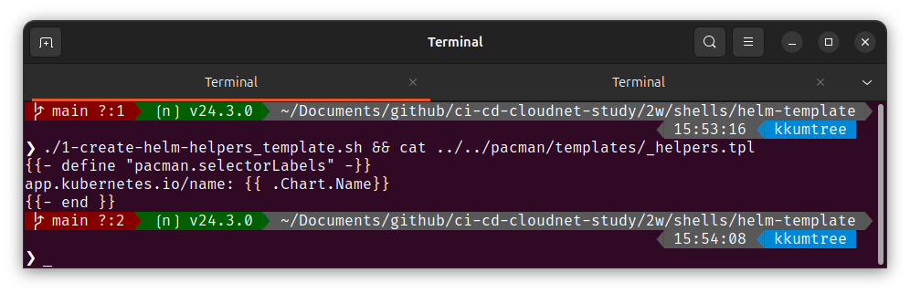

### (3) 기존 템플릿 변수 변경  

기존의 파일들을 변경합니다.  

```bash
## 2w/shells/helm-template/2-helm-deployment.yaml
## 2w/shells/helm-template/3-helm-service.yaml
# deployment.yaml 수정
(...)
spec:
  replicas: {{ .Values.replicaCount }}
  selector:
    matchLabels:
      {{- include "pacman.selectorLabels" . | nindent 6 }}  
  template:
    metadata:
      labels:
        {{- include "pacman.selectorLabels" . | nindent 8 }}  
        
# service.yaml 수정
  selector:
    {{- include "pacman.selectorLabels" . | nindent 6 }}  
(...)
```

이후 `_helpers.tpl`에 정의한 공통 변수가 정상적으로 들어갔는지 확인합니다.  

```bash
helm template .  
```

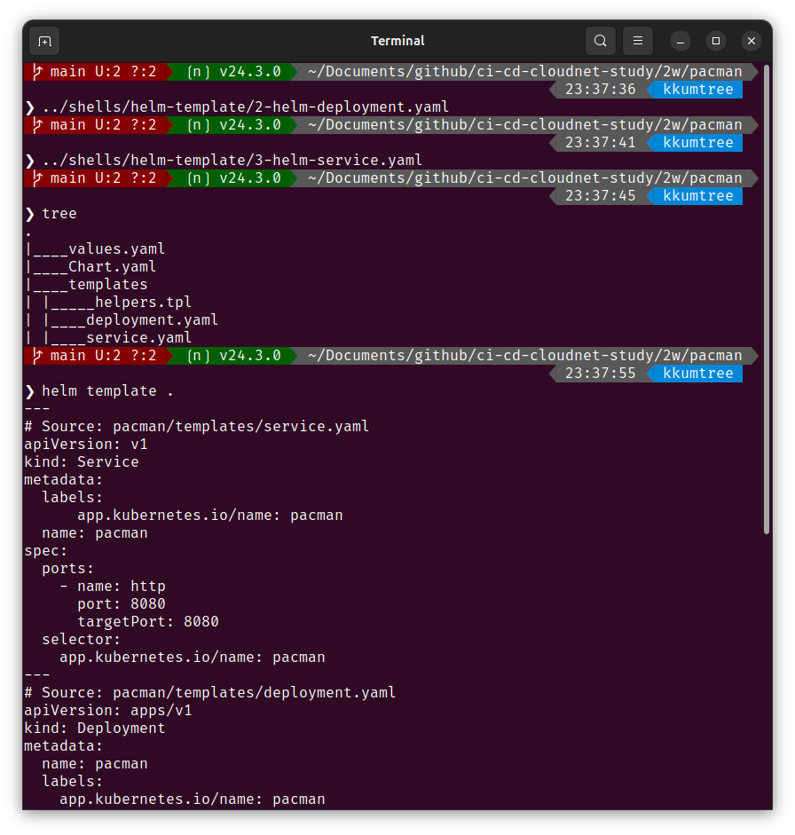  

## 2. 컨테이너 image 파일 업데이트  

배포 파일에서 컨테이너 이미지를 갱신하고, 실핼 중인 인스턴스를 업그레이드 해보겠습니다.  

### (1) 배포  

우선 다시 배포해봅니다.  

```bash
helm install pacman .
helm history pacman 
kubectl get deploy -owide
```

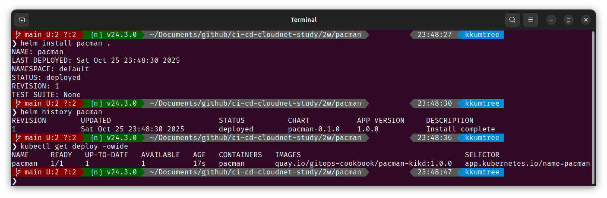  

### (2) image 태그 갱신  

`values.yaml` 및 `Chart.yaml`에서 image 태그를 갱신해봅니다.  

  

### (3) helm upgrade로 배포  

아래와 같이 upgrade 명령어로 배포 합니다.  

```bash
helm upgrade pacman .  
# Release "pacman" has been upgraded. Happy Helming!
# NAME: pacman
# LAST DEPLOYED: Sat Oct 25 23:58:23 2025
# NAMESPACE: default
# STATUS: deployed
# REVISION: 3 ## 리비전 번호가 하나 올라갑니다.  
# TEST SUITE: None
helm history pacman  
kubectl get secret  
kubectl get deploy.replicaset -owide
```

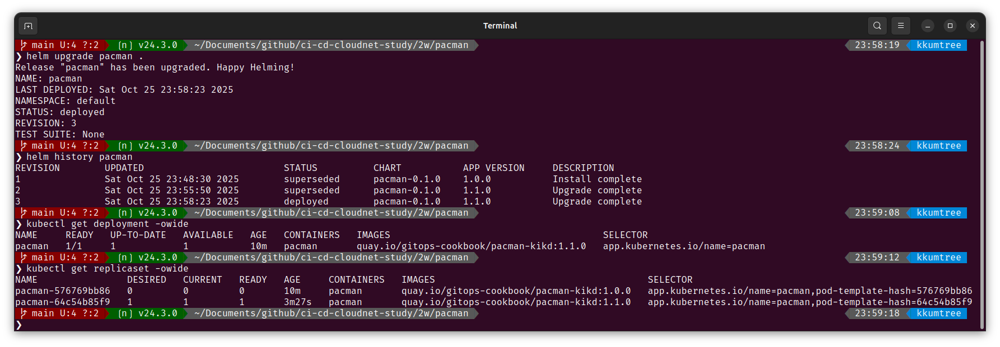

- `tag` 및 `appVersion` 으로 필드가 나뉘어 있으나, 배포 상황에 맞게 취사선택하여 전략을 취할 수 있습니다.  
- `appVersion`과 `version`은 서로 관계가 없음!  
  - `appVersion`: 애플리케이션을 변경할 때마다 업데이트 해야 함.  
  - `version`: 차트 버전이르모, 차트의 구조 등 정의가 변경되면 갱신함.  

### (3) rollback  

이전 버전으로 롤백합니다.  
image 태그가 1.0.0으로 지정된 리비전이 1이었으므로 1로 롤백해보겠습니다.  

```bash
helm history pacman
helm rollback pacman 1 && kubectl get pod -w
helm history pacman
kubectl get secret
kubectl get deployment -owide
kubectl get replicaset -owide
```

롤백을 하였어도, 기존 버전들은 남아있음을 알 수 있습니다.  

  

## 3. chart 패키징 해보기  

헬름 차트를 배포하기 위해, 패키징을 해봅니다.  

```bash
helm package .
tree
helm repo index .
cat index.yaml
```

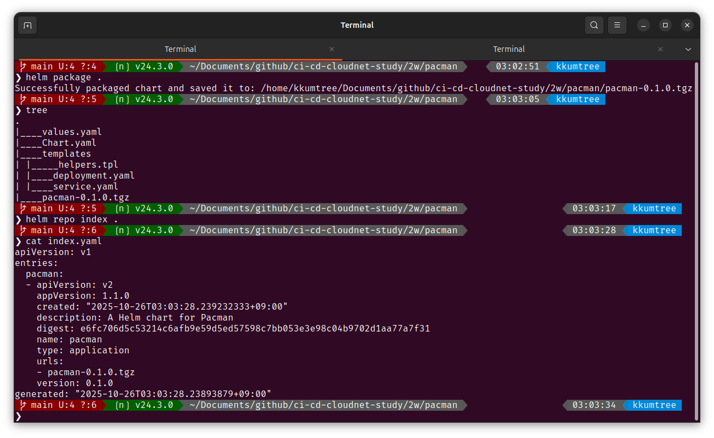

해당 차트를 차트 저장소(repository)에 게시하여 공유를 할 수 있는데,  
차트 저장소는 HTTP 서버이며,  
(1) 차트 및 (2)`.tgz` 파일,  
(3) 차트에 대한 메타데이터 정보를 담은, index.html 파일이 있어야한다고 합니다.  

차트를 저장소에 게시하려면 index.html 파일에 새 메타데이터 정보로 업데이트하고  
해당 아티팩트를 업로드해야 한다고 합니다.  

## 4. 리포지토리의 chart 배포  

리포지토리에서 helm chart를 가져와 배포해보겠습니다.  

### (1) chart 가져오기  

bitnami의 리포지토리를 등록하고, postgresql 차트를 확인합니다.  

```bash
helm repo add bitnami https://charts.bitnami.com/bitnami
helm repo list
helm search repo postgresql
helm search repo postgresql -o json | jq
```

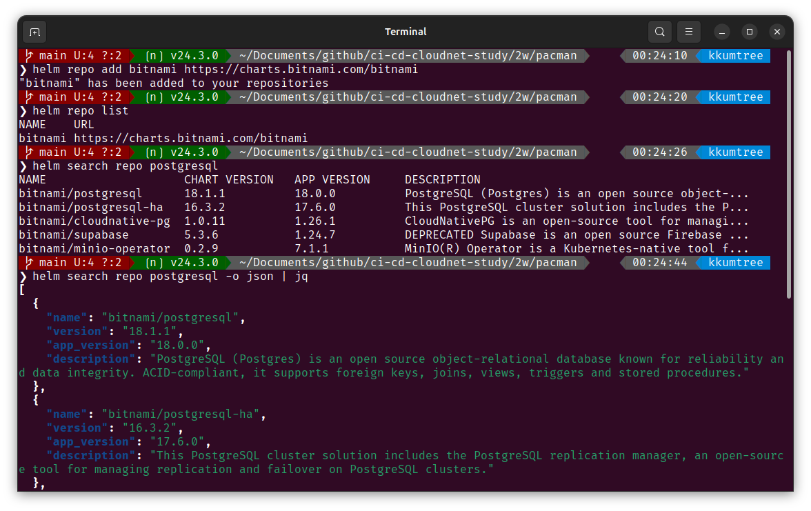

### (2) 배포해보기  

앞서 확인한 bitnami/postgresql 차트를 배포해봅니다.  

```bash
  helm install my-db \
  --set postgresql.postgresqlUsername=my-default,postgresql.postgresqlPassword=postgres,postgresql.postgresqlDatabase=mydb,postgresql.persistence.enabled=false \
  bitnami/postgresql  
```

해당 리포지토리의 지원 관련 경고와 함께 배포되었음을 확인할 수 있습니다.  

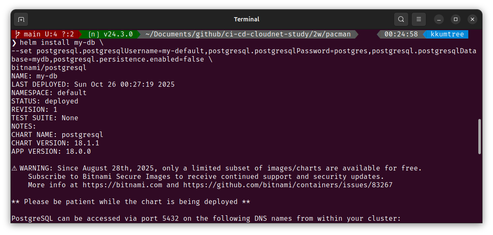  

배포 현황을 확인해봅니다.  

```bash
helm list  
kubectl get sts,pod,svc,ep,secret  
```

  

### (4) values 확인 및 실습 정리  

기본값(default values)는 `helm show`를 통해 확인 가능합니다.  

```bash
# helm get values my-db ## 기본값 확인 불가능  
helm show values bitnami/postgresql  
```


아래 방법으로 조금 더 간소하게 확인할 수 있습니다.  

```bash
helm show values bitnami/postgresql | grep -v '#'  
```

  

리소스를 정리합니다.  

```bash
helm uninstall my-db
```

  

## 5. chart간 의존성 설정하기  

이제는 직전에 배포해봤던 bitnami/postgresql 차트와  
java 애플리케이션 차트 간의 의존성을 설정하여 배포해보겠습니다.  

### (1) 배포 파일 구성  

> 해당 구성들은 아래 GitHub에 탑재되어 있습니다.  
> <https://github.com/kkumtree/ci-cd-cloudnet-study>  
> Helm의 구성파일들은 `2w/music` 폴더에 있습니다.  

아래와 같이 차트를 구성했습니다.  

```bash
## 2w/shells/helm-dependency 폴더의 쉘 파일을 활용  
# ❯ tree
# .
# |____values.yaml
# |____Chart.yaml
# |____templates
# | |____deployment.yaml
# | |____service.yaml
```

다른 점은 `Chart.yaml`에 `dependencies` 설정이 있다는 점입니다.  

```bash
tail -n 4 Chart.yaml
# dependencies:
#   - name: postgresql
#     version: 18.0.17
#     repository: "https://charts.bitnami.com/bitnami"
```

  

### (2) 의존성 차트 다운로드  

차트를 다운로드 하면, `.tgz` 압축파일을 확인할 수 있습니다.  

```bash
helm dependency update && tree
# |____values.yaml
# |____Chart.yaml
# |____charts
# | |____postgresql-18.0.17.tgz
# |____Chart.lock
# |____templates
# | |____deployment.yaml
# | |____service.yaml
```

더불어, Chart.lock 파일도 생성되었음을 확인할 수 있습니다.  

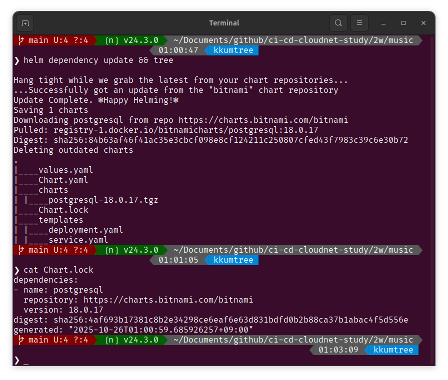  

### (3) 배포 및 확인  

배포를 합니다.  

```bash
helm install music-db .  
```

아래와 같이 PostgreSQL Pod 내에서, values.yaml에 지정한  

- username, `my-default`를 생성  
- database, `mydb`를 생성 후, `my-default`에 접근권한을 생성  

하는 로그를 확인할 수 있습니다.  

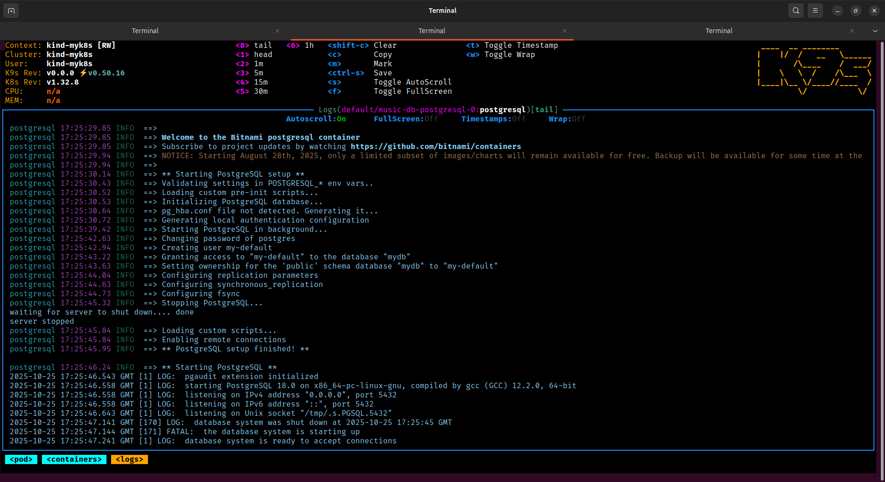  

Java 애플리케이션에서도, DB에 접근이 가능해지자 SQL문을 통해 테이블을 생성하고 레코드를 삽입하는 것을 볼 수 있었습니다.  

  

### (4) 정상 작동 확인  

해당 service에 port-forward 설정 후, 새로운 탭에서 호출하여 응답을 확인합니다.  

```bash
# 탭 1
kubectl port-forward service/music 8080:8080
# 탭 2
curl -s http://localhost:8080/song
```

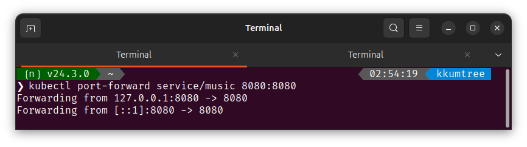  


### (참고) values.yaml 변수 설정  

해당 image의 버전이 `10.y.z` 에서 `18.y.z`로 오면서,  
chart 변수 지정 방법이 바뀌었습니다.  

```bash
# values.yaml
postgresql:
  # postgresqlUsername: my-default
  # postgresqlPassword: postgres
  # postgresqlDatabase: mydb
  secretName: music-db-postgresql
  secretKey: postgres-password
  auth:
    username: my-default
    password: password
    database: mydb
```

- `auth.username`: 사용자 정의 유저를 생성  
- `auth.password`: 해당 `secret`(이 경우, music-db-postgresql)의 key 값 지정  
- `auth.database`: 사용자 정의 유저가 접근할 database명

참고로 Database 이미지이므로, helm uninstall 로 차트를 제거했을지라도  
PVC/PV는 남아있으니, 이후에 확인 후 제거하면 됩니다.  

```bash
helm uninstall music-db
kubectl get pvc
kubectl get pv
kubectl delete pvc data-music-db-postgresql-0
kubeclt get pvc,pv
```

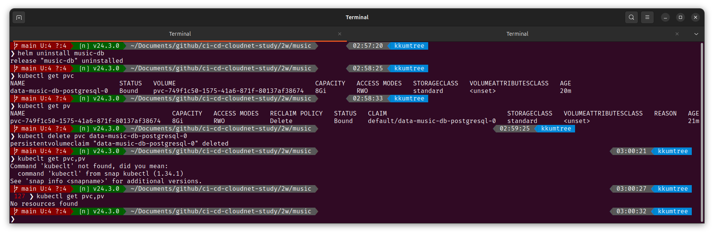  

## Reference

- [Bitnami package for PostgreSQL](https://github.com/bitnami/charts/tree/main/bitnami/postgresql)  
- [Helm 101 - CI/CD 스터디 2주차](../helm-hello-world/)  
