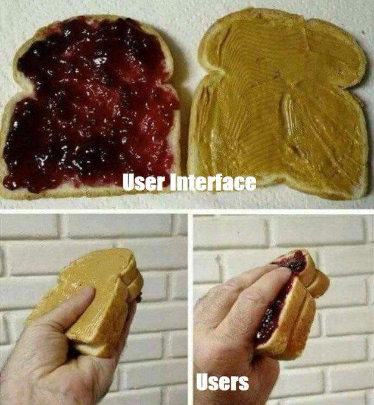
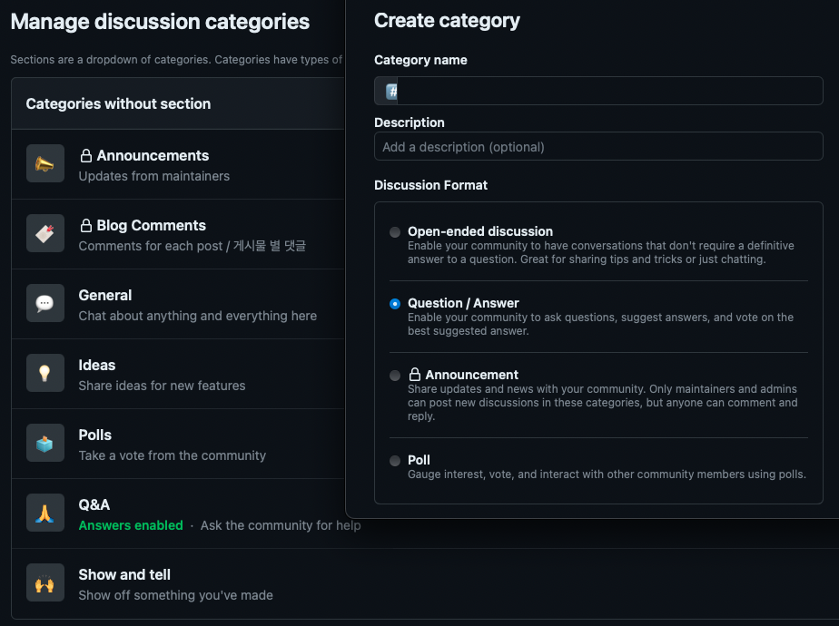

## 요약

```summary
앞으로 가감없는 피드백 환영합니다.
```

<https://github.com/kkumtree/blog.minseong.xyz/commit/e17822e72e8d357dcdbda1025c5372161a7b93ff>

## 배경

gh-pages로 블로그를 구축해서, 첫 게시물을 올린 지 만 4개월이 지났다.  
구축기는 나중에 올려야지.  

급히 벤치마킹해서 올린거라, 부족한 점은 많지만 가장 중요한 댓글 기능이 없어서 아쉬웠다.  

원래는 댓글을 달지 않으려고 했는데,  

- 부족한 부분에 대해서 조언도 받아보고 싶고  
- 추가로 궁금한 점이나 이해가 안되는 부분에 대해서 피드백도 받고 싶었다.  

다른 블로그에서 답을 찾으려고 검색엔진을 돌리면, 뭔가 2% 부족하거나 / 내가 원하는 해답이 아니거나 / 매번 이모티콘으로 끝나는 특유의 허탈감으로 짜증이 밀려와서 번역기 돌려가며 국외 포스트나 문서를 보다보니, 반대로 내 글도 큰 도움이 되지 못할 경우도 있겠다 싶었다. 그래서 댓글 기능을 추가하기로 했다.

## giscus 선정

사실은 disqus를 사용하려고 했다. 아는 것 중 유명한게 그거 밖에 없었다.
그러다가 원래 벤치마킹하고 있던 [한영빈님 블로그](https://https://blog.youngbin.xyz/)를 살펴보니 giscus를 사용하고 있었고, 뭔가 해서 [공식홈페이지](https://giscus.app/)를 살펴보았다.  

소스코드 보기 전에 이미 disqus 계정 생성했는데, 가입 이후 안들어가게 되었다.

1. GitHub repo에서 제공하는 Discussions으로 댓글 기능을 구현한다.  
2. GitHub 의존성은 있지만, 어차피 gh-pages로 운영 중이라 일관성이 있다.  
3. 작성을 위한 로그인은 GitHub OAuth로 이루어진다.  
  예전에 inflearn에서 facebook 소셜로그인 오류난 거가 생각나서,  
  OAuth는 안정적이어야 한다고 생각한다. Meta OAuth는 지양하고 있다.  
  (줔아저씨가 ibus 다국어 입력도 좀 받아줬으면 한다. 트래커 얼마나 다신거야.)
4. 임베딩이 엄청 쉽다. 눈대중으로 정상 구동 될 정도라니,  
  gh-pages에 vanila-framwork 테마 입힐 때를 생각하면 감격 수준이다.
5. 비밀 댓글이 없다. 개인적 취향인데, 비밀 댓글로 보낼 일이면 이메일이나 다른 연락수단을 취하면 될 일이 아닌가 싶다.

## giscus 적용 시 유의할 점

1. repoID 및 categoryID:
  Docs 관련 항상 전해지는 글귀가 있다. RTFM... 이라고. 처음에는 이걸 어떻게 획득하는 거지? 이러고 있다가, 공식홈페이지에 이것저것 입력해보니 키값이 나왔다. 너무나도 짧은 quick start 가이드라서 설?마하고 안 읽었는데 역시나였다. 그냥 하라는 대로 하자.  
  
2. 당연히, 기존의 페이지 구조를 이해하고 있어야 한다.
  프레임워크를 제외한, 커스텀된 부분마저도 나처럼 다른 블로그를 벤치마킹했다면
  기존의 페이지 구조를 파악해야 한다.

- 국외 블로그만 참고하고, 무지성으로 [layouts/_default/single.html](https://github.com/kkumtree/blog.minseong.xyz/commit/963e8e8450d08de65f51c0ee1416ace6063054b8#diff-24462426055951e719fb3391c93dc316c42dc3328c3b78ff661ea868ef4372e9)에 넣었다가 헛발질을 했다.  
- 처음에 어떻게 Hugo 구성했었는지 잊고지내서, 바로 [layouts/post/single.html](https://github.com/kkumtree/blog.minseong.xyz/commit/e17822e72e8d357dcdbda1025c5372161a7b93ff)쪽을 바라보게 했다는 것을 인지하는데 시간이 걸렸다.

## 적용순서

- 추천: [공식홈페이지](https://giscus.app/)의 quick start를 따라하자.

1. GitHub discussion 활성화:  
GitHub repo는 기본적으로 discussion이 열려있지 않다.  
`Settings > General > Features > Discussions`을 활성화한다.
2. giscus 앱 설치(Github Apps):  
나중에 부연설명을 해야될 것 같기도 한데, 이 부분은 다른 분들이 잘 기술해주셔서 크게 곤란해질 일은 없다. 앱을 설치할 때, 권한 부여를 계정 전역으로 할지, repo별로 할지 선택할 수 있다. 블로그 repo에만 권한을 주었다.  
   - 퍼미션은 Read access to metadata / Read and write access to discussions 두 가지다. (**CR**~~UD~~)
3. discussion category format 설정:
공식홈페이지에서는 두리뭉술하게 GitHub Docs만 게시했는데 2가지 길이 있다.
   - **Announcement** 속성: **maintainer**만 관리할 수 있다.  
   Discussion에 대한 직접적인 CRUD가 giscus 앱을 포함한 maintainer만 가능하다. (블로그 페이지에서 작성자가 게시 -> giscus app이 직접 repo의 Discussion 게시 -> repo에서 수정/삭제는 maintainer만 가능)
   - 나머지 속성들은 그렇지 않다.  
   테스트 해보고 아니다 싶으면 다른 카테고리를 바라보게 하면 된다.
   
4. config 임베딩: 당연히 YAML과 TOML 방식이 다르다.  
  하지만 단순해서 만들어진 bolierplate를 참조하면 손을 좀만 보면 된다.
  처음 구축할 때, 시인성으로 [TOML](https://github.com/kkumtree/blog.minseong.xyz/commit/963e8e8450d08de65f51c0ee1416ace6063054b8#diff-28043ff911f28a5cb5742f7638363546311225a63eabc365af5356c70d4deb77) 을 적용했기에 다른 코드 참조하면서 환경변수 및 스크립트 임베딩을하면 된다.  
5. giscus 임베딩: 구조에 맞춰 알맞게 넣고, CSS가 잘 적용되는지 조정하면 완료
