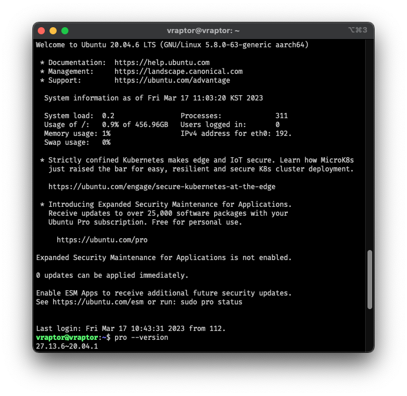
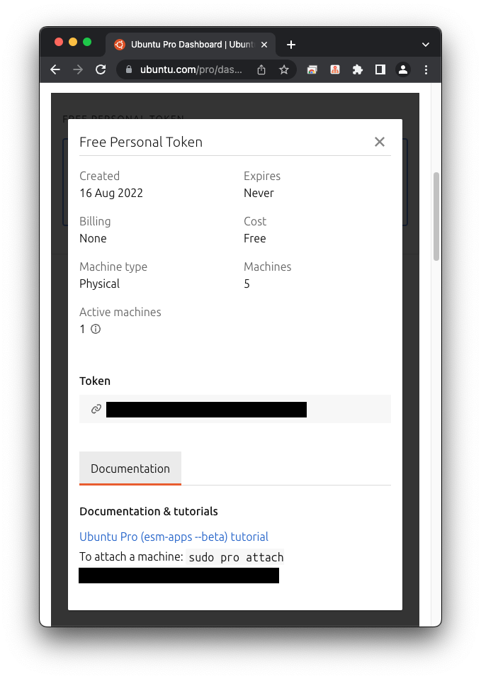
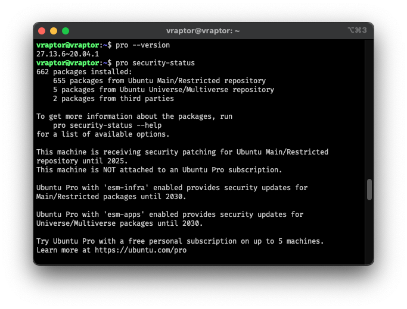
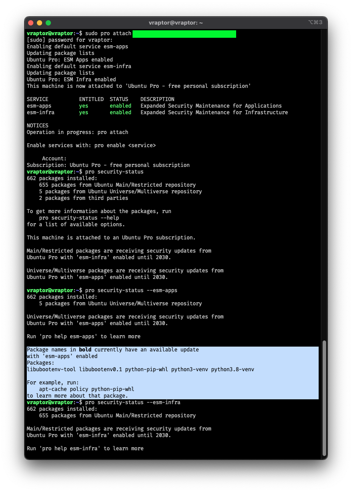

```tutorial
튜토리얼 레벨의 게시물입니다. 
모든 정보는 https://ubuntu.com/pro/tutorial 에 기초합니다. 

기타 초기 구성 중 이슈는 아래도 참고하시기 바랍니다.
https://canonical-ubuntu-pro-client.readthedocs-hosted.com/en/latest/index.html 
```

## 계기

필자가 개인 데스크탑으로 사용하는 Ubuntu 버전이 22.10 (Kinetic Kudu), 23.04 (Lunar Lobster) 이기에, Ubuntu Pro를 적용해볼 기회가 없었다.  
이번에 지인 분으로부터 제공받은 엑세스랩([XSLAB](https://xslab.co.kr/))사의 ARM 기반 Vraptor SQ nano를  
클린설치하고 나니 Ubuntu 20.04.6 LTS (Focal Fossa) 버전이었기에, Ubuntu Pro를 적용해보기로 했다.  
해당 제품은 [보라몰/voramall](https://voramall.com/)에서도 만나볼 수 있다.

## Ubuntu Pro란?  

Ubuntu Pro는 Ubuntu의 구독 상품으로, 보안 등의 지원 기능을 추가한 서비스로
사전에 보안 취약점을 빠르게 보완해서 데이터를 보호하는게 여러모로 절감되지 않을 까 싶기에 인상 깊었던 프로덕트였다.  

기존에는 Ubuntu Advantage라는 이름으로 제공되었으나, 21년 상반기에 Ubuntu Pro로 이름이 변경되었다.  
위에서 언급했다시피, 이 상품은 LTS(Long Term Support) 버전에만 제공된다.  

5년 동안 우분투 메인 레포 업데이트를 제공하는 LTS 버전에 추가적으로 5년을 더해  
총 10년간의 보안 업데이트를 제공하는 것이 골자지만, 이걸로 넘기기에는 Pro의 또 다른 이점이 있다.
CVE(Critical Vulnerability Exploit) 취약점 관련 지원 또한 제공된다.  

CVE 취약점 관련을 확인해보고 싶어서 개인용을 해보았다.
`개인적 사용목적`으로 최대 5개 기기에서 Free Personal Token을 발급받을 수 있다.

## Ubuntu Pro를 적용해보자

### 1. Ubuntu Pro를 적용하기 위한 준비

- 기본적으로 Ubuntu Pro는 최신으로 업데이트된 LTS 배포판이라면 설치되어있다
  - 16.04 이전 버전은 `ubuntu-advantage-tools` 패키지를 설치해야 한다. (최대한 20.04 이상의 LTS 버전을 사용하도록 하자)



- [Ubuntu Pro 대시보드](https://ubuntu.com/pro/dashboard)에서 `Free Personal Token`을 발급받는다.  



### 2. Ubuntu Pro를 적용하기

- 토큰을 적용하지 않으면 `pro security-status` 입력 시, 구독 상태가 아니라고 확인



- 토큰을 적용해본다.
  - `sudo pro attach ${TOKEN_VALUE}` 명령어를 입력한다.
  - 그러면 서비스가 활성화된다. 필자의 구독의 경우 개인용이기에, esm-infra와 esm-apps가 활성화 되었다.
- 음영처리한 부분이 필자가 Ubuntu Pro를 설치한 목적. 패키지 상태를 모니터링 할 수 있다.  



### 3. 취약점 확인하기

- 원래는 Bold 된 패키지가 나왔다면, 취약점을 가지고 있다는 뜻이므로 바로 적용하려 했으나 아직 취약점이 없는 것 같다.
  - 있다면, [튜토리얼](https://ubuntu.com/pro/tutorial)을 참조하여 해당 취약점을 보완해보자.  
  - [readthedocs](https://canonical-ubuntu-pro-client.readthedocs-hosted.com/en/latest/index.html) 또한 잘 정리되어 있다.  
  - `pro fix CVE-20YY-XXXX`: CVE 넘버를 알고있다면, 이 명령어를 통해 보완할 수 있다.
