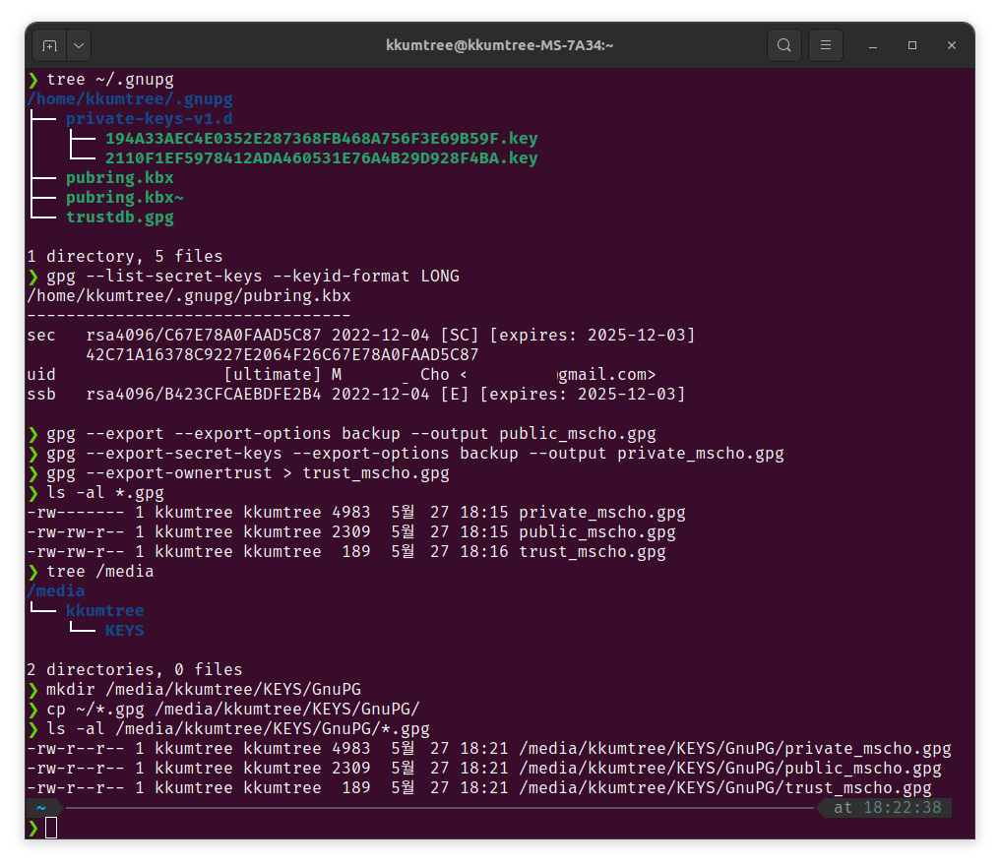

망가진 PC 메인보드를 교체하고, 서둘러 GPG key를 백업하였습니다.  
용량이 그리 큰편은 아니니, 왠만한 USB 메모리에도 충분히 백업이 가능합니다.  
(어째서 안했었을꼬...)

```bash
# tree로 ~/.gnupg 확인
tree ~/.gnupg

# 현재 사용중인 키 확인
gpg --list-secret-keys --keyid-format LONG

# 키 백업

## public 키 백업
gpg --export --export-options backup --output ~/public_mscho.gpg

## private 키 백업
gpg --export-secret-keys --export-options backup --output ~/private-mscho.gpg

## trust(신뢰관게) 백업
gpg --export-ownertrust > trust_mscho.gpg

# 백업한 키 확인
ls -al ~/*.gpg

# 백업한 키를 USB로 복사

## 이미 마운트된 미디어 확인(볼륨이름 KEYS에 보관할 계획)
tree /media

## (옵션)하위 폴더 생성
mkdir /media/KEYS/GnuPG

## 키 복사
cp ~/*.gpg /media/KEYS/GnuPG

## 복사한 키 확인
ls -al /media/kkumtree/KEYS/GnuPG/*.gpg
```


