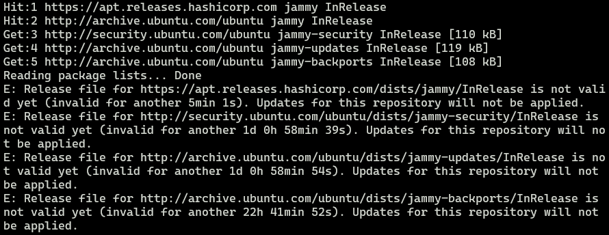
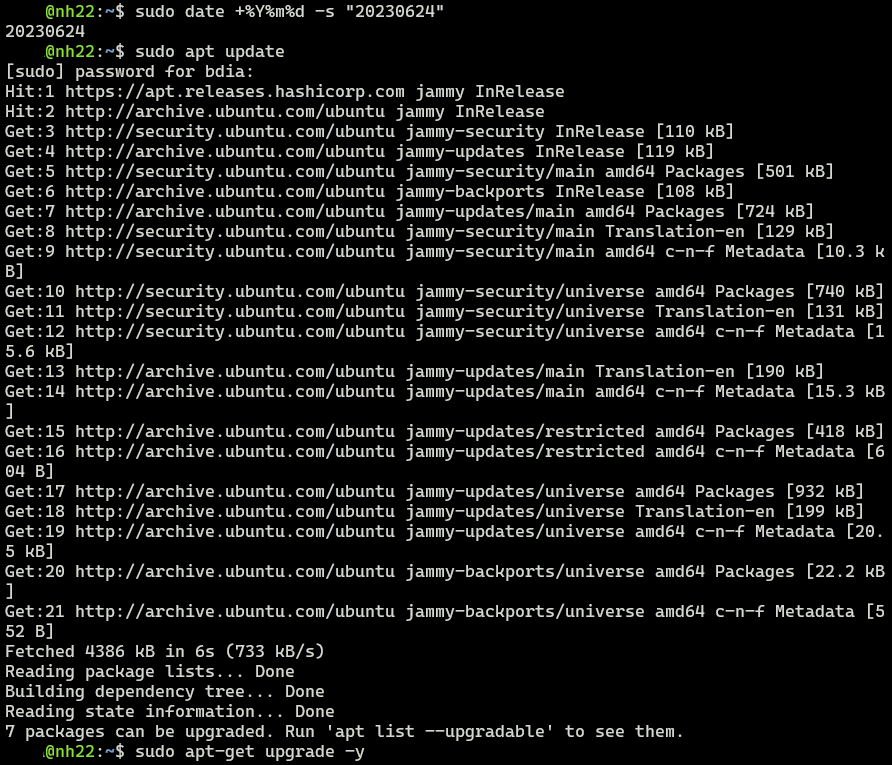

최근 WSL를 쓰게 되면서, 한 가지 이슈가 생겼다.  
APT repo를 업데이트 하면 아래와 같은 에러가 발생한다.  
이것저것 손대보고 해결법을 적어보고자 한다.  

  

```message
E: Release file for http://ports.ubuntu.com/ubuntu-ports/dists/jammy/InRelease is not valid yet (invalid for another 5min 1s). Updates for this repository will not be applied.
```

오류 증상은 릴리스 파일이 존재하지 않는데, 5분 1초동안 유효하지 않는다고 한다.  
무슨 말인가 싶은데, 5분 있다가 업데이트 해보라는 것이다.  

## 원인

오랫동안 절전모드로 두어서 시간 동기화가 안된 것으로 보인다.  
재부팅하지 않으려고 했기에, 해결을 위해 더 많은 시간을 보냈다.

## 해결 방법 1. 시간 동기화

- 검색엔진에 널려있는 해결법은 시간 동기화이다.
  당연하게도 Ubuntu의 시각이 과거에 있기 때문에, 하드웨어 시각을 실제 시간에 맞추면 된다.  
- 물론 시간동기화는 자동으로 이루어지기 때문에 웬만한 경우에는 해결되나,  
  사용하고 있던 WSL환경에서는 한 시간이 되어도 해결되지 않았다.  
- 아래의 커맨드를 통해서 강제 동기화를 하였으나 **효과가 없었다.**  
  하지만, 많은 경우 해결이 된다.

```bash
# 강제로 시간 동기화
# Force system to use local time
sudo timedatectl set-local-rtc 1

# APT repo 정상 업데이트 확인
sudo apt-get update -y && sudo apt-get upgrade -y

# 시간 동기화 설정 원복
sudo timedatectl set-local-rtc 0
```

## 해결방법 2. 시간 지정

- 우연히, Youtube 영상(References 추가)을 참고하여 문제를 해결 하였다.  
  - 시간을 문자열로 지정하면 된다.
- 영상에서는 시간을 특정하여 지정하였지만,  
  나의 경우에는 일 단위로 차이가 나서 효과가 없었다. 아예 날짜를 특정하여 지정하였다.  
  
```bash
# 시간 지정 방법(1)
sudo date -s "23:59:59"

# 시간 지정 방법(2)
sudo date +%T -s "20:31:31"

# 날짜 지정 방법
sudo date %Y%m%d -s "20230624" 

# 시간 및 날짜 지정 방법
sudo date -s "2023-06-24 23:59:59"
```

- 정상적으로 업데이트 됨을 확인
- 이후에 장기간 사용하다 보면, 시간동기화를 할 것이기 때문에 큰 상관이 없다.



## References

- [KailTut-Youtube](https://www.youtube.com/watch?v=Ym0-yRVqWmw)
- [IT'S FOSS](https://itsfoss.com/fix-repository-not-valid-yet-error-ubuntu/)
