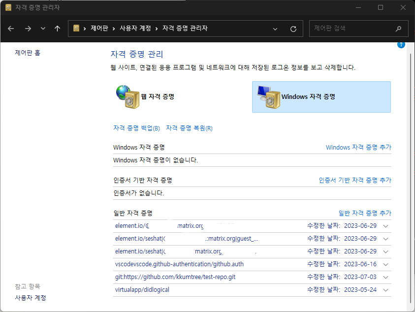

평소에는 Git관리를 terminal을 통해서 하고,  
여러 SSH키를 통해 작업을 하기에  
.ssh/config를 통해 키 기반으로 관리하고 있었다.  

어쩌다보니, 토큰 기반으로 그것도 윈도우에서 관리를 해보게 되어서
둘 다 생소한 접근이라 새로운 셋업을 적용해보기로 했다.  
VSCode 기반으로 세팅하기에,
그대로 따라온다면 별 문제 없이 잘 적용될 것이다.

cf. classic token이라 할지라도, 큰 이슈는 없을 것으로 생각된다.  

## Git config의 적용범위

`git config <parameter>`를 통해, 설정 값을 구성할 수 있다.
system > global > local 순으로 옵션이 override된다.

- --system: 시스템 전체에 적용
- --global: 사용자 전체에 적용
- --local: 해당 저장소에만 적용

먼저 이걸 말한 이유는, Github의 repo별로 토큰을 개별 관리하기 위해서
global 옵션에서 셋업을 하여야 하기에, 이해가 선행되어야한다.

- 장점: Repo별로 Token을 관리하기 때문에, 권한 관리에 용이
- 단점: 같은 토큰을 사용하는 Repo가 많아지만 중복 발생

물론 Docs(Git홈페이지, man-page)를 참고하면 가장 큰 도움이 될 것이다.

## Repository별 토큰 관리

- 본 포스트에서는 Repo별로 토큰을 관리하기 위해, Fine-grained access control을 사용하여 토큰 2개를 발급 받는다.
- __Beta__ 기능이기에 작성 시점의 내용과 실제로 적용되는 내용이 다를 수 있다.

### Github Token 생성

이건 누구나 다 아는 내용이니 가볍게 후술하면,  
(Profile) Settings > __Developer Settings__ > Personal Access Token 에서
Fine-grained access control을 통해, 토큰을 생성한다.  

- `Only select repositories` : 적용할 repo 선택
- `Repository Permission` : Private 또는 특정 repo 선택 시 활성화
  - Contents : 기본적인 repo 컨텐츠 제어 (RO|RW)
  - (Metadata) : Permission이 하나라도 지정되면, 자동 활성(필수)  
    AWS에서 Instance Name 기입하면 Tag 자동생성되는 것을 생각하자.  

이 외의 옵션은, 필요에 따라 선택하면 된다.  

## Windows에서 git-credential config 관리

- 기본적으로, Windows에서 credential은 자격 증명 관리자에서 관리가 된다.  
  따라해보다가 안되면, 여기에서 원인이 되는 해당 자격증명을 삭제하면 된다.
  - 단, 따로 보관을 했거나, 알고 있는 경우에만 삭제하는 것을 권유
  

- (선택)원활한 시연을 위해 기존의 관련 설정을 지우고(수정) 적용한다.  
  - 먼저 시도하지 말고, 그 다음의 설정값을 확인, 참조하여 적용하자.  

```powershell
# 에디터에서 수정
git config --system --edit
git config --global --edit
# CLI에서 수정
git config --system --unset credential.helper
git config --global --unset credential.helper
```

### 0. git-credential-manager(GCM) 설치 및 기본 에디터 셋업

- Git 홈페이지에서 exe파일을 다운로드 받아 기본 설정으로 설치를 했다면, 기본값으로 설치되어 있을 것이다.  
  - 다음 단계에서 제대로 명령어가 구동이 되지 않는다면, [standalone](https://github.com/git-ecosystem/git-credential-manager/releases/latest)으로 설치할 수 있다.
- 간혹 GNU nano로 설정값 에디터가 설정되어 있기에,  
  익숙한 에디터가 있다면 별도로 설정하도록 하자.  

  ```powershell
  # 택1. VSCode 
  git config --global core.editor "code -w"
  # 택2. vi(vim)
  git config --global core.editor "vi"
  ```
  
### 1. git-credential-manager(GCM) config 설정

크게 두 가지를 설정한다.  

- credential(token 등)저장 옵션
- repo 별 credential 관리 옵션

#### 1-1. credential 저장 옵션

- 기본값(NULL): 아무것도 저장하지 않는다.
- cache: 메모리에 저장.  
  - 통상 15분 유효, 디스크 저장 X.
- store: 파일에 저장.  
  - 기본경로 `~/.git-credentials`
  - 개인적으로 경로가 혼동되기 때문에 직접 경로 지정을 사용.  

```powershell
# 택1) store in `~/.git-credentials`
git config --global credential.helper 'store --file ~/.git-credentials'
# 택2) cache 1 hr
git config --global credential.helper 'cache --timeout 3600'
# 해제
# git config --global --unset credential.helper
```

#### 1-2. repo 별 credential 관리 옵션

- 위의 설정까지만 하면, repo간 다른 토큰을 쓰면 마지막에 입력한 토큰으로 계속 override된다.  
- 규칙을 적용하여 repo별로 토큰 관리 활성화를 한다. (like `SSH known_hosts`)

```powershell
git config --global credential.useHttpPath true
```

### 각 repo에 tokenize 적용

- 적용을 위해, 미리 local에서 토큰과 repo를 제거하고 다시 clone 작업
  - Github 기준, dockerhub
- 이후에 `~/.git-credentials`에 토큰이 repo별로 저장되어있는 것을 확인

```powershell
git clone https://github.com/kkumtree/repo-example
> Cloning into 'repo-example'...
> Username for 'https://github.com/kkumtree/repo-example': kkumtree
> Password for 'https://kkumtree@github.com/kkumtree/repo-example':<INSERT TOKEN HERE>
> remote: Enumerating objects: 49, done.
> remote: Counting objects: 100% (49/49), done.
> remote: Compressing objects: 100% (38/38), done.
> remote: Total 49 (delta 5), reused 37 (delta 1), pack-reused 0
> Receiving objects: 100% (49/49), 5.63 KiB | 5.63 MiB/s, done.
```

## Further More

- 앞에서 언급한 토큰 중복 이슈를 해결할 수는 있다.
  - 참고: <https://git-scm.com/docs/gitcredentials#_avoiding_repetition>
- 위의 설정에서 일부를 바꿔야하나, 아래와 같이 입력할 수 있다
  - 자세한 건, 위의 avoiding repetition 링크 참조

```powershell
# git config credential.https://example.com.username myusername
git config credential.https://github.com.username kkumtree
```

## 정리

- 여러 토큰을 리포지토리 별로 저장하는 방법을 서술하였다.  
  - repo에 대한 UAC?(User Access Control)를 토큰 기반으로 하고자 할 때
- UAC를 SSH key별로 하려면 다른 전략을 권한다.  

## reference

- [Git - Credential 저장소](https://git-scm.com/book/ko/v2/Git-%EB%8F%84%EA%B5%AC-Credential-%EC%A0%80%EC%9E%A5%EC%86%8C)
- [The lastest GCM as a standalone service](https://github.com/git-ecosystem/git-credential-manager/releases/latest)
- [gitcredentials](https://git-scm.com/docs/gitcredentials)
- [git-credential-store](https://git-scm.com/docs/git-credential-store)
