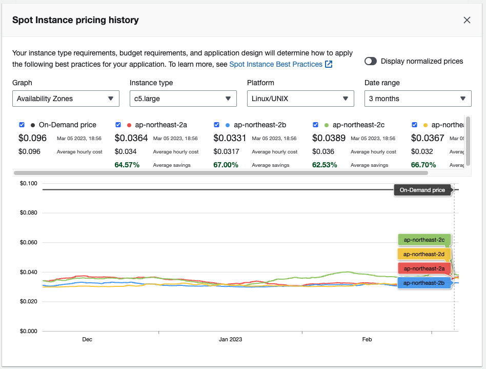
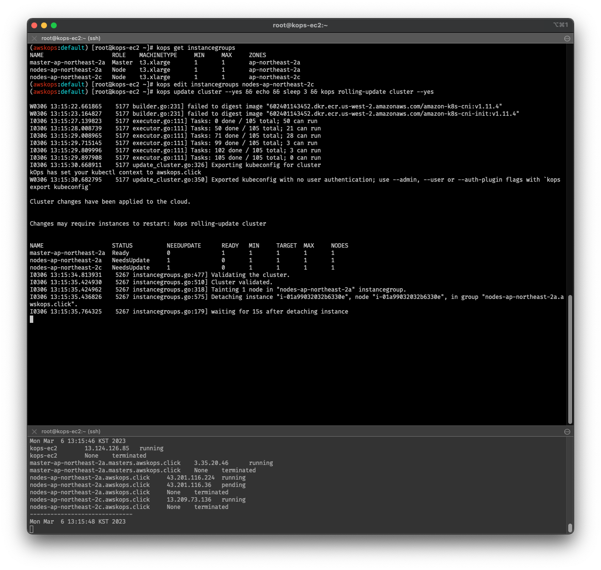
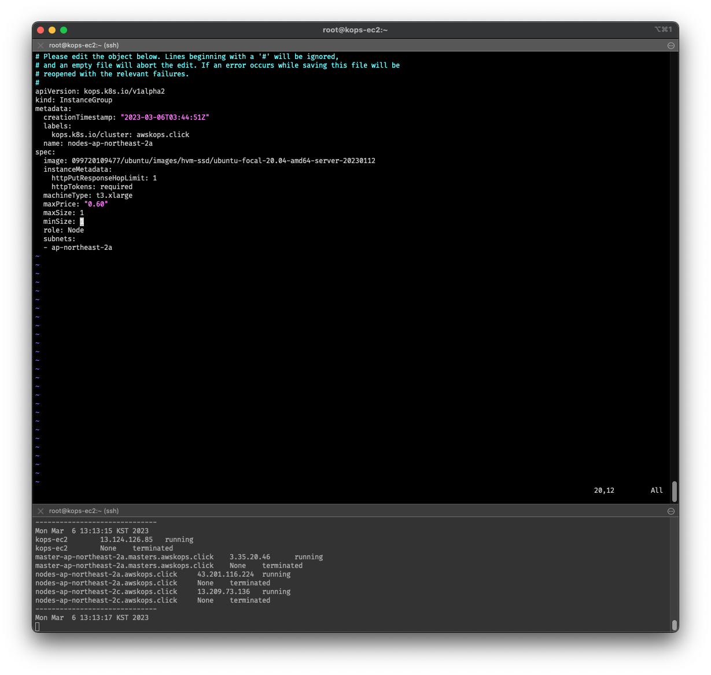
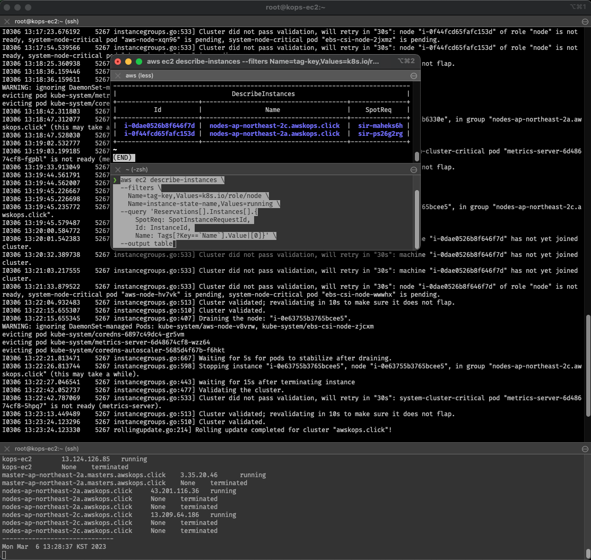
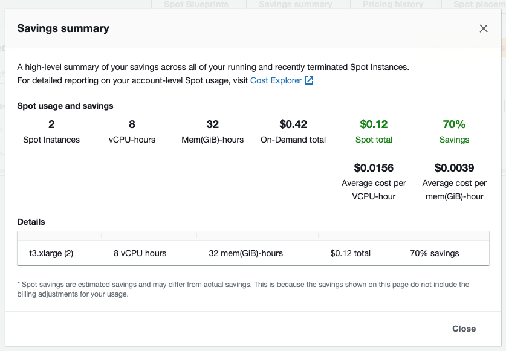
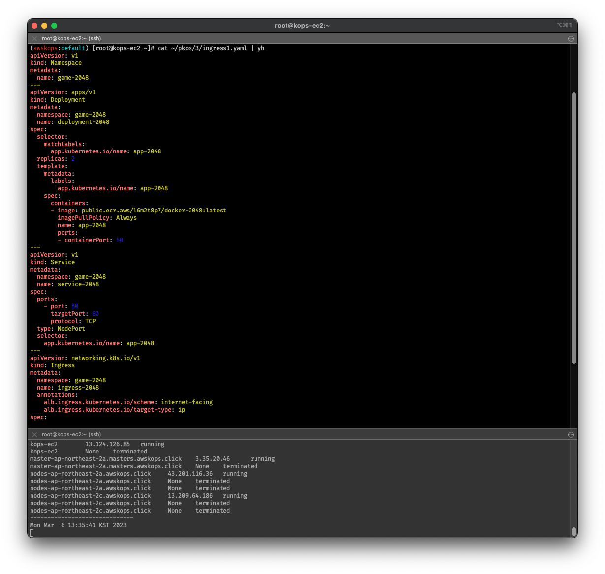
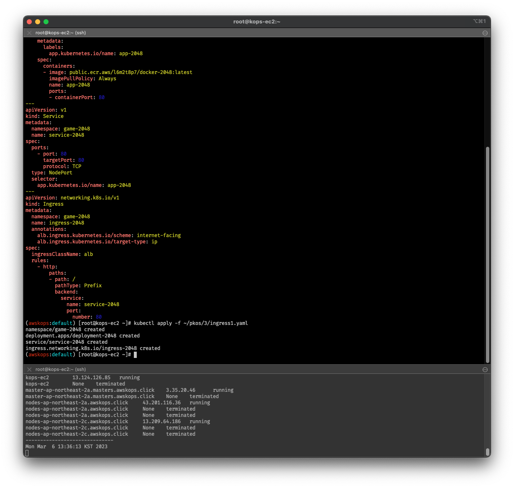
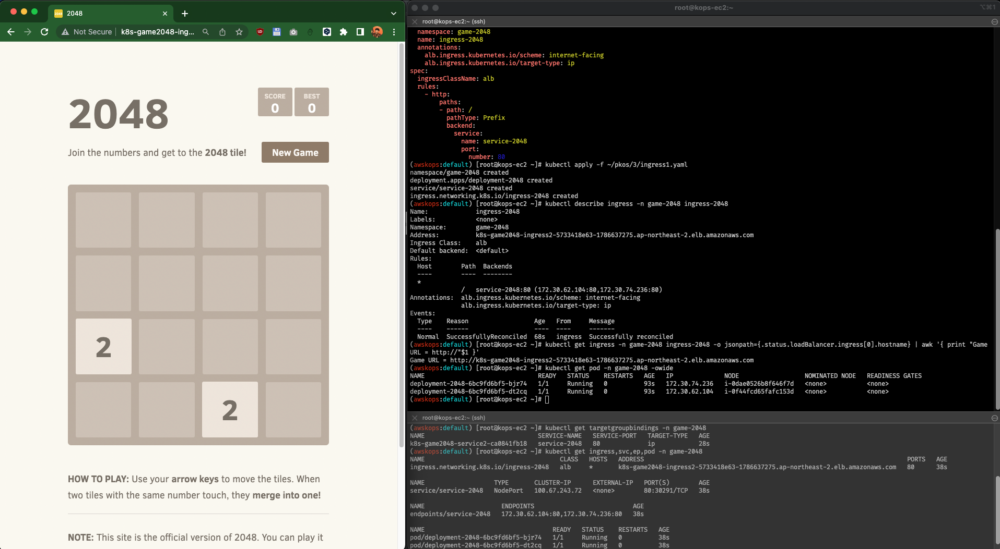

## kops로 충분히 spot instance를 굴릴 수 있지 않을까?  

- 란 생각을 pkos 스터디 내내 하고 있었습니다만,  
  이미 t3.small 돌렸다가 제대로 노드들이 작동하지도 않았음을 맛봤기 때문에...  
  우선순위는 주차별 과제 제출이었기 때문에 이제야 시범 테스트를 해보고, 글을 작성해봅니다.  
- 요약하자면 `복습용으로는 충분히 가능하다.` 라는 판단입니다.  
  - 참고로, `손쉽게 === 야매` 의 느낌으로 기술해보았습니다.  
  - 글 읽기 귀찮다! 싶으면 [여기](https://onica.com/blog/devops/aws-spot-instances-with-kubernetes-kops/)에서 원글을 확인하실 수 있습니다.  

## 왜 스팟 인스턴스인가?  

- 이미 이전 [포스팅](https://blog.minseong.xyz/post/basic-aws-troubleshooting/)의 서두에서 언급한 바 있으나,  
  아무리 클라우드 서비스가 합리적이어도 On-demand 인스턴스를 학습용으로 사용하기엔 살짝 비효율적이라는 생각이 들었습니다.  
- 보통은 엔터프라이즈 급에서는 온디맨드 대신에 미리 사용량 가격표를 정해놓고 쓰는 Reserved Instance를 사용하는 것으로 알고 있습니다.  
  하지만 개인 단위로, 그것도 학습자의 입장에서 사용량 예측도 어렵다고 생각하기에 스팟 인스턴스가 남은 절감 대안이라고 봅니다.  
- 게다가 [AWS 블로그](https://aws.amazon.com/ko/blogs/compute/efficiently-scaling-kops-clusters-with-amazon-ec2-spot-instances/)를 참고하면 알 수 있듯이,  
  자사 제품인 EKS를 가장 권장하고 있으나, kops로 self-managed k8s를 구축하는 경우 스팟 인스턴스를 사용방법을 안내하고 있습니다.  
- 애시당초 k8s가 언제든지 파드가 떨어지는 것을 감안하고 설계되었으니까...  
  k8s 도구인 kops도 그걸 담는 인스턴스를 언제든지 갈아낄 수 있게 만들지 않았을까? 란 당돌한 생각을 해봤습니다.

  - 그나저나 문구 하나는 멋지게 잘 뽑는 것 같습니다.

    ```propaganda
    At AWS, we understand “one size does not fit all.”
    ```

## 스팟 인스턴스가 뭔데요?

- **스팟** 인스턴스는 어렵게 생각할 필요없이...  
  AWS shared 된 vCPU를 비롯해서 각종 자원들이 유휴상태이면, 이 자원에 대해 입찰하듯이 상한가 설정을 하고,  
  시장가가 상한가를 넘기전까지 해당 자원을 저렴하게 사용할 수 있는 인스턴스입니다. 블랙프라이데이나 명절 오면 그때는 가격이 당연히 오를 것 같네요.
  따라서 언제든지 갑자기 인스턴스가 종료될 수 있고, 보통은 도달 안내 메일이 오고 5분 후에 해당 인스턴스가 종료됩니다.  
  가볍게 (EC2 기반) CI/CD 파이프라인을 구축할 때, 또는 학습용으로 사용하기에는 적합한 상품인 것 같습니다.  
- 실시간 가격은 여기서 확인할 수 있습니다. [https://aws.amazon.com/ko/ec2/spot/instance-advisor/](https://aws.amazon.com/ko/ec2/spot/instance-advisor/)
- 웹 콘솔에서의 경우, 더 직관적인 가격을 확인할 수 있었네요.  
  `EC2 > Spot Requests > Pricing History`  

  

## kops로 spot instance 요청하기

- 위에 언급된 AWS 블로그에서는 maxPrice 등 가격에 대한 값이 예제에 없었기 때문에... 나아중에 BP로 참조하기로 하고...  
  [onica 블로그](https://onica.com/blog/devops/aws-spot-instances-with-kubernetes-kops/)을 참고 하였습니다.
- kops로 spot instance를 요청하는 방법은 크게 두 가지가 있습니다.  
  - kops 명령어로 spot instance를 요청하는 방법
  - kops cluster spec yaml 파일에 spot instance를 요청하는 방법
- 아무래도 yaml로 관리하려고 kops 쓰는 건데(?), yaml로 간단히 넣고 끝냅시다.

## 원스톱으로 spot instance로 rolling update 하기

1. 기존의 yaml 파일을 수정합니다.  
  (실습이라 이렇게 진행합니다. 기존 yaml 파일은 따로 복본을 만들어서 versioning 관리해도 될 듯 싶습니다.)
2. control-plane (구, master) 노드는 검증도 못했는데 좀 건들기가 그러니까... worker node를 대상으로 진행해봅시다.  
  worker node의 이름을 파악하려면, 다음의 커맨드를 입력해봅시다.  

    ```bash
    kops get ig # kops get instancegroup 으로 입력해도 무방
    kops edit ig $(worker_node_name) # kops edit instancegroup $(대상 워커노드 이름)
    ```

    

3. `spec` > (오토스케일링 값을 정하는) `maxSize` 바로 위에 입찰가(?)를 매겨봅니다.
  보통은 아무리 높아도 온디맨드/예약 가격보다는 낮게 설정해야하는데... 테스트이니 임의로 넣어보았습니다.  

    ```yaml
    apiVersion: kops/v1alpha2
    kind: InstanceGroup
    metadata:
      
      ...

    spec:
      
      ...

      maxPrice: "0.60" # "x.yz" 형식으로 입력, 달러 단위
      maxSize: 1
    ```

    

4. :x 로 vim/nvim을 빠져나오고 기다렸다가, 준비되면 아래의 커맨드를 입력합니다.  

    ```bash
    kops update cluster --yes && echo && sleep 3 && kops rolling-update cluster --yes
    ```

5. 롤링이 제대로 이루어졌는지 확인해봐야겠지요. 호스트 서버 말고, 클라이언트에서 아래 커맨드를 입력해봅니다.  
  물론 웹 콘솔에서도 스팟 요청이 들어갔는지 확인할 수 있습니다.
  
      ```bash
      aws ec2 describe-instances \
        --filters \
          Name=tag-key,Values=k8s.io/role/node \
          Name=instance-state-name,Values=running \
        --query 'Reservations[].Instances[].{
            SpotReq: SpotInstanceRequestId, 
            Id: InstanceId, 
            Name: Tags[?Key==`Name`].Value|[0]}' \
        --output table
      ```
  
      

6. 얼마나 절감됐나 확인하고 마치겠습니다.
  웹 콘솔에서 `EC2 > Spot Requests > Savings Summary` 를 확인해보면,  
  아래와 비슷하게 절감효과를 확인할 수 있습니다.  

    

## MSA 앱 테스트

잘 구동됩니다. :)





## reference

- [CloudNet@](https://www.notion.so/gasidaseo/CloudNet-Blog-c9dfa44a27ff431dafdd2edacc8a1863) Notion
- [AWS EC2 스팟 인스턴스 요금](https://aws.amazon.com/ko/blogs/aws/new-ec2-spot-pricing/)
- [Efficiently Scaling kOps clusters with Amazon EC2 Spot Instances](https://aws.amazon.com/ko/blogs/compute/efficiently-scaling-kops-clusters-with-amazon-ec2-spot-instances/)
- [Using Spot Instances with Kubernetes’ Kops](https://onica.com/blog/devops/aws-spot-instances-with-kubernetes-kops/)
