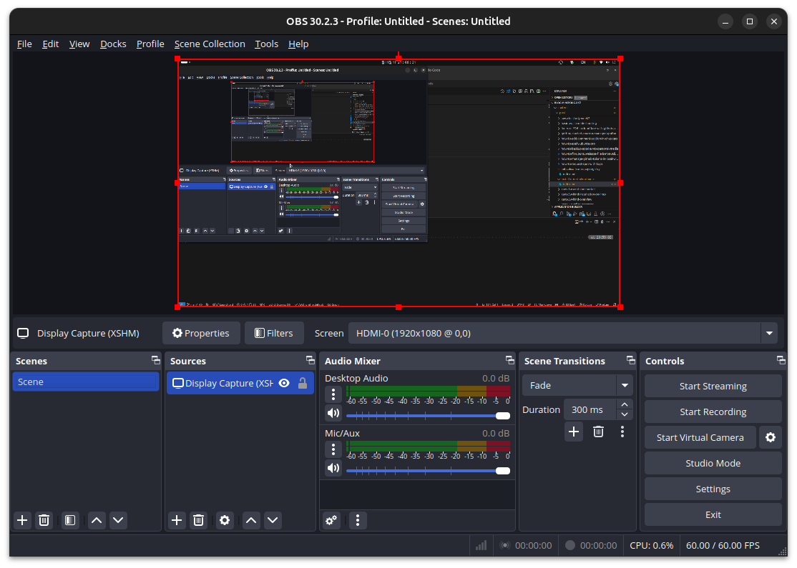

뭔가 내가 알려줘야하는데, 글로 쓰기 싫은 그런 날이 있다.  

그래서 있는 OBS Studio.  

Ubuntu도 22.04 LTS (Jammy Jellyfish) 이후부터는 OBS Studio를 APT repository를 통해 설치를 할 수 있다고 하여, 도전.  

- Installation: <https://obsproject.com/download>  

```bash
sudo add-apt-repository ppa:obsproject/obs-studio
sudo apt update
sudo apt install ffmpeg obs-studio
```

생각보다 오래 걸린다.  

```bash
sudo add-apt-repository ppa:obsproject/obs-studio
# [sudo] password for kkumtree: 
# Repository: 'Types: deb
# URIs: https://ppa.launchpadcontent.net/obsproject/obs-studio/ubuntu/
# Suites: noble
# Components: main
# '
# Description:
# Latest stable release of OBS Studio
# More info: https://launchpad.net/~obsproject/+archive/ubuntu/obs-studio
# Adding repository.
# Press [ENTER] to continue or Ctrl-c to cancel.
# Hit:1 https://packages.microsoft.com/repos/edge stable InRelease
# Hit:3 https://baltocdn.com/helm/stable/debian all InRelease                    
# Hit:2 https://prod-cdn.packages.k8s.io/repositories/isv:/kubernetes:/core:/stable:/v1.31/deb  InRelease
# Hit:4 http://security.ubuntu.com/ubuntu noble-security InRelease               
# Hit:5 https://ppa.launchpadcontent.net/graphics-drivers/ppa/ubuntu noble InRelease
# Hit:6 https://esm.ubuntu.com/apps/ubuntu noble-apps-security InRelease         
# Hit:7 https://esm.ubuntu.com/apps/ubuntu noble-apps-updates InRelease          
# Hit:8 https://esm.ubuntu.com/infra/ubuntu noble-infra-security InRelease       
# Get:9 https://ppa.launchpadcontent.net/obsproject/obs-studio/ubuntu noble InRelease [17.8 kB]
# Hit:10 https://esm.ubuntu.com/infra/ubuntu noble-infra-updates InRelease       
# Get:11 https://ppa.launchpadcontent.net/obsproject/obs-studio/ubuntu noble/main amd64 Packages [1,168 B]
# Get:12 https://ppa.launchpadcontent.net/obsproject/obs-studio/ubuntu noble/main Translation-en [160 B]
# Hit:13 http://kr.archive.ubuntu.com/ubuntu noble InRelease                     
# Hit:14 http://kr.archive.ubuntu.com/ubuntu noble-updates InRelease
# Hit:15 http://kr.archive.ubuntu.com/ubuntu noble-backports InRelease
# Fetched 19.1 kB in 3s (6,126 B/s)
# Reading package lists... Done
```

이미 업데이트가 된 느낌이긴 한데, 한번 더 하라니까 합니다.  

```bash
sudo apt-get update
# Hit:1 https://packages.microsoft.com/repos/edge stable InRelease
# Hit:3 http://kr.archive.ubuntu.com/ubuntu noble InRelease                      
# Hit:4 http://security.ubuntu.com/ubuntu noble-security InRelease               
# Hit:2 https://prod-cdn.packages.k8s.io/repositories/isv:/kubernetes:/core:/stable:/v1.31/deb  InRelease
# Hit:5 https://baltocdn.com/helm/stable/debian all InRelease                    
# Hit:6 http://kr.archive.ubuntu.com/ubuntu noble-updates InRelease              
# Hit:7 http://kr.archive.ubuntu.com/ubuntu noble-backports InRelease 
# Hit:8 https://ppa.launchpadcontent.net/graphics-drivers/ppa/ubuntu noble InRelease
# Hit:9 https://esm.ubuntu.com/apps/ubuntu noble-apps-security InRelease
# Hit:10 https://ppa.launchpadcontent.net/obsproject/obs-studio/ubuntu noble InRelease
# Hit:11 https://esm.ubuntu.com/apps/ubuntu noble-apps-updates InRelease
# Hit:12 https://esm.ubuntu.com/infra/ubuntu noble-infra-security InRelease
# Hit:13 https://esm.ubuntu.com/infra/ubuntu noble-infra-updates InRelease
# Reading package lists... Done
```

여기서 다운로드에 지연이 발생  

```bash
sudo apt-get install ffmpeg obs-studio
# Reading package lists... Done
# Building dependency tree... Done
# Reading state information... Done
# ffmpeg is already the newest version (7:6.1.1-3ubuntu5+esm2).
# ffmpeg set to manually installed.
# The following additional packages will be installed:
#   libfdk-aac2 libmbedtls14t64 libmbedx509-1t64 libqrcodegencpp1 libqt6xml6t64
#   libsrt1.5-openssl libxcb-composite0
# The following NEW packages will be installed:
#   libfdk-aac2 libmbedtls14t64 libmbedx509-1t64 libqrcodegencpp1 libqt6xml6t64
#   libsrt1.5-openssl libxcb-composite0 obs-studio
# 0 upgraded, 8 newly installed, 0 to remove and 14 not upgraded.
# Need to get 91.1 MB of archives.
# After this operation, 299 MB of additional disk space will be used.
# Do you want to continue? [Y/n] Y
# Get:1 http://kr.archive.ubuntu.com/ubuntu noble/universe amd64 libfdk-aac2 amd64 2.0.2-3~ubuntu4 [332 kB]
# Get:2 https://ppa.launchpadcontent.net/obsproject/obs-studio/ubuntu noble/main amd64 obs-studio amd64 30.2.3-0obsproject1~noble [90.2 MB]
# Get:3 http://kr.archive.ubuntu.com/ubuntu noble/universe amd64 libmbedx509-1t64 amd64 2.28.8-1 [46.6 kB]
# Get:4 http://kr.archive.ubuntu.com/ubuntu noble/universe amd64 libmbedtls14t64 amd64 2.28.8-1 [82.2 kB]
# Get:5 http://kr.archive.ubuntu.com/ubuntu noble/universe amd64 libqrcodegencpp1 amd64 1.8.0-1.2build1 [27.6 kB]
# Get:6 http://kr.archive.ubuntu.com/ubuntu noble/universe amd64 libqt6xml6t64 amd64 6.4.2+dfsg-21.1build5 [75.9 kB]
# Get:7 http://kr.archive.ubuntu.com/ubuntu noble/universe amd64 libsrt1.5-openssl amd64 1.5.3-1build2 [318 kB]
# Get:8 http://kr.archive.ubuntu.com/ubuntu noble/main amd64 libxcb-composite0 amd64 1.15-1ubuntu2 [5,304 B]
# Fetched 91.1 MB in 6min 18s (241 kB/s)                                         
# Selecting previously unselected package libfdk-aac2:amd64.
# (Reading database ... 272530 files and directories currently installed.)
# Preparing to unpack .../0-libfdk-aac2_2.0.2-3~ubuntu4_amd64.deb ...
# Unpacking libfdk-aac2:amd64 (2.0.2-3~ubuntu4) ...
# Selecting previously unselected package libmbedx509-1t64:amd64.
# Preparing to unpack .../1-libmbedx509-1t64_2.28.8-1_amd64.deb ...
# Unpacking libmbedx509-1t64:amd64 (2.28.8-1) ...
# Selecting previously unselected package libmbedtls14t64:amd64.
# Preparing to unpack .../2-libmbedtls14t64_2.28.8-1_amd64.deb ...
# Unpacking libmbedtls14t64:amd64 (2.28.8-1) ...
# Selecting previously unselected package libqrcodegencpp1:amd64.
# Preparing to unpack .../3-libqrcodegencpp1_1.8.0-1.2build1_amd64.deb ...
# Unpacking libqrcodegencpp1:amd64 (1.8.0-1.2build1) ...
# Selecting previously unselected package libqt6xml6t64:amd64.
# Preparing to unpack .../4-libqt6xml6t64_6.4.2+dfsg-21.1build5_amd64.deb ...
# Unpacking libqt6xml6t64:amd64 (6.4.2+dfsg-21.1build5) ...
# Selecting previously unselected package libsrt1.5-openssl:amd64.
# Preparing to unpack .../5-libsrt1.5-openssl_1.5.3-1build2_amd64.deb ...
# Unpacking libsrt1.5-openssl:amd64 (1.5.3-1build2) ...
# Selecting previously unselected package libxcb-composite0:amd64.
# Preparing to unpack .../6-libxcb-composite0_1.15-1ubuntu2_amd64.deb ...
# Unpacking libxcb-composite0:amd64 (1.15-1ubuntu2) ...
# Selecting previously unselected package obs-studio.
# Preparing to unpack .../7-obs-studio_30.2.3-0obsproject1~noble_amd64.deb ...
# Unpacking obs-studio (30.2.3-0obsproject1~noble) ...
# Setting up libfdk-aac2:amd64 (2.0.2-3~ubuntu4) ...
# Setting up libqrcodegencpp1:amd64 (1.8.0-1.2build1) ...
# Setting up libmbedx509-1t64:amd64 (2.28.8-1) ...
# Setting up libqt6xml6t64:amd64 (6.4.2+dfsg-21.1build5) ...
# Setting up libsrt1.5-openssl:amd64 (1.5.3-1build2) ...
# Setting up libxcb-composite0:amd64 (1.15-1ubuntu2) ...
# Setting up libmbedtls14t64:amd64 (2.28.8-1) ...
# Setting up obs-studio (30.2.3-0obsproject1~noble) ...
# Processing triggers for desktop-file-utils (0.27-2build1) ...
# Processing triggers for hicolor-icon-theme (0.17-2) ...
# Processing triggers for gnome-menus (3.36.0-1.1ubuntu3) ...
# Processing triggers for libc-bin (2.39-0ubuntu8.3) ...
# Processing triggers for mailcap (3.70+nmu1ubuntu1) ...
```  

일단 돌아는 간다. 캡처만 딸꺼라 상관없을 듯 합니다.  

  
