[CloudNet@](https://gasidaseo.notion.site/CloudNet-Blog-c9dfa44a27ff431dafdd2edacc8a1863)에서 진행하고 있는 CI/CD Study 3주차에는 Jenkins와 ArgoCD을 다뤘습니다.  

이번에는 kubernetes(이하, k8s)에 self-host Git과 Jenkins를 배포 후 CI/CD 부분을 다루도록 하겠습니다.  

하다보니 개인적으로, 아래 3가지가 주로 기억에 남았던 것 같습니다.  

- Docker UDS의 GID  
- Gitea와 Multibranch Pipeline의 결합
- Local PV의 Taint 및 Node 지정

> 해당 구성들은 아래 GitHub에 탑재되어 있습니다.  
> <https://github.com/kkumtree/ci-cd-cloudnet-study> 의 3w 폴더  

## 0. 실습 준비  

### (1) kind  

> kind 설치의 경우 다음 포스트를 참고할 수 있습니다.  
  > [리눅스에 KIND 설치하기 w/golang](../kans-2w-kind-installation-on-linux/)  
  > Docs: <https://kind.sigs.k8s.io/>  

kind를 통해, 로컬 환경에 k8s를 배포해보겠습니다.  

- networking.apiServerAddress:  
  ControlPlane에 접속하기 위한 주소 지정  
- nodes.extraPortMappings:  
  호스트의 포트를 kind의 각 노드 포트로 직접 연결 설정.  
  이를 통해, 호스트에서 kind 내부의 `NodePort` 서비스에 접근 가능  

```bash
# 3w/shells/kind/up-kind.sh
kind create cluster --name myk8s --image kindest/node:v1.32.8 --config - <<EOF
kind: Cluster
apiVersion: kind.x-k8s.io/v1alpha4
networking:
  apiServerAddress: "0.0.0.0"
nodes:
- role: control-plane
  extraPortMappings:
  - containerPort: 30000
    hostPort: 30000
  - containerPort: 30001
    hostPort: 30001
  - containerPort: 30002
    hostPort: 30002
  - containerPort: 30003
    hostPort: 30003
- role: worker
EOF
```


아래의 명령어로 `~/.kube/config` 권한 인증이 로드된 것을 확인합니다.  

```bash
kubectl get pod -v6
cat ~/.kube/config | grep 0.0.0.0
docker ps
docker images | grep kindest
```


### (2) kube-ops-view 설치  

  아래 커맨드를 입력하여 시각화 툴인 kube-ops-view를 설치합니다.  

  ```bash
  helm repo add geek-cookbook https://geek-cookbook.github.io/charts/
  helm install kube-ops-view geek-cookbook/kube-ops-view --version 1.2.2 --set service.main.type=NodePort,service.main.ports.http.nodePort=30001 --set env.TZ="Asia/Seoul" --namespace kube-system
  
  export NODE_PORT=$(kubectl get --namespace kube-system -o jsonpath="{.spec.ports[0].nodePort}" services kube-ops-view)
  export NODE_IP=$(kubectl get nodes --namespace kube-system -o jsonpath="{.items[0].status.addresses[0].address}")
  echo http://$NODE_IP:$NODE_PORT  
  # echo http://$NODE_IP:$NODE_PORT/#scale=2 # 배율
  ```

  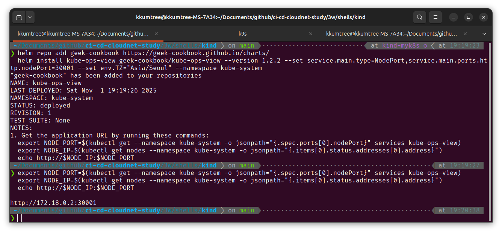
  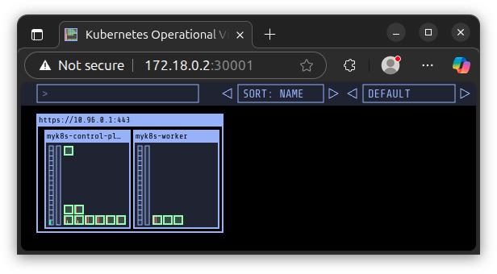

## 1. 각 어플리케이션 설정  

> Docker compose로 Jenkins 및 Gitea 배포하고 각각에 대한 설정을 해봅니다.  

### (1) 기본 배포 및 Jenkins 설정

  ```bash
  # 3w/cicd-labs/docker-compose.yaml
  # 아래 파일을 docker compose up -d 로 배포  
  services:

    jenkins:
      container_name: jenkins
      image: jenkins/jenkins:lts
      restart: unless-stopped
      networks:
        - cicd-network
      ports:
        - "8080:8080"
        - "50000:50000"                      
      volumes:
        - /var/run/docker.sock:/var/run/docker.sock
        - jenkins_home:/var/jenkins_home   
      # privileged: true

    gitea:
      container_name: gitea
      image: docker.gitea.com/gitea:1.25.0
      restart: unless-stopped
      networks:
        - cicd-network
      ports:
        - "10022:22"                         
        - "3000:3000"
      volumes:
        - ./gitea-data:/data
        - /etc/timezone:/etc/timezone:ro
        - /etc/localtime:/etc/localtime:ro 
      environment:
        - USER_UID=1000
        - USER_GID=1000

  volumes:
    jenkins_home:
    gitea-data:

  networks:
    cicd-network:
      driver: bridge
  ```

  

  > jenkins에 볼륨을 `**./**jenkins_home:/var/jenkins_home`으로 했을 경우, `permission error`가 발생합니다.  

    

  이후 정상적으로 배포되었는지 확인 후, Jenkins Admin 패스워드를 확인합니다.  

  ```bash
  for i in gitea jenkins ; do echo ">> container : $i <<"; docker compose exec $i sh -c "whoami && pwd"; echo; done
  ```  

  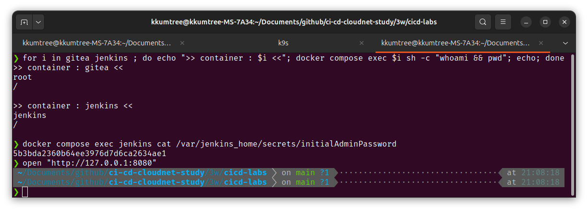  

  세팅할 때는 컨테이너가 Host에 접속할 수 있는 IP를 찾아서 변경합니다.  

  ```bash
  # 실습시 공유기 대역이 192.168.1.1/24 이었으므로, 해당 대역 검색 후 적용 
  ifconfig | grep 192.168 -C1
  # USB무선랜을 사용 중이어서, wlx로 시작되는 주소 사용  
  # virbr0: flags=4099<UP,BROADCAST,MULTICAST>  mtu 1500
  #         inet 192.168.122.1  netmask 255.255.255.0  broadcast 192.168.122.255
  #         ether 52:54:00:a3:a7:2c  txqueuelen 1000  (Ethernet)
  # --
  # wlx909f33eeed74: flags=4163<UP,BROADCAST,RUNNING,MULTICAST>  mtu 1500
  #         inet 192.168.1.25  netmask 255.255.255.0  broadcast 192.168.1.255
  #         inet6 fe80::14af:e:a003:b5ab  prefixlen 64  scopeid 0x20<link>
  ```

  
  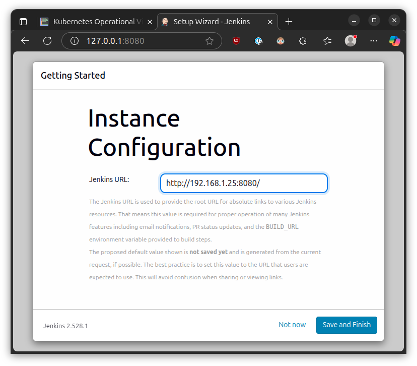

  또는 컨테이너들이 배포된 Docker 브릿지 주소를 활용할 수 있습니다.

  ```bash
  docker inspect gitea | grep Gateway
          # "Gateway": "",
          # "IPv6Gateway": "",
          #         "Gateway": "172.27.0.1",
          #         "IPv6Gateway": "",
  ifconfig | grep 172.27
          # inet 172.27.0.1  netmask 255.255.0.0  broadcast 172.27.255.255
  ```

  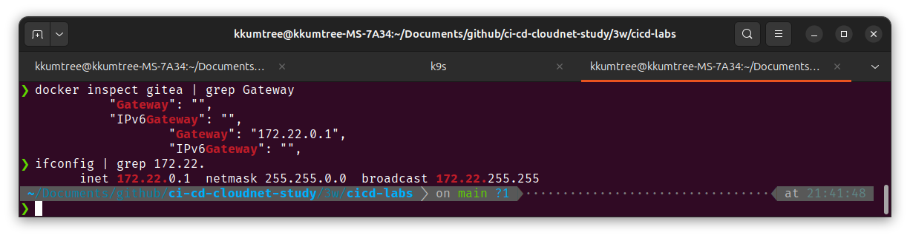

### (2) Jenkins의 Docker-out-of-Docker(DooD) 설정  

일반적인 DinD 으로 배포하려면, privileged 권한을 올려줘야합니다.  
~~더불어 여러 Job이 돌는 상황에는 그닥...~~  

그래서, 아래와 같은 구조로 바꾸기 위해 재구성합니다.  

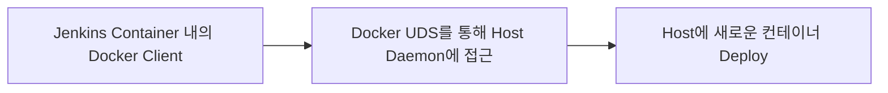
```mermaid
flowchart LR
  A --> B --> C  
  A[Jenkins Container 내의 Docker Client]  
  B[Docker UDS를 통해 Host Daemon에 접근]  
  C[Host에 새로운 컨테이너 Deploy]  
```

UDS로 접근하려면, Jenkins Container에 아래의 수정을 가합니다.  

- Docker client 설치  
- jenkins 유저에도 docker 실행권한 부여
  - 그룹 생성 및 유저 추가 `jenkins:docker`  

```bash
## 상승된 root 권한으로 접근
docker compose exec --privileged -u root jenkins bash
```

```bash
## jenkins 컨테이너 내에서 Docker Engine 설치 및 권한 부여

id # 현재 권한 확인
# uid=0(root) gid=0(root) groups=0(root)

## Docker Engine 클라이언트 설치  
## https://get.docker.com/ 출력 값을 변경하여, CLI만 설치하였습니다.  
## curl -fsSL https://get.docker.com -o get-docker.sh && sh get-docker.sh --dry-run
## 실습 당시 이미지는 Debian 기반  
## `docker-ce-cli`에 유의합니다.  

apt-get -qq update >/dev/null
DEBIAN_FRONTEND=noninteractive apt-get -y -qq install ca-certificates curl >/dev/null
install -m 0755 -d /etc/apt/keyrings
curl -fsSL "https://download.docker.com/linux/debian/gpg" -o /etc/apt/keyrings/docker.asc
chmod a+r /etc/apt/keyrings/docker.asc
echo "deb [arch=$(dpkg --print-architecture) signed-by=/etc/apt/keyrings/docker.asc] https://download.docker.com/linux/debian $(. /etc/os-release && echo "$VERSION_CODENAME") stable" > /etc/apt/sources.list.d/docker.list
apt-get -qq update >/dev/null
DEBIAN_FRONTEND=noninteractive apt-get -y -qq install docker-ce-cli curl tree jq yq wget >/dev/null

## jenkins 유저에도 Docker 실행권한 부여
# 작성 중 휴먼에러로, Docker 소켓의 권한이 바뀌어 롤백 후 아래와 같이 수정하였습니다.  
stat -c '%g' /var/run/docker.sock
groupadd -g $(stat -c '%g' /var/run/docker.sock) -f docker  
usermod -aG docker jenkins
grep docker /etc/group
grep jenkins /etc/group

exit
```

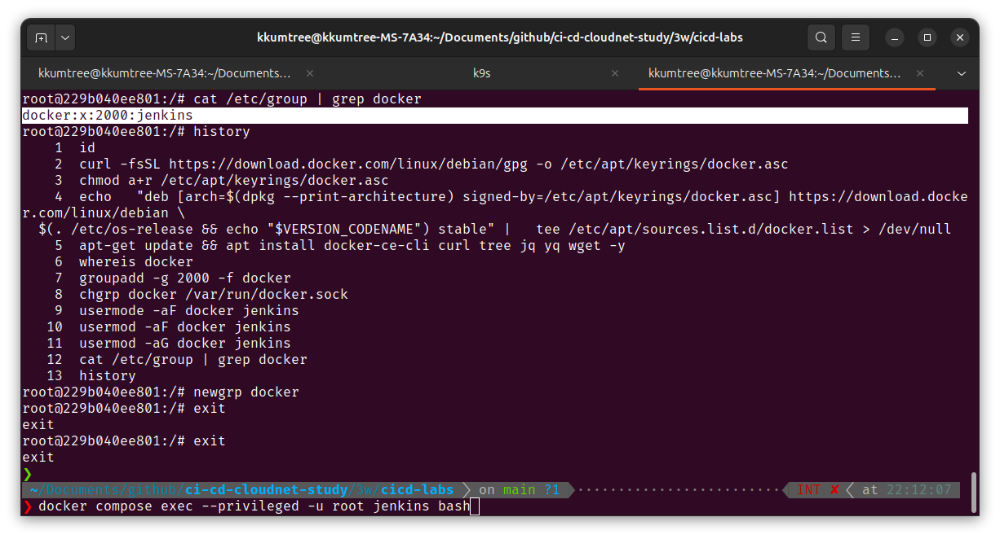

```bash
docker compose restart jenkins
docker compose exec jenkins id
docker compose exec jenkins docker info
docker compose exec jenkins docker ps
```

다시 확인합니다.  

`stat -c '%g' /var/run/docker.sock`의 경우,  
Host의 GID와 맞추지 않을 경우, Host 소켓도 사용 불능이 되어, GID를 맞추는 작업입니다.  
(Privileged 모드여서 가능한 부분)

  

### (3) Gitea 설정  

`Server Domain`과 `Gitea 기본 URL`을 Jenkins와 같이,  
호스트 IP(Docker Compose의 브릿지 게이트웨이)로 설정하였습니다.  

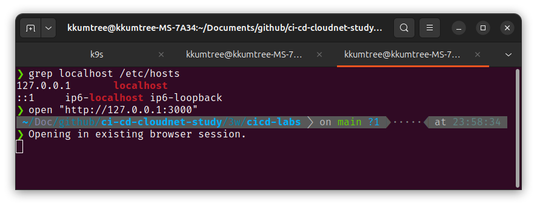

```bash
grep localhost /etc/hosts
# 127.0.0.1 localhost
# ::1     ip6-localhost ip6-loopback
open "http://127.0.0.1:3000"
```

당장의 접속은 localhost, 즉 `127.0.0.1`로도 무방합니다.  


추가로 관리자 계정도 설정합니다(옵션).  

  

### (4) Docker Token 생성  

[Docker](https://app.docker.com)에서 Personal Access Token(PAT)을 생성합니다.  
(Read, Write, Delete 모든 권한을 부여했습니다)


`dckr_pat_<난수>_<난수>` 형태를 가지며, 이 또한 메모해둡니다.  

## 2. 간단 배포 구성  

Jenkins 컨테이너가 Gitea와 DockerHub에서 리소스를 받고,  
빌드 후 kind 클러스터에 배포하도록 해봅니다.  

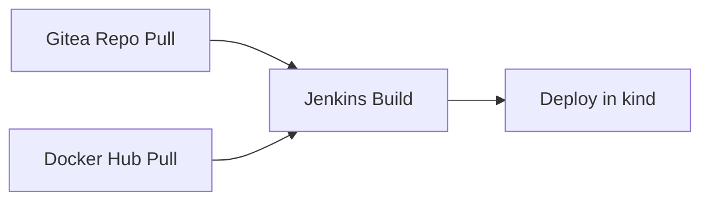
```mermaid
flowchart LR
  A --> C --> D
  B --> C

  A[Gitea Repo Pull]  
  B[Docker Hub Pull]  
  C[Jenkins Build]  
  D[Deploy in kind]  
```  

### (1) Gitea 소스코드 생성  

> Access Token을 활용하여, 평소와 같이 git clone/push를 해봅니다.  

Access Token도 만들어봅시다.  
(우측 상단의 설정 > 어플리케이션)  

이때, Token Permission에서 repository에 대한 `Read and Write`를 활성화 합니다.  

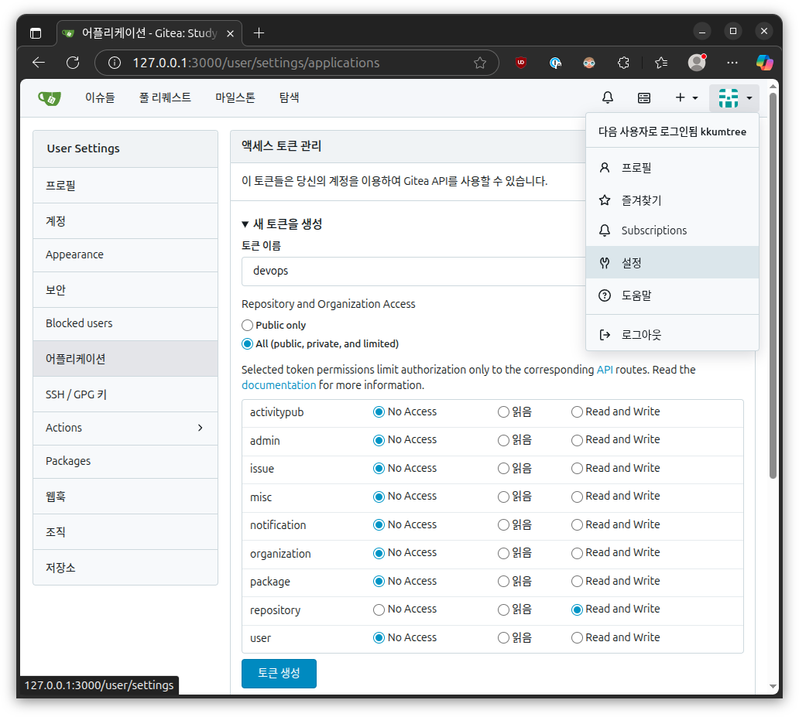  

다른 토큰들과 마찬가지로, 한번만 확인가능하니 따로 메모를 해둡니다.  

  

Private Repository들을 생성한 후에,  
토큰을 통해 호스트 IDE에서도 편집을 할수 있는지 확인해봅니다.  

```bash
TOKEN=1965eb8dbc1751a78d6f91dc9f0f8a8f9e48b1d8  
TOKEN_NAME=devops  
HOSTIP=172.27.0.1  
git clone http://$TOKEN_NAME:$TOKEN@$HOSTIP:3000/kkumtree/dev-app.git  
git clone git@172.27.0.1:kkumtree/dev-app.git test # 차단됨 확인  
git clone http://172.27.0.1:3000/kkumtree/dev-app.git test # ID/PW 정상 입력시 받음  
```  

마지막 케이스의 경우 ID/PW로 접근이 가능한데, 추후 막아보겠습니다.  

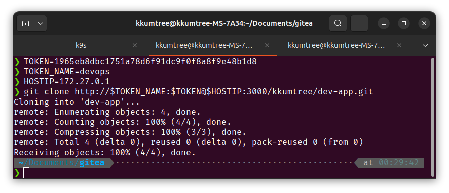  

Host IDE(VSCode)를 통해, 파일을 추가했습니다.  

```bash
## 실습파일 
## 3w/cicd-labs/dev-app 
# tree -a
# .
# ├── Dockerfile
# ├── .gitignore  # repo 생성 시, 함께 생성  
# ├── Jenkinsfile
# ├── README.md
# ├── server.py
# └── VERSION
```

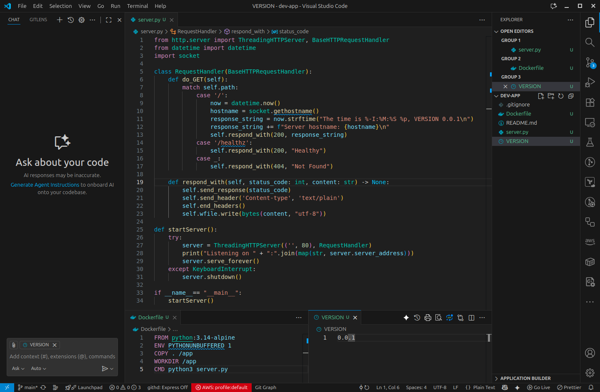  

평소 하듯이, 더하고 커밋하고 올려봅니다.  
이미, 토큰값이 있기 때문에 remote에 올라감을 알 수 있습니다.  

  

### (2) Gitea 조직 생성 및 개인 Repository 소유권 이전  

> Jenkins 플러그인과의 연동을 위해서, 많은게 바뀌어서 설정을 다시 진행했습니다.  

1. ORG 생성(선택/권장사항)  
  `새로운 조직`을 클릭하여, 조직을 생성합니다.  
    
2. 기존 Repository 소유권 이전  
  기존 레포(e.g. dev-app) 설정 맨 아래에 소유권 이전을 클릭합니다.  
  이때, 새 소유자는 새로 생성한 조직 이름으로 지정합니다.  
  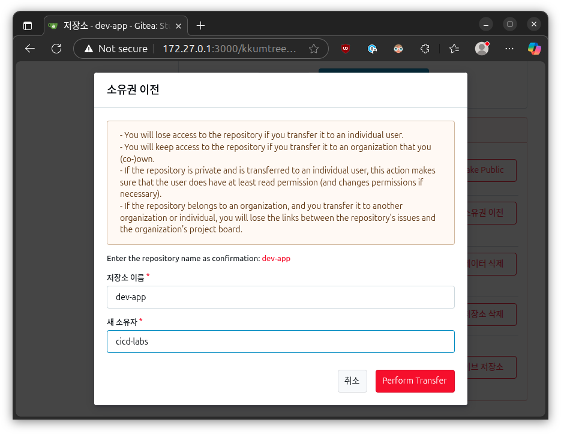  
3. Token 재 생성  
  조건 충족을 위해 아래의 권한을 부여합니다.  

- read:organization # 조직 권한을 읽습니다.  
- write:repository  # repository를 읽습니다.  
- read:user         # user의 정보를 읽습니다.  

### (3) Jenkins 플러그인 설치 및 Token 주입  

설치한 Plugin들은 아래와 같습니다.  

- [Docker Pipeline](https://plugins.jenkins.io/docker-workflow/)  
- [Pipeline: Stage View](https://plugins.jenkins.io/pipeline-stage-view/)  
- [Gitea](https://plugins.jenkins.io/gitea/)  

Gitea 서버 주소 및 토큰을 설정해봅니다.  
경로는 Manage -> System -> Gitea server 입니다.  
이전에 파악했던 Host IP와 포트번호를 입력합니다. 유효하면 Gitea 버전이 확인됩니다.  

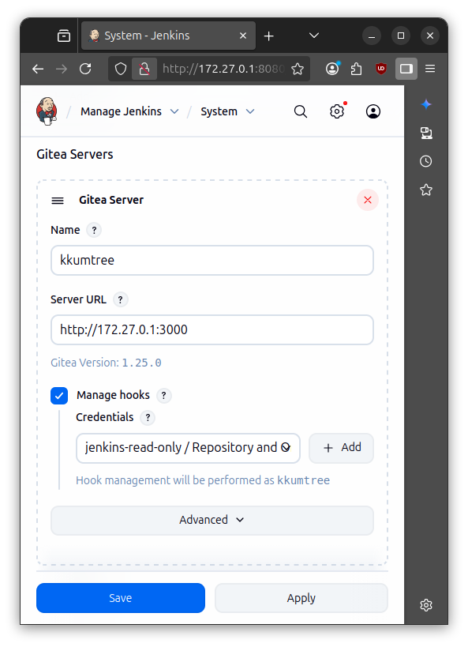  

(선택) Jenkins 및 Jenkins Node에서만 현재 상황을 파악할 수 있게 read-only 키를 별도 생성하였습니다.  

- read:organization  
- read:repository  
- read:user  

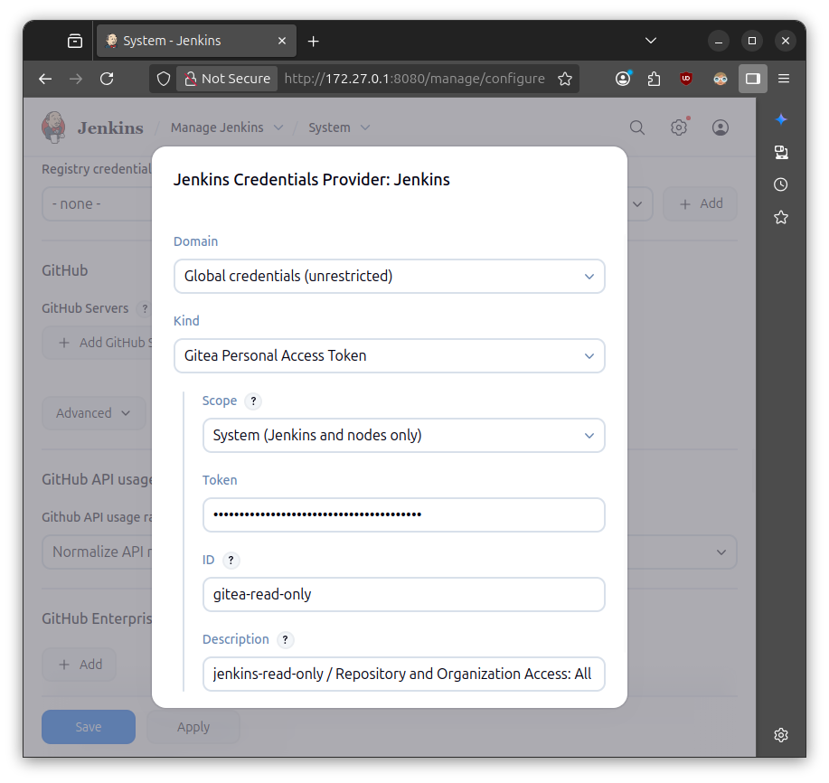  

New Item(혹은 Create a job) -> Orgnization Folder를 선택합니다.  

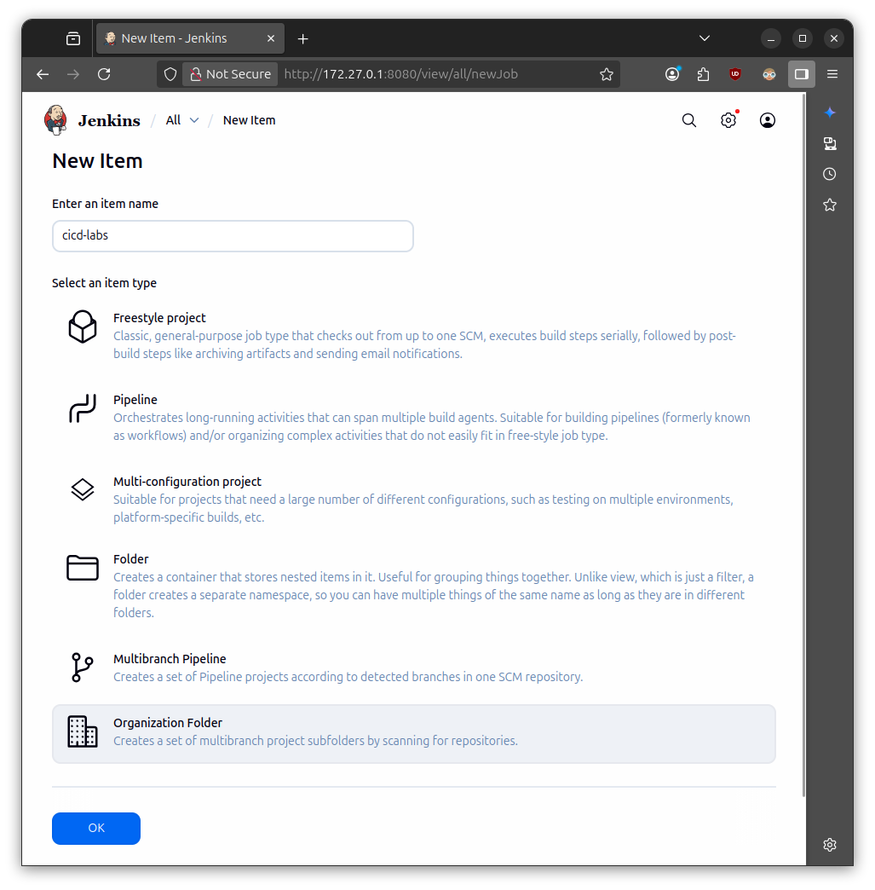  

Project -> Repository Sources -> Gitea Organization 을 클릭 후, 앞서 지정한 Server를 선택합니다.  
Behaviours는 Discover branches의 기본 Strategy 외에 제거합니다.  
이후 Repository Write 권한이 있는 Credential을 추가하기 위해, Add -> cicd-labs를 클릭합니다.  
Owner는 Token 발급 유저, 혹은 유저가 속한 Organization 이름을 기입합니다.  

  

Kind에서 Gitea Personal Access Token 선택 후, 임의 ID 지정 후 저장합니다.  

  

저장하면, organization(혹은, User)의 repository, branch 정보를 읽어옵니다.  

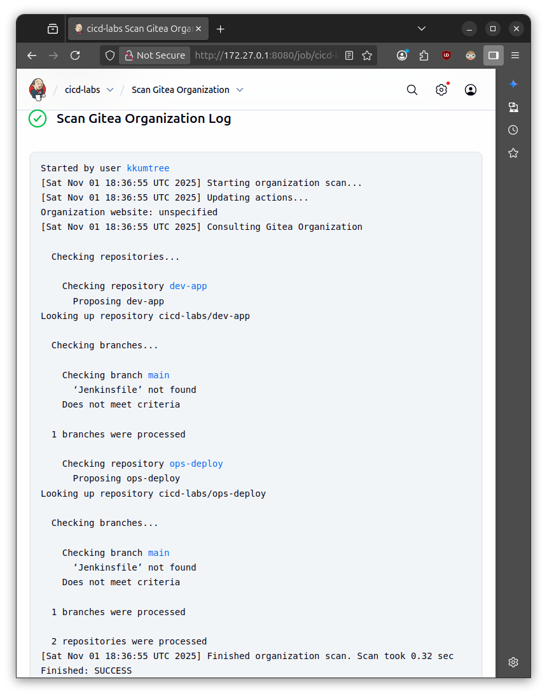  

마지막으로 Docker Token도 저장합니다.  
(Username and password. Username은 Docker 계정명)  

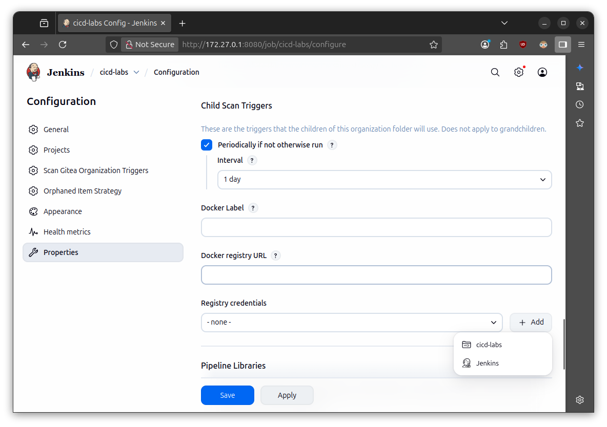  
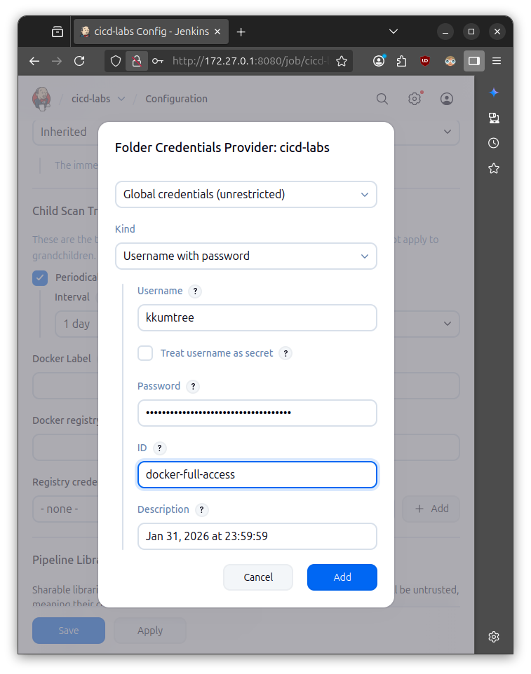  

### (4) 파이프라인 구성  

기존의 dev-app에 Jenkinsfile을 생성 후, Push 합니다.  
Jenkins Organization에서 `Scan Gitea Organizaton Now` 클릭 후,  
Log를 조회하면, Jenkinsfile을 발견했다고 하면서, Build를 시작합니다.  

  

상세를 보면, 빌드가 성공한 것을 확인할 수 있습니다.  

  

Docker Hub에도 정상 게시된 것을 확인할 수 있습니다.  

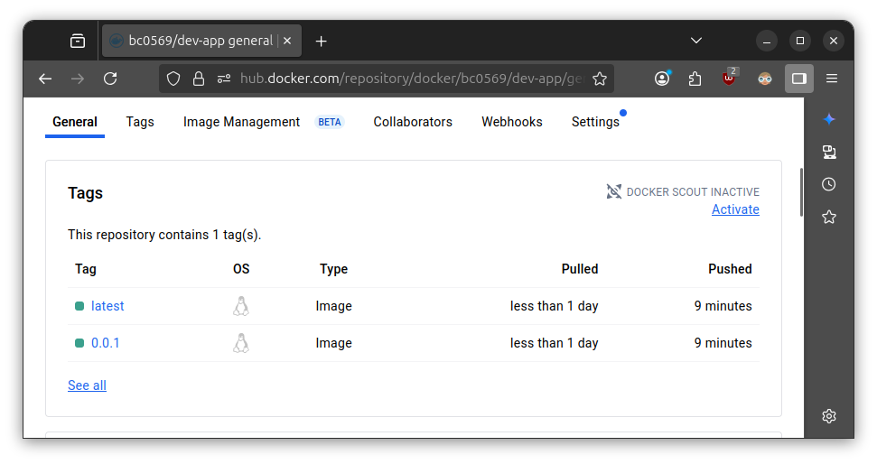

### (5) Helm으로 수동 배포  

해당 이미지를 가지고 Helm 파일로 만들어 배포를 해보았습니다.  

> 실습 파일들은 `/3w/helm` 에 있습니다.  

```bash
# tree
# .
# ├── Chart.yaml
# ├── templates
# │   ├── deployment.yaml
# │   └── service.yaml
# └── values.yaml
```

```bash
helm install timeserver .
```

  

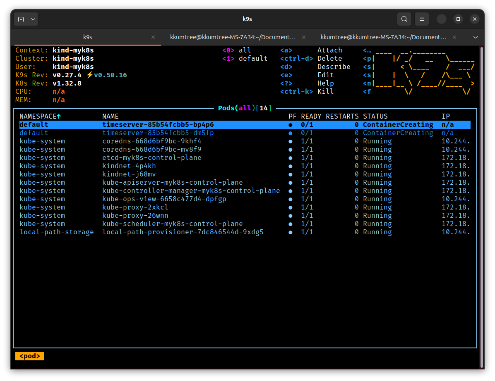  

```bash
for i in {1..100};  do curl -s http://127.0.0.1:30000 | grep name; done | sort | uniq -c | sort -nr
```

2개의 파드에서 분산되는 것을 확인하였습니다.  

  

replica를 4개로 늘려둔 후에도 골고루 분산되는 것을 알 수 있었습니다.  

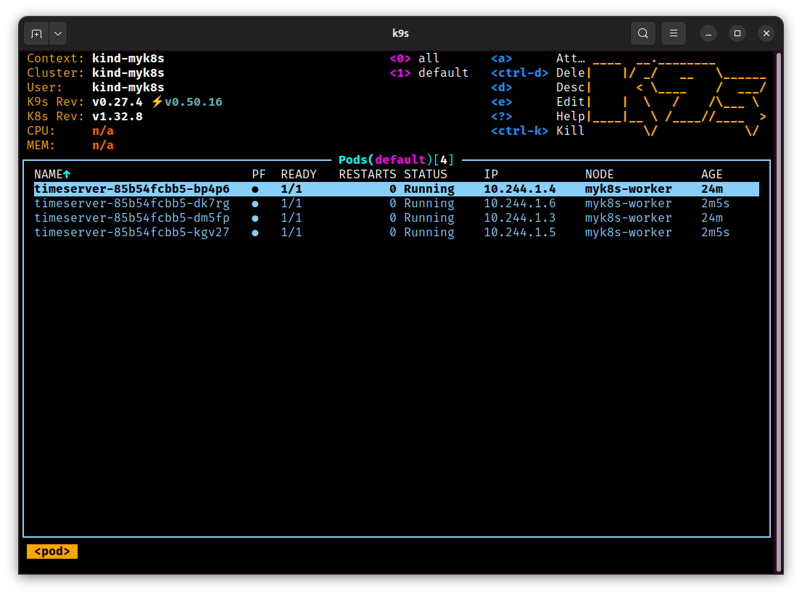


```bash
for i in {1..100};  do curl -s http://127.0.0.1:30000 | grep name; done | sort | uniq -c | sort -nr
    #  30 Server hostname: timeserver-85b54fcbb5-dk7rg
    #  26 Server hostname: timeserver-85b54fcbb5-kgv27
    #  24 Server hostname: timeserver-85b54fcbb5-dm5fp
    #  20 Server hostname: timeserver-85b54fcbb5-bp4p6
```

애플리케이션 0.0.1 버전에서 0.0.2 버전으로 소스코드를 변경한 후, 이를 Jenkins가 빌드한 이미지를 배포 해봅니다.  
git push 이후 `Scan Multibranch Pipeline Now`를 클릭하면 Docker Hub에 새 버전의 이미지 태그가 생성된 것 확인할 수 있습니다.  

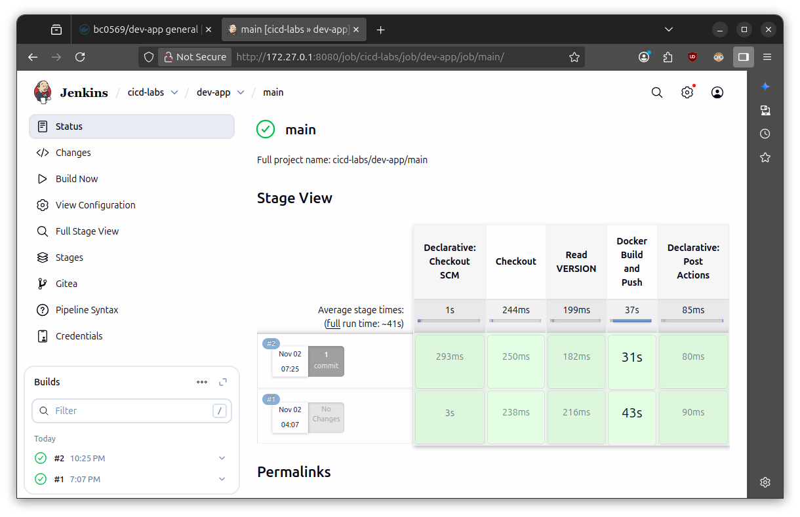
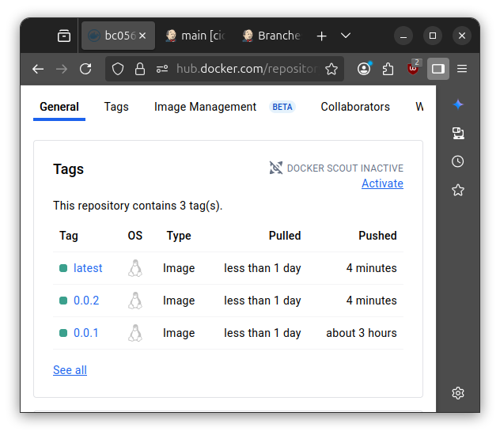  

다시 helm 변수를 바꿔서 배포해봅니다.  
새로운 버전의 Pod가 생성된 뒤, 기존 버전의 Pod가 순차적으로 사라짐을 확인하였습니다.  

```bash
helm upgrade timeserver --reuse-values --set image.tag="0.0.2" .
```

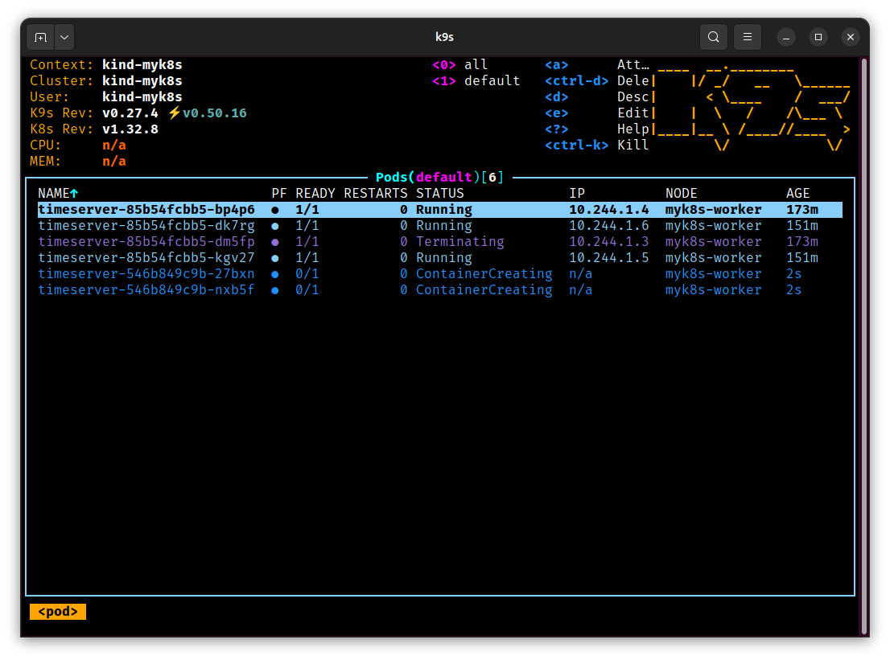  

## 3. kind cluster에 Jenkins 배포해보기  

대부분은 Jenkins의 문서를 참조하였습니다만,  
로컬(Kind)환경에 구성하다보니 다소 손을 봐야하는 부분을 다루어야 합니다.  

> 실습 파일들은 `/3w/jenkins-on-kind` 에 있습니다.  

```bash
# tree
# .
# ├── jenkins-01-volume.yaml
# ├── jenkins-01-volume.yaml.default  # 변경 비교를 위한 파일
# ├── jenkins-02-sa.yaml
# ├── jenkins-values.yaml
# └── jenkins-values.yaml.default     # 변경 비교를 위한 파일
```

### (1) Helm 템플릿 다운로드 및 배포  

```bash
curl https://raw.githubusercontent.com/jenkins-infra/jenkins.io/master/content/doc/tutorials/kubernetes/installing-jenkins-on-kubernetes/jenkins-01-volume.yaml -o jenkins-01-volume.yaml
curl https://raw.githubusercontent.com/jenkins-infra/jenkins.io/master/content/doc/tutorials/kubernetes/installing-jenkins-on-kubernetes/jenkins-02-sa.yaml -o jenkins-02-sa.yaml
curl https://raw.githubusercontent.com/jenkinsci/helm-charts/main/charts/jenkins/values.yaml -o jenkins-values.yaml
cp jenkins-01-volume.yaml jenkins-01-volume.yaml.default
cp jenkins-values.yaml jenkins-values.yaml.default
```

아래와 같이 부분적으로 변경하여야합니다.  

1. Local PV 폴더 생성 후, 권한 부여합니다.
  jenkins-01-volume.yaml에 의해서, 로컬 볼륨을 /data/jenkins-volume 으로 지정

    ```bash
    sudo mkdir -p /data/jenkins-volume
    sudo chown -R 1000:1000 /data/jenkins-volume
    ```

2. local로 바꾸고, nodeAffinity를 부여하여 Control Plane Taint 에러를 해소합니다.  
  이 경우에는 Worker Node를 특정하여, 해당 노드에만 Jenkins가 배포되게 지정했습니다.  

```bash
diff jenkins-01-volume.yaml jenkins-01-volume.yaml.default
# 13c13
# <   local:
# ---
# >   hostPath:
# 15,22d14
# <   nodeAffinity:
# <     required:
# <       nodeSelectorTerms:
# <       - matchExpressions:
# <         - key: kubernetes.io/hostname
# <           operator: In
# <           values:
# <             - myk8s-worker
```

### (2) values.yaml 수정  

  앞서 PV 및 SA를 생성하였으므로 values에 이를 비활성화 하고,  
  NodePort로 열어두며, namespace를 jenkins로 지정해둡니다.  

```bash
diff jenkins-values.yaml jenkins-values.yaml.default
# 4d3
# < name: jenkins
# 226,227c225
# <   serviceType: NodePort
# <   # serviceType: ClusterIP
# ---
# >   serviceType: ClusterIP
# 236c234
# <   nodePort: 30003           # kind 배포 시, 열어두었던 nodePort 사용  
# ---
# >   nodePort:
# 1273c1271
# <   storageClass: jenkins-pv
# ---
# >   storageClass:
# 1339,1340c1337
# <   create: false
# <   # create: true
# ---
# >   create: true
# 1344c1341
# <   name: jenkins
# ---
# >   name:
```

### (3) 배포 및 진입  

```bash
# Helm Chart 추가
helm repo add jenkinsci https://charts.jenkins.io
helm repo update

kubectl apply -f jenkins-01-volume.yaml
kubectl apply -f jenkins-02-sa.yaml
helm install jenkins -n jenkins -f jenkins-values.yaml jenkinsci/jenkins

# 출력 암호
kubectl exec --namespace jenkins -it svc/jenkins -c jenkins -- /bin/cat /run/secrets/additional/chart-admin-password && echo

# 노드 포트 및 IP 주소를 통해 주소 획득
export NODE_PORT=$(kubectl get --namespace jenkins -o jsonpath="{.spec.ports[0].nodePort}" services jenkins)  
export NODE_IP=$(kubectl get nodes --namespace jenkins -o jsonpath="{.items[0].status.addresses[0].address}")  
echo http://$NODE_IP:$NODE_PORT
```

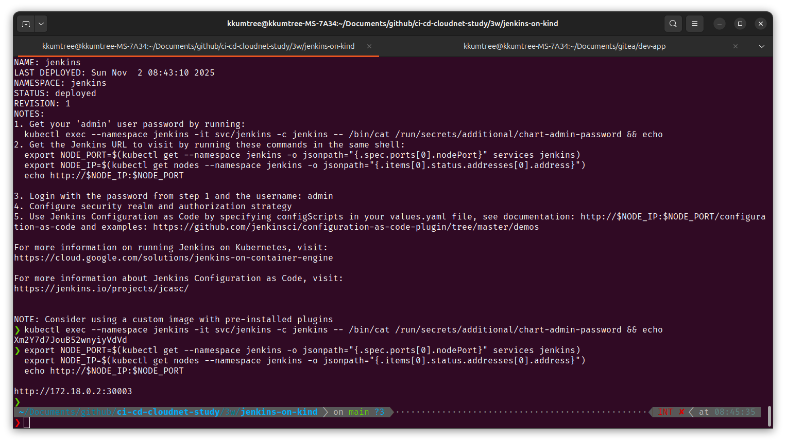  

마지막 출력 값을 주소창에 넣어 접속합니다.  

### (2) Jenkins 내부 설정  

리버스 프록시에 문제가 있으므로 다시 Jenkins URL을 `http://$NODE_IP:$NODE_PORT`로 수정합니다.  
(관리 > System > Jenkins URL )

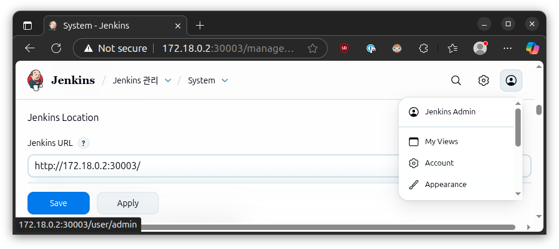  

플러그인은 이렇게 설치합니다.  

- [Docker Pipeline](https://plugins.jenkins.io/docker-workflow/)  
- [Pipeline: Stage View](https://plugins.jenkins.io/pipeline-stage-view/)  
- [Gitea](https://plugins.jenkins.io/gitea/)  
- [Gitea PAT Kubernetes Credentials](https://plugins.jenkins.io/gitea-pat-kubernetes-credentials/)  

## Reference

- [Docker/Jenkins](https://www.jenkins.io/doc/book/installing/docker/#on-macos-and-linux)  
- [How to Install and Run Jenkins With Docker Compose/CloudBees](https://www.cloudbees.com/blog/how-to-install-and-run-jenkins-with-docker-compose)  
- [Docker inside Docker for Jenkins/ITNEXT](https://itnext.io/docker-inside-docker-for-jenkins-d906b7b5f527)  
- [Jenkins Docker-outside-of-Docker with Nexus Registry/NelsonMaty](https://github.com/NelsonMaty/docker-outside-of-docker-example)  
- [Ubuntu Tutorial: Jenkins + Gitea + Docker/TMVTech](https://www.tmvtech.com/ubuntu-tutorial-jenkins-gitea-docker/)  
- [How to integrate Gitea and Jenkins/mike42.me](https://mike42.me/blog/2019-05-how-to-integrate-gitea-and-jenkins)  
- [Quick Jenkins Setup with Kubernetes in Docker(kind) and Helm in 5 minutes/PrincipalOfTech](https://principaloftech.medium.com/so-kind-of-helm-using-kind-kubernetes-in-docker-helm-for-quick-jenkins-setup-587252d787f6)  
- [Kubernetes/Jenkins](https://www.jenkins.io/doc/book/installing/kubernetes/#install-jenkins-with-helm-v3)  
