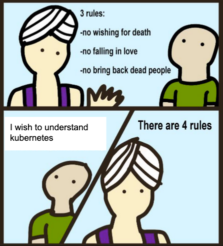

최근 [CloudNet@](https://gasidaseo.notion.site/24-3-df0466c474ff40528e37b24bfdfe9d0f)에서 진행하고 있는 **K**8s **A**dvanced **N**etwork **S**tudy(이하, KANS)에 참여하게 되었습니다.  
~~난이도를 생각하면 KH(Hardcore)NS가 더 맞아보이지만...~~

k8s가 워낙 인기가 많기도 하지만, Pod 간 통신에는 많은 지식이 투여되기에 이번 기회에 살펴보기로 했습니다.  

  

첫 주차는, 바로 Kubernetes에 진입하지 않고 Containerization에 대한 이해를 먼저 다뤄주셨습니다.  
여타 쿠버네티스 강의와 달리 9주 간 매주 일요일에만 진행되는 세션인데도, 기반 기술을 다시 짚어주셔서 감사했습니다.  

## 1. AWS EC2 Instance 셋업  

CloudFormation을 통해, EC2 및 제반사항을 구성하여 주셨습니다만, 취미 삼아 Terraform 변환 작업을 해보았습니다. ~~하지 말았어야했는데...~~ LoL  

- [cf2tf](https://github.com/DontShaveTheYak/cf2tf) 툴이 많이 개선된 거 같아, 이번 기회에 다시 사용해보았으나 잘못 구성해준 사항을 고치느라 오히려 시간이 많이 소요되었습니다.  

처음부터 직접 구성하는게 더 빠르지 않았을 까란 생각도 들었고 현 시점에서 멱등성이 제대로 구현이 안되서 께름칙합니다만, 아래 링크에서 확인할 수 있습니다. 시간이 허락해준다면 `*.auto.tfvars` 에 대해서는 별도의 포스팅으로 다룰 수 있도록 해보겠습니다.  

- [[Github/kans](https://github.com/kkumtree/kans/tree/week1)]: Branch `week1`(dc37074). Output만 변경했는데도, 인스턴스 교체가 이루어지는 사소한 이슈가 있습니다. 그리고 인바운드 규칙은 나중에 수정하셔야하는 부분입니다.  

AWS 웹콘솔에서 `Launch Instance` 기본값과 크게 다른 사항은 Root ENI에 Subnet 대역 내의 Private IP를 고정 할당해주는 것이었습니다.  

## 2. Docker 셋업  

근래에는 Docker가 당연하다시피 되어 참 다행(과연...?)이라고 생각하는데, 개인용으로 Docker는 [Snapcraft](https://snapcraft.io/about)로 쓰는지라 이때부터 험난했습니다;  

Ubuntu에 Docker를 설치하지 않았다면 아래처럼 안내를 보실 수 있을텐데,  
snap과 podman-docker 설명 외에는 Docker Docs를 보시기를 권장합니다.  

```shell
ubuntu@MyServer:~/kans$ docker network create kankins

Command 'docker' not found, but can be installed with:
sudo snap install docker         # version 24.0.5, or
sudo apt  install docker.io      # version 24.0.7-0ubuntu2~22.04.1
sudo apt  install podman-docker  # version 3.4.4+ds1-1ubuntu1.22.04.2
See 'snap info docker' for additional versions.
```

### 설치 방법

1. [Docker Docs](https://docs.docker.com/engine/install/ubuntu/#installation-methods)
   - [One-click Shell Scripting](https://get.docker.com/): 세상 좋아졌네요.. EC2에는 이걸로 설치했습니다.  
   - APT Repository: 보통은 이걸 세팅합니다.  
2. [Snapcraft/Docker](https://snapcraft.io/docker)  

설치했다면 Docker 사용자에게 권한상승을 해줘야, ~~귀찮은~~ sudo를 생략할 수 있습니다.  

말은 즉슨, 개인용이니 어느정도는 감안하셔서 사용하시면 된다는 의미이지요. 각 방법 별 권한상승 방법은 아래와 같습니다.  
스터디을 진행해주신 gasida님의 말씀대로 해당 세션을 빠져나온(Logout) 후 다시 접속해야합니다.  

`세상에 안되는게 어딨어`하고 좀 찾아보니 하위 쉘을 열면 어느 정도 가능해보이는데, 스터디 하다가 꼬이면 다시 테라폼 올려야해서 그냥 로그아웃했습니다; 이 부분 궁금하신 분은 reference의 stackoverflow를 참고해주세요.  

```bash
# (0) One-click Installation
curl -fsSL https://get.docker.com -o get-docker.sh  
sudo sh get-docker.sh  

# (1) APT based
sudo groupadd docker
sudo usermod -aG docker $USER
newgrp docker
## Logout and Login Needed for session 

# (2) Snap based
sudo addgroup --system docker
sudo adduser $USER docker
newgrp docker
sudo snap disable docker
sudo snap enable docker
```  

## 3. Jenkins 이미지를 구워서 올려보자  

- 이번 세션에서 제일 쉬워보이는 과제였는데, 매번 픽이 이상한 거 같습니다.  

취미 빼고 Jenkins를 마지막으로 다뤄본게 2년 전이라, 겸사겸사 이정도면 눈감고 하겠지~ 했는데 사소한게 바뀐거 같아서 시간이 많이 소요되었습니다.  

- 사소한 것 목록
  - Documentation  
  - Base Image: Debian 2 Ubuntu  

별도로, DockerHub는 Official 이미지는 6년도 지났겠다. [Deprecated](https://hub.docker.com/_/jenkins) 명시를 떠나, Prune 한번만 해줬으면 좋겠습니다.  

### (0) Document 유의사항  

Jenkins가 다 좋은데, 신규 유저용 [공식문서](https://www.jenkins.io/doc/book/installing/docker/#on-macos-and-linux) 링크만 던져주기에는 살짝 미묘한 점이 있습니다.  

`On macOS and Linux`의 (4)항에서 Debian을 베이스로 하지만, 이는 최신버전에서는 적용이 되지 않습니다.  

작성일 기준으로 `jenkins/jenkins:lts-jdk17` 이미지를 사용 시, Ubuntu 베이스로 변경되었습니다.  
무슨 사연이 있는지는 모르겠지만, 당연히 [GPG](https://blog.ubuntu-kr.org/2023/09/11/key-signing-and-encrypt-messages-with-gnupg/) 키사이닝 값이 다르니 터지는...  
DinD 주제도 같이 다뤄보려고 했다가 시간이 부족해져서, 기본적인 부분만 다뤄보겠습니다.  

### (1) 브릿지 생성 및 Dockerfile 작성  

- Docs대로라면 이렇게 만들어야 될 겁니다.  
- 하지만, 기본값의 네트워크를 쓰는 것은 보통 권장사항은 아니며, 나중에 브릿지가 궁금하시면 [[Docker Docs#Use user-defined bridge networks](https://docs.docker.com/engine/network/tutorials/standalone/#use-user-defined-bridge-networks)] 참고하시면 됩니다.  
- 특히 Dockerfile 작성 부분에서 혼을 담아 설명해주셔서, 글 한번 읽고 아 Docker가 그랬었지하고 넘어갈 수 있었습니다.  

```bash
# 1-1. Bridge Network 
docker network create kankins

# 1-2. Dockerfile 
cat <<EOF>Dockerfile
FROM jenkins/jenkins:lts-jdk17
USER root
RUN apt-get update && apt-get install -y lsb-release
RUN curl -fsSLo /usr/share/keyrings/docker.asc \
  https://download.docker.com/linux/ubuntu/gpg
RUN echo "deb [arch=$(dpkg --print-architecture) \
  signed-by=/usr/share/keyrings/docker.asc] \
  https://download.docker.com/linux/ubuntu \
  $(lsb_release -cs) stable" > /etc/apt/sources.list.d/docker.list
RUN apt-get update && apt-get install -y docker-ce-cli
USER jenkins
RUN jenkins-plugin-cli --plugins "blueocean docker-workflow"
EOF
```

### (2) 이미지 빌드 및 실행

```bash
# 2. Build 
docker build -t kankins-redocean:lts-jdk17-240818 . 

# 3. Run
docker run \
  --name kankins-redocean \
  --restart=on-failure \
  --detach \
  --network kankins \
  --env DOCKER_HOST=tcp://docker:2376 \
  --env DOCKER_CERT_PATH=/certs/client \
  --env DOCKER_TLS_VERIFY=1 \
  --publish 7969:8080 \
  --publish 50000:50000 \
  --volume jenkins-data:/var/jenkins_home \
  --volume jenkins-docker-certs:/certs/client:ro \
  kankins-redocean:lts-jdk17-240818

# 4. Get Initial Password

docker exec -it kankins-redocean \
  cat /var/jenkins_home/secrets/initialAdminPassword
```

### (3) 자잘한 밑정리

테라폼 코드 변환 중에 인바운드 허용이 막혀있다는 걸, 이때 깨닫고 웹콘솔로 수정...  


키 입력과 추가 플러그인 설치, 어드민 로그인을 웹페이지로 해야한다는 점이 매우 불안정해보이고, 거슬리는 부분입니다. 여하간 설치가 끝났고 접속**은** 됩니다. 해보니... 으-음  

  

- 로그가 떠서 행복하군요 :)  

```bash  
#ubuntu@MyServer:~/kans$ docker logs da 2>&1 | grep -i SEVERE
2024-09-01 02:08:30.398+0000 [id=32]	SEVERE	jenkins.InitReactorRunner$1#onTaskFailed: Failed Loading plugin Token Macro Plugin v400.v35420b_922dcb_ (token-macro)
2024-09-01 02:08:30.400+0000 [id=33]	SEVERE	jenkins.InitReactorRunner$1#onTaskFailed: Failed Loading plugin Favorite v2.221.v19ca_666b_62f5 (favorite)
2024-09-01 02:08:30.401+0000 [id=34]	SEVERE	jenkins.InitReactorRunner$1#onTaskFailed: Failed Loading plugin REST Implementation for Blue Ocean v1.27.14 (blueocean-rest-impl)
2024-09-01 02:08:30.406+0000 [id=34]	SEVERE	jenkins.InitReactorRunner$1#onTaskFailed: Failed Loading plugin GitHub plugin v1.40.0 (github)
2024-09-01 02:08:30.407+0000 [id=34]	SEVERE	jenkins.InitReactorRunner$1#onTaskFailed: Failed Loading plugin GitHub Branch Source Plugin v1797.v86fdb_4d57d43 (github-branch-source)
2024-09-01 02:08:30.413+0000 [id=33]	SEVERE	jenkins.InitReactorRunner$1#onTaskFailed: Failed Loading plugin Pipeline implementation for Blue Ocean v1.27.14 (blueocean-pipeline-api-impl)
2024-09-01 02:08:30.414+0000 [id=33]	SEVERE	jenkins.InitReactorRunner$1#onTaskFailed: Failed Loading plugin Bitbucket Pipeline for Blue Ocean v1.27.14 (blueocean-bitbucket-pipeline)
2024-09-01 02:08:30.416+0000 [id=33]	SEVERE	jenkins.InitReactorRunner$1#onTaskFailed: Failed Loading plugin Events API for Blue Ocean v1.27.14 (blueocean-events)
2024-09-01 02:08:30.417+0000 [id=31]	SEVERE	jenkins.InitReactorRunner$1#onTaskFailed: Failed Loading plugin Git Pipeline for Blue Ocean v1.27.14 (blueocean-git-pipeline)
2024-09-01 02:08:30.418+0000 [id=33]	SEVERE	jenkins.InitReactorRunner$1#onTaskFailed: Failed Loading plugin GitHub Pipeline for Blue Ocean v1.27.14 (blueocean-github-pipeline)
2024-09-01 02:08:30.419+0000 [id=31]	SEVERE	jenkins.InitReactorRunner$1#onTaskFailed: Failed Loading plugin Blue Ocean Pipeline Editor v1.27.14 (blueocean-pipeline-editor)
2024-09-01 02:08:30.420+0000 [id=33]	SEVERE	jenkins.InitReactorRunner$1#onTaskFailed: Failed Loading plugin Blue Ocean v1.27.14 (blueocean)
```  

```bash  
# ubuntu@MyServer:~/kans$ docker logs da 2>&1 | grep -i missing
 - Plugin is missing: json-path-api (2.8.0-5.v07cb_a_1ca_738c)
```  

- https://plugins.jenkins.io/json-path-api/dependencies/  

이후의 내용은 아래에서 수정하면서 다루겠습니다.  

## 4. 브릿지 없이 해보자...?

- docker는 de facto이니, 컨테이너 끄고 이미지 지우는 건 생략(서술 안해도 되서 편하다...)
  - 별도 생성한 bridge는 더이상 사용하지 않으니, 지워주시면 됩니다.  
  - 빠른 실행을 위해, 초기 구동 시 생성된 volume은 삭제하지 않았습니다.  
- 이번에는 브릿지를 생성하지 않고, Host의 Docker 데몬을 사용해보겠습니다.(?)  

사실 저도 무슨 말인가 생각하고 있습니다. ~~보통 거꾸로 아님..?~~  

### (1) Dockerfile 작성

앞서 오류를 알았으니, 포스팅 작성 시점 기준으로 한번 수정해보겠습니다. 수정하고 나니, 위의 오류**는** 잡았네요.  

```bash
cat <<EOF>Dockerfile
FROM jenkins/jenkins:lts-jdk17
USER jenkins
RUN jenkins-plugin-cli --plugins \
  blueocean \
  docker-workflow \
  antisamy-markup-formatter \
  json-path-api \
  token-macro \
  build-timeout \
  timestamper \
  resource-disposer \
  ws-cleanup \
  ant \
  gradle \
  workflow-aggregator \
  github \
  github-branch-source \
  pipeline-github-lib \
  metrics \
  pipeline-graph-view \
  eddsa-api \
  trilead-api \
  ssh-slaves \
  matrix-auth \
  pam-auth \
  ldap \
  email-ext \
  theme-manager \
  dark-theme
EOF
```

- 오-옹. CD 한 장에는 절대 넣을 수 없는 웅장한 이미지가 탄생하였습니다! :)  

```bash
# ubuntu@MyServer:~/kans$ docker build -t kankins-redocean:lts-jdk17-240818 . 

# ubuntu@MyServer:~/kans$ docker images
REPOSITORY         TAG                IMAGE ID       CREATED          SIZE
kankins-redocean   lts-jdk17-240818   ecd80984a2ae   23 minutes ago   824MB
```  

### (2) 컨테이너 실행  

- 브릿지를 사용하지 않는대신, Host의 Docker 런타임의 소켓을 공유해보겠습니다.  

| 구분 | Moby | Host(From) | Container(To) | Notes |  
| --- | --- | --- | --- | --- |  
| As-is | bridge(local) | - | - | Default |  
| As-is | volume | jenkins-docker-certs | /certs/client | DinD 데몬의 인증서 |
| As-is | env | - | - | DOCKER_HOST=tcp://docker:2376 (제거) |
| As-is | env | - | - | DOCKER_CERT_PATH=/certs/client (제거) |
| As-is | env | - | - | DOCKER_TLS_VERIFY=1 (제거) |
| To-be | volume | /var/run/docker.sock | /var/run/docker.sock | Host의 Docker Unix Socket |  
| To-be | volume | /usr/bin/docker | /usr/bin/docker | Host의 Docker Engine(Client) |  

```bash
docker run \
  --name kankins-redocean \
  --restart=on-failure \
  --detach \
  --volume /var/run/docker.sock:/var/run/docker.sock \
  --volume /usr/bin/docker:/usr/bin/docker \
  --publish 7969:8080 \
  --publish 50000:50000 \
  --volume jenkins-data:/var/jenkins_home \
  kankins-redocean:lts-jdk17-240818
```

### (3) Container의 Jenkins 유저에 권한 부여

- Host의 Docker 데몬을 사용하려면, Container의 Jenkins 유저에 권한을 부여해야합니다.  
  기존의 Dockerfile에서는 Docker TLS 활성화 및 별도의 Docker 볼륨을 물렸지만, 다 내려놓았습니다.  

```bash
# 1. Container의 Docker 소켓의 GID 확인
docker exec --user 0 kankins-redocean stat -c '%g' /var/run/docker.sock  
# 2. Docker 그룹의 사용자가 Docker 소켓을 사용할 수 있도록 허용
docker exec --user 0 kankins-redocean groupadd -g $(docker exec --user 0 kankins-redocean stat -c '%g' /var/run/docker.sock) docker  
# 3. Host의 Docker 그룹에 Jenkins 유저 추가  
docker exec --user 0 kankins-redocean usermod -aG docker jenkins  
# (선택) 권한 확인
docker exec --user jenkins kankins-redocean docker ps
```

- 이후, Host(EC2)에서 Docker를 재시작하여 허용했습니다.  

```bash
sudo service docker restart
systemctl restart docker
```

### (4) Jenkins Pipepline

- 이미 작년 8월에 하셨던 분의 [포스팅](https://www.handongbee.com/posts/Docker-%EB%93%A4%EC%97%AC%EB%8B%A4%EB%B3%B4%EA%B8%B0/)을 참조하여 파이프라인을 돌렸으나, 가볍게 Nginx 돌려보고 마치겠습니다.  

```groovy
pipeline {
  agent any
  stages {
    stage('Start Nginx') {
      steps {
        sh '''echo "pwd: \\$\\$$(pwd)\\$\\$"
echo "whoami: \\$\\$$(whoami)\\$\\$"
docker run --name docker-nginx -p 80:80 -d nginx:stable-alpine'''
      }
    }

  }
}
```

접속도 정상적으로 확인됩니다.  


Nginx가 Host에서 구동하는 것을 확인하였습니다.  
또한 Host의 Docker 데몬을 사용하였기에, 이미지를 확인해볼 수 있습니다.

```bash
# ubuntu@MyServer:~/kans$ docker images
REPOSITORY             TAG                IMAGE ID       CREATED          SIZE
simple-jenkins-image   latest             131b4e942d9a   35 minutes ago   7.8MB
kankins-redocean       lts-jdk17-240818   c771835009b8   54 minutes ago   616MB
nginx                  stable-alpine      9703b2608a98   2 weeks ago      43.3MB
alpine                 latest             324bc02ae123   5 weeks ago      7.8MB
```

## 5. Why...?  

### (1) Unix 소켓 통신 마운트

- 중간에 이미 `/var/run/docker.sock` 의 권한을 허용하면서 눈치 채셨겠지만, 이는 TCP/IP 대신, Unix Socket을 활용하여 접근을 하였습니다. 
- 널널한 개발자님의 [Youtube 영상(15:54~)](https://youtu.be/zh0OMXg2Kog?si=7WsuIA4nV261Yh6V&t=954) 에도 친절히 나와있지만, Host의 도커 엔진의 소켓과 바이너리를 Jenkins 컨테이너에게 마운트 함으로서 통신을 할 수 있었습니다.  

### (2) 네트워크 설정 살펴보기

- 네트워크 정보 확인 : docker0

```bash
# ubuntu@MyServer:~/kans$ ip -br -c addr
lo               UNKNOWN        127.0.0.1/8 ::1/128
ens5             UP             192.168.50.10/24 metric 100 fe80::ca:aff:fecd:fc67/64
docker0          UP             172.17.0.1/16 fe80::42:61ff:fe65:129c/64
br-e4c35b376649  DOWN           172.18.0.1/16 fe80::42:b7ff:fe97:45dd/64
veth54addf7@if53 UP             fe80::b86f:cbff:fe47:4438/64
veth311d18d@if57 UP             fe80::849b:b9ff:fe2f:ba63/64
```

- 브릿지 정보 확인

```bash
# ubuntu@MyServer:~/kans$ brctl show
bridge name	bridge id		STP enabled	interfaces
br-e4c35b376649		8000.0242b79745dd	no		
docker0		8000.02426165129c	no		veth311d18d
							veth54addf7
```

- FILTER

```bash
# ubuntu@MyServer:~/kans$ sudo iptables -t filter -S
-P INPUT ACCEPT
## FORWARD ACCEPT가 아닌 DROP으로 설정되어 있습니다.
-P FORWARD DROP 
-P OUTPUT ACCEPT
-N DOCKER
-N DOCKER-ISOLATION-STAGE-1
-N DOCKER-ISOLATION-STAGE-2
-N DOCKER-USER
-A FORWARD -j DOCKER-USER
-A FORWARD -j DOCKER-ISOLATION-STAGE-1
-A FORWARD -o docker0 -m conntrack --ctstate RELATED,ESTABLISHED -j ACCEPT
-A FORWARD -o docker0 -j DOCKER
## docker0 대역에서 (1) 대역 간 및 (2) 외부 전달 시 ACCEPT로 설정
-A FORWARD -i docker0 ! -o docker0 -j ACCEPT
-A FORWARD -i docker0 -o docker0 -j ACCEPT
-A FORWARD -o br-e4c35b376649 -m conntrack --ctstate RELATED,ESTABLISHED -j ACCEPT
-A FORWARD -o br-e4c35b376649 -j DOCKER
-A FORWARD -i br-e4c35b376649 ! -o br-e4c35b376649 -j ACCEPT
-A FORWARD -i br-e4c35b376649 -o br-e4c35b376649 -j ACCEPT
-A DOCKER -d 172.17.0.2/32 ! -i docker0 -o docker0 -p tcp -m tcp --dport 8080 -j ACCEPT
-A DOCKER -d 172.17.0.2/32 ! -i docker0 -o docker0 -p tcp -m tcp --dport 50000 -j ACCEPT
-A DOCKER -d 172.17.0.3/32 ! -i docker0 -o docker0 -p tcp -m tcp --dport 80 -j ACCEPT
-A DOCKER-ISOLATION-STAGE-1 -i docker0 ! -o docker0 -j DOCKER-ISOLATION-STAGE-2
-A DOCKER-ISOLATION-STAGE-1 -i br-e4c35b376649 ! -o br-e4c35b376649 -j DOCKER-ISOLATION-STAGE-2
-A DOCKER-ISOLATION-STAGE-1 -j RETURN
-A DOCKER-ISOLATION-STAGE-2 -o docker0 -j DROP
-A DOCKER-ISOLATION-STAGE-2 -o br-e4c35b376649 -j DROP
-A DOCKER-ISOLATION-STAGE-2 -j RETURN
-A DOCKER-USER -j RETURN
```

- NAT POSTROUTING

```bash
# ubuntu@MyServer:~/kans$ sudo iptables -t nat -S
-P PREROUTING ACCEPT
-P INPUT ACCEPT
-P OUTPUT ACCEPT
-P POSTROUTING ACCEPT
-N DOCKER
-A PREROUTING -m addrtype --dst-type LOCAL -j DOCKER
-A OUTPUT ! -d 127.0.0.0/8 -m addrtype --dst-type LOCAL -j DOCKER
## 172.17.0.0/16 대역에서 외부 전달 시 MASQUERADE(SNAT) 정책이 추가되었음을 확인할 수 있습니다.
-A POSTROUTING -s 172.17.0.0/16 ! -o docker0 -j MASQUERADE            
-A POSTROUTING -s 172.18.0.0/16 ! -o br-e4c35b376649 -j MASQUERADE    
-A POSTROUTING -s 172.17.0.2/32 -d 172.17.0.2/32 -p tcp -m tcp --dport 8080 -j MASQUERADE
-A POSTROUTING -s 172.17.0.2/32 -d 172.17.0.2/32 -p tcp -m tcp --dport 50000 -j MASQUERADE
-A POSTROUTING -s 172.17.0.3/32 -d 172.17.0.3/32 -p tcp -m tcp --dport 80 -j MASQUERADE
-A DOCKER -i docker0 -j RETURN
-A DOCKER -i br-e4c35b376649 -j RETURN
-A DOCKER ! -i docker0 -p tcp -m tcp --dport 7969 -j DNAT --to-destination 172.17.0.2:8080
-A DOCKER ! -i docker0 -p tcp -m tcp --dport 50000 -j DNAT --to-destination 172.17.0.2:50000
-A DOCKER ! -i docker0 -p tcp -m tcp --dport 80 -j DNAT --to-destination 172.17.0.3:80
```

## 마치며

- 이부분은 추가 후술 하겠습니다.  

<!--  -->

## References

[stackoverflow/49434650](https://stackoverflow.com/questions/49434650/how-to-add-a-user-to-a-group-without-logout-login-bash-script)  
[stackoverflow/4651437](https://stackoverflow.com/questions/4651437/how-do-i-set-a-variable-to-the-output-of-a-command-in-bash)  
