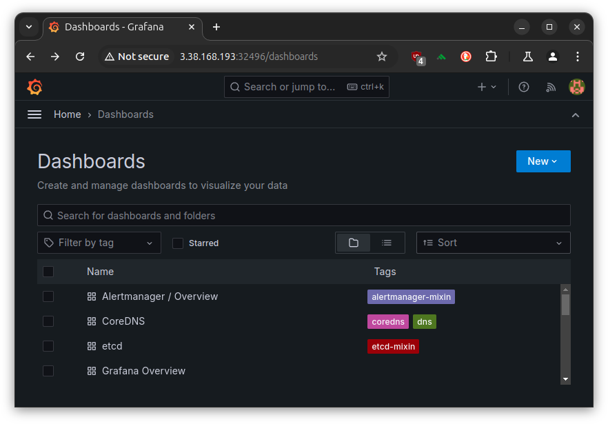

[CloudNet@](https://gasidaseo.notion.site/CloudNet-Blog-c9dfa44a27ff431dafdd2edacc8a1863)에서 진행하고 있는 **K**8s **A**dvanced **N**etwork **S**tudy(이하, KANS)를 통해 학습한 내용을 정리합니다.  

스터디 진행 시, Manifests를 사용하여 Calico를 설치하였으나,  
Operator를 사용하여 설치하는 방법을 정리합니다.  

과제는 아니었지만, 요새 다들 Operator Framework를 사용해서 마라샹궈 볶듯이  
Operator를 지지고 볶는 것 같아서 호기심에 정리해보았습니다.  

참고로 Manifests를 사용하여 설치 시, 50개의 노드[1]를 초과하는 경우 Typha를 구성하여야 합니다.

> Calico 설치 환경 : AWS EC2(No EKS), kubeadm[2], pod-network-cidr=172.16.0.0/16, IPIP Mode  

## 1. Calico Routing Mode  

위에 언급된 IPIP Mode를 이해하려면 Calico의 Routing Mode를 훑을 필요성이 있었습니다.  
파드간 통신 시 노드 간에 encapsulation의 전략을 기준으로 나뉘어 볼 수 있겠습니다.  

- IPIP Mode: (tunl interface)  
  IP header로 감싸(encapsulate)서 다시 Outer header를 제거하는 방식.  
- VXLAN Mode: (vxlan interface)  
  UDP header로 감싸서 다시 Outer header를 제거하는 방식.  
- Direct Mode: 원본 패킷 그대로. CSP의 경우 NIC에서 Src/Dest Check 기능 Disable 필요.  

그 외에도 (Network Level)Pod traffic Encryption[3] 이 있습니다.  

Azure에서는 VNet에서 IPIP가 차단됩니다. 사실 IPIP Mode로 구성할 경우, CSP레벨이 아닌 Kubeadm 등에서 지정한 pod network cidr같은 사용자 정의 값을 고려해야하여 관리적 측면에서 이슈가 되기에, VXLAN Mode를 사용하는 것이 여러모로 좋아보입니다. 물론 이거도 Azure 쓸 때 해봐야 겠지요.  

## 2. Calico Operator 설치 및 설정  

Docs: [Install Calico/Operator](https://docs.tigera.io/calico/latest/getting-started/kubernetes/self-managed-onprem/onpremises)

그냥 쓱쓱 읽으면, Operator를 위한 CRD 설치 및 Custom 설정만 적용하면 됩니다.  
그게 끝이고 그게 문제입니다(?).  

### (1) CRD 설치

원래 파일을 받아서 적용하는 걸 좋아하는데...  
직접 해보니, 이건 얌전히 create를 추천드립니다. 살짝 당황스러웠습니다.  

```bash
# SET CALICO_VERSION_NAME  
# ref. https://github.com/projectcalico/calico/tags
CALICO_VERSION_TAG=v3.28.2 && echo $CALICO_VERSION_TAG
# v3.28.2  
kubectl create -f https://raw.githubusercontent.com/projectcalico/calico/${CALICO_VERSION_TAG}/manifests/tigera-operator.yaml
```  

`tigera-operator` Namespace 및 CRD, SA, Deployment가 생성됩니다.  

하지만, CoreDNS의 상태는 ~~당연히~~ 아직 Pending입니다.  

```bash
(⎈|HomeLab:default) root@k8s-m:~# kubectl get pod -n kube-system
NAME                            READY   STATUS    RESTARTS   AGE
coredns-55cb58b774-62vtz        0/1     Pending   0          21m
coredns-55cb58b774-l8znv        0/1     Pending   0          21m
```

### (2) Custom 설정 적용

> 수정에 있어 `yq`를 사용하였습니다. [mikefarah/yq@v4](https://github.com/mikefarah/yq)  

아래와 같이 custom-resource.yaml 파일을 받아, Calico 구성[4]을 합니다.  

```bash
curl https://raw.githubusercontent.com/projectcalico/calico/${CALICO_VERSION_TAG}/manifests/custom-resources.yaml -sSo custom-resources-$(date --iso-8601).yaml  
ls | grep custom-resources
# custom-resources-2024-09-22.yaml
```

주로 수정되는 부분은 `calicoNetwork.ippools`의 `blockSize`와 `cidr`, `encapsulation`입니다.  

```bash
# mikefarah/yq pre-installed (>=v4)
yq '(select(.kind == "Installation") | .spec.calicoNetwork.ipPools[0] | (.blockSize, .cidr, .encapsulation))' custom-resources-2024-09-23.yaml
26
192.168.0.0/16
VXLANCrossSubnet
```

실제 적용 시 경험했던 트러블은 kubeadm init 시 설정한 pod-network-cidr를 알아내는 방법이었는데,  
아래와 같이 ConfigMap을 조회하여 알아낼 수 있었습니다.  

```bash
kubectl get configmap -n kube-system kubeadm-config -o yaml | grep podSubnet
      # podSubnet: 172.16.0.0/16
```

- blockSize: IP Pool의 크기, 26은 64개의 IP이므로 24(256개)로 변경해보겠습니다.  
- cidr: kubeadmin init 시 설정한 pod-network-cidr (이번의 경우, 172.16.0.0/16)
- encapsulation[5]: 아래 중 하나를 고를 수 있습니다.  
  - IPIP, VXLAN, IPIPCrossSubnet, VXLANCrossSubnet, None(Optional)

```bash
yq 'with(select(.kind == "Installation").spec.calicoNetwork.ipPools[0] ; .blockSize = 24 | .cidr = "172.16.0.0/16" | .encapsulation = "IPIP")' custom-resources-2024-09-23.yaml -i
```

이제 비로소 적용을 할 수 있습니다.  

```bash
kubectl create -f custom-resources-2024-09-23.yaml
# installation.operator.tigera.io/default created
# apiserver.operator.tigera.io/default created
```  

편-안. 오늘 잠은 잘 자겠군요.  


```bash  
kubectl get pod -A --sort-by=.metadata.creationTimestamp
# NAMESPACE          NAME                                       READY   STATUS    RESTARTS   AGE
# kube-system        kube-scheduler-k8s-m                       1/1     Running   0          30h
# kube-system        kube-controller-manager-k8s-m              1/1     Running   0          30h
# kube-system        kube-apiserver-k8s-m                       1/1     Running   0          30h
# kube-system        etcd-k8s-m                                 1/1     Running   0          30h
# kube-system        coredns-55cb58b774-62vtz                   1/1     Running   0          30h
# kube-system        kube-proxy-zj6tv                           1/1     Running   0          30h
# kube-system        coredns-55cb58b774-l8znv                   1/1     Running   0          30h
# kube-system        kube-proxy-ct678                           1/1     Running   0          30h
# kube-system        kube-proxy-qbp9m                           1/1     Running   0          30h
# kube-system        kube-proxy-gqzw9                           1/1     Running   0          30h
# tigera-operator    tigera-operator-576646c5b6-z6kkb           1/1     Running   0          30h
# calico-system      calico-node-rdvhh                          1/1     Running   0          103s
# calico-system      csi-node-driver-hjms8                      2/2     Running   0          103s
# calico-system      csi-node-driver-hf2md                      2/2     Running   0          103s
# calico-system      csi-node-driver-cvrsj                      2/2     Running   0          103s
# calico-system      csi-node-driver-8bm8w                      2/2     Running   0          103s
# calico-system      calico-typha-64b97658dd-2nfhq              1/1     Running   0          103s
# calico-system      calico-node-q5x2w                          1/1     Running   0          103s
# calico-system      calico-node-hx2xv                          1/1     Running   0          103s
# calico-system      calico-node-grtwc                          1/1     Running   0          103s
# calico-system      calico-kube-controllers-66fd48f858-xbrhp   1/1     Running   0          103s
# calico-system      calico-typha-64b97658dd-g7c29              1/1     Running   0          94s
# calico-apiserver   calico-apiserver-69f798bcb-g6gmq           1/1     Running   0          38s
# calico-apiserver   calico-apiserver-69f798bcb-tst89           1/1     Running   0          38s
```  

kubeadm에서 설정한 pod-network-cidr과 일치하지 않으면, 아래와 같은 에러가 발생합니다.  


### (참고) Manifests 기본 설정값 둘러보기

잠시 Manifests 설치 방식을 살펴보겠습니다.  
v3.28.2 버전 기준, `L4924-4935`를 살펴보면, 
IPIP Mode가 기본 활성화 되어있음을 알 수 있습니다.  

```bash  
curl https://raw.githubusercontent.com/projectcalico/calico/v3.28.2/manifests/calico.yaml -sSq | sed -n '4924,4935p'
```  

```yaml  
# Auto-detect the BGP IP address.
- name: IP
  value: "autodetect"
# Enable IPIP
- name: CALICO_IPV4POOL_IPIP
  value: "Always"
# Enable or Disable VXLAN on the default IP pool.
- name: CALICO_IPV4POOL_VXLAN
  value: "Never"
# Enable or Disable VXLAN on the default IPv6 IP pool.
- name: CALICO_IPV6POOL_VXLAN
  value: "Never"
```  

## 3. Retina 설치 시도 (실패)

아래는 시도 중에 에러로그[6] 보고 미지원 인터페이스로 인해 중단된 내용입니다.  
IPIP모드는 tunl 인터페이스를 사용하는데, 이는 미지원 사항임을 알 수 있었습니다.  

```bash
# kubectl logs -n kube-system retina-agent-866h7
ts=2024-09-23T15:53:59.761Z level=error caller=linuxutil/ethtool_stats_linux.go:78 msg="Error while getting ethtool:" ifacename=tunl0 error="interface not supported while retrieving stats: operation not supported" errorVerbose="operation not supported\ninterface not supported while retrieving stats\ngithub.com/microsoft/retina/pkg/plugin/linuxutil.(*CachedEthtool).Stats\n\t/go/src/github.com/microsoft/retina/pkg/plugin/linuxutil/ethtool_handle_linux.go:45\ngithub.com/microsoft/retina/pkg/plugin/linuxutil.(*EthtoolReader).readInterfaceStats\n\t/go/src/github.com/microsoft/retina/pkg/plugin/linuxutil/ethtool_stats_linux.go:73\ngithub.com/microsoft/retina/pkg/plugin/linuxutil.(*EthtoolReader).readAndUpdate\n\t/go/src/github.com/microsoft/retina/pkg/plugin/linuxutil/ethtool_stats_linux.go:43\ngithub.com/microsoft/retina/pkg/plugin/linuxutil.(*linuxUtil).run.func2\n\t/go/src/github.com/microsoft/retina/pkg/plugin/linuxutil/linuxutil_linux.go:109\nruntime.goexit\n\t/usr/local/go/src/runtime/asm_amd64.s:1695"
```

> Network Monitoring Tool인 [Retina](https://github.com/microsoft/retina)를 설치해봅니다.  

- Helm이 있어야합니다. 공식 Docs가 제일 정확합니다.  

### (1) Helm chart 설치  

- 링크: <https://retina.sh/docs/Installation/Setup>  

Basic Mode 로 진행해보겠습니다.  
  
```bash  
# Set the version to a specific version here or get latest version from GitHub API.
VERSION=$( curl -sL https://api.github.com/repos/microsoft/retina/releases/latest | jq -r .name)
helm upgrade --install retina oci://ghcr.io/microsoft/retina/charts/retina \
    --version $VERSION \
    --set image.tag=$VERSION \
    --set operator.tag=$VERSION \
    --set logLevel=info \
    --set enabledPlugin_linux="\[dropreason\,packetforward\,linuxutil\,dns\]"
```  

다음과 같은 출력값이 나옵니다.  

```bash  
Release "retina" does not exist. Installing it now.
Pulled: ghcr.io/microsoft/retina/charts/retina:v0.0.16
Digest: sha256:384e4b45d37ab49b6e2e742012e3d49230ce2be102895dccb504b42540091419
NAME: retina
LAST DEPLOYED: Sun Sep 15 19:29:03 2024
NAMESPACE: default
STATUS: deployed
REVISION: 1
NOTES:
1. Installing retina service using helm: helm install retina ./deploy/legacy/manifests/controller/helm/retina/ --namespace kube-system --dependency-update
2. Cleaning up/uninstalling/deleting retina and dependencies related: 
```  

### (2) Prometheus 설치  

앞서 출력값의 NOTES.1을 그대로 치면 에러가 정상적으로 나야합니다. 해당 되는 파일을 받지 않았기 때문입니다.  

- 에러 로그를 보면, 이 또한 Document를 안내하는 것을 알 수 있습니다.  https://github.com/microsoft/retina/blob/3d2c7a55f8c0388df271453f5fc7b166c2f275be/deploy/legacy/prometheus/values.yaml

- Prometheus 커뮤니티 차트를 사용합니다. Legacy 모드로 진행하나, Github를 살펴보니 Hubble을 쓰는 방식도 있는 것 같습니다.  

- 앞서 언급된 파일의 경로: <https://github.com/microsoft/retina/blob/3d2c7a55f8c0388df271453f5fc7b166c2f275be/deploy/legacy/prometheus/values.yaml>  

```bash
mkdir -p deploy/legacy/prometheus
touch deploy/legacy/prometheus/values.yaml
# cat <<EOF> deploy/legacy/prometheus/values.yaml
# > COPY AND PASTE (대충 위의 values.yaml 내용)
# EOF 

# ADD Prometheus Community Chart Repository
helm install prometheus -n kube-system -f deploy/legacy/prometheus/values.yaml prometheus-community/kube-prometheus-stack
helm repo update

helm install prometheus -n kube-system -f deploy/legacy/prometheus/values.yaml prometheus-community/kube-prometheus-stack
# NAME: prometheus
# LAST DEPLOYED: Sun Sep 15 19:59:33 2024
# NAMESPACE: kube-system
# STATUS: deployed
# REVISION: 1
# NOTES:
# kube-prometheus-stack has been installed. Check its status by running:
#   kubectl --namespace kube-system get pods -l "release=prometheus"
#
# Visit https://github.com/prometheus-operator/kube-prometheus for instructions on how to create & configure Alertmanager and Prometheus instances using the Operator.

kubectl --namespace kube-system get pods -l "release=prometheus"
# NAME                                                  READY   STATUS    RESTARTS   AGE
# prometheus-kube-prometheus-operator-64c9474db-sr5bp   1/1     Running   0          67s
# prometheus-kube-state-metrics-688d66b5b8-xn7kp        1/1     Running   0          67s
# prometheus-prometheus-node-exporter-5lvgp             1/1     Running   0          66s
# prometheus-prometheus-node-exporter-98drk             1/1     Running   0          67s
# prometheus-prometheus-node-exporter-dfss9             1/1     Running   0          67s
# prometheus-prometheus-node-exporter-zr44x             1/1     Running   0          67s
```

NodePort를 생성해서 시도해보기 위해 `values.yaml`에 아래 두 값을 추가하여[6] 업데이트 했습니다.  

- prometheus.service.type: NodePort
- grafana.service.type: NodePort

```bash
helm upgrade prometheus -n kube-system -f deploy/legacy/prometheus/values.yaml prometheus-community/kube-prometheus-stack

kubectl get secret -n kube-system prometheus-grafana -o jsonpath="{.data.admin-password}" | base64 --decode ; echo
# prom-operator
```

```bash
kubectl get svc -n kube-system | grep NodePort
<!-- prometheus-grafana                                   NodePort    10.200.1.23    <none>        80:32496/TCP                    116m
prometheus-kube-prometheus-prometheus                NodePort    10.200.1.36    <none>        9090:30090/TCP,8080:31038/TCP   116m 
```

그라파나 접속을 위해, PUBLIC_IP:32496으로 접속하여, 웹 대시보드는 확인하였으나  
모든 메트릭이 확인되지 않는 진기한.. 경험을 했습니다.  
p8s는 웹UI 접속은 커녕 cURL도 안 먹히는 걸보니 이게 네트워크 인터페이스 문제인지 아니면 유저에러인지 혼동이 되지만,  
tunl 인터페이스가 안된다는 점을 기록하고자 적어보았습니다.  



## 4. Calico Operator 설치를 위해 시도해봤던 것들

```bash
# Error Log 확인을 위한 필수사항
kubectl logs deployment/tigera-operator -n tigera-operator
# Error Log를 통해, 알게된 해결법이 아래 사항
kubectl get configmap -n kube-system kubeadm-config -o yaml
# kubectl create 후, delete 한다고 해결이 되는 게 아니었음. CRD에서 충돌
# --server-side --force-conflicts 옵션을 사용해서 강제 덮어쓰기를 해야됨
kubectl apply --server-side --force-conflicts -f tigera-operator.yaml
kubectl apply --server-side --force-conflicts -f custom-resources.yaml 
```

## Reference

[1] <https://docs.tigera.io/calico/latest/getting-started/kubernetes/self-managed-onprem/onpremises#install-calico-with-kubernetes-api-datastore-more-than-50-nodes>  
[2] <https://kubernetes.io/docs/reference/setup-tools/kubeadm/kubeadm-init/#options>  
[3] <https://docs.tigera.io/calico/latest/network-policy/encrypt-cluster-pod-traffic>  
[4] <https://docs.tigera.io/calico/latest/reference/installation/api#operator.tigera.io/v1.IPPool>  
[5] <https://docs.tigera.io/calico/latest/reference/installation/api#operator.tigera.io/v1.EncapsulationType>  
[6] <https://medium.com/@muppedaanvesh/a-hands-on-guide-to-kubernetes-monitoring-using-prometheus-grafana-%EF%B8%8F-b0e00b1ae039>  
[그외]  
- <https://stackoverflow.com/questions/69190171/calico-kube-controllers-and-calico-node-are-not-ready-crashloopbackoff>
- <https://serverfault.com/questions/1138767/calico-node-and-kube-proxy-crashed-permanently-on-a-new-node>
- <https://mrmaheshrajput.medium.com/deploy-kubernetes-cluster-on-aws-ec2-instances-f3eeca9e95f1>
- <https://tech.osci.kr/%EC%BF%A0%EB%B2%84%EB%84%A4%ED%8B%B0%EC%8A%A4-%EB%84%A4%ED%8A%B8%EC%9B%8C%ED%81%AC-calico/>
- <https://github.com/projectcalico/calico/issues/7538>
- <https://github.com/projectcalico/calico/issues/6407>
- <https://github.com/projectcalico/calico/issues/3878>
- <https://github.com/projectcalico/calico/issues/7890>
- <https://github.com/projectcalico/calico/issues/4218>
- <https://github.com/projectcalico/calico/issues/7826>
- <https://dev.to/prakashvra/how-to-setup-a-kubernetes-cluster-on-aws-ec2-using-kubeadm-containerd-and-calico-560o>
