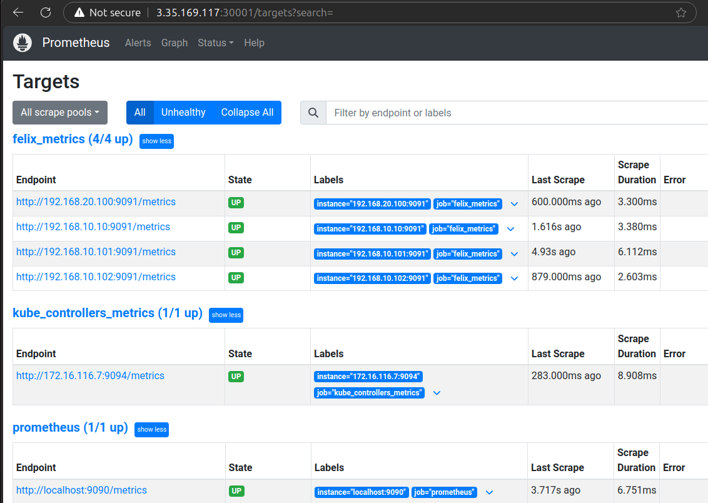

## 1. Calico 설치  

> 스터디에서 AWS CF 및 Calico 설치 스크립트(Manifest)를 제공하였기에, 이 부분은 참고만 하시기 바랍니다.  

CNI가 설치되지 않았기에 NotReady 상태에 있다가, Calico 설치하면 CoreDNS가 설정되며, Ready 상태로 변경된다.  

- Calico 설치 전  

    ```bash
    # Control Plane and worker nodes are not ready
    (⎈|HomeLab:default) root@k8s-m:~# kubectl get nodes
    NAME     STATUS     ROLES           AGE   VERSION
    k8s-m    NotReady   control-plane   32m   v1.30.5
    k8s-w0   NotReady   <none>          31m   v1.30.5
    k8s-w1   NotReady   <none>          31m   v1.30.5
    k8s-w2   NotReady   <none>          31m   v1.30.5

    # Count for iptalbes rules for comparison
    (⎈|HomeLab:default) root@k8s-m:~# iptables -t filter -L | wc -l
    50
    (⎈|HomeLab:default) root@k8s-m:~# iptables -t nat -L | wc -l
    48
    ```  

    ```bash
    (⎈|HomeLab:default) root@k8s-m:~# kubectl get pod -A --sort-by=.metadata.creationTimestamp
    NAMESPACE     NAME                            READY   STATUS    RESTARTS   AGE
    kube-system   etcd-k8s-m                      1/1     Running   0          35m
    kube-system   kube-apiserver-k8s-m            1/1     Running   0          35m
    kube-system   kube-controller-manager-k8s-m   1/1     Running   0          35m
    kube-system   kube-scheduler-k8s-m            1/1     Running   0          35m
    kube-system   coredns-55cb58b774-bscbt        0/1     Pending   0          35m
    kube-system   coredns-55cb58b774-w22zq        0/1     Pending   0          35m
    kube-system   kube-proxy-5hgmn                1/1     Running   0          35m
    kube-system   kube-proxy-bnv77                1/1     Running   0          35m
    kube-system   kube-proxy-xf8q7                1/1     Running   0          35m
    kube-system   kube-proxy-hzsnk                1/1     Running   0          35m
    ```

-  Calico 설치 후  

    ```bash
    (⎈|HomeLab:default) root@k8s-m:~# kubectl get nodes
    NAME     STATUS   ROLES           AGE   VERSION
    k8s-m    Ready    control-plane   45m   v1.30.5
    k8s-w0   Ready    <none>          45m   v1.30.5
    k8s-w1   Ready    <none>          45m   v1.30.5
    k8s-w2   Ready    <none>          45m   v1.30.5
    (⎈|HomeLab:default) root@k8s-m:~# iptables -t filter -L | wc -l
    210
    (⎈|HomeLab:default) root@k8s-m:~# iptables -t nat -L | wc -l
    126
    ```

    ```bash
    (⎈|HomeLab:default) root@k8s-m:~# kubectl get pod -A --sort-by=.metadata.creationTimestamp
    NAMESPACE     NAME                                       READY   STATUS    RESTARTS   AGE
    kube-system   etcd-k8s-m                                 1/1     Running   0          37m
    kube-system   kube-scheduler-k8s-m                       1/1     Running   0          37m
    kube-system   kube-controller-manager-k8s-m              1/1     Running   0          37m
    kube-system   kube-apiserver-k8s-m                       1/1     Running   0          37m
    kube-system   coredns-55cb58b774-w22zq                   1/1     Running   0          36m
    kube-system   coredns-55cb58b774-bscbt                   1/1     Running   0          36m
    kube-system   kube-proxy-5hgmn                           1/1     Running   0          36m
    kube-system   kube-proxy-bnv77                           1/1     Running   0          36m
    kube-system   kube-proxy-xf8q7                           1/1     Running   0          36m
    kube-system   kube-proxy-hzsnk                           1/1     Running   0          36m
    kube-system   calico-node-xsqfv                          1/1     Running   0          57s
    kube-system   calico-node-ttxcv                          1/1     Running   0          57s
    kube-system   calico-node-6x5zq                          1/1     Running   0          57s
    kube-system   calico-kube-controllers-77d59654f4-vl8sv   1/1     Running   0          56s
    kube-system   calico-node-cqjxm                          1/1     Running   0          56s
    ```

- Calico 설치 스크립트를 통해 아래와 같은 변화가 주어집니다.  
  
    ```bash  
    poddisruptionbudget.policy/calico-kube-controllers created
    serviceaccount/calico-kube-controllers created
    serviceaccount/calico-node created
    serviceaccount/calico-cni-plugin created
    configmap/calico-config created
    customresourcedefinition.apiextensions.k8s.io/bgpconfigurations.crd.projectcalico.org created
    customresourcedefinition.apiextensions.k8s.io/bgpfilters.crd.projectcalico.org created
    customresourcedefinition.apiextensions.k8s.io/bgppeers.crd.projectcalico.org created
    customresourcedefinition.apiextensions.k8s.io/blockaffinities.crd.projectcalico.org created
    customresourcedefinition.apiextensions.k8s.io/caliconodestatuses.crd.projectcalico.org created
    customresourcedefinition.apiextensions.k8s.io/clusterinformations.crd.projectcalico.org created
    customresourcedefinition.apiextensions.k8s.io/felixconfigurations.crd.projectcalico.org created
    customresourcedefinition.apiextensions.k8s.io/globalnetworkpolicies.crd.projectcalico.org created
    customresourcedefinition.apiextensions.k8s.io/globalnetworksets.crd.projectcalico.org created
    customresourcedefinition.apiextensions.k8s.io/hostendpoints.crd.projectcalico.org created
    customresourcedefinition.apiextensions.k8s.io/ipamblocks.crd.projectcalico.org created
    customresourcedefinition.apiextensions.k8s.io/ipamconfigs.crd.projectcalico.org created
    customresourcedefinition.apiextensions.k8s.io/ipamhandles.crd.projectcalico.org created
    customresourcedefinition.apiextensions.k8s.io/ippools.crd.projectcalico.org created
    customresourcedefinition.apiextensions.k8s.io/ipreservations.crd.projectcalico.org created
    customresourcedefinition.apiextensions.k8s.io/kubecontrollersconfigurations.crd.projectcalico.org created
    customresourcedefinition.apiextensions.k8s.io/networkpolicies.crd.projectcalico.org created
    customresourcedefinition.apiextensions.k8s.io/networksets.crd.projectcalico.org created
    clusterrole.rbac.authorization.k8s.io/calico-kube-controllers created
    clusterrole.rbac.authorization.k8s.io/calico-node created
    clusterrole.rbac.authorization.k8s.io/calico-cni-plugin created
    clusterrolebinding.rbac.authorization.k8s.io/calico-kube-controllers created
    clusterrolebinding.rbac.authorization.k8s.io/calico-node created
    clusterrolebinding.rbac.authorization.k8s.io/calico-cni-plugin created
    daemonset.apps/calico-node created
    deployment.apps/calico-kube-controllers created
    ```

### (Optional) calicoctl 설치

이외에도 Calico 사용을 위해 [calicoctl](https://docs.tigera.io/calico/latest/operations/calicoctl/install#install-calicoctl-as-a-binary-on-a-single-host) 을 설치했습니다.  

이후에 Calico 메트릭을 p8s로 전송하기 위해 Calico에서 설정을 해야하는데, kubectl 대신 calicoctl을 사용해보기로 했습니다.  
  
  ```bash  
  chmod +x calicoctl && mv calicoctl /usr/bin
  calicoctl version
    % Total    % Received % Xferd  Average Speed   Time    Time     Time  Current
                                  Dload  Upload   Total   Spent    Left  Speed
    0     0    0     0    0     0      0      0 --:--:-- --:--:-- --:--:--     0
  100 64.4M  100 64.4M    0     0  21.2M      0  0:00:03  0:00:03 --:--:-- 40.4M
  Client Version:    v3.28.1
  Git commit:        601856343
  Cluster Version:   v3.28.1
  Cluster Type:      k8s,bgp,kubeadm,kdd
  ```  

## 2. Calico to Prometheus 연동

Docs: [Tigera/Calico](https://docs.tigera.io/calico/latest/operations/monitor/monitor-component-metrics#about-calico-felix-typha-and-kube-controllers-components)

Prometheus(이하, p8s)에 Calico 메트릭을 전송하기 위해 설정을 해야합니다.  

Calico 문서에는 전송할 수 있는 3가지 요소에 대해서 설명하고 있습니다.  
문서를 기반으로 의역해보면  

1. Felix: Calico의 두뇌라고 하는걸로 봐서는 핵심요소로 보입니다. Network Policy를 적용할 모든 머신에서 각각 구동되는 데몬이라고 합니다.  
2. Typha: Calico 노드와 Datastore 사이의 통신을 Felix에게 전달하도록 하는 Pods의 옵션 세트라고 합니다.  
3. kube-controllers: k8s API 돝기화를 비롯하여 가비지 리소스 수집 등 다양한 control-plane 기능을 담당하는 컨트롤러 세트를 실행하는 파드라고 합니다.  

Felix 하나만 연결하면 그만일 줄 알았더니 그건 아닌 것 같습니다. 

아래와 같이, 문서와 동일하게 진행해보겠습니다. 

1. (Calico) Metric Reporting 활성화  
2. (p8s) NS 및 SA 생성  
3. (p8s) 배포 및 구성  
4. (p8s) 대시보드에서 메트릭 확인 및 간단한 그래프 생성  

> calicoctl 및 Manifest 기준으로 기술합니다.  
  
- 이후에는, 앞서 언급한 3가지의 요소의 설정을 수정하여, Felix의 메트릭을 exposed(노출되도록) 설정합니다.  
  다만 작업시, 유의해야할 것이 각자 사용 중인 기본 포트가 정해져 있다는 점입니다.  

  | Component | Default Port | Protocol | Prerequisites | Memo |  
  | --- | --- | --- | --- | --- |  
  | Felix | 9091 | TCP | Y | - |  
  | Typha | 9091 | TCP | N | Default Setting |  
  | Typha(Amazon) | 9093 | TCP | N | TYPHA_PROMETHEUS_METRICS_PORT |  
  | kube-controllers | 9094 | TCP | Y | `calico-kube-controllers` |  

- 특히, Typha의 경우, 위에 기술한 것과 같이 Amazon vpc-cni 설정에서 custom 포트가 별도 지정된다고 합니다. 다음 링크를 참조하시기 바랍니다. ([Github/amazon-vpc-cni-k8s](https://github.com/aws/amazon-vpc-cni-k8s/blob/b001dc6a8fff52926ed9a93ee6c4104f02d365ab/config/v1.6/calico.yaml#L569): v1.6-b001dc6)  
  Typha 도 활성하여 했으나, 선택사항이거니와 설치가 되어있지 않아 다루지 않습니다.  

### (1) Metric Reporting 활성화

기존 Felix 설정을 확인합니다. 기본값은 비활성화되어 있습니다. (아예 명시되어 있지 않습니다)  

```bash  
calicoctl get felixconfiguration -o yaml
```

#### a. Felix 메트릭 노출을 위한 활성화 및 svc 생성  

```bash
calicoctl patch felixconfiguration default  --patch '{"spec":{"prometheusMetricsEnabled": true}}'
# Successfully patched 1 'FelixConfiguration' resource
```

다시 확인합니다. (items.spec.prometheusMetricsEnabled: true)  

```bash  
calicoctl get felixconfiguration -o yaml | grep prom
#   prometheusMetricsEnabled: true
```  

Manifest로 Calico를 설칠했기 때문에, `kube-system` ns에 생성합니다.  

```bash
cat <<EOF>felix.yaml
apiVersion: v1
kind: Service
metadata:
  name: felix-metrics-svc
  namespace: kube-system
spec:
  clusterIP: None
  selector:
    k8s-app: calico-node
  ports:
  - port: 9091
    targetPort: 9091
EOF

kubectl apply -f felix.yaml
# service/felix-metrics-svc created
```

```bash
kubectl get svc,ep -n kube-system felix-metrics-svc
# NAME                        TYPE        CLUSTER-IP   EXTERNAL-IP   PORT(S)    AGE
# service/felix-metrics-svc   ClusterIP   None         <none>        9091/TCP   101s

# NAME                          ENDPOINTS                                                                AGE
# endpoints/felix-metrics-svc   192.168.10.10:9091,192.168.10.101:9091,192.168.10.102:9091 + 1 more...   101s
```

#### b. Typha 메트릭 노출을 위한 활성화 및 svc 생성  

- Typha는 배포되지 않은 것으로 파악되어 생략합니다.  

#### c. kube-controllers 메트릭 노출을 위한 svc 생성  

현재 사용 중인 포트를 확인합니다. ([tigera/calico](https://docs.tigera.io/calico/latest/reference/resources/kubecontrollersconfig#sample-yaml): Kubernetes controllers configuration )  

```bash  
calicoctl get KubeControllersConfiguration -o yaml | grep prom
#   prometheusMetricsPort: 9094
#
# calicoctl get kubecontollersconfiguration -o yaml 
# Failed to get resources: resource type 'kubecontollersconfiguration' is not supported
```  

> (Opt.) calicoctl을 통해 해당 포트를 패치할 수 있습니다.  

```bash
# custom port: 9095
calicoctl patch kubecontrollersconfiguration default  --patch '{"spec":{"prometheusMetricsPort": 9095}}'
```

아래와 같이 서비스를 배포합니다.  
해보니, 이미 있었고 기본값이라 바뀌지 않았다고 확인됩니다.  

```bash
cat <<EOF>kube-controller.yaml
apiVersion: v1
kind: Service
metadata:
  name: kube-controllers-metrics-svc
  namespace: kube-system
spec:
  clusterIP: None
  selector:
    k8s-app: calico-kube-controllers
  ports:
  - port: 9094
    targetPort: 9094
EOF

kubectl apply -f kube-controller.yaml  
```  

### (2) NS 및 SA 생성

- NS: `calico-monitoring`  
- CR/SA/CRB: `calico-prometheus-user`

```bash
cat <<EOF>calico-monitoring.yaml
apiVersion: v1
kind: Namespace
metadata:
  name: calico-monitoring
  labels:
    app:  ns-calico-monitoring
    role: monitoring
EOF

kubectl apply -f calico-monitoring.yaml
```

```bash
cat <<EOF>calico-prometheus-user.yaml
apiVersion: rbac.authorization.k8s.io/v1
kind: ClusterRole
metadata:
  name: calico-prometheus-user
rules:
- apiGroups: [""]
  resources:
  - endpoints
  - services
  - pods
  verbs: ["get", "list", "watch"]
- nonResourceURLs: ["/metrics"]
  verbs: ["get"]
---
apiVersion: v1
kind: ServiceAccount
metadata:
  name: calico-prometheus-user
  namespace: calico-monitoring
---
apiVersion: rbac.authorization.k8s.io/v1
kind: ClusterRoleBinding
metadata:
  name: calico-prometheus-user
roleRef:
  apiGroup: rbac.authorization.k8s.io
  kind: ClusterRole
  name: calico-prometheus-user
subjects:
- kind: ServiceAccount
  name: calico-prometheus-user
  namespace: calico-monitoring
EOF

kubectl apply -f calico-prometheus-user.yaml
# clusterrole.rbac.authorization.k8s.io/calico-prometheus-user created
# serviceaccount/calico-prometheus-user created
# clusterrolebinding.rbac.authorization.k8s.io/calico-prometheus-user created
```  

### (3) 배포 및 구성

ConfigMap을 생성합니다.  

```bash
cat <<EOF>prometheus-config.yaml
apiVersion: v1
kind: ConfigMap
metadata:
  name: prometheus-config
  namespace: calico-monitoring
data:
  prometheus.yml: |-
    global:
      scrape_interval:   15s
      external_labels:
        monitor: 'tutorial-monitor'
    scrape_configs:
    - job_name: 'prometheus'
      scrape_interval: 5s
      static_configs:
      - targets: ['localhost:9090']
    - job_name: 'felix_metrics'
      scrape_interval: 5s
      scheme: http
      kubernetes_sd_configs:
      - role: endpoints
      relabel_configs:
      - source_labels: [__meta_kubernetes_service_name]
        regex: felix-metrics-svc
        replacement: $1
        action: keep
    - job_name: 'felix_windows_metrics'
      scrape_interval: 5s
      scheme: http
      kubernetes_sd_configs:
      - role: endpoints
      relabel_configs:
      - source_labels: [__meta_kubernetes_service_name]
        regex: felix-windows-metrics-svc
        replacement: $1
        action: keep
    - job_name: 'typha_metrics'
      scrape_interval: 5s
      scheme: http
      kubernetes_sd_configs:
      - role: endpoints
      relabel_configs:
      - source_labels: [__meta_kubernetes_service_name]
        regex: typha-metrics-svc
        replacement: $1
        action: keep
    - job_name: 'kube_controllers_metrics'
      scrape_interval: 5s
      scheme: http
      kubernetes_sd_configs:
      - role: endpoints
      relabel_configs:
      - source_labels: [__meta_kubernetes_service_name]
        regex: kube-controllers-metrics-svc
        replacement: $1
        action: keep
EOF

kubectl apply -f prometheus-config.yaml
```

Calico를 수집할 Prometheus를 배포합니다.  

> 앞에서 Calico 메트릭을 수집하고, 유효한 ConfigMap을 생성하였습니다.  

```bash
cat <<EOF>prometheus-pod.yaml
apiVersion: v1
kind: Pod
metadata:
  name: prometheus-pod
  namespace: calico-monitoring
  labels:
    app: prometheus-pod
    role: monitoring
spec:
  nodeSelector:
    kubernetes.io/os: linux
  serviceAccountName: calico-prometheus-user
  containers:
  - name: prometheus-pod
    image: prom/prometheus
    resources:
      limits:
        memory: "128Mi"
        cpu: "500m"
    volumeMounts:
    - name: config-volume
      mountPath: /etc/prometheus/prometheus.yml
      subPath: prometheus.yml
    ports:
    - containerPort: 9090
  volumes:
  - name: config-volume
    configMap:
      name: prometheus-config
EOF

kubectl apply -f prometheus-pod.yaml
```  

정상적으로 구동되는 지 확인합니다.  

```bash
kubectl get pods prometheus-pod -n calico-monitoring
# NAME             READY   STATUS    RESTARTS   AGE
# prometheus-pod   1/1     Running   0          14s
```

### (4) 대시보드에서 메트릭 확인 및 간단한 그래프 생성

문서에서는 port-forward를 통해 확인하도록 하지만, AWS EC2에 구축했기에 확인하기가 어렵습니다.  

> kubectl port-forward pod/prometheus-pod 9090:9090 -n calico-monitoring

스터디에서 안내된 방법으로, 확인해보겠습니다.  

#### a. Pod IP를 확인합니다.  
  
- `/graph`: 대시보드  
- `/metrics`: Grafana 등 p8s 기반 시각화를 위한 메트릭 정보  
  
```bash  
kubectl get pods prometheus-pod -n calico-monitoring -owide | grep -Eo "([0-9]{1,3}[\.]){3}[0-9]{1,3}"
# 172.16.184.8

# curl 172.16.184.8:9090
# <a href="/graph">Found</a>.
```  

#### b. NodePort svc를 생성합니다. (외부접속)  

```bash  
cat <<EOF>prometheus-dashboard-svc.yaml
apiVersion: v1
kind: Service
metadata:
  name: prometheus-dashboard-svc
  namespace: calico-monitoring
spec:
  type: NodePort
  selector:
    app: prometheus-pod
    role: monitoring
  ports:
    - protocol: TCP
      port: 9090
      targetPort: 9090
      nodePort: 30001 
EOF

kubectl apply -f prometheus-dashboard-svc.yaml
kubectl get svc,ep -n calico-monitoring
# NAME                               TYPE       CLUSTER-IP    EXTERNAL-IP   PORT(S)          AGE
# service/prometheus-dashboard-svc   NodePort   10.200.1.45   <none>        9090:30001/TCP   0s

# NAME                                 ENDPOINTS           AGE
# endpoints/prometheus-dashboard-svc   172.16.184.8:9090   0s
```  
  
아래 커맨드를 쳐서 나오는 URL로 웹 브라우저에서 확인을 합니다.  
  
```bash  
echo -e "Prometheus URL = http://$(curl -s ipinfo.io/ip):30001/graph"  
# Prometheus URL = http://3.35.169.117:30001/graph
```  
Target에서 `felix_metrics`가 잡힌 것을 확인하였습니다.  

