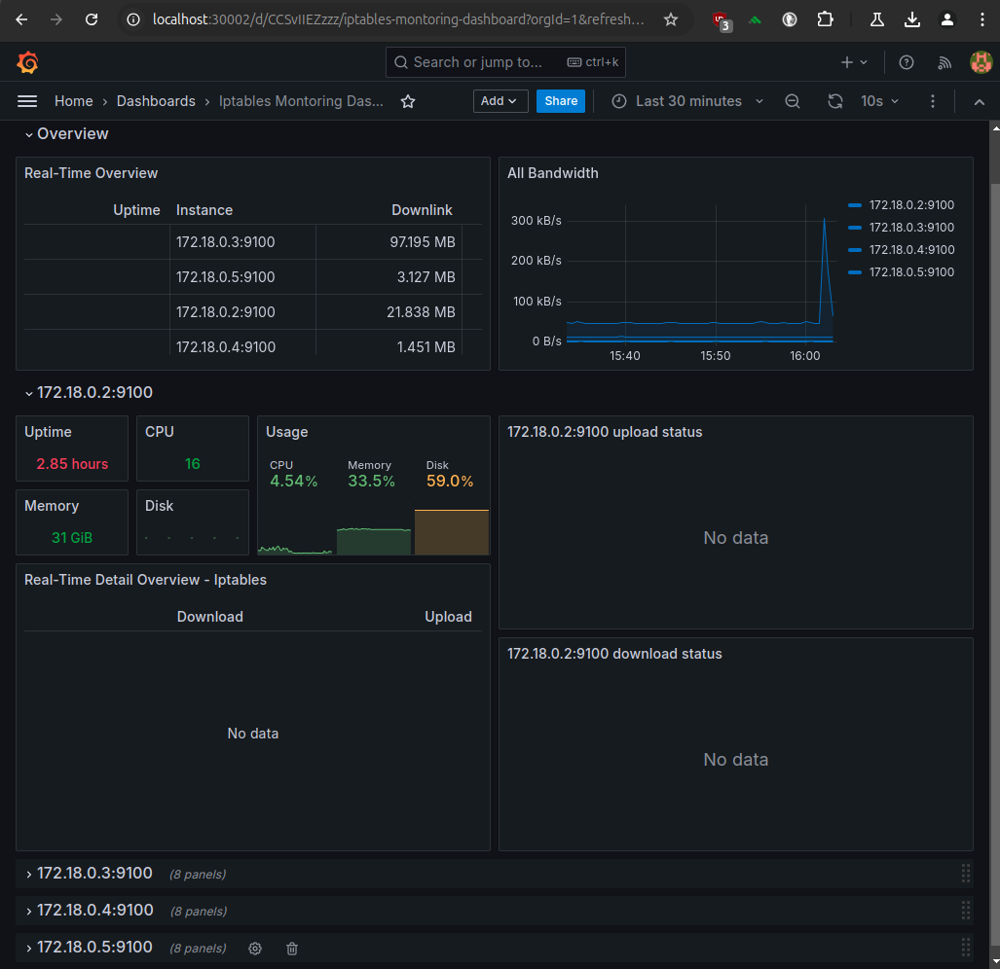
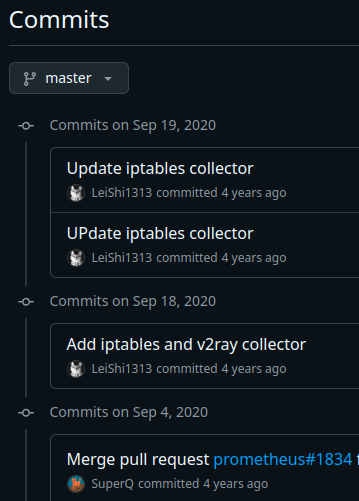
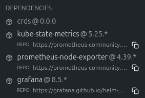

iptables를 수집하여 Grafana로 표현하는 방법을 알아봅니다.  

[CloudNet@](https://gasidaseo.notion.site/CloudNet-Blog-c9dfa44a27ff431dafdd2edacc8a1863)에서 진행하고 있는 **K**8s **A**dvanced **N**etwork **S**tudy(이하, KANS)를 통해 학습한 내용을 정리합니다.  

## 0. 환경 구성 (kind)

> 작성시간 이슈로 featureGates, ConfigPatches, networking 설정 설명은 스킵...합니다.  

### a. 1 Master, 4 Slave 환경 구성  

```bash
cat <<EOT> kind-svc-1w.yaml
kind: Cluster
apiVersion: kind.x-k8s.io/v1alpha4
featureGates:
  "InPlacePodVerticalScaling": true
  "MultiCIDRServiceAllocator": true
nodes:
- role: control-plane
  labels:
    mynode: control-plane
    topology.kubernetes.io/zone: ap-northeast-2a
  extraPortMappings:
  - containerPort: 30000
    hostPort: 30000
  - containerPort: 30001
    hostPort: 30001
  - containerPort: 30002
    hostPort: 30002
  kubeadmConfigPatches:
  - |
    kind: ClusterConfiguration
    apiServer:
      extraArgs:
        runtime-config: api/all=true
    controllerManager:
      extraArgs:
        bind-address: 0.0.0.0
    etcd:
      local:
        extraArgs:
          listen-metrics-urls: http://0.0.0.0:2381
    scheduler:
      extraArgs:
        bind-address: 0.0.0.0
  - |
    kind: KubeProxyConfiguration
    metricsBindAddress: 0.0.0.0
- role: worker
  labels:
    mynode: worker1
    topology.kubernetes.io/zone: ap-northeast-2a
- role: worker
  labels:
    mynode: worker2
    topology.kubernetes.io/zone: ap-northeast-2b
- role: worker
  labels:
    mynode: worker3
    topology.kubernetes.io/zone: ap-northeast-2c
networking:
  podSubnet: 10.10.0.0/16
  serviceSubnet: 10.200.1.0/24
EOT

kind create cluster --config kind-svc-1w.yaml --name myk8s --image kindest/node:v1.31.0
```

### b. 기본 툴 설치  

```bash
docker exec -it myk8s-control-plane sh -c 'apt update && apt install tree psmisc lsof wget bsdmainutils bridge-utils net-tools ipset ipvsadm nfacct tcpdump ngrep iputils-ping arping git vim arp-scan -y'
```

## 1. prometheus stack 설치 (helm)

### a. repository 추가 및 구성

```bash
helm repo add prometheus-community https://prometheus-community.github.io/helm-charts

cat <<EOT > monitor-values.yaml
prometheus:
  prometheusSpec:
    podMonitorSelectorNilUsesHelmValues: false
    serviceMonitorSelectorNilUsesHelmValues: false
    nodeSelector:
      mynode: control-plane
    tolerations:
    - key: "node-role.kubernetes.io/control-plane"
      operator: "Equal"
      effect: "NoSchedule"


grafana:
  defaultDashboardsTimezone: Asia/Tokyo
  adminPassword: kans7969

  service:
    type: NodePort
    nodePort: 30002
  nodeSelector:
    mynode: control-plane
  tolerations:
  - key: "node-role.kubernetes.io/control-plane"
    operator: "Equal"
    effect: "NoSchedule"

defaultRules:
  create: false
alertmanager:
  enabled: false

EOT 
```  

### b. 설치  

```bash
kubectl create ns monitoring
helm install kube-prometheus-stack prometheus-community/kube-prometheus-stack --version 62.3.0 -f monitor-values.yaml --namespace monitoring
```

### c. prometheus 콘솔 접속

> 새로운 터미널을 열어, port-forwarding을 통해 접속합니다.  

```bash
# New Terminal
kubectl port-forward svc/kube-prometheus-stack-grafana -n monitoring 9090:9090
```

골치 아픈 etcd 마저 붙은 걸 알 수 있습니다.  

> 사실, 바로 충돌될 줄 알고, 기대했는데... 저런.  

충돌난다면, 주요한 이슈는 맨 위의 kind에서 지정한 port 불일치입니다.  
아래를 참고하여 고쳐보세요.  

```bash  
helm upgrade --install \
  --namespace monitoring --create-namespace \
  --repo https://prometheus-community.github.io/helm-charts \
  kube-prometheus-stack kube-prometheus-stack --values - <<EOF
kubeEtcd:
  service:
    targetPort: 2381
EOF
```

## 2. Grafana dashboard 확인  

Grafana에 접속해봅시다.  

> kube-prometheus-stack을 기본 설치하면, node-exporter와 grafana도 함께 설치됩니다.  

### a. 접속 정보 확인

우선 접속할 ID와 패스워드를 알아야겠죠.  

```bash
kubectl get secret -n monitoring kube-prometheus-stack-grafana -o jsonpath="{.data.admin-user}" | base64 --decode ; echo
# admin
kubectl get secret -n monitoring kube-prometheus-stack-grafana -o jsonpath="{.data.admin-password}" | base64 --decode ; echo
# kans7969
```

...~~이렇게나 위험한걸 다들 쓰고있다니 존경합니다.~~  

### b. Port 확인

앞에서 Grafana의 경우 NodePort로 미리 지정했기 때문에, 프로메테우스 때와는 달리 별도의 port-forwarding 설정은 필요없습니다.  

```bash
kubectl get svc -A -owide | grep NodePort
# monitoring    kube-prometheus-stack-grafana                    NodePort    10.200.1.25    <none>        80:30002/TCP                   101m   app.kubernetes.io/instance=kube-prometheus-stack,app.kubernetes.io/name=grafana
```

위의 경우에는 kind를 구성한, 컴퓨터의 브라우저에서 `localhost:30002`로 접속하면 됩니다.

### c. Dashboard 확인

- Dashboard(13674): [Grafana Labs](https://grafana.com/grafana/dashboards/13674-iptables-montoring-dashboard/)

음 역시. 뭐가 많이 부족하죠? 각 노드의 iptables rule과 io up/down이 확인이 안되네요.  

  

이제 이걸해야됩니다.  

## 3. iptables exporter 설정

### a. 원인 안내  

간단합니다. 해당 대시보드 템플릿 안내문에, 템플릿 작성자가 따로 포크떠서 작성한 node-exporter를 안내하고 있기 때문이죠. Wow!  
그래도 안내라도 있어서 다행입니다. 한번 볼까요?  

- (LeiShi1313/node_exporter): <https://github.com/LeiShi1313/node_exporter/commits/master/>  



뭔가 바뀐거도 보이고... 아무래도 어떻게든 yaml에 때려넣어야하는 걸까... 고민하게 됩니다.  

### b. 고민해봅시다, 무엇을?  

helm을 쓰는 대다수의 사용자들은 알 필요도 없고... 알 겨를도 없는 사항인데,  
헬름 차트에도 그 뭐냐, dependency라는 것이 존재하는데요.  

최신문서 기준 아래와 같이 아 맞다 의존성이지. 의존성이 걸려있는 것을 알 수 있습니다.  

  

음 읽고 더 미궁 속으로 빠집니다. 의존성 이름이 `prometheus-node-exporter` ... 음 큰일났네요.  

### c. 그래도 그냥 더 볼까

일단 지금까지 태운 시간이 아까우니, 계속 봅니다.  

대시보드 기준으로 누락된 위젯에서 어떠한 값을 요청하는지 살펴봅니다.  

- `increase(node_iptables_download_bytes_total{job=~"$job",instance=~"$instance"}[$__range])`  
- `increase(node_iptables_upload_bytes_total{job=~"$job",instance=~"$instance"}[$__range])`  
- `irate(node_v2ray_download_bytes_total{job=~"$job",instance=~"$instance",dimension=~"$dimension",target=~"$target"}[5m])`
- `irate(node_v2ray_upload_bytes_total{job=~"$job",instance=~"$instance",dimension=~"$dimension",target=~"$target"}[5m])`
- `irate(node_v2ray_download_bytes_total{job=~"$job",instance=~"$instance",dimension=~"$dimension",target=~"$target"}[5m])`
- `irate(node_iptables_download_bytes_total{job=~"$job",instance=~"$instance",chain=~"$dimension",rule=~"$target"}[5m])`  

역시, 누락된 위젯은 죄다 커밋내역과 연동된 내용이네요. 특히 v2ray 또한, 따로 [GitHub repository](https://github.com/LeiShi1313/net-traffic-exporter)가 있습니다.  

이제 선택지는 얼마 없는 것 같습니다.  
p8s에서 target 살펴봤을때 없는 걸 보니, 활성화해서되면 okay 안되면... GG  

- ~~A안) 기존 node-exporter를 활성화하여 사용.~~  
  말이 되지 않음. 원본 node-exporter에는 v2ray 같은 건 있지 않았음.  
- ~~B안) 기존 helm 차트를 수정하여 node-exporter 참조 경로를 사용.~~  
  그런, [험한거](https://github.com/LeiShi1313/node_exporter/blob/39295e6522dceea4ecda0d4520239149712a7a01/go.mod#L1) [하면](https://github.com/LeiShi1313/node_exporter/blob/39295e6522dceea4ecda0d4520239149712a7a01/docs/node-mixin/go.mod#L1) 안될 것 같네요.
- C안) 뭔가 신비하고 놀라운 [Discussion](https://github.com/prometheus/node_exporter/issues/637#issuecomment-888409148)을 통해, 그저 더 삽질하기...  
  이걸로... 해볼께요.  

이걸 보니, 뭔가 심연을 느끼기 시작합니다. ~~`빨리 도망쳐`~~  

> This horrifying cron one liner when set as a cron simulates an iptables exporter. At least on debian buster/stretch it does. It gives more or less the same output as the dedicated iptables exporter. It just uses awk to process the output of iptables-save -c into something prometheus can understand, and pops it in the folder the node exporter monitors.  


```bash
SCRAPE_INTERVAL=15
OFFSET_INTERVAL=5
* * * * * root sleep $OFFSET_INTERVAL; for i in $(seq $SCRAPE_INTERVAL $SCRAPE_INTERVAL 60); do /usr/sbin/iptables-save -c | grep -v '^#' | grep -v 'COMMIT' | sed -e s'/\[//g;s/\]//g' | awk -F'[ :]' '{ if($0 ~ /\*/) { table=$0; gsub("^*","",table); } else if($0 ~ /^\:/){ print "iptables_rule_bytes_total{chain=\"" $2 "\",policy=\"" $3 "\",table=\"" table "\"} " $5 "\niptables_rule_packets_total{chain=\"" $2 "\",policy=\"" $3 "\",table=\"" table "\"} " $4; } else { rule=$5; for(i=6;i<=NF;i++){rule=rule" "$i} print "iptables_rule_bytes_total{chain=\"" $4 "\",rule=\"" rule "\",table=\"" table "\"} " $2 "\niptables_rule_packets_total{chain=\"" $4 "\",rule=\"" rule "\",table=\"" table "\"} " $1; } }' > /var/lib/prometheus/node-exporter/iptables.prom; echo "iptables_scrape_success $(date +\%s)" >> /var/lib/prometheus/node-exporter/iptables.prom; sleep $SCRAPE_INTERVAL; done
```

아저씨 말씀으로 된다니, 그냥 빠르게 다른 걸 더 찾아봅니다. ~~`$(date +\%s)`를 쓰면 그 로그는 조상님께서 없애줄거냐며~~
[권한](https://github.com/retailnext/iptables_exporter) [이야기가](https://github.com/kbknapp/iptables_exporter) 나오네요.  

사실 뭐 discussion에서 permission 언급되길래 찾아보니, [pypi/iptables-exporter](https://pypi.org/project/iptables-exporter/)도 나오고 뭔가 어지러워보이다가 명료하게 권한 언급되는걸 봐서 해보기로 했습니다.  

### d. Do... It

#### 권한  

- 총 3개의 권한을 허용해야합니다.  
  - CAP_DAC_READ_SEARCH  
  - CAP_NET_ADMIN  
  - CAP_NET_RAW  

#### 권한의 적용  

- `retailnext/iptables_exporter`  
  - [GitHub](https://github.com/retailnext/iptables_exporter)  
  - 첫 구절을 보면, 친절하게 systemd 옵션 재설정이 필요하다고 합니다.  

Unfortunately, iptables-save (which this exporter uses) doesn't work without special permissions.

Including the following systemd [Service] options will allow this exporter to work without running it as root:

```memo
CapabilityBoundingSet=CAP_DAC_READ_SEARCH CAP_NET_ADMIN CAP_NET_RAW
AmbientCapabilities=CAP_DAC_READ_SEARCH CAP_NET_ADMIN CAP_NET_RAW
```

- 이후는 방전이 되서 계속 좀 써보겠습니다.  

## Reference

<https://medium.com/@charled.breteche/kind-fix-missing-prometheus-operator-targets-1a1ff5d8c8ad>  
<https://sbcode.net/prometheus/prometheus-node-exporter-2nd/>  
<https://www.crybit.com/install-and-configure-node-exporter/>   