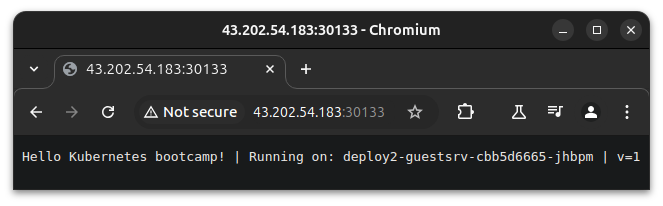

지난 포스팅, [Kubernetes Service(2): LoadBalancer(MetalLB)](https://blog.minseong.xyz/post/kans-5w-metallb-loadbalancer/)에 이어 Ingress Type을 가볍게 살펴보고, Ingress-Nginx를 가볍게 붙여보겠습니다.  

[CloudNet@](https://gasidaseo.notion.site/CloudNet-Blog-c9dfa44a27ff431dafdd2edacc8a1863)에서 진행하고 있는 **K**8s **A**dvanced **N**etwork **S**tudy(이하, KANS)를 통해 학습한 내용을 정리합니다.  

## 1. Ingress Type  

> 이제, 신규 기능(New feature)은 `Gateway API`에 추가된다고 합니다.  

우선, Kubernetes가 헷갈리는 것 중 하나가,  
- `Ingress Type 과 LoadBalancer Type의 명확한 차이가 뭘까...?`  
라는 점이라고 봅니다.  

물론, 그거 외에도 k8s에는 알쏭달쏭한 것들이 아-주 많지만요.  

친절한 [Docs](https://kubernetes.io/docs/concepts/services-networking/ingress/)에 따르면,  
클러스터 외부로 클러스터 내부 서비스에 대한 HTTP 및 HTTPS 라우팅을 노출하는 것이라고 합니다. 

Rules에 의한 다양한 백엔드 라우팅 외에도 Load Balancing, SSL Termination 그리고 name-based virtual hosting을 지원한다고 하는데... 이쯤되면 LoadBalancer Type이랑 다른게 없는 거라고 생각을 하곤 했습니다. 

그래서 Ingress를 잊어야한다는 마음으로, 차이점만 짚어보고자 했습니다. 

## 2. Ingress Type vs. LoadBalancer Type

- <https://www.baeldung.com/ops/kubernetes-ingress-vs-load-balancer>  

위의 링크가 먼저 나와서 슥 봤는데, 그 오해는 어디까지나 CSP에서 제공하는 ALB에 Routing Rule을 넣고 SSL을 달아서 헷갈린게 아닐까 생각을 해봤습니다. 

비용 같은 당연한 이야기는 빼고 해당 링크에서는 k8s 관점에서만 보면,  

- 어디까지나 LoadBalancer Type은 Service의 확장  
- Ingress와 달리, LB는 독립적 객체(Standalone Object)가 아님  

차이가 있다는 걸 알게되었습니다.  

## 3. 가벼운 k3s 실습 준비  

아직 Ingress Type의 관짝에 못이 안 박혔기 때문에, 가벼운 실습 준비를 해봅니다.  

> 이 또한 스터디에서 부트스트랩으로 제공되었기에 양해부탁드립니다.  

```bash  
# Install k3s-server
curl -sfL https://get.k3s.io | INSTALL_K3S_EXEC=" --disable=traefik"  sh -s - server --token kanstoken --cluster-cidr "172.16.0.0/16" --service-cidr "10.10.200.0/24" --write-kubeconfig-mode 644 

# Install k3s-agent
curl -sfL https://get.k3s.io | K3S_URL=https://192.168.10.10:6443 K3S_TOKEN=kanstoken  sh -s -
```  

`kubeadm`을 많이 다루신 현업 분들께서는 좀 많이 익숙한 파라미터들이 보입니다.  
다만, `--disable=traefik`이라는 파라미터가 k3s server 설치 스크립트에서 볼 수 있는데요,  
k3s가 Ingress Controller로 Traefik을 사용하는데, Ingress-Nginx를 사용하기 위해 Traefik을 비활성화 시키는 것입니다.  

```yaml
cat /etc/rancher/k3s/k3s.yaml
apiVersion: v1
clusters:
- cluster:
    certificate-authority-data: LS0tLS1CR(중략)LS0tLS0K
    server: https://127.0.0.1:6443
  name: default
contexts:
- context:
    cluster: default
    user: default
  name: default
current-context: default
kind: Config
preferences: {}
users:
- name: default
  user:
    client-certificate-data: LS0tLS1C(중략)LS0tLS0K
    client-key-data: LS0tLS1(중략)LS0tLQo=
```

k3s는 `SUSE`및 `Rancher`에서 개발되어, CNCF Sandbox Project로 등록되어있는,  
IoT & Edge Computing을 위한 k8s 배포도구이기에 rancher 폴더가 생겼음을 유추해볼 수 있습니다.  

## 4. Ingress-Nginx 컨트롤러 배포 (Helm)  

> 제가 조작하지 않는, Helm에 데인 이후로 선호도가 급?격하게 떨어지긴 했는데, 여튼 편하니까 해봅시다.   

### (a) Helm Values 파일 작성 및 Helm Repo 추가  

- NodePort로 해당 서비스를 노출하기로 해봅시다.  

```yaml
cat <<EOT> ingress-nginx-values.yaml
controller:
  service:
    type: NodePort
    nodePorts:
      http: 30080
      https: 30443
  nodeSelector:
    kubernetes.io/hostname: "k3s-s"
  metrics:
    enabled: true
  serviceMonitor:
      enabled: true
EOT

helm repo add ingress-nginx https://kubernetes.github.io/ingress-nginx
helm repo update
```

`insecure` warning이 뜨지만, 이게 학습이라 그저 넘어가도록 합시다.  

```bash
WARNING: Kubernetes configuration file is group-readable. This is insecure. Location: /etc/rancher/k3s/k3s.yaml
WARNING: Kubernetes configuration file is world-readable. This is insecure. Location: /etc/rancher/k3s/k3s.yaml
"ingress-nginx" has been added to your repositories
WARNING: Kubernetes configuration file is group-readable. This is insecure. Location: /etc/rancher/k3s/k3s.yaml
WARNING: Kubernetes configuration file is world-readable. This is insecure. Location: /etc/rancher/k3s/k3s.yaml
```

### (b) ns 생성 및  Helm Chart 배포  

```bash
kubectl create ns ingress
helm install ingress-nginx ingress-nginx/ingress-nginx -f ingress-nginx-values.yaml --namespace ingress --version 4.11.2

# Check
kubectl get all -n ingress
kubectl get svc -n ingress ingress-nginx-controller
```

`Warning`은 에?러가 아니니까, 대개 잘 잡히는 것 같습니다.  

```bash
kubectl create ns ingress
helm install ingress-nginx ingress-nginx/ingress-nginx -f ingress-nginx-values.yaml --namespace ingress --version 4.11.2
namespace/ingress created
WARNING: Kubernetes configuration file is group-readable. This is insecure. Location: /etc/rancher/k3s/k3s.yaml
WARNING: Kubernetes configuration file is world-readable. This is insecure. Location: /etc/rancher/k3s/k3s.yaml
NAME: ingress-nginx
LAST DEPLOYED: Thu Oct 10 23:39:48 2024
NAMESPACE: ingress
STATUS: deployed
REVISION: 1
TEST SUITE: None
NOTES:
The ingress-nginx controller has been installed.
Get the application URL by running these commands:
  export HTTP_NODE_PORT=30080
  export HTTPS_NODE_PORT=30443
  export NODE_IP="$(kubectl get nodes --output jsonpath="{.items[0].status.addresses[1].address}")"

  echo "Visit http://${NODE_IP}:${HTTP_NODE_PORT} to access your application via HTTP."
  echo "Visit https://${NODE_IP}:${HTTPS_NODE_PORT} to access your application via HTTPS."

An example Ingress that makes use of the controller:
  apiVersion: networking.k8s.io/v1
  kind: Ingress
  metadata:
    name: example
    namespace: foo
  spec:
    ingressClassName: nginx
    rules:
      - host: www.example.com
        http:
          paths:
            - pathType: Prefix
              backend:
                service:
                  name: exampleService
                  port:
                    number: 80
              path: /
    # This section is only required if TLS is to be enabled for the Ingress
    tls:
      - hosts:
        - www.example.com
        secretName: example-tls

If TLS is enabled for the Ingress, a Secret containing the certificate and key must also be provided:

  apiVersion: v1
  kind: Secret
  metadata:
    name: example-tls
    namespace: foo
  data:
    tls.crt: <base64 encoded cert>
    tls.key: <base64 encoded key>
  type: kubernetes.io/tls
```

```bash
kubectl get all -n ingress
kubectl describe svc -n ingress ingress-nginx-controller
```

그렇군요.


```bash
# kubectl get all -n ingress
NAME                                           READY   STATUS    RESTARTS   AGE
pod/ingress-nginx-controller-979fc89cf-lk7th   1/1     Running   0          92s

NAME                                         TYPE        CLUSTER-IP      EXTERNAL-IP   PORT(S)                      AGE
service/ingress-nginx-controller             NodePort    10.10.200.235   <none>        80:30080/TCP,443:30443/TCP   92s
service/ingress-nginx-controller-admission   ClusterIP   10.10.200.100   <none>        443/TCP                      92s
service/ingress-nginx-controller-metrics     ClusterIP   10.10.200.234   <none>        10254/TCP                    92s

NAME                                       READY   UP-TO-DATE   AVAILABLE   AGE
deployment.apps/ingress-nginx-controller   1/1     1            1           92s

NAME                                                 DESIRED   CURRENT   READY   AGE
replicaset.apps/ingress-nginx-controller-979fc89cf   1         1         1       92s
NAME                       TYPE       CLUSTER-IP      EXTERNAL-IP   PORT(S)                      AGE
ingress-nginx-controller   NodePort   10.10.200.235   <none>        80:30080/TCP,443:30443/TCP   92s
```

NodePort를 사용하는 것을 알 수 있습니다.  
~~IP Addr이 다른 이유는 EC2 끄고 다시켰더니, 오류나서 다시 올렸습니다.~~  

```bash
# kubectl describe svc -n ingress ingress-nginx-controller
(전략)
Type:                     NodePort
IP Family Policy:         SingleStack
IP Families:              IPv4
IP:                       10.10.200.180
IPs:                      10.10.200.180
Port:                     http  80/TCP
TargetPort:               http/TCP
NodePort:                 http  30080/TCP
Endpoints:                172.16.0.3:80
Port:                     https  443/TCP
TargetPort:               https/TCP
NodePort:                 https  30443/TCP
Endpoints:                172.16.0.3:443
Session Affinity:         None
External Traffic Policy:  Cluster
Events:                   <none>
```

### (c) externalTrafficPolicy: Local

컨트롤러에 `NodePort`를 사용하고, `externalTrafficPolicy: Local`을 사용하면,  
클라이언트의 요청이 도착한 노드로 바로 전달되어, 노드의 로컬 IP로부터 응답을 받을 수 있다고 하는데  
일단 켜보고 환경값 체크를 합니다.  

```bash  
kubectl patch svc ingress-nginx-controller -n ingress -p '{"spec":{"externalTrafficPolicy":"Local"}}'
# service/ingress-nginx-controller patched
kubectl get cm -n ingress ingress-nginx-controller
kubectl exec deploy/ingress-nginx-controller -n ingress -it -- cat /etc/nginx/nginx.conf
# (생략) 평소에 보던 Nginx.conf 가 이했나....?  
```

버전 정보도 확인해보겠습니다. 

```bash
POD_NS=ingress
POD_NAME=$(kubectl get pods -n $POD_NS -l app.kubernetes.io/name=ingress-nginx --field-selector=status.phase=Running -o name)
kubectl exec $POD_NAME -n $POD_NS -- /nginx-ingress-controller --version
```

적당히 출력됩니다. 

```bash
-------------------------------------------------------------------------------
NGINX Ingress controller
  Release:       v1.11.2
  Build:         46e76e5916813cfca2a9b0bfdc34b69a0000f6b9
  Repository:    https://github.com/kubernetes/ingress-nginx
  nginx version: nginx/1.25.5

-------------------------------------------------------------------------------

```

## 5. 테스트 서비스 배포 (ClusterIP, NodePort)  

Ingress 컨트롤러가 ClusterIP, NodePosrt 무관하게 외부에 노출시킬 수 있는지에 대해  
테스트 실습을 해볼 겁니다. 

| Service Type | Port | Test App |  
|:--- |:--- |:--- |  
| ClusterIP | 9001 | nginx |  
| NodePort | 9002 | kubetnetes-bootcamp |  
| 정의 없음(Default: ClusterIP) | 9003 | echoserver |  

### (a) ClusterIP Service  

```yaml
cat <<EOT> clusterip-nginx.yaml
apiVersion: apps/v1
kind: Deployment
metadata:
  name: deploy1-websrv
spec:
  replicas: 1
  selector:
    matchLabels:
      app: websrv
  template:
    metadata:
      labels:
        app: websrv
    spec:
      containers:
      - name: pod-web
        image: nginx
---
apiVersion: v1
kind: Service
metadata:
  name: svc1-web
spec:
  ports:
    - name: web-port
      port: 9001
      targetPort: 80
  selector:
    app: websrv
  type: ClusterIP
EOT
```

### (b) NodePort Service  

```yaml
cat <<EOT> nodeport-kbc.yaml
apiVersion: apps/v1
kind: Deployment
metadata:
  name: deploy2-guestsrv
spec:
  replicas: 2
  selector:
    matchLabels:
      app: guestsrv
  template:
    metadata:
      labels:
        app: guestsrv
    spec:
      containers:
      - name: pod-guest
        image: gcr.io/google-samples/kubernetes-bootcamp:v1
        ports:
        - containerPort: 8080
---
apiVersion: v1
kind: Service
metadata:
  name: svc2-guest
spec:
  ports:
    - name: guest-port
      port: 9002
      targetPort: 8080
  selector:
    app: guestsrv
  type: NodePort
EOT
```

### (c) Default Service  

```yaml
cat <<EOT> default-echoserver.yaml
apiVersion: apps/v1
kind: Deployment
metadata:
  name: deploy3-adminsrv
spec:
  replicas: 3
  selector:
    matchLabels:
      app: adminsrv
  template:
    metadata:
      labels:
        app: adminsrv
    spec:
      containers:
      - name: pod-admin
        image: k8s.gcr.io/echoserver:1.5
        ports:
        - containerPort: 8080
---
apiVersion: v1
kind: Service
metadata:
  name: svc3-admin
spec:
  ports:
    - name: admin-port
      port: 9003
      targetPort: 8080
  selector:
    app: adminsrv
EOT
```

### (d) 배포 및 확인  

```bash
kubectl apply -f clusterip-nginx.yaml
kubectl apply -f nodeport-kbc.yaml
kubectl apply -f default-echoserver.yaml
```

### (e) taint 설정 및 재배포 확인  

현재는 Control Plane(Master) Node에 taint 설정이 없어서, pod가 배포된 것을 볼 수 있습니다. 

```bash
# kubectl get ingress,svc,ep,pod -owide
NAME                 TYPE        CLUSTER-IP      EXTERNAL-IP   PORT(S)          AGE     SELECTOR
service/kubernetes   ClusterIP   10.10.200.1     <none>        443/TCP          27h     <none>
service/svc1-web     ClusterIP   10.10.200.69    <none>        9001/TCP         3m22s   app=websrv
service/svc2-guest   NodePort    10.10.200.117   <none>        9002:30133/TCP   3m22s   app=guestsrv
service/svc3-admin   ClusterIP   10.10.200.249   <none>        9003/TCP         108s    app=adminsrv

NAME                   ENDPOINTS                                         AGE
endpoints/kubernetes   192.168.10.10:6443                                27h
endpoints/svc1-web     172.16.1.3:80                                     3m22s
endpoints/svc2-guest   172.16.0.5:8080,172.16.3.3:8080                   3m22s
endpoints/svc3-admin   172.16.0.6:8080,172.16.2.3:8080,172.16.3.4:8080   108s

NAME                                    READY   STATUS    RESTARTS   AGE     IP           NODE     NOMINATED NODE   READINESS GATES
pod/deploy1-websrv-5c6b88bd77-w5nph     1/1     Running   0          3m22s   172.16.1.3   k3s-w1   <none>           <none>
pod/deploy2-guestsrv-649875f78b-4tj8d   1/1     Running   0          3m22s   172.16.0.5   k3s-s    <none>           <none>
pod/deploy2-guestsrv-649875f78b-js862   1/1     Running   0          3m22s   172.16.3.3   k3s-w2   <none>           <none>
pod/deploy3-adminsrv-7c8f8b8c87-4q8h6   1/1     Running   0          108s    172.16.3.4   k3s-w2   <none>           <none>
pod/deploy3-adminsrv-7c8f8b8c87-6xwk5   1/1     Running   0          108s    172.16.0.6   k3s-s    <none>           <none>
pod/deploy3-adminsrv-7c8f8b8c87-hvq7n   1/1     Running   0          108s    172.16.2.3   k3s-w3   <none>           <none>
```

우린 이걸 용?납할 수 없기 때문에, taint를 걸고 어떻게 작동하나 확인해볼 것입니다.  

```bash
kubectl taint nodes k3s-s role=controlplane:NoSchedule
# node/k3s-s tainted
```

대신 빠른 적용 확인을 위해, 각 Deployment 정의에 `terminationGracePeriodSeconds: 0`를 추가합니다.  

```yaml
apiVersion: apps/v1
kind: Deployment
# (중략)
    spec:
      containers:
      - name: pod-web
        image: nginx
      terminationGracePeriodSeconds: 0
---
# (후략)
```

이후에 다시 적용(apply)하고 확인해보겠습니다. 

```bash
kubectl apply -f clusterip-nginx.yaml
kubectl apply -f nodeport-kbc.yaml
kubectl apply -f default-echoserver.yaml
```
Control Plane에 대한 Pod만 재배포 될 줄 알았는데, 생각해보니 `terminationGracePeriodSeconds: 0` spec이 추가되었기 때문에 각 deployment 전체가 재배포되었습니다.  

```bash
kubectl get ingress,svc,ep,pod -owide
NAME                 TYPE        CLUSTER-IP      EXTERNAL-IP   PORT(S)          AGE   SELECTOR
service/kubernetes   ClusterIP   10.10.200.1     <none>        443/TCP          27h   <none>
service/svc1-web     ClusterIP   10.10.200.69    <none>        9001/TCP         16m   app=websrv
service/svc2-guest   NodePort    10.10.200.117   <none>        9002:30133/TCP   16m   app=guestsrv
service/svc3-admin   ClusterIP   10.10.200.249   <none>        9003/TCP         14m   app=adminsrv

NAME                   ENDPOINTS                                         AGE
endpoints/kubernetes   192.168.10.10:6443                                27h
endpoints/svc1-web     172.16.1.4:80                                     16m
endpoints/svc2-guest   172.16.2.4:8080,172.16.3.6:8080                   16m
endpoints/svc3-admin   172.16.1.5:8080,172.16.2.5:8080,172.16.3.5:8080   14m

NAME                                    READY   STATUS    RESTARTS   AGE   IP           NODE     NOMINATED NODE   READINESS GATES
pod/deploy1-websrv-69cb66b964-nppv5     1/1     Running   0          96s   172.16.1.4   k3s-w1   <none>           <none>
pod/deploy2-guestsrv-cbb5d6665-jhbpm    1/1     Running   0          86s   172.16.3.6   k3s-w2   <none>           <none>
pod/deploy2-guestsrv-cbb5d6665-sb67h    1/1     Running   0          95s   172.16.2.4   k3s-w3   <none>           <none>
pod/deploy3-adminsrv-77b7c78b98-79pgl   1/1     Running   0          94s   172.16.3.5   k3s-w2   <none>           <none>
pod/deploy3-adminsrv-77b7c78b98-vfbv5   1/1     Running   0          93s   172.16.1.5   k3s-w1   <none>           <none>
pod/deploy3-adminsrv-77b7c78b98-zvkgv   1/1     Running   0          95s   172.16.2.5   k3s-w3   <none>           <none>
```

여기까지는 예상된대로, 서비스 포트 9001, 9002, 9003이 각각 배포되었음을 확인할 수 있습니다.  
이 상태로는 http://<EC2_PUBLIC_IP>:30133/ 만 외부에서 접속할 수 있습니다.  



Ingress가 ClusterIP, NodePort 무관하게 외부에 서비스를 배포하게 만들어볼 것입니다.  

## 6. Ingress 리소스 생성

ALB(L7) Rule을 정하는 것과 유사합니다. 

```yaml
cat <<EOT> ingress-nginx-rule-1.yaml
apiVersion: networking.k8s.io/v1
kind: Ingress
metadata:
  name: ingress-rule-1
  namespace: default
  annotations:
    #nginx.ingress.kubernetes.io/rewrite-target: /
spec:
  ingressClassName: nginx
  rules:
  # - host: nginx.minseong.xyz
  #   http:
  #     paths:
  - http:
      paths:
      - path: /
        pathType: Prefix
        backend:
          service:
            name: svc1-web
            port:
              number: 80
      - path: /kbc
        pathType: Prefix
        backend:
          service:
            name: svc2-guest
            port:
              number: 8080
      - path: /guest
        pathType: Prefix
        backend:
          service:
            name: svc3-admin
            port:
              number: 8080
EOT
```

path 기반으로 서비스를 라우팅하려는 것을 확인할 수 있습니다.  
서비스의 포트가 아닌 이름으로 지정할 수 있습니다.  

```bash  
# kubectl get ingress -owide  
NAME                                       CLASS   HOSTS   ADDRESS         PORTS   AGE
ingress.networking.k8s.io/ingress-rule-1   nginx   *       10.10.200.180   80      43s
```  

Rule이 적용되었음을 알 수 있습니다. 

```bash
# kubectl describe ingress ingress-rule-1
Name:             ingress-rule-1
Labels:           <none>
Namespace:        default
Address:          10.10.200.180
Ingress Class:    nginx
Default backend:  <default>
Rules:
  Host        Path  Backends
  ----        ----  --------
  *           
              /        svc1-web:80 ()
              /kbc     svc2-guest:8080 ()
              /guest   svc3-admin:8080 ()
Annotations:  <none>
Events:
  Type    Reason  Age                From                      Message
  ----    ------  ----               ----                      -------
  Normal  Sync    22m (x2 over 23m)  nginx-ingress-controller  Scheduled for sync
```

위의 룰이 컨트롤러에 어떻게 적용되어있는지 보도록 합시다. 

```bash
# kubectl exec deploy/ingress-nginx-controller -n ingress -it -- cat /etc/nginx/nginx.conf | grep 'location /' -A5
		location /guest/ {
			
			set $namespace      "default";
			set $ingress_name   "ingress-rule-1";
			set $service_name   "svc3-admin";
			set $service_port   "8080";
--
  		location /kbc/ {
			
			set $namespace      "default";
			set $ingress_name   "ingress-rule-1";
			set $service_name   "svc2-guest";
			set $service_port   "8080";
--
  		location / {
			
			set $namespace      "default";
			set $ingress_name   "ingress-rule-1";
			set $service_name   "svc1-web";
			set $service_port   "80";
--
(후략)
```  

### (a) 접속 확인  

아래의 출력된 링크를 로컬의 웹브라우저로 접속해보면 아주 잘 접속됩니다.  

```bash  
echo -e "Ingress1 sv1-web URL = http://$(curl -s ipinfo.io/ip):30080"
# Ingress1 sv1-web URL = http://43.202.54.183:30080
echo -e "Ingress1 sv2-guest URL = http://$(curl -s ipinfo.io/ip):30080/guest"
# Ingress1 sv2-guest URL = http://43.202.54.183:30080/guest
echo -e "Ingress1 sv3-admin URL = http://$(curl -s ipinfo.io/ip):30080/kbc"
# Ingress1 sv3-admin URL = http://43.202.54.183:30080/kbc
```  

### (b) 더 알아보기  

로컬 환경에서 좀 더 볼까요?  

```bash
EC2_MASTER_PUB_IP=<EC2 Control Plane의 Public IP>
# EC2_MASTER_PUB_IP=43.202.54.183
for i in {1..100}; do curl -s $EC2_MASTER_PUB_IP:30080/guest ; done | sort | uniq -c | sort -nr
```

Nginx 기준, 뭔가 좀 익숙한 값들이 보입니다. 

특히 Ingress를 통해, 어디(로컬)에서 접근을 했는지 알 수 있습니다. 

```bash
    800 
    100 	x-scheme=http
    100 	x-real-ip=<로컬 환경의 공인 IP>
    100 	x-forwarded-scheme=http
    100 	x-forwarded-proto=http
    100 	x-forwarded-port=80
    100 	x-forwarded-host=43.202.54.183:30080
    100 	x-forwarded-for=<로컬 환경의 공인 IP>
    100 	user-agent=curl/8.5.0
    100 	server_version=nginx: 1.13.0 - lua: 10008
    100 Server values:
    100 	request_version=1.1
    100 	request_uri=http://43.202.54.183:8080/guest
    100 Request Information:
    100 Request Headers:
    100 Request Body:
    100 	real path=/guest
    100 	query=
    100 Pod Information:
    100 	-no pod information available-
    100 	-no body in request-
    100 	method=GET
    100 	host=43.202.54.183:30080
    100 	client_address=172.16.0.3
    100 	accept=*/*
     34 Hostname: deploy3-adminsrv-77b7c78b98-zvkgv
     33 Hostname: deploy3-adminsrv-77b7c78b98-vfbv5
     33 Hostname: deploy3-adminsrv-77b7c78b98-79pgl
      1 	x-request-id=fda5b56e29f9c0109124762aab619f3d
      1 	x-request-id=fc5161bd78bb6a82f578c854e79a6dd7
      1 	x-request-id=fb98bfdbf78a87071c5ad119c8f01c7c
      1 	x-request-id=f6e07d531bb0a54a029abb4c0657b55b
      1 	x-request-id=f4e66a64fac7e0f21df5577058c623c8
      1 	x-request-id=f050b3f7f7e22b55b1b80c7a794cb659
(후략)
```

필요한 정보만 보고 싶다면, 이렇게 할 수도 있겠네요.  

```bash
curl -s $EC2_MASTER_PUB_IP:30080/guest | egrep '(client_address|x-forwarded-for)'
	# client_address=172.16.0.3
	# x-forwarded-for=<로컬 환경의 공인 IP>
```

그럼 이 client_address는 어디서 튀어나온 걸까요? 

앞에서 4.-(a) 에서 helm으로 첫 배포 후 확인했을 때의 엔드포인트 입니다.  

```bash  
kubectl describe svc -n ingress ingress-nginx-controller | grep Endpoints
# Endpoints:                172.16.0.3:80
# Endpoints:                172.16.0.3:443

kubectl get -n ingress pods -owide
# NAME                                       READY   STATUS    RESTARTS   AGE   IP           NODE    NOMINATED NODE   READINESS GATES
# ingress-nginx-controller-979fc89cf-f24fk   1/1     Running   0          29h   172.16.0.3   k3s-s   <none>           <none>
```  

## 7. TLS Termination (처리) 맛보기

~~올해 초에 자동 갱신되어버린 테스트 도메인을 사용해봅시다.~~  

음 호스트 정보 제어를 통해 해봅시다.  

가상의 호스트 `kkumtree.xyz`가 있다고 해봅시다.  

### (a) 배포 준비  

TLS 통신을 위한 인증서를 secret으로 저장하여 쓰는 것입니다. 

```yaml
cat <<EOT> tls-echoserver.yaml
apiVersion: v1
kind: Pod
metadata:
  name: pod-https
  labels:
    app: https
spec:
  containers:
  - name: container
    image: k8s.gcr.io/echoserver:1.6
  terminationGracePeriodSeconds: 0
---
apiVersion: v1
kind: Service
metadata:
  name: svc-https
spec:
  selector:
    app: https
  ports:
  - port: 8080
EOT
```

```yaml
cat <<EOT> ssl-termination-ingress.yaml
apiVersion: networking.k8s.io/v1
kind: Ingress
metadata:
  name: https
spec:
  ingressClassName: nginx
  tls:
  - hosts:
    - kkumtree.abc
    secretName: secret-https
  rules:
  - host: kkumtree.abc
    http:
      paths:
      - path: /
        pathType: Prefix
        backend:
          service:
            name: svc-https
            port:
              number: 8080
EOT
```

### (b) 배포 및 인증서 생성

적용은 다음과 같이 합니다. 

- 테스트 POD 배포
- 가상의 도메인 지정
- Ingress 리소스 생성  
- 인증서 생성 및 Secret 생성  
- 테스트

```bash
TEST_DNS=kkumtree.abc
kubectl apply -f tls-echoserver.yaml
kubectl apply -f ssl-termination-ingress.yaml
openssl req -x509 -nodes -days 365 -newkey rsa:2048 -keyout tls.key -out tls.crt -subj "/CN=$TEST_DNS/O=$TEST_DNS"
kubectl create secret tls secret-https --key tls.key --cert tls.crt
kubectl get secrets secret-https -o yaml
```

참 쉽죠? ~~스터디 없었으면 99.99% 헤멤~~  


```bash
# (전략)
secret/secret-https created
apiVersion: v1
data:
  tls.crt: LS0tLS1C(중략)LS0tLQo=
  tls.key: LS0tLS1C(중략)LS0tLS0K
kind: Secret
metadata:
  creationTimestamp: "2024-10-13T08:33:44Z"
  name: secret-https
  namespace: default
  resourceVersion: "81976"
  uid: 3cc3014e-(중략)-c8422a2197e3
type: kubernetes.io/tls
```

### (c) 확인

가짜 도메인은 직접 쓸 수 없기에 `/etc/hosts` 등록이나  
로컬에서 아래와 같이 설정하여 확인합니다.  

> 옵션의 대소문자 유의  

```bash  
EC2_MASTER_PUB_IP=<6.(b)에서 활용했음>  
# EC2_MASTER_PUB_IP=43.202.54.183  
TEST_DNS=<테스트용으로 지정한 가짜 도메인>  
# TEST_DNS=kkumtree.abc
curl -Lk -H "host: $TEST_DNS" https://$EC2_MASTER_PUB_IP:30443
```  

다음과 같이 나올 겁니다. 

```bash
# curl -Lk -H "host: $TEST_DNS" https://$EC2_MASTER_PUB_IP:30443


Hostname: pod-https

Pod Information:
	-no pod information available-

Server values:
	server_version=nginx: 1.13.1 - lua: 10008

Request Information:
	client_address=172.16.0.3
	method=GET
	real path=/
	query=
	request_version=1.1
	request_uri=http://kkumtree.abc:8080/

Request Headers:
	accept=*/*
	host=kkumtree.abc
	user-agent=curl/8.5.0
	x-forwarded-for=<로컬 환경의 공인 IP>
	x-forwarded-host=kkumtree.abc
	x-forwarded-port=443
	x-forwarded-proto=https
	x-forwarded-scheme=https
	x-real-ip=<로컬 환경의 공인 IP>
	x-request-id=0b3e51d89dfede6b31e72e8a1d09a25a
	x-scheme=https

Request Body:
	-no body in request-
```

## 8. 뱀다리

- Ngnix Ingress Annotation 예제들  

> 가끔은 눈을 감을 줄 알아야하나... 싶은...  

링크: [Ingress-Nginx Controller](https://kubernetes.github.io/ingress-nginx/user-guide/nginx-configuration/annotations/)  

```yaml  
    #nginx.ingress.kubernetes.io/rewrite-target: /
    #nginx.ingress.kubernetes.io/ssl-redirect: "false"
    #nginx.ingress.kubernetes.io/upstream-hash-by: $remote_addr
    #nginx.ingress.kubernetes.io/affinity: "cookie"
    #nginx.ingress.kubernetes.io/session-cookie-name: "route"
    #nginx.ingress.kubernetes.io/session-cookie-hash: "sha1"
    #nginx.ingress.kubernetes.io/session-cookie-expires: "172800"
    #nginx.ingress.kubernetes.io/session-cookie-max-age: "172800"
    #nginx.ingress.kubernetes.io/session-cookie-path: "/; Secure; HttpOnly"
    #nginx.ingress.kubernetes.io/session-cookie-secure: "true"
    #nginx.ingress.kubernetes.io/session-cookie-samesite: "Strict"
    #nginx.ingress.kubernetes.io/session-cookie-domain: "minseong.xyz"
    #nginx.ingress.kubernetes.io/session-cookie-httponly: "true"
    #nginx.ingress.kubernetes.io/session-cookie-persistent: "true"
    #nginx.ingress.kubernetes.io/session-cookie-change-on-failure: "true"
    #nginx.ingress.kubernetes.io/session-cookie-change-on-edit: "true"
    #nginx.ingress.kubernetes.io/session-cookie-change-on-renew: "true"
    #nginx.ingress.kubernetes.io/session-cookie-change-on-renew-failure: "true"
    #nginx.ingress.kubernetes.io/session-cookie-change-on-renew-edit: "true"
    #nginx.ingress.kubernetes.io/session-cookie-change-on-renew-edit-failure: "true"
    #nginx.ingress.kubernetes.io/session-cookie-change-on-renew-edit-failure-renew: "true"
    #nginx.ingress.kubernetes.io/session-cookie-change-on-renew-edit-failure-renew-edit: "true"
    #nginx.ingress.kubernetes.io/session-cookie-change-on-renew-edit-failure-renew-edit-failure: "true"
    #nginx.ingress.kubernetes.io/session-cookie-change-on-renew-edit-failure-renew-edit-failure-renew: "true"
```  
