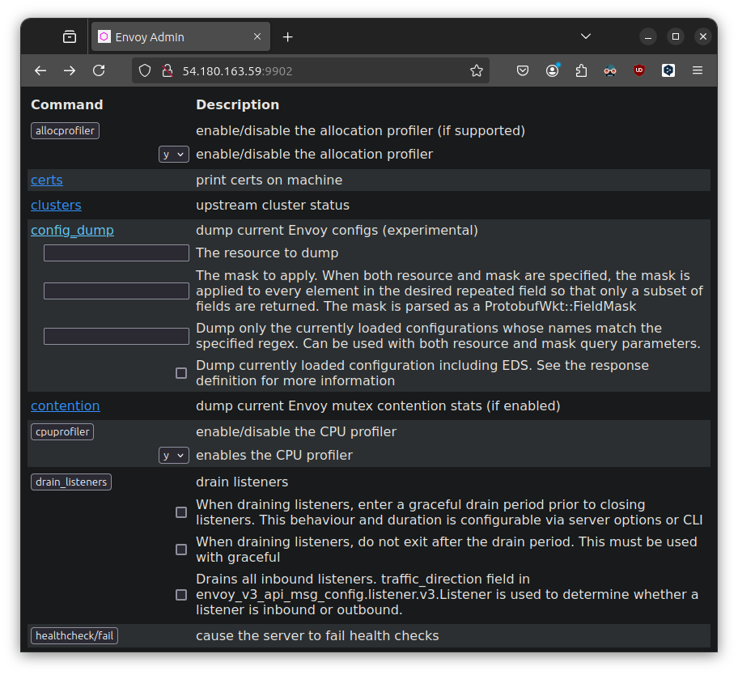

> 따로 슥 찾아보니, envoy는 Micro Service Architecture 등 구현된 단위 기능간의 통신을 위한 L7 Proxy 라고 합니다.  
> Docker Compose 정도나 일반 서비스에서는 굳이 필요하지는 않을 것 같지만, Service Mesh 환경에서는 알아두면 좋을 것 같아 훝어봅니다.  

[CloudNet@](https://gasidaseo.notion.site/CloudNet-Blog-c9dfa44a27ff431dafdd2edacc8a1863)에서 진행하고 있는 **K**8s **A**dvanced **N**etwork **S**tudy(이하, KANS)를 통해 학습한 내용을 정리합니다.  

## 1. Envoy Installation

- Docs: [Installing Envoy](https://www.envoyproxy.io/docs/envoy/latest/start/install)  

```bash
wget -O- https://apt.envoyproxy.io/signing.key | sudo gpg --dearmor -o /etc/apt/keyrings/envoy-keyring.gpg
echo "deb [signed-by=/etc/apt/keyrings/envoy-keyring.gpg] https://apt.envoyproxy.io jammy main" | sudo tee /etc/apt/sources.list.d/envoy.list
sudo apt-get update
sudo apt-get install envoy
envoy --version
```

학습환경은 root로 접속되어 있기에 sudo는 쓰지 않았습니다. 

```bash
wget -O- https://apt.envoyproxy.io/signing.key | sudo gpg --dearmor -o /etc/apt/keyrings/envoy-keyring.gpg
--2024-10-15 09:46:22--  https://apt.envoyproxy.io/signing.key
Resolving apt.envoyproxy.io (apt.envoyproxy.io)... 13.215.144.61, 13.251.96.10, 2406:da18:880:3802::c8, ...
Connecting to apt.envoyproxy.io (apt.envoyproxy.io)|13.215.144.61|:443... connected.
HTTP request sent, awaiting response... 200 OK
Length: 3158 (3.1K) [application/vnd.apple.keynote]
Saving to: ‘STDOUT’

-                   100%[===================>]   3.08K  --.-KB/s    in 0s      

2024-10-15 09:46:23 (86.8 MB/s) - written to stdout [3158/3158]

echo "deb [signed-by=/etc/apt/keyrings/envoy-keyring.gpg] https://apt.envoyproxy.io jammy main" | sudo tee /etc/apt/sources.list.d/envoy.list
deb [signed-by=/etc/apt/keyrings/envoy-keyring.gpg] https://apt.envoyproxy.io jammy main
apt-get update && apt-get install envoy -y
Reading package lists... Done
Building dependency tree... Done
Reading state information... Done
The following NEW packages will be installed:
  envoy
0 upgraded, 1 newly installed, 0 to remove and 8 not upgraded.
Need to get 73.2 MB of archives.
After this operation, 0 B of additional disk space will be used.
Get:1 https://apt.envoyproxy.io jammy/main amd64 envoy amd64 1.31.2 [73.2 MB]
Fetched 73.2 MB in 6s (12.2 MB/s)
Selecting previously unselected package envoy.
(Reading database ... 66661 files and directories currently installed.)
Preparing to unpack .../envoy_1.31.2_amd64.deb ...
Unpacking envoy (1.31.2) ...
Setting up envoy (1.31.2) ...

You have installed the Envoy proxy server.

You can check your Envoy version by running the following in a terminal:

  $ envoy --version

Documentation for your version is available at:

  https://www.envoyproxy.io/docs

The Envoy project can be found at:

  https://github.com/envoyproxy/envoy

Scanning processes...                                                           
Scanning linux images...                                                        

Running kernel seems to be up-to-date.

No services need to be restarted.

No containers need to be restarted.

No user sessions are running outdated binaries.

No VM guests are running outdated hypervisor (qemu) binaries on this host.
envoy --version

envoy  version: cc4a75482810de4b84c301d13deb551bd3147339/1.31.2/Clean/RELEASE/BoringSSL

```

- 옵션 확인 

envoy 옵션은 `envoy -h` 로 확인가능합니다.  
man page는 따로 설치되지 않는 것 같습니다.  

```bash  
man envoy
# No manual entry for envoy
```

## 2. Envoy Quick start  

- 잘 모르겠으니 그냥 따라합니다.  
- [Envoy Docs](https://www.envoyproxy.io/docs/envoy/latest/start/quick-start/)  

### (a) Config 데모 적용

한 쪽에는 Envoy를 켜고, 한 쪽에서는 접속 테스트를 해볼 겁니다.  
스터디에서 같은 서브넷 구성이 된 환경을 제공해주셨기에, 이 점은 양해바랍니다.  

- Terminal 0) Turn On Envoy  
  - foreground 상태라, 켜놓은 상태에서 다른 터미널을 엽니다.  

```bash  
curl -O https://www.envoyproxy.io/docs/envoy/latest/_downloads/92dcb9714fb6bc288d042029b34c0de4/envoy-demo.yaml
envoy -c envoy-demo.yaml
```  

- Terminal 1) 테스트  

```bash
ss -tnlp
# State    Recv-Q   Send-Q     Local Address:Port        Peer Address:Port   Process                                                                    
# LISTEN   0        4096       127.0.0.53%lo:53               0.0.0.0:*       users:(("systemd-resolve",pid=347,fd=14))                                 
# LISTEN   0        128              0.0.0.0:22               0.0.0.0:*       users:(("sshd",pid=703,fd=3))                                             
# LISTEN   0        4096             0.0.0.0:10000            0.0.0.0:*       users:(("envoy",pid=10390,fd=25))                                         
# LISTEN   0        4096             0.0.0.0:10000            0.0.0.0:*       users:(("envoy",pid=10390,fd=24))                                         
# LISTEN   0        511                    *:80                     *:*       users:(("apache2",pid=2376,fd=4),("apache2",pid=2375,fd=4),("apache2",pid=2373,fd=4))
# LISTEN   0        128                 [::]:22                  [::]:*       users:(("sshd",pid=703,fd=4))  
curl -s http://127.0.0.1:10000 | grep -o "<title>.*</title>"
# <title>Envoy proxy - home</title>
echo -e "http://$(curl -s ipinfo.io/ip):10000"
# http://54.180.163.59:10000
```


- Terminal2) Test in k3s master node  
  - `192.168.10.200`: Where envoy is running  

```bash
curl -s http://192.168.10.200:10000 | grep -o "<title>.*</title>" 
# <title>Envoy proxy - home</title>
```

### (b) Config 설정 변경

앞서 구동한 envoy를 종료하고, 다시 실행합니다.  
`-c` 나 `--config-path` 옵션은 동일합니다.  
다만, 옵션 override를 할 때, 추가로 merging 되는 환경변수는  
`--config-path` 옵션을 사용하도록 권하는 것 같습니다.  

```bash
cat <<EOT> envoy-override.yaml
admin:
  address:
    socket_address:
      address: 0.0.0.0
      port_value: 9902
EOT

envoy -c envoy-demo.yaml --config-path "$(cat envoy-override.yaml)"
```

이 경우, 10000 Port 외에 추가로 9902 포트를 통해 Admin 페이지에 접근 할 수 있었습니다.  



### (c) Config 유효성 검사

`--mode validate` 옵션을 통해, 설정 파일의 유효성을 검사할 수 있습니다.  

```bash
envoy --mode validate -c envoy-demo.yaml  
# [2024-10-19 15:45:46.382][10661][info][main] [source/server/server.cc:879] runtime: {}
# [2024-10-19 15:45:46.383][10661][info][config] [source/server/configuration_impl.cc:168] loading tracing configuration
# [2024-10-19 15:45:46.383][10661][info][config] [source/server/configuration_impl.cc:124] loading 0 static secret(s)
# [2024-10-19 15:45:46.383][10661][info][config] [source/server/configuration_impl.cc:130] loading 1 cluster(s)
# [2024-10-19 15:45:46.384][10661][info][config] [source/server/configuration_impl.cc:138] loading 1 listener(s)
# [2024-10-19 15:45:46.386][10661][warning][misc] [source/extensions/filters/network/http_connection_manager/config.cc:88] internal_address_config is not configured. The existing default behaviour will trust RFC1918 IP addresses, but this will be changed in next release. Please explictily config internal address config as the migration step or config the envoy.reloadable_features.explicit_internal_address_config to true to untrust all ips by default
# [2024-10-19 15:45:46.389][10661][info][config] [source/server/configuration_impl.cc:154] loading stats configuration
# configuration 'envoy-demo.yaml' OK  
```  

### (d) Envoy logging 설정

기본적으로 `/dev/stderr`에 로깅을 한다고 합니다.  
character special file(문자 특수 파일)이네요.  

랄까, container 환경에서는 stderr/stdout을 통해 일반적으로 로깅하는 것 같긴 합니다.  

```bash
readlink -e /dev/stderr
# /dev/pts/3
readlink /dev/stderr
# /proc/self/fd/2
readlink /proc/self/fd/2
# /dev/pts/3
ls -l /dev/pts/3
# crw------- 1 root tty 136, 3 Oct 19 16:00 /dev/pts/3
```

#### [택1] 실행시 파라미터 설정

`--log-level` 옵션을 통해, 로깅할 경로를 지정할 수 있습니다.  

```bash  
# ls /var/log/envoy
# ls: cannot access '/var/log/envoy': No such file or directory
# mkdir -p /var/log/envoy
mkdir -p /tmp/envoy-logs
envoy -c envoy-demo.yaml --log-path /tmp/envoy-logs/custom.log
```  

#### [택2] Admin 인터페이스에서 설정  


```bash  
cat envoy-demo.yaml | grep -A 3 -B 3 access_log:
        # typed_config:
        #   "@type": type.googleapis.com/envoy.extensions.filters.network.http_connection_manager.v3.HttpConnectionManager
        #   stat_prefix: ingress_http
        #   access_log:
        #   - name: envoy.access_loggers.stdout
        #     typed_config:
        #       "@type": type.googleapis.com/envoy.extensions.access_loggers.stream.v3.StdoutAccessLog
```  

#### [이외] Log extension  

- Log [extension](https://www.envoyproxy.io/docs/envoy/latest/api-v3/config/config#api-v3-config)을 통해, 다양한 로깅 설정을 할 수 있습니다.

### (e) Envoy networking  

기본값은 IPv6와 IPv4를 모두 활성화하나 IPv6를 비활성화하여야하는 상황이 있다면,  
데모 설정파일같이 `dns_lookup_family`를 `V4_ONLY`로 설정하면 되겠습니다.  
linux 호스트가 아닌 환경에서도 해당 케이스가 있을 수 있다고 합니다. ([Docker Docs](https://docs.docker.com/engine/daemon/ipv6/))  

```bash
cat envoy-demo.yaml | grep -A 7 -B 4 dns_lookup_family
  clusters:
  - name: service_envoyproxy_io
    type: LOGICAL_DNS
    # Comment out the following line to test on v6 networks
    dns_lookup_family: V4_ONLY
    load_assignment:
      cluster_name: service_envoyproxy_io
      endpoints:
      - lb_endpoints:
        - endpoint:
            address:
              socket_address:
```

### (f) Envoy debugging

#### [택1] basic  

`-l` 혹은 `--log-level` 옵션을 통해, 로깅 레벨을 설정할 수 있습니다.  

- Default: `info`  
- List: `trace`, `debug`, `info`, `warning/warn`, `error`, `critical`, `off`  

#### [택2] component  

`--component-log-level` 옵션을 통해, 컴포넌트별로 로깅을 지정할 수 있습니다.  
전역 로깅 레벨을 `off`로 설정하고, 특정 컴포넌트만 로깅하고 싶을 때 사용할 수 있습니다.  

- `ALL_LOGGER_IDS` : [GitHub](https://github.com/envoyproxy/envoy/blob/5691519b9430b119c9580ad57e965ed482db68e8/source/common/common/logger.h#L36)  

```bash
envoy -c envoy-demo.yaml -l off --component-log-level upstream:debug,connection:trace
```  


