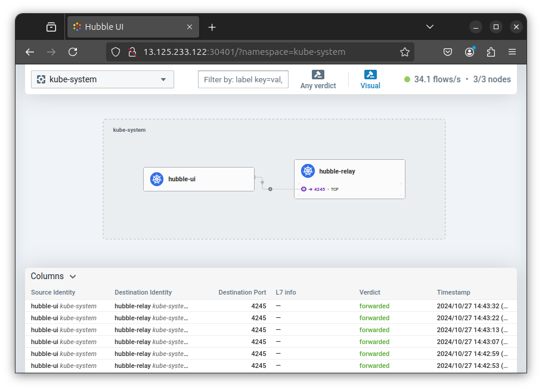

그럼 매번 실패만 했던 Cilium 배포를 한번 해볼까요?  

[CloudNet@](https://gasidaseo.notion.site/CloudNet-Blog-c9dfa44a27ff431dafdd2edacc8a1863)에서 진행하고 있는 **K**8s **A**dvanced **N**etwork **S**tudy(이하, KANS)를 통해 학습한 내용을 정리합니다.  

## 1. CSP VM 골라보기  

이렇게 쓴 이유는 결국 네트워크를 `잘` 알아야하는데,  
작년에 할 때는 그런거 생각도 안하고 그냥 올려보려 했으니 당연히 안 돌아가겠죠?  

- [trying2adult/What Is XDP And How Do You Use It In Linux](https://trying2adult.com/what-is-xdp-and-how-do-you-use-it-in-linux-amazon-ec2-example/)  

그냥 곰곰히 오리~~duckduckgo~~랑 투닥거리다보니, 비록 연식이 되긴 했지만  
클릭을 안하고는 못배길 위의 블로그 제목이 눈에 띄였습니다.  

### a. 사전 조사  

1. 커널:  
  - 현재 리눅스 커널 버전이 마이너 버전은 못 외우겠지만, 대충 메이저가 6버전이니 PASS
2. NIC:  
  - ENA(Elastic Network Adapter) 드라이버 언급이 나온 것으로 봐선,  
    지원 인스턴스를 올리면 덜 헤멜 것 같은 느낌이 듭니다.  
3. MTU 상한: 
  - cilium 최신 버전도 상한값이 3818인지 확인하면 좋을 듯합니다. 
4. NIC channels for RX/TX Queue:  
  - 절반 이상을 비워야한다는데, 채널 수 모르면 좀 많이 헤맬 것 같습니다.  

### b. AWS CLI로 확인 

- Docs:  
  - [Test whether enhanced networking is enabled](https://docs.aws.amazon.com/AWSEC2/latest/UserGuide/enhanced-networking-ena.html#test-enhanced-networking-ena)  
  - [Query for the latest Amazon Linux AMI IDs using AWS Systems Manager Parameter Store](https://aws.amazon.com/blogs/compute/query-for-the-latest-amazon-linux-ami-ids-using-aws-systems-manager-parameter-store/)

스터디에서 제공된 CloudFormation파일 중 AMI은  
Canonical에서 관리하는 SSM 파라미터를 통해 최신화를 할 수 있었습니다.  
그래서 그냥 이 SSM 파라미터를 통해 AMI ID를 얻어와 보죠.  

```bash
aws ssm get-parameters --names /aws/service/canonical/ubuntu/server/22.04/stable/current/amd64/hvm/ebs-gp2/ami-id --region ap-northeast-2
```

```json
{
    "Parameters": [
        {
            "Name": "/aws/service/canonical/ubuntu/server/22.04/stable/current/amd64/hvm/ebs-gp2/ami-id",
            "Type": "String",
            "Value": "ami-042e76978adeb8c48",
            "Version": 30,
            "LastModifiedDate": "2024-09-27T13:11:50.127000+09:00",
            "ARN": "arn:aws:ssm:ap-northeast-2::parameter/aws/service/canonical/ubuntu/server/22.04/stable/current/amd64/hvm/ebs-gp2/ami-id",
            "DataType": "aws:ec2:image"
        }
    ],
    "InvalidParameters": []
}
```

당연히 `enaSupport`가 `true`로 나오네요. 

```bash
aws ec2 describe-images --image-id ami-042e76978adeb8c48 --query "Images[].EnaSupport"
# [
#     true
# ]
```

눈감고 `c5.16xlarge` 를 띄워볼까 싶긴한데, 아래 문서에서 Nitro v2 버전 탭에 T3도 있는 것을 확인했네요.  
Cloudformation YAML에 기본 정의된 `t3.xlarge`를 써보겠습니다.  
- [Virtualized instances
/AWS](https://docs.aws.amazon.com/ec2/latest/instancetypes/ec2-nitro-instances.html#nitro-instance-types)

### c. 프로비저닝 후 기본 체크  

- 스터디에서 제공된 대로, `kube-proxy` 없이 운용 테스트를 할 것이기에 확인을 해보겠습니다.  
- 이미 `kubeadm` 배포 시, `--skip-phases=addon/kube-proxy` param이 적용되어 있습니다.  

- No `kube-proxy`  

```bash
# Access to Control Plane Node
ssh -i $Keypair ubuntu@$ControlPlaneIP  

# Not ready because of no kube-proxy 
kubectl get nodes
# NAME     STATUS     ROLES           AGE   VERSION
# k8s-s    NotReady   control-plane   14m   v1.30.6
# k8s-w1   NotReady   <none>          13m   v1.30.6
# k8s-w2   NotReady   <none>          13m   v1.30.6

# No kube-proxy
kubectl cluster-info
# Kubernetes control plane is running at https://192.168.10.10:6443
# CoreDNS is running at https://192.168.10.10:6443/api/v1/namespaces/kube-system/services/kube-dns:dns/proxy

# No kube-proxy  
kubectl get pod -A
# NAMESPACE     NAME                            READY   STATUS    RESTARTS   AGE
# kube-system   coredns-55cb58b774-h9dnm        0/1     Pending   0          14m
# kube-system   coredns-55cb58b774-vjzrk        0/1     Pending   0          14m
# kube-system   etcd-k8s-s                      1/1     Running   0          14m
# kube-system   kube-apiserver-k8s-s            1/1     Running   0          14m
# kube-system   kube-controller-manager-k8s-s   1/1     Running   0          14m
# kube-system   kube-scheduler-k8s-s            1/1     Running   0          14m
```

- 커널 확인: 안해도 되지만, 한번 보겠습니다.  

```bash
# Kernel Version
uname -a
# Linux k8s-s 6.8.0-1015-aws #16~22.04.1-Ubuntu SMP Mon Aug 19 19:38:17 UTC 2024 x86_64 x86_64 x86_64 GNU/Linux
hostnamectl | grep Kernel
          # Kernel: Linux 6.8.0-1015-aws

# XDP Support
grep -i CONFIG_XDP_SOCKETS /boot/config-$(uname -r)
# CONFIG_XDP_SOCKETS=y
# CONFIG_XDP_SOCKETS_DIAG=m
```

- NIC 확인  

```bash
netplan status | grep ethernet
# ●  1: lo ethernet UNKNOWN/UP (unmanaged)
# ●  2: ens5 ethernet UP (networkd: ens5)

# MTU
ip link show ens5 | grep mtu
# 2: ens5: <BROADCAST,MULTICAST,UP,LOWER_UP> mtu 9001 qdisc mq state UP mode DEFAULT group default qlen 1000


# RX/TX Queue
ethtool -l ens5
# Channel parameters for ens5:
# Pre-set maximums:
# RX:		n/a
# TX:		n/a
# Other:		n/a
# Combined:	4
# Current hardware settings:
# RX:		n/a
# TX:		n/a
# Other:		n/a
# Combined:	4

# Driver
ethtool -i ens5 | grep ena
# driver: ena
```

Cilium에서 요구사항을 따로 살펴봐야겠지만,  
MTU 및 RX/TX Queue 관련 채널 값을 바꿔야할 것으로 보입니다.  

## 2. Cilium 설치

- 설치 전에 미리 OS에서 파라미터 조정을 해보겠습니다.  

### a. 파라미터 조정

크게 두 가지 파라미터 조정해둡니다.  
- Maxium MTU: 3498  
  - 최신문서(v1.16.3)에서는 값이 더 낮아져서 3498로 조정합니다.  
- RX/TX Queue: more than half  

RX/TX Queue는 그렇다고 치고, MTU의 경우에는 왜 조정해야되는지 아래에도 설명되어있으니 참조하시면 됩니다.  
- [NodPort on AWS/cilium](https://docs.cilium.io/en/stable/network/kubernetes/kubeproxy-free/#nodeport-xdp-on-aws)

```bash
# MTU
ip link set dev ens5 mtu 3498
ip link show ens5 | grep mtu
2: ens5: <BROADCAST,MULTICAST,UP,LOWER_UP> mtu 3498 qdisc mq state UP mode DEFAULT group default qlen 1000

# RX/TX Queue
ethtool -L ens5 combined 1
ethtool -l ens5
# Channel parameters for ens5:
# Pre-set maximums:
# RX:		n/a
# TX:		n/a
# Other:		n/a
# Combined:	4
# Current hardware settings:
# RX:		n/a
# TX:		n/a
# Other:		n/a
# Combined:	1
```

### b. Cilium CLI 설치  

그냥 혹시 모르니 Cilium CLI 설치 미리 해두겠습니다. 아직 Major가 v1은 아닙니다.  
- Docs: [Install the Cilium CLI](https://docs.cilium.io/en/stable/gettingstarted/k8s-install-default/#install-the-cilium-cli)  

```bash  
curl -s https://raw.githubusercontent.com/cilium/cilium-cli/main/stable.txt  
# v0.16.19
CILIUM_CLI_VERSION=$(curl -s https://raw.githubusercontent.com/cilium/cilium-cli/main/stable.txt)
CLI_ARCH=amd64
if [ "$(uname -m)" = "aarch64" ]; then CLI_ARCH=arm64; fi
curl -L --fail --remote-name-all https://github.com/cilium/cilium-cli/releases/download/${CILIUM_CLI_VERSION}/cilium-linux-${CLI_ARCH}.tar.gz{,.sha256sum}
sha256sum --check cilium-linux-${CLI_ARCH}.tar.gz.sha256sum
sudo tar xzvfC cilium-linux-${CLI_ARCH}.tar.gz /usr/local/bin
rm cilium-linux-${CLI_ARCH}.tar.gz{,.sha256sum}
```

버전 확인을 안내대로 해봅시다. 

```bash
cilium version --client
# cilium-cli: v0.16.19 compiled with go1.23.1 on linux/amd64
# cilium image (default): v1.16.2
# cilium image (stable): v1.16.3
```

### c. helm 배포  

그냥 실패하면 cilium CLI로 설치하고 눈 감겠습니다.  

```bash  
helm repo add cilium https://helm.cilium.io/
# "cilium" has been added to your repositories
helm repo update
# Hang tight while we grab the latest from your chart repositories...
# ...Successfully got an update from the "cilium" chart repository
# Update Complete. ⎈Happy Helming!⎈

helm install cilium cilium/cilium --version 1.16.3 --namespace kube-system \
--set k8sServiceHost=192.168.10.10 --set k8sServicePort=6443 --set debug.enabled=true \
--set rollOutCiliumPods=true --set routingMode=native --set autoDirectNodeRoutes=true \
--set bpf.masquerade=true --set bpf.hostRouting=true --set endpointRoutes.enabled=true \
--set ipam.mode=kubernetes --set k8s.requireIPv4PodCIDR=true --set kubeProxyReplacement=true \
--set ipv4NativeRoutingCIDR=192.168.0.0/16 --set installNoConntrackIptablesRules=true \
--set hubble.ui.enabled=true --set hubble.relay.enabled=true --set prometheus.enabled=true --set operator.prometheus.enabled=true --set hubble.metrics.enableOpenMetrics=true \
--set hubble.metrics.enabled="{dns:query;ignoreAAAA,drop,tcp,flow,port-distribution,icmp,httpV2:exemplars=true;labelsContext=source_ip\,source_namespace\,source_workload\,destination_ip\,destination_namespace\,destination_workload\,traffic_direction}" \
--set operator.replicas=1
```

- 주요 파라미터 설명  

| 파라미터 | 설명 |
| --- | --- |
| debug.enabled | cilium 파드에 로그 레벨을 debug 설정 |
| autoDirectNodeRoutes | 동일 대역 내의 노드들 끼리는 상대 노드의 podCIDR 대역의 라우팅이 자동으로 설정 |
| endpointRoutes.enabled | 호스트에 endpoint(파드)별 개별 라우팅 설정 |
| hubble.relay.enabled | hubble 활성화 |
| hubble.ui.enabled | hubble UI 활성화 |
| ipam.mode | k8s IPAM 활용 |
| k8s.requireIPv4PodCIDR | k8s에서 IPv4 Pod CIDR를 요구 |
| kubeProxyReplacement | kube-proxy 없이 (최대한) 대체할수 있수 있게 |
| ipv4NativeRoutingCIDR=192.168.0.0/16 | 해당 대역과 통신 시 IP Masq 하지 않음, 보통 사내망 대역을 지정 |
| operator.replicas | cilium-operator 파드 기본 1개 |
| enableIPv4Masquerade | 파드를 위한 Masquerade |
| bpf.masquerade | 추가로 Masquerade 을 BPF 로 처리 |

```bash
NAME: cilium
LAST DEPLOYED: Sun Oct 27 11:58:59 2024
NAMESPACE: kube-system
STATUS: deployed
REVISION: 1
TEST SUITE: None
NOTES:
You have successfully installed Cilium with Hubble Relay and Hubble UI.

Your release version is 1.16.3.

For any further help, visit https://docs.cilium.io/en/v1.16/gettinghelp
```

... 스터디에서 안내해주신 파라미터를 넣어서 했습니다~~만, 이게 왜 되지...?~~  
이제, 추가 파라미터 주입안해도 정상적으로 해당 버전이 작동하고 있다고 확인할 수 있었습니다.  

```bash
cilium version
# cilium-cli: v0.16.19 compiled with go1.23.1 on linux/amd64
# cilium image (default): v1.16.2
# cilium image (stable): v1.16.3
# cilium image (running): 1.16.3
```
## 3. Cilium 살펴보기

### a. 배포 이후 상태  

이제 `kube-proxy` 없이도 각 Node가 Ready 상태임을 확인할 수 있습니다.  

```bash
kubectl get nodes
# NAME     STATUS   ROLES           AGE   VERSION
# k8s-s    Ready    control-plane   20h   v1.30.6
# k8s-w1   Ready    <none>          20h   v1.30.6
# k8s-w2   Ready    <none>          20h   v1.30.6
```

`kube-proxy`는 없습니다.  

```bash
kubectl get pods -A
# NAMESPACE     NAME                               READY   STATUS    RESTARTS   AGE
# kube-system   cilium-2g4bh                       1/1     Running   0          91m
# kube-system   cilium-522nn                       1/1     Running   0          91m
# kube-system   cilium-csdd7                       1/1     Running   0          91m
# kube-system   cilium-envoy-82drs                 1/1     Running   0          91m
# kube-system   cilium-envoy-96vst                 1/1     Running   0          91m
# kube-system   cilium-envoy-gnh2q                 1/1     Running   0          91m
# kube-system   cilium-operator-76bb588dbc-57945   1/1     Running   0          91m
# kube-system   coredns-55cb58b774-h9dnm           1/1     Running   0          20h
# kube-system   coredns-55cb58b774-vjzrk           1/1     Running   0          20h
# kube-system   etcd-k8s-s                         1/1     Running   0          20h
# kube-system   hubble-relay-88f7f89d4-r4ccq       1/1     Running   0          91m
# kube-system   hubble-ui-59bb4cb67b-l5ttc         2/2     Running   0          91m
# kube-system   kube-apiserver-k8s-s               1/1     Running   0          20h
# kube-system   kube-controller-manager-k8s-s      1/1     Running   0          20h
# kube-system   kube-scheduler-k8s-s               1/1     Running   0          20h

kubectl get svc -A
# NAMESPACE     NAME             TYPE        CLUSTER-IP      EXTERNAL-IP   PORT(S)                  AGE
# default       kubernetes       ClusterIP   10.10.0.1       <none>        443/TCP                  20h
# kube-system   cilium-envoy     ClusterIP   None            <none>        9964/TCP                 93m
# kube-system   hubble-metrics   ClusterIP   None            <none>        9965/TCP                 93m
# kube-system   hubble-peer      ClusterIP   10.10.161.48    <none>        443/TCP                  93m
# kube-system   hubble-relay     ClusterIP   10.10.150.231   <none>        80/TCP                   93m
# kube-system   hubble-ui        ClusterIP   10.10.183.16    <none>        80/TCP                   93m
# kube-system   kube-dns         ClusterIP   10.10.0.10      <none>        53/UDP,53/TCP,9153/TCP   20h
```

NAT 테이블에 설정된 모든 규칙을 알아봅시다: `iptables -t -nat -S`  

```bash
iptables -t nat -S
# -P PREROUTING ACCEPT
# -P INPUT ACCEPT
# -P OUTPUT ACCEPT
# -P POSTROUTING ACCEPT
# -N CILIUM_OUTPUT_nat
# -N CILIUM_POST_nat
# -N CILIUM_PRE_nat
# -N KUBE-KUBELET-CANARY
# -A PREROUTING -m comment --comment "cilium-feeder: CILIUM_PRE_nat" -j CILIUM_PRE_nat
# -A OUTPUT -m comment --comment "cilium-feeder: CILIUM_OUTPUT_nat" -j CILIUM_OUTPUT_nat
# -A POSTROUTING -m comment --comment "cilium-feeder: CILIUM_POST_nat" -j CILIUM_POST_nat
```

### b. Cilium CLI 활용하기 

[Sigrid Jin](https://sigridjin.medium.com/ebpf-and-cillum-cni-1c3ad2a1e4e9)님의 가이드를 참조했습니다.  

Alias 설정을 해두면 편하게 사용할 수 있다고 하니, 일단 해봅시다.  
helm 배포 시, `kube-proxy`를 대체하도록 설정하였으니,  
마지막에 당연히 True가 나오긴 해야합니다.  

```bash
kubectl get -l k8s-app=cilium pods -n kube-system --field-selector spec.nodeName=k8s-s  -o jsonpath='{.items[0].metadata.name}'
# cilium-522nn
export CILIUMPOD0=$(kubectl get -l k8s-app=cilium pods -n kube-system --field-selector spec.nodeName=k8s-s  -o jsonpath='{.items[0].metadata.name}')
kubectl exec -it $CILIUMPOD0 -n kube-system -c cilium-agent -- cilium status
# KVStore:                 Ok   Disabled
# Kubernetes:              Ok   1.30 (v1.30.6) [linux/amd64]
# Kubernetes APIs:         ["EndpointSliceOrEndpoint", "cilium/v2::CiliumClusterwideNetworkPolicy", "cilium/v2::CiliumEndpoint", "cilium/v2::CiliumNetworkPolicy", "cilium/v2::CiliumNode", "cilium/v2alpha1::CiliumCIDRGroup", "core/v1::Namespace", "core/v1::Pods", "core/v1::Service", "networking.k8s.io/v1::NetworkPolicy"]
# KubeProxyReplacement:    True   [ens5   192.168.10.10 fe80::b1:11ff:feba:7ce9 (Direct Routing)]
# Host firewall:           Disabled
# SRv6:                    Disabled
# CNI Chaining:            none
# CNI Config file:         successfully wrote CNI configuration file to /host/etc/cni/net.d/05-cilium.conflist
# Cilium:                  Ok   1.16.3 (v1.16.3-f2217191)
# NodeMonitor:             Listening for events on 4 CPUs with 64x4096 of shared memory
# Cilium health daemon:    Ok   
# IPAM:                    IPv4: 4/254 allocated from 172.16.0.0/24, 
# IPv4 BIG TCP:            Disabled
# IPv6 BIG TCP:            Disabled
# BandwidthManager:        Disabled
# Routing:                 Network: Native   Host: BPF
# Attach Mode:             TCX
# Device Mode:             veth
# Masquerading:            BPF   [ens5]   192.168.0.0/16 [IPv4: Enabled, IPv6: Disabled]
# Controller Status:       29/29 healthy
# Proxy Status:            OK, ip 172.16.0.231, 0 redirects active on ports 10000-20000, Envoy: external
# Global Identity Range:   min 256, max 65535
# Hubble:                  Ok              Current/Max Flows: 4095/4095 (100.00%), Flows/s: 26.15   Metrics: Ok
# Encryption:              Disabled        
# Cluster health:          3/3 reachable   (2024-10-27T05:05:44Z)
# Modules Health:          Stopped(0) Degraded(0) OK(45)
alias c0="kubectl exec -it $CILIUMPOD0 -n kube-system -c cilium-agent -- cilium"
c0 status | grep KubeProxyReplacement
# KubeProxyReplacement:    True   [ens5   192.168.10.10 fe80::b1:11ff:feba:7ce9 (Direct Routing)]
```

iptables MASQ 대신 eBPF MASQ 사용을 아래와 같이 확인할 수 있습니다.  

```bash
cilium config view | grep -i masq
# enable-bpf-masquerade                             true
# enable-ipv4-masquerade                            true
# enable-ipv6-masquerade                            true
# enable-masquerade-to-route-source                 false
```

### c. Hubble UI  

가시성이 있는 것을 다들 좋아하고, 저도... 살짝 께름칙하지만 좋아하기 때문에  
Hublle UI를 띄워볼까요?  

이미 helm을 통해서, 해당 서비스가 올라와 있는 것을 확인합니다.  

```bash
kubectl get -n kube-system svc hubble-ui
# NAME        TYPE        CLUSTER-IP     EXTERNAL-IP   PORT(S)   AGE
# hubble-ui   ClusterIP   10.10.183.16   <none>        80/TCP    146m
```

이걸 ~~살짝 맘에는 안들지만~~ NodePort로 노출시켜봅시다.  

```bash
kubectl patch -n kube-system svc hubble-ui -p '{"spec": {"type": "NodePort"}}'
# service/hubble-ui patched
b
HubbleUiNodePort=$(kubectl get svc -n kube-system hubble-ui -o jsonpath={.spec.ports[0].nodePort})
# 30401
echo -e "Hubble UI URL = http://$(curl -s ipinfo.io/ip):$HubbleUiNodePort"Port"
# Hubble UI URL = http://13.125.233.122:30401
```

우오오오... UI 잘 뜨네요.  

  

아무것도 안띄워서, `kube-system` 살펴보겠습니다.  

  

## 9. 뱀다리  

### a. Netplan  

Ubuntu 에서는 언제부터인지 기억이 안나는데, 기본값으로 netplan을 네트워크 설정 도구로 사용합니다.  
YAML로 네트워크 설정을 할 수 있다는 점을 포함해 많은 이점도 있고,  
버전 엡데이트를 통해 개선이 많이 이루어져서 관심이 있다면 살펴보는 것도 좋을 것 같습니다.  

[Design Overview/Netplan](https://netplan.io/design#design-overview)  

실제로도 Ubuntu 기반의 EC2를 살펴보면 다음과 같습니다. 

```bash
cat /etc/netplan/50-cloud-init.yaml 
# # This file is generated from information provided by the datasource.  Changes
# # to it will not persist across an instance reboot.  To disable cloud-init's
# # network configuration capabilities, write a file
# # /etc/cloud/cloud.cfg.d/99-disable-network-config.cfg with the following:
# # network: {config: disabled}
# network:
#     ethernets:
#         ens5:
#             dhcp4: true
#             dhcp6: false
#             match:
#                 macaddress: 02:b1:11:ba:7c:e9
#             set-name: ens5
#     version: 2
```

### b. 그래서 XDP는 어디에 있나요?  

이 글에서 일단 helm으로 hubble UI까지 뜨는 것을 봤으니, 언젠가... 이어서 써보고 싶네요.  

## Reference  

중간에 언급된 Docs 외에 참고한 유용한 링크입니다.  

- [Bonding 인터페이스에서 Cilium XDP 활성화 하기/음하하](https://nuguni.tistory.com/96)  
- [eBPF and Cillum CNI/Sigrid Jin@Medium](https://sigridjin.medium.com/ebpf-and-cillum-cni-1c3ad2a1e4e9)  
