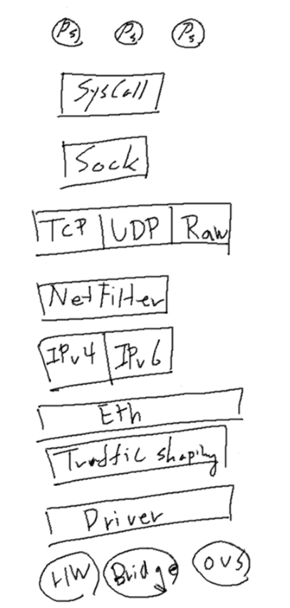
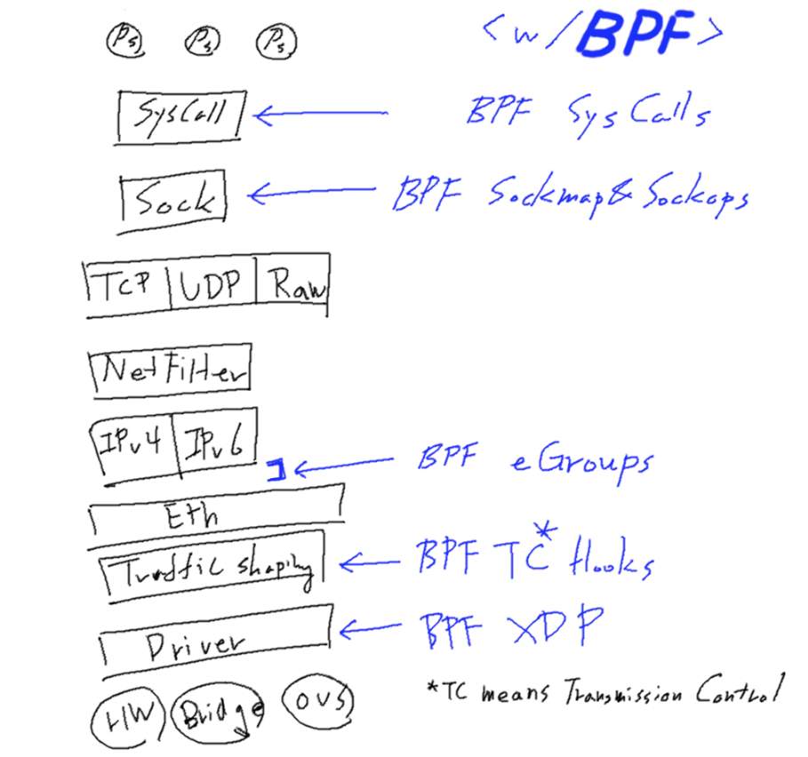
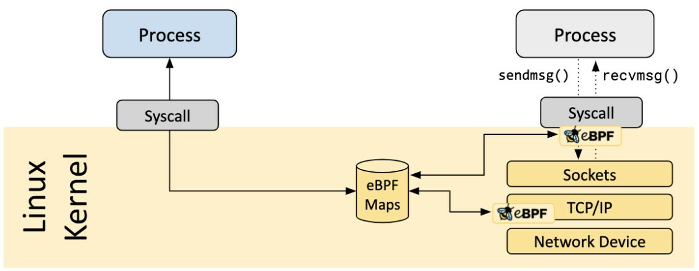

어느덧 이번 스터디도 대망의 Cilium을 다루기 시작합니다.  
Cilium에 이다지도 (저를 포함한) 모두가 열광하는지 알아보기 전에  
근간이 되는 eBPF를 먼저 가볍게 알아보고 가려합니다.  

[CloudNet@](https://gasidaseo.notion.site/CloudNet-Blog-c9dfa44a27ff431dafdd2edacc8a1863)에서 진행하고 있는 **K**8s **A**dvanced **N**etwork **S**tudy(이하, KANS)를 통해 학습한 내용을 정리합니다.  

## 1. Linux Network Stack  

스터디 1주차의 [Jenkins 컨테이너에서 Host의 Docker 데몬 사용하기](https://blog.minseong.xyz/post/kans-1w-container-socket/)에서 가볍게 맛을 보고 도망치기 바빴지만, 여튼 아래의 사항은 스쳐지나갔습니다.  

- iptables: userspace 기반의 네트워킹

ufw, firewalld 등의 방화벽 프로그램이 이를 래핑하였다는 건 대충 넘어간다하더라도,  
Linux 환경에서 userspace를 통해 제어를 한다는 것을 알아두었을 때,  
이를 네트워킹 스텍으로 사용하고 있는 기존의 방식이 약간이라도 번거롭다는 것을 느낄 수 있습니다.  

그 의미는 yaml에 적용하면, 일일히 iptables를 수정하여 사용한다는 의미이기 때문입니다.  

이를 또 풀게되면...  

- 한번 규칙(rule)을 수정한다고 할때, 재생성=모든 규칙을 업데이트한다.  
- Chaning 된 규칙은 연결리스트이기 때문에 모든 동작의 복잡도는 O(n).  
- ACLs는 우선순위가 높은 규칙에서 순차적으로 적용됩니다.  
- IP 및 포트를 기반으로 하며, L7 프로토콜에 대해서는 지원이 되지 않습니다.  
- 새로운 IP 혹은 포트가 추가되면, 규칙은 추가되어야하고 체이닝은 바뀌어야합니다.  
  즉 그때마다 모든 규칙을 업데이트해야하는 것입니다.  

결국 `kube-proxy`처럼 이를 활용한 Kubernetes에 있어 리소스 오버헤드가 발생한다고, [Youtube/FOSDEM2020](https://www.youtube.com/watch?v=lrP7hk-EW4U)에 나와있습니다.  

- 일반적으로 iptables를 쓰는 것이 kernel 단의 netfilter를 조작하는 익숙한 방식이라 적용하기 효율적이었을 것이라 생각됩니다.  

## 2. BPF(Berkeley Packet Filter) kernel hooks

BPF를 커널에 삽입하여, 패킷을 필터링(통제)할 수 있다고 하는데... 이걸로는 크게 와닿지 않고요.  
[다른 글](https://blog.naver.com/kangdorr/222593265958)에도 tcpdump를 대표적인 사용례로 소개하고 있습니다.  

[도서출판 인사이트](https://blog.insightbook.co.kr/2021/07/19/bpf-%EC%84%B1%EB%8A%A5-%EB%B6%84%EC%84%9D-%EB%8F%84%EA%B5%AC-bpf-%ED%8A%B8%EB%A0%88%EC%9D%B4%EC%8B%B1%EC%9D%84-%ED%86%B5%ED%95%9C-%EB%A6%AC%EB%88%85%EC%8A%A4-%EC%8B%9C%EC%8A%A4%ED%85%9C-%EA%B4%80/)에 따르면, 패킷 필터링을 넘어 `고급 성능 분석 도구 등에 이용되는 다양한 분야에 사용가능한 범용 실행 엔진을 일컽는 독립적 기술`이라고 하는데, 커널의 내부를 들여다 볼 수 있는 초능력(매직!)을 준다고 합니다.  

컴퓨터과학에 초능력이라니, 처음엔 갸웃했는데 Cilium을 보면서 그저 믿는 수밖에 없었죠.  

  

- [BPF: A Tour of Program Types](https://blogs.oracle.com/linux/post/bpf-a-tour-of-program-types)  
- [BPF In Depth: Communicating with Userspace](https://blogs.oracle.com/linux/post/bpf-in-depth-communicating-with-userspace)  
- [bpftune - Using Reinforcement Learning in BPF](https://blogs.oracle.com/linux/post/bpftune-using-reinforcement-learning-in-bpf)  

위의 포스팅에 자세히 나와있지만, 제가 이해하려고 아래와 같이 끄적였습니다.  

- Syscall

`userspace` map interaction(상호작용)을 수행합니다.  

- Sockmap

BPF Map의 한 유형으로 보이며, 소켓을 저장하고 관리하는데 사용되는 것 같습니다.  

> BPF Map은 BPF 프로그램이 다른 BPF프로그램 및 map 데이터를 볼 수 있는 다른 `userspace` 프로그램으로부터 정보를 얻는 데 쓰인다고 합니다.  
> 더 자세한 것은 [The Linux Kernel Docs](https://docs.kernel.org/6.10/bpf/map_sockmap.html)에서.  

- Sockops: also called `TCP-BPF` mechanism that support setting TCP parameters.   

> ~~ops라길래, xops인줄 알았는데~~ operand인 건에 대하여;  

한번 찾아보니 좋은 글이 있었습니다. [eBPF系列-ebpf map之使用sockmap提升本地socket转发](https://jaegerw2016.github.io/posts/2022/11/25/Use-eBPF-map-sockmap-redir-localhost-socket.html)  
[netdevconf/brakmo-tcpbpf-talk](https://netdevconf.info/2.2/papers/brakmo-tcpbpf-talk.pdf)와 병행해서 읽어본 바, 현재 이해한 사항은...  

(1) SYN 수신 시 : BPF_SOCK_OPS_ACTIVE_ESTABLISHED_CB 히트  
(2) SYN-ACK 수신 시 : BPF_SOCK_OPS_PASSIVE_ESTABLISHED_CB 히트  
(3) 이 외에도 RTO 시간을 동적으로 조정가능하다는 것인데, 아래 블로그에 재미나'보이는' 예시가 있습니다. 언젠가 저 RTO를 왜 조작하는지 이유를 좀 더 알아봤으면 좋겠네요.  

[Customize TCP initial RTO (retransmission timeout) with BPF](https://arthurchiao.art/blog/customize-tcp-initial-rto-with-bpf/)  

- Cgroups / TC(Transmission Control) Hooks  

> 사실 `TC가 트래픽 컨트롤 아닌가`, `IPv4, IPv6 는 cgroup 이죠?` 라는 질문을 받고,  
> 뭔가 잘?못 되었다는 생각이 들어서 이 글을 통해 정말 조금만 더 파보기로 했습니다. (또 후회 중)  

[OpenEuler/eBPF Introduction](https://www.openeuler.org/en/blog/MrRlu/2021-01-04-openEuler-eBPF-introduce.html)에 의하면 cgroup의 경우, 당연한 이야기겠지만 Permission 이야기로 생각이 되는데, [BPF_PROG_TYPE_CGROUP_DEVICE](https://docs.ebpf.io/linux/program-type/BPF_PROG_TYPE_CGROUP_DEVICE/)처럼 쓸 수 있다고 생각되어 집니다.  

[eunomia/eBPF Tutorial by Example 20: tc Traffic Control](https://eunomia.dev/tutorials/20-tc/)에서  
tc(traffic control)과 TC(Transmission Control)을 구분하고 있는데,  
결국 무엇인지는 아직 헷갈립니다. ~~전송하는건 똑같으니 그만 좀 생각해볼까~~  

아직은 미제임으로 아래의 글과 함께 보류해보겠습니다.  
[Whirl Offload/Understanding tc “direct action” mode for BPF](https://qmonnet.github.io/whirl-offload/2020/04/11/tc-bpf-direct-action/)  
[man7/tc-bpf(8)#DESCRIPTION](https://www.man7.org/linux/man-pages/man8/tc.8.html#DESCRIPTION)  

> 당연히 traffic control로 기재야 되어있겠지만, 설명을 읽어보니  
> `(SHAPING) When traffic is shaped, its rate of transmission is under control.`  
> 이렇게 적혀있어서, 결국 전송속도 제어이니 둘 다 맞는 말 같기도...?  
> 여튼 shaping은 burst 완화에 도움이 되고, egress 에서 발생한다고 합니다.  

- XDP

요거도 다음 시간에 냥냥

## 3. eBPF(Extended BPF)  

앞의 설명이 장황했는데, 아래의 그림을 조금은 이해할 수 있게 되었습니다.  

  
> [Source: Is it Observable / How to observe your network with eBPF](https://isitobservable.io/observability/kubernetes/how-to-observe-your-network-with-ebpf)

그림판 실력보고 급 우울해져서 집에 가려고요.  
훌쩍  

