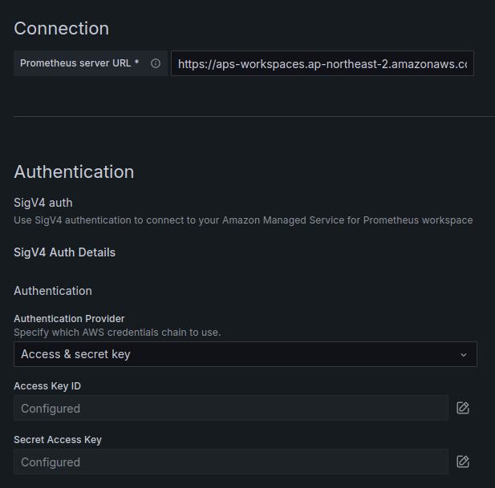
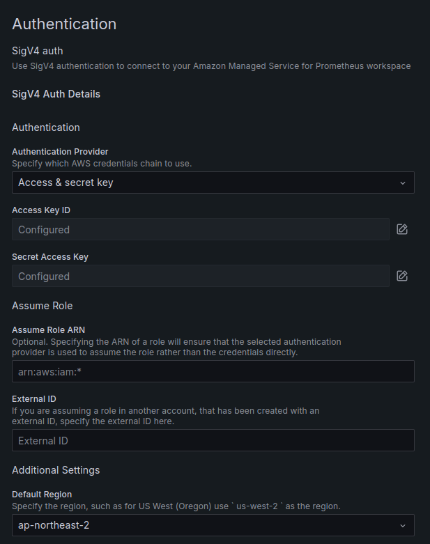

> Grafana Cloud 첫 사용기  

[CloudNet@](https://gasidaseo.notion.site/CloudNet-Blog-c9dfa44a27ff431dafdd2edacc8a1863)에서 진행하고 있는 **K**8s **A**dvanced **N**etwork **S**tudy(이하, KANS)를 통해 학습한 내용을 정리합니다.  

이번 주차는 실감이 아직 안나는데, 스터디 마지막 주차입니다.  
그래서 **여러분이 잘 알고, 매우 좋아하는** EKS를 통해, CoreDNS 이슈를 모니터링하는 Hands-on을 차근차근 따라해보려고합니다.  

- [AWS Cloud Operations Blog/Monitoring CoreDNS for DNS throttling issues using AWS Open source monitoring services](https://aws.amazon.com/ko/blogs/mt/monitoring-coredns-for-dns-throttling-issues-using-aws-open-source-monitoring-services/)

위의 Blog를 그대로 따라해볼 겁니다.  

## 0. EKS Cluster 생성  

스터디에서 제공된 CloudFormation을 통해 EKS Cluster를 생성해볼까합니다.  
`eksctl`이 언급되어 있어서 왠지... 나중에 롤백하고 태초마을부터 `eksctl` 기반 CloudFormation 배포를 할 것 같은 불안함이 있지만 해보죠(?).  

음 아직은 기우였네요. 기억을 끄집어내보니 bation host에서 `eksctl` 을 사용해서 EKS Cluster 생성하는 것까지 스크립팅 되어 있다고, 말씀을 들었던 것 같습니다.  

  

  

생성된 bastion에 접속해서, 환경변수 등을 확인해보겠습니다.  

```bash
ssh -i ~/.ssh/id_ed25519 ec2-user@43.201.85.169 # BASTION-HOST-IP  
# The authenticity of host '43.201.85.169 (43.201.85.169)' can't be established.
# ED25519 key fingerprint is SHA256:efFNF+24E7UUEzXzhqBDU0ss74yBmhGiaOI25XOVG9A.
# This key is not known by any other names.
# Are you sure you want to continue connecting (yes/no/[fingerprint])? yes
# Warning: Permanently added '43.201.85.169' (ED25519) to the list of known hosts.
#    ,     #_
#    ~\_  ####_        Amazon Linux 2
#   ~~  \_#####\
#   ~~     \###|       AL2 End of Life is 2025-06-30.
#   ~~       \#/ ___
#    ~~       V~' '->
#     ~~~         /    A newer version of Amazon Linux is available!
#       ~~._.   _/
#          _/ _/       Amazon Linux 2023, GA and supported until 2028-03-15.
#        _/m/'           https://aws.amazon.com/linux/amazon-linux-2023/

# 10 package(s) needed for security, out of 13 available
# Run "sudo yum update" to apply all updates.
# (cm112@myeks:N/A) [root@myeks-bastion ~]# clear
```

```bash
tail -f /var/log/cloud-init-output.log \
#  66 †php8.1                   available    [ =stable ]
#  67  awscli1                  available    [ =stable ]
#  68 †php8.2                   available    [ =stable ]
#  69  dnsmasq                  available    [ =stable ]
#  70  unbound1.17              available    [ =stable ]
#  72  collectd-python3         available    [ =stable ]
# † Note on end-of-support. Use 'info' subcommand.
# Created symlink from /etc/systemd/system/multi-user.target.wants/docker.service to /usr/lib/systemd/system/docker.service.
# cloudinit End!
# Cloud-init v. 19.3-46.amzn2.0.2 finished at Sat, 02 Nov 2024 09:44:24 +0000. Datasource DataSourceEc2.  Up 91.81 seconds
^C
tail -f /root/create-eks.log
    "availabilityZones": [
        "ap-northeast-2c",
        "ap-northeast-2b",
        "ap-northeast-2a"
    ],
    "cloudWatch": {
        "clusterLogging": {}
    }
}

^C
kubectl ns default
# Context "cm112@myeks.ap-northeast-2.eksctl.io" modified.
# Active namespace is "default".
eksctl get cluster
# NAME	REGION		EKSCTL CREATED
# myeks	ap-northeast-2	True
# eksctl get nodegroup --cluster $CLUSTER_NAME
# CLUSTER	NODEGROUP	STATUS	CREATED			MIN SIZE	MAX SIZEDESIRED CAPACITY	INSTANCE TYPE	IMAGE ID	ASG NAME		TYPE
# myeks	ng1		ACTIVE	2024-11-02T09:55:58Z	3		3	3t3.medium	AL2_x86_64	eks-ng1-2cc97626-bf01-5bcc-d680-091e003bd586	managed
export | egrep 'ACCOUNT|AWS_|CLUSTER|KUBERNETES|VPC|Subnet' | egrep -v 'SECRET|KEY'
# declare -x ACCOUNT_ID="179746107155"
# declare -x AWS_DEFAULT_REGION="ap-northeast-2"
# declare -x AWS_PAGER=""
# declare -x AWS_REGION="ap-northeast-2"
# declare -x CLUSTER_NAME="myeks"
# declare -x KUBERNETES_VERSION="1.30"
# declare -x PrivateSubnet1="subnet-044cf8b34576820ea"
# declare -x PrivateSubnet2="subnet-0ac2f3cd52e1ae640"
# declare -x PrivateSubnet3="subnet-0e5b144c0039c348b"
# declare -x PubSubnet1="subnet-0fef215562a97f319"
# declare -x PubSubnet2="subnet-0ca12b8db356bd486"
# declare -x PubSubnet3="subnet-01628d89d7c34590b"
# declare -x VPCID="vpc-0bcfa9363c4ff0069"
kubectl get node --label-columns=node.kubernetes.io/instance-type,eks.amazonaws.com/capacityType,topology.kubernetes.io/zone

# NAME                                               STATUS   ROLES    AGE   VERSION               INSTANCE-TYPE   CAPACITYTYPE   ZONE
# ip-192-168-1-219.ap-northeast-2.compute.internal   Ready    <none>   12m   v1.30.4-eks-a737599   t3.medium       ON_DEMAND      ap-northeast-2a
# ip-192-168-2-198.ap-northeast-2.compute.internal   Ready    <none>   12m   v1.30.4-eks-a737599   t3.medium       ON_DEMAND      ap-northeast-2b
# ip-192-168-3-85.ap-northeast-2.compute.internal    Ready    <none>   12m   v1.30.4-eks-a737599   t3.medium       ON_DEMAND      ap-northeast-2c

eksctl get iamidentitymapping --cluster myeks
# ARN											USERNAME				GROUPS					ACCOUNT
# arn:aws:iam::179746107155:role/eksctl-myeks-nodegroup-ng1-NodeInstanceRole-bU6W7Cr0ugY5	system:node:{{EC2PrivateDNSName}}	system:bootstrappers,system:nodes	
eksctl get iamidentitymapping --cluster myeks
# ARN											USERNAME				GROUPS					ACCOUNT
# arn:aws:iam::179746107155:role/eksctl-myeks-nodegroup-ng1-NodeInstanceRole-bU6W7Cr0ugY5	system:node:{{EC2PrivateDNSName}}	system:bootstrappers,system:nodes
```

## 1. Hands-on을 위한 환경 구성  

이제는 Hands-on에서 Pre-requisite로 요구하는 환경변수를 추가로 구성해보겠습니다.  

```bash
export EKS_CLUSTER_NAME=$(echo $CLUSTER_NAME)  
export SERVICE=prometheusservice  
export ACK_SYSTEM_NAMESPACE=ack-system
# export RELEASE_NAME=`curl -sL https://api.github.com/repos/aws-controllers-k8s/$SERVICE-controller/releases/latest | grep '"tag_name":' | cut -d'"' -f4`
```

여기서 오래된 포스팅의 이슈를 발견하게 되는데,  
GitHub REST API가 더 안전해졌기 때문에, REALASE_NAME 가져오는 것이 불가능에 가까워졌습니다!  

```bash
curl -sL https://api.github.com/repos/aws-controllers-k8s/$SERVICE-controller/releases/latest 
# {
#   "message": "Not Found",
#   "documentation_url": "https://docs.github.com/rest/releases/releases#get-the-latest-release",
#   "status": "404"
# }
```

~~배트맨! 초능력도 없는 우린 뭘 할 수 있죠?~~  
  

보통이면 레포를 당겨와서, `git tag`를 통해 확인하는게 맞는데, 핸즈온이니 링크를 열어서 최신 태그를 참고하시기 바랍니다.  

- [aws-controllers-k8s/
prometheusservice-controller@GitHub](https://github.com/aws-controllers-k8s/prometheusservice-controller/releases)  

저도 번거로워서 `302 Found` 처리하여 태그 받아왔습니다.  

```bash
curl -sS -I -G  https://github.com/aws-controllers-k8s/$SERVICE-controller/releases/latest | grep -i location | awk -F'/' '{print $NF}'
# v1.2.15
export RELEASE_NAME=$(curl -sS -I -G  https://github.com/aws-controllers-k8s/$SERVICE-controller/releases/latest | grep -i location | awk -F'/' '{print $NF}')
echo $RELEASE_NAME
# v1.2.15
```

## 2. Hands-On 무작정 따라하기  

### (a) Amazon Managed Prometheus Workspace 생성  

```bash
aws amp create-workspace --alias blog-workspace --region $AWS_REGION
# {
#     "arn": "arn:aws:aps:ap-northeast-2:<ACCOUNT-ID>:workspace/ws-0d032a51-2b98-43b1-90cb-f5069329f1af",
#     "status": {
#         "statusCode": "CREATING"
#     },
#     "tags": {},
#     "workspaceId": "ws-0d032a51-2b98-43b1-90cb-f5069329f1af"
# }
```

  

### (b) Prometheus ethtool exporter 배포  

- 안내된대로 exporter를 배포문을 작성해보겠습니다.  

```yaml
cat << EOF > ethtool-exporter.yaml
---
apiVersion: apps/v1
kind: DaemonSet
metadata:
  name: ethtool-exporter
  labels:
    app: ethtool-exporter
spec:
  updateStrategy:
    rollingUpdate:
      maxUnavailable: 100%
  selector:
    matchLabels:
      app: ethtool-exporter
  template:
    metadata:
      annotations:
        prometheus.io/scrape: 'true'
        prometheus.io/port: '9417'      
      labels:
        app: ethtool-exporter
    spec:
      hostNetwork: true
      terminationGracePeriodSeconds: 0
      containers:
      - name: ethtool-exporter
        env:
        - name: IP
          valueFrom:
            fieldRef:
              fieldPath: status.podIP      
        image: drdivano/ethtool-exporter@sha256:39e0916b16de07f62c2becb917c94cbb3a6e124a577e1325505e4d0cdd550d7b
        command:
          - "sh"
          - "-exc"
          - "python3 /ethtool-exporter.py -l \$(IP):9417 -I '(eth|em|eno|ens|enp)[0-9s]+'"
        ports:
        - containerPort: 9417
          hostPort: 9417
          name: http
          
        resources:
          limits:
            cpu: 250m
            memory: 100Mi
          requests:
            cpu: 10m
            memory: 50Mi

      tolerations:
      - effect: NoSchedule
        key: node-role.kubernetes.io/master
        
---
apiVersion: v1
kind: Service
metadata:
  labels:
    app: ethtool-exporter
  name: ethtool-exporter
spec:
  clusterIP: None
  ports:
    - name: http
      port: 9417
  selector:
    app: ethtool-exporter
EOF
```

```bash
kubectl apply -f ethtool-exporter.yaml
```  

단순 exporter니까 배포는 잘 된 것 같습니다.  

```bash
kubectl get pods,svc -owide
# NAME                         READY   STATUS    RESTARTS   AGE   IP              NODE                                               NOMINATED NODE   READINESS GATES
# pod/ethtool-exporter-b62vt   1/1     Running   0          51s   192.168.2.198   ip-192-168-2-198.ap-northeast-2.compute.internal   <none>           <none>
# pod/ethtool-exporter-jbdlx   1/1     Running   0          51s   192.168.1.219   ip-192-168-1-219.ap-northeast-2.compute.internal   <none>           <none>
# pod/ethtool-exporter-pj2r7   1/1     Running   0          51s   192.168.3.85    ip-192-168-3-85.ap-northeast-2.compute.internal    <none>           <none>

# NAME                       TYPE        CLUSTER-IP   EXTERNAL-IP   PORT(S)    AGE   SELECTOR
# service/ethtool-exporter   ClusterIP   None         <none>        9417/TCP   51s   app=ethtool-exporter
# service/kubernetes         ClusterIP   10.100.0.1   <none>        443/TCP    16h   <none>
```  

### (c) ADOT(AWS Distro for OpenTelemetry) Collector 요구사항 체크  

> Pre-requisite 를 유의해야할 것 같습니다.  

- Docs: [Requirements for Getting Started with ADOT using EKS Add-Ons](https://aws-otel.github.io/docs/getting-started/adot-eks-add-on/requirements)  

- kubectl, eksctl, AWS CLI v2 : 설치 확인  
- Cluster 버전 확인 : v1.21 이상 확인  

```bash
kubectl version | grep "Server Version"
# Server Version: v1.30.6-eks-7f9249a
```

- ADOT add-on 호환 버전 확인 : v0.62.1 이하 버전이 아니면 별도 작업 필요없음.  

```bash
aws eks describe-addon-versions --addon-name adot --kubernetes-version 1.30 --query 'addons[0].addonVersions[*].addonVersion' 
# [
#     "v0.102.1-eksbuild.2",
#     "v0.102.1-eksbuild.1",
#     "v0.102.0-eksbuild.1"
# ]
```

### (d) ADOT Collector를 위한 cert-manager 설치  

```bash
kubectl apply -f https://github.com/cert-manager/cert-manager/releases/download/v1.8.2/cert-manager.yaml  
kubectl get pod -n cert-manager  
# NAME                                       READY   STATUS    RESTARTS   AGE
# cert-manager-cainjector-5dbdc949c4-r2wpn   1/1     Running   0          29s
# cert-manager-d68cffc95-wsx5c               1/1     Running   0          29s
# cert-manager-webhook-759ddb6555-fzl24      1/1     Running   0          29s
```

### (e) ADOT Collector를 위한 IRSA 생성

> 해당 Policy ARN이 실제 존재하는지 정도는 체크하고 생성하면 정신건강에 좋습니다.  

```bash
echo :$AWS_REGION:$EKS_CLUSTER_NAME:
# :ap-northeast-2:myeks:
eksctl create iamserviceaccount \
--name adot-collector \
--namespace default \
--region $AWS_REGION \
--cluster $EKS_CLUSTER_NAME \
--attach-policy-arn arn:aws:iam::aws:policy/AmazonPrometheusRemoteWriteAccess \
--approve \
--override-existing-serviceaccounts
# 2024-11-03 11:27:22 [ℹ]  1 iamserviceaccount (default/adot-collector) was included (based on the include/exclude rules)
# 2024-11-03 11:27:22 [!]  metadata of serviceaccounts that exist in Kubernetes will be updated, as --override-existing-serviceaccounts was set
# 2024-11-03 11:27:22 [ℹ]  1 task: { 
#     2 sequential sub-tasks: { 
#         create IAM role for serviceaccount "default/adot-collector",
#         create serviceaccount "default/adot-collector",
#     } }2024-11-03 11:27:22 [ℹ]  building iamserviceaccount stack "eksctl-myeks-addon-iamserviceaccount-default-adot-collector"
# 2024-11-03 11:27:22 [ℹ]  deploying stack "eksctl-myeks-addon-iamserviceaccount-default-adot-collector"
# 2024-11-03 11:27:22 [ℹ]  waiting for CloudFormation stack "eksctl-myeks-addon-iamserviceaccount-default-adot-collector"
# 2024-11-03 11:27:52 [ℹ]  waiting for CloudFormation stack "eksctl-myeks-addon-iamserviceaccount-default-adot-collector"
# 2024-11-03 11:27:52 [ℹ]  created serviceaccount "default/adot-collector"
```  

### (f) ADOT add-on 설치  

이미 버전 체크를 해보았지만, 다시 해봅시다.  

```bash
aws eks describe-addon-versions --addon-name adot --kubernetes-version 1.30 \
--query "addons[].addonVersions[].[addonVersion, compatibilities[].defaultVersion]" --output text  
# v0.102.1-eksbuild.2
# True
# v0.102.1-eksbuild.1
# False
# v0.102.0-eksbuild.1
# False
aws eks create-addon --addon-name adot --addon-version v0.102.1-eksbuild.2 --cluster-name $EKS_CLUSTER_NAME
# {
#     "addon": {
#         "addonName": "adot",
#         "clusterName": "myeks",
#         "status": "CREATING",
#         "addonVersion": "v0.102.1-eksbuild.2",
#         "health": {
#             "issues": []
#         },
#         "addonArn": "arn:aws:eks:ap-northeast-2:179746107155:addon/myeks/adot/eec977ee-84a1-85fe-ecbe-a2f51c90e9e7",
#         "createdAt": "2024-11-03T11:31:33.678000+09:00",
#         "modifiedAt": "2024-11-03T11:31:33.694000+09:00",
#         "tags": {}
#     }
# }
```  

제대로 배포되었나 체크해보겠습니다.  

```bash
kubectl get po -n opentelemetry-operator-system
# NAME                                     READY   STATUS    RESTARTS   AGE
# opentelemetry-operator-b7dbbdf7c-tqvfl   2/2     Running   0          64s
```  

### (g) ADOT Collector 구성  

아래와 같이 `collector-config-amp.yaml`을 작성하고, 배포합니다.  

- 환경변수 잘 체크해야합니다.  
  - `AMP_REMOTE_WRITE_ENDPOINT` : 먼저 생성했던 그거 맞습니다.
  - `AWS_REGION`
  - `EKS_CLUSTER_NAME`

```yaml
# export AMP_REMOTE_WRITE_ENDPOINT=<AMP_REMOTE_WRITE_ENDPOINT>
export AMP_REMOTE_WRITE_ENDPOINT=https://aps-workspaces.ap-northeast-2.amazonaws.com/workspaces/ws-0d032a51-2b98-43b1-90cb-f5069329f1af/api/v1/remote_write
echo $AMP_REMOTE_WRITE_ENDPOINT
# https://aps-workspaces.ap-northeast-2.amazonaws.com/workspaces/ws-0d032a51-2b98-43b1-90cb-f5069329f1af/api/v1/remote_write
cat > collector-config-amp.yaml <<EOF
---
apiVersion: opentelemetry.io/v1alpha1
kind: OpenTelemetryCollector
metadata:
  name: my-collector-amp
spec:
  mode: deployment
  serviceAccount: adot-collector
  podAnnotations:
    prometheus.io/scrape: 'true'
    prometheus.io/port: '8888'
  resources:
    requests:
      cpu: "1"
    limits:
      cpu: "1"
  config: |
    extensions:
      sigv4auth:
        region: $AWS_REGION
        service: "aps"

    receivers:
      #
      # Scrape configuration for the Prometheus Receiver
      # This is the same configuration used when Prometheus is installed using the community Helm chart
      # 
      prometheus:
        config:
          global:
            scrape_interval: 60s
            scrape_timeout: 30s
            external_labels:
              cluster: $EKS_CLUSTER_NAME

          scrape_configs:
          - job_name: kubernetes-pods
            scrape_interval: 15s
            scrape_timeout: 5s
            kubernetes_sd_configs:
            - role: pod
            relabel_configs:
            - action: keep
              regex: true
              source_labels:
              - __meta_kubernetes_pod_annotation_prometheus_io_scrape
            - action: replace
              regex: (https?)
              source_labels:
              - __meta_kubernetes_pod_annotation_prometheus_io_scheme
              target_label: __scheme__
            - action: replace
              regex: (.+)
              source_labels:
              - __meta_kubernetes_pod_annotation_prometheus_io_path
              target_label: __metrics_path__
            - action: replace
              regex: ([^:]+)(?::\d+)?;(\d+)
              replacement: \$\$1:\$\$2
              source_labels:
              - __address__
              - __meta_kubernetes_pod_annotation_prometheus_io_port
              target_label: __address__
            - action: labelmap
              regex: __meta_kubernetes_pod_annotation_prometheus_io_param_(.+)
              replacement: __param_\$\$1
            - action: labelmap
              regex: __meta_kubernetes_pod_label_(.+)
            - action: replace
              source_labels:
              - __meta_kubernetes_namespace
              target_label: kubernetes_namespace
            - action: replace
              source_labels:
              - __meta_kubernetes_pod_name
              target_label: kubernetes_pod_name
            - action: drop
              regex: Pending|Succeeded|Failed|Completed
              source_labels:
              - __meta_kubernetes_pod_phase
                                
    processors:
      batch/metrics:
        timeout: 60s         

    exporters:
      prometheusremotewrite:
        endpoint: $AMP_REMOTE_WRITE_ENDPOINT
        auth:
          authenticator: sigv4auth

    service:
      extensions: [sigv4auth]
      pipelines:   
        metrics:
          receivers: [prometheus]
          processors: [batch/metrics]
          exporters: [prometheusremotewrite]

---
apiVersion: rbac.authorization.k8s.io/v1
kind: ClusterRole
metadata:
  name: otel-prometheus-role
rules:
  - apiGroups:
      - ""
    resources:
      - nodes
      - nodes/proxy
      - services
      - endpoints
      - pods
    verbs:
      - get
      - list
      - watch
  - apiGroups:
      - extensions
    resources:
      - ingresses
    verbs:
      - get
      - list
      - watch
  - nonResourceURLs:
      - /metrics
    verbs:
      - get

---
apiVersion: rbac.authorization.k8s.io/v1
kind: ClusterRoleBinding
metadata:
  name: otel-prometheus-role-binding
roleRef:
  apiGroup: rbac.authorization.k8s.io
  kind: ClusterRole
  name: otel-prometheus-role
subjects:
  - kind: ServiceAccount
    name: adot-collector
    namespace: default

EOF
cat collector-config-amp.yaml | grep remote_write
        # endpoint: https://aps-workspaces.ap-northeast-2.amazonaws.com/workspaces/ws-0d032a51-2b98-43b1-90cb-f5069329f1af/api/v1/remote_write
```  

- 배포...!

```bash
kubectl apply -f collector-config-amp.yaml
```

## 3. Grafana Cloud 구성  

> AMG 대신 Grafana Cloud를 사용해보겠습니다. 사용방법은 매우 간단!  

- [Plugin: Amazon Managed Service for Prometheus@Grafana Labs](https://grafana.com/grafana/plugins/grafana-amazonprometheus-datasource/)

### (a) Grafana Cloud 가입  

네 이거 가입해본 적이 없어서 적어보았습니다.  

### (b) 플러그인 활성화 with `딸깍`  


### (c) Prometheus Datasource 설정  

- 경로: Home > Connections > Data sources > grafana-amazonprometheus-datasource  

- URL 예시: `https://aps-workspaces.ap-northeast-2.amazonaws.com/workspaces/ws-0d032a51-2b98-43b1-90cb-f5069329f1af`
  - 끝에 `/api/v1/query` 넣었다가 계속 에러나서 뭔가 했네요.  



- Auth: AWS의 SigV4를 지원합니다.  
  - Access Key ID / Secret Access Key 입력.
  - Assume Role의 경우, Preview를 위한 티켓을 하기엔 시간이 없어 Skip.  



- Additional: 리전과 TLS 설정


## 4. Query 작성 후 확인


블로그에 나온 대로, 정상 출력되는 것은 확인하였습니다. 

## 9. Vaporware

> 중간에 패닉이 걸려서, Grafana Cloud와 연결 목적으로 Grafana Cloud Agent를 배포해야하나 했는데, 기우였습니다. 그렇게 필요는 없어보입니다.  

- [Configuring Grafana Cloud Agent for Amazon Managed Service for Prometheus/AWS Open Source Blog](https://aws.amazon.com/blogs/opensource/configuring-grafana-cloud-agent-for-amazon-managed-service-for-prometheus/)  
- [Amazon Managed Service for Prometheus/Grafana Labs Plugins](https://grafana.com/grafana/plugins/grafana-amazonprometheus-datasource/)  

### (a) 권한 부여 작업

```bash
curl https://gist.githubusercontent.com/rfratto/b6c5888e89faed3b04fa2533e0bec1a2/raw/bb9aa5e560009e98b48861d0b2ce54fc8a4303e6/script.bash -o agent-permissions-aks.bash
sed -i "s/YOUR_EKS_CLUSTER_NAME/${EKS_CLUSTER_NAME}/g" agent-permissions-aks.bash
cat agent-permissions-aks.bash | head -n 4
# ##!/bin/bash
# CLUSTER_NAME=myeks # SEE THIS LINE IF CHANGED TO YOUR CLUSTER NAME  
# AWS_ACCOUNT_ID=$(aws sts get-caller-identity --query "Account" --output text)
# OIDC_PROVIDER=$(aws eks describe-cluster --name $CLUSTER_NAME --query "cluster.identity.oidc.issuer" --output text | sed -e "s/^https:\/\///")
```

실행합시다.  

```bash
ls -al agent-permissions-aks.bash 
# -rw-r--r-- 1 root root 4341 Nov  3 12:09 agent-permissions-aks.bash
chmod u+x agent-permissions-aks.bash
ls -al agent-permissions-aks.bash
# -rwxr--r-- 1 root root 4341 Nov  3 12:09 agent-permissions-aks.bash
./agent-permissions-aks.bash
```

중간 중간, `error`에 섬찟했지만, 생성은 된거 같습니다.  

```text
# ./agent-permissions-aks.bash
Creating a new trust policy

An error occurred (NoSuchEntity) when calling the GetRole operation: The role with name EKS-GrafanaAgent-AMP-ServiceAccount-Role cannot be found.
Appending to the existing trust policy

An error occurred (NoSuchEntity) when calling the GetPolicy operation: Policy arn:aws:iam::179746107155:policy/AWSManagedPrometheusWriteAccessPolicy was not found.
Creating a new permission policy AWSManagedPrometheusWriteAccessPolicy
{
    "Policy": {
        "PolicyName": "AWSManagedPrometheusWriteAccessPolicy",
        "PolicyId": "ANPASTWNT54JUITZSLWOX",
        "Arn": "arn:aws:iam::179746107155:policy/AWSManagedPrometheusWriteAccessPolicy",
        "Path": "/",
        "DefaultVersionId": "v1",
        "AttachmentCount": 0,
        "PermissionsBoundaryUsageCount": 0,
        "IsAttachable": true,
        "CreateDate": "2024-11-03T03:16:10+00:00",
        "UpdateDate": "2024-11-03T03:16:10+00:00"
    }
}

An error occurred (NoSuchEntity) when calling the GetRole operation: The role with name EKS-GrafanaAgent-AMP-ServiceAccount-Role cannot be found.
EKS-GrafanaAgent-AMP-ServiceAccount-Role role does not exist. Creating a new role with a trust and permission policy
arn:aws:iam::179746107155:role/EKS-GrafanaAgent-AMP-ServiceAccount-Role
2024-11-03 12:16:16 [ℹ]  IAM Open ID Connect provider is already associated with cluster "myeks" in "ap-northeast-2"
```

### (b) Grafana Cloud Agent 배포

- [grafana/agent@v0.18.4](https://github.com/grafana/agent/tree/v0.18.4/production/kubernetes)  
- [Clean up K8s deployment methods (#749)](https://github.com/grafana/agent/commit/254819f1e4ee99e351533cf6366893871cf593b2)  

블로그처럼 해보려고 했는데, 해당 `install-sigv4.sh` 파일이 `v0.18.4` 까지만 지원하는 것이어서 해보고 안되면 종료하겠습니다.  

```bash
kubectl create namespace grafana-agent; \
WORKSPACE="ws-0d032a51-2b98-43b1-90cb-f5069329f1af" \
ROLE_ARN="arn:aws:iam::179746107155:role/EKS-GrafanaAgent-AMP-ServiceAccount-Role" \
REGION="ap-northeast-2" \
NAMESPACE="grafana-agent" \
REMOTE_WRITE_URL="https://aps-workspaces.$REGION.amazonaws.com/workspaces/$WORKSPACE/api/v1/remote_write" \
/bin/bash -c "$(curl -fsSL https://raw.githubusercontent.com/grafana/agent/v0.18.4/production/kubernetes/install-sigv4.sh)" | kubectl apply -f -
```

```bash
# namespace/grafana-agent created
# serviceaccount/grafana-agent created
# configmap/grafana-agent created
# configmap/grafana-agent-deployment created
# daemonset.apps/grafana-agent created
# deployment.apps/grafana-agent-deployment created
# resource mapping not found for name: "grafana-agent" namespace: "" from "STDIN": no matches for kind "ClusterRole" in version "rbac.authorization.k8s.io/v1beta1"
# ensure CRDs are installed first
# resource mapping not found for name: "grafana-agent" namespace: "" from "STDIN": no matches for kind "ClusterRoleBinding" in version "rbac.authorization.k8s.io/v1beta1"
# ensure CRDs are installed first
```

그래서 아래와 같이 수동으로 재구성해서 배포 다시 했습니다.  

- 수정된 부분  
  - 기존: v1beta1
  - 수정: v1

```yaml  
---
apiVersion: rbac.authorization.k8s.io/v1
kind: ClusterRole
metadata:
  name: grafana-agent
rules:
- apiGroups:
  - ""
  resources:
  - nodes
  - nodes/proxy
  - services
  - endpoints
  - pods
  verbs:
  - get
  - list
  - watch
- nonResourceURLs:
  - /metrics
  verbs:
  - get
---
apiVersion: rbac.authorization.k8s.io/v1
kind: ClusterRoleBinding
metadata:
  name: grafana-agent
roleRef:
  apiGroup: rbac.authorization.k8s.io
  kind: ClusterRole
  name: grafana-agent
subjects:
- kind: ServiceAccount
  name: grafana-agent
  namespace: grafana-agent
```  
