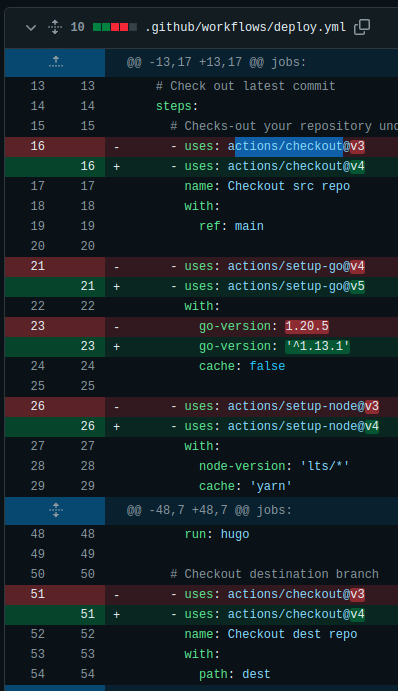
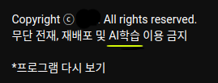

Before starting group study, I decided to update my blog.  

Very small things, but I have some needs about it.  

One is GitHub Actions' dependency update and another is Licences.  

Cause, Blog is deployed via Github Actions, I need to check dependencies in Github Actions' workflow.  

What I use is `actions/checkout`, `actions/setup-go`, and `actions/setup-node`.  

| Name | Prev. Version | Latest Version | Purpose |  
| ---- | ------------- | -------------- | ------- |
| checkout | actions/checkoutv3 | actions/checkoutv4 | Src. and Dest. Branch |
| setup-go | actions/setup-go@v4 | actions/setup-go@v5 | [Hugo](https://gohugo.io/) |
| setup-node | actions/setup-node@v3 | actions/setup-node@v4 | [Vanila Framework](https://vanillaframework.io/) |  

  

- commit [5d4c9b9](https://github.com/kkumtree/blog.minseong.xyz/commit/5d4c9b9a59830a2346199f68c6e91e30e0cca92d)  

Another thing is Licences.  

At the first time, I published my posts under MIT Licences.  

But, I changed it to Creative Commons Licences. [CC BY-NC-ND 4.0](https://creativecommons.org/licenses/by-nc-nd/4.0/).  

There are some reasons.  

1. First, I'm a little nervous of crawling by bot **for feeding** AI(In these days, also called generative AI). It's wondering how effective declared licences could be helpful. But It could be better written in other languages rather than English. I want to communicate with people in my blog's comments. I just do this cause of my curiousity.  

      

2. Second, I was inspired by another blogger a.k.a. [Great-Stone](https://docmoa.github.io/). He also uses `CC BY-NC-ND 4.0`, and it will be rare case based on my experience. ND means No Derivatives.  

So, I also modified footers for mentioning Licences. Cause, I little hate design, I was struggled to layout Creative Commons' Symbol.  

`config.toml` and `themes/v-framework/layouts/partials/footer.html` are edited.

- **In order the time**  
- commit [3cc7166](https://github.com/kkumtree/blog.minseong.xyz/commit/3cc7166d332101867bd98895bf4769728aaca01b)  
- commit [05ceb4d](https://github.com/kkumtree/blog.minseong.xyz/commit/05ceb4d0d228da34be7511e4a17869375fcdc6ce)  
- commit [dd67675](https://github.com/kkumtree/blog.minseong.xyz/commit/dd67675eec7a0b6b6576b7202dd57d05fc2b30c9)  
- commit [fa21460](https://github.com/kkumtree/blog.minseong.xyz/commit/fa21460e6e81c12d17492ac5d8a3ee448d5d7d97)  
- commit [c5ace79](https://github.com/kkumtree/blog.minseong.xyz/commit/c5ace79231a0fd168a482767ee1432b3260f4165)  
- commit [a3fc4f7](https://github.com/kkumtree/blog.minseong.xyz/commit/a3fc4f73d5ec662b4100d0e41505df5aff8b1164)  
- commit [4212d8c](https://github.com/kkumtree/blog.minseong.xyz/commit/4212d8c3ca8976b1598660420d53eecd6d9cc6ba)  

Above all, ND means that Others cannot publish(distribute) `Secondary creation` based on my posts. Sharing the link will be welcomed.  

What I planned for further maintanence is implementation about `KO/EN` toggle with separated posts based on languages tag and broken main layout in mobile.  

That's all. LoL.  
