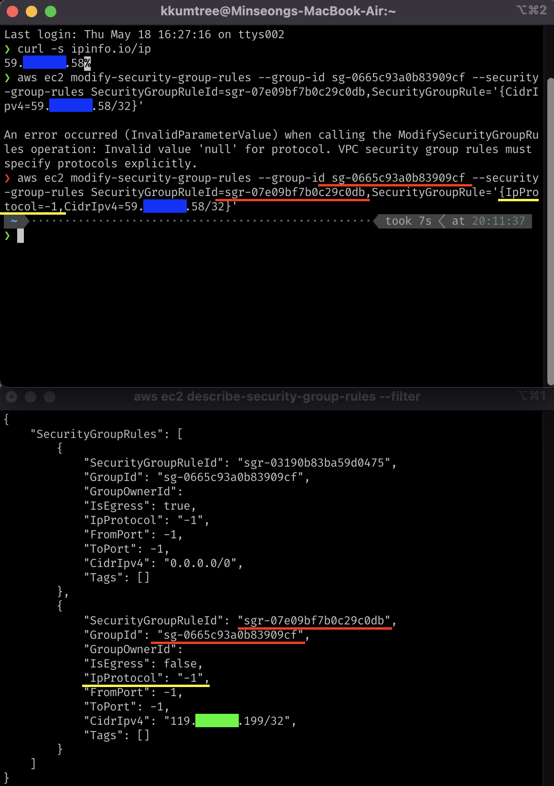

## 0. 요약

- [Docs 1](https://awscli.amazonaws.com/v2/documentation/api/latest/reference/ec2/describe-security-group-rules.html)
- [Docs 2](https://awscli.amazonaws.com/v2/documentation/api/latest/reference/ec2/modify-security-group-rules.html)

```bash
aws ec2 describe-security-groups 
aws ec2 modify-security-group-rules 
```

## 1. 배경


2주 전에 문득 이런 질문을 올렸던 적이 있었다.  
물론 바꾸면 안될 일은 없었는데 이렇게 하는게 맞나 확신이 모자라서 의견을 여쭤봤었고,  
이게 맞다는 확신을 받았다.  

그리고 오늘... 카페를 두 곳이나 들리면서 하느라
약간의 번거로움도 있고 AWS 웹 콘솔에서 하려 했다.

그런데, 유독 SG에서만 페이지 로딩이 timeout 걸려서,  
도저히 수정은 커녕 해당 ID도 파악을 하기 힘든 상황이 되었다.

그럼... 다시 cloudformation stack을 부숴버리고, 재구축하고 그렇게 40여분을 날리면 되는 것일까?
물론 아니다. 놀기에도 쉬기에도 애매한 그런 행동 대신에 만능 툴 aws-cli의 도움을 받도록 하자.

## 2. 방법

접근법은 당연하게도, 먼저 SG ID를 파악하고 해당 Inbound Rule을 수정하면 된다.  
한번도 하지 않았을 뿐.  

### 2-1. SG ID 파악

- 필터를 이용하면 간결하게 파악할 수 있지만, 지금은 파악조차 힘들기 때문에 모든 SG를 조회한다.
- YAML파일로 구축했기 때문에 Name은 알고 있지만,
  그건 웹 콘솔 상에서의 Name이고 필터로는 SG **group-id**를 알아야 한다.
- 아래 명령어를 입력하고 Pod/Node IP할당을 위한 CIDR 규칙이 아닌,  
  특정 IP(보통 /32로 나오기 때문에 grep을 쓰는 것도 좋겠다)를 찾아서 해당 SG GroupId를 찾는다.
  - 하위에 SecurityGroupRuleId가 있는데, Inbound/Outbound룰을 수정하려면 이것도 필요하다.

```bash
aws ec2 describe-security-groups
```

- SG GroupId를 알고 있다면, 다음과 같이 필터를 하면 된다.

```bash
aws ec2 describe-security-groups --filters Name=group-id,Values=sg-${파악한 SG ID}
```

### 2-2. SG Rule 수정

- 아래 예시처럼 수정할 부분의 key-value를 입력하면 된다.
- 유의할 점은, CidrIpv4 수정시에는 IpProtocol도 함께 지정하여야 한다.
  - 예시의 경우는 모든 프로토콜을 허용한다는 의미이니, 상황에 따라 수정하도록 한다.
  - 지정하지 않을 경우, 에러가 발생한다.

```bash
aws ec2 modify-security-group-rules --group-id sg-${파악한 SG ID} --security-group-rules SecurityGroupRuleId=sgr-${바꿀 SG 규칙},SecurityGroupRule='{IpProtocol=-1,CidrIpv4=${바꿀 Host IP}/32}'
```


