[CloudNet@](https://gasidaseo.notion.site/3-8b2603d882734df0b96f8670bb4e15d4)에서의 Terraform 스터디가 끝나고 나서,  
테라폼을 실제 운영 상황에 도입하면서 마주할 수 밖에 없는 드리프트(drift) 상황에 대해  
이해해보는 시간을 가졌습니다.  

```info
참고) TFC에서의 Drift Detection 기능은 현재 TFC Plus 에디션에서 지원됩니다.  
```

## 1. 용어 이해해보기

사실은 작년부터 테라폼을 접하고나서, IaC라는 개념에 꽂히기만 했지  
운영 입장에서 마주했었던 수많은 시행착오들을 흔한 유저에러로만 생각해왔었습니다.  
스터디에 참여하면서 종종 '드리프트'라는 단어를 듣고, 찾아보니  
상당부분이 이에 속하는 상황이라는 것을 알 수 있었습니다.  

### (1) Drift?  

글 작성을 위해 찾아본 기술적 Drift는 본래 주행에 있어서의 그것과  
크게 차이가 없음을 알 수 있었습니다.  

현재까지 이해한 바로는 엔지니어의 계획에 의해 구성된 설계 내에서  
리소스가 생성되고 관리가 되어야 하는데,  
(1) 시간이 흐르거나 (2) 일시적이거나 급한 상황에 따라  
계획된 구성을 벗어나는 현상 그 자체라고 이해해보았습니다.  

### (2) Terraform에서의 Drift

과거에 제가 테라폼을 처음 접하고 적용하는 상황에 비추어보면,  
제가 요청받은 사항(주로, 테스트 개발용 인스턴스, 도메인, AMI 등)을  
tf코드로 구성한 후,  

- 태그를 고치는 작업  
- 테스트서버용 도메인을 수정하는 작업  

위와 같은 자잘한 사항을 처음에 값을 바꾸고난 이후에,  
새로이 요청받은 리소스를 셋업할 때 처음 마주하였습니다.  

좀더 일반적으로 풀어보면, 테라폼으로 환경을 구축한 이후에  

- CSP에서 제공하는 CLI나 웹콘솔 등에서 수동으로 VM 크기 등을 변경하는 상황  
- CloudFormation(AWS), ARM템플릿/Bicep(AWS), Chef, Puppet  
  또는 Ansible 같이 Terraform에 의해 자동화되지 않은 프로세스를 실행하는 상황  

으로 인해서 Terraform의 상태 파일이 감지하지 못하는  
변경 사항이 발생하는 경우라고 하네요.  

  

### (3) Drift 발생 상황이 문제가 되는가?  

보통은 terraform plan이나 apply(plan이 선행됨)를 통하면,  
이러한 변경사항(drift)를 확인할 수 있기 때문에 큰 이슈라고 생각하지 않을 수 있습니다.  

찾아보니, 일부 변경사항은 확인이 안될 수도 있기 때문에  

- 수동으로 해결해야하는 상황이 발생할 수 있습니다.  
- 더 나아가, 테라폼 외부에서 변경된 사항을 되돌리는 과정에서  
  리소스를 쓰지 못할 수도 있고, 배포 실패를 초래할 수 있습니다.  

## 2. Drift에 대한 알림 및 설정 w/Terraform Cloud

그러면 이러한 사항에 대해 알림을 설정하여,  
~~인프라 관리자가 사항을 적시에 알 수 있도록 해보겠습니다.~~  
현재 TFC Free를 써보고 있기에, 모든 테라폼 작업 요청에 대해 알람을 걸어보겠습니다.  

### (1) Terraform Cloud 연결

예전 [포스팅](https://blog.minseong.xyz/post/architecting-aws-with-terraform-module/)에서 다룬 테라폼 코드입니다

- 예제 소스: [Github](https://github.com/kkumtree/demo_terraform_module) (브랜치명: `setting-for-tfc`)

- TFC에서 안내하는 대로 root 모듈 내의 terraform 부분을 수정합니다.  

```HCL
# demo_terraform_module/provider_for_module/main.tf
terraform {

  cloud {
    organization = "kkumtree"

    workspaces {
      name = "t101"
    }
  }

  required_providers {
    aws = {
      source = "hashicorp/aws"
      version = "~> 5.17.0"
    }
    external = {
      source = "hashicorp/external"
      version = "~> 2.3.1"
    }
  }
}
```

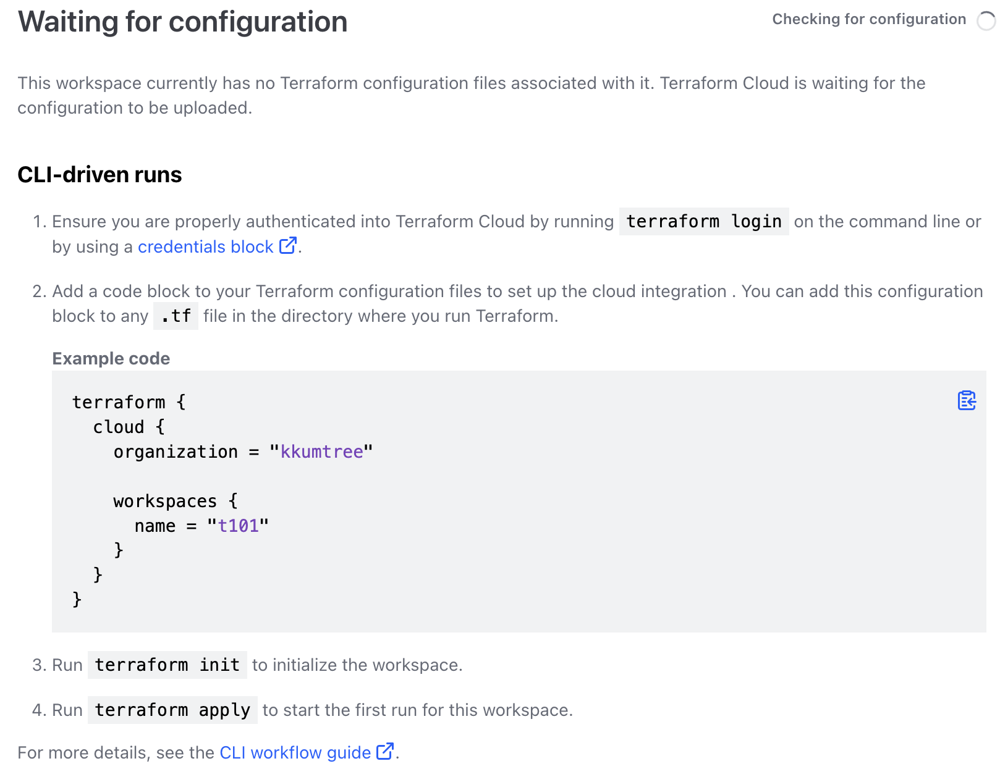  

- 이후에는 TFC에서 쓸 AWS 접속 정보를 셋업합니다. (택일)  

(1) TFC용 IAM User를 생성하여 연결하거나,  
(2) TFC용 OIDC 프로바이더를 생성하여 연결합니다.  

- IdP를 선택하였고, 예제 파일을 구동하기 위해 권한은  
  `AmazonEC2FullAccess`, `iam:PassRole` 을 할당하였습니다.  
  IAM Role을 호출하기에, Role을 설정하지 않으면 에러가 발생합니다.  

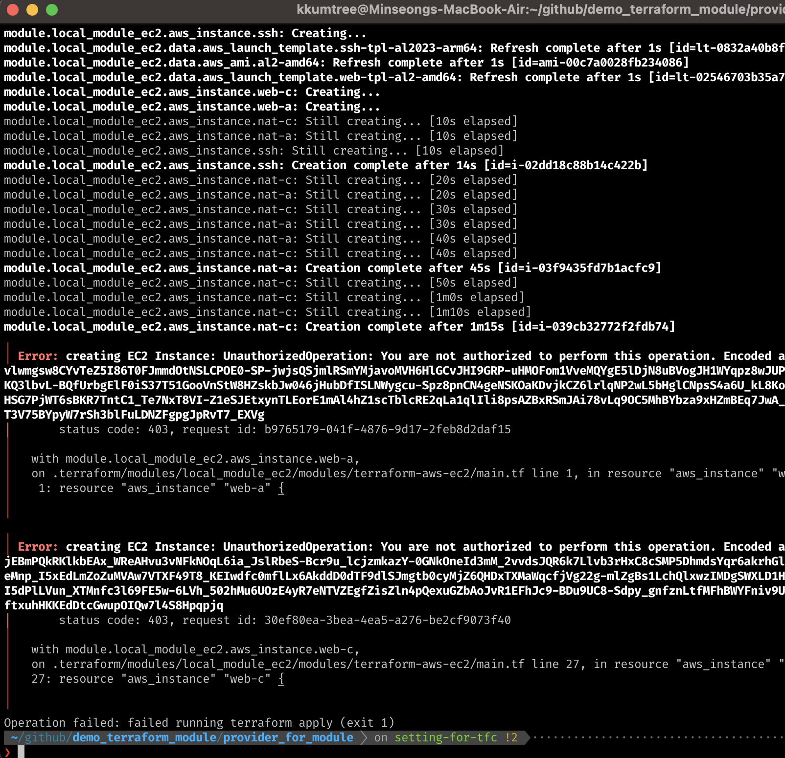  

### (2) Slack 알림 설정

- Slack 알람 설정 인터페이스가 좀 많이 바뀌었는데,  
  큰 틀에서는 달라진게 없어서 웹훅URL을 발급받아 연결할 수 있었습니다.  

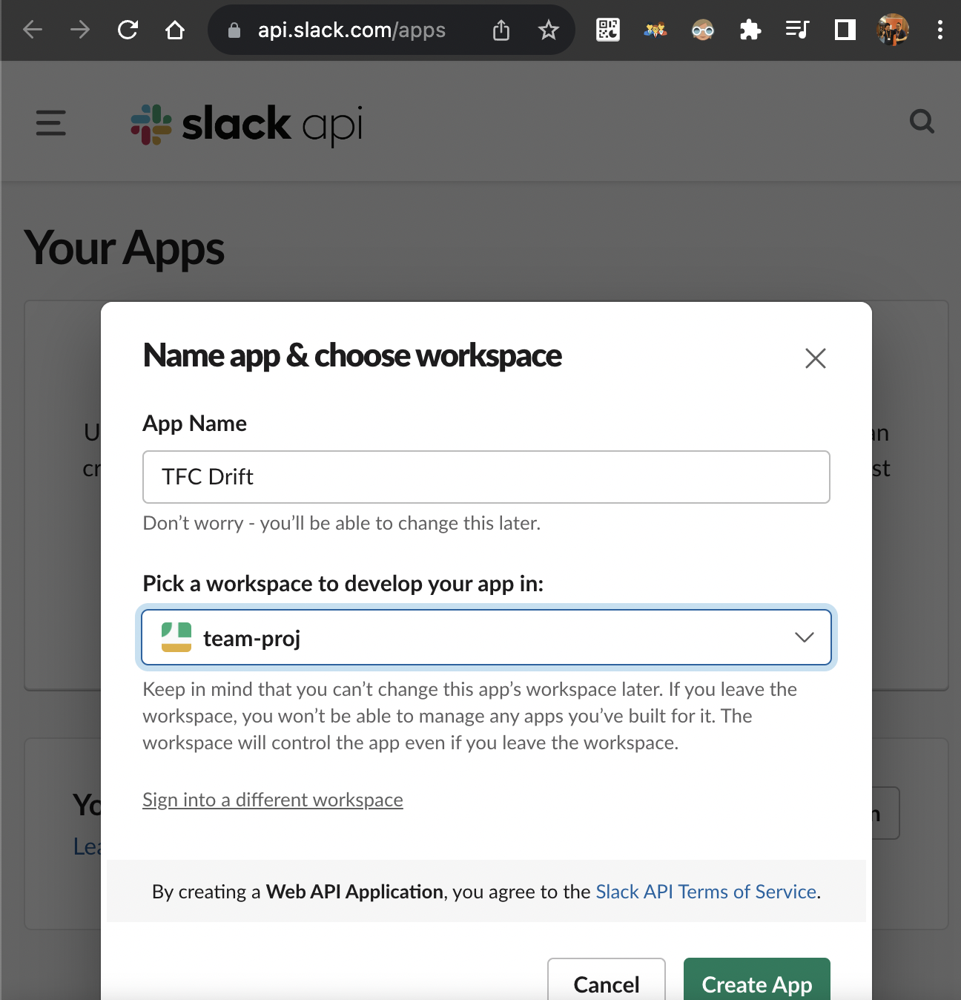  
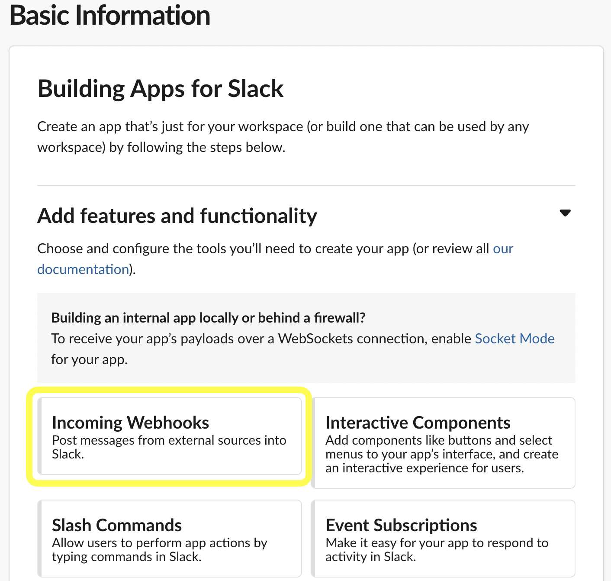  
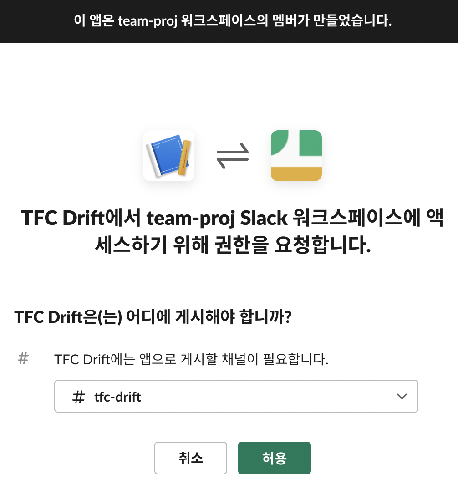  
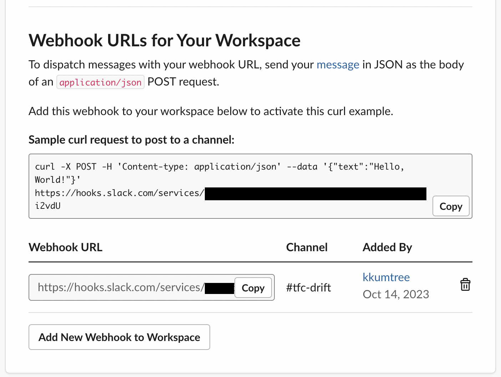  

- TFC에서는 아래와 같이 설정하면 됩니다.  

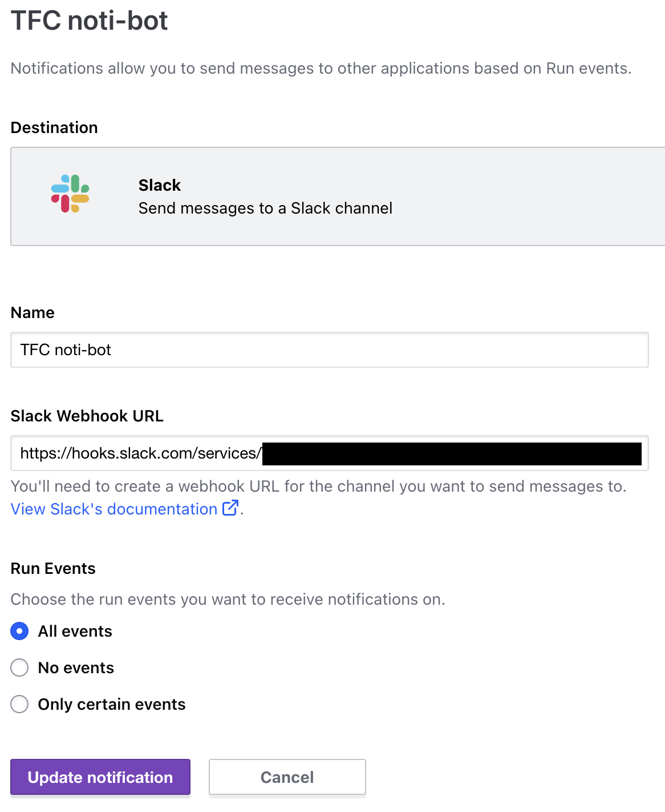

- 예전에 local 백엔드에서 했던대로 하면 될 줄 알았는데,  
  TFC에서는 모듈 경로를 로컬의 상대경로로 지정하면 오류가 발생합니다.  

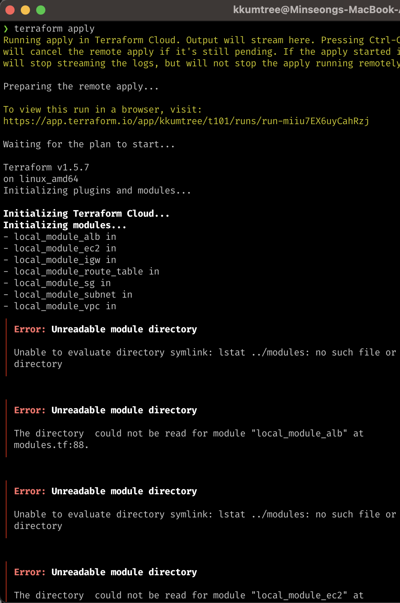

- github에 예제 코드를 공개로 저장했었기에,  
  [예제](https://developer.hashicorp.com/terraform/language/modules/sources#modules-in-package-sub-directories)에 안내된 방식 `git::https://github.com`로 했다가, 에러가 났습니다.  
  차분히, Github를 참조하여 아래와 같이 지정하였습니다.  

  ```bash
  git::git@github.com:kkumtree/demo_terraform_module.git//modules/terraform-aws-ec2?ref=setting-for-tfc
  ```

- //: 테라폼이 해당 부분 이후를 서브 디렉토리로 인식할 수 있게 합니다.  
- ref: 브랜치, 혹은 태그. 본 포스팅에서도 브랜치를 선택하는 용도로 사용하였습니다.  

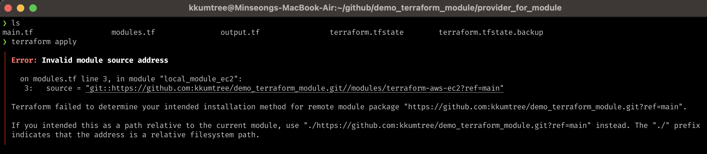

- 제대로 수정한 이후에 module을 git에서 가져오는 것을 볼 수 있습니다.  

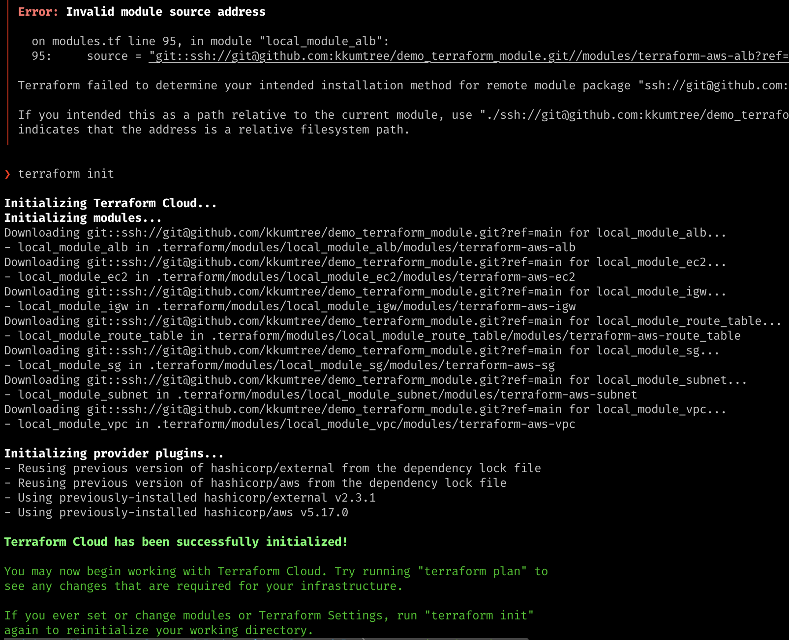

- 테라폼 명령어를 입력할 때마다, 알림을 받아볼 수 있었습니다.  

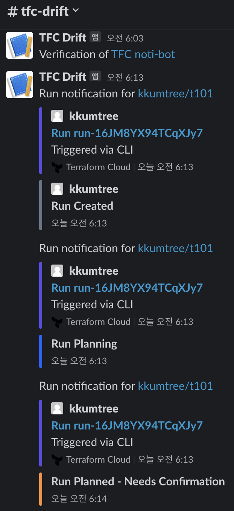

## 3. (번외) drift 알림을 만들어서 써보기

- 다른 서드파티들을 보니 Cron작업으로 drift detection을 하는 것 같아,  
  Bash 스크립팅을 통해 간이로 알림을 보내는 작업을 해보겠습니다.  
- 단, 현재 버전에서는 output파일을 로컬에 내보내려면,  
  TFC의 기본 실행 모드(Default Execution Mode)를  
  `Remote`에서 `Local`로 변경해야 합니다.  

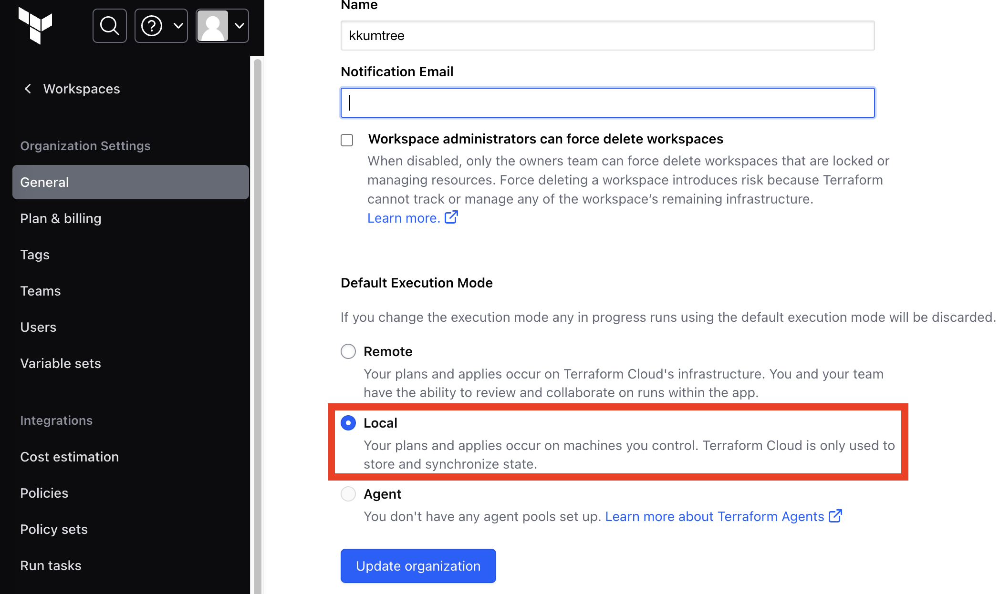

- 고유의 강점인 웹 콘솔에서의 협업-review- 기능을 포기한다고 생각하면 됩니다.  
  대신에, 사용자 지정 모듈을 다시 원래 상대경로로 로드할 수 있었습니다.  
- 실제 운영용으로 한다면, plan 중 Lock이 걸릴 것이므로 유의.  

```bash
#!/bin/bash
terraform plan --detailed-exitcode -out=tf.plan 2> /dev/null || ec=$?
case $ec in
0) echo "No Changes Found": exit 0;;
1) printf '%s/n' "Command exited with non-zero";exit 1;;
2) echo "Changes found";
   MESSAGE=$(terraform show -no-color tf.plan| awk '/#/,EOF { print $0 }');
   curl -X POST -H 'Content-type: application/json' --data "{'text':'$MESSAGE'}" $SLACK_WEBHOOK
esac
```

- 위에 쓰여진 $SLACK_WEBHOOK 은 웹훅 URL 주소를 bash 환경변수로 지정하였습니다.  

- 포스팅을 위해 스크린샷을 저장하려고 하니, 불필요한 변경점이 발생합니다.  

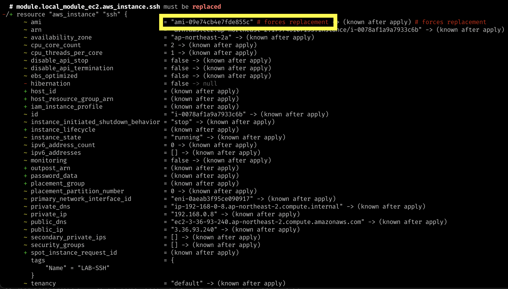

- 그래서, AMI 관련 lifecycle 예외조건을 걸어  
  변경점을 줄인 뒤 해당 쉘을 실행해보겠습니다.  

```HCL
# In EC2 resource block
  lifecycle {
    ignore_changes = [
      tags,
      ami,
    ]
  }
```

- 이제, Bastion 인스턴스(LAB-SSH)에 접속하는데 쓰일 SG의 IP주소만 바꿨을 때,  
이에 대한 드리프트만 발생됨을 볼 수 있습니다.  

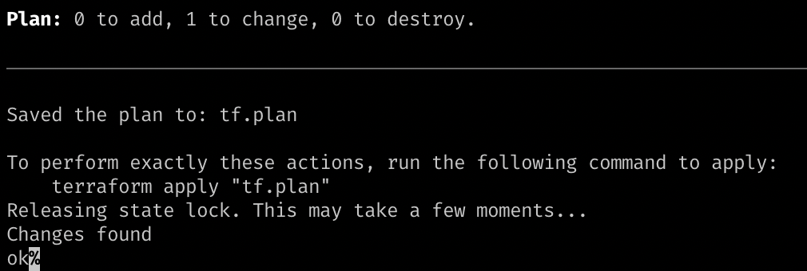

- 예제이기 때문에, 알림에 있어 불필요한 정보까지 나열되었지만  
  변경사항(drift)이 있을 경우에만 알림을 받는다는 목적은 달성하였습니다.  

  
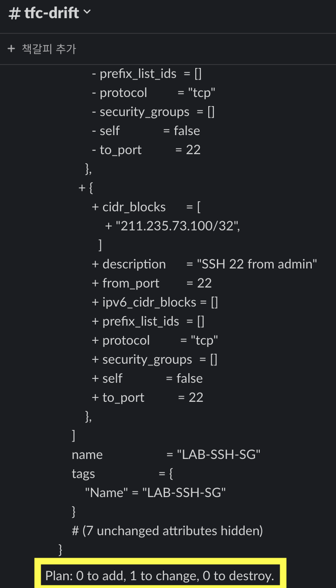  

- `local` 모드로 실행할 경우, state파일이 저장되는 방식도 다소 달라짐을 볼 수 있습니다.  

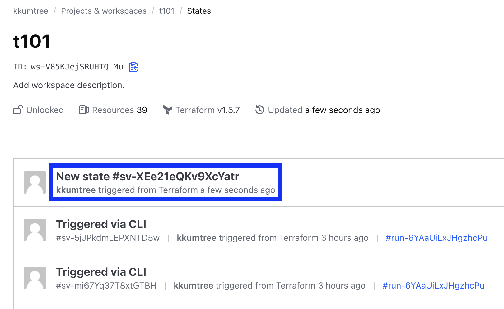  

## 4. 마치며

1. Drift에 대해 이해해보는 시간이 되었습니다.  
2. 원격지(VCS)에서 sub-directory 방식으로 사용자 지정 모듈을 호출하였습니다.  
3. Slack 웹훅을 통하여, TFC로부터의 알림을 수신했습니다.  
4. TFC의 실행모드를 변경하여, 차이를 살펴보았습니다.  
5. lifecycle을 처음 사용해보았고, 이를 통해 불필요한 작업을 줄일 수 있었습니다.  
6. 모니터링 관점에서 TFC Plus를 고려해보는 것도 좋은 방법이 될 수 있을 것 같습니다.  

## 5. References  

- [CloudNet@](https://gasidaseo.notion.site/3-8b2603d882734df0b96f8670bb4e15d4)
- [테라폼으로 시작하는 IaC](https://link.coupang.com/a/8mN0N)
- [Trend Micro/Terraform Tutorial: Drift Detection Strategies](https://www.trendmicro.com/en_us/devops/22/c/terraform-tutorial-drift-detection-strategies.html)
- [GitHub/terraform](https://github.com/hashicorp/terraform/issues/30678)
- [hashicorp/Modules in Package Sub-directories](https://developer.hashicorp.com/terraform/language/modules/sources#modules-in-package-sub-directories)
- [hashicorp/Manage resource drift](https://developer.hashicorp.com/terraform/tutorials/state/resource-drift#resource-drift)  
- [hashicorp/discuss](https://discuss.hashicorp.com/t/saving-a-generated-plan-is-currently-not-supported/2116)
- [hashicorp/resource-lifecycle](https://developer.hashicorp.com/terraform/tutorials/state/resource-lifecycle)
- [hashicorp/The lifecycle Meta-Argument](https://developer.hashicorp.com/terraform/language/meta-arguments/lifecycle)
- [spacelift/Terraform Drift – How to Detect and Manage It](https://spacelift.io/blog/terraform-drift-detection)
- [sendbird/Infrastructure Management using Terraform](https://sendbird.com/ko/blog/infrastructure-management-using-terraform)
- [Medium/Send Terraform Drift Status To Slack Channel](https://medium.com/avmconsulting-blog/send-terraform-drift-status-to-slack-channel-f08eb5a99873)
