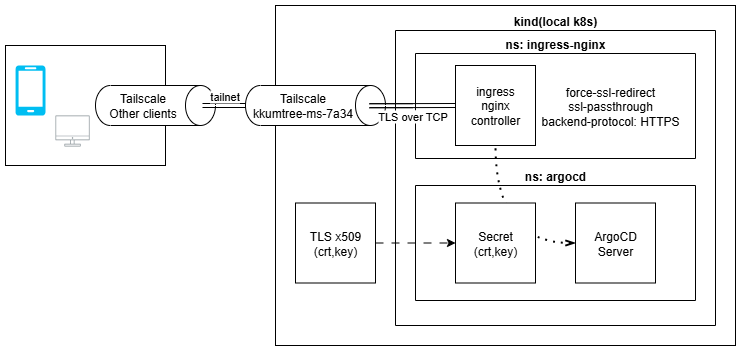
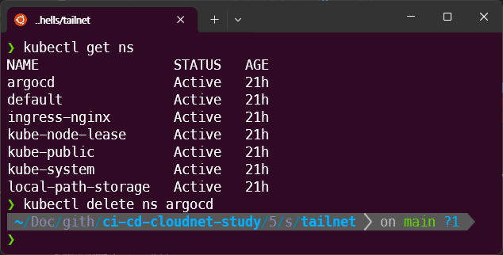
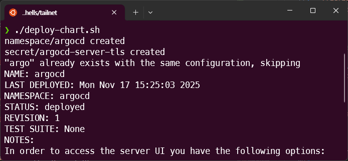
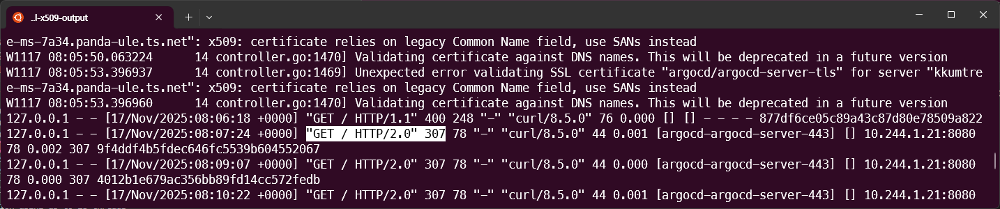
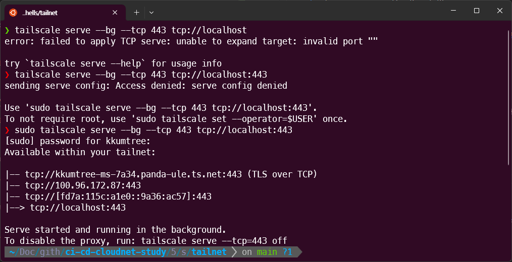
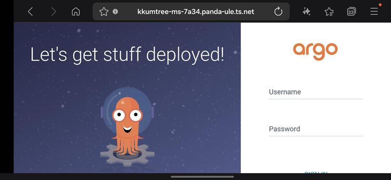

이전 게시물, [ArgoCD with Ingress](../argocd-ingress/)의 도메인 설정을 하다가 문득, Tailscale의 [serve](https://tailscale.com/kb/1312/serve)기능을 활용하여 Tailscale 내부 네트워크(이하, tailnet)에서만 접근 가능한 ArgoCD 서버를 구축하면 되지 않을까? 하여 구성해보았습니다.  

  

> kind를 운용 중인 Host와 접속할 Client들에 Tailscale 설치되어 있어야합니다.  

## 1. Tailscale과 Serve

전통적인 중앙집중식(Hub-Spoke) VPN이 아래와 같다면,  

  

Tailscale의 경우, Mesh 네트워크의 형태를 가지며 Wireguard를 활용합니다.   


| 구분 | 전통적 중앙집중식 VPN | Tailscale (메쉬 VPN) |  
|:---:|:------------------:|:--------------------:|  
| 네트워크 구조 | 중앙 서버를 통한 모든 트래픽 경유​ | P2P 직접 연결, 분산형 메쉬 네트워크​ |  
| 데이터 경로 | 클라이언트 → VPN 서버 → 목적지​	| 클라이언트 → 목적지 (직접 연결)​ |  
| 프로토콜 | OpenVPN(TCP/UDP), IKEv2, L2TP | WireGuard(UDP 기반) |  ​
| 성능 | 중앙 서버 병목 발생, 지연 증가​ | 직접 연결로 지연 최소화, 빠른 속도 |  ​
| 설정 복잡도 | 서버 구축, 포트 포워딩 필요​ | 로그인만으로 즉시 사용 가능​ |  
| NAT 통과 | 수동 포트 포워딩 필요​ | 자동 NAT Traversal 지원 |  ​
| 확장성 | 서버 용량에 따라 제한​ | 각 노드 독립적, 확장 용이 |  ​
| 보안 | 중앙 서버가 모든 트래픽 확인 가능​ | 종단 간 암호화, P2P 전송​ |  

Tailscale의 serve와 같은 경우는, ngrok의 기본 기능과 유사한 funnel과 달리  
tailnet에 속한 기기만 접근이 가능합니다.  

## 2. Tailscale의 상태확인  

kind(Kubernetes)를 구동 중인, 데스크톱에서 상태를 확인합니다.  

```bash
tailscale status
```

7A34로 끝나는 장비에서 kind를 구동 중이며 online/offline 대신 해당 장치에서 확인 중이기에,  
`-`(하이픈)으로 표시됨을 알 수 있습니다.  

  

또한, Tailscale에서 제공하는 DNS도 확인합니다.  

```bash
sudo tailscale dns status
```  


## 3. 인증서 재생성 및 ArgoCD 재배포  

[이전 게시물](../argocd-ingress/)의 `1. TLS 활성화 ArgoCD 배포` 부분부터 해당 부분을 적용해보겠습니다.  

> 해당 구성들은 아래 GitHub에 탑재되어 있습니다.  
> <https://github.com/kkumtree/ci-cd-cloudnet-study> 의 `5w/shells/tailnet` 폴더  

### (1) 인증서 생성  

`create-local-crt.sh`에서 확인된 도메인으로 수정 후 실행하여,  
로컬의 `openssl-x509-output`폴더에 인증서를 생성해두었습니다.  
(keyout 및 out은 각 파일의 구분 용이를 위한 것이며, subj의 CN이 중요합니다.)

전체 DNS는 `<Tailscale에서 식별된 Hostname>.<DNS주소>`

```bash
# create-local-crt.sh
openssl req -x509 -nodes -days 365 -newkey rsa:2048 \
  -keyout openssl-x509-output/kkumtree-ms-7a34.panda-ule.ts.net.key \
  -out openssl-x509-output/kkumtree-ms-7a34.panda-ule.ts.net.crt \
  -subj "/CN=kkumtree-ms-7a34.panda-ule.ts.net/O=kkumtree"
```  


### (2) ArgoCD 재배포  

기존에 ArgoCD가 배포되어있기에 네임스페이스 째로 삭제를 먼저 진행했습니다.  

```bash
kubectl delete ns argocd
```  

  

`deploy-chart.sh` 파일에서 해당되는 도메인과 생성된 키로 값을 변경한 뒤, 배포하였습니다. 

```bash
#!/bin/bash
kubectl create ns argocd

# confirm cert and key is available in the path
kubectl -n argocd create secret tls argocd-server-tls \
  --cert=openssl-x509-output/kkumtree-ms-7a34.panda-ule.ts.net.crt \
  --key=openssl-x509-output/kkumtree-ms-7a34.panda-ule.ts.net.key

# https://github.com/argoproj/argo-helm/blob/main/charts/argo-cd/values.yaml

cat <<EOF > argocd-values-tailnet.yaml
global:
  domain: kkumtree-ms-7a34.panda-ule.ts.net

# # TLS certificate configuration via cert-manager
# # cert-manager가 있을 때, 활용.
# certificate:
#   enabled: true

server:
  ingress:
    enabled: true
    ingressClassName: nginx
    annotations:
      nginx.ingress.kubernetes.io/force-ssl-redirect: "true"
      nginx.ingress.kubernetes.io/ssl-passthrough: "true"
      nginx.ingress.kubernetes.io/backend-protocol: "HTTPS"
    tls: true
EOF

# https://github.com/argoproj/argo-helm/tree/main/charts/argo-cd#installing-the-chart
helm repo add argo https://argoproj.github.io/argo-helm
# https://github.com/argoproj/argo-helm/releases
helm install argocd argo/argo-cd --version 9.0.5 -f argocd-values-tailnet.yaml --namespace argocd
```



다만, 차트 배포 시 ArgoCD 서버는 자체 TLS인증서를 쓰기로 설정되었기 때문에 
위의 코드처럼, Tailscale을 위한 추가 어노테이션 설정이 필요합니다.

```bash
server:
  ingress:
    annotations:
      nginx.ingress.kubernetes.io/backend-protocol: "HTTPS"
```

그렇지 않으면 ingress 로그를 까봤을 때, 307 redirect 에러가 납니다. 



## 4. Tailscale serve 실행  

```bash
sudo tailscale serve --bg --tcp 443 tcp://localhost:443  
sudo tailscale serve status  
```



## 5. 접속 확인

이제 해당 네트워크에서 제대로 접속되는 것을 알 수 있습니다.  


동일 Tailnet에 속한 휴대전화로 해당 도메인에 접근가능한 것을 확인할 수 있습니다. 



(Mac/Linux)
Tailscale에 대한 DNS파일(`/etc/resolv.conf`)이 깨졌을 경우에는 재기동을 합니다. 

```bash
sudo tailscale down
sudo tailscale up
```

## Reference  

- [tailscale serve command](https://tailscale.com/kb/1242/tailscale-serve)  
- [Ingress Configuration - ArgoCD](https://argo-cd.readthedocs.io/en/stable/operator-manual/ingress/#option-2-ssl-termination-at-ingress-controller) / kubernetes/ingress-nginx  