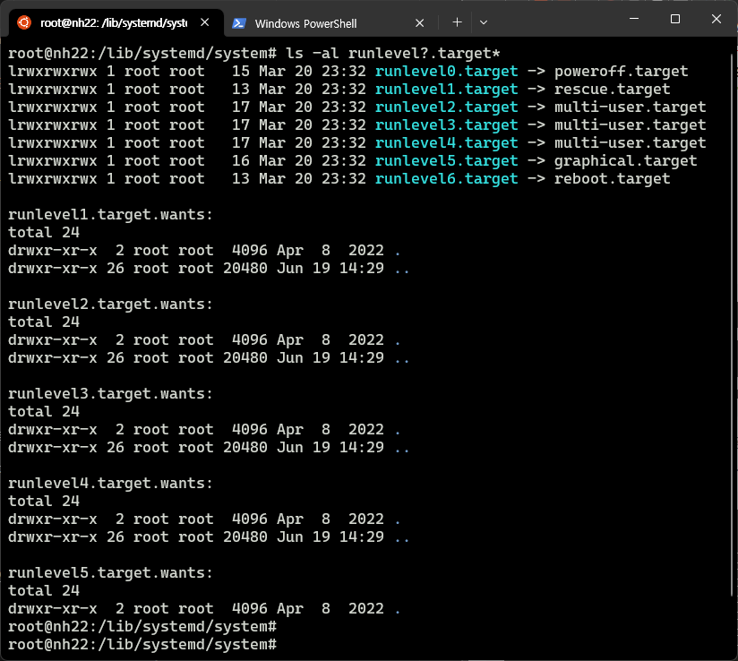

CPU를 1600X에서 5700X로 업그레이드를 진행하기에 앞서,  
RunLevel(런레벨/부트레벨)에 대해 한번 메모하고자 함.  

## Runlevel

- 7가지 레벨이 존재
  - man runlevel 참고
- Level 5을 제외하고는, cli 환경에서만 구동

- Linux Standard Base 기준  
  - `ls -l /lib/systemd/system/runlevel?.target` 명령어로 확인 가능

| RunLevel | EN | 설명 | 비고 |
|:--------:|:--:|:----:|:----:|
| 0 | Power Off | 시스템 종료(중단/Halt) | |
| 1 | Rescue | 시스템 복구 | 단일 사용자 모드 |
| 2 | Multi-User | 다중 사용자(텍스트 모드, 네트워크 서비스 X) | 사용 X (사용자 정의 가능) |
| 3 | Multi-User | 다중 사용자(텍스트 모드) | |
| 4 | Multi-User | 상동 | 사용 X (사용자 정의 가능) |
| 5 | Graphical | 다중 사용자 모드 (그래픽 모드) | X-window 기반 |
| 6 | Reboot | 시스템 리부팅 | |

## 운영체제(Ubuntu 22.04 기준)내 확인

- su 모드에서. target을 기반으로 링킹되어 있음을 확인
- `ls -al /lib/systemd/system/runlevel?.target`: default
- `ls -al /etc/systemd/system | grep runlevel?.target.wants`: 사용자 정의용 폴더

```bash
sudo su
ls -l /lib/systemd/system/runlevel?.target*
```



- 타겟 변경의 경우, 아래 lesstif를 참조

## Reference

- [Runlevel LSB - Wikipedia](https://en.wikipedia.org/wiki/Runlevel#Linux_Standard_Base_specification)
- [dongle94](https://dongle94.github.io/ubuntu/ubuntu-runlevel/)
- [lesstif](https://www.lesstif.com/system-admin/linux-systemd-systemctl-run-level-target-98926803.html)
