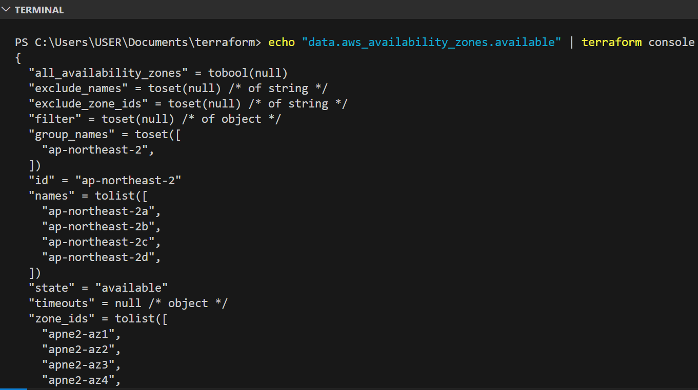
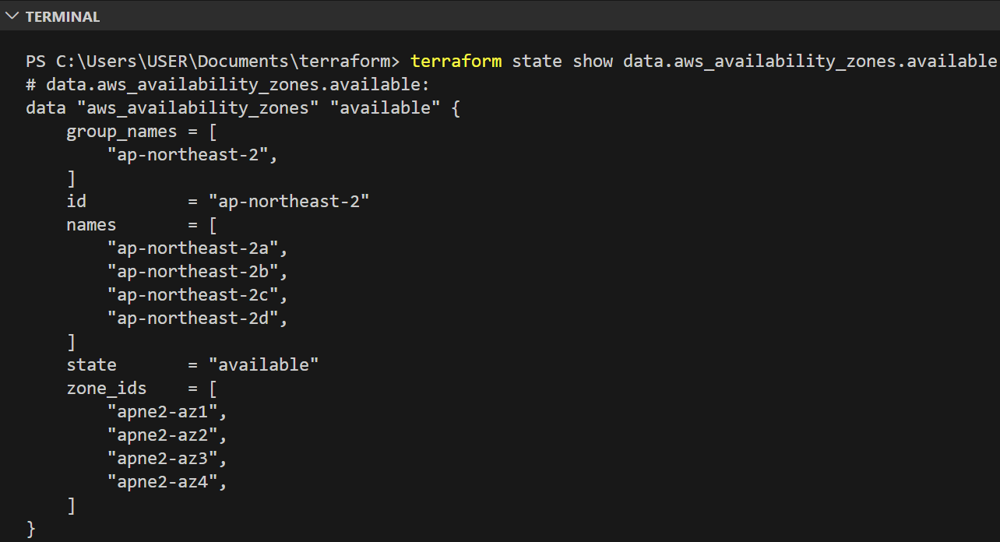
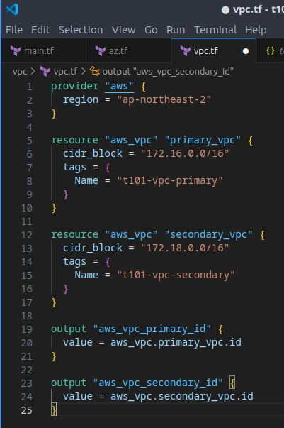
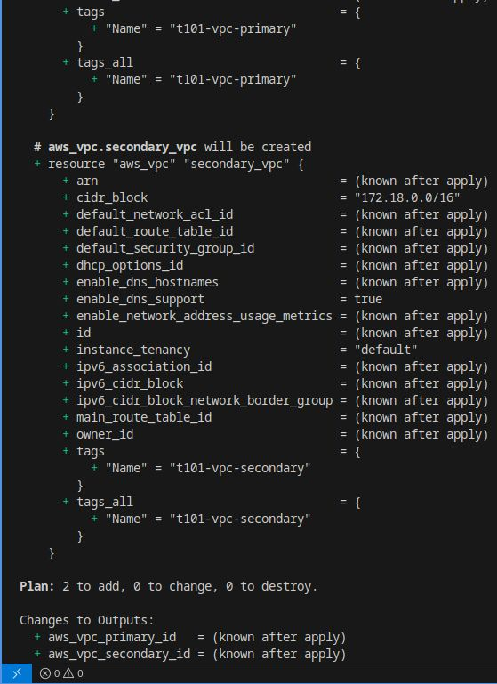
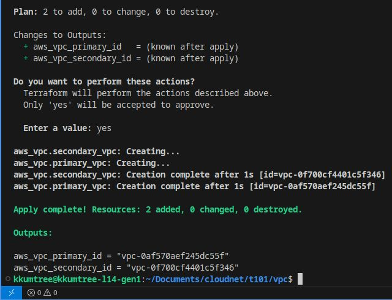
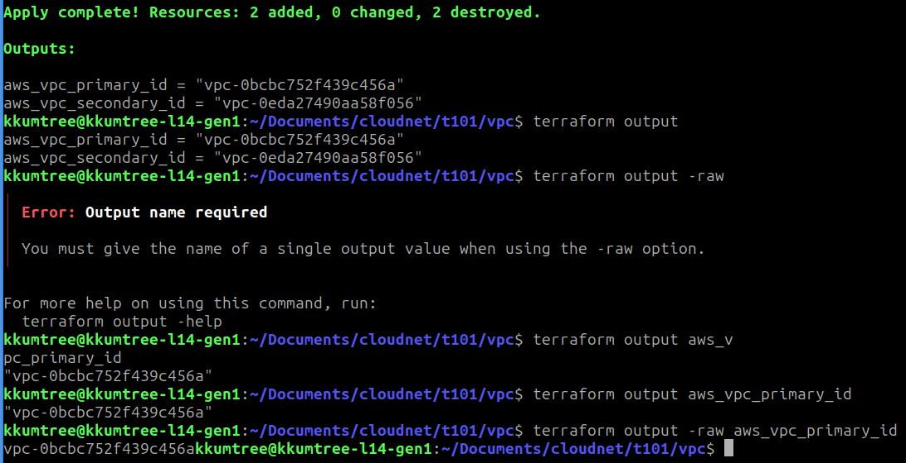
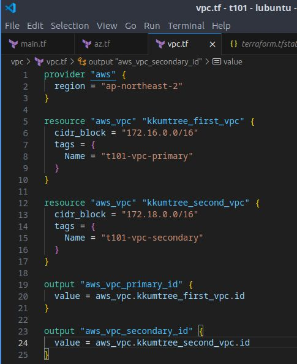
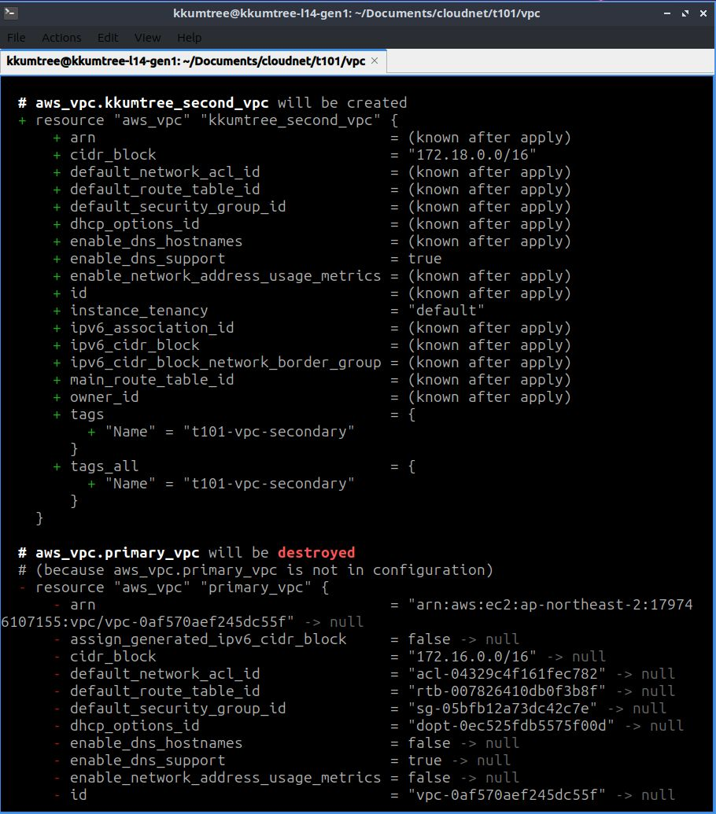
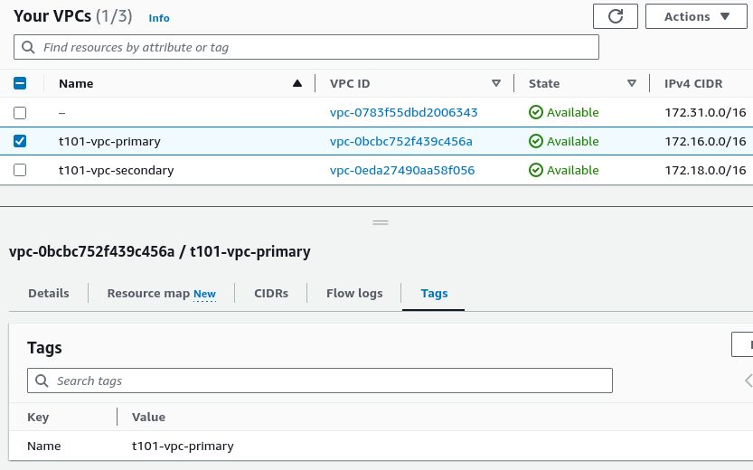

이번에는 [CloudNet@](https://gasidaseo.notion.site/CloudNet-Blog-c9dfa44a27ff431dafdd2edacc8a1863)를 통해 학습한 내용을 기반으로,  

- AZ를 대상으로 한 data 조회  
- AWS VPC 생성 예제로 살펴보는 output
- resource 이름 변경  

순으로 알아보도록 하겠습니다.  

교재로 사용한 [[테라폼으로 시작하는 IaC](https://link.coupang.com/a/8mN0N)] 도 참고하였습니다.

## 기본 설정

- aws-cli에 리전을 `ap-northeast-2`을 설정하였습니다.

```bash
$ aws configure list

      Name                    Value             Type    Location
      ----                    -----             ----    --------
   profile                <not set>             None    None
access_key     ****************2U5J shared-credentials-file    
secret_key     ****************Z0co shared-credentials-file    
    region           ap-northeast-2      config-file    ~/.aws/config
```

## 1. data 조회

data는 사용자가 정의하는 resource 및 리소스에 대한 스펙과 반대로,  
provider(이번 포스트에서는 aws)에서 제공하는 리소스를 조회하는 기능입니다.  

### (1) data 조회를 위한 tf 파일 작성

이번에는 작업 대상 폴더 내의 루트 경로에 az.tf 파일만 작성을 합니다.

```HCL
# az.tf

data "aws_availability_zones" "available" {
    state = "available"
}
```


- 해당 파일은 AWS(프로바이더)가 제공하는 AZ 중에서,  
  사용가능한 AZ들을 조회하여 available이라는 데이터로 가져옵니다.

- 작성 후에 아래와 같이 명령어를 적습니다.  
  (다른 파일도 있는 경우에는 `--auto-approve` 옵션을 빼고 실행하여 확인하기 바랍니다)

```bash
terraform init -upgrade && terraform apply -auto-approve
```

- `-upgrade` 옵션은  
  (1) 기존 테라폼 lock파일을 무시하고, 사용 중인 플러그인을 업데이트 하는 역할을 합니다.
  (2) 이 경우에는 az.tf 파일 하나만 있기에, AWS(프로바이더)에서 제공하는 정보들을 lock파일에 재작성한다고 이해하면 될 것 같습니다.
  (3) 자세한 사항은 [Terraform CLI](https://developer.hashicorp.com/terraform/cli/commands/init#child-module-installation)에서 확인할 수 있습니다.  

### (2) tfstate 확인

- tfstate 파일에서 가용할 수 있는 AZ 목록을 확인할 수 있습니다.  

```terraform
  "resources": [
    {
      "mode": "data",
      "type": "aws_availability_zones",
      "name": "available",
      "provider": "provider[\"registry.terraform.io/hashicorp/aws\"]",
      "instances": [
        {
          "schema_version": 0,
          "attributes": {
            "all_availability_zones": null,
            "exclude_names": null,
            "exclude_zone_ids": null,
            "filter": null,
            "group_names": [
              "ap-northeast-2"
            ],
            "id": "ap-northeast-2",
            "names": [
              "ap-northeast-2a",
              "ap-northeast-2b",
              "ap-northeast-2c",
              "ap-northeast-2d"
            ],
            "state": "available",
            "timeouts": null,
            "zone_ids": [
              "apne2-az1",
              "apne2-az2",
              "apne2-az3",
              "apne2-az4"
            ]
          },
          "sensitive_attributes": []
        }
      ]
    }
  ],
```


- 파일을 직접 확인하지 않아도, terraform 명령어를 통해서도 조회가 가능합니다.
  - `terraform console`
  - `terraform state show`

(1) terraform console

- 파이프로 리소스를 전달하여, 조회합니다.

```bash
echo 'data.aws_availability_zones.available.names' | terraform console
```



(2) terraform state show

- `terraform state`: state 관리를 위한 서브 커맨드를 제공.  
  - list / mv / pull / push / replace-provider / rm / show
- subcommand `show`: 지정한 리소스의 state를 조회.

```bash
terraform state show data.aws_availability_zones.available
```



## 2. output 알아보기

- [지난번](https://blog.minseong.xyz/post/terraform-hello-world-tfenv/)의 예제에서는 생성된 인스턴스를 확인하기 위해,  
  별도로 aws-cli를 구동하여 IP를 획득하였습니다.  
- 번거로울 뿐만 아니라, 생성되는 정보를 파악하기 힘들기 때문에 그 다음 액션을 취하기 대단히 어렵습니다.  
  이번에는 output을 활용하여, 생성된 VPC ID를 얻어보도록 하겠습니다.  

### (1) VPC 리소스 생성 파일 작성

- 루트 폴더에 `vpc`라는 폴더를 생성하고, 아래와 같은 `vpc.tf`파일을 생성합니다.  

```bash
mkdir vpc && cd vpc
```

```HCL
# vpc.tf

provider "aws" {
  region = "ap-northeast-2"
}
  
resource "aws_vpc" "primary_vpc" {
  cidr_block = "172.16.0.0/16"
  tags = {
    Name = "t101-vpc-primary"
  }
}

resource "aws_vpc" "secondary_vpc" {
  cidr_block = "172.18.0.0/16"
  tags = {
    Name = "t101-vpc-secondary"
  }
}

output "aws_vpc_primary_id" {
  value = aws_vpc.primary_vpc.id
}

output "aws_vpc_secondary_id" {
  value = aws_vpc.secondary_vpc.id
}
```

- output에 표시할 값으로 각 VPC 리소스의 ID를 가져오도록 하였습니다.
- 참고) 작성시점 기준, `172.17.0.0/16` CIDR은 AWS의 일부 서비스(AWS Cloud9/Amazon SageMaker)에서 사용하므로 피하도록 합니다. (링크: [AWS VPC Docs](https://docs.aws.amazon.com/ko_kr/vpc/latest/userguide/vpc-cidr-blocks.html))



- 같은 backend를 바라보고 있지 않으므로, `terraform init`을 하고,  
  `terraform plan` 으로 확인해보고, `terraform apply`를 해봅니다.

- `plan`: 실제 적용을 하지 않기에, `output`란에는 `(known after apply)`로 표기됨을 확인



- `apply`: (`yes`를 선택하여 적용 후) `output`란에 각 VPC의 ID가 표기됨을 알 수 있습니다.



### (2) output 값 조회

- 이렇게까지 output에 대해 알아볼 수 있는 기회가 없었었기에,  
  output은 단순히 `apply` 단계에서만 확인할 수 있는 출력값으로만 여겼었습니다.  
- 하지만, 이번 시간에는 이렇게 출력되도록 설정한 `output`값을 재조회 해보도록 하겠습니다.

```bash
# 전체 output 조회
terraform output

# 특정 output 값 조회 (e.g. aws_vpc_primary_id)
terraform output aws_vpc_primary_id

# '개행없이' 특정 output 값 조회
terraform output -raw aws_vpc_primary_id
```

- 개행없이 출력하는 옵션은 여러모로 유용해보입니다.



## 3. resource 이름 변경

- 앞에서 두 VPC 리소스를 tf파일 내부에서  
  `primary_vpc`와 `secondary_vpc`란 이름으로 지정하였습니다.  
- 현재, 각 VPC ID는 아래와 같이 확인됩니다.  
  - t101-vpc-primary: vpc-0af570aef245dc55f  
  - t101-vpc-secondary: vpc-0f700cf4401c5f346  


- 이번에는 이 이름을 수정해보고, 적용해보면서 terraform에서 이를 어떻게 처리하는 지 알아봅시다.

```HCL
provider "aws" {
  region = "ap-northeast-2"
}
  
resource "aws_vpc" "kkumtree_first_vpc" {   // UPDATE HERE
  cidr_block = "172.16.0.0/16"
  tags = {
    Name = "t101-vpc-primary"
  }
}

resource "aws_vpc" "kkumtree_second_vpc" {  // UPDATE HERE
  cidr_block = "172.18.0.0/16"
  tags = {
    Name = "t101-vpc-secondary"
  }
}

output "aws_vpc_primary_id" {
  value = aws_vpc.kkumtree_first_vpc.id     // UPDATE HERE
}

output "aws_vpc_secondary_id" {
  value = aws_vpc.kkumtree_second_vpc.id    // UPDATE HERE
}
```



- 당연하게도 `terraform apply`로 변경사항을 적용합니다.  



- 혹시, 이때 뭔가 위화감이 들지 않나요?  
  - cidr_block 값을 바꾸지 않았고,  
  - 기존에 생성된 VPC에 대해 terraform 상에서 관리하는 리소스명만 바뀌었는데
  - `destroyed`가 뜹니다!  

- 이유는 terraform의 immutable 원칙(Tao/도?)때문입니다.  
- 기존의 인프라를 수정하거나 업데이트하는 것이 아닌,  
  변경된 정보로 새로운 인프라를 생성하여 교체합니다.  
- F1 피트 스톱에서 바퀴를 갈아끼는 것을 연상하면 이해가 쉬울 수도 있을 것 같습니다.  
  (참고로, VPC 블록도 한 번 정하면, 대역을 변경할 수 없습니다)
- 아래와 같이, VPC ID가 변경(교체)되었음을 확인할 수 있습니다.



## 마무리 및 느낀점

- 이번에는 아래의 사항을 중점으로 알아보았습니다.  
  - output의 필요성과 활용
  - terraform의 immutable 속성
- 덤으로, `172.17.0.0/16` CIDR은 사실상 AWS에서 예약한 VPC CIDR 블록임을 알 수 있었습니다.  

## Reference

- [CloudNet@](https://gasidaseo.notion.site/CloudNet-Blog-c9dfa44a27ff431dafdd2edacc8a1863)
- [테라폼으로 시작하는 IaC](https://link.coupang.com/a/8mN0N)
- [Terraform CLI](https://developer.hashicorp.com/terraform/cli/commands/init#child-module-installation)
- [AWS VPC Docs](https://docs.aws.amazon.com/ko_kr/vpc/latest/userguide/vpc-cidr-blocks.html)  
