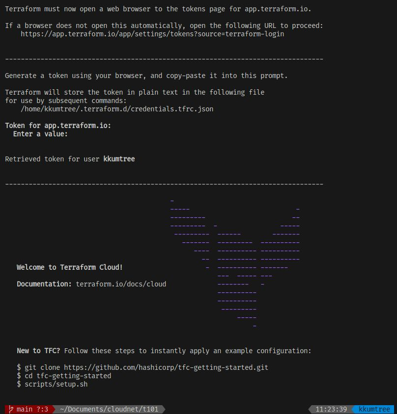
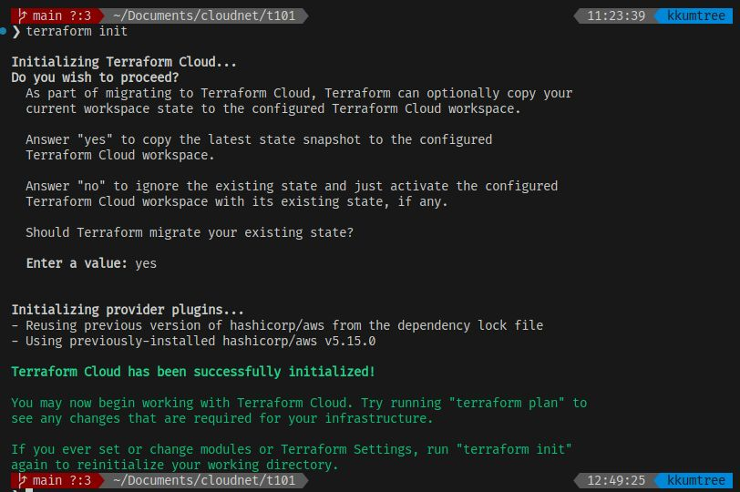
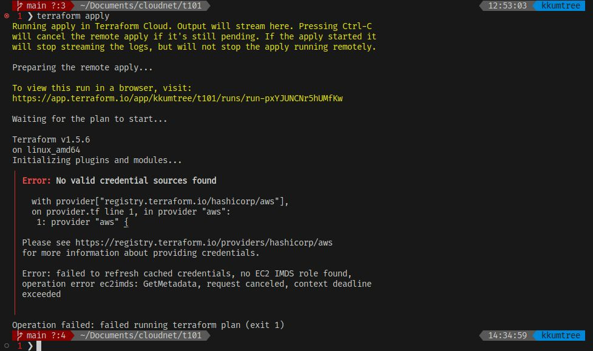
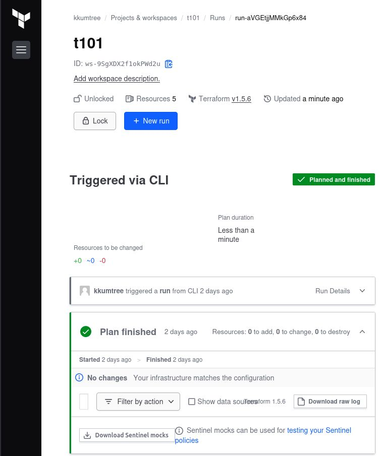
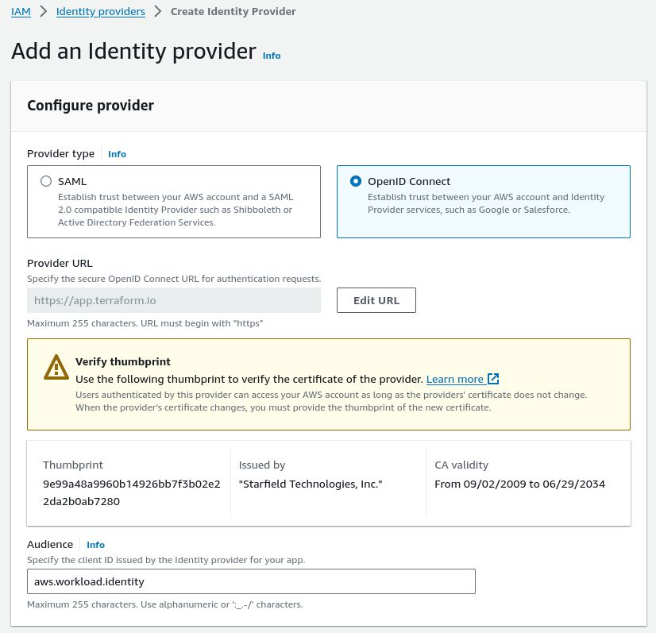
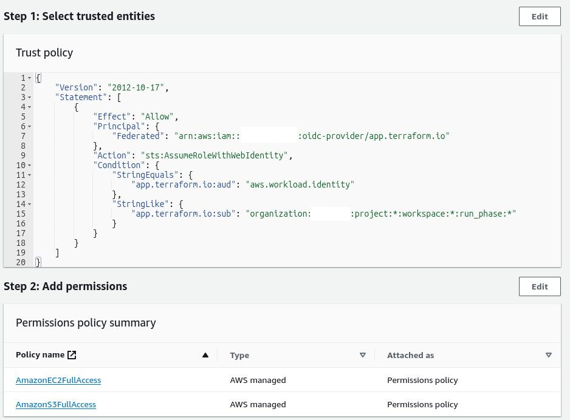
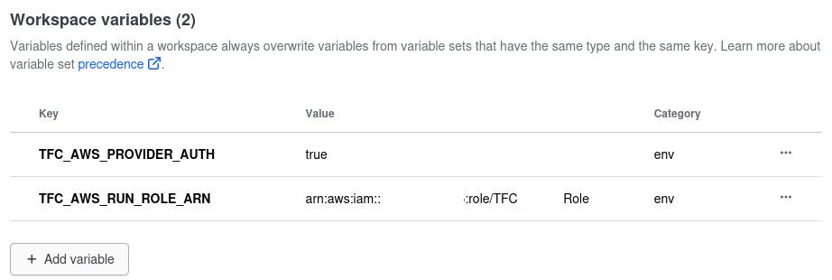
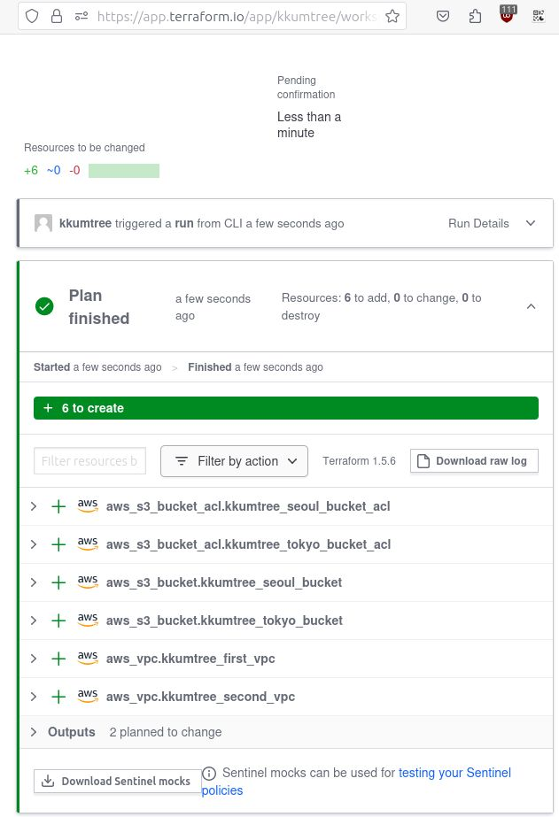
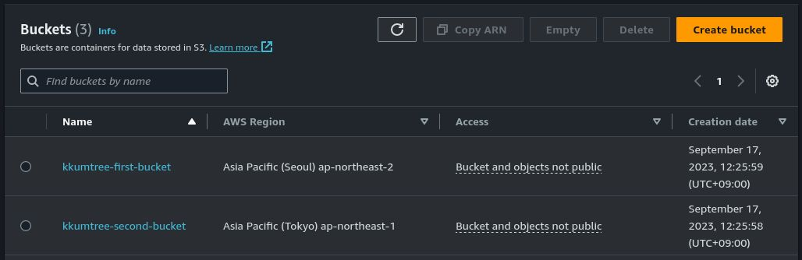
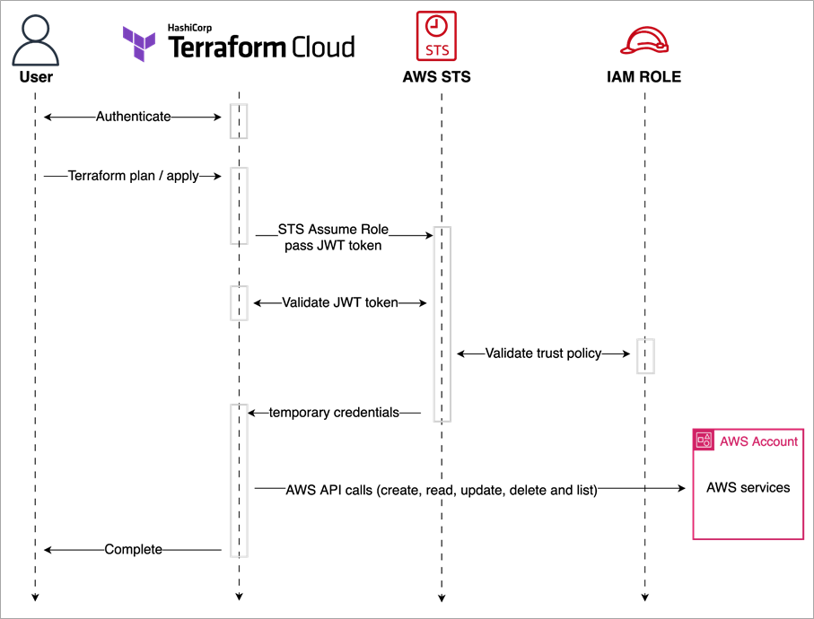

이번에는 Terraform Cloud가 얼마나 좋은지 더 알아보기 위해,  
스터디에서 지속적으로 장점이 강조되어 왔던 Terraform Cloud에  
IAM STS를 이용한 권한 부여 도전 및 적용 성공에 대해 써보려고 합니다.  

Terraform의 상태 저장을 위해 보통 AWS S3를 사용하는데,  
알다시피 S3 기록은 무료지만, 불러오는 것은 유료입니다.  
~~(전기는 국산이지만, 원료는 수입입니다)~~

그래서 스터디용으로는 Terraform을 불러올 때마다,  
상태 값을 S3말고, 로컬에 저장했었는데요.  
밖에서는 노트북, 집에서는 데스크탑으로 하려니  
이걸 GitHub의 Private Repo에 저장할까? 하다가  
Terraform Cloud를 써보기로 했습니다. (고통의 시작)  

## 1. Terraform Cloud 계정 생성 및 사용

- [Terraform Cloud](https://app.terraform.io/)에 접속하여 계정을 생성합니다.  
  - 저와 같은 경우에는 GitHub 계정을 연동하여 생성하였습니다.  
- 연동을 위해서, tf파일에 아래 블록을 추가합니다.
  - 친절하게도 Terraform Cloud에서 튜토리얼을 제공하고 있습니다.  

```HCL
terraform {
  cloud {
    organization = "kkumtree"

    workspaces {
      name = "t101"
    }
  }
  required_providers {
    aws = {
      source  = "hashicorp/aws"
      version = "~> 5.0"
    }
  }
}
```

- Organization: Terraform Cloud에서 생성한 Organization 이름을 입력합니다.  
- Workspaces: Terraform 작업 단위의 이름을 지정합니다.  

한 번 login 해보겠습니다.  
[ `terraform login` ]을 입력해주세요.  

- Token을 요구하는데요,  
  Terraform Cloud 웹 콘솔이 열리면서 토큰 발급 절차를 밟습니다.  
  열리지 않는 경우, 안내에 따라 token 세팅 페이지로 이동하여 발급해주세요.  
- 토큰은 **당연하게도** 다시는 조회할 수 없으니, 따로 보관해두세요.  
  이 토큰을 다시 터미널에 입력하면, Terraform Cloud에 접속됩니다.  



- 다시, init을 해보겠습니다. 잘 되었네요.  



- 그럼... apply를 해보겠습니다. 에러가 났네요.  
  - 분명, 로컬에 AWS Credential이 잘 세팅되어 있었는데요.  



## 2. IAM Credential 생성 및 저장

- 한참을 헤메었는데... 단순하게도, Terraform Cloud의  
  **workspace**에 AWS Credential을 저장해야 했습니다.
- 로컬에 AWS Credential을 조회하여(...) 이 값을  
  Terraform Cloud에 저장하면 됩니다. 참 쉽죠?
- 다만, Variable 유형을 고를 때, Terraform variable이 아닌  
  **Environment variable**을 선택해야 합니다.  
- STS도 저장할 수 있는 것으로 알고 있었는데,  
  이렇게는 STS를 써본 적이 없어서, 아래 두 값만 넣어보았습니다.  
  - AWS_ACCESS_KEY_ID
  - AWS_SECRET_ACCESS_KEY: 반드시 Sensitive 설정!
- 캡처는 못했지만, AWS를 많이 써보셨으면 저보다 잘 아실 것 같아서  
  AZ를 data로 단순히 받아오는 작업을 걸었을 때, 잘 동작했습니다.



## 3. AWS Credential을 쓰고 싶지 않은데...?

문득, 위와 같은 생각이 들었습니다.  

- Terraform Cloud 자체에서도 Token을 발급받아서 쓰는데,  
  Terraform Cloud 전용 IAM User를 만들어서  
  **비밀키를 하드코딩**해서 써야..하나?
- Quick Start 가이드에서 STS를 쓰던데, 나는 왜 못쓰나...?

그래서, 한 번 찾아보았습니다. 찾아보았더니 아래 두 게시물을 참조하였는데요.  
처음 게시물은 AssumeRole 생성 단계에서 막혀서, 두 번째 게시물을 토대로 진행하였습니다.  

- [SaturnCloud/Terraform Cloud/Enterprise: A Comprehensive Guide to Using AWS Assume Roles](https://saturncloud.io/blog/terraform-cloudenterprise-a-comprehensive-guide-to-using-aws-assume-roles/)
- [AWS/Simplify and Secure Terraform Workflows on AWS with Dynamic Provider Credentials](https://aws.amazon.com/ko/blogs/apn/simplify-and-secure-terraform-workflows-on-aws-with-dynamic-provider-credentials/)

### 3.1 IAM OIDC IdP(identity Provider) 생성

- 먼저, AWS IAM에서 IAM OIDC Provider를 생성합니다.  
  - Provider type: OpenID Connect  
  - Provider URL: https://app.terraform.io
  - Audience: aws.worklaod.identity
- 중간에 생성되는 Thumbprint는 IAM 콘솔에서 다시 조회 가능하니, 괜찮습니다.



### 3.2 신뢰 개체(Trusted entities) 생성

- IdP를 통해, Terraform Cloud과 AWS IAM간의 신뢰 관계를  
  구축하는 것이기 때문에 신뢰 개체를 생성해야 합니다.
- 게시물을 토대로 기재하되, 두 값은 직접 입력해야 합니다.
  - <AWS계정ID>: AWS 계정 ID로 변경
  - <TFC조직명>: Terraform Cloud 생성한 계정에서 만든 조직으로 변경  

```json
{
	"Version": "2012-10-17",
	"Statement": [
		{
			"Effect": "Allow",
			"Principal": {
				"Federated": "arn:aws:iam::<AWS계정ID>:oidc-provider/app.terraform.io"
			},
			"Action": "sts:AssumeRoleWithWebIdentity",
			"Condition": {
				"StringEquals": {
					"app.terraform.io:aud": "aws.workload.identity"
				},
				"StringLike": {
					"app.terraform.io:sub": "organization:<TFC조직명>:project:*:workspace:*:run_phase:*"
				}
			}
		}
	]
}
```  

### 3.3 권한 부여

현재는 VPC 및 EC2, 그리고 S3 생성을 할 것이기에 두 가지 정책을 추가했습니다.  

- AmazonEC2FullAccess
- AmazonS3FullAccess



### 3.4 Terraform Cloud에 Variable 설정

AWS에서의 지정이 끝났으니, Terraform Cloud에서도 설정을 해야 합니다.

기존의 AWS Credential을 삭제하고, 아래와 같이 설정합니다.  

- TFC_AWS_RUN_ROLE_ARN: arn:aws:iam::<AWS계정ID>:role/<생성한Role이름>
- TFC_AWS_PROVIDER_AUTH: true

아래 값은 기본값이 `aws.workload.identity` 이기 때문에  
조직내에서 IAM AUDIENCE를 변경한 경우에만 설정합니다.  

- TFC_AWS_WORKLOAD_IDENTITY_AUDIENCE



## 4. 구동 확인

이제 아래와 같이, 작성하고 멀티 리전에 S3 버킷을 생성하는 작업을 해보겠습니다.  

- 서울 리전에도 `alias="seoul"`을 추가하고,  
  `provider = aws.seoul`로 지정하고 싶었지만 오류가 나서 해제!  

```HCL
# main.tf
terraform {
  cloud {
    organization = "kkumtree"

    workspaces {
      name = "t101"
    }
  }
  required_providers {
    aws = {
      source  = "hashicorp/aws"
      version = "~> 5.0"
    }
  }
}

provider "aws" {
  region = "ap-northeast-2"
}

provider "aws" {
  region = "ap-northeast-1"
  alias  = "tokyo"
}

# S3
resource "aws_s3_bucket" "kkumtree_seoul_bucket" {
  bucket = "kkumtree-first-bucket"
  tags = {
    Name = "kkumtree-t101-seoul-bucket"
  }
}

resource "aws_s3_bucket" "kkumtree_tokyo_bucket" {
  provider = aws.tokyo

  bucket = "kkumtree-second-bucket"
  tags = {
    Name = "kkumtree-t101-tokyo-bucket"
  }
}
```

- TFC에서도 처리가 잘 되었음을 확인했고(ACL오류 빼고),  
  AWS 콘솔에서도 잘 생성되었음을 확인했습니다.




## 5. 마치며

이번 포스트에서는, AWS와 HashiCorp가 권장하는 Dynamic provider credentials를 이용하여  
Terraform Cloud를 사용할 수 있도록 셋업하는 방법을 알아보았습니다.  

- 적용 중, 발생하는 오류는 댓글로 남겨주시면 같이 알아보겠습니다.  



- 참고로 Terraform에서 `alias`를 남용하는 것은 좋지않고,  
  리전 별 격리하는 것을 추천한다고 하네요.  

## Reference

- [CloudNet@](https://gasidaseo.notion.site/CloudNet-Blog-c9dfa44a27ff431dafdd2edacc8a1863)
- [테라폼으로 시작하는 IaC](https://link.coupang.com/a/8mN0N)
- [Terraform Cloud](https://app.terraform.io/)
- [SaturnCloud/Terraform Cloud/Enterprise: A Comprehensive Guide to Using AWS Assume Roles](https://saturncloud.io/blog/terraform-cloudenterprise-a-comprehensive-guide-to-using-aws-assume-roles/)
- [AWS/Simplify and Secure Terraform Workflows on AWS with Dynamic Provider Credentials](https://aws.amazon.com/ko/blogs/apn/simplify-and-secure-terraform-workflows-on-aws-with-dynamic-provider-credentials/)