이번에는 [CloudNet@](https://gasidaseo.notion.site/3-8b2603d882734df0b96f8670bb4e15d4)에서 진행하는 Terraform 스터디(이하, T101)에 참여했습니다. 

Terraform을 쓰면 왜 좋은지는 자세하고 전문적인 글이 있으므로,
참고하시면 좋을 것 같습니다. (링크: [44bits](https://www.44bits.io/ko/keyword/terraform))

예전에 테라폼을 썼던 적이 있지만, Module화가 어렵기도 하고  
이번 기회에 테라폼 신간을 다시 복기하는 마음으로 참여했습니다.

사용한 교재는 [[테라폼으로 시작하는 IaC](https://link.coupang.com/a/8mN0N)] 입니다.

이번에는 Terraform 초기 셋업에 대해, 살펴보고  
시험삼아 Canonical 공식 Minimal Ubuntu(ARM64) AMI를 설치해보겠습니다.

- Terraform 설치
- tfenv 사용과 .tf 작성 따라하기
- Hello World in terraform
- Terraform 써보기

순으로 진행합니다.  

## Terraform 설치

Terraform은 Linux 환경(Ubuntu 기준)에서 설치할 수 있는 방법이 3가지 정도 있습니다.  
최신내용은 [Terraform CLI](https://developer.hashicorp.com/terraform/tutorials/aws-get-started/install-cli)에서 확인할 수 있습니다.  

- Lubuntu 23.04 LTS 환경에서 진행했습니다.

1. APT 패키지로 설치

- APT로 설치하는 것을 선호하는 편이라 먼저 해보았습니다만,  
  후술할 이슈로 인해, 3번의 tfenv 설치방법으로 바꾸었습니다.

```bash
# Install dependency for GPG
sudo apt-get update && sudo apt-get install -y gnupg software-properties-common

# Install GPG key
# If wget isn't installed, install wget too
wget -O- https://apt.releases.hashicorp.com/gpg | \
gpg --dearmor | \
sudo tee /usr/share/keyrings/hashicorp-archive-keyring.gpg

# (Optional) Verify GPG key's fingerprint
gpg --no-default-keyring \
--keyring /usr/share/keyrings/hashicorp-archive-keyring.gpg \
--fingerprint

# Add Hashicorp repository to system
# e.g. If you use one of Ubuntu 23.04 LTS dist, 
#      `lsb_release -cs` will be `lunar`
echo "deb [signed-by=/usr/share/keyrings/hashicorp-archive-keyring.gpg] \
https://apt.releases.hashicorp.com $(lsb_release -cs) main" | \
sudo tee /etc/apt/sources.list.d/hashicorp.list

# Install Terraform
sudo apt-get update && sudo apt-get install terraform -yqq 
```

2. Binary Installation from source code

- Github에서 소스코드를 받아서 설치하는 방식
- 단 하나의 terraform '고정된' 버전을 사용할 목적(사내 약속, 1인 사용 등)에 적합
- pre-compiled package 방식을 원한다면, 공식 홈페이지 참조를 권합니다.
- Go 언어로 Compile을 진행합니다.
  - APT에서 `golang-go` 와 `gccgo-go` 두 가지를 제공하는데, 
    평소 쓰던 것을 써도 좋고, 흥미롭다면 [둘의 차이](https://go.dev/doc/install/gccgo)를 알아보고 설치하면 됩니다.
  - 본 게시물에서는 `golang-go` 로 진행합니다.  

```bash
# Download source
git clone https://github.com/hashicorp/terraform.git && cd terraform

# Compile source with Go
# In my case, $GOPATH and $GOBIN are NULL.
# So, Binary is stored in default GOPATH( `~/go/bin` )
# See, https://go.dev/doc/code
go install

# check $PATH
# most linux dists have `/usr/local/bin`
echo $PATH

# Move to one of `$PATH` directory (Sometimes sudo will be needed)
mv ~/Downloads/terraform /usr/local/bin/
```

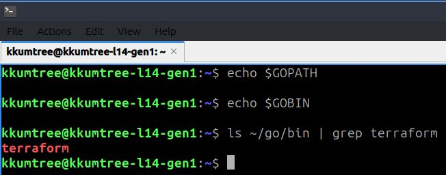

3. tfenv

- 이번 주차 스터디에서 배운 가장 유용한 것 중 하나를 꼽으라면 tfenv일 것 같습니다.  
- `sdkman!` 이나 `nvm` 같은 terraform 전용 패키지 매니저라고 생각하면 될 것 같습니다.
- 이미, 앞에서 두 가지를 다 해본 결과,  
  terraform은 직접 소스를 받아서 하는게 좋겠다는 판단이 들어서 수동설치로 진행.

```bash
# Download source at $HOME
cd $HOME && git clone --depth=1 https://github.com/tfutils/tfenv.git ~/.tfenv

# Add binary to $PATH at `.bash_profile`
echo 'export PATH="$HOME/.tfenv/bin:$PATH"' >> ~/.bash_profile

# (Optional) If you want not to logout or reboot, type below
source ~/.bash_profile
```

## tfenv 사용해보기

- 사용하는 것은 여타 패키지 매니저류들과 크게 다르지 않음.
- 크게 3가지로 정리
  1. 원격지(remote)에서 받을 수 있는 terraform 버전 확인
  2. 로컬로 지정한 terraform 버전 다운로드
  3. 실제 사용할 terraform 버전 지정
  
### (1) tfenv list-remote

- 조건을 주지않으면 제공될 수 있는 모든 tfenv가 출력됨  
- terraform은 `v0.13+` 직전과 이후로 큰 장벽이 있고, 포스팅 기준으로  
  이미 `v1.5.6`(stable), `v1.6.0`(alpha)가 최신이므로 이를 필터링해보겠습니다.

```bash
# basic command
tfenv list-remote

# (Optional)Check only major version 1
tfenv list-remote | grep ^1.
```

### (2) tfenv install

- 확인된 특정 버전(e.g. `v1.5.6`)을 설치.
  - `latest`를 지정하면 최신 stable 버전을 설치  
  
```bash
# Install terraform v1.5.6
tfenv install 1.5.6

# (Optional) Install latest version (stable)
# tfenv install latest

# Check if well-installed
tfenv list
```

### (3) tfenv use

- 설치 만으로는 바로 terraform을 사용할 수 없습니다.  
  로컬에 받아놓은 terraform 중에서 특정 버전을 명시적으로 지정해야 사용할 수 있습니다.

```bash
tfenv use 1.5.6
```

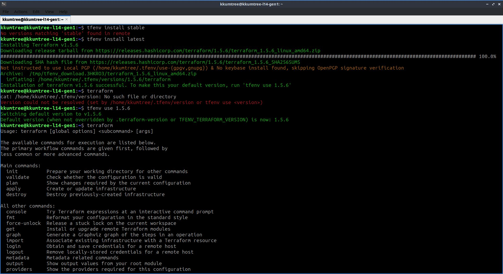

## Hello World in terraform

- 이제 제대로 작동하는지, AWS에 시험삼아 올려보도록 합니다.
- Pre-requisite  
  - awscli v2: [AWS Docs](https://docs.aws.amazon.com/ko_kr/cli/latest/userguide/getting-started-install.html)
  - AWS Default VPC
  - AWS IAM User w/sufficient permissions  
    (e.g. EC2FullAccess, S3FullAccess)

### (1) .tf 파일 생성

- terraform은 `.tf` 확장자를 가진 파일을 읽습니다.  
  여러 `.tf` 파일을 사용한다면, `main.tf`를 사용하는 것이 기본이나, `hello.tf`로 띄워봅니다.
- 지금은 '.tf' 파일들은 하나의 폴더 단위 안에서 진행된다고 이해해두고, 특정 폴더 안에서 해봅니다.  

```bash
# Set skeleton with t4g.nano(ARM64) instance
cat <<EOT > main.tf
provider "aws" {
  region = "ap-northeast-2"
}

resource "aws_instance" "example" {
  ami           = "<AMI_ImageId>"
  instance_type = "t4g.nano"
}
EOT
```

### (2) AMI 이미지 찾기

- Ubuntu 이미지를 찾아보도록 합시다.  
  - Minimal Ubuntu 22.04 LTS - Jammy (Arm)  
    cf. 22.04 버전의 Codename은 `jammy` 입니다.  
- 두 가지 방법으로 알아봅니다.  

1. AWS 웹 콘솔에서 AMI ID 얻기

- Launch Instance > Choose an Amazon Machine Image (AMI) > Browse more AMIs  
- AWS Marketplace AMIs 탭 선택 > `jammy` 검색 > Select > Continue
- AMI를 파악합니다. 예를 들어...  
  아래와 같이 파악이 되었다면, AMI ID는 `ami-0a40cf5c43bd1585b` 입니다.

```explain
[Amazon Machine Image (AMI)]
ubuntu-minimal/images/hvm-ssd/ubuntu-jammy-22.04-arm64-minimal-20230726-ad51111f-e245-404d-8492-515abfd1e565
ami-0a40cf5c43bd1585b << HERE!
```

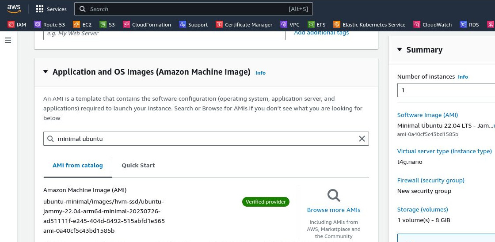

2. AWS CLI로 AMI 값 얻기

- AWS CLI를 설치했다면, 아래와 같이 명령어를 통해 AMI 값을 얻을 수 있습니다.
- 자세한 정보는 [Ubuntu Wiki](https://wiki.ubuntu.com/Minimal)에서 확인할 수 있습니다. (GCE, OCI 등)

- 쿼리를 적용해서 필터링을 해봅니다.  

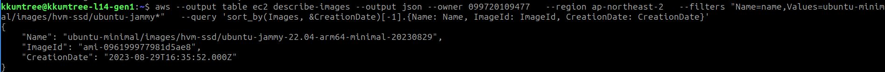

```bash
aws --output table ec2 describe-images --output json --owner 099720109477   --region us-west-2   --filters "Name=name,Values=ubuntu-minimal/images/hvm-ssd/ubuntu-jammy-22.04-arm*"   --query 'sort_by(Images, &CreationDate)[-1].{Name: Name, ImageId: ImageId, CreationDate: CreationDate}'
```

- 결과값은 아래와 같습니다. `ami-0710aced8c563d012`

```bash
{
    "Name": "ubuntu-minimal/images/hvm-ssd/ubuntu-jammy-22.04-arm64-minimal-20230830",
    "ImageId": "ami-0710aced8c563d012",
    "CreationDate": "2023-08-31T01:57:56.000Z"
}
```

- 쿼리로 필터링을 하지 않았다면, 전체 버전을 조회할 수 있습니다.  

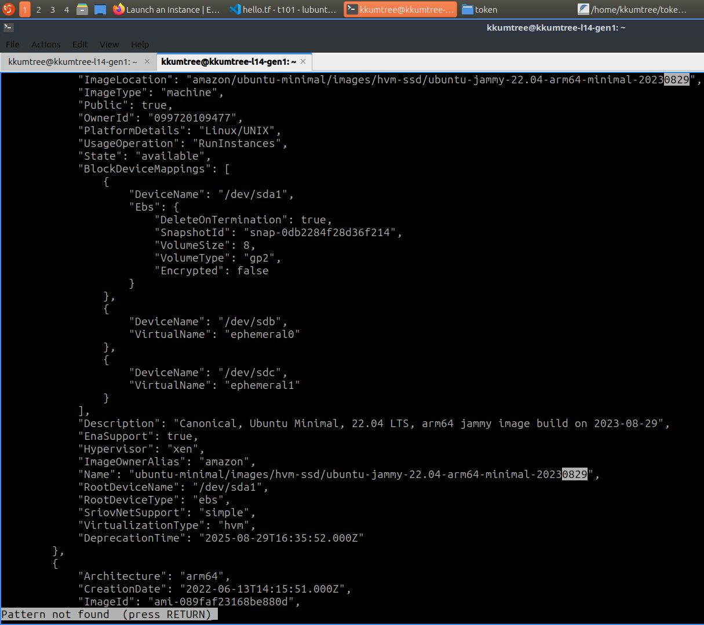

### (3) AMI 값 적용해두기

- 위에서 얻은 AMI 값을 `hello.tf` 파일에 적용해두도록 합니다.

```bash
sed -i 's/<AMI_ImageId>/ami-0710aced8c563d012/g' hello.tf && cat hello.tf
```

아래와 같이 출력값이 나오는지 확인 합니다.

```bash
provider "aws" {
  region = "ap-northeast-2"
}

resource "aws_instance" "example" {
  ami           = "ami-0710aced8c563d012"
  instance_type = "t4g.nano"
}
```

## Terraform 써보기

- `hello.tf` 파일이 있는 폴더에서 순차적으로 아래의 명령어를 입력해볼 것입니다.
  - `terraform init`
  - `terraform apply`
  - `terraform destroy`

### (1) terraform init

- 한번도 하지 않은 폴더에서 terraform을 사용하려면 필요합니다.  

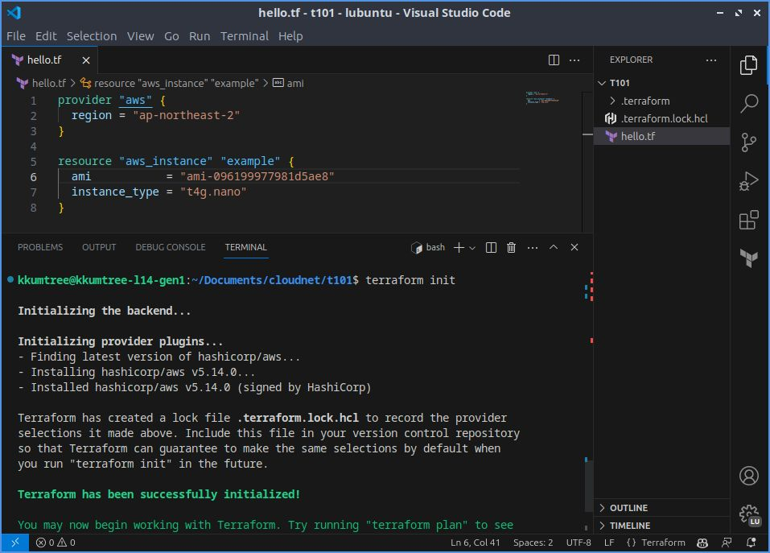

### (2) terraform apply

- 위에서 수정이 완료된 `hello.tf`를 AWS에 적용합니다.  
- `plan`을 생략했는데, `--auto-approve` 옵션을 주지 않으면 `apply`는  
  [ terraform plan -> You say yes -> terraform apply it ]을 진행합니다.  
- `yes`를 입력하지 않으면, 취소됩니다. `YES`, `Y`, `y`는 처리되지 않습니다.
- 이 과정에서, 작업하고 있는 PC(특히, CPU) 사양에 따라 소요 시간이 널뛰기하니 참고.

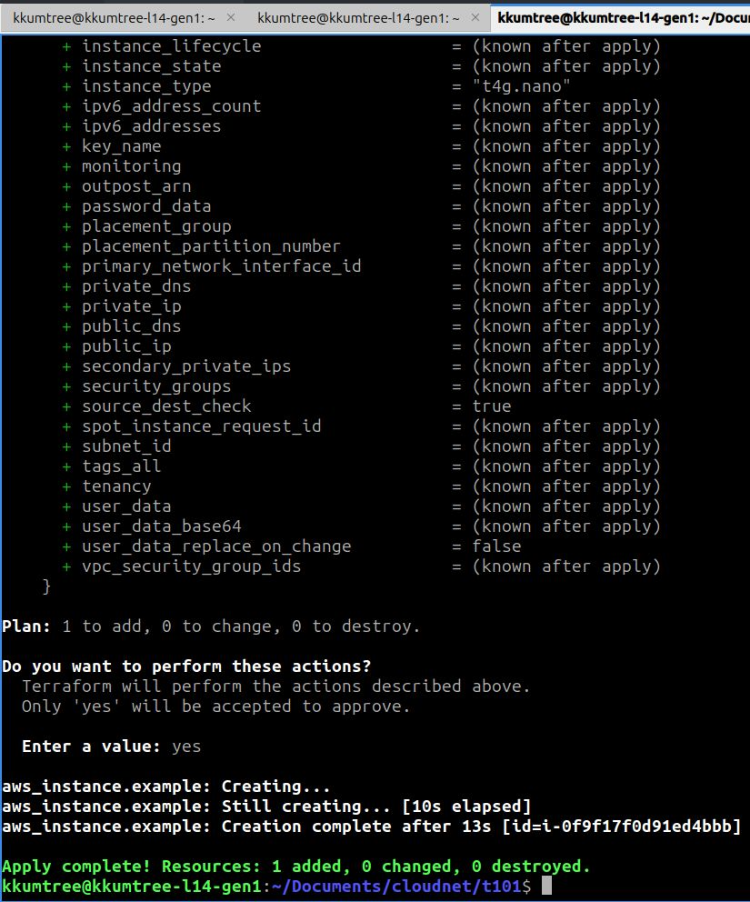

- 다른 터미널을 켜서, 아래와 같이 관찰 준비를 합니다. 인스턴스 ID가 뜨면 성공.  

```bash
while true; do aws ec2 describe-instances --query "Reservations[*].Instances[*].{PublicIPAdd:PublicIpAddress,InstanceName:Tags[?Key=='Name']|[0].Value,Status:State.Name}" --filters Name=instance-state-name,Values=running --output text ; echo "------------------------------" ; sleep 1; done
```

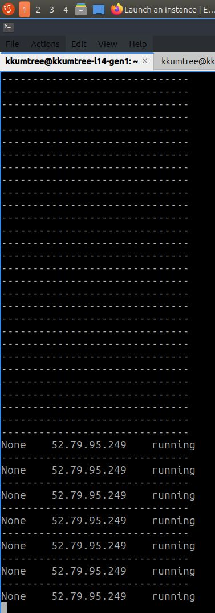

### (3) terraform destroy

- 인스턴스가 생성된 것을 확인했으니, 해당 리소스를 삭제합니다.
  `terraform apply`와 마찬가지로 `yes`를 입력해야 삭제가 진행됩니다.
- 기존에 수동으로 생성했던, 다른 인스턴스나 리소스들은 영향을 받지 않습니다.  

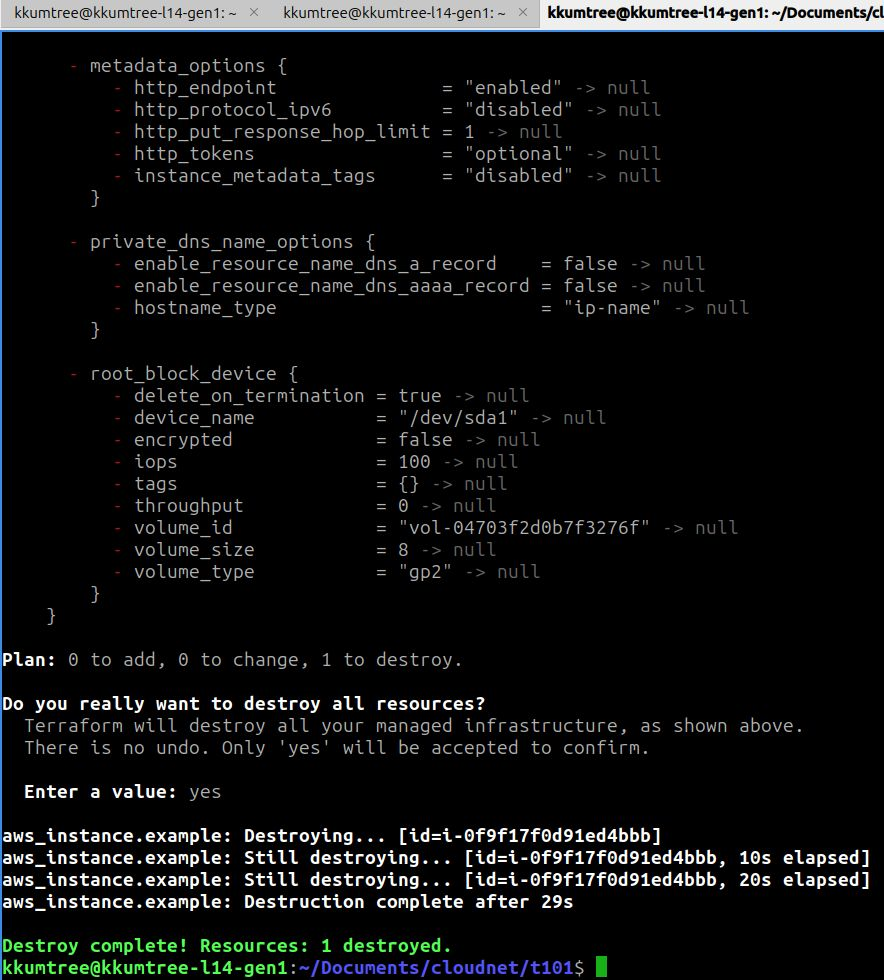

- 아래와 같이 인스턴스가 삭제되는 것을 확인할 수 있습니다.

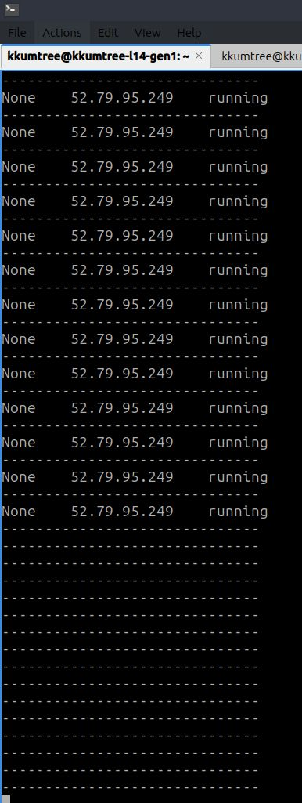

## 별첨: backend lock

- terraform은 충돌을 방지하기 위해, 같은 backend를  
  대상으로 다른 곳에서 먼저 작업 중이라면 lock을 기본값으로 갖고있습니다.  
- 로컬 백엔드에서 작업하는 경우도, 터미널 2개 이상에서 시도할 경우 lock이 걸립니다.  

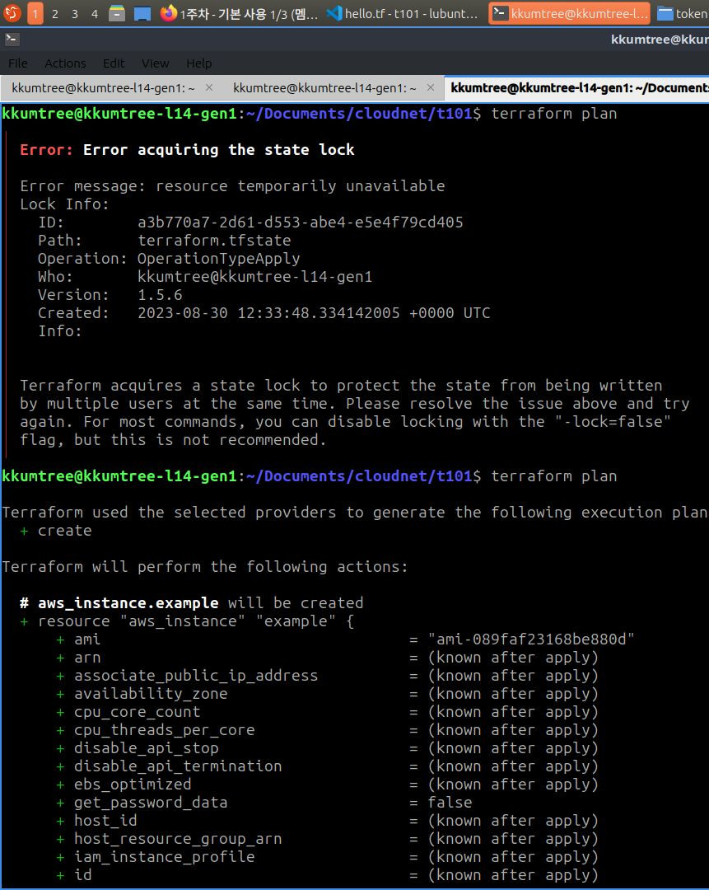  

## 마무리 및 느낀점

- 간단한 예제를 통해, Ubuntu 이미지를 직접 찾아보고 terraform을 알아보았습니다.  
- tfenv는 가이드에서 소스코드를 얕은 클론(swallow clone)으로 진행하는데 반해,  
  terraform는 공식 GitHub에 있는 commit history를 다 가져오도록 함.  
  명령어를 $PATH에 등록할 때도 접근법이 다름.  

## reference

- [CloudNet@](https://gasidaseo.notion.site/3-8b2603d882734df0b96f8670bb4e15d4)
- [테라폼으로 시작하는 IaC](https://link.coupang.com/a/8mN0N)
- [Terraform CLI](https://developer.hashicorp.com/terraform/tutorials/aws-get-started/install-cli)  
- [Go/gccgo](https://go.dev/doc/install/gccgo)
- [AWS awscli v2](https://docs.aws.amazon.com/ko_kr/cli/latest/userguide/getting-started-install.html)
- [Ubuntu Wiki/Minimal](https://wiki.ubuntu.com/Minimal)