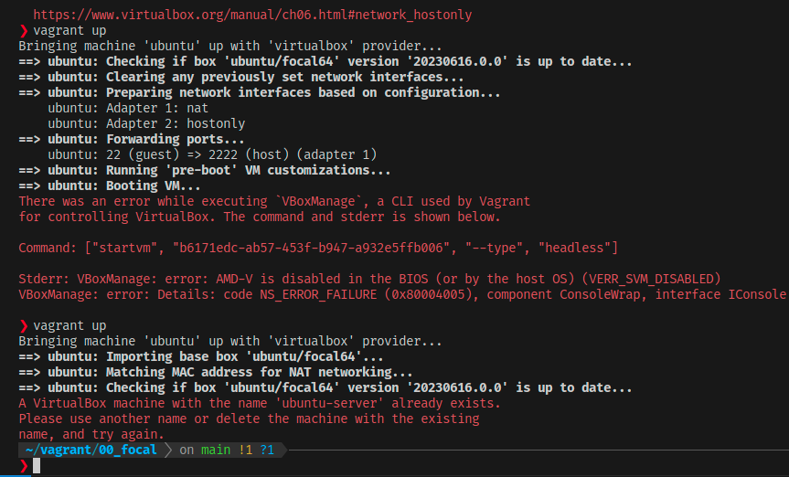
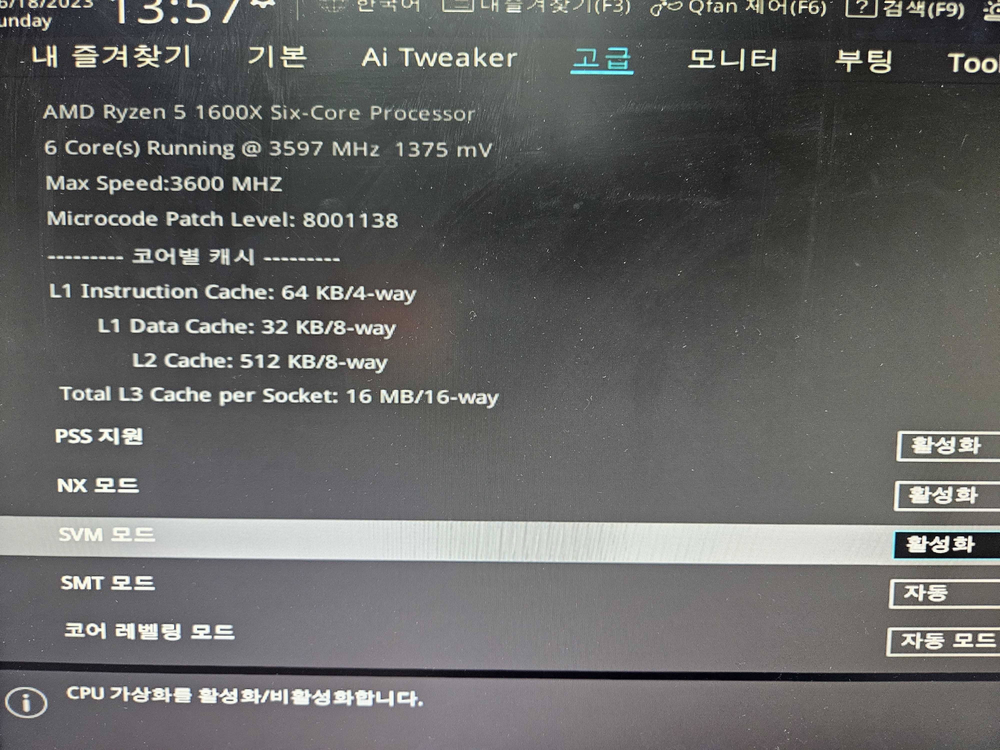
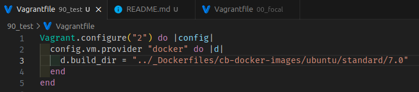
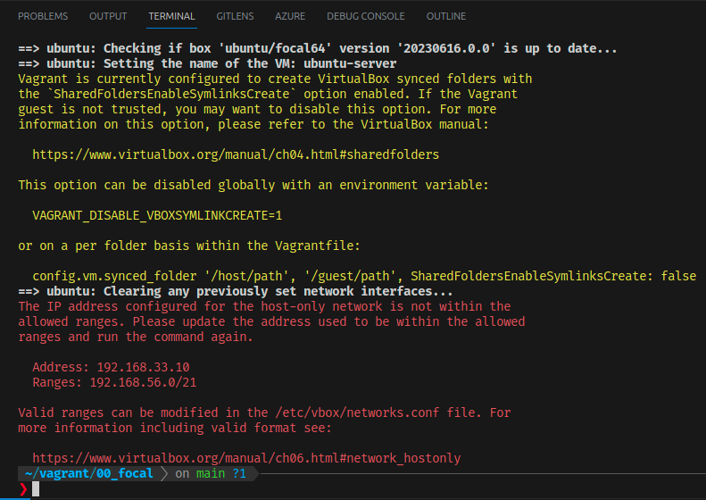
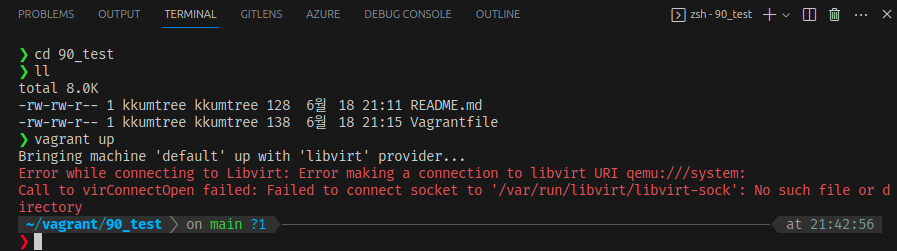

Ubuntu 23.04 (Host OS)에서 간단하게 Vagrant 사용을 해보고, VBox가 아닌 Docker를 Provider로 지정하여 사용해본다.

- WSL2 환경에서는 Vagrant가 의도한대로 작동하지 않으므로 유의: 별도의 설정 필요
  - [Hashicorp Docs](https://developer.hashicorp.com/vagrant/docs/other/wsl)

## Vagrant 설치

- Ubuntu 22.04 LTS 및 23.10 기준, APT repo를 통한 설치 지원

```bash
sudo apt-get install vagrant
```

## VBox 설치(사용 시)

- CPU 가상화 기술 활성화 필요(BIOS단, AMD의 경우는 SVM, Intel의 경우는 VT-x)





- virtualbox-ext-pack(선택): USB 2.0/3.0 지원 등의 확장 기능을 사용하려면 설치  
  - 개인용도의 제한적 라이선스(동의를 위한 대화창 확인)  
  - 확장기능을 쓸 필요가 없기 때문에 설치하지 아니함  

```bash
sudo apt-get install virtualbox
# sudo apt-get install virtualbox-ext-pack
```

## Docker 설치(사용 시)

- Ubuntu 기준, 아래 3가지 설치 방법이 있으므로, 친숙한 모드로 진행

```bash
sudo snap install docker # 최신버전
sudo apt-get install docker.io
sudo apt-get install podman-docker
```

- Docker 권한 부여: 라이브 서비스 시 권한 유의 [(Docker Docs)](https://docs.docker.com/engine/security/#docker-daemon-attack-surface)
  - Docker 그룹에 현재 사용자 추가
  - Docker 그룹에 속한 사용자는 sudo 없이도 Docker 사용 가능

```bash
sudo addgroup --system docker
sudo adduser $USER docker
newgrp docker
```

- (참고) Docker 공식 Docs에 서술된 Docker Engine 설치 방법
  - Docker Docs: [Install Docker Engine on Ubuntu](https://docs.docker.com/engine/install/ubuntu/)

## Vagrantfile 생성

### VBox 사용 시

- Snippet: [Gist](https://gist.github.com/kkumtree/74714c87d6b792cb9e3ff4ea8b281b26)
  - CPU: 1Core / RAM: 1024MB

```Vagrantfile
# -*- mode: ruby -*-
# vi: set ft=ruby :

Vagrant.configure("2") do |config|
  config.vm.box = "ubuntu/focal64"

  config.vm.define "ubuntu" do |ubuntu|
    ubuntu.vm.hostname = "kkumtree-server"
    ubuntu.vm.provider "virtualbox" do |vb|
      vb.name = "ubuntu-server"
      vb.cpus = 1
      vb.memory = 1024
    end
    
    ubuntu.vm.network "private_network", ip: "192.168.56.99"

    ubuntu.vm.provision "shell", inline: <<-SCRIPT
      sudo sed -i 's/PasswordAuthentication no/PasswordAuthentication yes/g' /etc/ssh/sshd_config
      sudo useradd kkumtree -m -s /bin/bash
      sudo usermod -a -G sudo kkumtree
      echo kkumtree:kkumtree | sudo chpasswd
      sudo systemctl restart sshd
    SCRIPT
  end
end
```

### Docker 사용 시

- Vagrantfile과 Dockerfile은 같은 폴더에 있음을 전제, 아닐 경우 d.build_dir 파라미터 수정.
  - 아래처럼 다른 폴더를 지정하여 사용 가능



- Snippet:  
  - [Gist-Vagrantfile](https://gist.github.com/kkumtree/317c450d38319cdd92f9213602c4465d)  
  - [Gist-Dockerfile](https://gist.github.com/kkumtree/40c2c9925035190efc6f8cb4be55a4c3)

- Vagrant PUB key 사용: [Github](https://github.com/hashicorp/vagrant/blob/main/keys/vagrant.pub)
  - Vagrant에서 키를 인지하고, 키 교체 작업 진행

```Vagrantfile
Vagrant.configure("2") do |config|
  config.vm.define "ubuntu" do |ubuntu|
    ubuntu.vm.provider "docker" do |d|
      d.build_dir = "."
    end

    # ubuntu.vm.provision "shell", inline: <<-SCRIPT
    #   sudo sed -i 's/PasswordAuthentication no/PasswordAuthentication yes/g' /etc/ssh/sshd_config
    #   sudo useradd kkumtree -m -s /bin/bash
    #   sudo usermod -a -G sudo kkumtree
    #   echo kkumtree:kkumtree | sudo chpasswd
    #   sudo systemctl restart sshd
    # SCRIPT
  end

  config.vm.synced_folder ".", "/vagrant", disabled: true
end
```

```Dockerfile
FROM public.ecr.aws/ubuntu/ubuntu:20.04_stable

RUN apt-get update -y

RUN apt-get install -y --no-install-recommends ssh sudo

RUN useradd --create-home -s /bin/bash vagrant
RUN echo -n 'vagrant:vagrant' | chpasswd
RUN echo 'vagrant ALL = NOPASSWD: ALL' > /etc/sudoers.d/vagrant
RUN chmod 440 /etc/sudoers.d/vagrant
RUN mkdir -p /home/vagrant/.ssh
RUN chmod 700 /home/vagrant/.ssh
RUN echo "ssh-rsa AAAAB3NzaC1yc2EAAAABIwAAAQEA6NF8iallvQVp22WDkTkyrtvp9eWW6A8YVr+kz4TjGYe7gHzIw+niNltGEFHzD8+v1I2YJ6oXevct1YeS0o9HZyN1Q9qgCgzUFtdOKLv6IedplqoPkcmF0aYet2PkEDo3MlTBckFXPITAMzF8dJSIFo9D8HfdOV0IAdx4O7PtixWKn5y2hMNG0zQPyUecp4pzC6kivAIhyfHilFR61RGL+GPXQ2MWZWFYbAGjyiYJnAmCP3NOTd0jMZEnDkbUvxhMmBYSdETk1rRgm+R4LOzFUGaHqHDLKLX+FIPKcF96hrucXzcWyLbIbEgE98OHlnVYCzRdK8jlqm8tehUc9c9WhQ==" > /home/vagrant/.ssh/authorized_keys
RUN chmod 600 /home/vagrant/.ssh/authorized_keys
RUN chown -R vagrant:vagrant /home/vagrant/.ssh
RUN sed -i -e 's/Defaults.*requiretty/#&/' /etc/sudoers
RUN sed -i -e 's/\(UsePAM \)yes/\1 no/' /etc/ssh/sshd_config

RUN mkdir /var/run/sshd

RUN apt-get -y install openssh-client

EXPOSE 22
CMD ["/usr/sbin/sshd", "-D"]
```

## Vagrant 실행

- VBox 사용 시, private_network 값이 라우터 등에서 설정한 서브넷마스크와 충돌할 수 있음  
  - 기존 VBox Destroy 이후, 서브넷마스크에 맞게 IP 재 지정 후 실행.



- Provider 지정 실행
  - (Default) Win: VBox, Linux: Libvirt
  - Docker의 경우는 provider 지정하여 실행하거나, 따로 기본값으로 설정해두어야함.


  
```bash
# VBox 사용시
vagrant up
# Docker 사용시
vagrant up --provider=docker
```

## Vagrant 접속

- SSH 접속

```bash
# Docker) vagrant 지원 명령어 사용
vagrant ssh
# VBox) ssh 명령어 사용
ssh -p 2222 -o StrictHostKeyChecking=no -o UserKnownHostsFile=/dev/null kkumtree@localhost
```

## Reference

- [phoenixNAP](https://phoenixnap.com/kb/install-virtualbox-on-ubuntu)
- [HashiCorp](https://developer.hashicorp.com/vagrant/docs/providers/docker/basics)
- [DEV-mattdark](https://dev.to/mattdark/using-docker-as-provider-for-vagrant-10me)  
