[CloudNet@](https://gasidaseo.notion.site/CloudNet-Blog-c9dfa44a27ff431dafdd2edacc8a1863)에서 진행하고 있는 CI/CD Study 8주차에는 [Vault](https://www.vaultproject.io/)의 HA(High Availability)에 대해 다루었습니다.  

구성 방법의 이론적 부분은 단순했으나, 예상한 구성 방법과 달라서 제가 나중에 참고하려고 부연설명을 해두려고 합니다.  

더불어 대시보드에서 Vault 관련 메트릭을 보고 싶어서, Datadog과 연동하여 관측하였습니다.  

## 0. 실습 환경 준비

> 해당 구성들은 아래 GitHub에 탑재되어 있습니다.  
> <https://github.com/kkumtree/ci-cd-cloudnet-study> 의 8w 폴더
> Helm v4 출시 후 한 달도 안된 시점에 작성되었기에, v3에 호환되는 차트 버전을 명시하여 배포했습니다.  

kind 배포와 ingress-nginx, 그리고 vault-worker 까지 배포하면, 아래와 같은 구성도가 됩니다.  

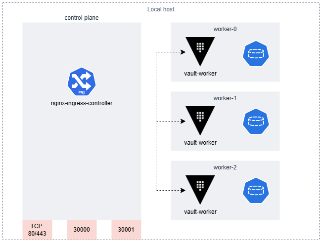

(1-1) kind의 경우 (8w/shells/kind/up-kind.sh)  

1. control-plane 하나 (containerPort:hostPort)  
   - 80:80, 443:443 (TCP)  
   - 30000:30000, 30001  
2. vault-worker간 raft 알고리즘을 위한, 3개의 worker 노드

(1-2) ingress-nginx의 경우 (8w/shells/kind/up-kind.sh)  

- kind용으로 배포하며 해당 컨트롤러가 control-plane에 배포됩니다.  
- nodeSelecter: `ingress-ready:true`
- SSL paththrough 활성화
  (배포 단순 확인을 위해, `traefik/whoami` 서비스 추가 배포)  

(2) vault-worker의 경우 (8w/shells/vault/vault-ha.sh)  

1. HA모드 활성화 및 replica 3개 구성
   - raft 및 ui 활성화 / TLS 비활성화
   - Port: 8200(API), 8201(vault-worker간 통신)
   - kubernetes 서비스 등록
2. readinessProbe 활성화
3. PVC: raft 데이터 저장 (10Gi)  
4. UI (NodePort)  
   - externalPort: 8200
   - serviceNodePort: 300000
5. injector 비활성화  

## 1. Vault 클러스터 구성

각 worker 노드에 배포된 replica pod들에서 로그를 반복적으로 확인할 수 있습니다.  
또한 구성이 완료되지 않은 상태이기 때문에, running 상태가 아님을 확인할 수 도 있습니다. (readinessProbe)  

```log  
[INFO]  core: security barrier not initialized  
[INFO]  core: seal configuration missing, not initialize  
```  

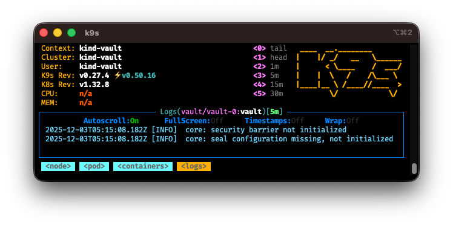

그래서 아래와 같은 절차를 밟습니다.  

1. 3개의 Pod 중 하나를 선택하여, 터미널에서 Vault 클러스터 초기화(initialize)를 합니다.  
   - 출력되는 Unseal Key 5개와 Initial Root Token 1개를 메모해둡니다.  
   - Unseal Key 3개를 골라, Vault를 Unseal 상태로 바꿉니다. (다수결 충족 및 리더로 선출)  
   - 해당 Pod에서 확인되는 Vault HA Cluster 주소를 메모해둡니다.  
2. 남은 Pod의 터미널에서는 **초기화하지 않습니다**.  
   - 초기화한 Vault Pod에서 확인된 Cluster 주소를 기반으로 Cluster에 Join 합니다.  
   - Vault를 Unseal 상태로 만듭니다. (1번에서 확인된 Unseal Key 사용)  

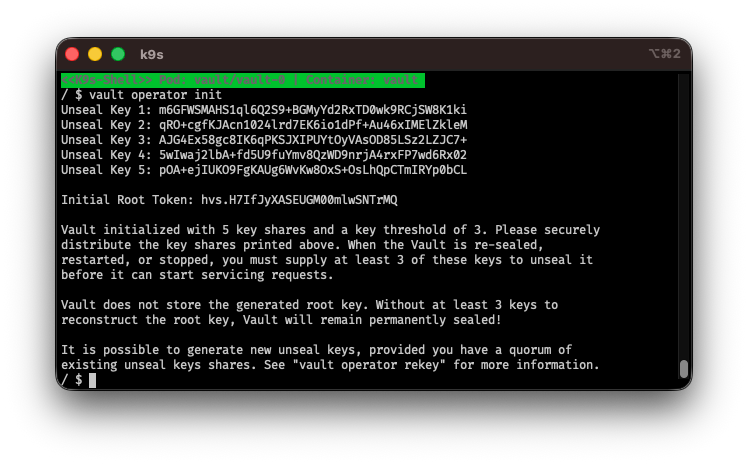  

이를 도식화하면 아래와 같이 됩니다.  

(1-하나의 Pod를 초기화)  
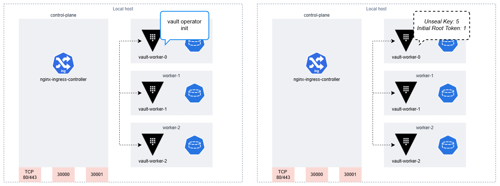  

(2-해당 Pod에서 Unseal 시행)  
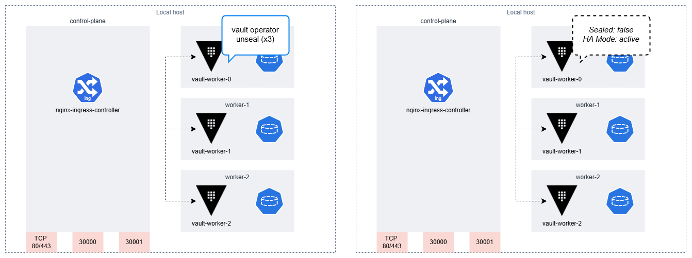  

(3-남은 Pod에서 초기화한 Pod로 Join)  
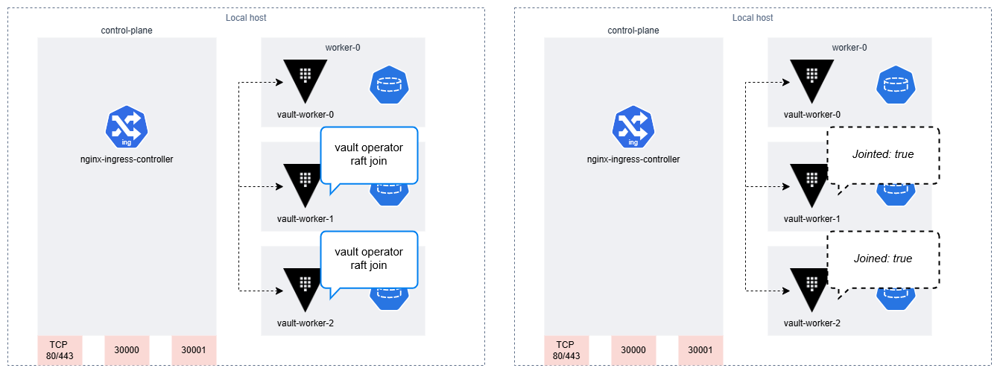  

(4-남은 Pod에서 Unseal 시행)  
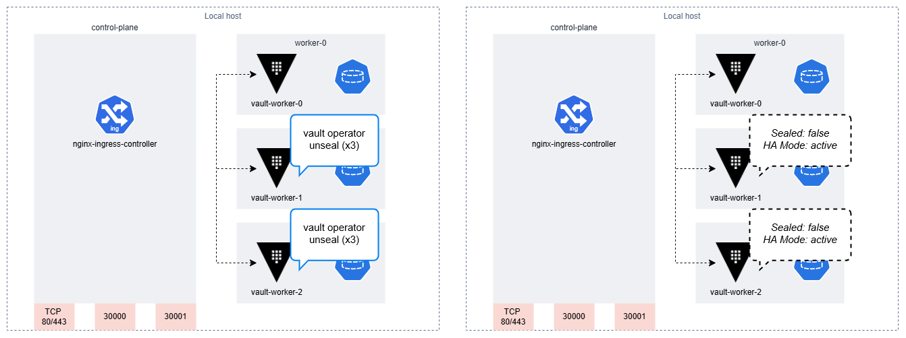  

각 Pod에서 Unsealed 시행 시 다음과 같이 확인할 수 있습니다.  

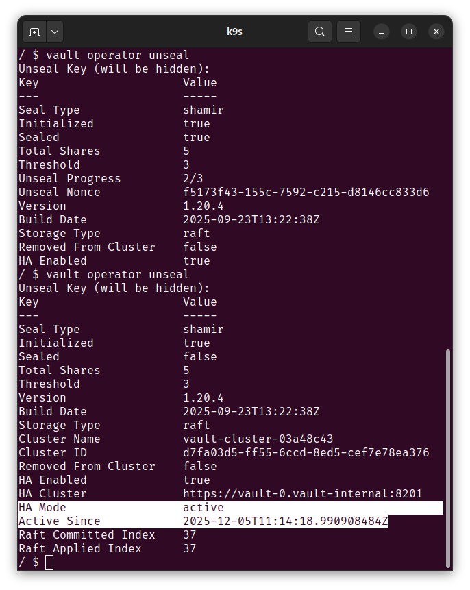  

vault-0 Pod가 Unsealed 되었을 시, 아래와 같이 해당 Pod만 Ready 상태가 됩니다.  

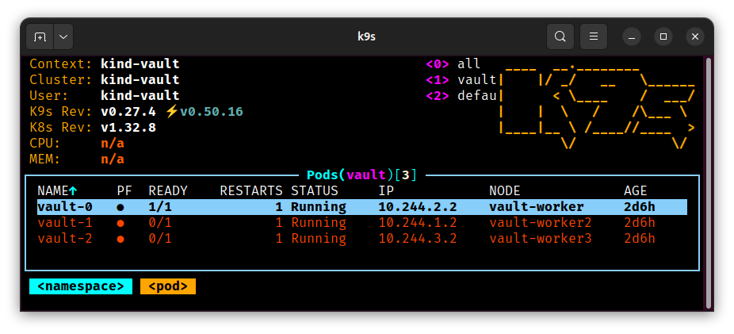

다른 두 Pod에서 join 후, 똑같이 Unsealed를 하면 이 또한 Ready 상태가 됩니다.  

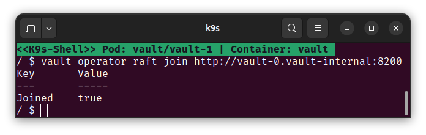

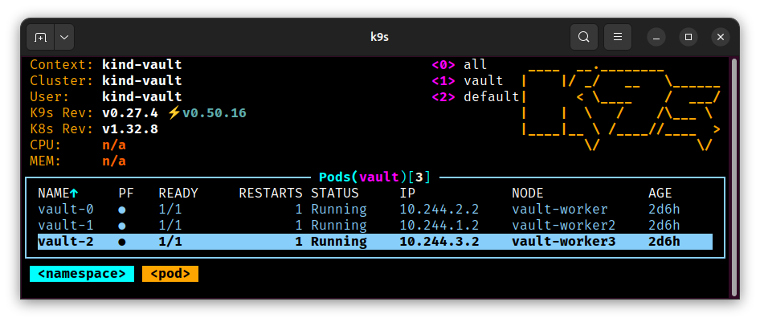

이후 vault-worker Pod 외부에서 vault와 통신하려면, 아래와 같이 두 변수를 설정해야합니다.  

- `VAULT_ROOT_TOKEN`: 초기화 시 확인된 root token  
- `VAULT_ADDR`: `'http://localhost:30000'` (ui.ServiceNodePort)

> 여기서 눈치챘겠지만, vault cli는 HTTP API 호출을 기반으로 한다는 것을 알 수 있습니다.  

그러면 아래와 같이 leader 1개, follower 2개의 raft 피어목록을 확인할 수 있습니다.  

```bash  
# vault login
vault operator raft list-peers  
```  

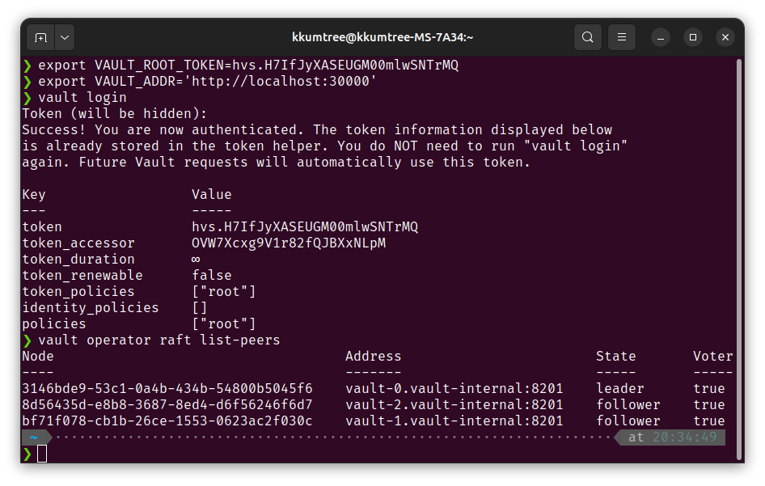  

## 2. Vault API 간단 맛보기  

이번에는 Vault CLI를 통해 비밀을 저장해보도록 하겠습니다.  

(1) `mysecret` 경로로 secret 활성화  

```bash
vault secrets enable -path=mysecret kv-v2
```

(2) 하위 `logins/study`에 샘플 시크릿 저장  

```bash
vault kv put mysecret/logins/study \
  username="demo" \
  password="p@ssw0rd"
```

(3) 입력된 시크릿 확인  

```bash
vault kv get mysecret/logins/study
```

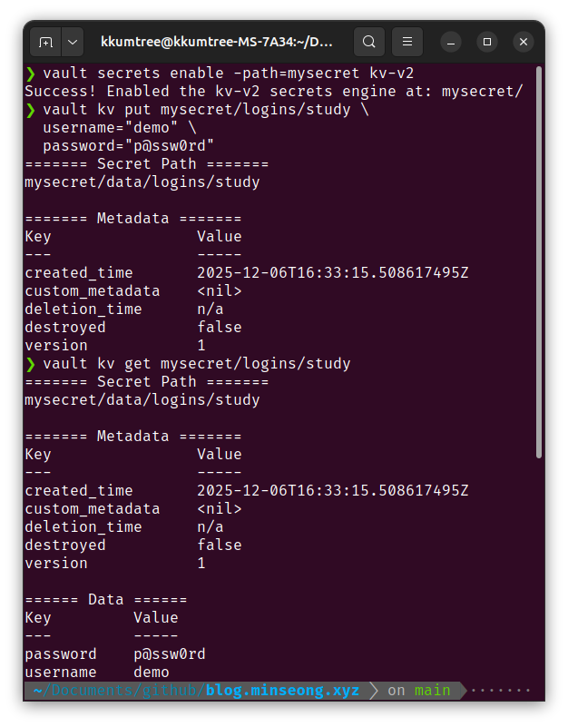  

세부 경로는 list 명령어를 통해서도 확인할 수 있습니다.  

```bash
vault kv list mysecret
vault kv list mysecret/logins
```

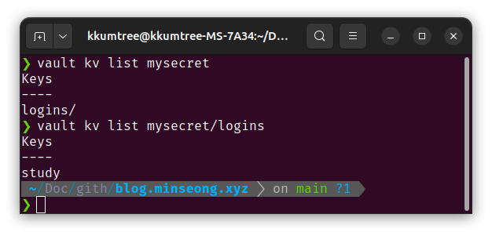  

curl을 통한 API 요청으로도 확인할 수 있습니다.  

```bash
curl -s --header "X-Vault-Token: $VAULT_ROOT_TOKEN" http://localhost:30000/v1/mysecret/data/logins/study | jq

curl -s --header "X-Vault-Token: $VAULT_ROOT_TOKEN" http://localhost:30000/v1/mysecret/data/logins/study \
  | jq -r .data.data.username

curl -s --header "X-Vault-Token: $VAULT_ROOT_TOKEN" http://localhost:30000/v1/mysecret/data/logins/study \
  | jq -r .data.data.password

export USER_NAME=$(curl -s --header "X-Vault-Token: $VAULT_ROOT_TOKEN" http://localhost:30000/v1/mysecret/data/logins/study | jq -r .data.data.username)
export PASSWORD=$(curl -s --header "X-Vault-Token: $VAULT_ROOT_TOKEN" http://localhost:30000/v1/mysecret/data/logins/study | jq -r .data.data.password)
echo $USER_NAME $PASSWORD
```

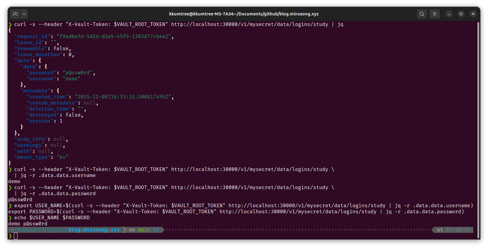  

UI로도 확인합니다.  

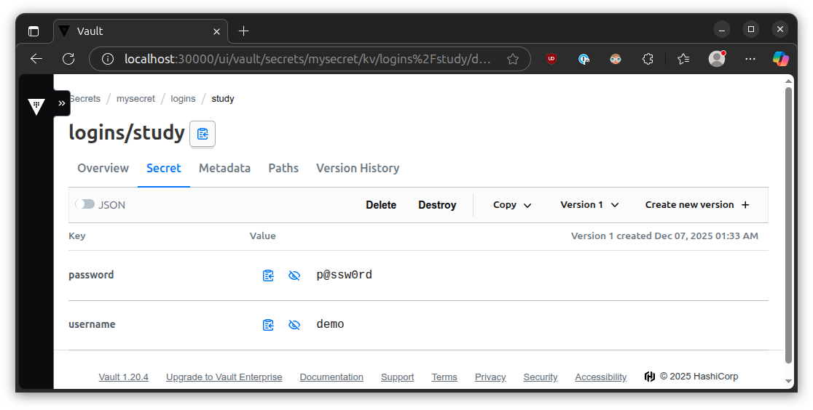  

## 3. OpenLDAP 연동해보기  

### (1) 환경 구성  

> 8w/shells/openldap/openldap.sh

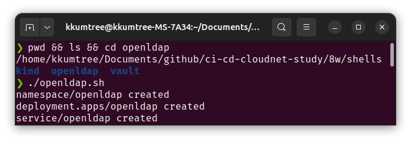  

아래와 같은 구조로 구성해보겠습니다.  

```bash
dc=example,dc=org
├── ou=people
│   ├── uid=alice
│   │   ├── cn: Alice
│   │   ├── sn: Kim
│   │   ├── uid: alice
│   │   └── mail: alice@example.org
│   └── uid=bob
│       ├── cn: Bob
│       ├── sn: Lee
│       ├── uid: bob
│       └── mail: bob@example.org
└── ou=groups
    ├── cn=devs
    │   └── member: uid=bob,ou=people,dc=example,dc=org
    └── cn=admins
        └── member: uid=alice,ou=people,dc=example,dc=org
```

OpenLDAP 컨테이너에 접근하여, 생성합니다.  

```bash
kubectl -n openldap exec -it deploy/openldap -c openldap -- bash
```

(1) OU(Orgnization Unit) 생성

```bash
cat <<EOF | ldapadd -x -D "cn=admin,dc=example,dc=org" -w admin
dn: ou=people,dc=example,dc=org
objectClass: organizationalUnit
ou: people

dn: ou=groups,dc=example,dc=org
objectClass: organizationalUnit
ou: groups
EOF
```

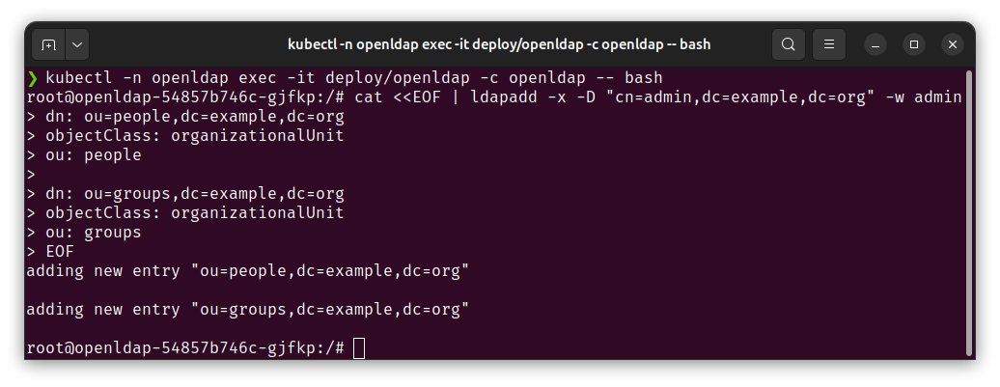

(2) user(inetOrgPerson) 추가  

```bash
cat <<EOF | ldapadd -x -D "cn=admin,dc=example,dc=org" -w admin
dn: uid=alice,ou=people,dc=example,dc=org
objectClass: inetOrgPerson
cn: Alice
sn: Kim
uid: alice
mail: alice@example.org
userPassword: alice123

dn: uid=bob,ou=people,dc=example,dc=org
objectClass: inetOrgPerson
cn: Bob
sn: Lee
uid: bob
mail: bob@example.org
userPassword: bob123
EOF
```

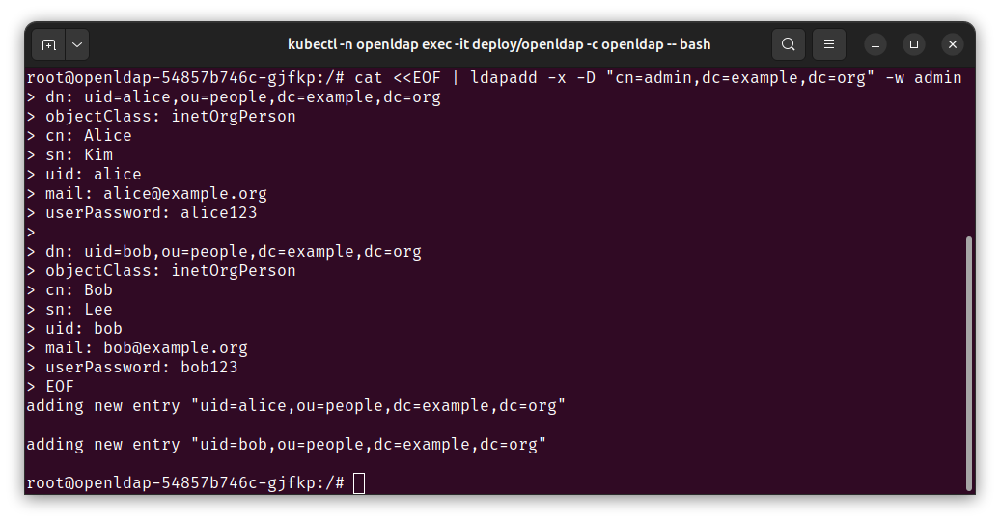  

(3) group(groupOfNames) 추가  

```bash
cat <<EOF | ldapadd -x -D "cn=admin,dc=example,dc=org" -w admin
dn: cn=devs,ou=groups,dc=example,dc=org
objectClass: groupOfNames
cn: devs
member: uid=bob,ou=people,dc=example,dc=org

dn: cn=admins,ou=groups,dc=example,dc=org
objectClass: groupOfNames
cn: admins
member: uid=alice,ou=people,dc=example,dc=org
EOF

# 생성 확인 후 exit
exit
```

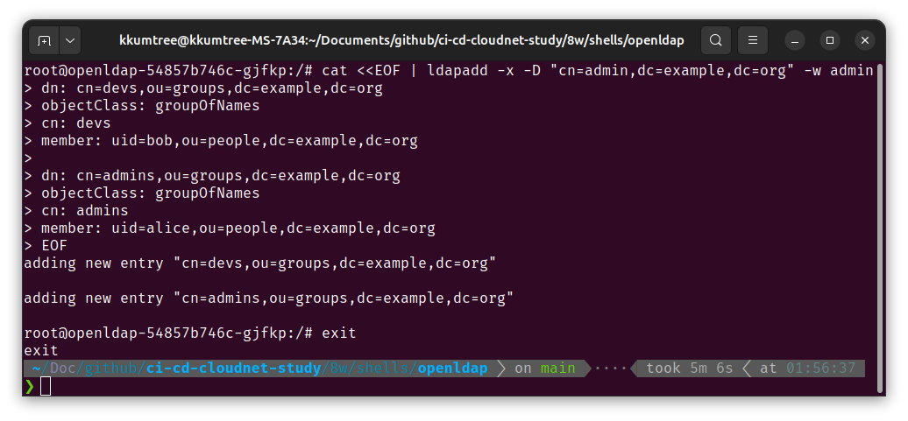  

### (2) LDAP 인증 활성화  

이제 Vault에서 LDAP을 쓸 수 있게 활성화합니다.  
OpenLDAP 배포 시, 포트 389번을 ldap 컨테이너에 연결하였기에 이를 사용합니다.  

```bash
vault auth enable ldap

vault auth list
vault auth list -detailed
```

기본 인증으로 활성화된 token과 함께 ldap이 활성화된 것을 확인

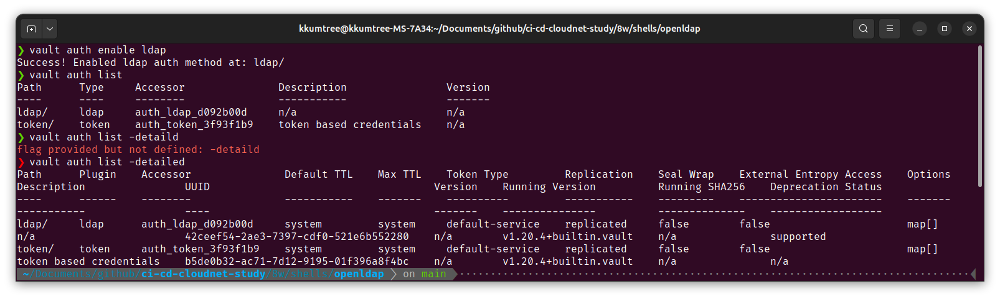  

ldap 엔드포인트를 설정 후, 앞서 만들었던 alice 계정으로 접근해봅니다.  

```bash
vault write auth/ldap/config \
    url="ldap://openldap.openldap.svc:389" \
    starttls=false \
    insecure_tls=true \
    binddn="cn=admin,dc=example,dc=org" \
    bindpass="admin" \
    userdn="ou=people,dc=example,dc=org" \
    groupdn="ou=groups,dc=example,dc=org" \
    groupfilter="(member=uid={{.Username}},ou=people,dc=example,dc=org)" \
    groupattr="cn"
vault login -method=ldap username=alice
# 패스워드는 alice123 를 입력  
```

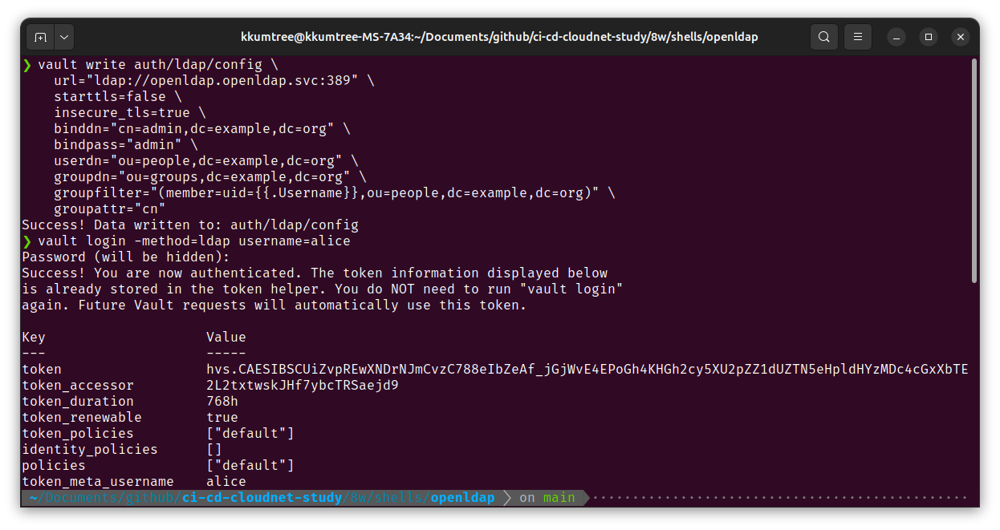  

alice 계정에 적용된 정책 `default`가 적용되었음을 확인합니다.  
다른 계정 `bob`으로 로그인 시, 토큰값이 바뀐 것을 확인합니다.  

```bash
vault token lookup -format=json | jq .data.policies
vault token lookup
vault login -method=ldap username=bob password=bob123
```

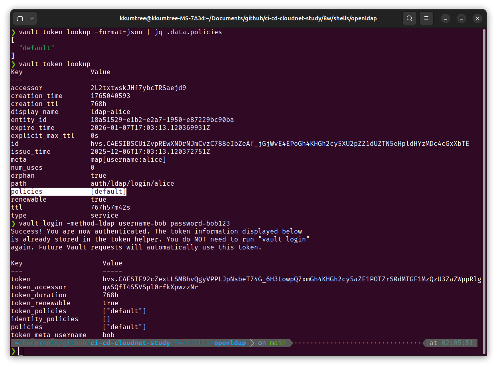  

## 4. Datadog 메트릭 수집해보기

> 로컬 k8s 환경이라 이것저것 손좀 봐야되는게 있었지만,  
> 그것보다도, Vault Helm Chart 셋업이 좀 혼동되는 부분이 있어 적어봅니다.  

JWT토큰을 사용해서 할 수도 있는데, 이번에는 metric 엔드포인트만으로 가져올 수 있도록 합시다.  

### (1) Vault 재배포  

> 8w/shells/vault/vault-ha-ot.sh

PV에 기존 설정값이 보존되어 있기에, 아래와 같이 Vault를 내립니다.  

```bash
helm uninstall vault -n vault
```

이후 메트릭이 노출될 수 있도록 Vault의 Helm 차트를 설정해야되는데,  
raft를 설정했다보니 어디를 설정해야할지 혼동되었었습니다.  
설정이 잘 적용되지 않으면 prometheus 포맷에 대해 쿼리시, 아래처럼 Vault가 거부를 하니 유의.  

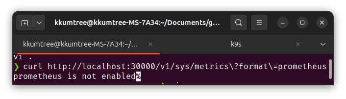

잠정적으로 내린 결론은 `server.ha.raft`를 활성화하기로 했다면,  
`server.ha.config` 는 무시되는 것으로 보입니다.  

> Hashicorp Discourse랑 Vault Chart의 GitHub Issue를 참고했는데,  
> 아주 명확한 해설은 없었고, 특히, GitHub의 values.yaml 주석이 제게는 애매했었습니다.  

따라서 밑에 발췌해둔 `server.ha.raft.config` 부분을 참고해서,  

- listener "tcp" 스탠자에 `unauthenticated_metrics_access = "true"
- 따로 telemetry 스탠자에 옵션을 설정합니다.  

```yaml
server:
  ha:
    raft:
      config: |
        listener "tcp" {
          tls_disable = 1
          address = "[::]:8200"
          cluster_address = "[::]:8201"
          # Enable unauthenticated metrics access (necessary for Prometheus Operator)
          telemetry {
            unauthenticated_metrics_access = "true"
          }
        }

        telemetry {
          prometheus_retention_time = "30s"
          disable_hostname = true
        }

    config: |
      listener "tcp" {
        tls_disable = 1                           
        address = "[::]:8200"                     
        cluster_address = "[::]:8201"
        telemetry {
          unauthenticated_metrics_access = "true"
        }
      }

      telemetry {
        prometheus_retention_time = "30s"
        disable_hostname = true
      }    
```

배포 후에는 Unseal 및 Join 작업을 통해 다시 설정합니다.  

### (2) Vault 내 ACL 설정

Hashicorp 및 Dataodog 문서에서는 HCL파일 기준으로 API를 통해 설정이 안내되어있으나,  
UI로 이미 열려있으니 안에서 설정해두었습니다.  

- 경로: Policies(ACL Policies) > default  

API로 하면 Override 될 것 같았는데, 막상 보니 ACL을 여러파일로 겹치기가 되는 것으로 판단  

```hcl
path "sys/metrics*" {
  capabilities = ["read", "list"]
}
```

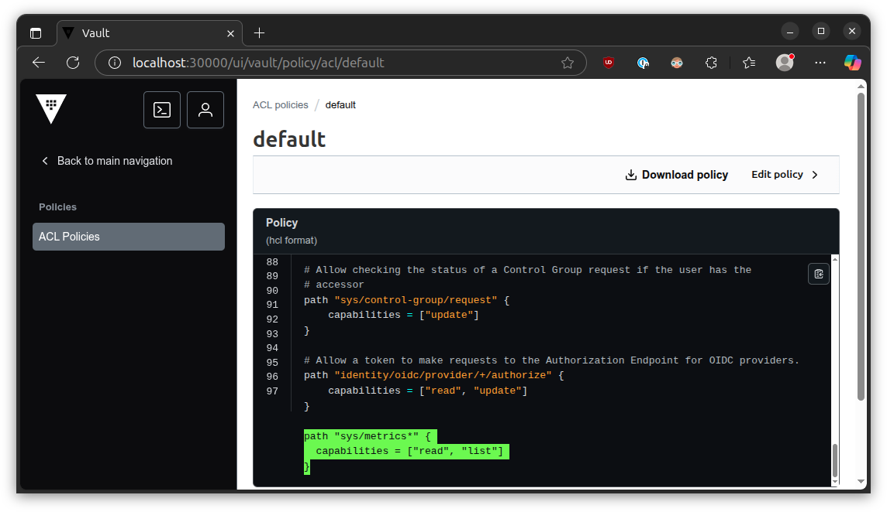

### (3) Datadog 배포(Helm)  

> 8w/shells/datadog
> 편의상 default 네임스페이스에 배포  

먼저 API키를 고르고 시크릿을 만듭니다. API는 가려두었습니다.  

```bash
helm repo add datadog https://helm.datadoghq.com  
helm repo update  
kubctl create secret generic datadog-secret --from-literal api-key=<DATADOG_API_KEY>  
```

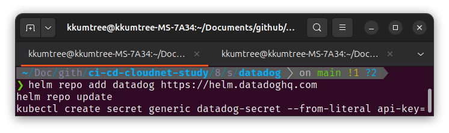  

배포하기 전에 실습용 kind이므로 값을 손봐야합니다.  
주요한 부분은 hostname 인식 쪽인데, 환경변수 설정을 통해 KIND 각 노드 이름으로 대체합니다.  
kubelet에 대한 TLS 검증도 스킵.  

이후는 `datadog.confd`에서 Auto Discovery를 활용하는 것인데,  
요약하자면, yaml 파일을 직접 만들어 Datadog Pod가 읽도록 하는 방식입니다.  
(물론 Vault 차트 배포 시, 어노테이션을 통해 인식하게 하는 방법도 있습니다. 기호에 맞게 취사선택)  

```yaml
datadog:
  (..)
  env:
    - name: DD_HOSTNAME
      valueFrom:
        fieldRef:
          fieldPath: spec.nodeName
  confd:
    vault.yaml: |-
      ad_identifiers:
        - vault
      init_config:
      instances:
        - use_openmetrics: false
          api_url: http://localhost:30000/v1
          no_token: true
  kubelet:
    tlsVerify: false
(..)
```

다 작성했다면 배포

```bash
helm install datadog-agent -f datadog-values.yaml datadog/datadog
```

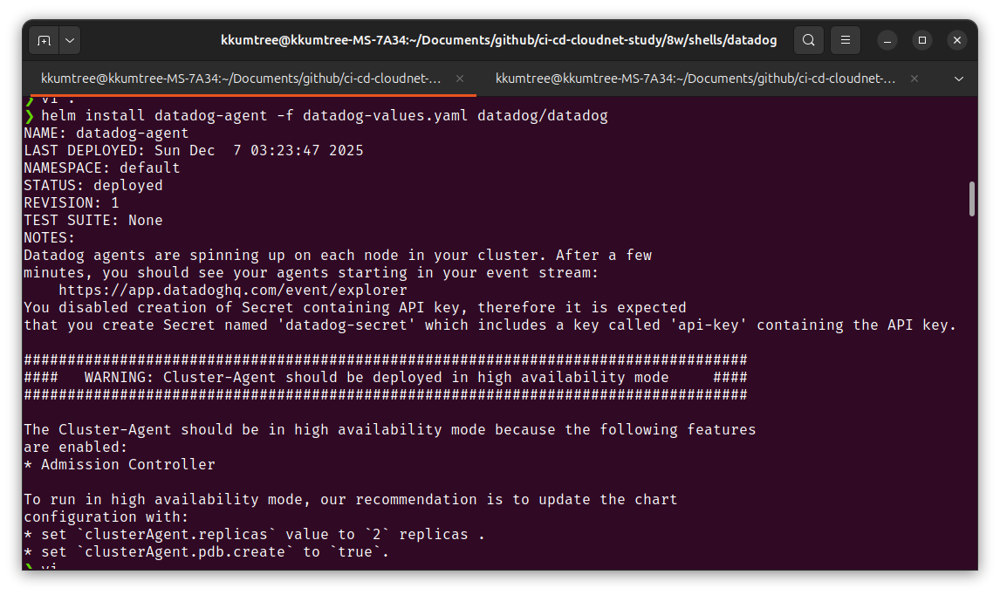  

이후에는 대시보드에서 주요 메트릭을 확인할 수 있습니다.  

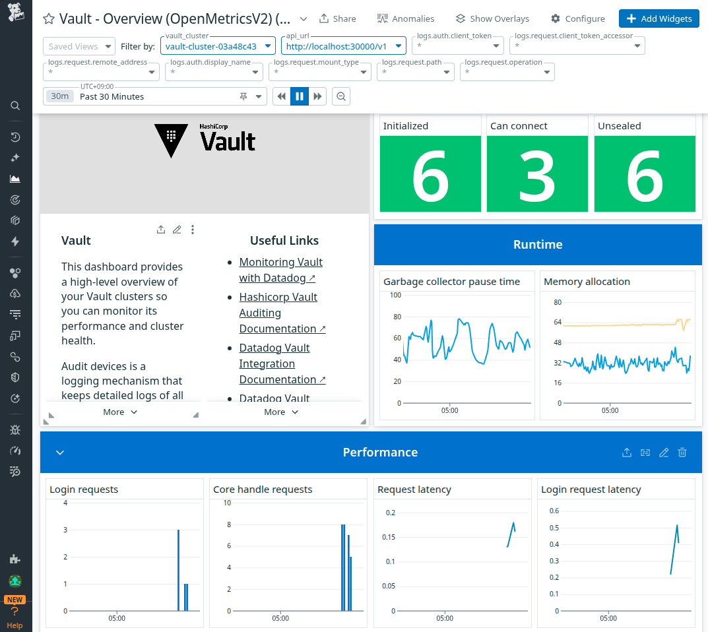

vault 배포의 경우에는 아래와 같이 기본적으로 확인가능 합니다.  

(Stateful Set)
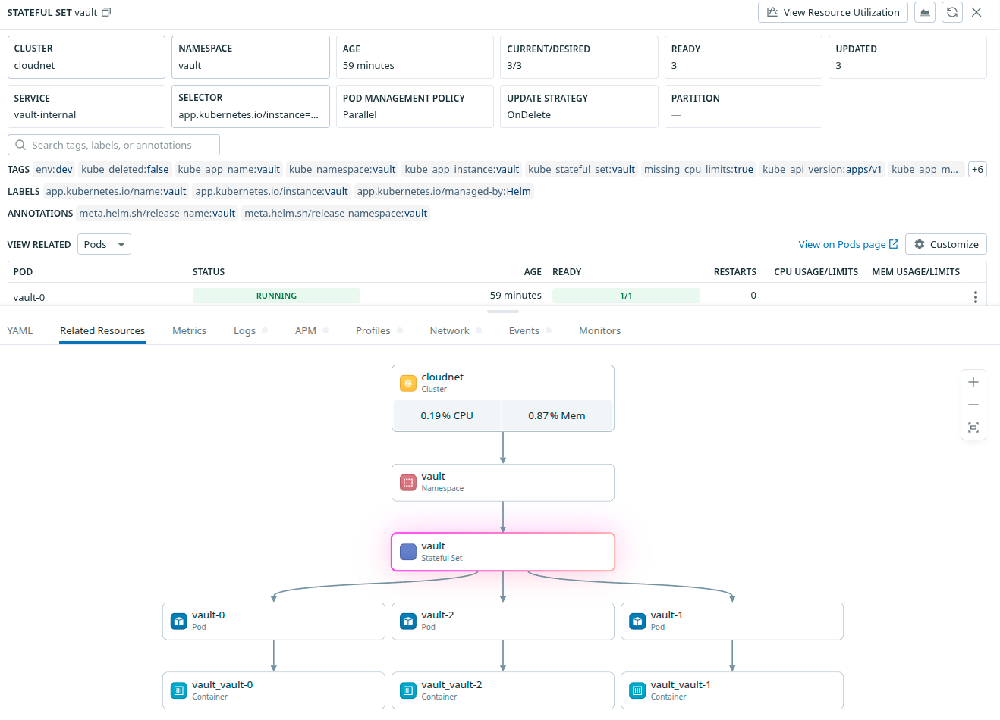  

(Pod)  
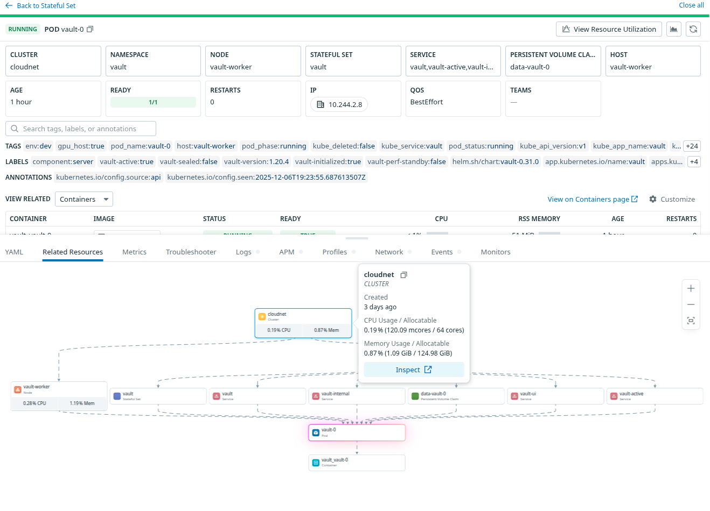
~~아무래도 kind로 배포한 환경이라 그런지 Node Pod 4개만큼 스펙이 뻥튀기되었습니다~~  

## Reference  

- [vault-helm/values.yaml - GitHub](https://github.com/hashicorp/vault-helm/blob/975c7abf9030178e0677ca57dc4fc8a73a0e19ef/values.yaml#L901-L971)  
- [Telemetry - Configuration | Vault](https://developer.hashicorp.com/vault/docs/configuration/telemetry)  
- [TCP listener configuration | Vault](https://developer.hashicorp.com/vault/docs/configuration/listener/tcp#configuring-unauthenticated-metrics-access)
- [What is the difference between ha.config and ha.raft.config in vault-helm values.yaml - Hashicorp Discuss](https://discuss.hashicorp.com/t/what-is-the-difference-between-ha-config-and-ha-raft-config-in-vault-helm-values-yaml/26724)  
- [Raft config override for Helm chart - Hashicorp Discuss](https://discuss.hashicorp.com/t/raft-config-override-for-helm-chart/59917)  
- [prometheus is not enabled% #121 - GitHub(vault-helm)](https://github.com/hashicorp/vault-helm/issues/121)
- [helm-charts/values.yaml - GitHub(Datadog)](https://github.com/DataDog/helm-charts/blob/92fd908e3dd7b7149ce02de1fe859ae5ac717d03/charts/datadog/values.yaml#L315-L330)  
- [integrations-core/conf.yaml.example - GitHub(Datadog)](https://github.com/DataDog/integrations-core/blob/master/vault/datadog_checks/vault/data/conf.yaml.example)  
- [Kubernetes and Integrations(Helm) - Datadog](https://docs.datadoghq.com/containers/kubernetes/integrations/?tab=helm#configuration)  
- [Vault - Datadog](https://docs.datadoghq.com/integrations/vault/?tab=containerized)
- [Monitoring Vault with Datadog | Vault](https://developer.hashicorp.com/vault/tutorials/archive/monitoring-vault-with-datadog)  
- [Enable Vault telemetry | Vault](https://developer.hashicorp.com/vault/docs/internals/telemetry/enable-telemetry)  
